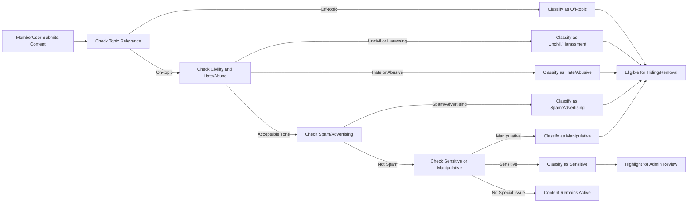

# Domain-Specific Business Rules for Economic/Political Discussions

## 1. Introduction and Scope

Domain-specific business rules define how the **discussionBoard** service handles content that relates to economic and political topics. These rules specify what kinds of content are considered on-topic, what kinds of conduct are acceptable, and which types of content require moderation or removal.

THE discussionBoard service SHALL apply these rules consistently to all user-submitted content (articles, comments, and attachments) in addition to general moderation, reporting, and permission rules.

THE discussionBoard service SHALL express domain rules in business terms only and SHALL leave all technical implementation details to the development team.

## 2. Relationship to Other Rules

Domain-specific rules operate together with general moderation and access control.

- THE domain rules for discussionBoard SHALL complement the content moderation and reporting rules that define how content is reported, reviewed, and transitioned between Active, Hidden, and Deleted states.
- THE domain rules for discussionBoard SHALL be applied consistently with actor definitions (guestUser, memberUser, adminUser) and their permissions.
- WHEN domain rules indicate that content violates topic, civility, hate/harassment, spam, or sensitive-content restrictions, THE moderation process SHALL treat that content as eligible for moderation actions according to the moderation rules.

## 3. Domain Context: Economic and Political Topics

Economic and political topics are the primary focus of discussionBoard.

- THE discussionBoard service SHALL treat content as in-scope when it relates to economic or political systems, events, policies, data, or analysis.
- THE discussionBoard service SHALL support discussion on, but not limited to:
  - Macroeconomic topics such as taxation, government spending, inflation, and employment.
  - Microeconomic topics such as markets, competition, and regulation.
  - Political topics such as elections, public policies, parties, and institutions.
  - International topics such as trade, diplomacy, and geopolitical strategies.

## 4. Topic and Category Rules

### 4.1 On-Topic Content

On-topic content contributes to structured, thematic discussion of economics and politics.

- THE discussionBoard service SHALL classify an article as on-topic when the article primarily discusses economic or political subjects, including data, events, policies, or analysis.
- THE discussionBoard service SHALL classify a comment as on-topic when the comment primarily responds to or elaborates on economic or political aspects of the article or thread in which it appears.
- WHEN memberUser submits content that combines personal experience with economic or political analysis (for example, describing how a policy affects them), THE discussionBoard service SHALL treat that content as on-topic as long as the economic or political aspect is substantial.

### 4.2 Off-Topic Content

Off-topic content does not meaningfully relate to economics or politics.

- THE discussionBoard service SHALL classify content as off-topic when it does not contain any meaningful economic or political subject matter.
- WHEN memberUser submits an article or comment that focuses primarily on personal hobbies, entertainment, unrelated products, or private matters with no substantive link to economic or political issues, THE discussionBoard service SHALL classify the content as off-topic.
- WHEN content is classified as off-topic, THE moderation process SHALL allow adminUser to hide or remove the content according to moderation rules.
- WHERE off-topic content is harmless and low volume, THE moderation process MAY allow adminUser to apply a lenient action, such as a warning or light deprioritization, instead of immediate removal.

### 4.3 Low-Quality Topic Content

Some content is technically on-topic but offers very low discussion value.

- THE discussionBoard service SHALL classify content as low-quality topic content when it consists mostly of slogans, memes, or provocative one-liners without explanation or context.
- WHEN content is classified as low-quality topic content, THE moderation process SHALL allow adminUser to deprioritize, warn, or remove the content according to configuration, while keeping the rules simpler than complex ranking systems.

## 5. Civility and Respectful Communication

### 5.1 General Civility Rules

Economic and political discussions may involve disagreement, but content must remain respectful.

- THE discussionBoard service SHALL require that users focus criticism on ideas, policies, or behavior rather than on personal attacks against other users or groups.
- WHEN content includes direct personal insults, degrading name-calling, or vulgar expressions aimed at another user or group of users, THE discussionBoard service SHALL classify the content as uncivil.
- WHEN content is classified as uncivil, THE moderation process SHALL allow adminUser to hide or remove the content and, if necessary, apply user-level restrictions according to moderation rules.

### 5.2 Harassment

Harassment is targeted, repeated, or severe hostility directed at individuals or groups.

- THE discussionBoard service SHALL classify content as harassment when it targets a specific user or identifiable group of users with repeated or severe hostile messages, mocking, or threats unrelated to substantive argument.
- WHEN content is classified as harassment, THE moderation process SHALL allow adminUser to hide or remove the content and to consider account-level actions such as warnings, posting restrictions, or bans.

## 6. Hate and Abuse Rules

### 6.1 Hate Speech Definition (Service-Level)

For discussionBoard, hate speech is defined at a high level as content that attacks or degrades individuals or groups based on inherent characteristics, such as ethnicity, nationality, religion, gender, gender identity, sexual orientation, or disability.

- THE discussionBoard service SHALL prohibit content that promotes or glorifies violence, exclusion, or serious harm against individuals or groups based on inherent characteristics.
- THE discussionBoard service SHALL classify content as hate or abusive content when it includes explicit slurs, dehumanizing language, or calls for segregation or exclusion of individuals or groups based on inherent characteristics.

### 6.2 Handling Hate and Abusive Content

- IF content is classified as hate or abusive content, THEN THE moderation process SHALL treat that content as high-priority for review and removal.
- WHEN adminUser confirms that content is hate or abusive content, THE moderation process SHALL allow adminUser to hide or delete the content and to consider account-level actions such as posting restrictions, suspension, or permanent bans according to account rules.
- WHERE content discusses demographic groups in a neutral or analytical way (for example, presenting policy impacts or statistics) without slurs, dehumanizing language, or calls for harm, THE discussionBoard service SHALL allow that content, even if it is controversial, provided that civility rules are followed.

## 7. Misinformation and Manipulative Content (Generic Rules)

Economic and political discussions often include disagreement about facts and predictions. The service does not attempt to be a final arbiter of truth but does limit clear manipulation.

- THE discussionBoard service SHALL allow opinions, interpretations, and predictions about economic and political issues, including contested viewpoints, as long as they comply with civility and safety rules.
- THE discussionBoard service SHALL classify content as manipulative when it intentionally fabricates evidence or quotes and attributes them falsely to real individuals, organizations, or sources.
- IF content includes fabricated quotes or falsified data falsely attributed to real people or institutions in a way that appears intended to mislead readers, THEN THE moderation process SHALL treat that content as manipulative and eligible for removal or correction.
- WHERE content presents disputed information without clear evidence of fabrication or intentional deception, THE discussionBoard service SHALL treat the content as contested information and SHALL not automatically classify it as prohibited solely on that basis.

## 8. Spam and Advertising Rules

### 8.1 Definition of Spam

Spam is repetitive, irrelevant, or bulk content primarily aimed at promotion or disruption rather than discussion.

- THE discussionBoard service SHALL classify content as spam when its primary purpose is to direct users to external sites, products, or services with minimal or no economic or political discussion.
- WHEN memberUser repeatedly posts substantially similar promotional or link-heavy content across multiple articles or comments within a short period, THE discussionBoard service SHALL classify this pattern as potential spam behavior.

### 8.2 Commercial Content in Context

Economic discussions often mention companies, products, or markets, which can be legitimate.

- WHERE content discusses companies, products, or services as part of an economic or political analysis (for example, describing market power or policy impact), THE discussionBoard service SHALL treat the content as allowed, even if specific names or links appear.
- WHERE content’s primary structure is a review or advertisement with clear pricing, direct purchase links, referral codes, or contact details and only minimal or superficial economic or political discussion, THE discussionBoard service SHALL classify the content as advertising content.

### 8.3 Handling Spam and Advertising Content

- WHEN content is classified as spam or advertising content, THE moderation process SHALL allow adminUser to hide or remove the content and to warn the author.
- WHEN a memberUser repeatedly submits spam or advertising content after warnings, THE user restriction policy SHALL allow adminUser to apply posting restrictions or bans consistent with the suspension rules.

## 9. Sensitive or Highly Controversial Topics

### 9.1 Sensitive Topics

Sensitive topics include extreme political ideologies, violent conflicts, severe economic crises, and discussions involving severe human suffering.

- THE discussionBoard service SHALL allow discussion of sensitive economic and political topics when content complies with civility, hate/abuse, and spam rules.
- THE discussionBoard service SHALL classify content as sensitive when it describes extreme violence, severe human suffering, or highly polarizing events, even if the content itself is allowed.

### 9.2 Moderation Expectations for Sensitive Content

- WHEN content is classified as sensitive, THE moderation process SHALL make that content more visible to adminUser in moderation views or simple alerts, so that adminUser can review it more frequently if needed.
- WHERE sensitive content remains within all domain rules, THE discussionBoard service SHALL allow the content but MAY allow adminUser to label or deprioritize it according to simple configuration.
- IF sensitive content also violates hate, harassment, or violence rules, THEN THE moderation process SHALL treat it under the strictest applicable rule and SHALL allow adminUser to remove it and to apply account-level actions.

## 10. Actor Responsibilities Under Domain Rules

### 10.1 guestUser

- THE discussionBoard service SHALL allow guestUser to read on-topic and allowed content, including sensitive topics that remain within the rules.
- THE discussionBoard service SHALL prevent guestUser from posting content that could violate domain rules because guestUser cannot post at all under the general permission model.

### 10.2 memberUser

- THE discussionBoard service SHALL allow memberUser to create and edit their own content as long as that content complies with topic, civility, hate/abuse, spam, and sensitive-content rules.
- WHEN memberUser attempts to submit content that violates domain rules, THE submission process SHALL reject the content or flag it for moderation according to configuration and SHALL provide a generic explanation category such as "off-topic", "uncivil", "hate or abusive content", or "spam/advertising".
- WHEN memberUser accumulates multiple confirmed violations of domain rules in a defined time window, THE user restriction policy SHALL allow adminUser to apply posting restrictions, suspension, or permanent bans according to account rules.

### 10.3 adminUser

- THE discussionBoard service SHALL allow adminUser to view domain classifications for reported or flagged content (for example, off-topic, uncivil, hate/abusive, spam/advertising, manipulative, sensitive).
- THE discussionBoard service SHALL allow adminUser to hide, delete, or restore content based on domain classifications and moderation rules.
- THE discussionBoard service SHALL allow adminUser to apply user-level actions such as warnings, posting restrictions, suspensions, or permanent bans when domain rule violations are repeated or severe.

## 11. User Feedback and Transparency for Domain Rules

User-facing behavior must make domain rule decisions understandable without exposing internal details.

- THE discussionBoard service SHALL provide clear, short explanations to content authors whenever their content is rejected or removed due to domain rules, using high-level categories (for example, off-topic, uncivil, hate or abusive, spam/advertising, manipulative).
- WHEN content is removed after being visible, THE discussionBoard service SHALL ensure the author can see that the content has been removed or restricted and SHALL provide a generic reason category without disclosing internal moderation notes or details about other users.
- WHERE content is deprioritized or labeled as sensitive but remains accessible, THE discussionBoard service SHALL maintain consistency between the label or indication and the actual visibility behavior, so that content is not described as removed when it is still visible.

## 12. Simplicity and Performance Expectations for Domain Rules

Domain-specific rules must remain simple to apply and operate.

- THE discussionBoard service SHALL use a limited set of domain categories (such as on-topic, off-topic, uncivil, hate or abusive, spam/advertising, manipulative, sensitive) to avoid overcomplicated taxonomies.
- WHERE multiple domain categories could apply to the same content, THE moderation process SHALL select one primary category for user-facing explanations and MAY retain secondary categories for internal use.
- THE moderation process SHALL avoid multi-step escalation chains; adminUser SHALL be able to make direct decisions based on domain categories and apply actions in a small number of steps.
- WHEN domain-based classification is applied automatically (for example, basic pattern detection or keyword checks), THE moderation process SHALL still allow adminUser to override or correct these classifications.

## 13. Moderation Decision Flow Diagram (Domain Perspective)

Domain-specific classifications and flows in this specification guide how discussionBoard should treat economic and political content at the business-rule level, while leaving the technical implementation to the development team.