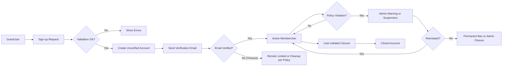

# User Account and Profile Rules for discussionBoard

## 1. Introduction

### 1.1. Scope of This Document
This document defines the business requirements for user accounts and profiles in the **discussionBoard** economic/political discussion service. It focuses on what the system must support for:
- Creating and closing member accounts.
- Maintaining a minimal user profile.
- Managing simple email and notification preferences.
- Suspending and reinstating accounts based on behavior.

THE discussionBoard SHALL define only the minimal account and profile features necessary for users to participate in economic and political discussions.

THE discussionBoard SHALL keep the account and profile model simple and avoid social features such as following, friend lists, and direct messaging.

### 1.2. Relationship to Other Documents
This document complements the user actor and permission description and other functional requirements:
- User actor roles and general permissions are defined in the **user actors and permissions** documentation.
- Article and comment features are defined in the **articles and comments requirements** documentation.
- Non-functional expectations such as performance, availability, and security are defined in the **non-functional requirements** documentation.

This document focuses only on business-level behavior for accounts and profiles, not on how those rules are implemented technically.

### 1.3. Guiding Principles (Simplicity and Minimalism)
For this simple discussion board, the philosophy is to keep the account and profile rules straightforward and predictable.

THE discussionBoard SHALL minimize the number of required fields for creating and maintaining a user account.

THE discussionBoard SHALL avoid complex onboarding flows and multi-step verification processes beyond basic email verification.

THE discussionBoard SHALL define clear, linear rules for suspension and reinstatement without multi-level review or appeal workflows inside the system.

THE discussionBoard SHALL describe only what the system must do, leaving all technical design and implementation decisions to the development team.

## 2. User Actors in the Context of Accounts and Profiles

This section describes how the previously defined actors relate to account and profile rules.

### 2.1. guestUser
- A **guestUser** is an unauthenticated visitor who does not have an account.
- A guestUser can browse public content but cannot create, edit, or delete any content.

WHEN a guestUser attempts to create an account, THE discussionBoard SHALL treat this as a valid sign-up attempt subject to all account creation rules.

IF a guestUser attempts any action that requires an account, THEN THE discussionBoard SHALL deny the action and indicate that sign-up or login is required.

### 2.2. memberUser
- A **memberUser** is a registered user with an active account.
- A memberUser can create, edit, and delete their own articles and comments, upload attachments to their own articles, and manage their profile and notification preferences.

THE discussionBoard SHALL require that a memberUser has a unique identifier and a verified email address as part of the account.

WHEN a memberUser updates profile information, THE discussionBoard SHALL apply all relevant validation and visibility rules described in this document.

### 2.3. adminUser
- An **adminUser** is an administrator who can manage users and content.
- An adminUser has extended capabilities such as suspending accounts, closing accounts in specific scenarios, and adjusting basic board-wide settings.

WHEN an adminUser performs account-related actions such as suspension, THE discussionBoard SHALL enforce the business rules in the suspension and reinstatement section.

WHERE an action involves modifying another user’s account state, THE discussionBoard SHALL allow only adminUser actors to perform that action.

## 3. Account Creation and Closure Requirements

### 3.1. Preconditions for Account Creation

THE discussionBoard SHALL allow any guestUser to attempt account creation, subject to minimal eligibility rules.

THE discussionBoard SHALL require that the user accepts the service terms and privacy policy during account creation.

IF a guestUser does not accept the service terms and privacy policy, THEN THE discussionBoard SHALL refuse to complete account creation.

WHERE legal age or jurisdiction rules apply externally, THE discussionBoard SHALL provide a field for age confirmation or eligibility confirmation but SHALL NOT enforce complex age verification beyond simple confirmation.

### 3.2. Sign-up Information Requirements

At minimum, the system needs a small set of fields to create a member account.

THE discussionBoard SHALL require the following information at sign-up:
- A unique email address.
- A credential for authentication (for example, a password defined elsewhere in technical documents).
- A display name or nickname shown publicly with posts and profile.
- Acceptance of terms and privacy policy.

THE discussionBoard SHALL treat the email address as the primary contact field for the account.

THE discussionBoard SHALL require that the display name or nickname is not empty and respects basic length and content rules.

IF a sign-up attempt uses an email address that is already associated with an existing account, THEN THE discussionBoard SHALL reject the sign-up and indicate that the email is already in use.

IF a sign-up attempt uses a display name that violates content validation rules (for example, contains prohibited words as defined in business rules), THEN THE discussionBoard SHALL reject the sign-up and request a different display name.

THE discussionBoard SHALL enforce reasonable minimum and maximum lengths for display names to avoid unusable or abusive values.

### 3.3. Email Verification and Activation Rules

Email verification ensures that a memberUser can receive notifications and that contact information is valid.

WHEN a new account is created, THE discussionBoard SHALL mark the account as unverified until the user completes email verification.

WHEN a new account is created, THE discussionBoard SHALL send a verification instruction to the provided email address.

IF the user completes the verification process within a reasonable time window, THEN THE discussionBoard SHALL mark the account as verified and fully active.

IF the user does not complete email verification within the defined time window, THEN THE discussionBoard SHALL continue to allow sign-in but MAY restrict specific actions that depend on verified email, such as certain notification features or recovery operations.

WHERE an email address is changed for an existing account, THE discussionBoard SHALL treat the new email address as unverified until the user completes verification, while retaining the previous verified status only for the old email until the change is fully confirmed.

IF the user fails to complete verification for a new email address, THEN THE discussionBoard SHALL continue using the currently verified email for critical communications.

### 3.4. Account Closure (User-Initiated)

Members may wish to leave the service and close their account.

WHEN a memberUser requests to close their account, THE discussionBoard SHALL require an explicit confirmation step before finalizing closure.

WHEN a memberUser successfully confirms account closure, THE discussionBoard SHALL mark the account as closed and prevent future sign-in with that account.

WHERE an account is marked as closed, THE discussionBoard SHALL retain existing articles, comments, and attachments according to content retention rules defined elsewhere, but SHALL ensure that future activity from that account is not possible.

IF a previously closed account owner attempts to sign in, THEN THE discussionBoard SHALL reject the sign-in and indicate that the account has been closed.

WHERE allowed by business policy, THE discussionBoard SHALL permit admins to restore a recently closed account upon explicit request from the original owner, provided that sufficient identity confirmation is achieved according to internal policy.

### 3.5. Account Closure (Admin-Initiated)

Admins may close accounts for policy violations or other operational reasons.

WHEN an adminUser decides to close an account, THE discussionBoard SHALL require confirmation to avoid accidental permanent closure.

WHERE an account is closed by an adminUser due to severe violations, THE discussionBoard SHALL treat the closure as permanent unless an explicit business decision is made to reinstate.

IF an account is closed by an adminUser, THEN THE discussionBoard SHALL prevent further sign-in and participation from that account while retaining historical content according to retention rules.

WHERE feasible, THE discussionBoard SHALL record the reason category for admin-initiated closure for internal reference (for example, repeated policy violations or legal request), without exposing sensitive internal notes to the public.

### 3.6. Data Retention Expectations After Closure

THE discussionBoard SHALL maintain a clear separation between account state and content visibility.

WHERE an account is closed, THE discussionBoard SHALL continue to show the user’s historical articles and comments unless content-specific rules (such as manual deletion or legal removal) require hiding them.

THE discussionBoard SHALL anonymize or reduce exposure of personally identifiable profile information for closed accounts where possible, while maintaining enough information to attribute past content in a consistent way (for example, retaining a non-editable label such as “Former Member” with their historical posts).

IF law or policy requires removal of all content associated with an account, THEN THE discussionBoard SHALL support content removal according to separate content management rules, beyond the scope of this document.

## 4. Profile Information Rules

### 4.1. Mandatory Profile Fields

THE discussionBoard SHALL treat the following profile fields as mandatory for a memberUser:
- Display name or nickname.
- Email address (stored as part of the account but reflected in profile management screens where appropriate).

WHEN a memberUser first logs in after sign-up, THE discussionBoard SHALL ensure that all mandatory profile fields are present and valid before allowing the user to proceed with normal use.

IF mandatory profile fields are missing or invalid, THEN THE discussionBoard SHALL require the user to correct them before continuing to general usage.

### 4.2. Optional Profile Fields

To keep the system simple, optional profile fields should be limited.

THE discussionBoard SHALL support a short free-text “bio” or self-introduction field that the memberUser can optionally fill in.

THE discussionBoard SHALL support an optional geographic or topical interest field in simple textual form, such as country or “main interest area,” without enforcing structured taxonomies.

WHERE optional fields are not provided, THE discussionBoard SHALL display nothing for those fields rather than placeholder text that implies missing data.

IF an optional profile field exceeds its maximum allowed length, THEN THE discussionBoard SHALL reject the update and request a shorter value.

### 4.3. Profile Visibility Rules

The board is public by nature, but privacy must be respected in a simple manner.

THE discussionBoard SHALL make the display name or nickname and any public bio visible along with the user’s posts and comments.

THE discussionBoard SHALL not publicly display the email address of any user to other users.

WHERE a profile field is marked as private (such as email or internal moderation notes), THE discussionBoard SHALL restrict visibility of that field to authorized roles such as adminUser.

THE discussionBoard SHALL not expose any internal identifiers, suspension flags, or admin-only notes in public profile views.

### 4.4. Profile Editing Rules

Members need to update their own profile as their information changes.

WHEN a memberUser edits their own profile, THE discussionBoard SHALL allow modifications only to fields that are explicitly defined as editable by members, such as display name, bio, and certain preferences.

WHERE a memberUser attempts to modify fields reserved for adminUser control (for example, role, suspension status, or internal flags), THE discussionBoard SHALL deny the change.

WHEN a memberUser successfully updates their profile, THE discussionBoard SHALL apply changes immediately to future views of that profile and associated content.

IF validation fails for any field during profile update, THEN THE discussionBoard SHALL reject the update and clearly indicate which fields need correction.

### 4.5. Validation Rules for Profile Fields

THE discussionBoard SHALL define minimum and maximum lengths for display names, bios, and any textual profile fields to avoid excessively long or empty values.

THE discussionBoard SHALL prevent the use of clearly abusive or prohibited terms in display names and bios according to the content guidelines defined in the domain-specific business rules document.

IF a profile update contains terms that violate content guidelines, THEN THE discussionBoard SHALL reject the update and instruct the user to remove or change the problematic content.

WHERE a profile field is designed to hold a geographic location or interest area, THE discussionBoard SHALL treat it as plain text and SHALL NOT attempt to infer location or store sensitive personal attributes beyond what the user explicitly provides.

## 5. Email and Notification Preferences (Simple)

### 5.1. Types of Notifications

The notification model is intentionally simple.

THE discussionBoard SHALL support at least the following notification categories:
- Service announcements and important policy updates.
- Activity on the user’s own content, such as replies to their articles or comments.
- Optional digest or summary of recent relevant activity.

WHERE a new notification category is introduced in the future, THE discussionBoard SHALL default it to a setting consistent with the most similar existing category to avoid surprising users.

### 5.2. Default Notification Settings

THE discussionBoard SHALL enable essential service announcements for all memberUser accounts and SHALL treat them as mandatory for critical events such as policy changes or security notifications.

THE discussionBoard SHALL enable notifications about activity on the user’s own content by default for new accounts.

WHERE digest or summary emails exist, THE discussionBoard SHALL default them to enabled or disabled according to business decision, but SHALL allow the user to change this preference later.

### 5.3. User Control over Notification Preferences

WHEN a memberUser accesses notification preferences, THE discussionBoard SHALL allow them to enable or disable non-essential notification categories individually.

IF a memberUser disables a notification category, THEN THE discussionBoard SHALL stop sending notifications of that category to the user, except for categories that are defined as mandatory, such as critical service announcements.

WHERE a memberUser attempts to disable mandatory notification categories, THE discussionBoard SHALL prevent this and explain that certain communications are required.

WHEN a memberUser updates notification preferences, THE discussionBoard SHALL apply the changes to subsequent notifications without retroactively modifying past notifications.

### 5.4. Unsubscribe and Email Change Rules

WHEN a memberUser uses an unsubscribe link from an email, THE discussionBoard SHALL treat this as a request to turn off the corresponding notification category for that account.

IF a memberUser unsubscribes from all optional categories, THEN THE discussionBoard SHALL continue to send only mandatory communications such as critical service announcements.

WHEN a memberUser changes their email address, THE discussionBoard SHALL update the destination for all future notifications subject to email verification rules.

IF an email change is pending verification, THEN THE discussionBoard SHALL continue to use the previously verified email for critical messages until the new email is verified or the change is cancelled.

## 6. Account Suspension and Reinstatement (Business Rules)

### 6.1. Reasons for Suspension

Suspension is a temporary restriction on account usage.

THE discussionBoard SHALL allow adminUser actors to suspend accounts for clear categories of reasons such as repeated policy violations, spam, or abuse.

THE discussionBoard SHALL store at least a high-level reason category for each suspension event for internal reference.

IF a user’s behavior repeatedly violates content or conduct rules, THEN THE discussionBoard SHALL allow adminUser to escalate from warnings to temporary suspension and, if necessary, to permanent bans.

### 6.2. Effects of Suspension on User Capabilities

WHEN a memberUser account is suspended, THE discussionBoard SHALL prevent the user from creating new articles, comments, or attachments.

WHILE an account is suspended, THE discussionBoard SHALL allow the user to sign in only if necessary for viewing or appealing information as defined by business policy, but SHALL block any content creation or editing actions.

WHILE an account is suspended, THE discussionBoard SHALL continue to display the user’s existing articles and comments unless separate content moderation rules require hiding or removal.

IF a suspended user attempts a disallowed action such as posting or editing content, THEN THE discussionBoard SHALL deny the action and inform the user that the account is currently suspended.

### 6.3. Suspension Communication Rules

WHEN an account is suspended, THE discussionBoard SHALL notify the affected user using the primary email address where possible, including at least a general reason category and duration if applicable.

THE discussionBoard SHALL avoid exposing detailed suspension reasons publicly on user profiles or posts.

WHERE a suspension has an expected end date, THE discussionBoard SHALL make it possible for adminUser to record the intended duration and SHALL automatically restore normal permissions after the suspension period ends.

### 6.4. Reinstatement Rules

WHEN a suspension period ends or an adminUser decides to reinstate an account, THE discussionBoard SHALL restore the memberUser’s ability to create and edit their own content.

IF an account was suspended due to specific content violations and the problematic content remains, THEN THE discussionBoard SHALL allow adminUser to decide whether to remove or keep that content according to moderation rules, independently of reinstatement of the account.

WHERE reinstatement occurs, THE discussionBoard SHALL retain an internal record of the past suspension for future reference without exposing these details to the public.

### 6.5. Permanent Bans

Permanent bans are used for severe or repeated violations.

WHEN an account is permanently banned, THE discussionBoard SHALL treat the account similarly to an admin-closed account, preventing future sign-in and content creation.

WHERE a permanent ban is applied, THE discussionBoard SHALL allow adminUser to decide whether to keep or hide the user’s past content according to moderation policies.

IF a permanently banned user attempts to sign in or create content via any remaining session, THEN THE discussionBoard SHALL deny the attempt and indicate that the account is permanently banned.

## 7. Permission Overview for Account and Profile Actions

### 7.1. Actor Capabilities by Action

THE discussionBoard SHALL respect the following high-level rules for account and profile actions:

- guestUser:
  - Can initiate account creation.
  - Cannot edit any profile.
  - Cannot suspend or reinstate any account.
- memberUser:
  - Can view and edit their own profile within allowed fields.
  - Can manage their own notification preferences.
  - Can initiate closure of their own account.
  - Cannot view or edit other users’ private account details.
  - Cannot change their own role or suspension status.
- adminUser:
  - Can view and manage all users’ account states (active, suspended, closed, banned).
  - Can suspend, reinstate, or permanently ban accounts according to business rules.
  - Can close accounts where necessary under policy.
  - Can view internal account metadata not visible to regular members.

WHERE any action involves changing another user’s account state, THE discussionBoard SHALL allow only adminUser actors to perform that action.

WHEN an actor attempts an account-related action outside their permissions, THE discussionBoard SHALL deny the action and provide a clear indication that permissions are insufficient.

### 7.2. Summary Permission Matrix

| Action                                         | guestUser | memberUser (self) | memberUser (others) | adminUser |
|-----------------------------------------------|-----------|-------------------|---------------------|-----------|
| Initiate account creation                     | ✅        | N/A               | N/A                 | ✅        |
| View own profile                              | N/A       | ✅                | N/A                 | ✅        |
| Edit own profile fields                       | N/A       | ✅                | N/A                 | ✅ (for any user) |
| Change own notification preferences           | N/A       | ✅                | N/A                 | ✅ (for any user if needed) |
| Close own account                             | N/A       | ✅                | N/A                 | ✅ (admin close any) |
| Suspend another user’s account                | ❌        | ❌                | ❌                  | ✅        |
| Reinstate another user’s account              | ❌        | ❌                | ❌                  | ✅        |
| Permanently ban another user                  | ❌        | ❌                | ❌                  | ✅        |
| View another user’s private account metadata  | ❌        | ❌                | ❌                  | ✅        |

## 8. Error Handling and Edge Cases (Account/Profile Specific)

### 8.1. Validation Failures during Sign-up and Profile Updates

IF a sign-up request omits required fields such as email, credential, or display name, THEN THE discussionBoard SHALL reject the sign-up and specify which fields are missing.

IF a sign-up or profile update uses invalid formats (for example, non-email syntax in the email field or illegal characters in the display name), THEN THE discussionBoard SHALL reject the request and indicate the invalid fields.

WHERE multiple validation errors exist in a single request, THE discussionBoard SHALL report all detected errors in a single response so the user can correct them together.

### 8.2. Attempts to Use Closed or Suspended Accounts

IF a closed account owner attempts to sign in or perform any action using stored credentials, THEN THE discussionBoard SHALL prevent access and indicate that the account is closed.

IF a suspended user attempts to perform content-related actions during suspension, THEN THE discussionBoard SHALL deny the action and indicate that the account is temporarily restricted.

WHERE an account is permanently banned, THE discussionBoard SHALL handle any sign-in or action attempts as forbidden and SHALL not restore access unless a business decision is made to lift the ban through adminUser intervention.

### 8.3. Conflicts around Email and Username Uniqueness

THE discussionBoard SHALL enforce uniqueness of email addresses across all active and closed accounts, unless business policy decides to free email addresses when accounts are fully removed.

IF a sign-up or profile update attempts to assign an email address that is already in use, THEN THE discussionBoard SHALL reject the change and inform the user that the email is already taken.

WHERE display name uniqueness is required according to business preference, THE discussionBoard SHALL enforce uniqueness and handle conflicts similarly by requesting the user to choose a different display name.

## 9. Non-functional Expectations Related to Accounts and Profiles

### 9.1. Performance Expectations

WHEN a user submits sign-up information, THE discussionBoard SHALL respond with success or detailed validation errors within a time that feels immediate to the user, typically within a few seconds in normal conditions.

WHEN a user updates profile or notification preferences, THE discussionBoard SHALL apply and confirm the update without noticeable delay under normal load.

WHILE the service is operating under typical traffic, THE discussionBoard SHALL maintain responsive account and profile operations so that users can manage their accounts without perceiving the system as slow or unresponsive.

### 9.2. Basic Privacy Expectations

THE discussionBoard SHALL limit exposure of personal information to what is necessary for the functioning of the simple discussion board.

THE discussionBoard SHALL ensure that email addresses and internal identifiers are not displayed publicly.

IF a user closes their account, THEN THE discussionBoard SHALL avoid exposing past profile details such as bio or location where such exposure is not necessary for understanding historical content.

WHERE data retention policies require keeping certain account records for operational or legal reasons, THE discussionBoard SHALL retain only the minimum information necessary to meet those requirements.

## 10. Mermaid Diagram: High-Level Account Lifecycle

