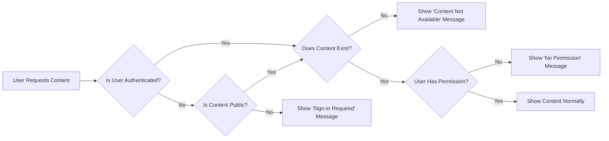
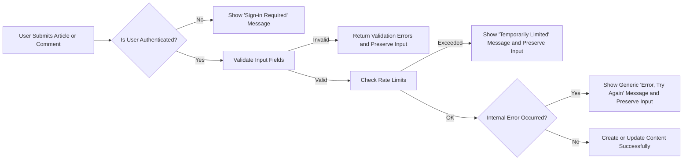

# Error Handling and Edge Case Requirements for discussionBoard

## 1. Introduction

### 1.1 Purpose

THE error-handling behavior of the **discussionBoard** service SHALL define clear, predictable responses for users when something goes wrong or behaves unusually.

THE discussionBoard service SHALL treat error handling and edge-case behavior as part of the business requirements for articles, comments, attachments, moderation, and user accounts, not as an afterthought.

THE discussionBoard service SHALL express error behavior in user-centric, non-technical terms so that backend developers can translate these requirements into implementation details without ambiguity.

### 1.2 Scope

THE error-handling requirements in this document SHALL apply to the following feature areas:

- Article creation, editing, deletion, viewing, listing, and search.
- Comment creation, editing, deletion, and viewing.
- Attachment upload, association, viewing, downloading, and deletion.
- Basic authentication and authorization checks for guestUser, memberUser, and adminUser.
- Moderation-related visibility changes such as hidden or deleted content.
- Simple rate limiting and protection against abusive usage patterns.

THE error-handling requirements SHALL focus on **what users experience** (messages, preserved input, visible results) rather than technical mechanisms (exceptions, HTTP codes, or logging formats).

### 1.3 Guiding Principles

- THE discussionBoard error behavior SHALL be **simple**, avoiding multi-step recovery flows.
- THE discussionBoard error behavior SHALL be **predictable**, giving similar responses for similar causes.
- THE discussionBoard error behavior SHALL be **safe**, preferring to prevent unintended writes over partial or corrupted updates.
- THE discussionBoard error behavior SHALL prioritize preserving user-authored text (articles, comments, profile fields) so users rarely lose their writing due to errors.

## 2. Common Concepts and Actors

### 2.1 User Actors

THE discussionBoard service SHALL consider the following actors when defining error behavior:

- **guestUser** – unauthenticated visitor who can read public content only.
- **memberUser** – authenticated regular user who can create and manage own content.
- **adminUser** – authenticated administrator who can manage any content and accounts.

WHEN an error or edge case depends on the actor’s role, THE error-handling behavior SHALL explicitly distinguish behavior for guestUser, memberUser, and adminUser.

### 2.2 Core Content Types

THE error-handling requirements SHALL cover these core content types:

- Articles – primary discussion posts about economic or political topics.
- Comments – text replies attached directly to an article.
- Attachments – images or files associated with an article.
- Reports – user-generated reports about problematic content (handled mainly in moderation rules but relevant for errors).

WHEN an error occurs in any operation that involves these content types, THE discussionBoard service SHALL apply the relevant rule from this document in addition to functional requirements from other documents.

## 3. Validation Error Scenarios

### 3.1 General Validation Principles

WHEN a user submits any data to create or update content, THE discussionBoard service SHALL perform validation **before** committing changes.

WHEN validation fails for any submitted field, THE discussionBoard service SHALL:
- Preserve the user-entered text fields (such as titles, bodies, comments) in the response context.
- Indicate clearly which fields are invalid.
- Provide short, human-readable messages per field.
- Avoid partially saving content that would leave the system in a confusing state.

IF multiple validation issues exist in a single submission, THEN THE discussionBoard service SHALL report **all** detectable validation errors together so the user can correct them in a single attempt.

### 3.2 Article Creation and Editing Validation

#### 3.2.1 Required Fields

WHEN a memberUser or adminUser submits an article creation request **without** a non-empty title, THE article-handling behavior SHALL:
- Reject the request.
- Preserve the submitted body text and any other valid fields.
- Return a clear validation message indicating that the title is required.

WHEN a memberUser or adminUser submits an article creation request **without** a non-empty body, THE article-handling behavior SHALL:
- Reject the request.
- Preserve the submitted title and other valid fields.
- Return a clear validation message indicating that the body is required.

WHEN both title and body are missing or contain only whitespace, THE article-handling behavior SHALL return separate validation messages for both fields in the same response.

WHEN a memberUser or adminUser attempts to edit an existing article and removes required data (such as making the title empty), THE article-handling behavior SHALL apply the same validation rules and error responses as for creation.

#### 3.2.2 Length Limits and Content Constraints

WHEN a submitted article title exceeds the configured maximum length, THE article-handling behavior SHALL:
- Reject the submission.
- Preserve the submitted title and body in the response context.
- Return a validation message that instructs the user to shorten the title.

WHEN a submitted article body exceeds the configured maximum length, THE article-handling behavior SHALL:
- Reject the submission.
- Preserve the submitted title and body.
- Return a validation message that instructs the user to shorten the body.

WHERE both fields exceed their limits, THE article-handling behavior SHALL present validation messages for both fields simultaneously.

#### 3.2.3 Category or Topic Validation

WHERE categories or tags are supported, THE article-handling behavior SHALL accept only allowed category values.

WHEN a submitted category does not belong to the allowed set, THE article-handling behavior SHALL:
- Reject the article creation or edit.
- Preserve all other valid fields.
- Return a validation message indicating that the category is invalid and must be changed.

### 3.3 Comment Creation and Editing Validation

#### 3.3.1 Required Body Text

WHEN a memberUser or adminUser submits a new comment with an empty or whitespace-only body, THE comment-handling behavior SHALL:
- Reject the submission.
- Preserve the attempted text in the response context for re-entry.
- Return a validation message stating that the comment cannot be empty.

WHEN a memberUser or adminUser attempts to edit an existing comment and sets the body to empty or whitespace-only, THE comment-handling behavior SHALL apply the same validation logic and error message.

#### 3.3.2 Length Limits

WHEN a comment body exceeds the configured maximum length, THE comment-handling behavior SHALL:
- Reject the creation or update.
- Preserve the attempted comment text.
- Return a validation message indicating that the comment is too long and must be shortened.

#### 3.3.3 Invalid Target Article

WHEN a memberUser or adminUser submits a comment for an article identifier that does not exist or is not visible to that actor, THE comment-handling behavior SHALL:
- Reject the comment.
- Return a message stating that the article is not available.

### 3.4 Attachment Upload Validation

#### 3.4.1 File Type

WHEN any actor attempts to upload an attachment with a file type outside the allowed set, THE attachment-handling behavior SHALL:
- Reject the upload.
- Preserve other valid attachments linked to the article.
- Return a validation message that clearly states the file type is not supported.

WHERE the user submits multiple attachments at once and some are of allowed types while others are not, THE attachment-handling behavior SHALL:
- Accept the valid attachments.
- Reject the invalid ones.
- Return validation feedback that identifies which files were rejected and why, without silently dropping them.

#### 3.4.2 File Size and Total Size

WHEN a single attachment exceeds the allowed maximum file size, THE attachment-handling behavior SHALL:
- Reject that attachment.
- Preserve other valid attachments.
- Return a message that clearly states the file is too large.

WHEN adding one or more attachments would cause the total size for an article’s attachments to exceed the configured maximum, THE attachment-handling behavior SHALL:
- Reject only the additional attachments that cause the total to exceed the limit.
- Keep existing attachments unchanged.
- Return a message that the attachment size limit for the article has been reached.

#### 3.4.3 Attachment Count Limit

WHEN adding one or more attachments would exceed the maximum number of attachments allowed per article, THE attachment-handling behavior SHALL:
- Reject additional attachments beyond the limit.
- Keep existing attachments intact.
- Return a message indicating that the article already has the maximum number of attachments.

### 3.5 Search and Filter Inputs

WHEN any actor submits a search query shorter than the configured minimum length, THE search-handling behavior SHALL:
- Reject that search request.
- Return a message indicating that the search term is too short.

WHEN any actor submits filter values that are invalid (such as an unknown category or unsupported sort field), THE search-handling behavior SHALL:
- Ignore only the invalid filter portions.
- Apply default safe filters and sorting.
- Optionally return a message indicating that some filters were not recognized, without exposing internal names or technical details.

## 4. Access and Permission Errors

### 4.1 General Permission Principles

THE discussionBoard service SHALL consistently enforce permissions for all operations, and SHALL respond with clear, user-friendly messages when access is denied.

WHEN access is denied due to lack of authentication or insufficient role, THE discussionBoard service SHALL avoid revealing confidential details such as the existence of private content or internal security checks.

### 4.2 Unauthenticated guestUser Actions

WHEN a guestUser attempts to perform an action that requires authentication (such as creating an article, commenting, uploading attachments, reporting content, or modifying any content), THE access-control behavior SHALL:
- Deny the action.
- Return a message explaining that sign-in is required to perform that action.

WHEN a guestUser attempts to access content that is available only to authenticated users (if such content exists by business rules), THE access-control behavior SHALL:
- Deny access.
- Return a message stating that the content is available only to registered members.

### 4.3 memberUser Permission Errors

WHEN a memberUser attempts to edit or delete an article that they do not own, THE access-control behavior SHALL:
- Deny the operation.
- Return a message indicating that the user does not have permission to change that article.

WHEN a memberUser attempts to edit or delete a comment that they do not own, THE access-control behavior SHALL:
- Deny the operation.
- Return a message indicating that the user does not have permission to change that comment.

WHEN a memberUser attempts to perform an administrative action reserved for adminUser (such as hiding another user’s content or suspending accounts), THE access-control behavior SHALL:
- Deny the operation.
- Return a message indicating that the action is restricted to administrators.

### 4.4 adminUser and Non-Existing Targets

WHEN an adminUser attempts to perform a moderation or management action on content that does not exist (for example, due to prior deletion), THE access-control behavior SHALL:
- Deny the operation.
- Return a message stating that the content cannot be found.

WHEN an adminUser attempts to perform an action on a user account that does not exist or has been fully removed, THE access-control behavior SHALL:
- Deny the operation.
- Return a message stating that the account cannot be found.

### 4.5 Session and Authentication Issues

WHEN a request is received with an expired or invalid authentication state, THE access-control behavior SHALL:
- Treat the actor as unauthenticated for that request.
- Deny any protected operation.
- Return a message indicating that the session has expired or that sign-in is required again.

IF an authentication token or credential is malformed or clearly invalid, THEN THE access-control behavior SHALL:
- Reject the request.
- Return a generic message that sign-in failed, without revealing technical details about token validation.

## 5. Missing or Deleted Content Scenarios

### 5.1 Articles That No Longer Exist

WHEN any actor attempts to access an article that has never existed or has been permanently deleted, THE content-access behavior SHALL:
- Return a result that indicates the article is not available.
- Avoid revealing internal identifiers or whether the article previously existed.

WHEN any actor follows an outdated link or bookmark to such an article, THE content-access behavior SHALL:
- Show a simple message such as "article not available".
- Allow the user to navigate back to the article list or perform a search.

### 5.2 Hidden or Soft-Deleted Articles

WHEN an article is hidden or soft-deleted by adminUser according to moderation rules, THE content-access behavior SHALL:
- Prevent guestUser and memberUser (other than possibly the author) from viewing the article’s content and attachments.
- Continue to allow adminUser to access the article for review, with a clear indication that it is hidden.

WHERE business rules allow the original author to know that their article has been moderated, THE content-access behavior SHALL:
- Allow the author memberUser to see that the article is no longer publicly visible.
- Present a generic explanation such as "This article is hidden due to policy" without exposing internal moderation details.

### 5.3 Deleted or Hidden Comments

WHEN a comment is permanently deleted, THE content-access behavior SHALL:
- Prevent the comment text from appearing in the comment list.
- Optionally show a placeholder or simply omit the comment, but SHALL follow one consistent approach throughout the service.

WHEN a comment is hidden or soft-deleted, THE content-access behavior SHALL:
- Prevent guestUser and regular memberUser from seeing the original text.
- Optionally show a placeholder message such as "Comment removed" according to the chosen display rule.
- Allow adminUser to view the comment for moderation purposes.

WHERE business rules allow, THE content-access behavior MAY allow the comment author to see that their comment was removed and present a generic reason category.

### 5.4 Paginated Lists with Removed Items

WHEN articles are removed or hidden, THE list-handling behavior SHALL:
- Adjust article lists so that each requested page still returns a coherent set of visible items.
- Avoid providing page numbers or navigation links that consistently lead to empty result sets.

WHEN comments are removed in a long discussion, THE list-handling behavior SHALL:
- Maintain a stable ordering of remaining comments.
- Avoid gaps or inconsistent numbering that would confuse users.

## 6. Attachment-Related Errors and Edge Cases

### 6.1 Missing or Unavailable Attachments

WHEN an article references an attachment whose underlying file is missing or cannot be accessed, THE attachment-handling behavior SHALL:
- Show the article and other attachments normally.
- Mark the specific attachment as unavailable or missing.
- Return a clear message when a user attempts to open that attachment, indicating that it cannot be accessed.

### 6.2 Deleted Attachments

WHEN an attachment has been deleted intentionally by the article owner or adminUser, THE attachment-handling behavior SHALL:
- Remove the attachment from the attachment list shown in the article view.
- Return a simple message indicating that the attachment is no longer available if a user attempts to use an old direct link.

### 6.3 Permission Issues for Attachments

WHEN a guestUser or memberUser attempts to access an attachment that is no longer accessible due to the related article being hidden or deleted, THE attachment-handling behavior SHALL:
- Deny access to the attachment.
- Indicate that the attachment is not available, without revealing additional internal reasons.

WHEN a memberUser attempts to modify or delete an attachment on an article they do not own, THE attachment-handling behavior SHALL:
- Deny the action.
- Indicate that only the owner or an administrator may manage attachments for that article.

### 6.4 Partial Failures During Attachment Operations

WHEN an article update includes both text changes and attachment changes, and attachment validation fails while text is valid, THE attachment-handling behavior SHALL:
- Apply a consistent business decision either to reject the full update or to separate text and attachment changes;
- Prefer a simple rule that is easy to communicate, such as rejecting the full update and preserving all submitted data in the response context.

IF the chosen rule is to reject the full update, THEN THE attachment-handling behavior SHALL:
- Keep the article unchanged.
- Preserve the updated text and attempted attachment information on the client side.
- Return validation messages only for the attachment errors.

## 7. Rate Limiting, Abusive Patterns, and Performance-Related Errors

### 7.1 Simple Posting Rate Limits

WHEN a memberUser posts articles or comments too frequently according to configured limits, THE rate-limiting behavior SHALL:
- Reject further create operations once the limit is exceeded.
- Preserve user input for rejected submissions so users do not lose text.
- Return a message explaining that posting is temporarily limited and indicate that they should wait before trying again.

WHEN a guestUser or memberUser triggers rate-limiting protection for non-content actions (such as repeated failed sign-in attempts), THE rate-limiting behavior SHALL:
- Temporarily block further attempts for that action.
- Return a message indicating that the action is temporarily blocked for security reasons, without exposing detailed thresholds.

### 7.2 Timeouts and Slow Operations

WHEN any content-related operation takes longer than a reasonable configured time limit, THE timeout-handling behavior SHALL:
- Fail the operation.
- Preserve user-submitted text for creation or editing operations.
- Return a message stating that the system is temporarily busy or slow and suggesting a retry.

### 7.3 Degradation Under High Load

WHILE the service experiences higher than normal load, THE degradation behavior SHALL:
- Prioritize basic read operations such as viewing article lists and article details.
- Allow developers to apply simple restrictions such as stricter rate limits on writes.

IF protective measures cause temporary rejection of some actions, THEN THE degradation behavior SHALL:
- Return messages that explain the temporary limitation.
- Avoid silent failures or confusing, inconsistent outcomes.

## 8. Error-Handling for Moderation, Reports, and Account Status

### 8.1 Errors Related to Reporting Content

WHEN a guestUser attempts to submit a content report, THE reporting behavior SHALL:
- Deny the action.
- Return a message stating that only registered members can submit reports.

WHEN a memberUser submits a report without providing a required reason or target content, THE reporting behavior SHALL:
- Reject the report.
- Return validation messages indicating which fields are missing or invalid.

WHEN a memberUser attempts to report content that has already been fully removed, THE reporting behavior SHALL:
- Reject the report.
- Indicate that the content has already been handled or is no longer available.

### 8.2 Moderation Actions on Already-Handled Content

WHEN adminUser attempts a moderation action (such as hide or delete) on content that is already in a final state (for example, already deleted), THE moderation behavior SHALL:
- Treat the action as idempotent.
- Return a result that indicates the content is already in the requested state, rather than creating an error.

### 8.3 Actions by Suspended or Banned Accounts

WHILE a memberUser account is in a suspended or banned state, THE account-status behavior SHALL:
- Prevent that user from creating or editing articles, comments, and attachments.
- Allow or deny sign-in according to the suspension rules defined elsewhere.

WHEN a suspended or banned user attempts to perform a restricted action, THE account-status behavior SHALL:
- Deny the action.
- Return a message that clearly states the account is restricted or banned.

## 9. Non-Functional Expectations for Error Handling

### 9.1 Consistency of Messages

THE error messages across all operations SHALL use consistent language and structure for similar error categories, such as:
- Validation errors.
- Missing or deleted content.
- Permission errors.
- Rate-limit and timeout errors.

WHEN similar errors occur in different parts of the system, THE error-handling behavior SHALL favor reusing common phrasing over creating slightly different messages that might confuse users.

### 9.2 Privacy and Security in Error Responses

IF an error involves authentication, authorization, or internal failures, THEN THE error-handling behavior SHALL:
- Avoid exposing internal system details, stack traces, or configuration data.
- Avoid confirming the existence of private content or accounts when that confirmation would disclose sensitive information.

WHERE necessary, THE error-handling behavior SHALL use generic descriptions such as "content not available" or "sign-in required" rather than precise technical explanations.

### 9.3 Logging and Monitoring (Business-Level)

THE discussionBoard service SHALL internally record significant error events and unusual patterns so adminUser or operators can investigate issues and abuse.

WHEN repeated errors suggest misuse (such as repeated failed sign-in attempts, repeated invalid uploads, or repeated rate-limit triggers), THE internal monitoring behavior SHALL:
- Record enough information to support moderation or security decisions.
- Avoid exposing this raw log data to regular users.

## 10. Mermaid Diagrams for Error Flows

### 10.1 Content Access Error Flow

### 10.2 Submission Error Flow

## 11. Success Criteria for Error Handling

THE error-handling system for discussionBoard SHALL be considered successfully implemented when all of the following conditions hold:

- WHEN users make mistakes in input, THE discussionBoard service SHALL provide clear validation feedback without losing their text.
- WHEN users lack permission, THE discussionBoard service SHALL deny the action with simple, understandable messages.
- WHEN content or attachments are missing, hidden, or deleted, THE discussionBoard service SHALL explain that the content is unavailable without exposing sensitive details.
- WHEN posting or other actions are limited to protect performance or prevent abuse, THE discussionBoard service SHALL communicate that limitation clearly and consistently.
- WHEN unexpected internal issues occur, THE discussionBoard service SHALL fail gracefully with generic messages, without leaking implementation details, and SHALL preserve user input where appropriate.

These requirements ensure that error and edge-case behavior remains predictable, user-friendly, and aligned with the overall simplicity of the economic/political discussionBoard service.