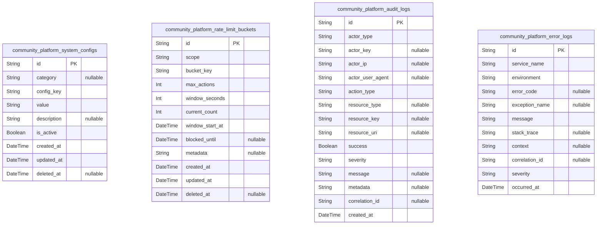
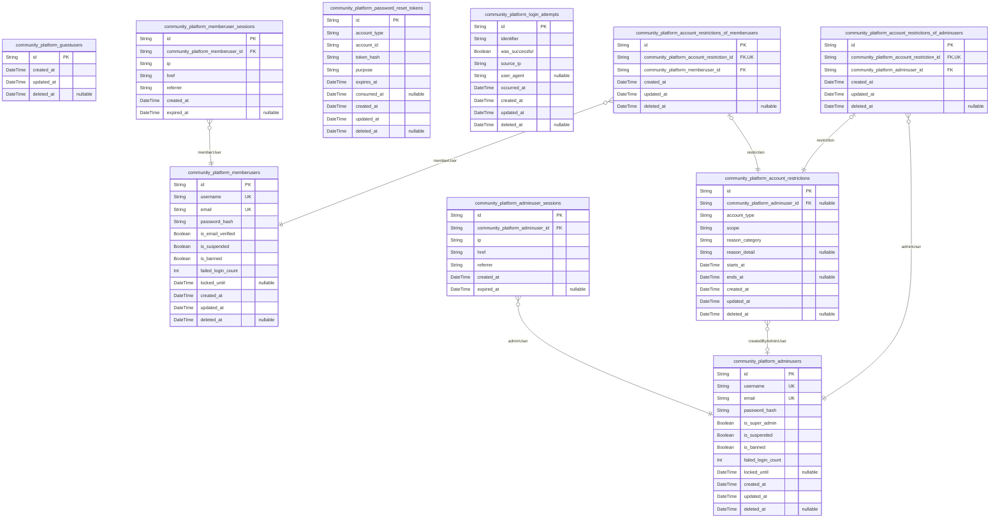
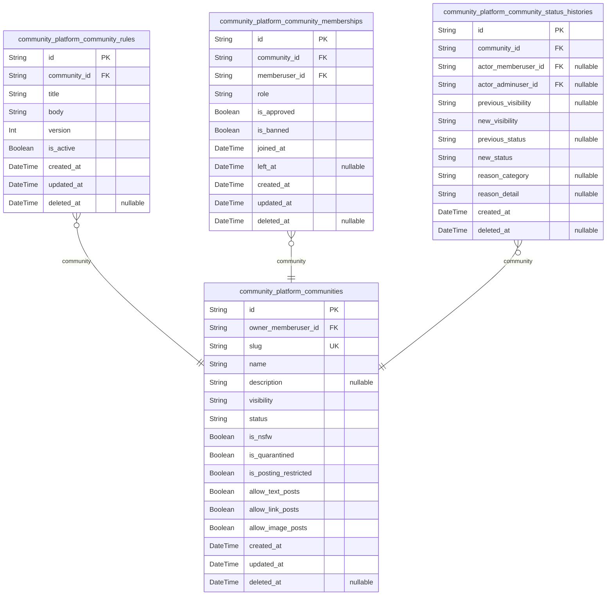
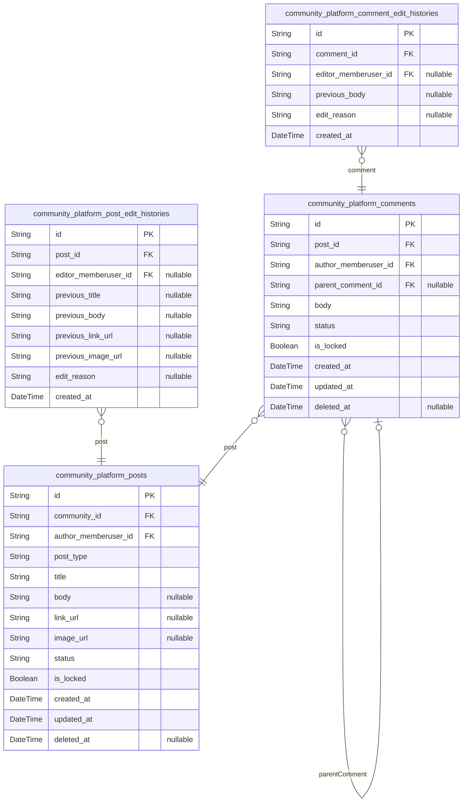
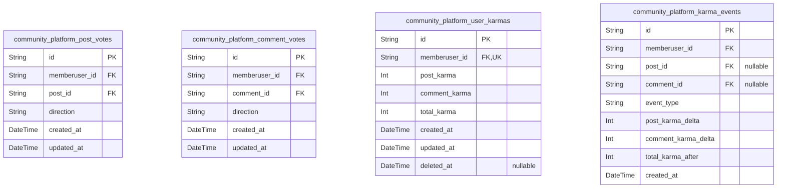
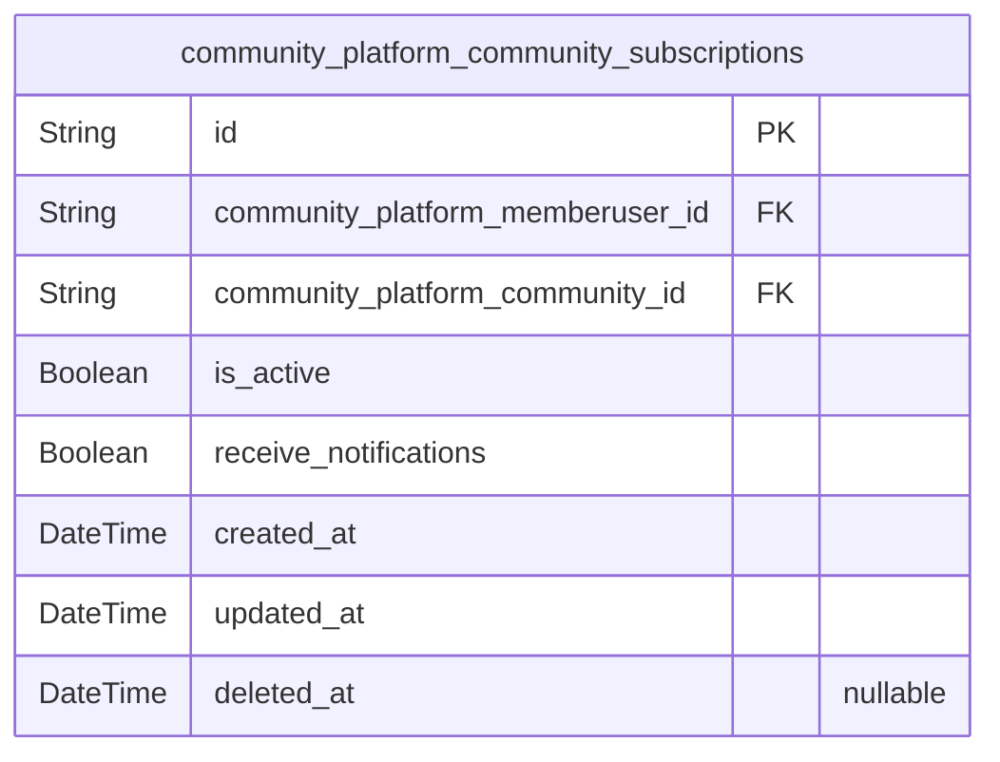
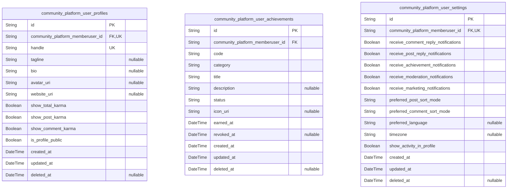
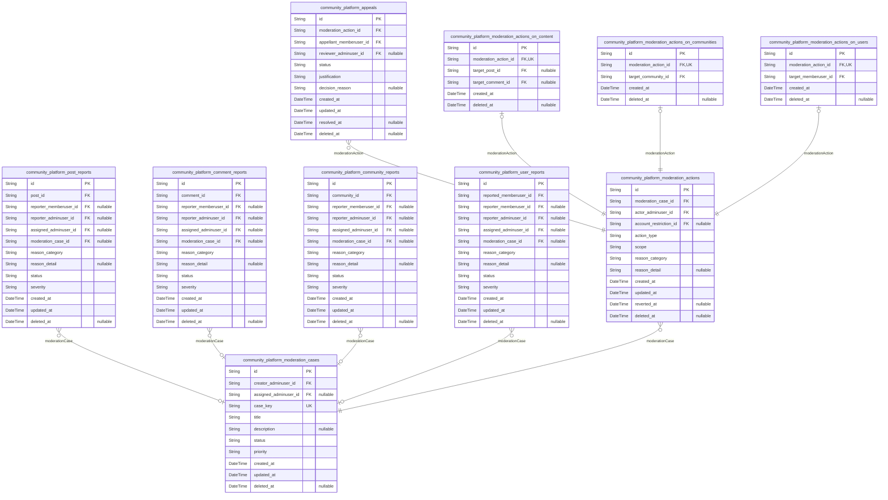
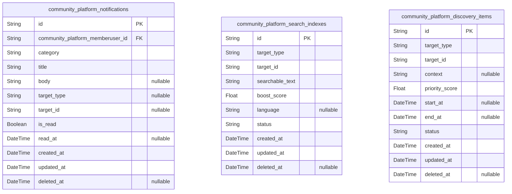

# Prisma Markdown

> Generated by [`prisma-markdown`](https://github.com/samchon/prisma-markdown)

- [Systematic](#systematic)
- [Actors](#actors)
- [Communities](#communities)
- [CoreContent](#corecontent)
- [Voting](#voting)
- [Subscriptions](#subscriptions)
- [Profiles](#profiles)
- [Moderation](#moderation)
- [Social](#social)

## Systematic

### `community_platform_system_configs`

System-wide configuration entries for the community platform.

Stores key–value style settings that control global behavior, feature
flags, limits, and other tunable parameters that are not tied to a single
business entity. Each row represents a specific configuration key scoped
by an optional category, allowing administrators to manage and audit
configuration changes over time.

Configurations are read frequently at runtime and updated infrequently by
operational tools, so timestamps and unique key constraints are critical.
This table is intentionally decoupled from domain entities and may be
referenced logically by name from multiple subsystems.

Properties as follows:

- `id`
  > Primary key for the system configuration entry. Unique identifier for
  > internal references and tooling.
- `category`
  > Optional logical grouping for the configuration key, such as "auth",
  > "rate_limit", or "ui". Useful for organizing and filtering configuration
  > entries.
- `config_key`
  > Business-level identifier for the configuration entry, such as
  > "max_login_attempts" or "default_karma_start". Must be unique within a
  > category when category is present, or globally unique when category is
  > null.
- `value`
  > Raw string representation of the configuration value. Application code is
  > responsible for parsing this into appropriate types such as numbers,
  > booleans, or JSON structures.
- `description`
  > Human-readable explanation of what this configuration controls and how it
  > should be used. Aids operational understanding and safe change
  > management.
- `is_active`
  > Indicates whether this configuration entry is currently considered
  > active. Inactive entries are ignored by runtime logic but kept for
  > history or planned reuse.
- `created_at`
  > Timestamp when this configuration entry was created. Used for audit and
  > change-tracking purposes.
- `updated_at`
  > Timestamp when this configuration entry was last updated. Reflects the
  > most recent change to its value or metadata.
- `deleted_at`
  > Soft deletion timestamp. When not null, the configuration entry is
  > considered logically removed and should not be used by runtime logic.

### `community_platform_rate_limit_buckets`

Rate limiting bucket state used to enforce abuse-prevention rules across
the platform.

Each row represents a logical rate limit bucket keyed by a combination of
scope fields such as actor identifiers, IP address, route or action key,
and a configured time window. The bucket tracks how many actions have
been performed and when the window resets, enabling consistent
enforcement of posting, commenting, voting, reporting, authentication, or
other rate-limited operations.

This table is purely technical and decoupled from specific business
entities. It can be queried by operational tools to inspect abuse
patterns or to reset buckets when policy changes.

Properties as follows:

- `id`
  > Primary key for the rate limit bucket entry. Surrogate identifier for
  > internal references and tooling.
- `scope`
  > Logical name of the rate limit scope, such as "post_creation",
  > "comment_creation", "vote_cast", "report_submit", or "login_attempt".
  > Used to distinguish different rate-limit rules.
- `bucket_key`
  > Opaque key that uniquely identifies the rate limit subject within a
  > scope. Typically derived from actor identifiers, IP address, user agent,
  > route, or community, but stored as a string to avoid direct foreign-key
  > coupling.
- `max_actions`
  > Maximum number of allowed actions within a single window for this bucket
  > according to policy.
- `window_seconds`
  > Duration of the rate limit window in seconds. Combined with
  > window_start_at to define the active period for this bucket.
- `current_count`
  > Number of actions recorded in the current window for this bucket. When
  > this reaches or exceeds max_actions, further actions should be blocked
  > until the window resets.
- `window_start_at`
  > Timestamp when the current rate limit window started for this bucket.
  > Used together with window_seconds to compute the window end and reset
  > behavior.
- `blocked_until`
  > Optional timestamp until which this bucket is explicitly blocked
  > regardless of count, for example after severe abuse. When not null and in
  > the future, actions must be rejected.
- `metadata`
  > Optional serialized metadata providing additional context about the
  > bucket, such as reason for manual blocking or encoded breakdown by actor
  > type. Treated as an opaque string by the database.
- `created_at`: Timestamp when this rate limit bucket entry was first created.
- `updated_at`
  > Timestamp when this rate limit bucket entry was last updated, for example
  > when counts change or block status is modified.
- `deleted_at`
  > Soft deletion timestamp. When not null, the bucket is considered inactive
  > and should not be used for future rate-limit evaluations.

### `community_platform_audit_logs`

General-purpose audit log entries capturing significant user and
administrative actions across the community platform.

Each row represents a single audited event, such as account changes,
moderation decisions, configuration updates, or other sensitive
operations. The log records who performed the action, what was targeted,
high-level action classification, contextual metadata, and the time of
occurrence.

This table is write-heavy and read for investigations, compliance, and
debugging. It intentionally avoids hard foreign-key coupling to business
tables, instead using generic identifiers and URIs so that the audit
trail remains valid even if domain schemas evolve.

Properties as follows:

- `id`
  > Primary key for the audit log entry. Unique identifier for referencing
  > specific events in investigations or tooling.
- `actor_type`
  > Type of actor that performed the action, such as "guestUser",
  > "memberUser", "adminUser", or a system process identifier. Used to
  > interpret actor_key correctly.
- `actor_key`
  > Opaque identifier for the actor within its type, such as a member user
  > ID, admin ID, or external system name. Stored as string to avoid tight
  > coupling to specific actor tables.
- `actor_ip`
  > IP address observed for the actor when the action occurred. Helps with
  > security investigations and abuse analysis.
- `actor_user_agent`
  > User agent string or client identifier associated with the action. Useful
  > for diagnosing client-specific issues and detecting automated behavior.
- `action_type`
  > High-level classification of the action, such as "login", "logout",
  > "password_change", "post_created", "comment_removed",
  > "moderation_decision", or "config_update".
- `resource_type`
  > Type of resource the action targeted, such as "community", "post",
  > "comment", "profile", or "system". Provides semantic grouping for
  > queries.
- `resource_key`
  > Opaque identifier of the targeted resource within its type, such as a
  > specific post ID or community ID, stored as string to remain agnostic of
  > domain schemas.
- `resource_uri`
  > Optional URI that points to the resource or API route associated with the
  > action, for example a canonical URL or internal route path.
- `success`
  > Indicates whether the action completed successfully from a business
  > perspective. Failed attempts remain logged for security visibility.
- `severity`
  > Severity level of the event, such as "info", "warning", or "error". Used
  > to filter audit streams for operational dashboards.
- `message`
  > Short human-readable summary of the event. Provides at-a-glance
  > understanding without inspecting the full payload.
- `metadata`
  > Optional serialized metadata with structured context about the action,
  > such as previous and new values, rule identifiers, or correlation tokens.
  > Interpreted by application logic, not by the database.
- `correlation_id`
  > Optional identifier used to correlate this audit event with other logs
  > and traces from the same logical request or workflow.
- `created_at`
  > Timestamp when the audited action occurred and was recorded. Primary
  > ordering key for time-based queries and retention policies.

### `community_platform_error_logs`

Technical error log entries capturing failures and exceptions occurring
within the community platform backend.

Each row represents a single error event or exception, recording where it
occurred, how it was classified, and contextual data to aid debugging.
This includes error codes, exception names, stack trace summaries, and
arbitrary serialized payloads or environment context.

The table is optimized for time-based queries and filtering by severity
or subsystem. It is decoupled from domain models and may be correlated
with audit logs or external monitoring systems via correlation
identifiers.

Properties as follows:

- `id`
  > Primary key for the error log entry. Unique identifier that allows tools
  > and operators to reference a specific error event.
- `service_name`
  > Name of the service or logical subsystem where the error occurred, such
  > as "api_gateway", "community_service", or "auth_service".
- `environment`
  > Runtime environment in which the error occurred, such as "development",
  > "staging", or "production". Useful for isolating environment-specific
  > issues.
- `error_code`
  > Optional application-level error code or classification token, such as
  > "AUTH_INVALID_CREDENTIALS" or "DB_TIMEOUT".
- `exception_name`
  > Optional name of the exception or failure type, such as a class or
  > symbolic identifier provided by the runtime.
- `message`
  > Primary human-readable error message summarizing the failure. Often
  > derived from the thrown exception or error object.
- `stack_trace`
  > Optional text representation of the stack trace or call stack at the
  > point of failure. May be truncated based on storage constraints.
- `context`
  > Optional serialized context payload, such as request identifiers, input
  > snapshots, or configuration values relevant to the failure.
- `correlation_id`
  > Optional identifier used to link this error to other logs, traces, or
  > audit events from the same logical request or workflow.
- `severity`
  > Severity level of the error, such as "debug", "info", "warning", "error",
  > or "critical". Used to prioritize and filter error streams.
- `occurred_at`
  > Timestamp when the error occurred. Used as the primary time dimension for
  > error monitoring and retention policies.

## Actors

### `community_platform_guestusers`

Conceptual representation of unauthenticated guest visitors.

Provides a minimal identity anchor for scenarios where business logic or
analytics want to associate behavior with a pseudo-identity before full
registration.

This table does not participate in authentication and does not store
credentials. It only offers a surrogate identifier that other components
may reference for correlation, A/B experiments, or migration paths, while
respecting that guestUser has read-only capabilities.

Properties as follows:

- `id`
  > Primary key. Surrogate UUID that uniquely identifies a conceptual
  > guestUser pseudo-account.
- `created_at`
  > Timestamp when this guestUser surrogate record was created. Used for age
  > indicators and time-based analytics.
- `updated_at`
  > Timestamp when this guestUser surrogate record was last updated.
  > Typically changes when metadata is attached by higher-level systems.
- `deleted_at`
  > Soft deletion timestamp. When not null, the guestUser surrogate is
  > considered inactive and should not be referenced by new logic.

### `community_platform_memberusers`

Registered community members who participate as memberUser actors.

Stores authentication credentials, core account state, and basic status
flags required for enforcing permissions, bans, suspensions, and
rate-limit related policies.

Other domains such as posts, comments, votes, subscriptions, profiles,
and reports reference this table to attribute actions and content to
specific memberUser identities.

Properties as follows:

- `id`: Primary key. Unique identifier for the memberUser account.
- `username`
  > Public handle for the memberUser. Must be unique and satisfy platform
  > username rules, including normalization and prohibited word checks.
- `email`
  > Contact email address for the memberUser used for notifications and
  > password resets. Must be unique among active memberUser accounts.
- `password_hash`
  > Hashed representation of the memberUser secret credential used for login.
  > Plain-text passwords must never be stored.
- `is_email_verified`
  > Indicates whether the memberUser has successfully completed email or
  > identity verification according to policy.
- `is_suspended`
  > Indicates whether the account is temporarily suspended from performing
  > some or all authenticated actions, as a fast-path flag synchronized with
  > restriction records.
- `is_banned`
  > Indicates whether the account is permanently banned from logging in or
  > performing authenticated operations.
- `failed_login_count`
  > Counter of recent consecutive failed login attempts used for lockout and
  > throttling logic. Higher level services reset or decay this according to
  > policy.
- `locked_until`
  > Optional timestamp until which login attempts should be blocked due to
  > excessive failures or security events.
- `created_at`: Timestamp when the memberUser account was created.
- `updated_at`: Timestamp when the memberUser account record was last updated.
- `deleted_at`
  > Soft deletion timestamp. When not null, the account is considered
  > deactivated or deleted from normal use but may be retained for lifecycle
  > and moderation purposes.

### `community_platform_adminusers`

Platform-level administrative accounts acting as adminUser.

These accounts have elevated permissions for moderation, policy
enforcement, and configuration. They follow similar authentication
patterns to memberUser but may have different operational handling and
auditing.

Other domains reference this table when recording moderation actions,
administrative configuration changes, or security-sensitive operations.

Properties as follows:

- `id`: Primary key. Unique identifier for the adminUser account.
- `username`
  > Administrative handle for the adminUser account. Must be unique and
  > follow stricter naming policies if required.
- `email`
  > Administrative contact email for the adminUser account, used for security
  > alerts and password resets. Must be unique among adminUser accounts.
- `password_hash`
  > Hashed secret used for authenticating the adminUser. Plain-text
  > credentials must never be stored.
- `is_super_admin`
  > Indicates whether this adminUser has the highest level of administrative
  > authority, capable of managing other admins and global policies.
- `is_suspended`
  > Indicates whether the administrative account is temporarily suspended
  > from performing administrative operations.
- `is_banned`
  > Indicates whether the administrative account is permanently disabled from
  > logging in or using admin capabilities.
- `failed_login_count`
  > Counter of recent consecutive failed login attempts for this adminUser,
  > used for lockout and alerting.
- `locked_until`
  > Optional timestamp until which login attempts for this adminUser should
  > be prevented due to security or abuse controls.
- `created_at`: Timestamp when the adminUser account was created.
- `updated_at`: Timestamp when the adminUser account record was last updated.
- `deleted_at`
  > Soft deletion timestamp. When not null, the adminUser is considered
  > deactivated or removed from ordinary use while keeping audit history
  > intact.

### `community_platform_memberuser_sessions`

Session records for authenticated memberUser actors.

Each row represents a login session created after successful
authentication. It captures minimal connection context required by the
session table pattern and supports audit and security analysis.

Sessions are many-to-one with memberUser accounts and are typically
created and expired frequently without direct user management APIs.

Properties as follows:

- `id`: Primary key. Unique identifier for the memberUser session.
- `community_platform_memberuser_id`
  > Foreign key referencing the authenticated memberUser that owns this
  > session. [community_platform_memberusers.id](#community_platform_memberusers).
- `ip`
  > IP address from which the session was established. Used for security
  > investigations and anomaly detection.
- `href`
  > Full URL (or representative href) that initiated the session creation,
  > such as the login page or redirect target.
- `referrer`
  > Referrer URL indicating where the user came from when initiating the
  > session, for security and analytics.
- `created_at`: Timestamp when this session was created, marking the login time.
- `expired_at`
  > Timestamp when this session expired or was invalidated. Null while the
  > session is still considered active.

### `community_platform_adminuser_sessions`

Session records for authenticated adminUser actors.

Each row represents an administrative login session. Given the
sensitivity of admin actions, these sessions are critical for audit
trails and security incident investigations.

Sessions are many-to-one with adminUser accounts and adhere to the strict
session table pattern without additional mutable metadata.

Properties as follows:

- `id`: Primary key. Unique identifier for the adminUser session.
- `community_platform_adminuser_id`
  > Foreign key referencing the adminUser that owns this session. {@link
  > community_platform_adminusers.id}.
- `ip`
  > IP address used when the adminUser session was established. Important for
  > security monitoring and anomaly detection.
- `href`
  > URL or href that was the entry point for this adminUser session, such as
  > an admin portal or login page.
- `referrer`
  > Referrer URL describing where the adminUser navigated from when
  > initiating the session.
- `created_at`: Timestamp when this adminUser session was created.
- `expired_at`
  > Timestamp when this adminUser session was explicitly terminated or
  > expired. Null while active.

### `community_platform_account_restrictions`

Restriction episodes applied to community platform accounts.

Each row represents a specific restriction window such as a suspension,
posting ban, or full access ban. The record captures the shared business
attributes of the restriction, including scope, temporal window, and
high-level reasons.

Concrete linkage to memberUser or adminUser accounts is implemented via
subtype tables that follow the compatible actor pattern: {@link
community_platform_account_restrictions_of_memberusers} and {@link
community_platform_account_restrictions_of_adminusers}. This preserves
polymorphic flexibility while enforcing referential integrity at the
database level.

Restrictions are central to enforcement, appeals, and policy analytics,
and are kept even after accounts are soft-deleted to maintain a complete
moderation history.

Properties as follows:

- `id`: Primary key. Unique identifier for the account restriction episode.
- `community_platform_adminuser_id`
  > Administrator who created or last confirmed this restriction. Target
  > administrator's [community_platform_adminusers.id](#community_platform_adminusers).
- `account_type`
  > Discriminator indicating the actor type that this restriction targets.
  > Typical values include 'member' and 'admin'. Used together with subtype
  > tables to resolve the concrete account table.
- `scope`
  > Business scope of the restriction, such as 'login', 'posting',
  > 'commenting', 'voting', 'reporting', or 'full'. Authorization logic
  > interprets this to decide which capabilities are blocked.
- `reason_category`
  > High-level reason category for the restriction, such as 'abuse', 'spam',
  > 'policy_violation', or 'security'. Used for reporting, dashboards, and
  > policy analysis.
- `reason_detail`
  > Optional free-text explanation describing the context and details behind
  > the restriction decision. Used for internal notes, appeals, and audits.
- `starts_at`
  > Timestamp when the restriction becomes effective. May be set in the
  > future to schedule enforcement.
- `ends_at`
  > Timestamp when the restriction is scheduled to end. Null indicates an
  > indefinite or permanent restriction until explicitly lifted.
- `created_at`: Timestamp when this restriction record was created.
- `updated_at`
  > Timestamp when this restriction record was last updated, for example when
  > extended or partially relaxed.
- `deleted_at`
  > Soft deletion timestamp indicating that the restriction record should no
  > longer be used for active enforcement but may remain for historical or
  > analytical purposes.

### `community_platform_password_reset_tokens`

Password reset and account recovery tokens for memberUser and adminUser
accounts.

Each row represents a single reset token issued for a specific account
and purpose. Tokens are short-lived and used to verify ownership before
allowing password changes or similar sensitive operations.

The table stores only opaque token hashes and generic account references
to avoid tight foreign key coupling while still supporting secure
validation and revocation workflows.

Properties as follows:

- `id`: Primary key. Unique identifier for the password reset token record.
- `account_type`
  > Type of account this token applies to, such as 'member' or 'admin'. Used
  > together with account_id to locate the correct actor table in application
  > logic.
- `account_id`
  > Identifier of the account for which the token was generated. Used
  > together with account_type to target the correct user record.
- `token_hash`
  > Hashed representation of the secret token value sent to the user. The
  > plain token is never stored so that stolen database contents cannot be
  > used to reset passwords.
- `purpose`
  > Business purpose of this token, such as 'password_reset' or
  > 'email_verification'. Allows differentiated handling and validation
  > rules.
- `expires_at`
  > Timestamp after which the token is no longer valid and must be rejected
  > by authentication flows.
- `consumed_at`
  > Timestamp when the token was successfully used for its intended purpose.
  > Once set, the token should not be accepted again.
- `created_at`: Timestamp when this token record was created.
- `updated_at`
  > Timestamp when this token record was last updated, typically when marking
  > it as consumed or invalidated.
- `deleted_at`
  > Soft deletion timestamp to indicate that the token has been
  > administratively invalidated or cleaned up ahead of normal expiry.

### `community_platform_login_attempts`

Raw login attempt records used for lockout, throttling, and abuse detection.

Each row captures an attempt to authenticate using a particular
identifier and IP address, regardless of whether a corresponding account
exists.

Security and abuse-prevention logic use this table to apply rate limits,
monitor suspicious patterns, and trigger protective measures without
requiring strong foreign key relationships to actor tables.

Properties as follows:

- `id`: Primary key. Unique identifier for the login attempt record.
- `identifier`
  > Login identifier submitted by the client, such as username or email
  > address, captured exactly as received for analysis.
- `was_successful`
  > Indicates whether this login attempt resulted in a successful
  > authentication.
- `source_ip`: IP address from which the login attempt was initiated.
- `user_agent`
  > Optional user agent string or similar client fingerprint, used for
  > security investigation and pattern analysis.
- `occurred_at`: Timestamp when the login attempt occurred.
- `created_at`
  > Timestamp when this login attempt record was created in persistent
  > storage.
- `updated_at`
  > Timestamp when this record was last updated, typically unchanged after
  > creation.
- `deleted_at`
  > Soft deletion timestamp used when pruning or redacting older logs while
  > keeping referential gaps consistent.

### `community_platform_account_restrictions_of_memberusers`

Subtype table linking account restrictions to memberUser accounts.

Each row binds a generic restriction episode from {@link
community_platform_account_restrictions} to a concrete {@link
community_platform_memberusers} account. This implements the compatible
actor pattern for member users.

By separating this linkage into a dedicated subsidiary table, the schema
enforces strong foreign keys to both the restriction and the memberUser
while allowing additional actor-type-specific metadata if needed in the
future.

Properties as follows:

- `id`: Primary key. Surrogate identifier for this memberUser restriction linkage.
- `community_platform_account_restriction_id`
  > Target restriction episode that applies to this memberUser account.
  > [community_platform_account_restrictions.id](#community_platform_account_restrictions).
- `community_platform_memberuser_id`
  > Member user account affected by this restriction. {@link
  > community_platform_memberusers.id}.
- `created_at`: Timestamp when this memberUser-specific restriction linkage was created.
- `updated_at`
  > Timestamp when this linkage record was last updated, for example when
  > synchronizing with account status flags.
- `deleted_at`
  > Soft deletion timestamp indicating this linkage is no longer considered
  > active, even if the underlying restriction record remains for historical
  > purposes.

### `community_platform_account_restrictions_of_adminusers`

Subtype table linking account restrictions to adminUser accounts.

Each row binds a generic restriction episode from {@link
community_platform_account_restrictions} to a concrete {@link
community_platform_adminusers} account. This is the administrative
counterpart of {@link
community_platform_account_restrictions_of_memberusers}.

The table allows the platform to track and enforce restrictions on
administrative accounts with full referential integrity, while keeping
shared restriction metadata centralized in the main restrictions table.

Properties as follows:

- `id`: Primary key. Surrogate identifier for this adminUser restriction linkage.
- `community_platform_account_restriction_id`
  > Target restriction episode that applies to this adminUser account. {@link
  > community_platform_account_restrictions.id}.
- `community_platform_adminuser_id`
  > Administrative account affected by this restriction. {@link
  > community_platform_adminusers.id}.
- `created_at`: Timestamp when this adminUser-specific restriction linkage was created.
- `updated_at`
  > Timestamp when this linkage record was last updated, such as when syncing
  > with admin status flags.
- `deleted_at`
  > Soft deletion timestamp indicating that this linkage is no longer
  > actively enforced, while the underlying restriction may remain in
  > history.

## Communities

### `community_platform_communities`

Communities that act as primary containers for posts, comments, and
subscriptions.

Represents subreddit-like spaces where topics are organized. Each
community has a unique slug identifier, a human-friendly display name, a
description, and visibility/status flags controlling who can view or
participate.

Communities are owned by a member user but may also be administered by
platform admins through moderation workflows. The current status fields
indicate states such as public, restricted, private, archived, locked,
quarantined, or banned, while detailed historical transitions are stored
in [community_platform_community_status_histories](#community_platform_community_status_histories).

This model is the central anchor for related entities such as community
rules, memberships, posts, subscriptions, and moderation cases. It
supports soft deletion and timestamps to enable auditability and
lifecycle management.

Properties as follows:

- `id`
  > Primary key for the community record. Globally unique community
  > identifier used by all foreign key references.
- `owner_memberuser_id`
  > Identifier of the member user who originally created and owns this
  > community. [community_platform_memberusers](#community_platform_memberusers).
- `slug`
  > Globally unique, URL-safe identifier for the community (for example,
  > "technology", "askscience"). Used in routing and user-facing links.
- `name`
  > Human-friendly display name of the community. Not required to be globally
  > unique, but typically descriptive and readable.
- `description`
  > Optional long-form description of the community, shown on community pages
  > to explain its purpose and scope.
- `visibility`
  > Current visibility mode of the community. Typical values include
  > "public", "restricted", or "private" according to business policy.
- `status`
  > High-level lifecycle status of the community. Typical values include
  > "active", "archived", "locked", "quarantined", or "banned" based on
  > moderation and configuration rules.
- `is_nsfw`
  > Indicates whether the community is marked as not-safe-for-work (NSFW)
  > according to content policy.
- `is_quarantined`
  > Indicates whether the community is currently quarantined, which affects
  > discovery and access warnings.
- `is_posting_restricted`
  > Indicates whether regular members are currently prevented from creating
  > new posts in this community due to configuration or moderation actions.
- `allow_text_posts`: Flag indicating whether text posts are allowed in this community.
- `allow_link_posts`: Flag indicating whether link posts are allowed in this community.
- `allow_image_posts`
  > Flag indicating whether image or media posts are allowed in this
  > community.
- `created_at`: Timestamp when the community was created.
- `updated_at`: Timestamp when the community record was last updated.
- `deleted_at`
  > Timestamp when the community was soft-deleted or permanently closed. Null
  > while the community is active.

### `community_platform_community_rules`

Community-specific rules and guidelines text that govern acceptable
behavior within a community.

Stores the canonical rules document for each community, including a
title, markdown or rich-text body, and versioning metadata. This model is
a subsidiary of [community_platform_communities](#community_platform_communities) and typically
managed through community settings.

Having rules in a dedicated table allows communities to update or replace
their rules independently of other properties such as visibility or
membership. It also simplifies future extension to multiple rule
documents or versions if business needs evolve. Version uniqueness per
community is enforced so that each version number is used at most once
for a given community.

Properties as follows:

- `id`: Primary key for the community rules record.
- `community_id`
  > Identifier of the community whose rules are defined by this record.
  > [community_platform_communities](#community_platform_communities).
- `title`
  > Short title for the rules document, such as "Community Rules" or "Posting
  > Guidelines".
- `body`
  > Full text of the community rules, typically stored as markdown or another
  > rich-text format.
- `version`
  > Monotonic version number for the rules document within the same
  > community. Each community must not reuse the same version number for
  > different rule contents.
- `is_active`
  > Indicates whether this rules document is the current active set of rules
  > for the community. At most one record should be active per community
  > according to business logic.
- `created_at`: Timestamp when this rules record was created.
- `updated_at`: Timestamp when this rules record was last updated.
- `deleted_at`
  > Timestamp when this rules record was soft-deleted or superseded. Null
  > while active or historically retained.

### `community_platform_community_memberships`

Membership relationships between member users and communities, including
roles and join state.

Represents users who are considered members of a community beyond simple
subscriptions, especially for restricted or private communities where
membership gates posting or viewing rights.

This model stores membership roles such as normal member, moderator, or
owner delegate, along with join and leave timestamps. It is related to
[community_platform_communities](#community_platform_communities) and {@link
community_platform_memberusers} and supports queries such as all
communities a user moderates or all members of a community.

Membership records use soft deletion semantics so that historical
membership can be audited while allowing users to leave communities
cleanly.

Properties as follows:

- `id`: Primary key for the community membership record.
- `community_id`
  > Identifier of the community that the user is a member of. {@link
  > community_platform_communities}.
- `memberuser_id`
  > Identifier of the member user participating in the community. {@link
  > community_platform_memberusers}.
- `role`
  > Membership role within the community, such as "member", "moderator", or
  > "owner_delegate" according to business rules.
- `is_approved`
  > Indicates whether the membership has been approved where communities
  > require manual approval for joining.
- `is_banned`
  > Indicates whether this user is banned from participating in the community
  > due to moderation actions.
- `joined_at`: Timestamp when the user became a member of the community.
- `left_at`: Timestamp when the user left the community, if applicable.
- `created_at`: Timestamp when this membership record was created.
- `updated_at`: Timestamp when this membership record was last updated.
- `deleted_at`
  > Timestamp when this membership record was soft-deleted. Null while
  > membership is considered active or historically retained.

### `community_platform_community_status_histories`

Historical snapshots of community status and visibility changes over time.

Each record represents a single transition in the lifecycle of a
community, capturing the previous and new status, visibility mode, and
contextual metadata such as reason category and actor information.

This model enables audit trails for actions like archiving, locking,
quarantining, or banning communities. It is append-only from a business
perspective and supports investigations, appeals, and analytics about how
community states evolve. It references {@link
community_platform_communities} and optionally {@link
community_platform_memberusers} or [community_platform_adminusers](#community_platform_adminusers)
as the actor who triggered the change.

Properties as follows:

- `id`: Primary key for the community status history record.
- `community_id`
  > Identifier of the community whose status changed. {@link
  > community_platform_communities}.
- `actor_memberuser_id`
  > Identifier of the member user who triggered the status change, if the
  > change originated from a regular member action. {@link
  > community_platform_memberusers}.
- `actor_adminuser_id`
  > Identifier of the admin user who triggered the status change, if the
  > change was applied by an administrator. {@link
  > community_platform_adminusers}.
- `previous_visibility`
  > Visibility mode of the community before the change, such as "public",
  > "restricted", or "private". Null if this is the initial state.
- `new_visibility`: Visibility mode of the community after the change.
- `previous_status`
  > Lifecycle status of the community before the change, such as "active",
  > "archived", "locked", or "banned". Null if this is the initial state.
- `new_status`: Lifecycle status of the community after the change.
- `reason_category`
  > High-level category describing why the status was changed, such as
  > "moderation", "owner_request", or "system_policy".
- `reason_detail`
  > Optional free-text detail giving more context about the status change
  > decision.
- `created_at`
  > Timestamp when this status history record was created and the change took
  > effect.
- `deleted_at`
  > Timestamp when this history record was logically removed from general
  > use, if ever. Typically remains null for audit purposes.

## CoreContent

### `community_platform_posts`

Core posts created inside communities.

Represents top-level content items in communities, including text, link,
or image posts. Each post belongs to a community and is authored by a
member user. The table stores only the current version of the post
content; historical edits are preserved in {@link
community_platform_post_edit_histories}.

Posts participate in feeds, sorting (hot, new, top, controversial),
voting, and reporting, which are modeled in other components such as
[community_platform_post_votes](#community_platform_post_votes) and reporting tables. Soft deletion
and status fields allow the system to distinguish between author
deletions, moderation removals, and other visibility states while
preserving structure for comments and audit trails.

Properties as follows:

- `id`: Primary key. Unique identifier for the post record.
- `community_id`
  > Reference to the community where this post is created. {@link
  > community_platform_communities.id}.
- `author_memberuser_id`
  > Reference to the member user who authored the post. {@link
  > community_platform_memberusers.id}.
- `post_type`
  > Type of the post content such as text, link, or image. Used to decide
  > which payload fields are relevant at runtime.
- `title`
  > Human-readable title for the post used in listings and search. Must
  > satisfy business length and content rules.
- `body`
  > Optional text body for text posts. Null for purely link or image posts
  > when no text body is provided.
- `link_url`
  > Optional URL for link posts. Must satisfy URL format and safety rules
  > when present.
- `image_url`
  > Optional image reference for image posts. Represents a URL or URI
  > pointing to stored media when present.
- `status`
  > Business-level visibility and lifecycle status of the post, such as
  > visible, deleted_by_author, removed_by_moderation, or locked.
- `is_locked`
  > Indicates whether new comments or interactions are disallowed on this
  > post according to moderation or community rules.
- `created_at`: Timestamp when the post was originally created.
- `updated_at`
  > Timestamp when the post was last updated, including edits that changed
  > title or body.
- `deleted_at`
  > Timestamp when the post was soft deleted, either by the author or by
  > moderation. Null when the post is active.

### `community_platform_post_edit_histories`

Historical edit snapshots for posts.

Captures prior versions of [community_platform_posts](#community_platform_posts) whenever a
post is edited. Each row represents a point-in-time snapshot that records
the content before or after an edit (depending on implementation choice),
together with the editing actor and timestamp.

These records support audit trails, user-visible edit history, and
moderation workflows without polluting the main posts table with
historical data. The table is append-only in typical usage and is
classified as a snapshot stance model.

Properties as follows:

- `id`: Primary key. Unique identifier for the post edit history snapshot.
- `post_id`
  > Reference to the post whose content was edited. {@link
  > community_platform_posts.id}.
- `editor_memberuser_id`
  > Reference to the member user who performed the edit when known. Nullable
  > to allow system or administrative edits without direct member
  > association.
- `previous_title`
  > The prior title value captured by this snapshot. Null when only body or
  > non-title fields changed or when title history is not stored.
- `previous_body`
  > The prior body text captured by this snapshot. Null for posts that did
  > not have a body or when only non-body fields changed.
- `previous_link_url`
  > The prior link URL value captured by this snapshot for link posts. Null
  > when no link was set or link was unaffected by the edit.
- `previous_image_url`
  > The prior image URL value captured by this snapshot for image posts. Null
  > when no image was set or image was unaffected by the edit.
- `edit_reason`
  > Optional free-text reason for the edit when provided by the editor or
  > system, used for audit and user-facing edit annotations.
- `created_at`
  > Timestamp when this snapshot record was created, typically corresponding
  > to the time of the edit.

### `community_platform_comments`

Comments and nested replies on posts.

Represents user comments attached to posts and nested replies to other
comments. Each comment belongs to a post and is authored by a member
user. Threading is modeled via an optional parent_comment_id
self-reference to allow hierarchical comment trees.

The table stores only the current version of each comment’s text;
historical edits are kept in {@link
community_platform_comment_edit_histories}. Voting, karma impact, and
reporting are managed in other components such as {@link
community_platform_comment_votes} and reporting tables. Soft deletion and
status fields allow distinguishing author deletions, moderation removals,
and lock states while preserving thread structure.

Properties as follows:

- `id`: Primary key. Unique identifier for the comment record.
- `post_id`
  > Reference to the post on which this comment is made. {@link
  > community_platform_posts.id}.
- `author_memberuser_id`
  > Reference to the member user who authored the comment. {@link
  > community_platform_memberusers.id}.
- `parent_comment_id`
  > Optional reference to the parent comment when this record is a nested
  > reply. Null for top-level comments on a post.
- `body`
  > The current text content of the comment. Must comply with length and
  > content policy rules.
- `status`
  > Business-level visibility and lifecycle status of the comment, such as
  > visible, deleted_by_author, or removed_by_moderation.
- `is_locked`
  > Indicates whether new replies are disallowed on this comment according to
  > moderation or thread-locking rules.
- `created_at`: Timestamp when the comment was originally created.
- `updated_at`: Timestamp when the comment was last updated, including edits to its body.
- `deleted_at`
  > Timestamp when the comment was soft deleted by the author or moderation.
  > Null when the comment is active.

### `community_platform_comment_edit_histories`

Historical edit snapshots for comments.

Captures prior versions of [community_platform_comments](#community_platform_comments) whenever a
comment is edited. Each row stores the previous text content and metadata
about the edit, such as the editing actor and timestamp.

This model enables displaying edit history to users, supporting
moderation review, and maintaining a complete audit trail of comment
changes without bloating the main comments table. The table is
append-only in normal operation and is classified as a snapshot stance
model.

Properties as follows:

- `id`: Primary key. Unique identifier for the comment edit history snapshot.
- `comment_id`
  > Reference to the comment whose content was edited. {@link
  > community_platform_comments.id}.
- `editor_memberuser_id`
  > Reference to the member user who performed the edit when known. Nullable
  > to allow system or administrative edits without direct member
  > association.
- `previous_body`
  > The prior text body of the comment captured by this snapshot. May be null
  > in edge cases where only metadata changed.
- `edit_reason`
  > Optional free-text explanation for why the comment was edited, provided
  > by the editor or system for audit purposes.
- `created_at`
  > Timestamp when this snapshot record was created, typically matching the
  > time of the edit.

## Voting

### `community_platform_post_votes`

Member user votes on posts, representing individual preference
expressions for post content.

Each row captures the current vote state (upvote, downvote, or none via
deletion) for a specific combination of member user and post. This table
enforces at most one active vote per (member, post) pair and stores
temporal metadata so that vote history can be reconstructed via karma
events.

The model is central to computing post scores, sorting feeds (hot, top,
controversial), enforcing voting rules such as no self-voting, and
detecting abuse patterns. It references {@link
community_platform_memberusers} as the voter and {@link
community_platform_posts} as the target content.

Properties as follows:

- `id`
  > Primary key for the post vote row. Random UUID used to uniquely identify
  > each vote record independent of business keys.
- `memberuser_id`
  > Voter who cast this vote. References the authenticated community member
  > account. [community_platform_memberusers.id](#community_platform_memberusers).
- `post_id`: Post that is the target of this vote. [community_platform_posts.id](#community_platform_posts).
- `direction`
  > Current vote direction for this member on this post. Expected values are
  > application-enforced tokens such as "up" or "down"; absence of a row
  > represents "no vote".
- `created_at`
  > Timestamp when the vote was first created. Used for rate limiting, abuse
  > detection, and some score-time calculations.
- `updated_at`
  > Timestamp when the vote was last changed, for example when switching from
  > upvote to downvote. Equals created_at for never-modified votes.

### `community_platform_comment_votes`

Member user votes on comments, representing preference expressions for
individual comments within discussions.

Each row stores the current vote state for a specific combination of
member user and comment, ensuring one active vote per pair. Deleting a
row represents removing a vote (returning to neutral state).

The table supports computing comment scores, enforcing voting policies,
building controversial rankings at the comment level, and powering
moderation and abuse analytics. It references {@link
community_platform_memberusers} as the voter and {@link
community_platform_comments} as the target comment.

Properties as follows:

- `id`
  > Primary key for the comment vote row. Random UUID providing a stable
  > identifier for each vote record.
- `memberuser_id`
  > Member user who cast this vote on the comment. {@link
  > community_platform_memberusers.id}.
- `comment_id`
  > Comment that is the target of this vote. {@link
  > community_platform_comments.id}.
- `direction`
  > Current vote direction for this member on this comment. Application-level
  > logic constrains values to an allowed set such as "up" or "down".
- `created_at`
  > Timestamp when the vote was first recorded. Used for chronological
  > analysis and anti-abuse checks.
- `updated_at`
  > Timestamp when the vote state was last modified. Equals created_at when
  > the vote has never been changed.

### `community_platform_user_karmas`

Aggregate karma counters for each member user, summarizing community
reception of their posts and comments.

This model stores denormalized numeric aggregates such as total karma,
post-specific karma, and comment-specific karma. It is frequently read to
render profiles, enforce eligibility rules (for example community
creation thresholds), and drive achievement or badge systems.

Karma values are updated based on changes in votes and moderation
outcomes, which are captured in [community_platform_karma_events](#community_platform_karma_events).
Each row is associated with a single {@link
community_platform_memberusers} account.

Properties as follows:

- `id`
  > Primary key for the karma aggregate row. Random UUID used as stable
  > identifier for this user karma record.
- `memberuser_id`
  > Member user whose karma is summarized by this row. One-to-one
  > relationship between member user and karma aggregate. {@link
  > community_platform_memberusers.id}.
- `post_karma`
  > Aggregate karma derived from votes on this users posts. Typically
  > updated when post votes change or posts are moderated.
- `comment_karma`
  > Aggregate karma derived from votes on this users comments. Updated when
  > comment votes change or comments are moderated.
- `total_karma`
  > Total karma for the user, usually the sum or weighted combination of
  > post_karma and comment_karma. Used prominently in profiles and
  > eligibility rules.
- `created_at`: Timestamp when the karma aggregate row was created for this account.
- `updated_at`: Timestamp when karma aggregates were last recalculated or adjusted.
- `deleted_at`
  > Optional timestamp marking this karma record as logically deleted, for
  > example when the underlying account is removed. When non-null, aggregates
  > should no longer be used in normal business logic.

### `community_platform_karma_events`

Historical record of changes to user karma, providing an append-only
audit trail for reputation evolution.

Each row represents a single event that adjusted a users karma, such as
a new vote, vote change, vote removal, moderation removal of content, or
manual administrator correction. Events include the delta amounts for
post and comment karma, and the resulting cumulative totals.

The table references the affected [community_platform_memberusers](#community_platform_memberusers)
account and optionally the related [community_platform_posts](#community_platform_posts) or
[community_platform_comments](#community_platform_comments) that triggered the change. It
supports detailed audit queries, abuse investigations, and reconstruction
of karma over time. Because this is historical data, rows are not updated
or soft-deleted after insertion.

Properties as follows:

- `id`
  > Primary key for the karma event row. Random UUID uniquely identifying
  > this historical event.
- `memberuser_id`
  > User whose karma was affected by this event. {@link
  > community_platform_memberusers.id}.
- `post_id`
  > Optional reference to a post that caused this karma change, for example a
  > vote on a post or moderation of a post. {@link
  > community_platform_posts.id}.
- `comment_id`
  > Optional reference to a comment that caused this karma change, such as a
  > vote or moderation action on a comment. {@link
  > community_platform_comments.id}.
- `event_type`
  > Business category of this karma event, such as "vote_created",
  > "vote_changed", "vote_removed", "content_removed_adjustment", or
  > "manual_adjustment". Used for analytics and audit filtering.
- `post_karma_delta`
  > Change applied to post_karma as part of this event. Positive for gains,
  > negative for losses, zero when the event does not affect post karma.
- `comment_karma_delta`
  > Change applied to comment_karma as part of this event. Positive for
  > gains, negative for losses, zero when the event does not affect comment
  > karma.
- `total_karma_after`
  > Resulting total karma for the user immediately after this event was
  > applied. Provides an easy way to reconstruct karma over time without
  > re-summing all prior deltas.
- `created_at`
  > Timestamp when this karma event was recorded. Represents the time at
  > which the karma change became effective.

## Subscriptions

### `community_platform_community_subscriptions`

Member subscriptions linking users to communities for personalized feeds
and engagement.

This table records which member users are subscribed to which
communities, forming the basis for personalized home feeds, subscription
management, and per-user subscription limits. Each row represents a
single logical subscription relationship between one member and one
community.

The model is designed to support idempotent subscribe/unsubscribe
behavior by maintaining a unique pair of member and community and
tracking whether the subscription is currently active. Temporal fields
provide local auditability and allow analytics on subscription churn over
time.

It relates to [community_platform_memberusers](#community_platform_memberusers) as the subscriber
and [community_platform_communities](#community_platform_communities) as the target community.
Higher-level audit and moderation behavior is handled by separate
components, while this table focuses on the core subscription linkage and
preferences relevant to feeds and notifications.

Properties as follows:

- `id`
  > Primary key for the subscription record. Uniquely identifies each
  > member-to-community subscription relationship.
- `community_platform_memberuser_id`
  > Reference to the subscribing member user. Links this subscription to the
  > underlying account in [community_platform_memberusers.id](#community_platform_memberusers).
- `community_platform_community_id`
  > Reference to the subscribed community. Links this subscription to the
  > target community in [community_platform_communities.id](#community_platform_communities).
- `is_active`
  > Indicates whether this subscription is currently active. When false, the
  > record represents a logically unsubscribed relationship retained for
  > history and idempotent behavior.
- `receive_notifications`
  > Flag indicating whether the subscriber has opted in to receive
  > notifications related to this community, such as new posts or important
  > announcements.
- `created_at`
  > Timestamp when the subscription was initially created. Used for auditing,
  > sorting, and enforcing time-based business rules.
- `updated_at`
  > Timestamp of the most recent update to this subscription record,
  > including changes to active state or preferences.
- `deleted_at`
  > Timestamp when the subscription was logically deleted or fully
  > deactivated, if applicable. Null when the subscription has never been
  > deleted.

## Profiles

### `community_platform_user_profiles`

Public-facing profile information for a member user.

Represents how a user appears throughout the community platform,
including display name, short bio, avatar or image references, and basic
visibility preferences. This table never stores authentication material;
it is purely about presentation and public identity.

Each profile belongs to exactly one member user, and each member user has
at most one profile row. Profile data is used when listing user activity,
rendering usernames next to posts and comments, and showing profile pages
with karma and activity sourced from other components.

Soft deletion is supported to align with account lifecycle rules while
still allowing audit and moderation via references from other subsystems.

Properties as follows:

- `id`: Primary key. Unique identifier for the user profile record.
- `community_platform_memberuser_id`
  > Owner member user of this profile. Each member user can have at most one
  > profile. [community_platform_memberusers.id](#community_platform_memberusers).
- `handle`
  > Public handle or display name shown on profile pages and next to content.
  > May differ from login identifier but must be unique within the platform
  > for discovery.
- `tagline`
  > Optional short one-line description or title shown near the handle, such
  > as a brief self-introduction.
- `bio`
  > Long-form free-text biography that describes the user, their interests,
  > and other contextual information, subject to content rules.
- `avatar_uri`
  > Optional URI pointing to the user’s avatar image resource managed by
  > external storage or media services.
- `website_uri`
  > Optional URI to the user’s personal website or primary external profile,
  > subject to URL validation and safety rules.
- `show_total_karma`
  > Flag indicating whether the profile should display the aggregate karma
  > value to other users.
- `show_post_karma`
  > Flag indicating whether separate post karma should be displayed on the
  > profile to other users when available.
- `show_comment_karma`
  > Flag indicating whether separate comment karma should be displayed on the
  > profile to other users when available.
- `is_profile_public`
  > Flag controlling whether the profile is visible to guest users and other
  > members. When false, only limited or owner-only views are allowed.
- `created_at`: Timestamp when the profile was first created.
- `updated_at`: Timestamp when the profile was last updated with any change.
- `deleted_at`
  > Soft deletion timestamp. When set, the profile is considered logically
  > deleted or detached from active use.

### `community_platform_user_achievements`

User achievements and milestone indicators for gamification and reputation.

Stores discrete achievement instances that a member user has unlocked,
such as reaching karma thresholds, posting milestones, or participation
badges. Each row represents one achievement granted to a specific user.

Achievements are derived from activity and karma events tracked in other
components, but they are stored here as durable records for display on
profiles, notifications, and moderation views. Revocation and re-granting
are supported via status and timestamps without hard deletion.

Properties as follows:

- `id`: Primary key. Unique identifier for the achievement record.
- `community_platform_memberuser_id`
  > Member user who earned this achievement. {@link
  > community_platform_memberusers.id}.
- `code`
  > Stable machine-readable code for the achievement type, such as a slug
  > (e.g., "karma_1000", "first_post"). Used to group and deduplicate
  > achievements across users.
- `category`
  > High-level category for the achievement, such as "karma", "posting",
  > "commenting", or "community". Used for filtering and grouping in profile
  > displays.
- `title`
  > Short human-readable title shown to users when displaying the
  > achievement, for example "Karma 1000".
- `description`
  > Optional longer description explaining what the achievement represents
  > and how it was obtained.
- `status`
  > Current status of this achievement instance for the user, such as
  > "earned", "revoked", or other business-defined values.
- `icon_uri`
  > Optional URI for an icon or badge image used when displaying the
  > achievement in the UI.
- `earned_at`: Timestamp when the user first met the conditions to earn this achievement.
- `revoked_at`
  > Timestamp when the achievement was revoked, if ever, due to moderation or
  > changed rules.
- `created_at`: Timestamp when this achievement record was created.
- `updated_at`: Timestamp when this achievement record was last updated.
- `deleted_at`
  > Soft deletion timestamp. When set, this achievement instance is logically
  > removed from standard displays while retaining it for audit.

### `community_platform_user_settings`

Per-user configurable settings controlling experience and visibility.

Captures preferences that affect how the platform behaves for a specific
member user, such as whether to receive certain categories of
notifications, and whether to show some activities in public views. This
table does not store authentication or security-critical information.

Each member user has at most one settings row, which can be updated
frequently as users change preferences. Other components read these
settings when delivering notifications, rendering feeds, or deciding
which profile data to expose in certain contexts.

Properties as follows:

- `id`: Primary key. Unique identifier for the settings record.
- `community_platform_memberuser_id`
  > Member user to whom these settings apply. Each user can have at most one
  > settings row. [community_platform_memberusers.id](#community_platform_memberusers).
- `receive_comment_reply_notifications`
  > Flag indicating whether the user wants notifications when someone replies
  > to their comments.
- `receive_post_reply_notifications`
  > Flag indicating whether the user wants notifications when someone
  > comments on their posts.
- `receive_achievement_notifications`
  > Flag indicating whether the user wants notifications when new
  > achievements or milestones are unlocked.
- `receive_moderation_notifications`
  > Flag indicating whether the user wants notifications about moderation
  > actions taken on their content, subject to legal and policy constraints.
- `receive_marketing_notifications`
  > Flag indicating whether the user allows non-essential marketing or
  > engagement notifications, when such messaging is enabled by policy.
- `preferred_post_sort_mode`
  > Preferred default sort mode for feeds, such as "hot", "new", "top", or
  > "controversial". Used when the user does not explicitly choose a mode.
- `preferred_comment_sort_mode`
  > Preferred default sort mode for comments on posts, such as "top" or
  > "new", used when rendering comment threads.
- `preferred_language`
  > Optional preferred language code for UI or localized content, such as
  > "en-US". May be null when using platform defaults.
- `timezone`
  > Optional textual identifier of the user’s preferred time zone for
  > displaying times, such as "Asia/Seoul".
- `show_activity_in_profile`
  > Flag indicating whether to show detailed recent posts and comments on the
  > public profile or to hide activity lists from other users.
- `created_at`: Timestamp when this settings row was created.
- `updated_at`: Timestamp when this settings row was last updated.
- `deleted_at`
  > Soft deletion timestamp. When set, indicates that these settings are no
  > longer active, typically due to account lifecycle changes.

## Moderation

### `community_platform_post_reports`

Post-level user and admin reports for suspected policy violations on
individual posts.

This table stores each report filed against a specific post, capturing
who reported it, why, and how severe it is considered. Reports can be
created by member users or administrators and may later be associated
with a higher-level moderation case.

The model supports enforcement of cooldown rules so that the same
reporter cannot spam identical reports for the same post. It also exposes
status and severity fields so moderation tooling can triage and process
reports efficiently.

Each report may optionally be assigned to an admin for review and may be
linked to a moderation case once triaged. Soft deletion is available for
internal cleanup without losing audit history entirely.

Properties as follows:

- `id`: Primary key for the post report record.
- `post_id`: Target post that is being reported. [community_platform_posts.id](#community_platform_posts).
- `reporter_memberuser_id`
  > Reporting member user when the reporter is a regular member. Nullable to
  > allow admin-initiated or system-initiated reports. {@link
  > community_platform_memberusers.id}.
- `reporter_adminuser_id`
  > Reporting administrator when the report is created from an admin workflow
  > or internal review. [community_platform_adminusers.id](#community_platform_adminusers).
- `assigned_adminuser_id`
  > Admin user currently responsible for reviewing this report, if any.
  > [community_platform_adminusers.id](#community_platform_adminusers).
- `moderation_case_id`
  > Optional link to the moderation case that aggregates this report with
  > other related reports or investigations. {@link
  > community_platform_moderation_cases.id}.
- `reason_category`
  > Primary reason category chosen by the reporter, such as spam, harassment,
  > hate, sexual, self-harm, illegal, or other.
- `reason_detail`
  > Optional free-text explanation from the reporter providing more context
  > about why the post is being reported.
- `status`
  > Current status of the report in its lifecycle. Typical values include
  > open, in_review, resolved, and dismissed.
- `severity`
  > Severity classification used for moderation triage such as low, medium,
  > high, or critical.
- `created_at`: Timestamp when the report was first created.
- `updated_at`
  > Timestamp of the most recent update to this report, including status or
  > assignment changes.
- `deleted_at`
  > Soft deletion timestamp. When set, the report is no longer active in
  > normal workflows but may be retained for audit.

### `community_platform_comment_reports`

Comment-level reports capturing suspected policy violations on individual
comments.

This table records each report submitted against a particular comment,
including the reporter identity, the reason category, and any optional
description. It mirrors the semantics of post reports but targets comment
entities.

The model supports deduplication of repeated reports from the same user
for the same comment and reason, status tracking across the moderation
lifecycle, and optional linkage to moderation cases and assigned
administrators for review.

Soft deletion is available for internal cleanup while preserving the
historical shape of moderation flows.

Properties as follows:

- `id`: Primary key for the comment report record.
- `comment_id`
  > Target comment that is being reported. {@link
  > community_platform_comments.id}.
- `reporter_memberuser_id`
  > Reporting member user when the reporter is a regular member. {@link
  > community_platform_memberusers.id}.
- `reporter_adminuser_id`
  > Reporting administrator when the report originates from an internal
  > moderation review. [community_platform_adminusers.id](#community_platform_adminusers).
- `assigned_adminuser_id`
  > Admin user assigned to handle this comment report, if any. {@link
  > community_platform_adminusers.id}.
- `moderation_case_id`
  > Optional reference to the moderation case that groups this comment report
  > with other related reports or investigations. {@link
  > community_platform_moderation_cases.id}.
- `reason_category`
  > Primary reason category for reporting the comment, chosen from the
  > controlled set such as spam, harassment, hate, sexual, self-harm,
  > illegal, or other.
- `reason_detail`
  > Optional free-text explanation describing why the comment is believed to
  > violate policies.
- `status`
  > Lifecycle status of the report, typically open, in_review, resolved, or
  > dismissed.
- `severity`
  > Severity classification assigned for triage purposes such as low, medium,
  > high, or critical.
- `created_at`: Timestamp when the comment report was created.
- `updated_at`
  > Timestamp when the report was last updated, including status or
  > assignment changes.
- `deleted_at`
  > Soft deletion timestamp. When present, the report is excluded from normal
  > queues but retained for audit.

### `community_platform_community_reports`

Reports targeting entire communities for suspected policy or rule
violations.

This table stores reports where the reported object is a community rather
than a specific post or comment. It enables members or admins to flag
entire communities for issues such as systemic rule violations, spam, or
abusive behavior.

Each report captures the reporter identity, the community in question,
reason category, optional detail text, severity, and status across its
lifecycle. Reports can be linked into moderation cases and assigned to
administrators for review.

Soft deletion is supported for internal cleanup without immediately
removing historical moderation context.

Properties as follows:

- `id`: Primary key for the community report record.
- `community_id`
  > Community that is being reported for potential policy violations. {@link
  > community_platform_communities.id}.
- `reporter_memberuser_id`
  > Member user who submitted the report. {@link
  > community_platform_memberusers.id}.
- `reporter_adminuser_id`
  > Administrator who created the report during proactive or follow-up
  > review. [community_platform_adminusers.id](#community_platform_adminusers).
- `assigned_adminuser_id`
  > Admin currently responsible for handling this community-level report.
  > [community_platform_adminusers.id](#community_platform_adminusers).
- `moderation_case_id`
  > Optional link to a moderation case that aggregates this community report
  > with related items. [community_platform_moderation_cases.id](#community_platform_moderation_cases).
- `reason_category`
  > Primary reason category describing the concern about the community, such
  > as spam, hate, illegal, or other policy-oriented categories.
- `reason_detail`
  > Optional free-text description providing additional context about why the
  > community is reported.
- `status`
  > Lifecycle status of the report such as open, in_review, resolved, or
  > dismissed.
- `severity`
  > Severity classification used for triage, for example low, medium, high,
  > or critical.
- `created_at`: Timestamp when the community report was created.
- `updated_at`: Timestamp when the report record was last updated.
- `deleted_at`
  > Soft deletion timestamp for logically removing the report from active
  > workflows while preserving audit data.

### `community_platform_user_reports`

Reports against individual user accounts for problematic behavior across
one or more pieces of content.

This table records reports where the reported object is a user account
rather than a single post, comment, or community. It allows members and
admins to flag users for harassment, hate, spam, or other systemic
issues.

Each report captures the reporter identity, the reported member user,
reason category, optional description, severity, and lifecycle status.
Reports can be associated with moderation cases and assigned to specific
administrators for review.

Soft deletion is provided so that obsolete or merged reports can be
removed from active workflows while the system preserves sufficient audit
data for compliance and abuse analysis.

Properties as follows:

- `id`: Primary key for the user report record.
- `reported_memberuser_id`
  > User account that is being reported for problematic behavior. {@link
  > community_platform_memberusers.id}.
- `reporter_memberuser_id`
  > Member user who submitted the report, when the reporter is a regular
  > user. [community_platform_memberusers.id](#community_platform_memberusers).
- `reporter_adminuser_id`
  > Admin user who created the report based on internal review or automated
  > signals. [community_platform_adminusers.id](#community_platform_adminusers).
- `assigned_adminuser_id`
  > Admin currently responsible for handling this user report, if any. {@link
  > community_platform_adminusers.id}.
- `moderation_case_id`
  > Optional link to a moderation case that aggregates this user report with
  > other related reports or actions. {@link
  > community_platform_moderation_cases.id}.
- `reason_category`
  > Primary reason category for reporting the user, such as harassment, hate,
  > spam, or other policy categories.
- `reason_detail`
  > Optional free-text description giving additional context about the user’s
  > behavior and why it is considered problematic.
- `status`
  > Current status of the report lifecycle, for example open, in_review,
  > resolved, or dismissed.
- `severity`
  > Severity classification used for triage such as low, medium, high, or
  > critical.
- `created_at`: Timestamp when the user report was created.
- `updated_at`
  > Timestamp of the most recent update to this report, such as status or
  > assignment changes.
- `deleted_at`
  > Soft deletion timestamp for logically removing the report from active
  > consideration while retaining audit data.

### `community_platform_moderation_cases`

Higher-level moderation cases that group related reports, context, and
decisions.

This table represents the primary unit of work for moderators. A case can
aggregate multiple reports across posts, comments, communities, or users
that share a common context, allowing administrators to review the full
picture before taking actions.

Each case stores a human-readable title or summary, a status and
priority, and references to the admin who created the case and the admin
currently assigned to it. Reports from the various report tables can link
back to a case via their moderation_case_id fields.

Cases provide a durable audit spine for moderation workflows, enabling
consistent review, discussion, and resolution tracking across complex
scenarios. Soft deletion allows decommissioning legacy cases while
preserving an audit trail if required.

Properties as follows:

- `id`: Primary key for the moderation case.
- `creator_adminuser_id`
  > Admin user who originally created the moderation case. {@link
  > community_platform_adminusers.id}.
- `assigned_adminuser_id`
  > Admin user currently assigned to manage this case, if any. {@link
  > community_platform_adminusers.id}.
- `case_key`
  > Business-level case identifier or human-friendly key that can be used to
  > reference the case in tools and communications. Must be unique across all
  > cases.
- `title`
  > Short summary or title describing the main concern or subject of the
  > moderation case.
- `description`
  > Optional detailed description outlining the context, evidence, or
  > rationale for opening the case.
- `status`
  > Current state of the case, for example open, in_review, resolved, or
  > archived.
- `priority`
  > Priority assigned for triage and workload management, such as low,
  > medium, high, or urgent.
- `created_at`: Timestamp when the moderation case was created.
- `updated_at`: Timestamp when the case metadata was last updated.
- `deleted_at`
  > Soft deletion timestamp. When set, the case is considered archived or
  > decommissioned from active workflows.

### `community_platform_moderation_actions`

Atomic moderation actions applied as part of enforcement, modeled as the
main action header with shared semantics.

This table records each specific moderation decision such as hiding
content, removing posts or comments, locking threads, restricting user
accounts, or closing communities. It captures the action type, high-level
scope, policy category, rationale text, and references to the moderation
case and acting admin.

Concrete targets (post, comment, community, or member user) are stored in
dedicated subtype tables that each reference this main action record.
This avoids the polymorphic nullable foreign key anti-pattern, enforces
proper referential integrity for each target type, and keeps the main
action entity focused on shared business semantics.

Actions are append-only business events for audit purposes. Soft deletion
is available only for exceptional internal cleanup scenarios; normal
workflows treat these records as immutable history.

Properties as follows:

- `id`: Primary key for the moderation action record.
- `moderation_case_id`
  > Moderation case that this action belongs to, providing context and
  > grouping with related reports and actions. {@link
  > community_platform_moderation_cases.id}.
- `actor_adminuser_id`
  > Admin user who performed the moderation action. {@link
  > community_platform_adminusers.id}.
- `account_restriction_id`
  > Optional link to an account restriction entity that encodes technical
  > enforcement details such as posting or voting bans. {@link
  > community_platform_account_restrictions.id}.
- `action_type`
  > Type of moderation action performed, such as hide_content,
  > remove_content, lock_thread, warn_user, restrict_account, ban_account,
  > close_community, or similar values defined by policy.
- `scope`
  > High-level scope of the action, for example content, user, community, or
  > platform. Used for reporting, analytics, and routing to the appropriate
  > target subtype table.
- `reason_category`
  > Primary policy category under which the action was taken, such as spam,
  > harassment, hate, sexual, self-harm, illegal, or other defined
  > enforcement categories.
- `reason_detail`
  > Optional free-text explanation written by the admin describing why the
  > action was necessary and how it relates to policies, reports, or other
  > context.
- `created_at`: Timestamp when the moderation action was recorded in the system.
- `updated_at`
  > Timestamp when the action record was last updated, for example to correct
  > metadata or attach additional rationale text.
- `reverted_at`
  > Timestamp when this action was effectively reverted or superseded, if an
  > appeal or follow-up decision rolled it back or nullified its effects.
- `deleted_at`
  > Soft deletion timestamp. Normally null, but can be used for rare internal
  > cleanup while preserving audit trace elsewhere in the platform.

### `community_platform_appeals`

Appeals submitted by users in response to moderation actions that affect
their content or accounts.

This table tracks formal appeals where a member user asks for
reconsideration of a specific moderation action, such as a content
removal or an account restriction. Each appeal references the action
being appealed and the user who filed it.

The model captures the appeal justification, the appeal status, any
decision rationale provided by reviewing admins, and relevant timestamps
for submission and resolution. Appeals provide an auditable trail for
dispute handling and support moderation quality review.

Soft deletion is available to retire appeals from active workflows after
retention windows, while preserving essential audit information elsewhere
as required.

Properties as follows:

- `id`: Primary key for the appeal record.
- `moderation_action_id`
  > Moderation action that the user is appealing. {@link
  > community_platform_moderation_actions.id}.
- `appellant_memberuser_id`
  > Member user who submitted the appeal. {@link
  > community_platform_memberusers.id}.
- `reviewer_adminuser_id`
  > Admin user who reviewed and decided the appeal, if it has been processed.
  > [community_platform_adminusers.id](#community_platform_adminusers).
- `status`
  > Current state of the appeal, such as pending, approved, rejected, or
  > withdrawn.
- `justification`
  > Text provided by the appellant explaining why they believe the moderation
  > action should be changed or reversed.
- `decision_reason`
  > Optional explanation from the reviewing admin describing why the appeal
  > was approved or rejected.
- `created_at`: Timestamp when the appeal was submitted by the member user.
- `updated_at`
  > Timestamp when the appeal record was last updated, for example when
  > status or decision_reason changed.
- `resolved_at`: Timestamp when a final decision was recorded for the appeal.
- `deleted_at`
  > Soft deletion timestamp for retiring the appeal from active workflows
  > while preserving audit history where necessary.

### `community_platform_moderation_actions_on_content`

Content-targeted moderation actions that apply to specific posts or
comments.

This subsidiary table models the concrete targets for moderation actions
whose scope is content. Each row references exactly one moderation action
header and links it to either a post or a comment.

Using a dedicated table prevents the polymorphic nullable foreign key
anti-pattern in the main action entity. It ensures that only
content-scoped actions reference posts or comments, and it allows the
database schema to evolve for content-specific metadata without impacting
other action types.

Application logic should enforce that the parent action has a
content-oriented scope value when a row is inserted here, and that at
least one of target_post_id or target_comment_id is non-null depending on
the action semantics.

Properties as follows:

- `id`: Primary key for the content-targeted moderation action record.
- `moderation_action_id`
  > Parent moderation action that this content-targeted record specializes.
  > Enforces a 1:1 relationship between the action header and its
  > content-specific targeting. {@link
  > community_platform_moderation_actions.id}.
- `target_post_id`
  > Post directly affected by this action, when the action targets a single
  > post. [community_platform_posts.id](#community_platform_posts).
- `target_comment_id`
  > Comment directly affected by this action, when the action targets a
  > single comment or comment thread. [community_platform_comments.id](#community_platform_comments).
- `created_at`
  > Timestamp when this content-target specialization row was created,
  > typically matching or shortly after the parent action creation time.
- `deleted_at`
  > Soft deletion timestamp for retiring this specialization record without
  > removing the parent action header, used only for exceptional cleanup
  > scenarios.

### `community_platform_moderation_actions_on_communities`

Community-targeted moderation actions that apply at the community level.

This subsidiary table stores the concrete community target for moderation
actions whose scope is community. Each row links a moderation action
header to a specific community.

By isolating community targeting into its own table, the design avoids
multiple nullable foreign keys on the main action entity and keeps
community-scoped metadata decoupled from other target types. This also
allows future community-specific attributes to be added without affecting
unrelated actions.

Properties as follows:

- `id`: Primary key for the community-targeted moderation action record.
- `moderation_action_id`
  > Parent moderation action that this community-targeted record specializes.
  > Enforces a 1:1 relationship between the action header and its
  > community-specific targeting. {@link
  > community_platform_moderation_actions.id}.
- `target_community_id`
  > Community directly affected by this action, for example closing a
  > community or changing its visibility. {@link
  > community_platform_communities.id}.
- `created_at`: Timestamp when this community-target specialization row was created.
- `deleted_at`
  > Soft deletion timestamp for logically retiring this specialization record
  > while retaining the parent action for audit purposes.

### `community_platform_moderation_actions_on_users`

User-targeted moderation actions that apply to individual member accounts.

This subsidiary table models the concrete user target for moderation
actions whose scope is user. Each row links a moderation action header to
the member user account affected by the action, such as warnings,
restrictions, or bans.

Separating user-targeted actions into their own table avoids overloading
the main action entity with nullable foreign keys and aligns the design
with the platform’s polymorphic target guidelines. It also makes it easy
to add user-specific metadata for enforcement without impacting other
action types.

Properties as follows:

- `id`: Primary key for the user-targeted moderation action record.
- `moderation_action_id`
  > Parent moderation action that this user-targeted record specializes.
  > Enforces a 1:1 relationship between the action header and its
  > user-specific targeting. {@link
  > community_platform_moderation_actions.id}.
- `target_memberuser_id`
  > Member user account directly affected by this action, for example
  > warnings, temporary restrictions, or permanent bans. {@link
  > community_platform_memberusers.id}.
- `created_at`: Timestamp when this user-target specialization record was created.
- `deleted_at`
  > Soft deletion timestamp to logically retire this specialization while
  > preserving the main action header for audit trails.

## Social

### `community_platform_notifications`

User-facing notification records delivered to community platform members.

This table stores discrete notifications that are shown to individual
member users as part of the social and engagement experience. Each
notification references a recipient member account and optionally a
related domain object such as a community, post, comment, or moderation
case via a generic target type and target identifier.

Notifications can be listed, filtered by read state, and marked as read
or deleted without affecting the underlying target entities. They are
soft-deletable to preserve an audit trail of what was communicated to
users over time.

Properties as follows:

- `id`
  > Primary key for the notification record. Uniquely identifies each
  > notification row.
- `community_platform_memberuser_id`
  > Recipient member user of this notification. References the target member
  > account that should see the notification. {@link
  > community_platform_memberusers.id}.
- `category`
  > High-level category of the notification, such as vote, comment_reply,
  > moderation, subscription, or system. Used for grouping and filtering in
  > the client.
- `title`
  > Short title or summary text of the notification. Shown in notification
  > lists to quickly describe the event.
- `body`
  > Optional detailed body text providing human-readable context about the
  > notification event. May be null for very simple notifications.
- `target_type`
  > Optional discriminator indicating the type of domain object this
  > notification refers to, such as community, post, comment, user, or
  > moderation_case. When null, the notification is informational only.
- `target_id`
  > Optional identifier of the target entity associated with this
  > notification. Interpreted together with target_type to resolve the
  > underlying object. When null, the notification has no direct target
  > entity.
- `is_read`
  > Flag indicating whether the recipient has marked this notification as
  > read. False means the notification is still considered unread.
- `read_at`
  > Timestamp when the notification was marked as read by the recipient. Null
  > if the notification has not yet been read.
- `created_at`
  > Timestamp when the notification was created and persisted. Used for
  > ordering notification lists and retention policies.
- `updated_at`
  > Timestamp when the notification record was last updated, for example when
  > read state or text values changed.
- `deleted_at`
  > Soft deletion timestamp. When non-null, the notification is considered
  > removed from normal user views but retained for audit purposes.

### `community_platform_search_indexes`

Search index metadata for communities, posts, comments, and profiles in
the community platform.

This table stores denormalized, search-optimized text and metadata that
powers full-text search across multiple domains, such as communities,
posts, comments, and user profiles. Each row represents a single logical
search document identified by a generic target type and target
identifier.

Application services rebuild or update rows in this table whenever
underlying domain objects change. End users do not manage these records
directly; they are maintained programmatically to support search queries
with appropriate indexing strategies.

Properties as follows:

- `id`
  > Primary key for the search index entry. Uniquely identifies each search
  > document row.
- `target_type`
  > Type discriminator describing which domain entity this index entry refers
  > to, such as community, post, comment, or profile. Used to route search
  > hits back to the correct table.
- `target_id`
  > Identifier of the domain entity referenced by this index entry.
  > Interpreted according to target_type and expected to match the primary
  > key in the corresponding business table.
- `searchable_text`
  > Aggregated and normalized text content used for full-text search. May
  > include titles, bodies, user handles, and other searchable fields
  > concatenated into a single document representation.
- `boost_score`
  > Numeric score used to influence ranking of this document in search
  > results. Higher values indicate more important or higher quality results
  > according to business rules.
- `language`
  > Optional language code (for example en, ko) that indicates the primary
  > language of the searchable_text. Allows search services to apply
  > language-specific analyzers.
- `status`
  > Indexing status of this document, such as active, disabled, or
  > pending_reindex. Used by maintenance jobs to determine eligibility for
  > inclusion in search results.
- `created_at`
  > Timestamp when this index record was first created. Usually matches or
  > closely follows the creation time of the underlying domain entity.
- `updated_at`
  > Timestamp when this index record was last updated, typically when the
  > underlying entity changed or the boost_score was recalculated.
- `deleted_at`
  > Soft deletion timestamp for the search index record. When non-null, this
  > document should be excluded from active search results but retained for
  > historical analysis until hard deletion.

### `community_platform_discovery_items`

Discovery feed items representing promoted or recommended content for the
community platform.

This table stores references to domain entities that should appear in
discovery experiences, such as trending posts, highlighted communities,
or suggested profiles. Each row represents a single candidate item that
can be surfaced in discovery UIs.

Discovery items carry ranking, scheduling, and status metadata used by
recommendation and curation logic. They are system-managed artifacts that
reference existing communities, posts, comments, or users through generic
target type and identifier fields.

Properties as follows:

- `id`
  > Primary key for the discovery item. Uniquely identifies each discovery
  > candidate entry.
- `target_type`
  > Type discriminator indicating which kind of domain entity is being
  > promoted, such as community, post, comment, or profile. Used by discovery
  > services to resolve the underlying object.
- `target_id`
  > Identifier of the domain entity being promoted to discovery surfaces.
  > Interpreted according to target_type and expected to match a primary key
  > in the corresponding table.
- `context`
  > Optional label describing the discovery context, such as home_feed,
  > community_discovery, or onboarding. Allows the same entity to have
  > different discovery roles in different contexts.
- `priority_score`
  > Numeric score representing the relative priority of this item within its
  > context. Higher scores are typically shown earlier in discovery lists.
- `start_at`
  > Optional timestamp from which this discovery item becomes eligible to be
  > shown. Null means the item is eligible immediately after creation.
- `end_at`
  > Optional timestamp after which this discovery item should no longer
  > appear in discovery experiences. Null means no explicit expiry at the
  > database level.
- `status`
  > Lifecycle status of the discovery item, such as active, paused, or
  > expired. Used by discovery logic to filter items for inclusion in feeds.
- `created_at`
  > Timestamp when this discovery item record was created. Used for auditing
  > and time-based analysis of discovery changes.
- `updated_at`
  > Timestamp when this discovery item record was last updated, for example
  > when priority_score or status changed.
- `deleted_at`
  > Soft deletion timestamp. When non-null, this discovery item is considered
  > removed from normal discovery selection but remains stored for audit or
  > analysis.
