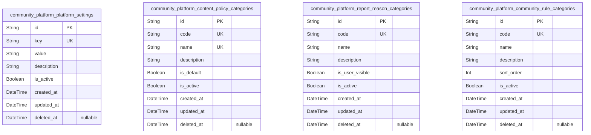
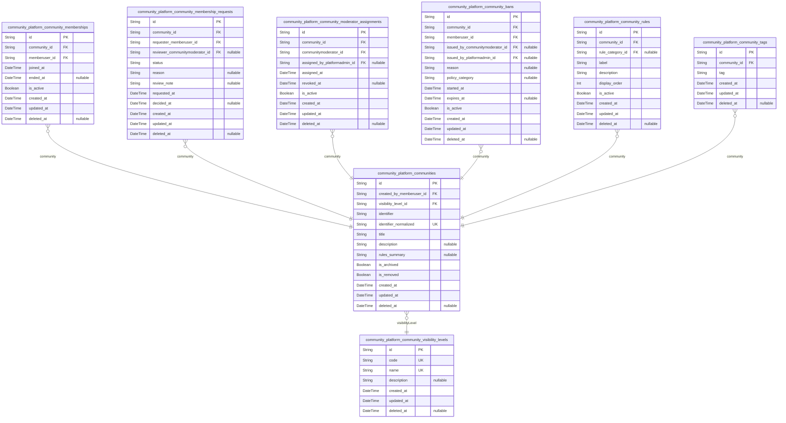
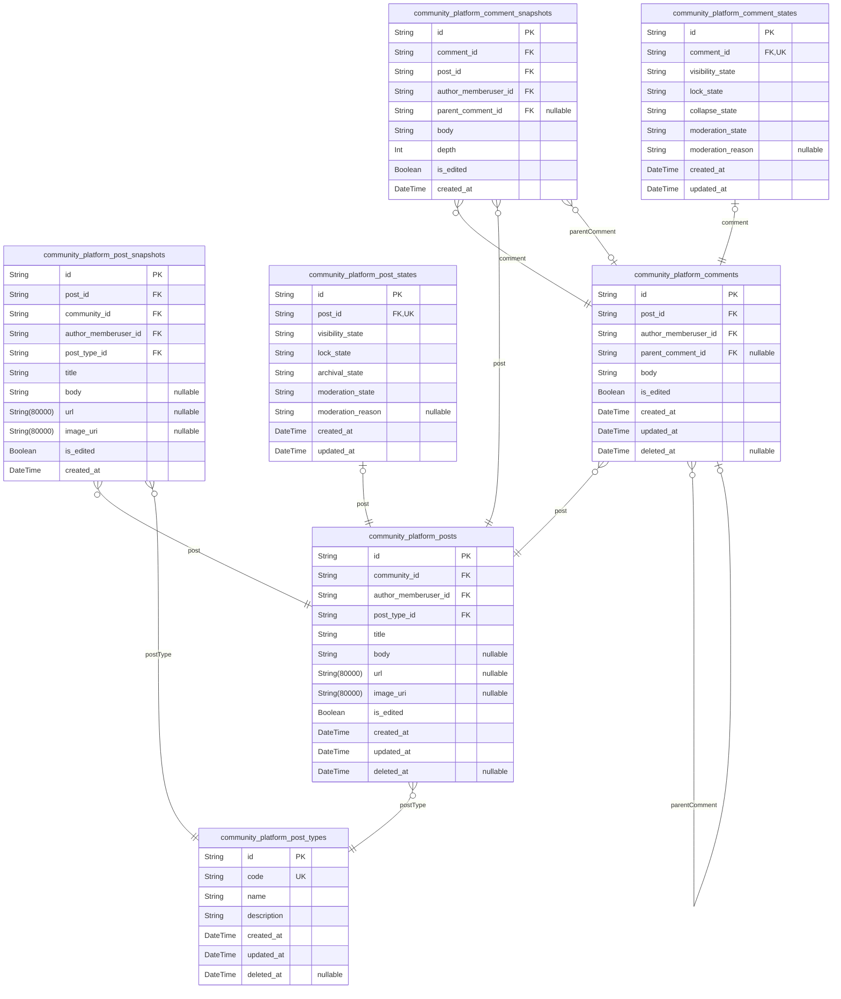
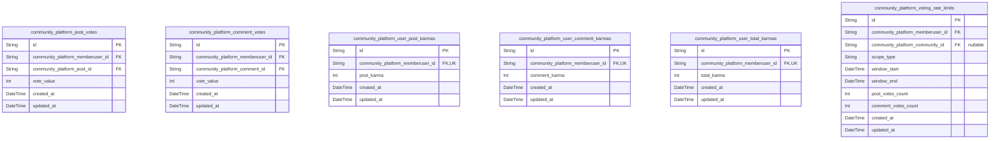
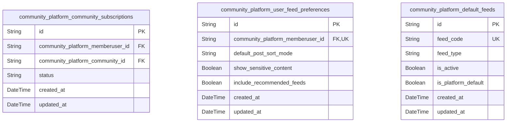
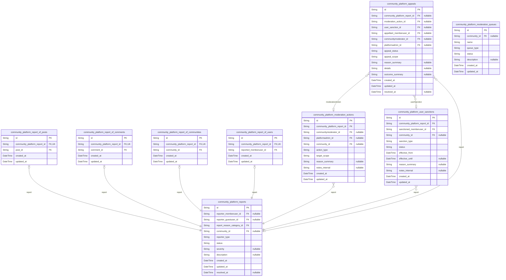
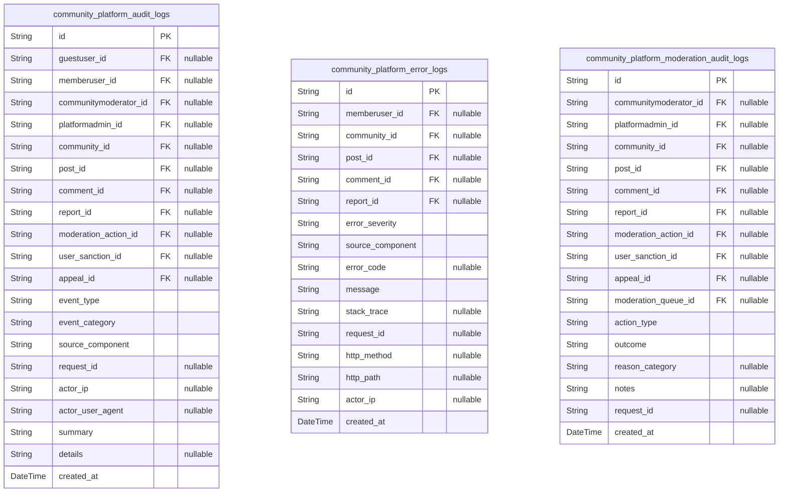

# Prisma Markdown

> Generated by [`prisma-markdown`](https://github.com/samchon/prisma-markdown)

- [Systematic](#systematic)
- [Actors](#actors)
- [Communities](#communities)
- [Posts](#posts)
- [VotingKarma](#votingkarma)
- [SubscriptionsFeeds](#subscriptionsfeeds)
- [ReportingModeration](#reportingmoderation)
- [AuditLogs](#auditlogs)

## Systematic

### `community_platform_platform_settings`

Platform-wide configuration settings and thresholds for the
communityPlatform service.

This table stores low-churn, cross-cutting configuration values that
influence behavior in multiple domains, such as karma thresholds, voting
limits, and safety toggles. It centralizes platform-level settings
instead of scattering magic numbers or flags across business tables.

Other components reference these settings logically in service code (for
example, to decide whether a user may create a community or how many
votes per hour are allowed) but do not hold foreign keys to this table.
The goal is to provide a single source of truth for operators and
administrators to tune system behavior without schema changes.

Properties as follows:

- `id`: Primary key. Uniquely identifies a specific platform settings record.
- `key`
  > Stable, machine-oriented identifier for this settings entry. Used by
  > backend services to look up a particular configuration value (for example
  > "karma.community_creation_threshold"). Must be unique across all platform
  > settings.
- `value`
  > Serialized configuration value for this setting. The exact format (for
  > example JSON, integer rendered as string, boolean literal) is interpreted
  > by application logic based on the key.
- `description`
  > Human-readable explanation of what this setting controls, including
  > units, valid ranges, and business impact where relevant.
- `is_active`
  > Indicates whether this settings entry is currently active and should be
  > used by the platform. Inactive settings may represent deprecated or
  > experimental values kept for reference.
- `created_at`: Timestamp when this settings row was first created.
- `updated_at`: Timestamp when this settings row was last updated.
- `deleted_at`
  > Soft deletion timestamp. When not null, the settings row is considered
  > logically removed and should not be used for active behavior, but is
  > preserved for audit and rollback analysis.

### `community_platform_content_policy_categories`

Global taxonomy of high-level content policy categories enforced by the
platform.

This table defines platform-wide content policy categories such as
harassment, hate speech, explicit sexual content, or illegal activities.
These categories are referenced conceptually by moderation actions,
community configurations, and reporting flows.

Communities and moderation tools can associate content or rules with
these categories to drive consistent policy enforcement. The taxonomy is
managed centrally so that changes propagate coherently across all
communities.

Properties as follows:

- `id`: Primary key. Uniquely identifies a content policy category.
- `code`
  > Stable, machine-friendly code for this content policy category (for
  > example "harassment", "hate_speech"). Used as a reference key in
  > application logic and other schemas.
- `name`
  > Human-readable name of the content policy category shown in
  > administrative and moderation tools.
- `description`
  > Detailed explanation of what this category covers, including examples and
  > guidance for moderators and policy authors.
- `is_default`
  > Indicates whether this category is part of the core platform policy set
  > that should always be available across all communities.
- `is_active`
  > Indicates whether this category is currently active and should be offered
  > when configuring rules or labeling content. Inactive categories are
  > preserved for historical reference but not used for new configuration.
- `created_at`: Timestamp when this content policy category was created.
- `updated_at`: Timestamp when this content policy category was last updated.
- `deleted_at`
  > Soft deletion timestamp. When set, the category is logically removed from
  > active use but retained for audit and historical reporting.

### `community_platform_report_reason_categories`

Global catalog of standardized report reason categories used when users
report content or accounts.

This table defines the high-level reason categories that reporters can
select, such as spam, harassment, explicit content, or illegal activity.
It ensures that reporting data is structured and consistent across all
communities.

Reporting workflows, moderation queues, and analytics use these
categories to route reports, prioritize safety issues, and generate
metrics. The taxonomy is centrally managed to maintain consistency and
support policy evolution.

Properties as follows:

- `id`: Primary key. Uniquely identifies a report reason category.
- `code`
  > Stable, machine-oriented code for the report reason category (for example
  > "spam", "harassment", "illegal_content"). Used for routing logic and
  > analytics.
- `name`
  > Human-readable name of the report reason category presented in user
  > interfaces and moderation tools.
- `description`
  > Detailed description of when this report reason should be used, including
  > examples and any edge cases for moderators to consider.
- `is_user_visible`
  > Indicates whether this reason category should be visible to end users in
  > reporting UIs. Some categories may be internal-only for moderators or
  > admins.
- `is_active`
  > Indicates whether this category is currently active and selectable for
  > new reports. Inactive categories remain for historical data integrity but
  > should not be offered for new submissions.
- `created_at`: Timestamp when this report reason category was created.
- `updated_at`: Timestamp when this report reason category was last updated.
- `deleted_at`
  > Soft deletion timestamp. When set, the category is considered deprecated
  > and should not be used for new reports, but existing reports remain
  > linked to it for audit purposes.

### `community_platform_community_rule_categories`

Catalog of rule categories that communities can use when defining their
own community-specific rules.

This table provides a structured set of categories for community rules,
such as content guidelines, behavior rules, posting restrictions, or
reporting procedures. Communities reference these categories when
authoring or classifying their local rules.

Using centralized rule categories improves discoverability, consistency,
and analytics across communities, while still allowing communities to
define rule text and details in their own domain-specific tables.

Properties as follows:

- `id`: Primary key. Uniquely identifies a community rule category.
- `code`
  > Stable, machine-friendly code for this rule category (for example
  > "behavior", "posting_policy", "safety"). Used by backend logic and
  > community tooling.
- `name`
  > Human-readable name of the rule category displayed when communities
  > configure or review their rules.
- `description`
  > Detailed explanation of what kind of rules belong in this category, with
  > examples to guide community moderators.
- `sort_order`
  > Relative ordering value used to control how categories are displayed in
  > configuration UIs. Lower values typically appear earlier.
- `is_active`
  > Indicates whether this category is currently offered for new community
  > rules. Inactive categories are preserved for historical rule
  > classification but not suggested for new rules.
- `created_at`: Timestamp when this community rule category was created.
- `updated_at`: Timestamp when this community rule category was last updated.
- `deleted_at`
  > Soft deletion timestamp. When set, this category is logically removed
  > from active use while remaining available for historical rule records.

## Actors

```mermaid
erDiagram
"community_platform_guestusers" {
  String id PK
  String account_status_id FK "nullable"
  String anonymous_handle UK "nullable"
  String user_agent "nullable"
  DateTime created_at
  DateTime updated_at
  DateTime deleted_at "nullable"
}
"community_platform_guestuser_sessions" {
  String id PK
  String community_platform_guestuser_id FK
  String ip
  String href
  String referrer
  DateTime created_at
  DateTime expired_at "nullable"
}
"community_platform_memberusers" {
  String id PK
  String account_status_id FK
  String username UK
  String email UK
  String password_hash
  String display_name "nullable"
  DateTime created_at
  DateTime updated_at
  DateTime deleted_at "nullable"
}
"community_platform_memberuser_sessions" {
  String id PK
  String community_platform_memberuser_id FK
  String ip
  String href
  String referrer
  DateTime created_at
  DateTime expired_at "nullable"
}
"community_platform_communitymoderators" {
  String id PK
  String account_status_id FK
  String username UK
  String email UK
  String password_hash
  String display_name "nullable"
  DateTime created_at
  DateTime updated_at
  DateTime deleted_at "nullable"
}
"community_platform_communitymoderator_sessions" {
  String id PK
  String community_platform_communitymoderator_id FK
  String ip
  String href
  String referrer
  DateTime created_at
  DateTime expired_at "nullable"
}
"community_platform_platformadmins" {
  String id PK
  String account_status_id FK
  String username UK
  String email UK
  String password_hash
  String display_name "nullable"
  DateTime created_at
  DateTime updated_at
  DateTime deleted_at "nullable"
}
"community_platform_platformadmin_sessions" {
  String id PK
  String community_platform_platformadmin_id FK
  String ip
  String href
  String referrer
  DateTime created_at
  DateTime expired_at "nullable"
}
"community_platform_account_statuses" {
  String id PK
  String key UK
  String label
  String description "nullable"
  DateTime created_at
  DateTime updated_at
}
"community_platform_user_security_events" {
  String id PK
  String account_status_id FK "nullable"
  String actor_type
  String event_type
  String ip "nullable"
  String user_agent "nullable"
  String metadata_json "nullable"
  DateTime created_at
}
"community_platform_user_security_event_of_guests" {
  String id PK
  String security_event_id FK,UK
  String community_platform_guestuser_id FK
  String community_platform_guestuser_session_id FK "nullable"
  DateTime created_at
}
"community_platform_user_security_event_of_memberusers" {
  String id PK
  String security_event_id FK,UK
  String community_platform_memberuser_id FK
  String community_platform_memberuser_session_id FK "nullable"
  DateTime created_at
}
"community_platform_user_security_event_of_communitymoderators" {
  String id PK
  String security_event_id FK,UK
  String community_platform_communitymoderator_id FK
  String community_platform_communitymoderator_session_id FK "nullable"
  DateTime created_at
}
"community_platform_user_security_event_of_platformadmins" {
  String id PK
  String security_event_id FK,UK
  String community_platform_platformadmin_id FK
  String community_platform_platformadmin_session_id FK "nullable"
  DateTime created_at
}
"community_platform_guestusers" }o--o| "community_platform_account_statuses" : accountStatus
"community_platform_guestuser_sessions" }o--|| "community_platform_guestusers" : guestUser
"community_platform_memberusers" }o--|| "community_platform_account_statuses" : accountStatus
"community_platform_memberuser_sessions" }o--|| "community_platform_memberusers" : memberUser
"community_platform_communitymoderators" }o--|| "community_platform_account_statuses" : accountStatus
"community_platform_communitymoderator_sessions" }o--|| "community_platform_communitymoderators" : communityModerator
"community_platform_platformadmins" }o--|| "community_platform_account_statuses" : accountStatus
"community_platform_platformadmin_sessions" }o--|| "community_platform_platformadmins" : platformAdmin
"community_platform_user_security_events" }o--o| "community_platform_account_statuses" : accountStatus
"community_platform_user_security_event_of_guests" |o--|| "community_platform_user_security_events" : securityEvent
"community_platform_user_security_event_of_guests" }o--|| "community_platform_guestusers" : guestUser
"community_platform_user_security_event_of_guests" }o--o| "community_platform_guestuser_sessions" : guestSession
"community_platform_user_security_event_of_memberusers" |o--|| "community_platform_user_security_events" : securityEvent
"community_platform_user_security_event_of_memberusers" }o--|| "community_platform_memberusers" : memberUser
"community_platform_user_security_event_of_memberusers" }o--o| "community_platform_memberuser_sessions" : memberSession
"community_platform_user_security_event_of_communitymoderators" |o--|| "community_platform_user_security_events" : securityEvent
"community_platform_user_security_event_of_communitymoderators" }o--|| "community_platform_communitymoderators" : communityModerator
"community_platform_user_security_event_of_communitymoderators" }o--o| "community_platform_communitymoderator_sessions" : communityModeratorSession
"community_platform_user_security_event_of_platformadmins" |o--|| "community_platform_user_security_events" : securityEvent
"community_platform_user_security_event_of_platformadmins" }o--|| "community_platform_platformadmins" : platformAdmin
"community_platform_user_security_event_of_platformadmins" }o--o| "community_platform_platformadmin_sessions" : platformAdminSession
```

### `community_platform_guestusers`

Minimal records for unauthenticated visitors that the platform chooses to
track as guest actors.

This table stores optional identifiers for guest visitors so that
security events, reports, or abuse patterns can be associated with a
stable guest handle without requiring full registration. It allows the
platform to reason about repeated anonymous behavior, throttling, or
follow-up actions.

Guest users do not authenticate with credentials. They exist only for
tracking and safety use cases, and can later be correlated to registered
accounts via higher-level logic if needed.

Properties as follows:

- `id`: Primary key for the guest user record.
- `account_status_id`
  > Optional account status reference for this guest user. {@link
  > community_platform_account_statuses.id}.
- `anonymous_handle`
  > Optional opaque handle assigned to this guest to correlate multiple
  > visits or actions without revealing personal identity.
- `user_agent`
  > Last observed user agent string for this guest, captured for security and
  > abuse analysis purposes.
- `created_at`: Timestamp when this guest user record was first created.
- `updated_at`: Timestamp when this guest user record was last updated.
- `deleted_at`
  > Soft deletion timestamp. When set, the guest record is considered
  > logically removed while retained for audit.

### `community_platform_guestuser_sessions`

Sessions representing browsing or interaction contexts for guest users.

Each row models a single guest session, typically corresponding to a
browser session or app instance. It records basic connection metadata to
support security analysis, rate limiting, and auditing.

Guest sessions do not grant authentication privileges but help correlate
actions for the same anonymous actor across multiple requests.

Properties as follows:

- `id`: Primary key for the guest user session.
- `community_platform_guestuser_id`
  > Guest user that owns this session. {@link
  > community_platform_guestusers.id}.
- `ip`: IP address observed when the session was established.
- `href`: Full URL or entry point that initiated this guest session.
- `referrer`
  > Referrer URL indicating the previous page or source when the session
  > started.
- `created_at`: Timestamp when the guest session was created or first seen.
- `expired_at`: Timestamp when the guest session expired or was explicitly invalidated.

### `community_platform_memberusers`

Registered member accounts representing standard authenticated users of
the community platform.

Member users own communities, posts, comments, votes, subscriptions,
reports, and many other business objects. They authenticate with
credentials and have an associated account status that governs what
actions they are allowed to perform.

This table centralizes identity information and high-level lifecycle
control for regular users without mixing in moderator or admin
responsibilities.

Properties as follows:

- `id`: Primary key for the member user account.
- `account_status_id`
  > Current account status for this member user. {@link
  > community_platform_account_statuses.id}.
- `username`
  > Unique username chosen by the member user for identification within the
  > platform.
- `email`
  > Unique email address used for authentication, verification, and
  > notifications.
- `password_hash`: Hashed password used for login. Plain-text passwords are never stored.
- `display_name`: Optional display name shown in profiles or UI instead of the raw username.
- `created_at`: Timestamp when the member user account was created.
- `updated_at`: Timestamp when the member user account was last updated.
- `deleted_at`
  > Soft deletion timestamp. When set, the account is treated as deleted
  > while preserving data for audit and legal purposes.

### `community_platform_memberuser_sessions`

Authenticated sessions for member users.

Each row represents a single authenticated session associated with a
member user account. Sessions carry only minimal connection context and
timing information and are used to drive authorization decisions and
security audits.

This table strictly follows the standardized session pattern for
authenticated actors in the platform.

Properties as follows:

- `id`: Primary key for the member user session.
- `community_platform_memberuser_id`
  > Member user that owns this session. {@link
  > community_platform_memberusers.id}.
- `ip`: IP address observed when the member user session was created.
- `href`: URL or entry point requested when the session was established.
- `referrer`
  > Referrer URL indicating where the user came from when starting this
  > session.
- `created_at`: Timestamp when the member user session was created.
- `expired_at`
  > Timestamp when the session expired or was revoked. Null while the session
  > is active.

### `community_platform_communitymoderators`

Actor table for community moderators who hold elevated privileges in one
or more communities.

Community moderators are conceptually distinct from regular member users
even though they may correspond to the same person. This table captures
the identity used when exercising moderation powers and allows separate
lifecycle and policy handling.

Assignments that bind moderators to specific communities are held in a
separate component table
(community_platform_community_moderator_assignments) that references this
actor entity.

Properties as follows:

- `id`: Primary key for the community moderator account.
- `account_status_id`
  > Current account status for this moderator. {@link
  > community_platform_account_statuses.id}.
- `username`: Unique username for the community moderator actor.
- `email`: Unique email address for moderator authentication and notifications.
- `password_hash`: Hashed password for moderator login credentials.
- `display_name`: Optional display name used in moderator-facing or public UIs.
- `created_at`: Timestamp when the moderator account was created.
- `updated_at`: Timestamp when the moderator account record was last updated.
- `deleted_at`
  > Soft deletion timestamp for the moderator account. When set, the account
  > is no longer usable but retained for audit.

### `community_platform_communitymoderator_sessions`

Authenticated sessions for community moderator actors.

Each row represents a login session for a moderator account. These
sessions are critical for auditing moderation actions and enforcing
session-based security policies.

The schema adheres exactly to the standardized session structure used
across actors in the system.

Properties as follows:

- `id`: Primary key for the community moderator session.
- `community_platform_communitymoderator_id`
  > Community moderator that owns this session. {@link
  > community_platform_communitymoderators.id}.
- `ip`: IP address captured when the moderator session was created.
- `href`: Entry-point URL or resource requested at the start of the session.
- `referrer`
  > Referrer URL indicating where the moderator navigated from when starting
  > the session.
- `created_at`: Timestamp when the moderator session was created.
- `expired_at`
  > Timestamp when this moderator session expired, was revoked, or otherwise
  > ended.

### `community_platform_platformadmins`

Actor table for platform administrators with global authority across all
communities.

Platform admins can review and act on any content, manage global
configuration, and enforce platform-wide moderation and safety policies.
This table stores their identity, authentication credentials, and
lifecycle information.

Separating platform admins from member and moderator actors ensures clear
boundaries for elevated privileges and simplifies enforcement and audit
logic.

Properties as follows:

- `id`: Primary key for the platform administrator account.
- `account_status_id`
  > Current account status for this platform administrator. {@link
  > community_platform_account_statuses.id}.
- `username`: Unique username for the platform administrator.
- `email`: Unique email address for admin authentication and communication.
- `password_hash`
  > Hashed password used for admin login. Stored securely following security
  > best practices.
- `display_name`: Optional human-friendly display name for the administrator.
- `created_at`: Timestamp when the administrator account was created.
- `updated_at`: Timestamp when the administrator account was last updated.
- `deleted_at`
  > Soft deletion timestamp. When non-null, the administrator account is
  > logically disabled while retained for audit.

### `community_platform_platformadmin_sessions`

Authenticated sessions for platform administrator accounts.

These sessions are highly sensitive because they are used for
platform-wide configuration and enforcement actions. The table records
minimal connection and timing data while relying on other components for
detailed action auditing.

The structure matches the common session pattern to allow consistent
handling across all actor types.

Properties as follows:

- `id`: Primary key for the platform administrator session.
- `community_platform_platformadmin_id`
  > Platform administrator that owns this session. {@link
  > community_platform_platformadmins.id}.
- `ip`: IP address that initiated the administrator session.
- `href`: Entry-point URL or resource requested when the admin session was created.
- `referrer`
  > Referrer URL describing where the admin navigated from when starting the
  > session.
- `created_at`: Timestamp when the admin session was created.
- `expired_at`: Timestamp when the admin session expired or was explicitly terminated.

### `community_platform_account_statuses`

Lookup table defining possible account statuses for all actor types.

This table centralizes the lifecycle and access control state of guest,
member, moderator, and admin accounts. Typical statuses include active,
pending_verification, suspended, and banned, but the actual values are
determined by platform policy.

By normalizing status into its own table, the platform can evolve status
semantics without changing actor schemas and can query or report on
accounts grouped by status efficiently.

Properties as follows:

- `id`: Primary key for the account status entry.
- `key`
  > Machine-readable key for the status, such as active,
  > pending_verification, suspended, or banned.
- `label`
  > Human-friendly label for this status used in administrative user
  > interfaces.
- `description`
  > Detailed description of what this status means and how it affects allowed
  > actions.
- `created_at`: Timestamp when this account status entry was created.
- `updated_at`: Timestamp when this account status entry was last updated.

### `community_platform_user_security_events`

Main security event entity capturing security-relevant occurrences across
all actor types.

This table stores the shared attributes of security events such as
logins, password changes, account status transitions, suspicious
activity, and other safety-related signals. It intentionally does not
embed concrete actor foreign keys; instead, it is linked to
actor-specific subtype tables that enforce which actor and session are
associated with the event.

The actor_type field provides a quick discriminator and filter to
identify which subtype table contains the actor binding. This design
avoids multiple nullable foreign keys and supports polymorphic ownership
in a normalized way.

Properties as follows:

- `id`: Primary key for the security event record.
- `account_status_id`
  > Optional account status referenced by this event, for example the status
  > after a transition. [community_platform_account_statuses.id](#community_platform_account_statuses).
- `actor_type`
  > Actor type discriminator for this event. Typical values: guest,
  > memberuser, communitymoderator, platformadmin. Used to route to the
  > correct subtype table for actor-specific details.
- `event_type`
  > Machine-readable code for the event type, such as login_success,
  > login_failure, password_changed, account_locked, or account_unlocked.
- `ip`
  > IP address associated with this event, if available, used for security
  > analysis.
- `user_agent`: User agent string captured at the time of the event, if available.
- `metadata_json`
  > Optional serialized metadata payload (for example JSON) containing
  > additional parameters relevant to the security event.
- `created_at`: Timestamp when this security event was recorded.

### `community_platform_user_security_event_of_guests`

Subtype table binding a security event to a concrete guest user and
optionally a guest session.

Each row represents the association between one {@link
community_platform_user_security_events} record and a specific {@link
community_platform_guestusers} actor, plus an optional {@link
community_platform_guestuser_sessions} session context. The 1:1
relationship to the main event is enforced via a unique constraint on the
security_event_id.

This design allows the database to enforce correct guest associations
without nullable foreign keys in the main event table.

Properties as follows:

- `id`: Primary key for the guest-linked security event subtype record.
- `security_event_id`
  > Main security event that this guest-specific record extends. {@link
  > community_platform_user_security_events.id}.
- `community_platform_guestuser_id`
  > Guest user associated with this security event. {@link
  > community_platform_guestusers.id}.
- `community_platform_guestuser_session_id`
  > Guest session associated with this event, when applicable. {@link
  > community_platform_guestuser_sessions.id}.
- `created_at`
  > Timestamp when this guest-specific association record was created.
  > Typically matches the main event time but stored separately for auditing.

### `community_platform_user_security_event_of_memberusers`

Subtype table binding a security event to a concrete member user and
optionally a member user session.

Each row links one [community_platform_user_security_events](#community_platform_user_security_events) record
to a specific [community_platform_memberusers](#community_platform_memberusers) actor and, when
applicable, to a [community_platform_memberuser_sessions](#community_platform_memberuser_sessions) session.
The unique constraint on security_event_id ensures a strict 1:1
relationship between the main event and this subtype record.

This structure enables clean querying and auditing of member user
security events without multiple nullable foreign keys on the main table.

Properties as follows:

- `id`: Primary key for the member user-linked security event subtype record.
- `security_event_id`
  > Main security event that this member-specific record extends. {@link
  > community_platform_user_security_events.id}.
- `community_platform_memberuser_id`
  > Member user associated with this security event. {@link
  > community_platform_memberusers.id}.
- `community_platform_memberuser_session_id`
  > Member user session associated with this event, if any. {@link
  > community_platform_memberuser_sessions.id}.
- `created_at`
  > Timestamp when this member-specific association record was created.
  > Usually matches the main event time but may differ for asynchronous
  > ingestion.

### `community_platform_user_security_event_of_communitymoderators`

Subtype table binding a security event to a community moderator and
optionally a community moderator session.

Each record links one [community_platform_user_security_events](#community_platform_user_security_events) row
to a concrete [community_platform_communitymoderators](#community_platform_communitymoderators) actor and an
optional [community_platform_communitymoderator_sessions](#community_platform_communitymoderator_sessions) session.
This enables precise auditing of moderator-related security events while
keeping the main event table normalized.

The 1:1 relationship with the main event is enforced via a unique
constraint on security_event_id.

Properties as follows:

- `id`
  > Primary key for the community moderator-linked security event subtype
  > record.
- `security_event_id`
  > Main security event that this community moderator-specific record
  > extends. [community_platform_user_security_events.id](#community_platform_user_security_events).
- `community_platform_communitymoderator_id`
  > Community moderator associated with this security event. {@link
  > community_platform_communitymoderators.id}.
- `community_platform_communitymoderator_session_id`
  > Community moderator session associated with this event, if applicable.
  > [community_platform_communitymoderator_sessions.id](#community_platform_communitymoderator_sessions).
- `created_at`
  > Timestamp when this community moderator-specific association record was
  > created.

### `community_platform_user_security_event_of_platformadmins`

Subtype table binding a security event to a platform administrator and
optionally a platform admin session.

Each row associates one [community_platform_user_security_events](#community_platform_user_security_events)
record with a specific [community_platform_platformadmins](#community_platform_platformadmins) actor
and, when present, a [community_platform_platformadmin_sessions](#community_platform_platformadmin_sessions)
session. This supports high-fidelity auditing of administrator-related
security events.

A unique constraint on security_event_id enforces the 1:1 linkage with
the main event table.

Properties as follows:

- `id`
  > Primary key for the platform administrator-linked security event subtype
  > record.
- `security_event_id`
  > Main security event that this platform admin-specific record extends.
  > [community_platform_user_security_events.id](#community_platform_user_security_events).
- `community_platform_platformadmin_id`
  > Platform administrator associated with this security event. {@link
  > community_platform_platformadmins.id}.
- `community_platform_platformadmin_session_id`
  > Platform administrator session associated with this event, if any. {@link
  > community_platform_platformadmin_sessions.id}.
- `created_at`
  > Timestamp when this platform administrator-specific association record
  > was created.

## Communities

### `community_platform_communities`

Topic-based communities (subreddits) that group posts and discussions.

Each community represents a named, thematic space where members can
create posts and comments. Communities have a unique human-readable
identifier, display title, description, and optional rule summary. They
also carry visibility and state flags that control whether they are
public, restricted, private, archived, or removed.

This table is referenced by posting, subscription, feed, reporting, and
moderation domains to determine where content belongs and how it should
be shown. Community-level governance relationships like memberships,
membership requests, moderator assignments, bans, rules, and tags all
point back to this model.

Properties as follows:

- `id`
  > Primary key for the community. Random UUID value that uniquely identifies
  > a community within the platform.
- `created_by_memberuser_id`
  > Authoring member user who created this community. References the account
  > that initiated community creation. {@link
  > community_platform_memberusers.id}.
- `visibility_level_id`
  > Visibility classification applied to the community, such as public,
  > restricted, or private. {@link
  > community_platform_community_visibility_levels.id}.
- `identifier`
  > Community identifier used in URLs and references, such as "programming".
  > Case is preserved for display but uniqueness is enforced via
  > identifier_normalized.
- `identifier_normalized`
  > Lowercased, normalized version of the identifier used for uniqueness
  > checks and case-insensitive lookups.
- `title`
  > Human-readable community title shown in listings and headers. Can differ
  > from the identifier and may include spaces and punctuation.
- `description`
  > Optional longer description that explains the community purpose, scope,
  > and guidelines in free text form.
- `rules_summary`
  > Optional short summary of important community rules displayed prominently
  > to users. Detailed structured rules live in community rules table.
- `is_archived`
  > Indicates whether the community is archived. Archived communities block
  > new posts but keep existing content visible according to visibility
  > rules.
- `is_removed`
  > Indicates whether the community has been removed or suspended at platform
  > level. Removed communities are hidden from general discovery and feeds.
- `created_at`: Timestamp when the community record was created.
- `updated_at`: Timestamp when the community record was last updated.
- `deleted_at`
  > Soft delete timestamp. When set, the community is considered logically
  > deleted while keeping data for audit and compliance.

### `community_platform_community_visibility_levels`

Visibility level master data for communities.

Each row describes one visibility classification such as public,
restricted, or private. Communities reference a visibility level to
determine which actors can see or participate in their content.

This table allows platform-wide configuration of visibility semantics and
reuse across communities while keeping the community model focused on
instance-specific data.

Properties as follows:

- `id`
  > Primary key for the visibility level. Random UUID that uniquely
  > identifies a visibility classification.
- `code`
  > Short machine-readable code for the visibility level, such as "public",
  > "restricted", or "private". Used in business logic and configuration.
- `name`
  > Human-readable name for the visibility level presented in administrative
  > and configuration UIs.
- `description`
  > Optional explanation of the visibility semantics, including who can view
  > and interact with content under this level.
- `created_at`: Timestamp when the visibility level record was created.
- `updated_at`: Timestamp when the visibility level record was last updated.
- `deleted_at`
  > Soft delete timestamp. When set, the visibility level is no longer used
  > for new communities but remains for historical reference.

### `community_platform_community_memberships`

Active or historical memberships that link member users to communities.

Each record represents a user being a member of a specific community,
including when they joined and optionally when the membership ended.
Membership rows are used to determine who can interact in restricted or
private communities and to build lists such as "communities this user
belongs to" or "members of this community".

Memberships are separate from membership requests so that pending and
rejected requests do not pollute the active membership list. Soft
deletion and end timestamps preserve historical membership information
for audit and analytics.

Properties as follows:

- `id`
  > Primary key for the community membership. Random UUID that uniquely
  > identifies a membership record.
- `community_id`
  > Community in which the user holds membership. {@link
  > community_platform_communities.id}.
- `memberuser_id`
  > Member user who is a member of the community. {@link
  > community_platform_memberusers.id}.
- `joined_at`
  > Timestamp when the membership became active for this user in the
  > community.
- `ended_at`
  > Timestamp when the membership ended, for example due to user leaving or
  > being removed. Null when the membership is currently active.
- `is_active`
  > Flag indicating whether this membership row currently represents an
  > active membership. Used in combination with ended_at.
- `created_at`: Timestamp when the membership record was created.
- `updated_at`: Timestamp when the membership record was last updated.
- `deleted_at`
  > Soft delete timestamp. When set, the membership is considered logically
  > removed while preserving history for audit and analytics.

### `community_platform_community_membership_requests`

Requests from member users to join communities that require approval.

Each row captures a membership request from a user to a community,
including the current status and timestamps for creation and resolution.
Requests can be pending, approved, rejected, or cancelled, and moderation
tooling needs to query and filter them across communities.

When a request is approved, a corresponding membership may be created;
the request record remains as an audit trail of the decision. Soft
deletion is available but requests are typically kept for historical
analysis and dispute resolution.

Properties as follows:

- `id`
  > Primary key for the community membership request. Random UUID that
  > uniquely identifies a request.
- `community_id`
  > Community to which the user is requesting membership. {@link
  > community_platform_communities.id}.
- `requester_memberuser_id`
  > Member user who submitted the membership request. {@link
  > community_platform_memberusers.id}.
- `reviewer_communitymoderator_id`
  > Community moderator who reviewed and decided the request, when
  > applicable. Null while the request is still pending or auto-handled.
  > [community_platform_communitymoderators.id](#community_platform_communitymoderators).
- `status`
  > Current status of the membership request such as "pending", "approved",
  > "rejected", or "cancelled" according to business rules.
- `reason`
  > Optional free-text reason supplied by the requester explaining why they
  > want to join the community.
- `review_note`
  > Optional note recorded by the reviewer explaining the decision from a
  > moderation perspective.
- `requested_at`: Timestamp when the membership request was created by the requester.
- `decided_at`
  > Timestamp when the request was approved, rejected, or cancelled. Null
  > while the request is still pending.
- `created_at`: Timestamp when the membership request record was created.
- `updated_at`: Timestamp when the membership request record was last updated.
- `deleted_at`
  > Soft delete timestamp. When set, the request is logically removed from
  > normal views while kept for audit.

### `community_platform_community_moderator_assignments`

Assignments that link moderator identities to communities they manage.

Each record represents one moderator role for a given community. It
tracks when the moderator was added and optionally when the assignment
ended. Assignments are used to drive authorization for moderation actions
and to render moderator lists in community views.

This table references the separate moderator identity table and the
community, and is designed as a pure relationship entity with temporal
fields for audit and governance analysis.

Properties as follows:

- `id`
  > Primary key for the community moderator assignment. Random UUID that
  > uniquely identifies an assignment.
- `community_id`
  > Community for which the moderator is assigned. {@link
  > community_platform_communities.id}.
- `communitymoderator_id`
  > Community moderator identity that holds moderation rights in the
  > community. [community_platform_communitymoderators.id](#community_platform_communitymoderators).
- `assigned_by_platformadmin_id`
  > Platform administrator who granted this moderator assignment, when
  > applicable. Null when assignment is created by community-level flows
  > only. [community_platform_platformadmins.id](#community_platform_platformadmins).
- `assigned_at`
  > Timestamp when the moderator assignment became effective for the
  > community.
- `revoked_at`
  > Timestamp when the moderator assignment was revoked or ended, if
  > applicable.
- `is_active`
  > Indicates whether this assignment is currently active for authorization
  > decisions.
- `created_at`: Timestamp when the moderator assignment record was created.
- `updated_at`: Timestamp when the moderator assignment record was last updated.
- `deleted_at`
  > Soft delete timestamp. When set, the assignment is logically removed
  > while preserved for historical inspection.

### `community_platform_community_bans`

Community-level bans and restrictions applied to member users.

Each record represents a ban or restriction of a specific user within a
specific community. It captures who was banned, by which actor, when the
ban started, when it ends if temporary, and the reason. Bans are used by
higher-level logic to prevent posting, commenting, voting, or subscribing
to the community while still allowing other communities.

This table keeps a full ban history for audit and safety analysis.
Multiple ban records can exist per user and community over time, but
exact duplicates are avoided via indexing and business logic. Soft
deletion supports correction of erroneous records while still preserving
audit trails when needed.

Properties as follows:

- `id`
  > Primary key for the community ban record. Random UUID that uniquely
  > identifies a ban or restriction entry.
- `community_id`
  > Community in which the user is banned or restricted. {@link
  > community_platform_communities.id}.
- `memberuser_id`
  > Member user who is subject to the ban or restriction in the community.
  > [community_platform_memberusers.id](#community_platform_memberusers).
- `issued_by_communitymoderator_id`
  > Community moderator who issued the ban, when the action originates from
  > community-level moderation. {@link
  > community_platform_communitymoderators.id}.
- `issued_by_platformadmin_id`
  > Platform administrator who issued or escalated the ban, when applicable.
  > [community_platform_platformadmins.id](#community_platform_platformadmins).
- `reason`
  > Optional free-text explanation describing why the ban or restriction was
  > applied from a moderation perspective.
- `policy_category`
  > Optional high-level policy category associated with the ban, such as
  > spam, harassment, or hate, to support reporting and analytics.
- `started_at`
  > Timestamp when the ban became effective for the member user in the
  > community.
- `expires_at`
  > Timestamp when the ban is scheduled to expire for temporary bans. Null
  > for permanent bans or where duration is not predetermined.
- `is_active`
  > Indicates whether the ban is currently enforced. Used in combination with
  > started_at and expires_at.
- `created_at`: Timestamp when the ban record was created.
- `updated_at`: Timestamp when the ban record was last updated.
- `deleted_at`
  > Soft delete timestamp. When set, the ban entry is considered logically
  > removed, usually for correction or privacy reasons while retaining
  > minimal history.

### `community_platform_community_rules`

Structured rules defined by communities to govern participation and content.

Each rule record belongs to a specific community and describes a single
rule or guideline that members should follow. Rules can reference
platform-level rule categories for classification, and may have ordering
fields used to display them in a consistent sequence.

Rules are managed via community moderation and configuration interfaces
rather than as top-level business entities. They support moderation
workflows by providing an explicit reference when explaining enforcement
actions or report resolutions.

Properties as follows:

- `id`
  > Primary key for the community rule. Random UUID that uniquely identifies
  > a rule within the platform.
- `community_id`: Community that owns this rule. [community_platform_communities.id](#community_platform_communities).
- `rule_category_id`
  > Optional reference to a rule category that classifies this rule, such as
  > spam, civility, or topic scope. {@link
  > community_platform_community_rule_categories.id}.
- `label`
  > Short label for the rule, used as a heading in lists and UI. Should be
  > unique within a community for clarity.
- `description`
  > Detailed text describing the rule, including examples and clarifications
  > for members and moderators.
- `display_order`
  > Numeric order value used to sort rules in presentations. Lower values
  > appear earlier in lists.
- `is_active`
  > Indicates whether this rule is currently active and should be displayed
  > and enforced in the community.
- `created_at`: Timestamp when the rule record was created.
- `updated_at`: Timestamp when the rule record was last updated.
- `deleted_at`
  > Soft delete timestamp. When set, the rule is no longer shown or enforced
  > but remains in history for audit.

### `community_platform_community_tags`

Tags assigned to communities to support discovery, filtering, and
classification.

Each record represents one tag for a specific community. Tags help users
discover communities by topic, technology, language, or other attributes.
They can also be used to power recommendation systems and search filters.

Tags are stored as simple label strings and are deduplicated per
community. They are subsidiary to communities and managed from community
configuration or administrative tooling, not as globally independent
entities.

Properties as follows:

- `id`
  > Primary key for the community tag. Random UUID that uniquely identifies a
  > tag assignment.
- `community_id`
  > Community to which this tag is attached. {@link
  > community_platform_communities.id}.
- `tag`
  > Tag label text, such as a topic or keyword, used for classifying and
  > searching communities. Comparison is typically case-insensitive in
  > business logic.
- `created_at`: Timestamp when the tag record was created.
- `updated_at`: Timestamp when the tag record was last updated.
- `deleted_at`
  > Soft delete timestamp. When set, the tag assignment is no longer
  > considered active but persists for historical analysis.

## Posts

### `community_platform_post_types`

Lookup table defining supported post content types for the community
platform.

Provides a controlled vocabulary of post types such as text, link, and
image so that posts can enforce type-specific validation rules. This
table is referenced by [community_platform_posts](#community_platform_posts) to determine how
to interpret content fields.

Platform administrators may extend this list cautiously, but core
business logic assumes that only well-known types are used for
user-facing behavior.

Properties as follows:

- `id`: Primary key for the post type record.
- `code`
  > Machine-readable unique code for the post type, such as "text", "link",
  > or "image". Used by backend logic to apply type-specific rules.
- `name`: Human-readable short name for the post type shown in administrative UIs.
- `description`
  > Detailed description of how this post type behaves and what fields in
  > [community_platform_posts](#community_platform_posts) are expected to be populated.
- `created_at`: Timestamp when this post type definition was created.
- `updated_at`: Timestamp when this post type definition was last modified.
- `deleted_at`
  > Soft deletion timestamp. When not null, the post type should no longer be
  > used for new posts but may remain referenced historically.

### `community_platform_posts`

Primary table storing user-created posts within communities.

Each row represents a single post created by an authenticated member user
in exactly one community. The post references a type from {@link
community_platform_post_types} to distinguish between text, link, and
image-based posts.

The table stores only the current canonical content fields; detailed edit
history is captured in [community_platform_post_snapshots](#community_platform_post_snapshots).
Lifecycle and moderation status are maintained in {@link
community_platform_post_states}. Voting, karma, subscriptions, and
reporting are handled in separate components and reference this table by
foreign key.

Properties as follows:

- `id`: Primary key for the post.
- `community_id`
  > Target community where this post was created. {@link
  > community_platform_communities.id}.
- `author_memberuser_id`
  > Authoring member user who created the post. {@link
  > community_platform_memberusers.id}.
- `post_type_id`
  > Post type specifying how to interpret content (text, link, image, etc.).
  > [community_platform_post_types.id](#community_platform_post_types).
- `title`
  > Current title of the post as visible to users. Historical titles are
  > stored in [community_platform_post_snapshots](#community_platform_post_snapshots).
- `body`
  > Current body text of the post for text and image posts. Nullable for pure
  > link posts that may not have a body.
- `url`: Target URL for link posts. Null for post types that do not use URLs.
- `image_uri`
  > URI reference to the primary image for image-based posts. Null for other
  > post types.
- `is_edited`
  > Flag indicating whether the current post content has ever been edited
  > since creation. Exact edit history is tracked in snapshots.
- `created_at`: Timestamp when the post was first created.
- `updated_at`
  > Timestamp when the post record was last updated, including content or
  > metadata changes.
- `deleted_at`
  > Soft deletion timestamp. When not null, the post is removed from standard
  > feeds but preserved for audit and moderation.

### `community_platform_post_snapshots`

Historical snapshots capturing point-in-time versions of posts.

Each snapshot stores the full content and key metadata of a post at a
specific moment, typically when the post is created or edited. This
enables audit trails, user-visible edit history, and reconstruction of
past states when needed.

Snapshots are append-only records linked to {@link
community_platform_posts}. They do not store voting, karma, or moderation
outcomes, which are handled in other components.

Properties as follows:

- `id`: Primary key for the post snapshot.
- `post_id`
  > Post whose state is being snapshotted. {@link
  > community_platform_posts.id}.
- `community_id`
  > Community of the post at the time of the snapshot. {@link
  > community_platform_communities.id}.
- `author_memberuser_id`
  > Author of the post at the time of the snapshot. {@link
  > community_platform_memberusers.id}.
- `post_type_id`
  > Post type at the time of the snapshot. {@link
  > community_platform_post_types.id}.
- `title`: Post title as it was at the time of this snapshot.
- `body`
  > Post body text as it was at the time of this snapshot, if applicable for
  > the post type.
- `url`: Link URL as it was at the time of this snapshot for link posts.
- `image_uri`: Image URI as it was at the time of this snapshot for image posts.
- `is_edited`
  > Flag indicating whether the post was already considered edited at the
  > time this snapshot was taken.
- `created_at`
  > Timestamp when this snapshot record was created, typically matching the
  > effective time of the underlying change.

### `community_platform_post_states`

Current lifecycle and moderation state for each post.

This table separates mutable state from the main {@link
community_platform_posts} entity to keep the primary table focused on
content and authorship data. Each post has at most one active state row,
enforcing a 1:1 relationship.

The state captures whether the post is visible, locked, archived, or
removed for moderation reasons, as well as high-level reasons or notes.
Detailed moderation workflows and actions are managed in dedicated
moderation components referencing this table and the underlying post.

Properties as follows:

- `id`: Primary key for the post state record.
- `post_id`
  > Post whose lifecycle and moderation state is recorded. {@link
  > community_platform_posts.id}.
- `visibility_state`
  > Business-level visibility state for the post, such as "visible",
  > "soft_removed", "hard_removed_shadow", or similar policy-defined values.
- `lock_state`
  > State describing whether the post is open or locked for new comments and
  > votes. Example values: "unlocked", "locked_comments", "locked_all".
- `archival_state`
  > State describing archival behavior, such as "active",
  > "archived_readonly", or other policy-driven states.
- `moderation_state`
  > High-level moderation outcome summary, such as "none", "under_review",
  > "removed_policy_violation", or "escalated".
- `moderation_reason`
  > Optional free-text explanation of the moderation decision for internal
  > use, not necessarily exposed directly to users.
- `created_at`: Timestamp when this state record was created for the post.
- `updated_at`: Timestamp when the state fields were last updated.

### `community_platform_comments`

Primary table storing user comments and nested replies under posts.

Each row represents a comment authored by an authenticated member user
and attached to a single post. Comments may optionally reference a parent
comment to form nested reply trees while always retaining a direct link
to the parent post.

The table stores only the current canonical body text and basic flags.
Historical versions are captured in {@link
community_platform_comment_snapshots}. Lifecycle and moderation state are
maintained in [community_platform_comment_states](#community_platform_comment_states). Voting, karma,
and reporting are handled in other components.

In this revised definition, the previously included precomputed `depth`
field has been removed from the primary table to comply with the global
rule that calculated fields must not live in regular business tables.
Thread depth can instead be derived dynamically via parent relationships
or via a dedicated materialized view if required for performance.

Properties as follows:

- `id`: Primary key for the comment.
- `post_id`: Post to which this comment belongs. [community_platform_posts.id](#community_platform_posts).
- `author_memberuser_id`
  > Authoring member user who created the comment. {@link
  > community_platform_memberusers.id}.
- `parent_comment_id`
  > Optional parent comment when this comment is a nested reply. {@link
  > community_platform_comments.id}.
- `body`
  > Current body text of the comment as visible to users. Historical bodies
  > are stored in [community_platform_comment_snapshots](#community_platform_comment_snapshots).
- `is_edited`
  > Flag indicating whether this comment has ever been edited since creation.
  > Exact edit history is stored in snapshots.
- `created_at`: Timestamp when the comment was first created.
- `updated_at`: Timestamp when the comment record was last updated.
- `deleted_at`
  > Soft deletion timestamp. When not null, the comment body is removed from
  > standard views but preserved for thread structure and audit.

### `community_platform_comment_snapshots`

Historical snapshots capturing point-in-time versions of comments.

Each snapshot stores the full text body and key metadata of a comment at
a specific moment, usually when the comment is created or edited. This
enables audit trails, user-visible edit history, and reconstruction of
previous states in moderation workflows.

Snapshots are append-only and linked to {@link
community_platform_comments} as well as the underlying post and author
for contextual queries.

Properties as follows:

- `id`: Primary key for the comment snapshot.
- `comment_id`
  > Comment whose state is being snapshotted. {@link
  > community_platform_comments.id}.
- `post_id`
  > Post that owns the comment at the time of this snapshot. {@link
  > community_platform_posts.id}.
- `author_memberuser_id`
  > Author of the comment at the time of this snapshot. {@link
  > community_platform_memberusers.id}.
- `parent_comment_id`
  > Parent comment at the time of this snapshot when the comment is a reply.
  > [community_platform_comments.id](#community_platform_comments).
- `body`: Comment body text as it was at the time of this snapshot.
- `depth`: Depth of the comment within the thread at the time of this snapshot.
- `is_edited`
  > Flag indicating whether the comment was already considered edited at the
  > time this snapshot was taken.
- `created_at`
  > Timestamp when this snapshot record was created, typically matching the
  > effective time of the underlying change.

### `community_platform_comment_states`

Current lifecycle and moderation state for each comment.

This table separates mutable moderation and lifecycle state from the main
[community_platform_comments](#community_platform_comments) entity. Each comment has at most one
active state row, ensuring a strict 1:1 relationship.

The state describes whether the comment is visible, collapsed, locked, or
removed due to policy decisions. Detailed moderation records and
sanctions are handled in dedicated moderation components, which reference
both the comment and this state record.

Properties as follows:

- `id`: Primary key for the comment state record.
- `comment_id`
  > Comment whose lifecycle and moderation state is tracked. {@link
  > community_platform_comments.id}.
- `visibility_state`
  > Business-level visibility state for the comment, such as "visible",
  > "soft_removed", or "shadow_hidden".
- `lock_state`
  > State describing whether the comment thread under this comment is open or
  > locked for new replies. Example values: "unlocked", "locked_replies".
- `collapse_state`
  > State describing whether the comment should be displayed as expanded or
  > collapsed by default, for example due to low score or downvotes.
- `moderation_state`
  > High-level moderation outcome summary for this comment, such as "none",
  > "under_review", or "removed_policy_violation".
- `moderation_reason`
  > Optional free-text explanation of the moderation decision for internal
  > tracking.
- `created_at`: Timestamp when this state record was created for the comment.
- `updated_at`: Timestamp when the state fields were last updated.

## VotingKarma

### `community_platform_post_votes`

Individual votes that member users cast on posts.

This model records explicit upvotes and downvotes for posts in
communities. Each row represents one member user’s current vote on a
specific post, enforcing at most one active vote per (user, post) pair.
It is used to derive post scores, drive sorting modes like top and hot,
and feed karma calculations for post authors.

Votes are only created for authenticated member users, and only for posts
that are visible and votable according to community and platform
policies. When posts are removed or locked, new votes are blocked at the
application layer, while existing rows remain for consistency and
auditing via other subsystems.

Properties as follows:

- `id`: Primary key for the post vote record.
- `community_platform_memberuser_id`: Member user who cast this vote. [community_platform_memberusers.id](#community_platform_memberusers).
- `community_platform_post_id`: Target post that received this vote. [community_platform_posts.id](#community_platform_posts).
- `vote_value`
  > Numeric representation of the vote. Business rules constrain this to -1
  > for downvote and +1 for upvote; absence of a row means no vote.
- `created_at`: Timestamp when this vote was first created.
- `updated_at`
  > Timestamp when this vote record was last updated, for example when
  > changing from upvote to downvote.

### `community_platform_comment_votes`

Individual votes that member users cast on comments and replies.

This model stores explicit upvotes and downvotes for comments in
discussion threads. Each row corresponds to one member user’s current
vote on a specific comment, with a unique constraint ensuring at most one
active vote per (user, comment) pair. Comment scores derived from these
rows are used for display (for example collapsing low-score comments) and
for karma updates on comment authors.

Votes are created only for authenticated member users on comments they
are allowed to see and interact with, taking into account locks,
removals, and community bans enforced in other components.

Properties as follows:

- `id`: Primary key for the comment vote record.
- `community_platform_memberuser_id`: Member user who cast this vote. [community_platform_memberusers.id](#community_platform_memberusers).
- `community_platform_comment_id`
  > Target comment that received this vote. {@link
  > community_platform_comments.id}.
- `vote_value`
  > Numeric representation of the vote. Business rules constrain this to -1
  > for downvote and +1 for upvote; absence of a row means no vote.
- `created_at`: Timestamp when this vote was first created.
- `updated_at`
  > Timestamp when this vote record was last updated, such as when changing
  > vote direction.

### `community_platform_user_post_karmas`

Aggregated post-related karma per member user.

This model maintains the cumulative karma that each member user has
earned from votes on their posts. It separates post karma from other
kinds of karma so that business rules can treat post performance
differently from comment performance.

The table has exactly one row per member user, enforced by a unique
constraint on the foreign key. It is updated whenever votes on that
user’s posts change and may also be recalculated in batch jobs, tracked
via timestamps.

Properties as follows:

- `id`: Primary key for the post karma aggregate record.
- `community_platform_memberuser_id`
  > Member user whose post karma is summarized in this record. {@link
  > community_platform_memberusers.id}.
- `post_karma`
  > Total karma contribution from all votes on this user’s posts. Positive
  > values indicate net community approval; negative values indicate net
  > disapproval.
- `created_at`: Timestamp when this karma aggregate row was created.
- `updated_at`
  > Timestamp when this karma aggregate row was last updated, either
  > incrementally or via a recalculation.

### `community_platform_user_comment_karmas`

Aggregated comment-related karma per member user.

This model records the cumulative karma that each member user has earned
from votes on their comments and replies. It allows the platform to
distinguish reputation based on discussion quality separately from
reputation based on post creation.

The table enforces exactly one row per member user with a unique
constraint on the member FK. Values are updated when comment votes on the
user’s content change, and may be periodically reconciled to ensure
consistency with underlying vote data.

Properties as follows:

- `id`: Primary key for the comment karma aggregate record.
- `community_platform_memberuser_id`
  > Member user whose comment karma is summarized in this record. {@link
  > community_platform_memberusers.id}.
- `comment_karma`
  > Total karma contribution from all votes on this user’s comments and
  > replies. Positive values indicate net approval of their discussion
  > contributions.
- `created_at`: Timestamp when this karma aggregate row was created.
- `updated_at`
  > Timestamp when this karma aggregate row was last updated, either
  > incrementally or via a recalculation.

### `community_platform_user_total_karmas`

Total karma aggregates per member user, combining posts and comments.

This model captures the overall reputation score for each member user by
storing a single total_karma value that conceptually combines both post
and comment karma. It is used for business rules that depend on overall
reputation, such as eligibility for community creation or access to
restricted communities.

The design keeps this table in 3NF by storing only the combined total and
relying on separate post and comment karma tables for more granular
breakdowns. Each member user has at most one row, enforced by a unique
index on the foreign key.

Properties as follows:

- `id`: Primary key for the total karma aggregate record.
- `community_platform_memberuser_id`
  > Member user whose total karma is summarized in this record. {@link
  > community_platform_memberusers.id}.
- `total_karma`
  > Total karma for this user across all content types, derived from combined
  > effects of post and comment votes.
- `created_at`: Timestamp when this total karma aggregate row was created.
- `updated_at`
  > Timestamp when this total karma aggregate row was last updated, either
  > incrementally or via full recalculation.

### `community_platform_voting_rate_limits`

Per-user voting rate limit windows and counters.

This model tracks how many votes a member user has cast within a given
time window and scope, supporting enforcement of rate limiting and
anti-abuse policies. Scopes can be global or tied to a specific
community, allowing the platform to apply different limits per context.

Each row represents one rate-limiting window for a user and scope
combination, including separate counters for post and comment votes.
Application logic maintains and evaluates these rows when deciding
whether to accept new votes.

Properties as follows:

- `id`: Primary key for the voting rate limit record.
- `community_platform_memberuser_id`
  > Member user whose voting activity is being rate limited in this record.
  > [community_platform_memberusers.id](#community_platform_memberusers).
- `community_platform_community_id`
  > Optional community scope for this rate limit. Null indicates a global
  > scope across all communities. [community_platform_communities.id](#community_platform_communities).
- `scope_type`
  > Type of scope for this rate limit window. Typical values include "global"
  > for platform-wide limits and "community" for per-community limits.
  > Business rules validate allowed values.
- `window_start`: Start timestamp of the rate limit evaluation window for this record.
- `window_end`: End timestamp of the rate limit evaluation window for this record.
- `post_votes_count`
  > Number of post vote actions performed by this user within this window and
  > scope.
- `comment_votes_count`
  > Number of comment vote actions performed by this user within this window
  > and scope.
- `created_at`: Timestamp when this rate limit record was created.
- `updated_at`
  > Timestamp when this rate limit record was last updated as voting activity
  > changed.

## SubscriptionsFeeds

### `community_platform_community_subscriptions`

Subscription relationships between member users and communities.

Represents the M:N topology of which communities each authenticated
member user follows and which members are subscribed to each community.
Stores only the current subscription state and simple status, while
detailed audit and moderation data live in other components.

Each row links exactly one member user to one community.
It also records when the subscription was created and last updated, and
whether the subscription is pending, active, or rejected, supporting
communities that require membership approval.

Properties as follows:

- `id`: Primary key for the community subscription record.
- `community_platform_memberuser_id`
  > Member user who owns this subscription. {@link
  > community_platform_memberusers.id}.
- `community_platform_community_id`
  > Community that the member user is subscribed to. {@link
  > community_platform_communities.id}.
- `status`
  > Current subscription status as a business string value. Typical values
  > include pending, active, and rejected based on community membership
  > rules.
- `created_at`: Timestamp when this subscription relationship was first created.
- `updated_at`
  > Timestamp when this subscription record was last updated, such as when
  > status changes.

### `community_platform_user_feed_preferences`

Per-user preferences controlling how feeds are constructed and displayed.

Stores one row per member user describing their default sorting mode,
NSFW or sensitive content visibility behavior, and whether to include
recommended or default feeds when the user has few or no subscriptions.

These preferences influence Home Feed construction and community listing
behavior for the owning user and are updated independently of
subscriptions.

Properties as follows:

- `id`: Primary key for the user feed preferences record.
- `community_platform_memberuser_id`
  > Member user who owns these feed preferences. Exactly one preference row
  > per user is allowed. [community_platform_memberusers.id](#community_platform_memberusers).
- `default_post_sort_mode`
  > Preferred default sorting mode for posts in feeds. Typical values: hot,
  > new, top, controversial.
- `show_sensitive_content`
  > Flag indicating whether the user chooses to see sensitive or NSFW content
  > in feeds according to safety policy.
- `include_recommended_feeds`
  > Flag indicating whether the user allows recommended or non-subscribed
  > community posts to appear in their Home Feed when appropriate.
- `created_at`: Timestamp when this preference record was created.
- `updated_at`: Timestamp when this preference record was last updated.

### `community_platform_default_feeds`

System-defined default feed configurations used when constructing feeds
without sufficient user subscriptions.

Represents platform or business-configured default feed sources such as
popular posts, recommended communities, or onboarding feeds.
Each row describes a feed type and includes flags indicating whether the
configuration is currently active and whether it is the platform default.

These records are managed primarily by administrators and are referenced
by feed construction logic to decide which global feeds to use for new or
unsubscribed users.

Properties as follows:

- `id`: Primary key for the default feed configuration record.
- `feed_code`
  > Business identifier for this default feed configuration, unique within
  > the table. Used by feed construction logic to reference a specific
  > default feed type.
- `feed_type`
  > Type of default feed this configuration represents, such as popular,
  > recommended, onboarding, or curated category names.
- `is_active`
  > Indicates whether this default feed configuration is currently active and
  > should be considered during feed construction.
- `is_platform_default`
  > Indicates whether this configuration is used as the main platform default
  > feed when a user has no subscriptions or no other applicable feeds.
- `created_at`: Timestamp when this default feed configuration was created.
- `updated_at`: Timestamp when this default feed configuration was last updated.

## ReportingModeration

### `community_platform_reports`

Top-level reports submitted about content, communities, or users.

This model stores the main report record that represents a user or guest
raising a safety or policy concern. It captures who reported, which
high-level reason category was chosen, any free-text description, and the
current status of the report.

Specific report targets (post, comment, community, or user) are modeled
in subtype tables that reference this main report. Moderation actions,
sanctions, and appeals all attach back to these reports for traceability
and audit.

Reports are never hard-deleted under normal operation; instead, their
status is updated as they progress through the moderation workflow.

Properties as follows:

- `id`: Primary key of the report record.
- `reporter_memberuser_id`
  > Authenticated member user who submitted the report when the reporter is
  > logged in. [community_platform_memberusers.id](#community_platform_memberusers).
- `reporter_guestuser_id`
  > Guest user identifier when the platform allows unauthenticated reporting.
  > [community_platform_guestusers.id](#community_platform_guestusers).
- `report_reason_category_id`
  > Primary reason category selected by the reporter describing why the
  > entity is being reported. {@link
  > community_platform_report_reason_categories.id}.
- `community_id`
  > Community context where the reported entity belongs when applicable.
  > [community_platform_communities.id](#community_platform_communities).
- `reporter_type`
  > Type of reporter for this report. Typical values: 'guest', 'member',
  > 'community_moderator', 'platform_admin'. Used to interpret which reporter
  > foreign key is populated.
- `status`
  > Current lifecycle status of the report. Examples: 'submitted', 'queued',
  > 'under_review', 'resolved_no_action', 'resolved_content_action',
  > 'resolved_user_action', 'escalated', 'unprocessable'.
- `severity`
  > Optional severity classification assigned during triage. Examples: 'low',
  > 'medium', 'high', 'critical'.
- `description`
  > Optional free-text details provided by the reporter describing the issue
  > in their own words.
- `created_at`: Timestamp when the report was created.
- `updated_at`
  > Timestamp when the report was last updated, for example when status or
  > triage metadata changed.
- `resolved_at`
  > Timestamp when the report reached a resolved state, regardless of whether
  > action was taken.

### `community_platform_report_of_posts`

Subtype records that link reports to specific posts.

Each row connects a single main report to a specific post that is the
subject of the report. This uses a 1:1 relationship with
community_platform_reports to avoid polymorphic nullable foreign keys on
the main table.

This table enables efficient queries such as "all reports about this
post" and supports moderation workflows targeting post-level content
actions.

Properties as follows:

- `id`: Primary key of the post report subtype record.
- `community_platform_report_id`
  > Reference to the main report record that this subtype row extends.
  > Enforced as 1:1 with the main report. {@link
  > community_platform_reports.id}.
- `post_id`
  > Post that is the target of the report. {@link
  > community_platform_posts.id}.
- `created_at`
  > Timestamp when this post-specific linkage was created. Usually matches
  > the parent report creation time.
- `updated_at`: Timestamp when this subtype record was last updated.

### `community_platform_report_of_comments`

Subtype records that link reports to specific comments.

Each row connects a single main report to a specific comment that is
being reported. This parallels the post subtype but focuses on comment
entities, including nested replies.

It supports queries like "all reports about this comment" and efficient
moderation of comment-level violations.

Properties as follows:

- `id`: Primary key of the comment report subtype record.
- `community_platform_report_id`
  > Reference to the main report record that this subtype row extends.
  > Enforced as 1:1 with the main report. {@link
  > community_platform_reports.id}.
- `comment_id`
  > Comment that is the target of the report. {@link
  > community_platform_comments.id}.
- `created_at`: Timestamp when this comment-specific linkage was created.
- `updated_at`: Timestamp when this subtype record was last updated.

### `community_platform_report_of_communities`

Subtype records that link reports to specific communities.

This table attaches main reports to communities that are being reported
for rule violations, unsafe configuration, or other community-level
issues.

It enables moderation workflows that focus on entire communities rather
than individual posts or comments.

Properties as follows:

- `id`: Primary key of the community report subtype record.
- `community_platform_report_id`
  > Reference to the main report record that this subtype row extends.
  > Enforced as 1:1 with the main report. {@link
  > community_platform_reports.id}.
- `community_id`
  > Community that is the target of the report. {@link
  > community_platform_communities.id}.
- `created_at`: Timestamp when this community-specific linkage was created.
- `updated_at`: Timestamp when this subtype record was last updated.

### `community_platform_report_of_users`

Subtype records that link reports to specific user accounts.

Each row connects a main report to a user who is the subject of the
report. This covers abusive behavior patterns, harassment, or other
user-level policy violations.

The reported user can be any member account; community-specific
consequences are tracked via separate sanction tables.

Properties as follows:

- `id`: Primary key of the user report subtype record.
- `community_platform_report_id`
  > Reference to the main report record that this subtype row extends.
  > Enforced as 1:1 with the main report. {@link
  > community_platform_reports.id}.
- `reported_memberuser_id`
  > User account that is the subject of this report. {@link
  > community_platform_memberusers.id}.
- `created_at`: Timestamp when this user-specific linkage was created.
- `updated_at`: Timestamp when this subtype record was last updated.

### `community_platform_moderation_actions`

Concrete moderation actions taken in response to reports.

This model records each decision made by a community moderator or
platform administrator when handling reports. Actions can target content
(removal, locking, labeling) or users (warnings, restrictions), and they
store high-level action type, scope, and outcome details.

Each action references the report that prompted it and the responsible
actor. Together with sanctions and appeals, this forms the core audit
trail for safety enforcement.

Properties as follows:

- `id`: Primary key of the moderation action record.
- `community_platform_report_id`
  > Report that this moderation action is responding to. {@link
  > community_platform_reports.id}.
- `communitymoderator_id`
  > Community moderator who performed the action when the action is
  > community-level. [community_platform_communitymoderators.id](#community_platform_communitymoderators).
- `platformadmin_id`
  > Platform administrator who performed the action when escalation to
  > platform level is involved. [community_platform_platformadmins.id](#community_platform_platformadmins).
- `community_id`
  > Community context in which the action was taken, if applicable. {@link
  > community_platform_communities.id}.
- `action_type`
  > Type of moderation action taken. Examples: 'no_action', 'remove_content',
  > 'lock_content', 'label_content', 'warn_user', 'restrict_user',
  > 'ban_user', 'escalate'.
- `target_scope`
  > Business scope of the action. Examples: 'post', 'comment', 'community',
  > 'user', 'platform_wide'.
- `reason_summary`
  > Optional human-readable summary of why this action was taken, suitable
  > for internal audit and training.
- `notes_internal`
  > Detailed internal notes about this moderation decision, visible only to
  > authorized staff and moderators.
- `created_at`: Timestamp when the action was created and applied.
- `updated_at`
  > Timestamp when this action record was last updated, for example to refine
  > notes.

### `community_platform_user_sanctions`

User-level sanctions applied as a result of moderation decisions.

This model captures restrictions that affect a user account, such as
warnings, temporary bans from a community, or platform-wide bans.
Sanctions reference the originating report and optionally the community
when the sanction is scoped to a particular community.

Sanctions have explicit effective_from and effective_until timestamps and
a status field to represent whether they are active, expired, or revoked.
This structure supports enforcement logic in other parts of the system
and long-term safety analytics.

Properties as follows:

- `id`: Primary key of the user sanction record.
- `community_platform_report_id`
  > Report that motivated this sanction. {@link
  > community_platform_reports.id}.
- `sanctioned_memberuser_id`
  > User account that is subject to this sanction. {@link
  > community_platform_memberusers.id}.
- `community_id`
  > Community to which this sanction applies when it is community-scoped.
  > Null for platform-wide sanctions. {@link
  > community_platform_communities.id}.
- `sanction_type`
  > Type of sanction applied to the user. Examples: 'warning',
  > 'temporary_community_ban', 'permanent_community_ban',
  > 'temporary_platform_ban', 'permanent_platform_ban',
  > 'posting_restriction', 'reporting_restriction'.
- `status`
  > Current status of the sanction. Examples: 'scheduled', 'active',
  > 'expired', 'revoked'.
- `effective_from`
  > Timestamp from which this sanction becomes effective. For immediate
  > sanctions this equals created_at.
- `effective_until`
  > Timestamp when this sanction is scheduled to expire. Null for permanent
  > sanctions.
- `reason_summary`
  > Optional short explanation of the sanction suitable for internal tooling
  > or user notifications.
- `notes_internal`
  > Detailed internal notes about this sanction, such as contextual
  > information about repeated violations or associated policies.
- `created_at`: Timestamp when the sanction record was created.
- `updated_at`
  > Timestamp when the sanction record was last updated, for example when
  > status changes.

### `community_platform_appeals`

Appeals submitted against moderation decisions or sanctions.

This model stores user or moderator-initiated appeals related to reports,
moderation actions, or sanctions. An appeal records who appealed, what
they appealed, their justification, and the outcome of the appeal review.

Appeals provide a structured, auditable mechanism for reconsidering
enforcement decisions and are critical for fairness, transparency, and
policy tuning.

Properties as follows:

- `id`: Primary key of the appeal record.
- `community_platform_report_id`
  > Report associated with this appeal when the appeal concerns a specific
  > report and its outcome. [community_platform_reports.id](#community_platform_reports).
- `moderation_action_id`
  > Moderation action that is being appealed, if the appeal targets a
  > specific action. [community_platform_moderation_actions.id](#community_platform_moderation_actions).
- `user_sanction_id`
  > Sanction that is being appealed when the user challenges a sanction.
  > [community_platform_user_sanctions.id](#community_platform_user_sanctions).
- `appellant_memberuser_id`
  > Member user who submitted the appeal when it originates from a user.
  > [community_platform_memberusers.id](#community_platform_memberusers).
- `communitymoderator_id`
  > Community moderator who submitted or handled the appeal when
  > moderation-level review is involved. {@link
  > community_platform_communitymoderators.id}.
- `platformadmin_id`
  > Platform administrator responsible for the final decision on the appeal
  > in platform-level cases. [community_platform_platformadmins.id](#community_platform_platformadmins).
- `appeal_status`
  > Lifecycle status of the appeal. Examples: 'submitted',
  > 'under_review_community', 'under_review_platform', 'accepted',
  > 'rejected', 'escalated', 'expired'.
- `appeal_scope`
  > Business scope for what is being appealed. Examples: 'content',
  > 'sanction', 'account_status', 'other'.
- `reason_summary`
  > Short summary of why the appellant believes the decision should be
  > changed.
- `details`
  > Full free-text explanation provided by the appellant describing their
  > perspective on the moderation decision.
- `outcome_summary`
  > Summary of the outcome after the appeal is reviewed, such as
  > 'decision_upheld' or 'sanction_reduced'.
- `created_at`: Timestamp when the appeal was submitted.
- `updated_at`: Timestamp when the appeal record was last updated.
- `resolved_at`: Timestamp when a final decision was made on the appeal.

### `community_platform_moderation_queues`

Logical queues that organize reports for review by moderators and admins.

This model represents routing structures for reports, such as
per-community queues or specialized safety queues (for example, severe or
legal issues). Each queue tracks its type, the owning role, and lifecycle
status.

Queue membership of reports is modeled via other relations (for example,
status and community in reports) while this table provides configuration
and high-level metadata about each queue used in the moderation tooling.

Properties as follows:

- `id`: Primary key of the moderation queue record.
- `community_id`
  > Community to which this moderation queue belongs when the queue is
  > community-scoped. Null for global queues. {@link
  > community_platform_communities.id}.
- `name`
  > Human-readable name of this moderation queue, such as 'Default Community
  > Queue' or 'Severe Abuse'.
- `queue_type`
  > Type of queue that determines routing semantics. Examples:
  > 'community_default', 'community_escalated', 'platform_severe',
  > 'platform_legal'.
- `status`: Operational status of the queue. Examples: 'active', 'paused', 'retired'.
- `description`
  > Optional description explaining what kind of reports should appear in
  > this queue and how they are prioritized.
- `created_at`: Timestamp when the moderation queue was created.
- `updated_at`: Timestamp when the moderation queue record was last updated.

## AuditLogs

### `community_platform_audit_logs`

Generic audit trail entries capturing security-sensitive and
business-critical events across the platform.

This table records a wide range of actions such as logins, account status
changes, community configuration changes, content lifecycle transitions,
and other operations that must be traceable for compliance and
investigation.

Each row represents a single immutable event with optional references to
the actor (guest, member, moderator, or admin) and the primary business
entity affected (community, post, comment, report, moderation action,
sanction, or appeal).

The table is optimized for querying by time, event type, and actor,
allowing platformAdmin and security staff to reconstruct sequences of
actions during audits or incident response.

Properties as follows:

- `id`
  > Primary key for the audit log entry. Uniquely identifies each recorded
  > event.
- `guestuser_id`
  > Optional reference to the guest user involved in the event, when the
  > actor is unauthenticated. [community_platform_guestusers.id](#community_platform_guestusers).
- `memberuser_id`
  > Optional reference to the authenticated member user who triggered the
  > event. [community_platform_memberusers.id](#community_platform_memberusers).
- `communitymoderator_id`
  > Optional reference to the community moderator acting in this event, if
  > the action is performed with moderator role. {@link
  > community_platform_communitymoderators.id}.
- `platformadmin_id`
  > Optional reference to the platform administrator acting in this event,
  > for platform-level operations. {@link
  > community_platform_platformadmins.id}.
- `community_id`
  > Optional reference to the community that is the primary target of the
  > event, such as creation, configuration changes, or visibility updates.
  > [community_platform_communities.id](#community_platform_communities).
- `post_id`
  > Optional reference to the post affected by this event, such as creation,
  > editing, locking, or removal. [community_platform_posts.id](#community_platform_posts).
- `comment_id`
  > Optional reference to the comment affected by this event, like creation,
  > editing, or moderation removal. [community_platform_comments.id](#community_platform_comments).
- `report_id`
  > Optional reference to a report associated with this event, for example
  > when reports are created, updated, or resolved. {@link
  > community_platform_reports.id}.
- `moderation_action_id`
  > Optional reference to a moderation action that this audit entry
  > describes, such as content removal or user sanctioning. {@link
  > community_platform_moderation_actions.id}.
- `user_sanction_id`
  > Optional reference to a user sanction entity, capturing sanctions applied
  > or lifted as part of this event. {@link
  > community_platform_user_sanctions.id}.
- `appeal_id`
  > Optional reference to an appeal associated with this audit event, such as
  > appeal submission or resolution. [community_platform_appeals.id](#community_platform_appeals).
- `event_type`
  > Machine-readable classification of the event, such as "login",
  > "community_created", "post_removed", or "account_status_changed".
- `event_category`
  > High-level category grouping for the event, such as "authentication",
  > "community", "content", "moderation", or "security".
- `source_component`
  > Identifier of the backend component or service that produced this audit
  > entry, used to trace which subsystem generated the log.
- `request_id`
  > Optional correlation identifier linking this audit entry to a specific
  > request or trace in the application layer.
- `actor_ip`
  > Optional IP address of the actor at the time of the event, used for
  > security investigation and anomaly detection.
- `actor_user_agent`
  > Optional user agent string of the actor client, captured for security
  > analysis and debugging.
- `summary`
  > Short human-readable summary of the event suitable for list views in
  > audit tools.
- `details`
  > Optional detailed description or structured data encoded as text,
  > capturing additional context that does not fit into dedicated columns.
- `created_at`: Timestamp when this audit event was recorded in the system.

### `community_platform_error_logs`

Application error and failure log entries for backend operations across
the platform.

This table stores structured information about errors such as failed
requests, exceptions, timeouts, and integration failures. It is optimized
for operations, reliability engineering, and debugging.

Each row represents a single error occurrence, optionally linked to a
user, community, post, comment, or report and correlated to higher-level
audit or tracing identifiers. Severity, source component, and stack trace
details enable efficient filtering and root cause analysis.

Properties as follows:

- `id`
  > Primary key for the error log entry. Uniquely identifies each recorded
  > error.
- `memberuser_id`
  > Optional reference to the authenticated member user affected by or
  > triggering the error, when known. {@link
  > community_platform_memberusers.id}.
- `community_id`
  > Optional reference to the community context in which the error occurred,
  > such as community feed loading or configuration changes. {@link
  > community_platform_communities.id}.
- `post_id`
  > Optional reference to the post involved in the failing operation, for
  > example during posting, editing, or loading. {@link
  > community_platform_posts.id}.
- `comment_id`
  > Optional reference to the comment associated with the error, such as
  > failures when creating or editing a comment. {@link
  > community_platform_comments.id}.
- `report_id`
  > Optional reference to a report in case the error occurred in reporting or
  > moderation workflows. [community_platform_reports.id](#community_platform_reports).
- `error_severity`
  > Severity level of the error, such as "info", "warning", "error", or
  > "critical" according to operational policy.
- `source_component`
  > Identifier of the service, module, or process where the error occurred,
  > used for routing incidents to the correct owners.
- `error_code`
  > Optional stable error code or symbolic identifier, used to group similar
  > error conditions across occurrences.
- `message`: Short human-readable explanation of the error condition.
- `stack_trace`
  > Optional stack trace or diagnostic details captured as text, used mainly
  > by developers and operators during debugging.
- `request_id`
  > Optional correlation identifier for the request or trace in which this
  > error was raised, allowing cross-table correlation with audit entries.
- `http_method`
  > Optional HTTP method involved in the failing request, such as GET, POST,
  > or DELETE, if applicable.
- `http_path`
  > Optional HTTP path or route template where the error occurred, used for
  > routing and analytics.
- `actor_ip`: Optional IP address of the client associated with this error occurrence.
- `created_at`: Timestamp when this error was recorded in the system.

### `community_platform_moderation_audit_logs`

Detailed audit trail for moderation and safety-related actions performed
by moderators and platform administrators.

This table captures high-value events in the moderation workflow, such as
handling reports, applying or lifting sanctions, changing content states,
moving items between moderation queues, and resolving appeals.

Each row is an immutable record describing who acted, what moderation
entities were involved (report, moderation action, sanction, appeal, or
queue), and a structured summary of the decision and rationale. It is
used by safety teams and platformAdmin to reconstruct moderation
histories and demonstrate consistent policy enforcement.

Properties as follows:

- `id`
  > Primary key for the moderation audit log entry. Uniquely identifies each
  > moderation event record.
- `communitymoderator_id`
  > Optional reference to the community moderator who performed the
  > moderation action, if the actor is a moderator. {@link
  > community_platform_communitymoderators.id}.
- `platformadmin_id`
  > Optional reference to the platform administrator who performed the
  > moderation action, for platform-level enforcement. {@link
  > community_platform_platformadmins.id}.
- `community_id`
  > Optional reference to the community within which the moderation event
  > took place. [community_platform_communities.id](#community_platform_communities).
- `post_id`
  > Optional reference to the post that is the subject of the moderation
  > action, such as removal, locking, or labeling. {@link
  > community_platform_posts.id}.
- `comment_id`
  > Optional reference to the comment that is the subject of the moderation
  > action. [community_platform_comments.id](#community_platform_comments).
- `report_id`
  > Optional reference to the report that triggered or is associated with
  > this moderation event. [community_platform_reports.id](#community_platform_reports).
- `moderation_action_id`
  > Optional reference to the moderation action entity representing the core
  > action taken, such as remove, lock, warn, or ban. {@link
  > community_platform_moderation_actions.id}.
- `user_sanction_id`
  > Optional reference to a user sanction applied, changed, or lifted as part
  > of this moderation event. [community_platform_user_sanctions.id](#community_platform_user_sanctions).
- `appeal_id`
  > Optional reference to an appeal entity that is being created, reviewed,
  > or resolved. [community_platform_appeals.id](#community_platform_appeals).
- `moderation_queue_id`
  > Optional reference to the moderation queue involved, for example when
  > moving an item into or out of a queue. {@link
  > community_platform_moderation_queues.id}.
- `action_type`
  > Machine-readable classification of the moderation action, such as
  > "report_reviewed", "content_removed", "content_locked", "warning_issued",
  > or "user_banned".
- `outcome`
  > Short label describing the outcome of the moderation event, for example
  > "no_action", "removed", "locked", "sanction_applied", or
  > "sanction_lifted".
- `reason_category`
  > Optional high-level reason category applied during moderation, aligned
  > with policy taxonomies such as spam, harassment, or illegal content.
- `notes`
  > Optional free-form notes entered by the moderator or admin, explaining
  > context or rationale for the decision in more detail.
- `request_id`
  > Optional correlation identifier linking this moderation event to an
  > underlying request or workflow execution.
- `created_at`: Timestamp when this moderation audit entry was recorded.
