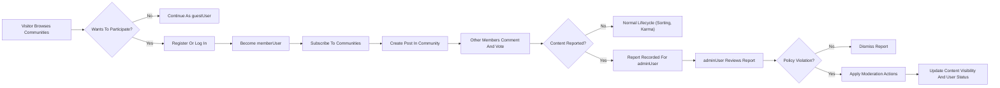

# Requirements Analysis – Reddit-like Community Platform Backend (communityPlatform)

## 1. Service Overview and Scope

THE "communityPlatform" backend SHALL support a Reddit-like community service where users can:
- Register and log in as members.
- Create and manage topic-based communities (similar to subreddits).
- Create posts containing text, links, or images within communities.
- Comment on posts with nested (threaded) replies.
- Upvote or downvote posts and comments.
- Accumulate and display user karma.
- Sort posts by hot, new, top, and controversial metrics.
- Subscribe to communities and view personalized feeds.
- View user profiles listing posts, comments, and karma.
- Report inappropriate content for moderation.

THE requirements in this analysis SHALL describe **what** the backend must do in business and behavioral terms and SHALL avoid prescribing **how** it is implemented (no API shapes, no database schemas, no infrastructure details).

## 2. User Actors and High-level Capabilities

### 2.1 guestUser

- THE system SHALL treat any visitor without a valid authenticated session as a guestUser.
- THE system SHALL allow guestUser to browse public communities, posts, and comments.
- THE system SHALL allow guestUser to view public portions of user profiles.
- THE system SHALL forbid guestUser from creating communities, posts, comments, votes, subscriptions, or reports.

### 2.2 memberUser

- THE system SHALL treat any authenticated non-admin account as memberUser.
- THE system SHALL allow memberUser to create and manage their own posts and comments.
- THE system SHALL allow memberUser to create communities where business rules permit.
- THE system SHALL allow memberUser to vote on posts and comments, subscribe to communities, report content, and manage profiles.

### 2.3 adminUser

- THE system SHALL treat any authenticated account with administrative role as adminUser.
- THE system SHALL allow adminUser to perform all memberUser actions.
- THE system SHALL allow adminUser to review reports, moderate content, and apply account-level restrictions.

## 3. Authentication and Account Management

### 3.1 Registration

- WHEN a visitor submits registration data, THE system SHALL validate mandatory fields (for example username-like handle, secret credential, and any required contact identifier) for presence, format, and uniqueness.
- IF registration data fails validation, THEN THE system SHALL reject the registration attempt and SHALL return human-understandable validation reasons grouped by field.
- WHEN registration succeeds, THE system SHALL create a memberUser account and SHALL either establish an authenticated session immediately or SHALL guide the user to log in according to business rules (for example email verification requirement).
- WHERE email or identity verification is required, THE system SHALL treat the account as limited until verification succeeds and SHALL block actions that require a verified identity according to policy.

### 3.2 Login and Logout

- WHEN a user submits login credentials, THE system SHALL verify them against stored account records.
- IF credentials are invalid or the account is not permitted to log in (for example banned or disabled), THEN THE system SHALL deny login and SHALL not reveal which specific credential was incorrect.
- WHEN login succeeds, THE system SHALL establish a session that identifies the actor as guestUser, memberUser, or adminUser appropriately.
- WHEN a logged-in user requests logout, THE system SHALL terminate the active session and SHALL treat further actions from that client as guestUser actions.
- WHEN a user requests "log out from all devices", THE system SHALL invalidate all active sessions associated with that account.

### 3.3 Session Behavior and Expiry

- WHILE a session is valid, THE system SHALL honor the actor’s role (guestUser, memberUser, adminUser) for authorization decisions.
- WHEN a session exceeds its configured lifetime or inactivity timeout, THE system SHALL expire the session and SHALL require re-authentication for protected actions.
- IF a session is detected as compromised according to business-defined signals, THEN THE system SHALL revoke that session and MAY revoke related sessions according to risk policy.

## 4. Communities (Subreddit-like Spaces)

### 4.1 Community Creation

- WHEN a memberUser requests to create a community, THE system SHALL require a unique community identifier (name), a description, and any required metadata (for example visibility type) and SHALL validate them.
- WHEN community name validation fails due to length, prohibited characters, prohibited words, or duplication, THE system SHALL reject the creation request and SHALL indicate the violated rules.
- WHEN community creation succeeds, THE system SHALL associate the new community with the creating memberUser as owner or primary maintainer and SHALL record creation time.
- WHERE business policy restricts who can create communities (for example minimum karma or account age), THE system SHALL enforce those restrictions.

### 4.2 Community Visibility

- WHERE a community is public, THE system SHALL allow guestUser and memberUser to view its metadata, posts, and comments subject to content visibility rules.
- WHERE a community is restricted, THE system SHALL allow only eligible users to create posts and comments while still allowing broader viewing according to policy.
- WHERE a community is private, THE system SHALL restrict visibility and participation to approved users and SHALL treat access attempts by others as unauthorized.

### 4.3 Community Management

- WHEN a community owner or adminUser updates community metadata (for example description, rules, visibility flags), THE system SHALL validate and apply the changes while recording the time of update.
- IF a memberUser who is not an authorized owner or manager attempts to update community metadata, THEN THE system SHALL reject the action for insufficient permission.
- WHERE business policy allows community deletion or closure, THE system SHALL ensure only authorized actors (owner or adminUser) can trigger such actions and SHALL apply consistent behavior to associated posts and comments (for example archive or hide) according to data lifecycle rules.

## 5. Posts (Text, Link, Image)

### 5.1 Post Types and Required Fields

- WHEN a memberUser creates a post, THE system SHALL require the target community, a title, and a post type (text, link, or image).
- WHERE the type is text, THE system SHALL require a textual body that satisfies minimum and maximum length rules.
- WHERE the type is link, THE system SHALL require a URL that complies with format, safety, and policy rules (for example no banned domains) and SHALL reject malformed or disallowed URLs.
- WHERE the type is image, THE system SHALL require an image reference that respects allowed formats and size constraints defined by policy.

### 5.2 Post Creation and Validation

- WHEN a memberUser submits a post, THE system SHALL verify that the community exists, is visible to the user, and allows posting by that memberUser.
- WHEN required fields or content rules are violated, THE system SHALL reject post creation and SHALL provide field-level validation messages.
- WHEN post creation succeeds, THE system SHALL persist the post with references to the author and community and SHALL initialize score and visibility state.

### 5.3 Post Editing and Deletion

- WHERE business rules allow post editing within a time window, THE system SHALL allow the author to edit allowed fields (for example title and body) while enforcing that the edited content still passes all validations.
- IF a memberUser attempts to edit a post outside the permitted conditions, THEN THE system SHALL reject the edit and SHALL indicate why editing is disallowed.
- WHEN an author deletes their post, THE system SHALL hide the post from standard views and SHALL prevent new comments and votes on that post while applying consistent behavior for existing comments (for example leaving them with a deleted-parent indicator).
- WHEN an adminUser removes a post for policy reasons, THE system SHALL mark the post as removed due to moderation, SHALL prevent new interactions, and SHALL retain moderation metadata for audit.

## 6. Comments and Nested Replies

### 6.1 Comment Creation

- WHEN a memberUser views a post that accepts comments, THE system SHALL allow the memberUser to add a top-level comment containing text that meets length and content policies.
- WHEN a memberUser replies to an existing comment, THE system SHALL create a nested comment associated with both the parent comment and the post.
- IF the target post or comment is locked, deleted, or invisible to the memberUser, THEN THE system SHALL reject new comment creation on that target.

### 6.2 Comment Editing and Deletion

- WHERE business rules allow comment editing, THE system SHALL allow the comment’s author to edit the comment within a configured window and SHALL enforce that new text respects all validations.
- WHEN an author deletes a comment, THE system SHALL replace its visible text with a generic deletion indicator while preserving thread structure for child comments.
- WHEN an adminUser removes a comment for moderation reasons, THE system SHALL mark it as removed by moderation and SHALL optionally block new replies to that comment according to policy.

### 6.3 Comment Thread Presentation

- WHEN any actor views a post, THE system SHALL retrieve associated comments and SHALL present them in a hierarchical (parent/child) structure.
- WHERE depth or volume is large, THE system SHALL support paginated or incremental loading while preserving parent-child integrity and order.

## 7. Voting and Karma

### 7.1 Voting on Posts and Comments

- WHEN a memberUser views a post or comment, THE system SHALL allow the memberUser to express one of three vote states: upvote, downvote, or no vote.
- WHEN a memberUser casts a vote on an item for the first time, THE system SHALL create a vote record and update the item’s score accordingly.
- WHEN a memberUser changes an existing vote (for example from upvote to downvote or from upvote to no vote), THE system SHALL update the record and SHALL adjust the item’s score based on the change.
- WHERE business rules forbid self-voting, THE system SHALL prevent a memberUser from voting on their own posts and comments.
- IF a guestUser attempts to vote, THEN THE system SHALL reject the action and SHALL indicate that authentication is required.

### 7.2 Karma Calculation

- THE system SHALL maintain a karma value for each memberUser that reflects the aggregated impact of votes on that user’s posts and comments according to configured weights.
- WHEN votes are created, changed, or removed, THE system SHALL adjust affected users’ karma values in line with karma rules.
- WHEN a user profile is viewed, THE system SHALL display the user’s karma (and optionally separate post and comment karma) according to visibility policy.
- IF content is removed or restored, THEN THE system SHALL adjust karma associated with that content according to business rules (for example subtracting karma for removed policy-violating content).

## 8. Sorting Modes and Feeds

### 8.1 Sorting Modes

- WHEN a list of posts is requested, THE system SHALL support at least four sorting modes: hot, new, top, and controversial.
- WHERE sorting mode is new, THE system SHALL order posts primarily by creation time descending.
- WHERE sorting mode is top, THE system SHALL order posts by score descending, optionally constrained to a time window (for example day, week, month) according to business needs.
- WHERE sorting mode is hot, THE system SHALL use a function that combines score and age to surface currently popular posts while gradually demoting older items.
- WHERE sorting mode is controversial, THE system SHALL emphasize posts with substantial upvotes and downvotes in a relatively balanced manner.

### 8.2 Community Feeds

- WHEN a user views a community feed, THE system SHALL return posts belonging only to that community, filtered by visibility and moderation rules and ordered by the chosen sort mode.
- THE system SHALL apply paging to community feeds and SHALL ensure that a given combination of sort mode and page parameters returns a consistent slice of posts at the time of the request.

### 8.3 Personalized Feeds

- WHEN a memberUser requests their personalized home feed, THE system SHALL aggregate posts from communities to which that user is subscribed and SHALL sort them by a chosen mode (for example hot or new).
- WHERE a memberUser has no active subscriptions, THE system SHALL define behavior such as showing globally popular posts according to business policy.
- THE system SHALL enforce that hidden or restricted posts do not appear in personalized feeds for users who are not allowed to see them.

## 9. Subscriptions

### 9.1 Subscribe and Unsubscribe Behavior

- WHEN a memberUser requests to subscribe to a community, THE system SHALL create a subscription relationship unless subscriptions to that community are restricted for that user.
- WHEN a memberUser requests to unsubscribe from a community, THE system SHALL remove the subscription relationship and SHALL exclude the community from future personalized feeds.
- IF a subscription or unsubscription request repeats an existing state (for example subscribing when already subscribed), THEN THE system SHALL treat the request as idempotent and SHALL not create duplicates.
- IF a guestUser attempts to subscribe or unsubscribe, THEN THE system SHALL reject the action and SHALL indicate that authentication is required.

## 10. User Profiles

### 10.1 Profile Contents

- WHEN a user profile is requested, THE system SHALL present at least the public identifier (for example username-like handle), account age indicator, and aggregate karma.
- WHEN a profile is requested, THE system SHALL show lists or summaries of public posts and comments authored by that user, subject to content visibility rules (for example omitting fully removed items).
- WHERE the requester is the profile owner, THE system SHALL allow access to additional account-related data (for example profile bio, certain settings) consistent with privacy policy.

### 10.2 Profile Visibility and Restrictions

- WHERE an account is banned or suspended, THE system SHALL indicate the restricted status when its profile is viewed and SHALL adjust visibility of historical content according to moderation policy.
- WHEN a profile belongs to a deleted account, THE system SHALL treat the profile as unavailable and SHALL avoid exposing personal identifiers that are meant to be removed.

## 11. Reporting Inappropriate Content and Moderation

### 11.1 Reporting

- WHEN a memberUser views a post or comment, THE system SHALL allow the memberUser to submit a report indicating that the content may violate rules.
- WHEN a memberUser submits a report, THE system SHALL capture the reporter, target content, reason category, optional description, and timestamp.
- IF a memberUser attempts to report the same content repeatedly beyond allowed limits, THEN THE system SHALL restrict duplicate reporting and SHALL inform the user that the content has already been reported.
- IF a guestUser attempts to report content, THEN THE system SHALL reject the attempt and SHALL indicate that authentication is required.

### 11.2 Admin Review and Actions

- WHEN an adminUser reviews reports, THE system SHALL present reported content, context (for example basic stats and history), and report details.
- WHEN an adminUser decides on a report, THE system SHALL allow actions such as dismiss, hide or remove content, lock threads, or apply user restrictions consistent with moderation policy.
- WHEN a moderation action is taken, THE system SHALL record the action, the acting adminUser, and the time for audit and potential appeals.
- WHEN moderation changes content visibility or account status, THE system SHALL ensure subsequent requests respect the updated state (for example removed content no longer appearing in feeds).

## 12. Non-functional Expectations (Business-level)

### 12.1 Performance

- WHEN a user loads a community feed or a post with its initial comments, THE system SHALL return results within a few seconds (for example around 2 seconds) under normal load so that the interaction feels responsive.
- WHEN a memberUser submits posts, comments, votes, subscriptions, or reports, THE system SHALL confirm success or failure within a few seconds under normal load.

### 12.2 Availability and Degradation

- THE system SHALL aim to keep core read operations (browsing communities, posts, comments, and profiles) available the vast majority of the time during a typical month.
- IF partial failures occur, THEN THE system SHALL prioritize core browsing and basic posting over non-critical features (for example advanced analytics) and SHALL degrade gracefully.

### 12.3 Security and Access Control

- THE system SHALL enforce role-based access control such that guestUser, memberUser, and adminUser capabilities are honored for all operations.
- WHEN sensitive operations occur (for example moderation decisions, account restrictions), THE system SHALL log actor, target, and time at a conceptual level suitable for audit.

## 13. Key User Flows (Narrative + Diagram)

### 13.1 Typical Member Journey

- WHEN a new visitor wants to participate, THE journey SHALL begin as guestUser browsing public communities.
- WHEN the visitor decides to post or comment, THE system SHALL require registration and login, transforming the actor into memberUser.
- WHEN the memberUser discovers interesting communities, THE system SHALL allow subscription and SHALL populate the personalized feed with new posts from those communities.
- WHEN the memberUser creates posts and comments, other memberUser actors SHALL be able to vote and reply, influencing karma and sorting.
- WHEN inappropriate content is encountered, memberUser SHALL be able to report it, and adminUser SHALL be able to review and moderate.

### 13.2 Mermaid Diagram – End-to-end Posting and Moderation Flow

## 14. Assumptions and Constraints

- THE platform SHALL treat most communities as public unless business policy defines restricted or private types.
- THE platform SHALL treat voting as anonymous at the user interface level; other users SHALL not see which specific accounts cast votes.
- THE platform SHALL use karma as a central, visible signal of contribution quality in profiles and MAY use it for eligibility rules (for example community creation, reduced rate limits).
- THE requirements described here SHALL remain independent of specific technologies (for example NestJS, Prisma, or particular databases) so that developers retain full autonomy over implementation details while meeting the described behaviors.