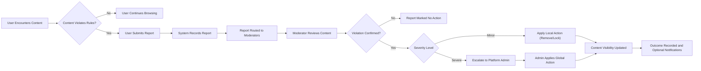

# Requirements Analysis – communityPlatform (Reddit-like Community Platform)

## 1. Service Overview

communityPlatform is a Reddit-like online community service where users organize discussions into topic-based communities, publish posts (text, links, images), discuss via nested comments, vote on content, accumulate karma, subscribe to communities, maintain public profiles, and report inappropriate content for moderation.

The platform must support:
- User registration, login, logout, and session management.
- Creation and configuration of communities by users.
- Posting of text, link, and image content within communities.
- Commenting on posts with nested reply threads.
- Upvote/downvote voting on posts and comments.
- A user karma system driven by voting outcomes.
- Sorting by hot, new, top, and controversial across feeds.
- Subscriptions to communities and personalized feeds.
- User profiles summarizing activity and karma.
- Reporting of inappropriate content and moderation workflows.

All requirements in this document are expressed as business requirements, independent of specific technical implementation choices.

## 2. User Actors

### 2.1 Actor List

- **guestUser** – Unauthenticated visitor.
- **memberUser** – Registered, authenticated user.
- **communityModerator** – memberUser with extra permissions for specific communities.
- **platformAdmin** – Platform-level administrator with global authority.

### 2.2 Actor Capabilities (High-Level)

- THE communityPlatform SHALL allow **guestUser** to browse public communities and public content but not to create or interact with content that requires identity.
- THE communityPlatform SHALL allow **memberUser** to fully participate in communities (create communities, posts, comments, votes, subscriptions, and reports) within policy limits.
- THE communityPlatform SHALL allow **communityModerator** to manage communities they moderate, including content moderation actions and community configuration, in addition to memberUser capabilities.
- THE communityPlatform SHALL allow **platformAdmin** to view and moderate content across all communities and manage global policies, overrides, and sanctions.

## 3. Core Domain Concepts

### 3.1 Communities

- A community is a named, topic-focused space where posts and comments are shared.
- Each community has a unique identifier, a title, description, rules, visibility, and one or more communityModerators.

EARS requirements:
- THE communityPlatform SHALL treat each community as belonging to exactly one global namespace where its identifier is unique.
- WHEN a community is visible as public, THE communityPlatform SHALL allow any actor to view its public posts and comments subject to moderation rules.

### 3.2 Posts

- A post is a content item created inside a community.
- Post types include text, link, and image-based posts.
- Posts have an author (memberUser), creation time, body, optional edits, and voting.

EARS requirements:
- THE communityPlatform SHALL associate each post with exactly one community and exactly one author.
- THE communityPlatform SHALL store the post type in a way that allows enforcement of type-specific rules.

### 3.3 Comments and Nested Replies

- A comment is a reply to either a post (top-level comment) or another comment (nested reply).
- Comments form a tree structure per post.

EARS requirements:
- THE communityPlatform SHALL associate each comment with a single post and optionally a parent comment.
- THE communityPlatform SHALL maintain a parent-child relationship between comments to support nested display.

### 3.4 Votes and Scores

- Votes are upvotes or downvotes applied by authenticated users to posts and comments.
- Each user has at most one active vote per target item.

EARS requirements:
- THE communityPlatform SHALL allow only authenticated users to cast votes on posts and comments.
- THE communityPlatform SHALL maintain a numeric score for each post and comment derived from its votes.

### 3.5 Karma

- Karma is a numeric representation of a user’s contribution quality based on votes on their posts and comments.

EARS requirements:
- THE communityPlatform SHALL maintain karma values per user and SHALL update them when votes on their content change.

### 3.6 Subscriptions and Feeds

- A subscription links a memberUser to a community they want to follow.
- A personalized feed is a list of posts built primarily from subscribed communities.

EARS requirements:
- THE communityPlatform SHALL maintain subscription relationships between memberUser and communities.
- WHEN constructing a personalized feed, THE communityPlatform SHALL consider posts from communities where the user is subscribed, subject to visibility and safety rules.

### 3.7 User Profiles

- A user profile summarizes a memberUser’s public activity (posts, comments, karma, and basic attributes).

EARS requirements:
- THE communityPlatform SHALL provide a profile view for each memberUser containing public information and activity summaries subject to privacy and moderation rules.

### 3.8 Reports and Moderation

- A report flags content or users for potential violation of rules.
- Reports feed into moderation workflows processed by communityModerators and platformAdmins.

EARS requirements:
- THE communityPlatform SHALL allow users to submit structured reports on posts, comments, communities, and users, subject to platform policy.

## 4. Authentication and Session Requirements

### 4.1 Registration

EARS requirements:
- WHEN a guestUser submits registration data that satisfies validation rules (unique identifier, credential rules, required fields), THE communityPlatform SHALL create a new memberUser account in either pending or active state according to verification policy.
- IF registration data does not satisfy validation rules, THEN THE communityPlatform SHALL reject registration and SHALL identify which fields failed business validation.
- WHERE verification (such as email confirmation) is required, THE communityPlatform SHALL restrict actions of unverified accounts according to policy (for example, limiting posting or voting).

### 4.2 Login and Logout

EARS requirements:
- WHEN a user submits login credentials that match an active, non-banned account, THE communityPlatform SHALL establish an authenticated session and SHALL treat subsequent actions as belonging to that memberUser until logout or session expiry.
- IF login credentials are invalid or the account is banned or suspended, THEN THE communityPlatform SHALL deny login and SHALL return a generic authentication failure message without exposing sensitive account status.
- WHEN an authenticated user initiates logout, THE communityPlatform SHALL terminate their current session and SHALL treat subsequent requests as guestUser actions.
- WHERE a user triggers a "log out from all devices" action, THE communityPlatform SHALL revoke all active sessions associated with that user.

### 4.3 Session Lifetime and Security

EARS requirements:
- THE communityPlatform SHALL enforce a maximum session lifetime and inactivity timeout defined by policy.
- WHERE a session has expired or been revoked, THE communityPlatform SHALL require re-authentication before allowing actions that require memberUser identity.

### 4.4 Account Status Effects

EARS requirements:
- THE communityPlatform SHALL associate each memberUser with an account status (for example active, pending verification, suspended, banned) and SHALL enforce allowed actions based on that status.
- IF an account is suspended, THEN THE communityPlatform SHALL prevent that user from performing content-creating actions (posting, commenting, voting, reporting, subscribing) while optionally allowing read-only access to public content.
- IF an account is banned, THEN THE communityPlatform SHALL prevent login and SHALL block all memberUser-only actions for that account.

## 5. Community Management Requirements

### 5.1 Community Creation

EARS requirements:
- WHEN an authenticated memberUser meets community creation criteria (for example minimum karma or limits not exceeded), THE communityPlatform SHALL allow that memberUser to create a new community with required attributes (identifier, title) and optional attributes (description, rules).
- THE communityPlatform SHALL ensure that each community identifier is unique and SHALL treat identifiers as unique regardless of case.
- IF a requested community identifier violates naming or content policies, THEN THE communityPlatform SHALL reject community creation and SHALL explain which rule was violated in business terms.
- WHEN a community is created successfully, THE communityPlatform SHALL assign the creating memberUser as at least one communityModerator for that community.

### 5.2 Community Configuration

EARS requirements:
- WHERE a user is a communityModerator for a community, THE communityPlatform SHALL allow that user to update community metadata (title, description, rules, visibility level) within platform-wide policy constraints.
- IF a configuration change violates global policies (for example disallowed content in description), THEN THE communityPlatform SHALL reject the change and SHALL specify the business reason.

### 5.3 Community Visibility

EARS requirements:
- THE communityPlatform SHALL support at least public, restricted, and private visibility modes for communities defined in business terms.
- WHEN a community is public, THE communityPlatform SHALL allow guestUser and all memberUser to view public content of that community.
- WHEN a community is restricted, THE communityPlatform SHALL allow only authorized users (for example approved members) to view or interact with its non-public content.
- WHEN a community is private, THE communityPlatform SHALL allow only explicitly approved users, its communityModerators, and platformAdmins to view or interact with its content.

### 5.4 Community Archival and Removal

EARS requirements:
- WHERE a community is marked as archived, THE communityPlatform SHALL prevent creation of new posts while allowing viewing of existing content according to visibility and moderation rules.
- WHERE a community is removed by platformAdmin for policy reasons, THE communityPlatform SHALL block all user-facing access to that community and SHALL exclude it from discovery and feeds while preserving necessary internal records for audit.

## 6. Post Requirements

### 6.1 Post Creation

EARS requirements:
- WHEN an authenticated memberUser with posting permission in a community submits a valid text post (title and body within limits), THE communityPlatform SHALL create the post, associate it with the community and author, and SHALL make it visible according to sorting and listing rules.
- WHEN an authenticated memberUser with posting permission submits a valid link post (title and acceptable URL), THE communityPlatform SHALL create the post and SHALL store the URL for later rendering and safety checks.
- WHEN an authenticated memberUser with posting permission submits a valid image-based post with required image reference and optional body, THE communityPlatform SHALL create the post and SHALL associate it with the underlying image handling solution conceptually.
- IF a submitted post violates length limits, unsupported type rules, or community-specific content restrictions, THEN THE communityPlatform SHALL reject the post and SHALL identify the violated rule.
- IF a memberUser attempts to create a post in a community where they are banned or where posting is disabled, THEN THE communityPlatform SHALL reject the post and SHALL indicate that posting is not allowed for that user in that community.

### 6.2 Post Editing and Deletion

EARS requirements:
- WHERE a memberUser is the author of a post, THE communityPlatform SHALL allow that user to edit the post within policy-defined constraints (for example within an edit window or with visible edit markers).
- WHEN a post is edited, THE communityPlatform SHALL update the last-updated time and SHALL mark the post as edited.
- WHERE a memberUser is the author of a post, THE communityPlatform SHALL allow that user to delete the post according to platform deletion rules, which from a user perspective removes the post from standard views and feeds.
- WHERE a communityModerator or platformAdmin removes a post for moderation reasons, THE communityPlatform SHALL hide the content body from general users while indicating that the post was removed and retaining sufficient metadata for moderation and audit.

### 6.3 Post Locking

EARS requirements:
- WHERE a user is a communityModerator or platformAdmin, THE communityPlatform SHALL allow that user to lock a post to prevent new comments while preserving visibility of existing content.
- WHILE a post is locked, THE communityPlatform SHALL prevent creation of new comments on that post.
- WHERE policy requires freezing of votes on locked posts, THE communityPlatform SHALL prevent new votes on locked posts while preserving existing votes.

### 6.4 Post Listing and Visibility

EARS requirements:
- WHEN users view a community, THE communityPlatform SHALL present a list of posts for that community ordered according to the selected sorting mode and filtered by visibility and moderation status.
- WHEN users view their personalized feed, THE communityPlatform SHALL present posts from subscribed communities, filtered by user access, community visibility, moderation state, and safety preferences.

## 7. Comment Requirements

### 7.1 Comment Creation

EARS requirements:
- WHEN an authenticated memberUser with commenting permission views a post that allows comments and submits a valid comment body, THE communityPlatform SHALL create a top-level comment associated with that post and author.
- WHEN an authenticated memberUser with commenting permission submits a valid reply to an existing comment within allowed nesting depth, THE communityPlatform SHALL create a nested comment linked to the parent comment and the post.
- IF a post is locked, archived, or otherwise closed for comments, THEN THE communityPlatform SHALL reject new comments and SHALL inform users that commenting is not allowed.
- IF a user is banned from a community, THEN THE communityPlatform SHALL prevent that user from commenting on posts in that community.

### 7.2 Comment Editing and Deletion

EARS requirements:
- WHERE a memberUser is the author of a comment, THE communityPlatform SHALL allow that user to edit the comment within policy-defined constraints.
- WHEN a comment is edited, THE communityPlatform SHALL update the last-updated time and SHALL mark the comment as edited.
- WHERE a memberUser is the author of a comment, THE communityPlatform SHALL allow that user to delete the comment; from a user perspective, this replaces the content with a placeholder while preserving thread structure.
- WHERE a communityModerator or platformAdmin removes a comment for moderation reasons, THE communityPlatform SHALL hide the content body from general users, indicate that it was removed, and preserve necessary metadata for moderation and audit.

### 7.3 Comment Locking and Depth

EARS requirements:
- WHERE a user is a communityModerator or platformAdmin, THE communityPlatform SHALL allow that user to lock a comment thread to prevent additional replies under that comment.
- WHILE a comment thread is locked, THE communityPlatform SHALL prevent new replies while allowing reading of existing comments.
- THE communityPlatform SHALL enforce a configured maximum nesting depth, beyond which replies are not allowed and SHALL inform users when nesting limit is reached.

## 8. Voting and Karma Requirements (High-Level)

### 8.1 Voting Eligibility and Behavior

EARS requirements:
- THE communityPlatform SHALL allow only authenticated users to cast upvotes or downvotes on posts and comments.
- THE communityPlatform SHALL enforce that each user has at most one active vote per post and per comment.
- WHEN a user casts a vote on content they can view, THE communityPlatform SHALL record the vote, update vote counts, and adjust the content score accordingly.
- WHEN a user changes or removes their existing vote, THE communityPlatform SHALL update vote counts and content score to reflect the new vote state.
- IF a user attempts to vote on their own content and self-voting is disallowed, THEN THE communityPlatform SHALL reject that vote and SHALL explain that self-voting is not permitted.
- IF a user attempts to vote on removed or locked content where voting is disabled, THEN THE communityPlatform SHALL reject the vote.

### 8.2 Karma Updates

EARS requirements:
- WHEN a vote is added, changed, or removed on a post or comment, THE communityPlatform SHALL update the corresponding author’s karma according to platform-defined rules.
- THE communityPlatform SHALL distinguish at least between karma from posts and karma from comments for internal policy where required.
- WHERE policy ties user capabilities to karma thresholds (for example community creation, posting in sensitive communities), THE communityPlatform SHALL evaluate current karma before allowing or denying those actions.

## 9. Sorting and Ranking Requirements

### 9.1 Sorting Modes

EARS requirements:
- THE communityPlatform SHALL support at least four sorting modes for posts: "hot", "new", "top", and "controversial".
- WHEN "new" sorting is selected, THE communityPlatform SHALL order posts primarily by creation time from newest to oldest.
- WHEN "top" sorting is selected, THE communityPlatform SHALL order posts primarily by score, optionally constrained to a selected time range.
- WHEN "hot" sorting is selected, THE communityPlatform SHALL order posts using a combination of score and age such that recently popular posts appear higher than older posts with similar scores.
- WHEN "controversial" sorting is selected, THE communityPlatform SHALL prioritize posts with substantial and balanced upvotes and downvotes over posts with low engagement.

### 9.2 Sorting Contexts

EARS requirements:
- WHERE sorting modes are offered (for example community feeds, personalized feeds, profile post lists), THE communityPlatform SHALL apply sorting rules consistently across those contexts.
- IF a requested sorting mode is not supported in a given context, THEN THE communityPlatform SHALL fall back to a default mode (for example "hot" or "new") and SHALL indicate the applied mode in user-facing context.

## 10. Subscription and Feed Requirements

### 10.1 Subscription Lifecycle

EARS requirements:
- WHEN an authenticated memberUser requests to subscribe to a community they can access, THE communityPlatform SHALL create a subscription relationship.
- WHEN an authenticated memberUser requests to unsubscribe from a community they are subscribed to, THE communityPlatform SHALL remove or deactivate that subscription.
- IF a memberUser attempts to subscribe to a community that is not visible or that has reached subscription limits as defined by policy, THEN THE communityPlatform SHALL reject the subscription and SHALL provide a business explanation.
- WHERE a user is banned from a community, THE communityPlatform SHALL treat existing subscriptions as inactive for feed construction and SHALL prevent new subscriptions to that community by that user.

### 10.2 Personalized Feed Construction

EARS requirements:
- WHEN a memberUser requests their personalized feed, THE communityPlatform SHALL construct the feed primarily from posts in communities to which that user is subscribed, filtered by content visibility, moderation status, and user safety settings.
- WHERE a memberUser has no active subscriptions, THE communityPlatform SHALL build the personalized feed using a default strategy such as showing popular or recommended posts as defined by business rules.
- THE communityPlatform SHALL allow feed sorting using supported modes and SHALL apply sorting after filters and visibility rules.

## 11. User Profile Requirements

### 11.1 Profile Content

EARS requirements:
- THE communityPlatform SHALL maintain a profile for each memberUser containing at least username, join date, karma summary, and links to posts and comments according to visibility rules.
- WHERE a user chooses to configure profile attributes (for example display name, bio, avatar reference), THE communityPlatform SHALL enforce validation rules for length and content.

### 11.2 Profile Viewing

EARS requirements:
- WHEN a user views a memberUser profile, THE communityPlatform SHALL show public parts of that profile (for example posts, comments, karma) filtered by content visibility and moderation state.
- WHERE profile privacy or safety rules restrict visibility of certain data (for example hidden history), THE communityPlatform SHALL enforce those rules for all actors except platformAdmin where policy requires oversight access.

## 12. Reporting and Safety Requirements (High-Level)

### 12.1 Reportable Entities

EARS requirements:
- THE communityPlatform SHALL allow authenticated users to report posts, comments, communities, and users for potential violations of community or platform policies.
- WHERE platform policy permits, THE communityPlatform SHALL allow guestUser to report severe abusive content and SHALL mark such reports as originating from unauthenticated actors.

### 12.2 Report Submission

EARS requirements:
- WHEN a user submits a report, THE communityPlatform SHALL require selection of at least one reason from a predefined list and SHALL allow optional free-text details within limits.
- IF a report submission is missing mandatory information (for example reason), THEN THE communityPlatform SHALL reject the report and SHALL explain what is missing.
- WHEN a report is successfully submitted, THE communityPlatform SHALL create a report record containing the reporter (where available), target entity, reasons, and timestamp.

### 12.3 Report Handling and Moderation

EARS requirements:
- WHERE a report targets content within a community, THE communityPlatform SHALL make the report visible to that community’s communityModerators and to platformAdmins.
- WHEN communityModerators or platformAdmins review a report, THE communityPlatform SHALL provide them with the reported content, its context, and aggregated report details to support decisions.
- WHEN a report is resolved, THE communityPlatform SHALL record the outcome (for example no action, content removal, content locking, user sanction) and SHALL update content visibility and user restrictions accordingly.

### 12.4 Safety Priorities

EARS requirements:
- WHERE reports indicate severe policy violations (for example illegal content, credible threats, extreme harassment), THE communityPlatform SHALL prioritize prompt restriction or removal of the content ahead of slower, less critical processes.

## 13. Error Handling and Edge-Case Requirements (Business View)

### 13.1 General Error Principles

EARS requirements:
- WHEN an action fails due to invalid input, THE communityPlatform SHALL inform the user which business rule was violated and SHALL allow correction and retry.
- WHEN an action fails due to lack of permission, THE communityPlatform SHALL state that the user is not authorized for that action without exposing internal details.
- WHEN an action fails due to temporary system issues, THE communityPlatform SHALL inform the user that the issue is temporary and SHALL encourage retrying later.

### 13.2 Concurrency and Consistency

EARS requirements:
- WHEN two actors attempt conflicting actions on the same content (for example simultaneous edits or moderation actions), THE communityPlatform SHALL apply deterministic rules to select a final content state and SHALL avoid exposing contradictory states.
- WHEN content is deleted or locked while a user is interacting with it (for example typing a comment), THE communityPlatform SHALL reject new actions on that content and SHALL indicate that the content is no longer available or has been closed.

## 14. Example Flow Diagram – Reporting and Moderation

## 15. Non-Functional Expectations (Business Summary)

EARS requirements:
- WHEN users perform common actions such as browsing feeds, viewing posts, submitting posts or comments, voting, subscribing, or reporting, THE communityPlatform SHALL respond within a few seconds under normal load so that interaction feels responsive.
- THE communityPlatform SHALL maintain high availability for core actions (browsing, posting, commenting, voting, reporting) with only rare planned maintenance or unexpected outages.
- THE communityPlatform SHALL protect user credentials and sensitive data from unauthorized access through appropriate security measures defined in broader platform policies.
- THE communityPlatform SHALL maintain audit records of key actions (for example moderation decisions, bans, and report handling) to support investigations and compliance.

## 16. Implementation Autonomy Statement

THE requirements in this document describe what the communityPlatform must do at the business level. THE development team SHALL retain full autonomy to choose technical architectures, programming languages, frameworks, storage systems, and API designs, provided that the implemented system satisfies all behaviors and constraints defined here.