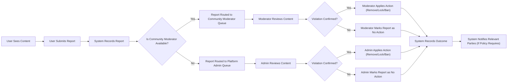

# Requirements Analysis Report for Reddit-like Community Platform (communityPlatform)

## 1. Introduction

### 1.1 Background and Context
The communityPlatform service is a Reddit-like online community platform designed to let users create and participate in topic-based communities. Within these communities, users can share posts (text, links, and images), discuss through comments with nested replies, vote on content, and build reputation through a karma system. Users can subscribe to communities to personalize their content feed and can report inappropriate content to maintain a safe environment.

This document transforms the high-level idea of a "Reddit-like community" into concrete, implementation-ready business requirements suitable for backend development. It focuses on what the system must do from a business and user perspective, not how it is implemented technically.

### 1.2 Objectives of the Platform
The main objectives of the communityPlatform are:
- Provide a structured way for users to create and manage communities around specific interests.
- Enable rich discussion via posts and nested comments.
- Use voting and a karma system to surface valuable content and signal user reputation.
- Offer multiple sorting modes (hot, new, top, controversial) that help users discover relevant content.
- Provide personalized experiences via community subscriptions and user profiles.
- Maintain a safe environment through reporting and moderation workflows.

### 1.3 Scope of This Document
This requirements analysis report covers:
- Business model overview and value proposition.
- User actors, their responsibilities, and permission boundaries.
- Core domain concepts and relationships.
- Functional requirements written in EARS format, including:
  - Registration and login.
  - Community creation and management.
  - Posting and commenting with nested replies.
  - Voting and karma.
  - Subscriptions and feeds.
  - User profiles.
  - Reporting and moderation triggers.
- Non-functional expectations from the user perspective.
- High-level user journeys and process flows.

The document does not specify technical implementation details, API contracts, database schemas, infrastructure, or UI layouts.

## 2. Business Model and Service Overview

### 2.1 Why This Service Exists
The platform addresses the need for user-driven, topic-centric communities where individuals can share information, ask questions, and engage in discussions. Unlike generic social media feeds, topic-based communities enable more focused and persistent conversations.

Key problems addressed:
- Fragmented discussions across multiple channels with no central topic-based organization.
- Difficulty discovering high-quality content among large volumes of posts.
- Limited user-driven moderation in many platforms.

The platform differentiates itself by:
- Providing flexible community creation, with community-level moderation and rules.
- Using a transparent karma system that reflects contributions.
- Supporting multiple sorting modes that emphasize recency, popularity, and controversy.

### 2.2 Core Value Proposition
The platform’s value proposition includes:
- For members: A place to join communities matching their interests, share content, and build reputation.
- For moderators: Tools to manage and curate communities, remove harmful content, and enforce rules.
- For platform administrators: A central system to ensure policy compliance and address abuse at a global level.

### 2.3 High-Level Feature Set
At a high level, communityPlatform supports:
- User registration, login, logout, and session handling.
- Community (subreddit-like) creation, configuration, and subscription.
- Posting text, links, and images within communities.
- Commenting with nested replies.
- Voting (upvote/downvote) on posts and comments.
- User karma tracking and application of business rules based on karma.
- Sorting feeds and lists by hot, new, top, and controversial.
- Reporting of inappropriate content and users.
- Moderation tools for community moderators and platform admins.

### 2.4 Success Metrics and KPIs (Business-Level)
Representative success indicators include:
- Monthly active users (MAU) and daily active users (DAU).
- Average number of posts and comments per active user per day.
- Percentage of users who subscribe to at least one community.
- Average karma growth per active user and distribution of karma across the user base.
- Time to first moderation action on reported content.
- Reduction of repeat abusive behavior over time.

## 3. User Actors and Roles

### 3.1 Actor Overview
The platform defines the following business actors:
- guestUser
- memberUser
- communityModerator
- platformAdmin

### 3.2 Detailed Actor Descriptions

#### 3.2.1 guestUser
- Unauthenticated visitor.
- Can browse public communities, view posts and comments, and perform basic searches.
- Cannot create posts, comments, or votes.
- May be allowed to submit limited reports on clearly abusive public content, depending on platform policy.

#### 3.2.2 memberUser
- Registered, authenticated user.
- Can create communities (subject to possible business limits, such as max communities per user).
- Can create, edit, and delete own posts and comments within defined conditions.
- Can vote (upvote/downvote) on posts and comments.
- Can subscribe and unsubscribe to communities.
- Can report content and users.
- Can view and manage own profile and settings.

#### 3.2.3 communityModerator
- A memberUser with elevated privileges for specific communities.
- Can edit community-level settings (name, description, rules, visibility, etc., within platform constraints).
- Can remove or lock posts and comments in their communities.
- Can handle reports for their communities.
- Can ban or restrict memberUsers from participating in their communities, within platform policy.

#### 3.2.4 platformAdmin
- Platform-level administrator.
- Has full visibility across all communities and users.
- Can enforce global policies, including permanent bans, global content removal, and global configuration changes.
- Can override community-level decisions when necessary for compliance or safety.

### 3.3 Responsibilities and Limitations (Business Summary)
- guestUser: Read-only access to public content, limited reporting.
- memberUser: Full participation in content creation and voting, subject to community and platform rules.
- communityModerator: Community-specific governance and enforcement.
- platformAdmin: Global governance and enforcement.

## 4. Authentication and Session Behavior (Business View)

### 4.1 Registration Requirements
- Registration is required to become a memberUser.
- The system must collect at least a unique identifier (e.g., email or username) and a credential (e.g., password) for registration.
- The system must support verification of contact information (such as email) before full participation in community activities.

Representative EARS-style requirements:
- THE communityPlatform SHALL require that each memberUser has a unique identifier that is not shared with any other memberUser.
- WHEN a new user attempts registration with an identifier already in use, THE communityPlatform SHALL reject the registration and instruct the user to choose a different identifier.
- WHEN a new user completes registration data entry, THE communityPlatform SHALL send a verification step before granting full posting permissions.

### 4.2 Login and Logout Requirements
- Users must log in to access memberUser features.

Requirements:
- WHEN a user submits login credentials, THE communityPlatform SHALL validate the credentials and either establish an authenticated session or clearly reject the attempt.
- IF a user provides invalid login credentials, THEN THE communityPlatform SHALL deny access and communicate that the credentials are invalid without exposing which part is incorrect.
- WHEN an authenticated user requests to log out, THE communityPlatform SHALL terminate the active session and prevent further authenticated actions until login occurs again.

### 4.3 Session Lifetime and Security Expectations
- Sessions must have limited lifetime to reduce unauthorized access risk.
- The platform should provide ways to revoke sessions.

Requirements:
- WHILE a memberUser session is active, THE communityPlatform SHALL treat all actions as authenticated on behalf of the associated memberUser.
- WHEN a memberUser triggers a "log out from all devices" action, THE communityPlatform SHALL invalidate all active sessions associated with that memberUser.
- WHERE a session has expired due to inactivity, THE communityPlatform SHALL require the memberUser to log in again before performing authenticated actions.

## 5. Core Domain Concepts

### 5.1 Communities (Subreddits)
- A community is a topic-based space created and configured by memberUsers.
- Communities have a name, description, rules, and possibly visibility settings (e.g., public vs restricted).
- Communities can have one or more communityModerators.

### 5.2 Posts
- A post belongs to exactly one community.
- A post has an author (memberUser), content (text, link, or image), creation time, and optional edits.
- Posts are the primary objects that users vote on and comment on.

### 5.3 Comments and Nested Replies
- Comments belong to a post.
- Comments form a tree structure (nested replies) where each comment may have a parent comment, except top-level comments.
- Comments have authors, content, creation time, and optional edits.

### 5.4 Votes and Karma
- Votes are user actions indicating positive (upvote) or negative (downvote) feedback on posts and comments.
- Votes contribute to content scores and to user karma.
- Karma is a numerical representation of a user’s contributions.

### 5.5 Subscriptions and Feeds
- A subscription is a relationship where a memberUser follows a community.
- A memberUser’s personalized feed is mainly composed of posts from subscribed communities.

### 5.6 User Profiles
- A user profile summarizes a memberUser’s public activity:
  - Posts created.
  - Comments made.
  - Karma level.
  - Basic profile information.

### 5.7 Reports and Moderation
- Reports are user-submitted flags on content or users for potentially inappropriate behavior.
- Reports initiate moderation workflows by communityModerators and platformAdmins.

## 6. Functional Requirements (EARS-Based)

### 6.1 Community Management Requirements

Creation and configuration:
- WHEN a memberUser requests to create a community with a valid name and required attributes, THE communityPlatform SHALL create a new community and assign the requesting memberUser as an initial communityModerator.
- IF a memberUser attempts to create a community with a name that already exists, THEN THE communityPlatform SHALL reject the request and instruct the memberUser to choose a different name.
- WHERE a community name or description violates platform naming policies, THE communityPlatform SHALL prevent the community creation and present the violation reason in business terms.

Management:
- WHEN a communityModerator edits community rules or description, THE communityPlatform SHALL update the community configuration and apply the new rules to future content.
- IF a memberUser without communityModerator privileges attempts to change community settings, THEN THE communityPlatform SHALL deny the action and indicate that the memberUser lacks permission.
- WHEN a communityModerator or platformAdmin marks a community as restricted or private (according to business policy), THE communityPlatform SHALL prevent guestUsers and unauthorized memberUsers from viewing restricted content in that community.

### 6.2 Post Management Requirements

Creation:
- WHEN a memberUser submits a post to a community with valid content (text, link, or image) and the memberUser is allowed to post, THE communityPlatform SHALL create the post and associate it with the target community and author.
- IF a memberUser attempts to submit a post with missing required fields (such as title where applicable), THEN THE communityPlatform SHALL reject the submission and identify which fields must be corrected.
- WHERE a community has posting restrictions (for example, minimum karma or community rules), THE communityPlatform SHALL enforce those restrictions when accepting new posts.

Editing and deletion:
- WHERE a post belongs to a memberUser, THE communityPlatform SHALL allow that memberUser to edit the post within business-defined constraints (for example, a time window or visibility of edit history).
- IF a memberUser attempts to edit a post they do not own without moderation privilege, THEN THE communityPlatform SHALL deny the edit.
- WHEN a memberUser deletes their own post, THE communityPlatform SHALL remove the post from public listings while retaining sufficient information for audit and moderation according to business policy.

Visibility and listing:
- WHEN users browse a community, THE communityPlatform SHALL display a list of posts for that community according to the selected sorting mode and applied filters (such as time range for top).
- IF a post has been removed or locked by a communityModerator or platformAdmin, THEN THE communityPlatform SHALL prevent further voting and commenting on that post and indicate its moderation state where appropriate.

### 6.3 Comment Management and Nesting Requirements

Creation:
- WHEN a memberUser submits a comment on a post, THE communityPlatform SHALL attach the comment to the specified post and optionally to a parent comment when replying.
- IF a memberUser attempts to comment on a post that is locked or removed, THEN THE communityPlatform SHALL reject the comment and indicate that commenting is disabled for that post.

Nesting and structure:
- WHEN a comment is created as a reply to another comment, THE communityPlatform SHALL record the parent-child relationship so that comments can be displayed in a nested structure.
- WHILE comments are displayed for a post, THE communityPlatform SHALL maintain the hierarchical relationships so that reply chains are visible to users.

Editing and deletion:
- WHERE a comment belongs to a memberUser, THE communityPlatform SHALL allow that memberUser to edit or delete the comment within business-defined constraints.
- IF a memberUser attempts to modify a comment they do not own and they are not a communityModerator or platformAdmin for the relevant community, THEN THE communityPlatform SHALL deny the action.

### 6.4 Voting and Karma Logic (High-Level)

Voting:
- WHEN a memberUser attempts to upvote or downvote a post or comment, THE communityPlatform SHALL record one active vote per memberUser per item and adjust the item’s score accordingly.
- IF a memberUser attempts to vote on their own content and the platform policy disallows self-voting, THEN THE communityPlatform SHALL deny the vote and indicate that self-voting is not allowed.
- WHEN a memberUser changes their vote on a post or comment (for example, from upvote to downvote), THE communityPlatform SHALL update the stored vote and recalculate the item’s score.

Karma:
- WHEN a vote is applied to a post or comment, THE communityPlatform SHALL update the karma of the content’s author according to the karma rules (for example, upvotes add, downvotes subtract).
- IF a vote is removed or reversed, THEN THE communityPlatform SHALL adjust the associated author’s karma to reflect the current vote state.
- WHERE a memberUser’s karma falls below defined thresholds, THE communityPlatform SHALL apply any associated participation limits as defined by business policy.

### 6.5 Subscription and Feed Behavior (High-Level)

Subscriptions:
- WHEN a memberUser chooses to subscribe to a community, THE communityPlatform SHALL create a subscription relationship linking the memberUser to the community.
- WHEN a memberUser chooses to unsubscribe from a community, THE communityPlatform SHALL remove the subscription relationship and exclude that community’s posts from the memberUser’s default feed.

Feeds:
- WHEN a memberUser requests their personalized feed, THE communityPlatform SHALL construct the feed primarily from posts in communities to which the memberUser is subscribed and apply the selected sorting mode.
- IF a memberUser has no subscriptions, THEN THE communityPlatform SHALL present a reasonable default feed such as popular or recommended communities without implying subscription.

### 6.6 User Profile Requirements

Profile information:
- THE communityPlatform SHALL maintain a profile for each memberUser that includes public activity such as posts and comments, as well as karma.

Profile viewing:
- WHEN a user views a memberUser profile, THE communityPlatform SHALL display a list of that memberUser’s posts and comments subject to visibility and moderation rules.
- WHERE content on a profile has been removed or restricted, THE communityPlatform SHALL respect the content’s visibility state when building the profile view.

Profile modification:
- WHERE a profile belongs to a memberUser, THE communityPlatform SHALL allow that memberUser to update configurable profile attributes (for example, display name or bio) within defined validation rules.

### 6.7 Reporting Inappropriate Content Requirements

- WHEN a memberUser or other permitted actor submits a report on a post, comment, community, or user, THE communityPlatform SHALL create a report record capturing the reporter, target, reason, and timestamp.
- IF a report submission omits required information (for example, reason), THEN THE communityPlatform SHALL reject the report and indicate which information is missing.
- WHEN a report is created, THE communityPlatform SHALL place it into the appropriate moderation queue for communityModerators and, where required, platformAdmins.

## 7. Content and Moderation Business Rules

### 7.1 Allowed and Disallowed Content (Conceptual)

Content policies define what is acceptable. Examples:
- Prohibited content: harassment, hate speech, explicit illegal content, spam.
- Restricted content: may require labeling or age restrictions.

EARS requirements:
- THE communityPlatform SHALL provide mechanisms for communityModerators and platformAdmins to mark content as violating platform or community rules.
- IF content is determined to violate platform policy, THEN THE communityPlatform SHALL remove or hide that content from standard user views.

### 7.2 Moderation Responsibilities by Actor

- Community-level moderation is primarily handled by communityModerators.
- Platform-level moderation is handled by platformAdmins.

Requirements:
- WHEN a report targets content within a community, THE communityPlatform SHALL route the report first to the communityModerators of that community unless business policy requires immediate platformAdmin review.
- WHEN a communityModerator takes an action such as removing or locking content, THE communityPlatform SHALL record the action, the actor, and the timestamp for audit purposes.
- IF a communityModerator consistently fails to address serious reports according to platform rules, THEN THE communityPlatform SHALL allow platformAdmins to intervene and override community decisions.

### 7.3 Outcomes of Reports

Possible outcomes include: no action, content removal, content locking, user warning, temporary or permanent ban.

Requirements:
- WHEN a report is resolved, THE communityPlatform SHALL store the resolution outcome and, where business rules require, notify relevant actors such as the reporter or content author.
- IF content has been removed as a result of a report, THEN THE communityPlatform SHALL prevent normal users from accessing the original content while preserving minimal data required for compliance and auditing.

## 8. Sorting and Ranking Requirements

### 8.1 Sorting Modes (Hot, New, Top, Controversial)

Definitions at business level:
- New: Sort by creation time, newest first.
- Top: Sort by net score (upvotes minus downvotes) over a defined time range.
- Hot: Sort by a combination of recency and score to prioritize recent popular posts.
- Controversial: Sort by a balance of upvotes and downvotes indicating disagreement.

Requirements:
- WHEN a user selects the "new" sorting mode, THE communityPlatform SHALL order posts or comments by creation time from most recent to oldest.
- WHEN a user selects the "top" sorting mode, THE communityPlatform SHALL order posts or comments by their score within the selected time range.
- WHEN a user selects the "hot" sorting mode, THE communityPlatform SHALL prioritize posts that are both recent and highly scored according to a defined ranking formula.
- WHEN a user selects the "controversial" sorting mode, THE communityPlatform SHALL emphasize items with high total votes and a mix of upvotes and downvotes.

### 8.2 Sorting Expectations in Different Contexts

Contexts include:
- Community listing pages.
- Personalized feed.
- User profiles.

Requirements:
- WHERE a sorting mode is available in a given context, THE communityPlatform SHALL apply that sorting mode consistently to the relevant list.
- IF a requested sorting mode is not applicable to a context, THEN THE communityPlatform SHALL default to a sensible standard mode such as "hot" or "new" and communicate the applied choice.

## 9. Error Handling and Edge Cases (Business Perspective)

### 9.1 General Error Handling Principles

Requirements:
- IF the communityPlatform cannot complete an action due to a recoverable issue (for example, validation error), THEN THE communityPlatform SHALL inform the user of the specific issue in clear business language and allow them to retry.
- IF the communityPlatform experiences an internal problem, THEN THE communityPlatform SHALL present a generic failure message without exposing internal details and encourage the user to retry later.

### 9.2 Authentication and Authorization Errors

Requirements:
- IF an unauthenticated user attempts an action that requires authentication (such as posting or voting), THEN THE communityPlatform SHALL deny the action and direct the user to authenticate.
- IF an authenticated user attempts an action beyond their role permissions, THEN THE communityPlatform SHALL deny the action and indicate that the user lacks sufficient permissions.

### 9.3 Content Creation and Interaction Errors

Requirements:
- IF a user attempts to post or comment with content exceeding allowed limits (such as maximum length), THEN THE communityPlatform SHALL reject the action and indicate the relevant limits.
- IF a user attempts to vote multiple times on the same item in a way that violates voting rules, THEN THE communityPlatform SHALL either update the existing vote or reject the additional vote according to the defined voting behavior.

### 9.4 Reporting and Moderation Errors

Requirements:
- IF a report is submitted targeting content that no longer exists or is already fully removed, THEN THE communityPlatform SHALL mark the report as resolved with a status indicating that the target is no longer available.
- IF a moderator attempts an action on content outside their community scope, THEN THE communityPlatform SHALL deny the action and indicate that the content is outside their moderation area.

### 9.5 Data Consistency and Concurrency Edge Cases

Requirements:
- IF two actions conflict (for example, two moderators attempting to resolve the same report simultaneously), THEN THE communityPlatform SHALL apply a deterministic rule to decide which action is recorded and inform the other actor of the outcome if necessary.
- IF content is deleted while another action is in progress on that content, THEN THE communityPlatform SHALL complete or cancel the in-progress action in a way that preserves data consistency according to business policy and notify the user appropriately.

## 10. Performance and Non-Functional Expectations

### 10.1 Responsiveness

Requirements:
- WHEN a user performs common actions such as browsing communities, viewing posts, or voting, THE communityPlatform SHALL respond within a few seconds under normal load so that interactions feel immediate to typical users.
- WHEN a user searches or filters content, THE communityPlatform SHALL return results fast enough to allow smooth exploration, typically within a few seconds for standard queries.

### 10.2 Availability and Reliability

Requirements:
- THE communityPlatform SHALL be available to users for the vast majority of the time, with only rare, scheduled interruptions for maintenance communicated in advance at the business level.
- IF an outage occurs unexpectedly, THEN THE communityPlatform SHALL resume normal operation as soon as reasonably possible and preserve user data according to integrity requirements.

### 10.3 Scalability Expectations

Requirements:
- WHILE the number of communities, posts, comments, and users grows over time, THE communityPlatform SHALL maintain acceptable response times for key actions under typical usage patterns.

### 10.4 Privacy and Data Protection

Requirements:
- THE communityPlatform SHALL protect user credentials and sensitive data from unauthorized access according to applicable privacy standards and regulations.
- WHERE users request deletion of their accounts, THE communityPlatform SHALL anonymize or remove personal identifiers while preserving content in a form that aligns with platform policies and legal obligations.

### 10.5 Auditability and Logging Expectations

Requirements:
- THE communityPlatform SHALL retain sufficient records of critical actions (such as moderation decisions, report handling, bans) to support investigations, appeals, and compliance checks.

## 11. User Journeys Overview

### 11.1 Registration and Login Journeys

- A guestUser visits the platform, browses content, and decides to register.
- The guestUser completes registration, verifies contact information, and becomes a memberUser.
- The memberUser logs in and gains access to posting, commenting, voting, and subscribing.

### 11.2 Browsing and Discovery Journeys

- Users browse communities by interest or search for specific topics.
- Users view lists of posts in a community using different sorting modes.
- Users open a post to read content and comments.

### 11.3 Content Creation and Interaction Journeys

- A memberUser creates a community and configures rules.
- The memberUser posts text, links, or images into the community.
- Other memberUsers comment and reply in nested threads.
- Users upvote or downvote posts and comments, impacting scores and karma.

### 11.4 Reporting and Moderation Journeys

- A memberUser encounters inappropriate content and submits a report.
- The report appears in the communityModerators’ queue.
- A moderator reviews the content, decides on an action, and resolves the report.
- For severe or repeated violations, platformAdmins may intervene.

### 11.5 Example Mermaid Flow Diagram – Reporting Journey

## 12. Document Relationships and Traceability

This requirements analysis report serves as a foundation for the following more focused documents:
- Service overview: elaborates business vision and goals.
- Business model and goals: expands on value creation and revenue models.
- User actors and permissions: details authentication and authorization requirements.
- Core user journeys: provides step-by-step narratives for key flows.
- Functional requirements: decomposes features into fine-grained EARS requirements.
- Content and moderation rules: specifies policy-driven behaviors.
- Voting and karma requirements: defines the quantitative behavior of scores and karma.
- Subscription and feed requirements: defines business logic for personalized feeds.
- Reporting and safety requirements: expands on abuse handling and safeguards.
- Non-functional requirements: formalizes performance, availability, and privacy expectations.
- Error handling and edge cases: catalogs detailed failure modes and recovery behavior.

These subsequent documents should remain consistent with the business requirements and behaviors defined here.

## 13. Developer Autonomy Statement

This document describes what the communityPlatform must do to support business requirements and user needs. It intentionally avoids specifying how to implement these behaviors. All technical implementation decisions, including architecture, APIs, database design, libraries, and infrastructure, are the responsibility and prerogative of the development team implementing the backend and related systems.