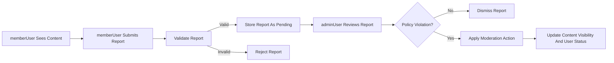

# Requirements Analysis – Reddit-like Community Platform Backend (communityPlatform)

## 1. Service Overview

THE communityPlatform backend SHALL provide a Reddit-like community experience where users can discover topic-based communities, publish and discuss content, and self-moderate via voting and reporting.

THE communityPlatform backend SHALL focus on supporting the following major capabilities:
- User registration, login, and session-based access control.
- Creation and management of communities (subreddit-like spaces).
- Creation of posts (text, link, image) within communities.
- Commenting on posts with nested replies (threaded conversations).
- Upvote/downvote mechanisms on posts and comments.
- A user karma system derived from community feedback.
- Sorting of content by hot, new, top, and controversial.
- Subscriptions to communities and personalized feeds.
- User profiles that surface public activity and karma.
- Reporting of inappropriate content and administrative moderation.

## 2. Business Context and Goals

### 2.1 Problem Context

WHEN online users want to discuss specific interests, THE existing options SHALL often be fragmented across many forums and channels, making it difficult to discover relevant, high-quality discussions.

WHEN users attempt to assess the reliability or contribution quality of others, THE lack of a unified reputation or karma indicator SHALL make it harder to identify constructive contributors.

WHEN policy-violating or abusive content appears, THE absence of clear reporting and moderation workflows SHALL undermine trust and long-term platform health.

### 2.2 Business Objectives

THE communityPlatform backend SHALL enable:
- Community-driven organization of content by topic.
- Ranking of content quality through user voting.
- Persistent user identity with karma-based reputation.
- Scalable moderation using reporting and admin actions.

EARS-form objectives:
- THE communityPlatform backend SHALL support user-driven creation and growth of topic-based communities without requiring operator involvement for each new topic.
- THE communityPlatform backend SHALL provide voting and karma mechanisms that reflect community sentiment about posts and comments.
- THE communityPlatform backend SHALL support timely detection and handling of inappropriate content through user reports and admin workflows.

## 3. User Actors and Roles

### 3.1 guestUser

A guestUser is an unauthenticated visitor.

- THE communityPlatform backend SHALL treat any request without a valid authenticated session as originating from guestUser.
- WHEN guestUser accesses public communities and posts, THE communityPlatform backend SHALL allow read-only access to visible content and public profile information.
- WHEN guestUser attempts to perform actions that modify state (such as posting, commenting, voting, subscribing, or reporting), THE communityPlatform backend SHALL deny those actions and indicate that authentication is required.

### 3.2 memberUser

A memberUser is a registered and authenticated user.

- THE communityPlatform backend SHALL treat any request with a valid member session as originating from memberUser.
- WHEN memberUser performs actions such as creating posts, comments, votes, or reports, THE communityPlatform backend SHALL associate those actions with that memberUser identity.
- WHEN memberUser attempts to access features reserved for adminUser, THE communityPlatform backend SHALL prevent the operation and indicate insufficient permissions.

### 3.3 adminUser

An adminUser is a platform-level administrator responsible for moderation and policy enforcement.

- THE communityPlatform backend SHALL treat any request with a valid admin session as originating from adminUser.
- WHEN adminUser performs moderation actions (such as removing content, locking threads, or restricting user accounts), THE communityPlatform backend SHALL record who performed the action and when.
- WHEN non-admin actors attempt to use admin-only moderation operations, THE communityPlatform backend SHALL deny those operations.

## 4. Authentication and Account Management

### 4.1 Registration

- WHEN guestUser submits registration data (such as unique identifier and secret factor), THE communityPlatform backend SHALL validate required fields, uniqueness, and basic format rules.
- IF registration data is incomplete or invalid, THEN THE communityPlatform backend SHALL reject the registration and provide information about which business rules were not met (for example, username taken, password too weak).
- WHEN registration succeeds, THE communityPlatform backend SHALL create a memberUser account and either establish a session immediately or provide a path to login.

### 4.2 Login and Session

- WHEN a user submits login credentials, THE communityPlatform backend SHALL verify them against stored account data.
- IF credentials are valid and the account is active, THEN THE communityPlatform backend SHALL create an authenticated session representing either memberUser or adminUser.
- IF credentials are invalid or the account is restricted, THEN THE communityPlatform backend SHALL deny login and keep the actor in guestUser state.
- WHILE a session remains valid, THE communityPlatform backend SHALL authorize actions based on the actor type (memberUser or adminUser) linked to that session.

### 4.3 Logout and Session Expiry

- WHEN a memberUser or adminUser requests logout, THE communityPlatform backend SHALL invalidate the current session and treat subsequent requests as guestUser.
- WHEN a session exceeds a configured inactivity or lifetime threshold, THE communityPlatform backend SHALL expire the session and require re-authentication for protected actions.

### 4.4 Account Security

- WHEN a memberUser requests a password change, THE communityPlatform backend SHALL require confirmation of the existing credentials before applying the change.
- WHEN repeated failed login attempts occur beyond a defined threshold, THE communityPlatform backend SHALL apply protective measures such as temporary login throttling or lockout.

## 5. Communities (Subreddits)

### 5.1 Creation

- WHEN a memberUser requests creation of a community with a proposed name and optional description, THE communityPlatform backend SHALL validate naming rules (length, allowed characters, uniqueness, prohibited terms).
- IF the proposed name violates any rule or already exists, THEN THE communityPlatform backend SHALL reject the creation request and indicate the conflict type.
- WHEN validation succeeds, THE communityPlatform backend SHALL create a new community and associate the creating memberUser as its owner or primary manager.

### 5.2 Visibility

- THE communityPlatform backend SHALL support public communities that are readable by guestUser and memberUser, and MAY support restricted or private communities per business policy.
- WHEN guestUser requests the list of communities, THE communityPlatform backend SHALL return only communities visible to guestUser.
- WHEN memberUser requests the list of communities, THE communityPlatform backend SHALL return communities visible to that memberUser, including those requiring membership where the user is a member.

### 5.3 Management

- WHEN a community owner or authorized memberUser updates community metadata (such as description or posting rules), THE communityPlatform backend SHALL apply changes if they comply with validation rules.
- IF a memberUser without appropriate authority attempts to modify a community, THEN THE communityPlatform backend SHALL deny the change.

## 6. Posts (Text, Link, Image)

### 6.1 Post Creation

- WHEN a memberUser creates a post in a community, THE communityPlatform backend SHALL require a valid target community, a title, and a post type (text, link, or image).
- WHERE the post type is text, THE communityPlatform backend SHALL require non-empty text content of acceptable length.
- WHERE the post type is link, THE communityPlatform backend SHALL require a valid URL conforming to defined format and safety rules.
- WHERE the post type is image, THE communityPlatform backend SHALL require a reference to an image that complies with size and format constraints.
- IF any required attribute is missing or invalid, THEN THE communityPlatform backend SHALL reject the post creation and explain the failing rule.

### 6.2 Post Editing and Deletion

- WHERE business rules allow editing, THE communityPlatform backend SHALL allow the author memberUser to edit their own post within a defined time window.
- WHEN a post is edited, THE communityPlatform backend SHALL store the new content and mark the post as edited.
- WHEN an author memberUser deletes their own post, THE communityPlatform backend SHALL hide the post from normal browsing and prevent new interactions with it.

### 6.3 Post Visibility

- WHEN a post is requested, THE communityPlatform backend SHALL return post metadata (title, type, community, author indicator, score, timestamps, edited status) if the requester is allowed to view it.
- IF a post has been removed by moderation or deleted by its author, THEN THE communityPlatform backend SHALL either present a placeholder or treat the post as unavailable according to policy.

## 7. Comments and Nested Replies

### 7.1 Comment Creation

- WHEN a memberUser views a post they can access, THE communityPlatform backend SHALL allow that memberUser to create a top-level comment, subject to length and content rules.
- WHEN a memberUser replies to an existing comment, THE communityPlatform backend SHALL create a nested reply linked to the parent comment and the post.
- IF the target post or comment is locked, deleted, or otherwise restricted, THEN THE communityPlatform backend SHALL reject new comments on it.

### 7.2 Comment Editing and Deletion

- WHERE editing is allowed, THE communityPlatform backend SHALL allow comment authors to edit their comments within a business-defined window.
- WHEN a comment is edited, THE communityPlatform backend SHALL save the updated text and optionally indicate that the comment was edited.
- WHEN a comment is deleted by its author, THE communityPlatform backend SHALL replace the content with a deletion marker while preserving thread structure.

### 7.3 Thread Display

- WHEN a post and its comments are requested, THE communityPlatform backend SHALL return comments in a structure that preserves parent-child relationships for nested replies.
- WHERE comments exceed configured depth or volume, THE communityPlatform backend SHALL provide mechanisms to limit or paginate comment retrieval.

## 8. Voting and Karma System

### 8.1 Voting on Posts and Comments

- WHEN a memberUser views a post or comment, THE communityPlatform backend SHALL allow the memberUser to set their vote to upvote, downvote, or no vote.
- WHEN a memberUser casts a vote, THE communityPlatform backend SHALL ensure at most one active vote per user per item and update the item’s score accordingly.
- WHEN a memberUser changes or removes their vote, THE communityPlatform backend SHALL adjust the score and associated karma based on the net change.
- IF a memberUser attempts to vote on content they are not allowed to vote on (such as their own content if disallowed or content in restricted communities), THEN THE communityPlatform backend SHALL reject the vote.

### 8.2 Karma Calculation

- THE communityPlatform backend SHALL maintain a karma value for each memberUser that aggregates the community reception of their posts and comments.
- WHEN a vote that affects karma is added, changed, or removed, THE communityPlatform backend SHALL update the associated user’s karma according to configured rules.
- WHEN a user profile is displayed, THE communityPlatform backend SHALL show the user’s karma total and MAY show separate post and comment karma breakdowns.

## 9. Sorting and Feeds

### 9.1 Sorting Modes

- WHEN a user requests a list of posts (community feed, personalized feed, or global feed), THE communityPlatform backend SHALL allow selection of sort mode among at least hot, new, top, and controversial.
- WHERE mode is new, THE communityPlatform backend SHALL order posts primarily by creation time descending.
- WHERE mode is top, THE communityPlatform backend SHALL order posts primarily by score descending within an optional time range.
- WHERE mode is hot, THE communityPlatform backend SHALL use a business-defined combination of score and recency to prioritize currently popular posts.
- WHERE mode is controversial, THE communityPlatform backend SHALL highlight posts with substantial mixed positive and negative votes.

### 9.2 Community Feeds

- WHEN a community feed is requested, THE communityPlatform backend SHALL return posts belonging only to that community, filtered by visibility and sorted according to the chosen mode.

### 9.3 Personalized Feeds

- WHEN a memberUser requests their home feed, THE communityPlatform backend SHALL aggregate posts from communities to which that memberUser is subscribed and sort them by the requested mode.
- WHERE a memberUser has no subscriptions, THE communityPlatform backend SHALL apply a default behavior such as showing top or hot posts across the platform.

## 10. Subscriptions

- WHEN a memberUser subscribes to a community, THE communityPlatform backend SHALL record the subscription and include that community’s content in the user’s personalized feed.
- WHEN a memberUser unsubscribes from a community, THE communityPlatform backend SHALL remove the subscription and exclude new content from that community in future feeds, while still allowing direct access to the community.
- IF a memberUser attempts to subscribe or unsubscribe to a community that does not exist or is unavailable, THEN THE communityPlatform backend SHALL reject the action.

## 11. User Profiles

### 11.1 Profile Content

- WHEN a user profile is requested, THE communityPlatform backend SHALL provide public profile information including username, account age indicator, and karma summary.
- WHEN a memberUser views their own profile, THE communityPlatform backend SHALL also provide additional private information such as email and preferences, where allowed by privacy rules.

### 11.2 Activity Listing

- WHEN a profile is viewed, THE communityPlatform backend SHALL list recent posts and comments authored by that user, limited to content that remains visible to the requester.
- IF content has been deleted or removed by moderation, THEN THE communityPlatform backend SHALL either omit such items or display them with a removal indicator according to policy.

## 12. Reporting and Moderation

### 12.1 Reporting Inappropriate Content

- WHEN a memberUser believes a post or comment is inappropriate, THE communityPlatform backend SHALL allow that memberUser to submit a report that identifies the target and reason.
- WHEN a report is submitted, THE communityPlatform backend SHALL validate that the target content exists and is reportable, then store the report for admin review.
- IF the same memberUser repeatedly reports identical content beyond defined limits, THEN THE communityPlatform backend SHALL enforce rate limits on reports.

### 12.2 Admin Review and Actions

- WHEN an adminUser reviews reports, THE communityPlatform backend SHALL provide the reported content, its context, and prior actions to support a moderation decision.
- WHEN an adminUser decides to dismiss a report, THE communityPlatform backend SHALL mark the report as resolved without changes to content visibility.
- WHEN an adminUser decides content violates policy, THE communityPlatform backend SHALL support actions including hiding, removing, or locking the content and, where necessary, restricting the author’s account.

### 12.3 Reporting and Moderation Flow (Mermaid)

## 13. Error Handling and Edge Cases (Business View)

- IF guestUser attempts any member-only or admin-only action, THEN THE communityPlatform backend SHALL deny the request and indicate that authentication is required.
- IF memberUser attempts to perform an action on content that no longer exists or is not visible to them, THEN THE communityPlatform backend SHALL indicate that the resource is unavailable.
- IF a memberUser attempts to edit or delete content they do not own (and they are not adminUser), THEN THE communityPlatform backend SHALL deny the request for lack of permission.
- WHEN rate limits for posting, commenting, voting, or reporting are exceeded, THE communityPlatform backend SHALL reject additional actions and provide a generic explanation that limits have been reached.

## 14. Non-functional Expectations (High-level)

- WHEN users perform typical read operations (view communities, posts, comments, profiles), THE communityPlatform backend SHALL respond within a few seconds under normal load from the user’s perspective.
- WHEN users perform typical write operations (register, login, post, comment, vote, report, subscribe), THE communityPlatform backend SHALL confirm success or failure within a few seconds under normal load.
- WHEN partial failures occur, THE communityPlatform backend SHALL prioritize data consistency over partial success and SHALL avoid leaving content in ambiguous states.

## 15. Assumptions and Out-of-Scope Items

- THE communityPlatform backend SHALL assume that detailed front-end behavior (layout, styling, interactive hints) is defined separately and is not part of these requirements.
- THE communityPlatform backend SHALL not define specific API endpoints, payload formats, or database schemas in this requirements analysis; those details SHALL be decided during technical design.
- THE communityPlatform backend SHALL rely on separate internal policies for content classification and legal compliance details, although it MUST provide mechanisms (reporting, moderation, visibility control) to enforce those policies at runtime.