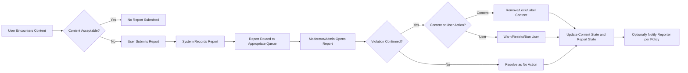

# Requirements Analysis – communityPlatform (Reddit-like Community Platform)

## 1. Service Context and Goals

communityPlatform is a Reddit-like community service where users organize around topic-based communities, share posts (text, links, images), discuss via nested comments, vote on content, gain karma, subscribe to communities, and report inappropriate content. The backend must support all of these behaviors in a way that is predictable, safe, and scalable.

Primary business goals:
- Enable topic-centric communities with clear ownership and moderation.
- Allow rich discussion through posts and nested comments.
- Use voting and karma to surface valuable content and reflect user reputation.
- Provide flexible sorting (hot, new, top, controversial) so users can discover content from different perspectives.
- Let users subscribe to communities and receive a personalized feed.
- Offer transparent user profiles summarizing contributions and karma.
- Maintain safety and trust via reporting, moderation, and clear enforcement.

All detailed requirements in this document are expressed in EARS style where applicable.

## 2. User Actors and High-Level Capabilities

### 2.1 Actors

- **guestUser** – unauthenticated visitor.
- **memberUser** – registered, authenticated user.
- **communityModerator** – memberUser with elevated rights in specific communities.
- **platformAdmin** – platform-wide administrator.

### 2.2 High-Level Capabilities per Actor (Business View)

- THE system SHALL allow guestUser to browse public communities, posts, and comments without authentication.
- THE system SHALL prevent guestUser from creating communities, posts, comments, votes, or subscriptions.
- THE system SHALL allow memberUser to create communities (subject to policy), posts, comments, votes, subscriptions, and reports.
- THE system SHALL allow communityModerator to perform all memberUser actions plus community-level moderation (remove/lock content, manage rules, apply community bans).
- THE system SHALL allow platformAdmin to perform all memberUser actions plus platform-wide moderation and configuration (global bans, community suspension, policy enforcement).

## 3. Authentication and Account Lifecycle

### 3.1 Registration

- WHEN a guestUser submits registration data with required fields (such as unique identifier and credential) that satisfy validation rules, THE system SHALL create a new memberUser account in a state defined by verification policy (for example, pending verification).
- IF a guestUser submits registration data with an identifier already in use, THEN THE system SHALL reject registration and SHALL instruct the user to choose a different identifier.
- IF a guestUser submits registration data that violates validation rules (for example, invalid identifier format, weak credential, missing required field), THEN THE system SHALL reject registration and SHALL state which conditions were not met in business terms.
- WHERE the platform requires contact verification (such as email confirmation), THE system SHALL mark new accounts as limited until verification completes and SHALL restrict sensitive actions (for example, posting or commenting) according to policy.

### 3.2 Login and Logout

- WHEN a user submits login credentials that match an active, non-banned memberUser, THE system SHALL establish an authenticated session associated with that memberUser.
- IF a user submits login credentials that do not match any eligible account, THEN THE system SHALL deny authentication and SHALL respond with a generic failure message without revealing which part of the credentials is invalid.
- WHEN an authenticated memberUser initiates logout, THE system SHALL terminate the associated session and SHALL treat subsequent actions from that client as guestUser actions.
- WHERE the user triggers a “log out from all devices” action, THE system SHALL invalidate all existing active sessions for that memberUser.

### 3.3 Session Lifetime and Account Status

- THE system SHALL enforce a maximum session lifetime after which re-authentication is required for memberUser actions.
- WHERE a session exceeds its allowed lifetime or is explicitly revoked, THE system SHALL treat further requests under that session as unauthenticated.
- THE system SHALL maintain an account status for each memberUser (for example, active, verification-pending, suspended, banned) and SHALL enforce capabilities based on that status.
- IF a memberUser account is suspended, THEN THE system SHALL block posting, commenting, voting, reporting, community creation, and subscription changes while optionally allowing read-only access to public content.
- IF a memberUser account is banned, THEN THE system SHALL block all authenticated access for that account, including login, until status changes.

## 4. Communities (Subreddit-like Spaces)

### 4.1 Community Creation

- WHEN a memberUser who meets community-creation criteria (for example, minimum karma, not banned from community creation) submits a community creation request with a valid, unique identifier, THE system SHALL create a new community and SHALL assign that memberUser as an initial communityModerator for that community.
- IF the requested community identifier is already in use, THEN THE system SHALL reject the creation and SHALL require the user to choose a different identifier.
- IF the requested community name, identifier, description, or rules text violates platform naming or content policies, THEN THE system SHALL reject the creation request and SHALL provide a business-level explanation.
- WHERE maximum community-per-user limits apply, THE system SHALL reject community creation if the creator already owns or moderates communities at or above that limit.

### 4.2 Community Configuration and States

- WHERE a user is a communityModerator for a community, THE system SHALL allow that user to update community metadata (such as description, rules text, and allowed content categories) within platform constraints.
- IF a communityModerator attempts to set community metadata that conflicts with platform policy (for example, writing disallowed content in rules), THEN THE system SHALL reject the configuration change and SHALL state that it conflicts with platform rules.
- WHERE a community is marked as archived, THE system SHALL prevent new posts and SHALL optionally allow reading of existing content according to visibility policy.
- WHERE a community is marked as private or restricted, THE system SHALL allow access only to actors who meet membership criteria (for example, approved members or moderators) and SHALL deny access to others.

### 4.3 Community Access by Actor

- THE system SHALL allow guestUser to access only public communities and content allowed for guests.
- WHERE a community is restricted, THE system SHALL allow only eligible memberUser, communityModerator, and platformAdmin to read and interact with its content.
- WHERE a community is private, THE system SHALL restrict access to explicitly approved memberUser plus communityModerator and platformAdmin.
- IF an actor attempts to access a community they are not allowed to view, THEN THE system SHALL deny access and SHALL avoid revealing sensitive details about that community’s content or membership.

### 4.4 Community-Level Bans

- WHEN a communityModerator applies a community-level ban to a memberUser, THE system SHALL prevent that memberUser from posting, commenting, or voting in that community while the ban is active.
- WHEN a community-level ban is active, THE system SHALL prevent the banned user from subscribing to that community or from being treated as an active subscriber if previously subscribed.
- WHEN a communityModerator lifts a community-level ban, THE system SHALL restore that memberUser’s ability to interact in that community according to normal rules.

## 5. Posts (Text, Link, Image)

### 5.1 Post Types and Validation

- THE system SHALL support text posts, link posts, and image-based posts as distinct post types.
- WHEN a memberUser creates a text post, THE system SHALL require a title and body that satisfy minimum and maximum length constraints.
- WHEN a memberUser creates a link post, THE system SHALL require a title and a URL that satisfies format validation and allowed scheme rules.
- WHEN a memberUser creates an image-based post, THE system SHALL require a title and at least one reference to an image asset, and MAY accept an optional text body according to policy.
- IF any post field fails validation (for example, title too long, URL invalid, image reference missing), THEN THE system SHALL reject the post creation and SHALL specify which fields violate constraints.

### 5.2 Post Ownership and Permissions

- THE system SHALL associate each post with exactly one community and exactly one author (a memberUser).
- WHERE a memberUser is the author of a post, THE system SHALL allow that user to edit the post’s title and body within policy-defined constraints (for example, within an edit time window or while leaving an edit marker).
- IF a memberUser attempts to edit a post they do not own and they are not a communityModerator or platformAdmin, THEN THE system SHALL reject the edit and SHALL indicate that they lack permission.
- WHERE policy allows, THE system SHALL allow authors to delete their posts, and upon deletion, SHALL remove posts from normal feeds while retaining minimal information for audit and thread structure.

### 5.3 Post States: Visible, Locked, Removed

- WHERE a post is in a normal visible state, THE system SHALL allow viewing and interaction according to community and user rules.
- WHEN a communityModerator or platformAdmin locks a post, THE system SHALL prevent new comments and, where policy requires, prevent new votes while keeping existing content visible according to visibility rules.
- WHEN a communityModerator or platformAdmin removes a post for policy reasons, THE system SHALL hide the post from normal user views and SHALL indicate that the post was removed by moderation, while preserving necessary audit data.
- WHEN a post is removed by its author, THE system SHALL remove it from standard listings and SHALL indicate its removal where needed for thread continuity.

## 6. Comments and Nested Replies

### 6.1 Comment Creation and Structure

- WHEN a memberUser submits a comment on a post, THE system SHALL create a top-level comment associated with that post and author, provided the post is open for comments and the user has permission.
- WHEN a memberUser submits a reply to another comment, THE system SHALL create a nested comment associated with that parent comment and SHALL maintain the parent–child relationship for hierarchical display.
- THE system SHALL support nesting of comments up to a configurable maximum depth and SHALL reject additional nesting beyond that depth.
- IF a user attempts to comment on a locked or removed post, THEN THE system SHALL reject the comment and SHALL state that commenting is disabled for that post.

### 6.2 Comment Editing and Deletion

- WHERE a memberUser is the author of a comment, THE system SHALL allow them to edit the comment within defined constraints (for example, within an edit window or while flagging the comment as edited).
- IF an author attempts to edit a comment outside the allowed conditions (for example, after the edit window expires or when the comment is locked), THEN THE system SHALL reject the edit and SHALL explain the restriction.
- WHERE a memberUser is the author of a comment, THE system SHALL allow them to delete that comment; upon deletion, THE system SHALL replace the comment text with an appropriate placeholder and SHALL keep its position in the thread to preserve structure.
- WHEN a communityModerator or platformAdmin removes a comment, THE system SHALL hide the comment text from ordinary users while maintaining a placeholder with moderation context.

### 6.3 Comment Locking

- WHEN a communityModerator or platformAdmin locks a comment thread (for example, a parent comment and its replies), THE system SHALL prevent additional replies under that comment while preserving all existing replies.
- WHILE a comment thread is locked, THE system SHALL indicate to users viewing that thread that further replies are not accepted.

## 7. Voting and Karma

### 7.1 Voting on Posts and Comments

- WHERE an actor is guestUser, THE system SHALL prevent that actor from voting on any post or comment.
- WHERE an actor is memberUser, communityModerator, or platformAdmin, THE system SHALL allow that actor to cast at most one active vote per post or comment (upvote, downvote, or none) where voting is enabled and the actor is allowed in that community.
- WHEN an eligible actor casts an upvote on a post or comment, THE system SHALL record that actor’s vote as positive and SHALL update the item’s upvote count and derived score accordingly.
- WHEN an eligible actor casts a downvote, THE system SHALL record the vote as negative and SHALL update the item’s downvote count and derived score accordingly.
- WHEN an actor changes a vote (for example, from upvote to downvote or from downvote to upvote), THE system SHALL adjust counts and scores to reflect the new state.
- WHEN an actor removes a vote (for example, returns to neutral), THE system SHALL adjust counts and scores to remove that vote’s contribution.
- IF a memberUser attempts to vote on their own content where self-voting is disallowed, THEN THE system SHALL reject the vote and SHALL explain that self-voting is not permitted.

### 7.2 Scores and Karma

- THE system SHALL maintain a score for each post and comment derived from its votes (for example, upvotes minus downvotes) and SHALL use that score in sorting and visibility.
- THE system SHALL maintain a karma total for each memberUser reflecting voting outcomes on their posts and comments.
- WHEN a vote affecting a user’s content is created, changed, or removed, THE system SHALL adjust that user’s karma according to a consistent set of karma rules.
- WHERE karma thresholds are defined for certain capabilities (for example, community creation, posting in restricted communities), THE system SHALL evaluate a user’s karma before granting or denying those actions.

### 7.3 Anti-Abuse Voting Controls

- WHERE a memberUser’s account age or karma is below configured thresholds, THE system SHALL apply stricter rate limits on their voting volume per time window.
- IF a memberUser’s voting pattern triggers abuse rules (for example, very high volume votes on many items in a short period), THEN THE system SHALL temporarily restrict further voting and MAY flag the behavior for moderation review.

## 8. Subscriptions and Feeds

### 8.1 Community Subscription

- WHEN a memberUser requests to subscribe to a community they can access, THE system SHALL create or confirm a subscription link between that memberUser and the community.
- WHEN a memberUser requests to unsubscribe from a community, THE system SHALL remove or deactivate the subscription link so that new posts from that community are no longer included in that user’s personalized feed.
- IF a memberUser attempts to subscribe to a community that does not exist, THEN THE system SHALL reject the subscription and SHALL indicate that the community is unavailable.
- IF a memberUser is banned from a community, THEN THE system SHALL treat any subscription as inactive for feed purposes and SHALL prevent new subscriptions for that community by that user while the ban is active.

### 8.2 Personalized Home Feed

- WHEN a memberUser requests their home feed, THE system SHALL construct a list of posts drawn primarily from communities where that user has an active subscription, subject to visibility, moderation, and safety rules.
- WHEN constructing a home feed, THE system SHALL exclude content from communities that the user has blocked (where community blocking is provided) and SHALL exclude content from users that the viewer has blocked (subject to policy on minimal placeholders).
- WHERE a memberUser has no active subscriptions, THE system SHALL return a feed based on a business-defined default experience (for example, popular or recommended communities) or SHALL indicate that no personalized content is available.

### 8.3 Community Feeds

- WHEN any actor accesses a specific community feed, THE system SHALL list posts from that community that are visible to that actor and SHALL allow the actor to choose a supported sorting mode.
- WHERE a community is public, THE system SHALL allow guestUser to view its feed with allowed sorting modes.
- WHERE a community is restricted or private, THE system SHALL enforce membership and SHALL deny feed access to ineligible actors.

## 9. User Profiles

### 9.1 Profile Content

- THE system SHALL maintain a profile for each memberUser including at least: identifier (such as username), join date, and karma summary.
- WHERE a memberUser provides optional profile attributes (for example, display name, biography, avatar), THE system SHALL validate these fields against length and content rules before accepting them.
- IF a profile update contains values that violate validation rules, THEN THE system SHALL reject the update and SHALL identify which fields are problematic.

### 9.2 Profile Viewing

- WHEN a memberUser views their own profile, THE system SHALL display their profile details, karma, and a list or summary of their posts and comments, subject to moderation and visibility rules.
- WHEN any actor views another memberUser’s profile, THE system SHALL display public profile information and visible posts and comments according to privacy, community visibility, and moderation.
- IF a profile belongs to a banned or deleted account, THEN THE system SHALL limit visible information and SHALL indicate that the account is banned or removed in business terms.

## 10. Reporting and Safety

### 10.1 Reportable Entities and Reasons

- THE system SHALL allow reporting of posts, comments, communities, and users as separate reportable entities.
- WHEN a memberUser initiates a report, THE system SHALL require selection of at least one report reason from a platform-defined list (for example, spam, harassment, hate, explicit content, illegal content, misinformation, community rule violation, other).
- WHERE “other” is selected as a report reason, THE system SHALL require the reporter to enter a free-text explanation within length limits.
- IF a report is submitted without a valid reason or with a missing required description for “other”, THEN THE system SHALL reject the report and SHALL state that a valid reason is required.

### 10.2 Report Submission and Visibility

- WHEN a report is successfully submitted, THE system SHALL record the reported entity, reporter identity (where applicable), reasons, description, and creation timestamp.
- THE system SHALL ensure that reporter identity is never exposed to general users or to the reported user in public views.
- WHERE a report targets content in a specific community, THE system SHALL make that report visible to communityModerators for that community and platformAdmin according to policy.
- WHERE a report targets platform-level issues (for example, illegal content), THE system SHALL make that report visible to platformAdmin regardless of community.

### 10.3 Moderation Workflow

- WHEN a communityModerator or platformAdmin views a report, THE system SHALL display the reported entity, aggregated report reasons, reporter metadata (for authorized reviewers), and previous related reports where available.
- WHEN a reviewer begins actively handling a report, THE system SHALL mark the report as under review.
- WHEN a reviewer resolves a report without action, THE system SHALL mark the report as resolved with “no action” and SHALL store an internal justification.
- WHEN a reviewer resolves a report with content action (for example, removal, locking, labeling as sensitive), THE system SHALL update both content state and report state consistently.
- WHEN a reviewer resolves a report with user action (for example, warning, temporary restriction, ban), THE system SHALL update user status and SHALL record the action along with the report.

### 10.4 Escalation

- WHERE a communityModerator encounters a report with issues beyond their authority (for example, suspected illegal content), THE system SHALL allow them to escalate the report to platformAdmin and SHALL mark its state as escalated.
- WHERE a community has no active moderators, THE system SHALL route reports for that community directly to platformAdmin for handling.

### 10.5 Safety Priority

- WHERE reported content falls into urgent categories (for example, credible threats, self-harm encouragement, explicit illegal content), THE system SHALL prioritize rapid restriction or removal of that content before full investigation.
- THE system SHALL favor safety and legal compliance over content retention in severe cases.

### 10.6 Reporting and Moderation Flow (Mermaid Diagram)

## 11. Sorting and Discovery (Hot, New, Top, Controversial)

### 11.1 Sorting Modes

- THE system SHALL support at least four named sorting modes for posts: “new”, “top”, “hot”, and “controversial”.

### 11.2 New

- WHEN a user selects “new” sorting for a feed, THE system SHALL order posts primarily by creation time in descending order (newest first), subject to visibility filters.
- WHERE multiple posts share the same creation time at the used precision, THE system SHALL apply a deterministic secondary ordering (for example, by internal identifier) to keep ordering stable.

### 11.3 Top

- WHEN a user selects “top” sorting for a feed, THE system SHALL order posts primarily by score (for example, upvotes minus downvotes) in descending order.
- WHERE a time range is selected for “top” (for example, day, week, month), THE system SHALL restrict considered posts to that time range.
- WHERE scores are equal within the time range, THE system SHALL use a secondary ordering such as creation time to ensure stable presentation.

### 11.4 Hot

- WHEN a user selects “hot” sorting, THE system SHALL order posts using a combination of recency and score so that newer, high-scoring posts tend to appear above older posts with similar score.
- WHERE posts have very low or negative scores, THE system SHALL treat them as lower priority in “hot” feeds regardless of recency.

### 11.5 Controversial

- WHEN a user selects “controversial” sorting, THE system SHALL prioritize posts with high total vote counts and a relatively balanced mix of upvotes and downvotes.
- WHERE a time range filter is applied to “controversial”, THE system SHALL restrict the set of posts to that time range.

## 12. Error Handling and Edge Cases (Business Perspective)

### 12.1 Input Validation Errors

- WHEN a user submits invalid data for any operation (registration, community creation, posting, commenting, voting, subscribing, reporting), THE system SHALL reject the operation and SHALL describe in business terms which fields or conditions are invalid.
- THE system SHALL avoid partial creation of entities when validation fails.

### 12.2 Authorization Errors

- WHEN an actor attempts an action without required role or permissions, THE system SHALL deny the action and SHALL indicate that they are not allowed to perform it.
- THE system SHALL ensure that authorization checks are applied consistently across all access paths (for example, direct links, feeds, and search views).

### 12.3 Interactions with Removed or Locked Content

- WHEN a user attempts to interact with content that became removed between viewing and action submission, THE system SHALL reject the interaction and SHALL indicate that the content is no longer available.
- WHEN a user attempts to comment or vote on content that became locked between viewing and action submission, THE system SHALL reject the interaction and SHALL indicate that the content is locked.

### 12.4 Concurrent Actions

- WHERE two actors attempt conflicting actions on the same entity at nearly the same time (for example, two moderators resolving the same report with different outcomes), THE system SHALL apply a deterministic rule to select a final state and SHALL record which action was ultimately applied.

## 13. Non-Functional Expectations (Business Level)

### 13.1 Performance

- WHEN a user performs common read actions (viewing communities, feeds, posts, and comments), THE system SHALL respond within a few seconds under normal load so the experience feels responsive.
- WHEN a user performs common write actions (registration, login, posting, commenting, voting, subscribing, reporting), THE system SHALL confirm success or failure within a few seconds under normal load.

### 13.2 Availability and Reliability

- THE system SHALL be available for core actions (browsing, posting, commenting, voting, reporting) for the vast majority of time, with only brief, planned maintenance windows where necessary.
- IF unplanned outages occur, THEN THE system SHALL restore normal operation as soon as reasonably possible while preserving user data integrity.

### 13.3 Privacy and Data Protection

- THE system SHALL protect sensitive user information (such as credentials, emails, internal abuse notes) from unauthorized access.
- WHEN a user requests account deletion, THE system SHALL remove or anonymize personal identifiers while retaining content and logs in forms that satisfy legal and policy obligations.
- THE system SHALL ensure that internal identifiers and security-related details are not exposed in user-facing error messages or responses.

### 13.4 Auditability

- THE system SHALL record key actions (registrations, login attempts, community creation, moderation decisions, bans, report handling) in audit logs accessible to authorized platformAdmin for investigation and compliance.
- WHEN a dispute arises regarding content or enforcement, THE system SHALL allow authorized reviewers to reconstruct the sequence of relevant actions using audit data.

## 14. Summary of Key Responsibilities per Feature

- Authentication and sessions: confirm who users are, manage login/logout, enforce account status.
- Communities: provide topic-based spaces with configurable rules and community-level moderation.
- Posts and comments: support multi-type posts, nested discussions, and state transitions (visible, locked, removed).
- Voting and karma: capture community feedback, compute scores, and reflect user reputation.
- Subscriptions and feeds: allow users to follow communities and receive personalized feeds with sorting.
- Profiles: summarize user activity and reputation with appropriate privacy and visibility.
- Reporting and safety: capture abuse reports, support moderation and escalation, and prioritize user safety.
- Sorting and discovery: provide multiple ordering modes (hot, new, top, controversial) for content discovery.
- Error handling, non-functional expectations, and auditability: ensure predictable, safe, and observable behavior under normal and exceptional conditions for the communityPlatform backend.