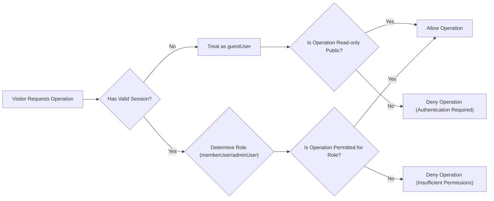

# User Actors, Authentication, and Permissions Requirements

## 1. Introduction

This document defines the user actors, authentication behaviors, and authorization rules for the **communityPlatform** Reddit-like community service. It describes **what** the system must do from an identity and permissions perspective, without prescribing **how** it must be implemented technically.

The focus is on:
- Who can access the platform and in which capacity.
- How users authenticate and maintain sessions.
- Which operations each actor is allowed or forbidden to perform.
- Business-level security and compliance expectations related to identity.

All requirements are written so that backend developers can immediately implement the necessary identity and access control logic while retaining full autonomy over specific technologies, protocols, and data models.

---

## 2. User Actor Definitions

This section defines each actor that interacts with the communityPlatform.

### 2.1 guestUser

A **guestUser** is an unauthenticated visitor.

Characteristics and capabilities:
- Can browse public communities and public content.
- Can view public posts and comments.
- Can view a limited version of user profiles.
- Cannot create, edit, or delete any content.
- Cannot vote on posts or comments.
- Cannot subscribe to communities.
- Cannot report content.

Key requirements (EARS format):
- THE communityPlatform SHALL treat any visitor without a valid authenticated session as a guestUser.
- WHEN a guestUser accesses a public community, THE communityPlatform SHALL allow read-only access to visible posts, comments, and basic community information.
- WHEN a guestUser attempts to create a post, THE communityPlatform SHALL prevent the operation and indicate that authentication is required.
- WHEN a guestUser attempts to create a comment or reply, THE communityPlatform SHALL prevent the operation and indicate that authentication is required.
- WHEN a guestUser attempts to vote on any post or comment, THE communityPlatform SHALL prevent the operation and indicate that authentication is required.
- WHEN a guestUser attempts to subscribe to a community, THE communityPlatform SHALL prevent the operation and indicate that authentication is required.
- WHEN a guestUser attempts to report content, THE communityPlatform SHALL prevent the operation and indicate that authentication is required.

### 2.2 memberUser

A **memberUser** is a registered, authenticated community member.

Characteristics and capabilities:
- Can create and manage their own posts and comments.
- Can vote on posts and comments.
- Can subscribe and unsubscribe to communities.
- Can report inappropriate content.
- Can manage their own profile and account settings.
- Cannot perform global administrative actions unless explicitly granted adminUser status.

Key requirements (EARS format):
- THE communityPlatform SHALL treat any user with a valid authenticated member session as a memberUser.
- WHEN a memberUser creates content, THE communityPlatform SHALL associate that content with the memberUser’s identity.
- WHEN a memberUser attempts to perform any action restricted to authenticated users, THE communityPlatform SHALL allow the action only if the user holds a valid memberUser or adminUser session.
- WHEN a memberUser attempts to perform an action reserved for adminUser, THE communityPlatform SHALL prevent the operation and indicate insufficient permissions.

### 2.3 adminUser

An **adminUser** is a platform-level administrator responsible for global moderation and operational oversight.

Characteristics and capabilities:
- Can perform all actions available to memberUser.
- Can perform elevated actions such as:
  - Viewing and handling content and user reports.
  - Applying moderation actions (e.g., hiding content, locking conversations, suspending accounts from a business-rule perspective).
  - Managing community-level and platform-level policies.
- Must be limited in number and carefully controlled.

Key requirements (EARS format):
- THE communityPlatform SHALL treat any user with a valid authenticated admin session as an adminUser.
- WHEN an adminUser performs an administrative action, THE communityPlatform SHALL record that the action was performed by an adminUser and capture sufficient context for auditing.
- WHEN a user without adminUser status attempts an admin-only action, THE communityPlatform SHALL prevent the action and indicate insufficient permissions.

---

## 3. Authentication and Session Management Requirements

This section defines business-level expectations for user registration, login, logout, session behavior, and account security. All implementation details such as specific protocols and storage mechanisms are intentionally omitted.

### 3.1 Registration Requirements

- WHEN a visitor submits registration data, THE communityPlatform SHALL create a new memberUser account only if all mandatory fields are valid according to defined business rules.
- WHEN registration succeeds, THE communityPlatform SHALL establish an authenticated session for the new memberUser or provide a clear path for immediate login.
- IF the registration data conflicts with existing accounts (such as duplicate unique identifiers), THEN THE communityPlatform SHALL reject registration and explain that the account already exists.
- WHEN a visitor attempts to register with clearly invalid data (such as values outside allowed length ranges or formats), THE communityPlatform SHALL reject the registration request and indicate which high-level validation rules were not met.
- WHERE email verification is required before full participation, THE communityPlatform SHALL restrict unverified memberUser accounts from performing actions that require a verified identity according to defined business rules.

### 3.2 Login Requirements

- WHEN a user submits login credentials, THE communityPlatform SHALL verify the credentials against stored account data.
- IF the submitted credentials do not match any active account, THEN THE communityPlatform SHALL deny login and indicate that the credentials are invalid without revealing which specific value is incorrect.
- IF an account is flagged as disabled, banned, or otherwise restricted, THEN THE communityPlatform SHALL deny login and indicate that the account is not allowed to access the service.
- WHEN login succeeds, THE communityPlatform SHALL create an authenticated session representing either memberUser or adminUser depending on the account’s role.
- WHERE multi-session support is allowed, THE communityPlatform SHALL allow a memberUser or adminUser to hold multiple active sessions from different devices or locations.

### 3.3 Logout and Session Termination

- WHEN an authenticated user requests logout, THE communityPlatform SHALL terminate the current session such that protected actions are no longer authorized.
- WHERE a user requests to log out from all devices, THE communityPlatform SHALL invalidate all active sessions for that account as soon as practical.
- IF a session has exceeded the configured inactivity period, THEN THE communityPlatform SHALL treat the session as expired and require re-authentication for protected actions.
- WHILE a session remains valid, THE communityPlatform SHALL consistently recognize the user’s actor type (guestUser, memberUser, adminUser) for authorization decisions.

### 3.4 Session Lifetime and Renewal (Business Expectations)

- THE communityPlatform SHALL enforce a finite session duration for authenticated users to reduce the risk of unauthorized access.
- WHERE long-lived access is allowed through renewal mechanisms, THE communityPlatform SHALL require periodic re-authentication according to business risk tolerance.
- IF a session is detected as compromised based on business-defined signals, THEN THE communityPlatform SHALL invalidate that session and may invalidate related sessions to protect the account.

### 3.5 Password and Credential Management (Business Rules)

- THE communityPlatform SHALL require credentials that meet defined complexity and length requirements appropriate for a public community service.
- WHEN a user initiates a password reset flow, THE communityPlatform SHALL verify account ownership using a secure, time-limited mechanism before allowing a new password to be set.
- IF a password reset attempt is associated with an unknown or inactive account, THEN THE communityPlatform SHALL avoid revealing whether the account exists while still indicating that a reset cannot be completed.
- WHEN a memberUser successfully changes their password, THE communityPlatform SHALL terminate or refresh existing sessions according to business risk rules to prevent continued use of old credentials.

### 3.6 Account Lockout and Abuse Protection

- WHEN multiple consecutive failed login attempts are detected for the same account or identifier beyond a business-defined threshold, THE communityPlatform SHALL temporarily limit further login attempts for that account or originating source.
- IF suspicious login activity patterns are detected, THEN THE communityPlatform SHALL apply additional protections such as temporary lockout or additional verification according to business policy.

---

## 4. Authorization and Permission Matrix

This section describes which operations are permitted to each actor. The matrix is conceptual and does not specify any technical mechanism for enforcement.

### 4.1 High-level Permission Matrix

| Feature / Action                                   | guestUser | memberUser | adminUser |
|----------------------------------------------------|-----------|-----------|-----------|
| Browse public communities                          | ✅        | ✅        | ✅        |
| View public posts and comments                     | ✅        | ✅        | ✅        |
| View limited user profiles                         | ✅        | ✅        | ✅        |
| Register an account                                | ✅        | ❌        | ❌        |
| Log in                                             | ✅        | ✅        | ✅        |
| Log out                                            | ❌        | ✅        | ✅        |
| Create a community (if allowed by business rules)  | ❌        | ✅        | ✅        |
| Edit or delete own community (where applicable)    | ❌        | ✅        | ✅        |
| Create text/link/image post                        | ❌        | ✅        | ✅        |
| Edit or delete own posts                           | ❌        | ✅        | ✅        |
| Comment on posts                                   | ❌        | ✅        | ✅        |
| Edit or delete own comments                        | ❌        | ✅        | ✅        |
| Upvote/downvote posts                              | ❌        | ✅        | ✅        |
| Upvote/downvote comments                           | ❌        | ✅        | ✅        |
| Subscribe/unsubscribe to communities               | ❌        | ✅        | ✅        |
| View own full profile and history                  | ❌        | ✅        | ✅        |
| Edit own profile and settings                      | ❌        | ✅        | ✅        |
| Report inappropriate content                       | ❌        | ✅        | ✅        |
| View and manage all reports                        | ❌        | ❌        | ✅        |
| Apply moderation actions on content                | ❌        | ❌        | ✅        |
| Suspend or restrict member accounts                | ❌        | ❌        | ✅        |
| Configure platform-wide policies                   | ❌        | ❌        | ✅        |

### 4.2 Matrix Requirements (EARS)

- THE communityPlatform SHALL enforce that guestUser has only read-only access to public information and cannot perform any state-changing operations.
- THE communityPlatform SHALL allow memberUser to perform all standard community participation actions, including creating content, voting, subscribing, and reporting inappropriate content.
- THE communityPlatform SHALL restrict admin-only actions such as global moderation, account restriction, and platform policy changes exclusively to adminUser.
- WHEN an actor attempts an action not permitted by their role, THE communityPlatform SHALL deny the action and provide a clear indication of insufficient permissions.

---

## 5. Actor-based Feature Access Rules

This section defines specific rules per feature area, using EARS format wherever possible.

### 5.1 Community Access and Management

- WHEN a guestUser accesses a public community, THE communityPlatform SHALL allow viewing of the community’s public metadata and list of visible posts.
- WHERE communities are public, THE communityPlatform SHALL allow memberUser and adminUser to subscribe and unsubscribe.
- WHERE the business model permits community creation by regular users, THE communityPlatform SHALL allow memberUser to create new communities subject to business validation rules.
- WHERE community creation is restricted, THE communityPlatform SHALL allow only adminUser to create or designate new communities.
- WHEN a memberUser manages a community they own or moderate according to business rules, THE communityPlatform SHALL permit community-level actions limited to that community and not to the entire platform.
- WHEN an adminUser performs community-level management, THE communityPlatform SHALL allow actions across any community consistent with admin privileges.

### 5.2 Post Creation, Editing, and Deletion

- WHEN a memberUser or adminUser creates a post in a community, THE communityPlatform SHALL associate the post with both the community and the author.
- IF a guestUser attempts to create a post, THEN THE communityPlatform SHALL deny the request and prompt the user to authenticate.
- WHEN a memberUser attempts to edit or delete their own post, THE communityPlatform SHALL allow the action if it satisfies business rules such as edit windows and moderation constraints.
- IF a memberUser attempts to edit or delete a post authored by another user without appropriate rights, THEN THE communityPlatform SHALL deny the operation.
- WHEN an adminUser applies moderation actions to any post (such as hiding or locking), THE communityPlatform SHALL allow the action and record it for auditing.

### 5.3 Comments and Nested Replies

- WHEN a memberUser or adminUser adds a comment or reply to a post, THE communityPlatform SHALL associate the comment with the correct post and parent comment if applicable.
- IF a guestUser attempts to comment or reply, THEN THE communityPlatform SHALL deny the action and require authentication.
- WHEN a memberUser attempts to edit or delete their own comment, THE communityPlatform SHALL allow the operation within business-defined constraints such as edit windows and visibility rules.
- IF a memberUser attempts to modify another user’s comment without appropriate rights, THEN THE communityPlatform SHALL deny the action.
- WHEN an adminUser applies moderation actions to comments or entire threads, THE communityPlatform SHALL allow these actions and record them.

### 5.4 Voting and Karma

- WHEN a memberUser casts an upvote or downvote on a post or comment, THE communityPlatform SHALL register the vote and update any relevant karma or score according to business rules.
- IF a guestUser attempts to vote, THEN THE communityPlatform SHALL deny the vote and encourage the user to sign in or register.
- WHEN an adminUser votes as a regular participant, THE communityPlatform SHALL treat the vote according to the same voting rules as a memberUser, except where business rules specify otherwise.
- WHERE vote revocation or change is allowed, THE communityPlatform SHALL allow a memberUser or adminUser to change or remove their vote, and adjust scores accordingly.

### 5.5 Subscriptions and Personalized Feeds

- WHEN a memberUser subscribes to a community, THE communityPlatform SHALL record the subscription and use it to influence personalized feeds according to business logic.
- WHEN a memberUser unsubscribes from a community, THE communityPlatform SHALL remove the subscription and ensure future personalized feeds reflect this change.
- IF a guestUser attempts to subscribe or unsubscribe, THEN THE communityPlatform SHALL deny the request and require authentication.
- WHEN an adminUser subscribes or unsubscribes, THE communityPlatform SHALL treat the action the same as for memberUser, without granting additional preference solely because of admin status.

### 5.6 User Profiles and Account Management

- WHEN a guestUser views a user profile, THE communityPlatform SHALL display only information that is publicly visible according to privacy and business rules.
- WHEN a memberUser views their own profile, THE communityPlatform SHALL display both public and private account information relevant to self-management.
- WHEN a memberUser edits their profile or account settings, THE communityPlatform SHALL allow changes that comply with business validation rules.
- IF a memberUser attempts to modify another user’s profile without administrative authority, THEN THE communityPlatform SHALL deny the operation.
- WHEN an adminUser views any user profile, THE communityPlatform SHALL allow access to additional administrative information necessary for moderation and account management, within business and privacy constraints.

### 5.7 Reporting and Moderation

(Aligned conceptually with the separate moderation document.)

- WHEN a memberUser or adminUser submits a report for inappropriate content, THE communityPlatform SHALL record the report and associate it with the reported content and reporter.
- IF a guestUser attempts to submit a report, THEN THE communityPlatform SHALL deny the action and require authentication.
- WHEN an adminUser reviews reports, THE communityPlatform SHALL allow viewing of reported items and any relevant context needed for a decision.
- WHEN an adminUser takes a moderation action based on a report, THE communityPlatform SHALL record the action and tie it to the adminUser and the underlying report.
- WHERE appeals or reversals are supported by business policy, THE communityPlatform SHALL allow adminUser to update the status of previously moderated content according to that policy.

---

## 6. Security and Compliance Expectations Related to Identity

This section captures non-technical, identity-related security and compliance expectations that influence authentication and authorization behavior.

### 6.1 Identity Integrity and Non-repudiation

- THE communityPlatform SHALL ensure that each authenticated action can be associated with a specific memberUser or adminUser identity in a reliable manner.
- WHEN sensitive actions are performed (such as moderation, account restriction, or configuration changes), THE communityPlatform SHALL capture sufficient metadata to reconstruct which adminUser performed the action and when.

### 6.2 Privacy and Minimal Exposure

- THE communityPlatform SHALL expose only the minimum necessary identity information on public endpoints consistent with the privacy and business requirements of a Reddit-like platform.
- WHEN returning identity-related information in responses, THE communityPlatform SHALL avoid exposing sensitive internal identifiers that are not needed for the user’s experience.

### 6.3 Role Assignment and Change Management

- WHEN a new account is created through standard registration, THE communityPlatform SHALL assign the memberUser role by default.
- WHERE elevation to adminUser is required, THE communityPlatform SHALL restrict this operation to existing adminUser acting under controlled business processes.
- WHEN an account’s role is changed between memberUser and adminUser, THE communityPlatform SHALL ensure that future authorization decisions use the updated role and that stale sessions are handled according to business risk tolerance.

### 6.4 Suspension and Restriction of Accounts

- WHEN an account is suspended or restricted according to moderation policy, THE communityPlatform SHALL block or limit actions for that account in line with the defined restriction scope.
- IF a suspended account attempts to authenticate or perform restricted actions, THEN THE communityPlatform SHALL deny these operations and indicate that the account is restricted.

### 6.5 Auditability Expectations

- THE communityPlatform SHALL maintain sufficient logs of authentication, authorization, and administrative actions to support security investigations and compliance reviews.
- WHEN an adminUser performs a high-impact action such as suspending an account or removing major content, THE communityPlatform SHALL log the actor, target, type of action, and time.

---

## 7. Mermaid Diagram: High-level Authentication and Authorization Flow

The following diagram provides a conceptual view of how the system should process authentication and authorization checks. It does not define any implementation technology.

---

## 8. Assumptions and Constraints

- THE communityPlatform SHALL treat all identity and permissions rules in this document as business requirements, leaving specific implementation mechanisms entirely to the development team.
- THE communityPlatform SHALL implement role-based access control that, at minimum, distinguishes guestUser, memberUser, and adminUser as defined here.
- THE communityPlatform SHALL apply identity and permission checks consistently across all features described in related functional documents, ensuring that no protected action can bypass these rules.

This document defines only business requirements around identity, authentication, and authorization. All technical implementation decisions, including the choice of authentication standards, storage strategies, token mechanisms, and detailed error formats, remain at the full discretion of the development team.