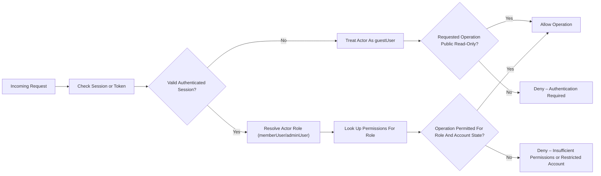

# User Actors, Authentication, and Permissions Requirements

## 1. Introduction

The **communityPlatform** service uses clearly defined user actors and role-based permissions to control access to all backend features. This requirements document describes **what** the backend must do in terms of authentication, session handling, authorization, and identity-related security, without prescribing **how** it is implemented technically.

The goals are:
- To define all user actors that can interact with the platform.
- To specify business-level authentication and session rules.
- To define which actions each actor is permitted to perform.
- To ensure consistent, auditable access control across all features.

All applicable requirements use EARS (Easy Approach to Requirements Syntax) with keywords in English (WHEN, WHILE, IF, THEN, WHERE, THE, SHALL).

---

## 2. User Actor Definitions

### 2.1 guestUser

A **guestUser** is an unauthenticated visitor.

Characteristics and capabilities:
- Can browse public communities and read visible posts and comments.
- Can view limited public information on user profiles.
- Cannot create, edit, or delete any content.
- Cannot vote, subscribe, report content, or access member-only features.

EARS requirements:
- THE identity subsystem SHALL treat any incoming request without a valid authenticated session as acting on behalf of a guestUser.
- WHEN the acting user is guestUser, THE access-control subsystem SHALL allow only read-only operations on public resources that are explicitly marked as visible to unauthenticated users.
- WHEN a guestUser attempts to perform an operation that is reserved for memberUser or adminUser, THE access-control subsystem SHALL deny the operation and SHALL indicate that authentication is required.

### 2.2 memberUser

A **memberUser** is a registered user with a valid authenticated session.

Capabilities include:
- Create and manage their own posts and comments.
- Vote on posts and comments.
- Subscribe and unsubscribe to communities.
- Report inappropriate content.
- Manage their own profile and account settings.

EARS requirements:
- THE identity subsystem SHALL treat any authenticated session that belongs to a non-admin account as acting on behalf of a memberUser.
- WHEN the acting user is memberUser, THE access-control subsystem SHALL allow all operations that are defined as member features in the platform’s business requirements, subject to community and moderation rules.
- WHEN a memberUser attempts an operation reserved for adminUser, THE access-control subsystem SHALL deny the operation and SHALL indicate that the user lacks sufficient permissions.

### 2.3 adminUser

An **adminUser** is a platform-level administrator.

Capabilities include:
- Perform all actions available to memberUser.
- Review and resolve content and user reports.
- Apply moderation actions to content (hide, remove, lock) and accounts (warn, restrict, suspend, ban).
- Configure platform-wide policies and settings within business rules.

EARS requirements:
- THE identity subsystem SHALL treat any authenticated session that belongs to an admin-designated account as acting on behalf of an adminUser.
- WHEN the acting user is adminUser, THE access-control subsystem SHALL allow additional administrative and moderation operations that are explicitly marked as admin-only.
- WHEN any operation would change another user’s permissions, account status, or community-wide settings, THE access-control subsystem SHALL require that the acting user is adminUser.

---

## 3. Authentication and Session Management

This section defines business expectations for registration, login, logout, session behavior, and account security.

### 3.1 Registration

- WHEN a visitor submits registration data, THE authentication subsystem SHALL validate all required fields according to business rules (such as uniqueness, format, and minimum password strength) before creating a memberUser.
- IF registration data fails validation, THEN THE authentication subsystem SHALL reject the registration request and SHALL provide structured information that indicates which high-level validation rules were violated.
- WHEN registration succeeds, THE authentication subsystem SHALL create a new memberUser account in an initial state defined by business policy (for example active or pending verification).
- WHERE email or identity verification is required, THE authentication subsystem SHALL restrict unverified accounts from performing actions that require verified status until verification completes successfully.

### 3.2 Login and Role Determination

- WHEN a user submits login credentials, THE authentication subsystem SHALL verify those credentials against stored account data.
- IF the submitted credentials do not correspond to an active, allowed account, THEN THE authentication subsystem SHALL reject the login attempt and SHALL not disclose whether the username or password was incorrect.
- WHEN login succeeds for a non-admin account, THE authentication subsystem SHALL establish an authenticated session that is associated with a memberUser role.
- WHEN login succeeds for an account designated as admin, THE authentication subsystem SHALL establish an authenticated session that is associated with an adminUser role.
- WHILE a session is active, THE identity subsystem SHALL attach the effective actor type (guestUser, memberUser, or adminUser) to each request for use by access-control.

### 3.3 Logout and Session Termination

- WHEN a memberUser or adminUser requests logout, THE authentication subsystem SHALL terminate the associated session so that subsequent operations are treated as guestUser actions.
- WHEN a user requests "log out from all devices", THE authentication subsystem SHALL invalidate all active sessions associated with that account as soon as reasonably practical.
- WHILE a session has expired due to inactivity or maximum lifetime, THE authentication subsystem SHALL treat the associated token or identifier as invalid and SHALL require re-authentication for any memberUser or adminUser operations.

### 3.4 Session Lifetime and Renewal

- THE authentication subsystem SHALL enforce a finite maximum lifetime for authenticated sessions to reduce exposure from stolen or leaked session identifiers.
- WHERE the platform supports long-lived access through renewal, THE authentication subsystem SHALL require periodic re-authentication based on business-defined timeouts.
- IF a session is flagged as compromised based on business-defined security signals, THEN THE authentication subsystem SHALL revoke that session and MAY revoke other sessions for the same account according to security policy.

### 3.5 Account Lockout and Abuse Protection

- WHEN multiple consecutive failed login attempts are detected for the same account or source beyond a configured threshold, THE authentication subsystem SHALL apply protective measures such as temporary login throttling or lockout.
- IF an account is temporarily locked due to excessive failed login attempts, THEN THE authentication subsystem SHALL deny additional login attempts during the lockout window and SHALL indicate that sign-in is temporarily restricted.
- WHEN a previously locked account becomes eligible for login again, THE authentication subsystem SHALL allow new login attempts and SHALL apply the same validation rules as a normal login.

### 3.6 Disabled, Suspended, and Banned Accounts

- WHEN an account is marked as disabled, suspended, or banned by moderation or administrative decision, THE authentication subsystem SHALL deny new login attempts for that account while the restriction is active.
- WHILE an account is in a restricted state, THE access-control subsystem SHALL deny operations that are outside the allowed scope for that restriction (for example read-only access or no access at all), according to moderation policy.
- WHEN a restriction on an account is lifted, THE authentication and access-control subsystems SHALL treat future authenticated sessions for that account according to the restored role (memberUser or adminUser).

---

## 4. Authorization and Permission Matrix

This section describes which actor may perform which categories of actions at a business level. Detailed feature behavior is defined in related functional documents.

### 4.1 Conceptual Permission Matrix

| Capability                                        | guestUser | memberUser | adminUser |
|---------------------------------------------------|-----------|-----------|-----------|
| Browse public communities                         | ✅        | ✅        | ✅        |
| View public posts and comments                    | ✅        | ✅        | ✅        |
| View limited public user profiles                 | ✅        | ✅        | ✅        |
| Register an account                               | ✅        | ❌        | ❌        |
| Log in / Log out                                  | ✅ / ❌   | ✅ / ✅   | ✅ / ✅   |
| Create communities (subject to business rules)    | ❌        | ✅        | ✅        |
| Edit/delete own communities (where applicable)    | ❌        | ✅        | ✅        |
| Create posts (text/link/image)                    | ❌        | ✅        | ✅        |
| Edit/delete own posts                             | ❌        | ✅        | ✅        |
| Comment and reply                                 | ❌        | ✅        | ✅        |
| Edit/delete own comments                          | ❌        | ✅        | ✅        |
| Upvote/downvote posts                             | ❌        | ✅        | ✅        |
| Upvote/downvote comments                          | ❌        | ✅        | ✅        |
| Subscribe/unsubscribe communities                 | ❌        | ✅        | ✅        |
| View own full profile and settings                | ❌        | ✅        | ✅        |
| Edit own profile and preferences                  | ❌        | ✅        | ✅        |
| Report posts and comments                         | ❌        | ✅        | ✅        |
| View and manage all reports                       | ❌        | ❌        | ✅        |
| Apply moderation to content (hide/remove/lock)    | ❌        | ❌        | ✅        |
| Restrict or suspend user accounts                 | ❌        | ❌        | ✅        |
| Configure platform-wide policies                  | ❌        | ❌        | ✅        |

### 4.2 Matrix Enforcement Requirements

- THE access-control subsystem SHALL enforce that guestUser can perform only read-only operations on public data that do not require account identity.
- THE access-control subsystem SHALL enforce that memberUser can perform all standard participation actions (posting, commenting, voting, subscribing, reporting, and profile management) that are not explicitly restricted by community or moderation rules.
- THE access-control subsystem SHALL enforce that adminUser can perform all memberUser actions plus administrative and moderation actions that modify content visibility, user account status, and global configuration.
- WHEN any actor attempts an operation that is not permitted for its role, THE access-control subsystem SHALL deny the operation and SHALL classify the result as an authorization failure rather than a validation failure.

---

## 5. Actor-based Feature Access Rules

This section refines core rules for specific feature areas using EARS.

### 5.1 Community Access and Management

- WHEN a guestUser requests a list of communities, THE access-control subsystem SHALL allow access only to communities that are marked as publicly discoverable.
- WHEN a memberUser requests to create a new community, THE access-control subsystem SHALL permit the operation only if the memberUser satisfies business-defined eligibility rules (such as account standing and community creation limits).
- WHEN a memberUser attempts to update settings or descriptive information for a community, THE access-control subsystem SHALL allow the operation only if that memberUser is recognized as an owner or manager of that community according to business rules.
- WHEN an adminUser performs community-level management (such as closing, quarantining, or archiving a community), THE access-control subsystem SHALL allow these operations regardless of community ownership, subject to administrative policies.

### 5.2 Post Creation, Editing, and Deletion

- WHEN a memberUser or adminUser attempts to create a post, THE access-control subsystem SHALL verify that posting is permitted in the target community for that actor and community state.
- IF a guestUser attempts to create a post, THEN THE access-control subsystem SHALL deny the operation and SHALL require authentication.
- WHEN a memberUser attempts to edit or delete a post, THE access-control subsystem SHALL allow the operation only if the post is owned by that memberUser and is still editable or deletable under business rules.
- WHEN an adminUser attempts to edit, hide, or remove any post for moderation reasons, THE access-control subsystem SHALL allow the operation and THE audit subsystem SHALL record the action for later review.

### 5.3 Commenting and Nested Replies

- WHEN a memberUser or adminUser attempts to create a comment or reply, THE access-control subsystem SHALL allow the operation only if the target post or parent comment is visible and open for new comments under community and moderation policies.
- IF a guestUser attempts to create a comment or reply, THEN THE access-control subsystem SHALL deny the operation and SHALL require authentication.
- WHEN a memberUser attempts to edit or delete a comment, THE access-control subsystem SHALL allow the operation only for comments authored by that memberUser and only within the permitted editing window.
- WHEN an adminUser performs moderation on comments (such as removal or locking threads), THE access-control subsystem SHALL allow these operations and THE audit subsystem SHALL log the actions.

### 5.4 Voting and Karma

- WHEN a memberUser or adminUser attempts to cast a vote on a post or comment, THE access-control subsystem SHALL require an authenticated session and SHALL verify that the content is visible and not restricted from voting.
- IF a guestUser attempts to vote, THEN THE access-control subsystem SHALL deny the vote operation and SHALL indicate that voting requires authentication.
- WHEN a memberUser attempts to vote on a post or comment they own, THE access-control subsystem SHALL enforce the platform’s self-voting policy and SHALL deny the vote if self-voting is prohibited.
- WHEN an account is restricted from voting due to moderation or abuse rules, THE access-control subsystem SHALL deny voting operations from that account while the restriction is active.

### 5.5 Subscriptions and Personalized Feeds

- WHEN a memberUser requests to subscribe to or unsubscribe from a community, THE access-control subsystem SHALL allow the operation only if the community is visible to that memberUser and subscription is allowed for that community.
- IF a guestUser attempts to subscribe or unsubscribe, THEN THE access-control subsystem SHALL deny the operation and SHALL require authentication.
- WHEN a memberUser requests their personalized feed, THE access-control subsystem SHALL ensure that only content visible to that memberUser and not blocked by moderation or restrictions is included in the feed results.

### 5.6 User Profiles and Account Management

- WHEN a guestUser views a user profile, THE access-control subsystem SHALL present only public profile attributes and visible activity according to privacy and moderation rules.
- WHEN a memberUser views their own profile, THE access-control subsystem SHALL allow access to additional account-specific information (such as email visibility settings or notification preferences) that is not exposed to other users.
- WHEN a memberUser attempts to update their own profile or account settings, THE access-control subsystem SHALL allow the operation if the account is not restricted from self-management by moderation rules.
- WHEN a memberUser attempts to update another user’s profile or settings without administrative authority, THE access-control subsystem SHALL deny the operation.
- WHEN an adminUser views any user profile, THE access-control subsystem SHALL allow additional administrative views needed for moderation, subject to privacy rules defined in the data lifecycle documentation.

### 5.7 Reporting and Moderation

- WHEN a memberUser or adminUser submits a report on content or another user, THE access-control subsystem SHALL ensure that the reporter is authenticated and that the target is reportable according to reporting rules.
- IF a guestUser attempts to submit a report, THEN THE access-control subsystem SHALL deny the operation and SHALL require authentication.
- WHEN an adminUser accesses the moderation interface to review reports, THE access-control subsystem SHALL restrict this interface to adminUser sessions only.
- WHEN an adminUser applies a moderation action, THE access-control subsystem SHALL enforce that only adminUser can perform that action and THE audit subsystem SHALL record the actor, target, and action.

---

## 6. Security and Compliance Expectations Related to Identity

This section defines cross-cutting security and compliance requirements that influence authentication and authorization.

### 6.1 Identity Integrity

- THE identity subsystem SHALL ensure that each authenticated request can be reliably associated with a specific user account (memberUser or adminUser) or with guestUser where no account is present.
- WHEN sensitive or high-impact actions occur (such as moderation decisions, account status changes, or community configuration changes), THE audit subsystem SHALL record which adminUser performed the action and when it occurred.

### 6.2 Least Privilege and Role Assignment

- THE role management process SHALL assign the memberUser role by default to newly created accounts, unless explicitly created as adminUser through administrative workflows.
- WHEN an existing memberUser is elevated to adminUser, THE role management process SHALL require an authenticated adminUser to perform the elevation and SHALL record the elevation action for auditing.
- WHEN an adminUser is demoted to memberUser, THE role management process SHALL update all future access-control decisions to treat that account as memberUser only and SHALL handle any active admin sessions according to security policy (for example forced re-authentication).

### 6.3 Account Suspension and Restrictions

- WHEN an account is suspended or restricted by moderation policy, THE access-control subsystem SHALL enforce limits on actions that the account can perform (such as posting, commenting, voting, or reporting) in line with the restriction.
- WHEN a suspended account attempts a restricted action, THE access-control subsystem SHALL deny the action and SHALL indicate that the account is restricted.
- WHEN the suspension period ends or a restriction is lifted, THE access-control subsystem SHALL restore the account’s permissions to those defined by its role and standing.

### 6.4 Privacy-aware Authorization

- THE access-control subsystem SHALL avoid exposing sensitive identity information (such as internal identifiers, email addresses, and security metadata) through normal feature operations to any actor who does not need that information.
- WHEN adminUser views internal security or moderation information about a user, THE access-control subsystem SHALL ensure that such views are limited to administrative contexts and are not exposed to general users.

### 6.5 Auditability

- THE audit subsystem SHALL log authentication events such as registration, login, logout, password change, and account state changes with enough detail to support security investigations.
- THE audit subsystem SHALL log all high-impact authorization-related events, including role changes, moderation actions, and configuration changes, together with the responsible adminUser, timestamp, and affected resource.
- WHERE privacy regulations constrain logging, THE audit subsystem SHALL avoid including full personal data in logs and SHALL rely on stable internal references.

---

## 7. Mermaid Diagram – High-level AuthN/AuthZ Flow

---

## 8. Assumptions and Constraints

- THE authentication and access-control subsystems SHALL be treated as foundational services that all other backend components rely on; no feature SHALL bypass these checks.
- THE requirements in this document SHALL be interpreted purely at the business level and SHALL not constrain the development team to specific technologies, token formats, or storage mechanisms.
- WHERE other documents (such as business rules, error handling, non-functional, and moderation requirements) define additional constraints, THE identity and permission behaviors in this document SHALL be implemented in a way that is consistent with those constraints.
