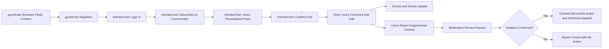

# Requirements Analysis – communityPlatform (Reddit-like Community Platform)

## 1. Overview

communityPlatform is a Reddit-like online community service where users can create topic-based communities, publish posts (text, links, images), discuss via nested comments, vote on content, build reputation (karma), subscribe to communities for a personalized feed, and report inappropriate content.

The purpose of this requirements analysis is to translate the high-level feature list into clear, business-focused requirements that backend developers can implement. The focus is on **what** the system must do and how it should behave from the user’s perspective, not on technical details such as APIs, databases, or infrastructure.

## 2. Goals and Scope

### 2.1 Primary Goals

- THE communityPlatform service SHALL enable users to participate in topic-based communities by creating and consuming posts and comments.
- THE communityPlatform service SHALL allow users to influence content visibility through upvotes and downvotes.
- THE communityPlatform service SHALL maintain a karma-based reputation signal for users based on community feedback.
- THE communityPlatform service SHALL provide multiple ways of sorting content (hot, new, top, controversial) to support discovery and relevance.
- THE communityPlatform service SHALL provide mechanisms to report and moderate inappropriate content to keep communities safe and compliant with policies.

### 2.2 In-Scope Features

The following feature areas are in scope for this analysis:

- User registration, login, and session behavior.
- Creation and management of communities (subreddit-like groups).
- Creation, editing, and deletion of posts (text, link, image) and comments with nested replies.
- Voting (upvote, downvote) on posts and comments.
- User karma calculation at a conceptual level.
- Sorting by hot, new, top, controversial for posts (and optionally comments).
- Subscribing to communities and viewing a personalized feed.
- User profiles summarizing contributions and karma.
- Reporting of inappropriate content and initiation of moderation workflows.

Out of scope:

- Monetization details (ads, premium tiers) beyond being conceptually possible.
- Detailed UI design, page layouts, or visual elements.
- Low-level algorithm formulas, database schemas, API endpoint shapes, or infrastructure.

## 3. Actors and Responsibilities

The platform defines four main actors. These actors are reused consistently across all requirements.

- **guestUser** – unauthenticated visitor.
- **memberUser** – registered, authenticated user.
- **communityModerator** – memberUser with additional privileges in specific communities.
- **platformAdmin** – platform-wide administrator.

### 3.1 guestUser

- THE system SHALL allow guestUser to browse public communities, posts, and comments without authentication.
- THE system SHALL prevent guestUser from creating communities, posts, comments, or votes.
- THE system SHALL allow guestUser to initiate registration and login flows.
- WHERE platform policy permits guest reporting, THE system SHALL allow guestUser to submit reports for clearly abusive public content and SHALL mark such reports as originating from an unauthenticated actor.

### 3.2 memberUser

- THE system SHALL allow memberUser to create communities, subject to global limits and rules.
- THE system SHALL allow memberUser to create, edit, and delete their own posts and comments within policy constraints.
- THE system SHALL allow memberUser to upvote and downvote posts and comments where voting is enabled.
- THE system SHALL allow memberUser to subscribe and unsubscribe to communities.
- THE system SHALL allow memberUser to view and manage their own profile, including their posts, comments, and karma.
- THE system SHALL allow memberUser to report content and users for potential policy violations.

### 3.3 communityModerator

- THE system SHALL allow communityModerator to configure community-level settings (description, rules, visibility) within platform constraints.
- THE system SHALL allow communityModerator to remove or lock posts and comments within communities they moderate.
- THE system SHALL allow communityModerator to process reports for their communities (resolve, escalate).
- THE system SHALL allow communityModerator to restrict or ban memberUser from their communities according to platform policy.

### 3.4 platformAdmin

- THE system SHALL allow platformAdmin to view and manage all communities, users, reports, and moderation states.
- THE system SHALL allow platformAdmin to enforce global policies, including global content removal and bans.
- THE system SHALL allow platformAdmin to override community-level decisions when necessary for safety or compliance.

## 4. Core Domain Concepts

### 4.1 Communities

- A community is a named, topic-based group where posts are created and discussed.
- Communities have:
  - Identifier (unique name/handle).
  - Title and description.
  - Rules text.
  - Visibility (e.g., public, restricted, private) at business level.
  - One or more communityModerator.

### 4.2 Posts

- A post is content created within a community.
- Posts have:
  - Author (memberUser).
  - Community association.
  - Type: text, link, or image.
  - Title and body or URL / image reference.
  - Creation time and optional edits.
  - Voting score and moderation state (normal, locked, removed, archived).

### 4.3 Comments and Threads

- Comments are messages attached to a post or another comment.
- Comments form a tree (nested replies) under each post.
- Comments have:
  - Author (memberUser).
  - Parent (post or comment).
  - Text body.
  - Creation time and optional edits.
  - Score and moderation state.

### 4.4 Votes and Karma

- Votes are expressions of approval (upvote) or disapproval (downvote) on posts and comments.
- Scores are derived from votes on posts and comments.
- Karma is a cumulative reputation metric per user based on votes on their content.

### 4.5 Subscriptions and Feeds

- Subscriptions connect a memberUser to one or more communities.
- Personalized feeds show posts from subscribed communities.

### 4.6 Profiles

- Profiles summarize a user’s publicly visible activity and reputation.
- Profiles show posts, comments, and karma, subject to visibility rules.

### 4.7 Reports

- Reports flag content or users for potential policy violations.
- Reports initiate moderation workflows for communityModerator and platformAdmin.

## 5. Authentication and Session Requirements

### 5.1 Registration

- WHEN a guestUser submits registration details that meet validation rules, THE communityPlatform SHALL create a new memberUser account and mark it according to verification policy (for example, pending verification).
- WHEN a guestUser submits registration with an identifier already in use, THE communityPlatform SHALL reject the registration and SHALL inform the guestUser that the identifier is already taken.
- WHEN a guestUser submits registration with invalid or incomplete data, THE communityPlatform SHALL reject the registration and SHALL indicate which fields must be corrected.

### 5.2 Login and Logout

- WHEN a user submits valid credentials for an active account, THE communityPlatform SHALL authenticate the user and SHALL treat subsequent actions as originating from that memberUser until logout or session expiration.
- WHEN a user submits invalid credentials, THE communityPlatform SHALL deny login and SHALL communicate that authentication failed without revealing which specific field was wrong.
- WHEN an authenticated memberUser requests logout, THE communityPlatform SHALL terminate the active session and SHALL require re-authentication for member-only actions.

### 5.3 Session Lifetime

- WHILE a session is active and within allowed lifetime, THE communityPlatform SHALL treat the session as authenticated for authorization decisions.
- WHEN a session expires due to time or inactivity, THE communityPlatform SHALL treat the user as guestUser until they log in again.

### 5.4 Account Status Effects

- WHERE a memberUser is suspended or banned, THE communityPlatform SHALL prevent authentication or SHALL restrict actions according to the suspension rules while still allowing any legally required accesses (for example, data export) if applicable.

## 6. Community Management Requirements

### 6.1 Community Creation

- WHEN a memberUser requests creation of a community with a valid, unique identifier and required attributes, THE communityPlatform SHALL create the community and SHALL assign the requesting memberUser as initial communityModerator.
- IF a memberUser attempts to create a community with a non-unique or invalid identifier, THEN THE communityPlatform SHALL reject the creation and SHALL explain that the identifier is not acceptable.
- WHERE platform policy limits community creation (for example, maximum per user or minimum karma), THE communityPlatform SHALL enforce those limits when processing community creation.

### 6.2 Community Configuration

- WHEN a communityModerator edits the community’s title, description, or rules within allowed limits, THE communityPlatform SHALL persist the new configuration and SHALL apply it to new content and user interactions.
- IF a memberUser without communityModerator privileges attempts to edit community settings, THEN THE communityPlatform SHALL deny the action and SHALL indicate that the user lacks permission.

### 6.3 Community Visibility

- WHERE a community is configured as public, THE communityPlatform SHALL allow guestUser and memberUser to view its posts and public comments, subject to content moderation.
- WHERE a community is configured as restricted or private, THE communityPlatform SHALL only allow authorized memberUser, communityModerator, and platformAdmin to view its content.

### 6.4 Community Archival and Closure

- WHEN a community is archived by communityModerator or platformAdmin, THE communityPlatform SHALL disallow new posts but SHALL keep existing visible content browseable according to policy.
- WHEN a community is closed or removed by platformAdmin for policy reasons, THE communityPlatform SHALL prevent future browsing or posting for that community and SHALL preserve necessary records for audit.

## 7. Post Requirements

### 7.1 Post Types and Creation

- WHEN a memberUser with posting permission creates a text post with valid title and body, THE communityPlatform SHALL create a text post in the specified community.
- WHEN a memberUser with posting permission creates a link post with valid title and URL, THE communityPlatform SHALL create a link post in the specified community.
- WHEN a memberUser with posting permission creates an image post with valid title and image reference, THE communityPlatform SHALL create an image post in the specified community.
- IF a post submission is missing required fields or violates length or content constraints, THEN THE communityPlatform SHALL reject the submission and SHALL indicate the constraint violations.
- WHERE a community restricts certain post types (for example, no image posts), THE communityPlatform SHALL enforce these restrictions for new posts.

### 7.2 Post Editing and Deletion

- WHERE a post belongs to a memberUser, THE communityPlatform SHALL allow that memberUser to edit the post’s title and body within policy-defined limits (for example, time windows or edit history visibility).
- WHEN a memberUser edits their own post successfully, THE communityPlatform SHALL update the post contents and SHALL mark the post as edited.
- WHERE a post belongs to a memberUser, THE communityPlatform SHALL allow that memberUser to delete the post, which SHALL remove it from normal feeds and listings while keeping necessary audit traces.
- IF a memberUser attempts to edit or delete a post they do not own without moderator/admin privileges, THEN THE communityPlatform SHALL deny the action and SHALL indicate insufficient permissions.

### 7.3 Post Locking and States

- WHEN a communityModerator or platformAdmin locks a post, THE communityPlatform SHALL prevent new comments and SHALL optionally prevent new votes according to locking policy while keeping the post visible.
- WHEN a locked post is later unlocked by an authorized actor, THE communityPlatform SHALL restore the ability to comment and vote according to normal rules.

## 8. Comment and Thread Requirements

### 8.1 Comment Creation

- WHEN a memberUser with commenting permission submits a comment on a post with valid content, THE communityPlatform SHALL create a top-level comment under that post.
- WHEN a memberUser with commenting permission submits a reply to an existing comment with valid content, THE communityPlatform SHALL create a nested comment and SHALL maintain the parent-child relationship.
- IF a memberUser attempts to comment on a post that is locked, removed, or archived, THEN THE communityPlatform SHALL reject the comment and SHALL indicate that commenting is not allowed on that post.

### 8.2 Comment Structure

- THE communityPlatform SHALL represent comments as a tree per post, with each comment optionally having a parent comment, up to a configured maximum depth.
- WHILE comments are displayed, THE communityPlatform SHALL preserve the nesting structure so that reply chains remain understandable.

### 8.3 Comment Editing and Deletion

- WHERE a comment belongs to a memberUser, THE communityPlatform SHALL allow that memberUser to edit the comment within policy-defined limits.
- WHEN a comment is edited by its author, THE communityPlatform SHALL update the comment body and SHALL mark the comment as edited.
- WHERE a comment belongs to a memberUser, THE communityPlatform SHALL allow that memberUser to delete the comment, which SHALL remove the comment body from normal views and SHALL optionally show a placeholder indicating deletion.
- IF a memberUser attempts to edit or delete another user’s comment without moderator/admin privilege, THEN THE communityPlatform SHALL deny the action and SHALL indicate insufficient permissions.

### 8.4 Comment Locking

- WHEN a communityModerator or platformAdmin locks a comment thread, THE communityPlatform SHALL prevent new replies under that comment while keeping existing comments visible.

## 9. Voting and Karma Requirements (Business-Level)

### 9.1 Voting on Posts and Comments

- WHEN a memberUser attempts to upvote a post they can see, THE communityPlatform SHALL record an upvote and SHALL adjust the post’s score accordingly if the action is allowed.
- WHEN a memberUser attempts to downvote a post they can see, THE communityPlatform SHALL record a downvote and SHALL adjust the post’s score accordingly if the action is allowed.
- WHEN a memberUser changes their vote on a post from upvote to downvote or vice versa, THE communityPlatform SHALL update the stored vote and SHALL recalculate the post’s score.
- WHEN a memberUser removes their vote on a post, THE communityPlatform SHALL remove the stored vote and SHALL adjust the post’s score.
- WHEN a memberUser votes on a comment, THE communityPlatform SHALL apply analogous behavior for comment scores.
- IF a guestUser attempts to vote, THEN THE communityPlatform SHALL reject the vote and SHALL indicate that authentication is required.
- WHERE policy disallows self-voting, THE communityPlatform SHALL prevent users from voting on their own posts or comments.

### 9.2 Scores

- THE communityPlatform SHALL maintain a score for each post and comment based on votes, represented as a net value (upvotes minus downvotes) at business level.
- WHEN votes change, THE communityPlatform SHALL update the corresponding score and SHALL use it in sorting and display contexts.

### 9.3 Karma

- THE communityPlatform SHALL maintain karma values per memberUser that reflect aggregated feedback on their posts and comments.
- WHEN a post or comment receives an upvote, THE communityPlatform SHALL increase the author’s karma according to platform rules.
- WHEN a post or comment receives a downvote, THE communityPlatform SHALL decrease the author’s karma according to platform rules.
- WHEN votes are changed or removed, THE communityPlatform SHALL update karma to reflect the new net effect.

### 9.4 Effects of Karma

- WHERE platform policy ties capabilities to karma thresholds (for example, community creation or posting in sensitive communities), THE communityPlatform SHALL check the memberUser’s karma before allowing such actions.
- WHERE thresholds are not met, THE communityPlatform SHALL deny the action and SHALL communicate that more karma is required.

## 10. Subscription and Feed Requirements

### 10.1 Subscribing to Communities

- WHEN a memberUser requests to subscribe to a community they can access, THE communityPlatform SHALL create or confirm a subscription relationship for that community.
- WHEN a memberUser requests to unsubscribe from a community, THE communityPlatform SHALL remove the subscription relationship for that community.
- IF a memberUser attempts to subscribe to a community they are banned from, THEN THE communityPlatform SHALL deny the subscription and SHALL indicate the restriction.

### 10.2 Personalized Feed

- WHEN a memberUser requests their personalized feed, THE communityPlatform SHALL construct a list of posts derived primarily from communities to which that user is subscribed, subject to visibility and moderation rules.
- WHERE a memberUser has no subscriptions, THE communityPlatform SHALL either return an empty personalized feed or SHALL provide a default experience (such as popular or recommended posts) according to business policy.
- WHILE constructing a feed, THE communityPlatform SHALL exclude content the user is not allowed to see (for example, from private communities where they lack access or from users they have blocked, if blocking is supported).

### 10.3 Community Feed

- WHEN any actor views a specific community, THE communityPlatform SHALL display a community feed composed of posts belonging to that community, subject to visibility and moderation rules.

## 11. Sorting and Ranking Requirements

Sorting is used in both community and personalized feeds.

### 11.1 Sorting Modes

- THE communityPlatform SHALL support at least the following sorting modes for posts: "hot", "new", "top", and "controversial".

### 11.2 New

- WHEN a user selects "new" sorting for a feed, THE communityPlatform SHALL order posts by creation time in reverse chronological order (newest first), subject to visibility and moderation.

### 11.3 Top

- WHEN a user selects "top" sorting, THE communityPlatform SHALL order posts primarily by score from highest to lowest, optionally restricted to a selected time range (for example, day, week) at business level.

### 11.4 Hot

- WHEN a user selects "hot" sorting, THE communityPlatform SHALL order posts based on a combination of score and recency so that recently popular posts tend to appear higher than older posts with similar scores.

### 11.5 Controversial

- WHEN a user selects "controversial" sorting, THE communityPlatform SHALL prioritize posts with a high total number of votes and a balanced mix of upvotes and downvotes, indicating contention.

### 11.6 Fallback Behavior

- IF a user requests a sorting mode that is not available in a particular context, THEN THE communityPlatform SHALL apply a sensible default sorting mode (for example, "hot" or "new") and SHALL inform the user which mode is in effect.

## 12. User Profile Requirements

### 12.1 Profile Content

- THE communityPlatform SHALL maintain a profile for each memberUser that includes basic identity (such as username), join date, and karma summary.
- THE communityPlatform SHALL allow each memberUser to view their own full activity summary, including posts, comments, and karma history subject to policy.

### 12.2 Viewing Profiles

- WHEN a user views another memberUser’s profile, THE communityPlatform SHALL show that memberUser’s public posts and comments, subject to community visibility and moderation rules.
- WHERE content on a profile has been removed or restricted, THE communityPlatform SHALL respect the content’s moderation state and SHALL either omit the content or show a placeholder.

### 12.3 Editing Profiles

- WHERE a profile belongs to a memberUser, THE communityPlatform SHALL allow that memberUser to update configurable profile fields (for example, display name or bio) within validation rules.
- IF a profile update violates validation rules (for example, length limits, prohibited content), THEN THE communityPlatform SHALL reject the update and SHALL describe the problem.

## 13. Reporting Inappropriate Content Requirements

### 13.1 Reportable Entities

- THE communityPlatform SHALL allow reporting of posts, comments, communities, and users.

### 13.2 Report Submission

- WHEN a memberUser submits a report for a visible post, comment, community, or user with a valid reason, THE communityPlatform SHALL create a report record including reporter, target, reason, and timestamp.
- IF a report is submitted without a required reason or required fields, THEN THE communityPlatform SHALL reject the report and SHALL indicate what is missing.
- IF a report targets content that no longer exists or is no longer visible, THEN THE communityPlatform SHALL reject the report and SHALL indicate that the content is unavailable.

### 13.3 Routing and Handling

- WHEN a report targets content in a community, THE communityPlatform SHALL route the report to the communityModerator for that community while also making it visible to platformAdmin according to policy.
- WHEN a report targets severe violations (for example, illegal content) according to policy, THE communityPlatform SHALL ensure platformAdmin receives or can view the report regardless of community.

### 13.4 Outcomes

- WHEN a report is reviewed, THE communityPlatform SHALL allow authorized actors to mark it as resolved with outcomes such as no action, content removal, content locking, user warning, or user sanctions.
- WHEN content is removed as a result of a report, THE communityPlatform SHALL hide the content from normal listings and SHALL record the moderation action.
- WHEN content is locked, THE communityPlatform SHALL keep the content visible but SHALL prevent new comments or edits according to locking rules.

## 14. Error Handling and Edge Cases (Business Perspective)

### 14.1 Authentication and Permissions

- IF an unauthenticated user attempts to perform a member-only action (posting, commenting, voting, reporting where restricted, subscribing), THEN THE communityPlatform SHALL deny the action and SHALL request authentication.
- IF an authenticated user attempts an action beyond their role permissions, THEN THE communityPlatform SHALL deny the action and SHALL indicate insufficient permissions.

### 14.2 Content Creation Errors

- IF a user submits a post or comment that exceeds allowed length or contains disallowed content according to policy, THEN THE communityPlatform SHALL reject the submission and SHALL describe the validation failure in business terms.
- IF a user attempts to interact with content that has just been removed or locked by moderation, THEN THE communityPlatform SHALL reject the interaction and SHALL indicate that the content is no longer available for that action.

### 14.3 Voting and Karma Edge Cases

- IF a user attempts to vote multiple times on the same item in the same direction, THEN THE communityPlatform SHALL treat duplicate actions as no-ops and SHALL keep the single intended vote state.
- IF a vote operation fails after submission due to an internal issue, THEN THE communityPlatform SHALL avoid partially applied votes and SHALL encourage the user to retry.

### 14.4 Reporting Errors

- IF reporting is temporarily unavailable, THEN THE communityPlatform SHALL inform users attempting to report that the feature is temporarily unavailable and SHALL not silently discard reports.
- IF a report is submitted for content that has already been fully moderated and removed, THEN THE communityPlatform SHALL treat the report as resolved with a status indicating that the target is no longer available.

### 14.5 Data Consistency and Concurrency

- WHERE multiple actions occur concurrently on the same content item, THE communityPlatform SHALL apply deterministic rules to decide which action wins and SHALL ensure users do not see contradictory states for the same item.

## 15. Example User Journey (Mermaid Diagram)

The following diagram illustrates a high-level journey of a memberUser from login to posting, voting, and reporting.

## 16. Summary

The requirements in this analysis describe the expected behavior of communityPlatform as a Reddit-like community service, covering user registration and login, community creation, posting and nested commenting, voting and karma, sorting, subscriptions and feeds, user profiles, and reporting with moderation triggers. All requirements are expressed at a business level using EARS-style phrasing where applicable, leaving full technical implementation autonomy to the backend development team while removing ambiguity about how the system must behave from the user’s perspective.