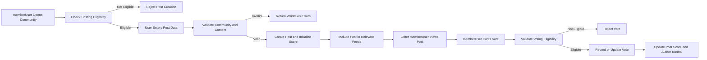

# Core Functional Requirements for Communities, Posts, Comments, Voting, and Feeds (communityPlatform)

## 1. Introduction

The **communityPlatform** service provides a Reddit-like community experience where users participate in topic-based communities by creating posts, commenting with nested replies, voting, and consuming personalized or community-level feeds. This document defines what the backend must do in business terms for these core features so that developers can implement them consistently.

THE purpose of this specification SHALL be to describe functional behavior for:
- Communities (creation, basic management, visibility)
- Posts (text, link, image) and their lifecycle
- Comments and nested replies
- Voting and karma
- Sorting modes (hot, new, top, controversial)
- Subscriptions and feeds (community feeds and personalized feeds)

THE specification SHALL avoid technical details such as API shapes, database schemas, or infrastructure choices, and SHALL instead focus on observable behavior that can be validated from an external perspective.

The primary actors referenced in this document are:
- **guestUser** – unauthenticated visitor with read-only access to public content.
- **memberUser** – authenticated community member with content creation and voting capabilities.
- **adminUser** – administrator responsible for global moderation and operational control.

## 2. Scope and Relationship to Other Documents

THE scope of this document SHALL include only the core Reddit-like feature set:
- Communities: creation, metadata, visibility, ownership constraints.
- Posts: creation, editing, deletion, visibility, and basic moderation hooks.
- Comments: nested discussion threads, editing, deletion, and visibility.
- Voting: upvotes and downvotes on posts and comments, including effects on scores and karma.
- Sorting: ordering of posts in feeds by hot, new, top, and controversial.
- Feeds: community-level feeds and personalized feeds based on subscriptions.

THE core functional requirements defined here SHALL be consistent with:
- Actor definitions and permissions in the user actors and permissions specification.
- Social features (profiles, notifications, search, discovery) in the social and engagement specification.
- Moderation, reporting, and abuse handling in the content moderation specification.

WHERE behavior overlaps with other domain documents, THE communityPlatform service SHALL honor the stricter or more specific rule and SHALL avoid contradictions between documents.

## 3. Domain Concepts and Definitions

### 3.1 Core Entities (Business-Level)

- **Community** – A named thematic space where posts are created and discussions occur.
- **Post** – A content item created in a community; it may be a text post, link post, or image post.
- **Comment** – A message attached to a post or another comment, forming a nested discussion thread.
- **Vote** – A memberUser expression of preference on a post or comment: upvote, downvote, or no vote.
- **Score** – A numeric content metric derived from votes used for ranking (for example, upvotes minus downvotes).
- **Karma** – A user-level metric reflecting reception of that user’s posts and comments across communities.
- **Feed** – A list of posts returned for a given context (for example, one community or a personalized home feed).
- **Sorting mode** – A rule for ordering posts in a feed (hot, new, top, controversial).

### 3.2 Actor Summary in Core Features

- THE communityPlatform service SHALL treat any request without a valid authenticated session as originating from guestUser.
- THE communityPlatform service SHALL treat any request with a valid authenticated non-admin session as originating from memberUser.
- THE communityPlatform service SHALL treat any request with a valid authenticated admin session as originating from adminUser.

WHERE actor-specific rules are defined in this document, THE communityPlatform service SHALL enforce them consistently whenever that actor performs relevant operations.

## 4. Communities (Creation and Management)

### 4.1 Community Creation

- WHEN a memberUser requests to create a community, THE communityPlatform service SHALL require at minimum a community name that satisfies naming rules and a visibility type (for example, public, restricted, or private) if supported by policy.
- WHEN a memberUser submits community creation data, THE communityPlatform service SHALL validate that:
  - The proposed name meets minimum and maximum length requirements.
  - The proposed name uses only allowed characters.
  - The proposed name is unique among existing communities after applying normalization rules (for example case-insensitive comparison).
  - The memberUser satisfies eligibility rules (for example, not banned from community creation and not exceeding per-user community creation limits).
- IF any validation rule for community creation fails, THEN THE communityPlatform service SHALL reject the creation request and SHALL indicate which high-level rule was violated (for example, name already taken, name invalid, or user not eligible).
- WHEN community creation succeeds, THE communityPlatform service SHALL:
  - Create a community entity linked to the creator memberUser as owner or primary maintainer.
  - Store the creation timestamp.
  - Initialize default settings such as visibility and posting permissions based on platform policy.

### 4.2 Community Ownership and Management

- THE communityPlatform service SHALL treat the creating memberUser as the owner of the community for business purposes unless ownership is reassigned by adminUser.
- WHEN a community owner requests to update editable community metadata (for example, description, rules, category tags) within allowed limits, THE communityPlatform service SHALL apply the changes after validation.
- IF a memberUser who is not the owner and not an authorized manager attempts to update community metadata, THEN THE communityPlatform service SHALL reject the operation and SHALL indicate insufficient permissions.
- WHEN an adminUser performs management actions on any community (for example, updating description, changing visibility, or closing the community), THE communityPlatform service SHALL apply those changes and SHALL record that the action was administrative.

### 4.3 Community Visibility and Access

- WHERE a community is public, THE communityPlatform service SHALL allow guestUser, memberUser, and adminUser to browse community metadata and visible posts.
- WHERE a community is restricted, THE communityPlatform service SHALL allow only eligible actors to create posts and comments while still allowing broader viewing where policy permits.
- WHERE a community is private, THE communityPlatform service SHALL restrict viewing and participation to approved actors and SHALL treat access attempts by non-approved actors as not allowed.
- WHEN a community status transitions to archived, THE communityPlatform service SHALL:
  - Prevent new posts and comments in that community for guestUser, memberUser, and adminUser (unless adminUser explicitly overrides).
  - Allow viewing of existing visible content according to visibility rules.
- WHEN a community is closed or banned according to moderation policy, THE communityPlatform service SHALL:
  - Prevent creation of new posts, comments, and subscriptions in that community.
  - Exclude the community from general discovery and recommendation mechanisms where policy requires.

## 5. Posts (Text, Link, Image)

### 5.1 Post Creation Eligibility and Types

- WHERE the actor is guestUser, THE communityPlatform service SHALL disallow post creation in all communities.
- WHERE the actor is memberUser, THE communityPlatform service SHALL allow post creation only in communities where posting is enabled for members and where the memberUser is not restricted from posting.
- WHERE the actor is adminUser, THE communityPlatform service SHALL allow post creation in all non-banned communities, including those where normal members cannot post, when acting under moderation or operational needs.
- WHEN a memberUser or adminUser initiates post creation, THE communityPlatform service SHALL require:
  - A valid target community identifier.
  - A non-empty title that complies with length limits.
  - A post type among the allowed options (text, link, image).
  - Type-specific content fields as required by the chosen post type.
- WHERE the post type is text, THE communityPlatform service SHALL require a text body that satisfies minimum and maximum length rules.
- WHERE the post type is link, THE communityPlatform service SHALL require a link target that passes URL format validation and host-level policy rules (for example, not banned domains).
- WHERE the post type is image, THE communityPlatform service SHALL require at least one media reference that passes size, format, and safety checks defined by policy.

### 5.2 Post Validation and Creation

- WHEN a post creation request is submitted, THE communityPlatform service SHALL validate:
  - Actor permissions (user must be memberUser or adminUser and not restricted from posting).
  - Community state (community exists, is not banned, and allows posting).
  - Title and content fields against length and policy constraints.
  - Link or media fields against safety and format constraints.
- IF any validation step fails, THEN THE communityPlatform service SHALL reject the post creation and SHALL provide a business-level reason category (for example, invalid title, invalid URL, community not available, or posting restricted).
- WHEN a post passes validation, THE communityPlatform service SHALL create the post and SHALL link it to:
  - The author account.
  - The target community.
  - A creation timestamp.
  - An initial score and visibility state.
- WHERE community or platform policy requires pre-moderation, THE communityPlatform service SHALL mark the post’s visibility as pending review and SHALL exclude it from general feeds until approved.
- WHERE community and platform policy allow immediate publication, THE communityPlatform service SHALL mark the post as visible and SHALL include it in appropriate feeds and profile activity.

### 5.3 Post Editing

- WHEN a post owner attempts to edit their post, THE communityPlatform service SHALL:
  - Validate that the post is not in a locked or banned state that disallows editing.
  - Enforce any configured editing window (for example, posts may be edited only within a certain time after creation).
  - Ensure the updated fields comply with all validation rules for title and content.
- IF the edit request violates the editing window or the post is in a state that disallows editing, THEN THE communityPlatform service SHALL reject the edit attempt and SHALL indicate that editing is not allowed.
- WHEN a post edit is accepted, THE communityPlatform service SHALL:
  - Update the stored content.
  - Record an update timestamp.
  - Optionally mark the post as edited for display according to policy.

### 5.4 Post Deletion and Removal

- WHEN a post owner requests deletion of their post, THE communityPlatform service SHALL:
  - Validate that the owner is the author and that deletion is allowed by policy for that post.
  - Transition the post to a deleted state where it is excluded from normal feeds and search, while preserving necessary metadata (for example, for moderation records and comment threading).
- WHEN an adminUser removes a post for policy reasons, THE communityPlatform service SHALL:
  - Mark the post as removed by moderation.
  - Prevent new comments and votes on that post.
  - Exclude the post from normal feeds and search.
- WHERE a post has existing comments, THE communityPlatform service SHALL:
  - Preserve comment structure where policy allows, potentially showing a placeholder that the original post has been removed.
  - Apply consistent rules on whether comment content remains visible or becomes restricted when the parent post is removed.

### 5.5 Post Display and Access

- WHEN a guestUser, memberUser, or adminUser views a community feed or a specific post, THE communityPlatform service SHALL display only posts the actor is allowed to see based on community state, moderation status, and user permissions.
- WHEN a post is displayed, THE communityPlatform service SHALL show at minimum:
  - Title.
  - Post type indicator.
  - Author handle or anonymized label, as allowed by policy.
  - Community reference.
  - Score.
  - Creation time and optionally editable markers.
  - Content, except where censored or replaced due to policy.

## 6. Comments and Nested Replies

### 6.1 Comment Creation

- WHERE the actor is guestUser, THE communityPlatform service SHALL disallow comment creation in all contexts.
- WHERE the actor is memberUser, THE communityPlatform service SHALL allow comment creation on posts and comments that are visible, not locked, and in communities that permit commenting.
- WHERE the actor is adminUser, THE communityPlatform service SHALL allow comment creation on any visible content when needed for moderation or communication.
- WHEN a comment creation request is submitted, THE communityPlatform service SHALL require:
  - A valid target post or parent comment identifier.
  - Non-empty text that complies with length and content rules.
- WHEN the target post or parent comment is not found, not visible to the actor, or locked from new comments, THE communityPlatform service SHALL reject the comment creation attempt and SHALL indicate that new comments are not allowed on that target.
- WHEN a comment passes validation, THE communityPlatform service SHALL create the comment, link it to the target post and optional parent comment, record a creation timestamp, and initialize its score and visibility.

### 6.2 Nested Replies and Depth Rules

- THE communityPlatform service SHALL treat comments as forming a tree structure with depth starting at 1 for direct replies to the post.
- WHERE a maximum nesting depth is configured, THE communityPlatform service SHALL prevent creation of new replies that would exceed this depth and SHALL indicate that maximum reply depth has been reached.
- WHEN presenting comments, THE communityPlatform service SHALL preserve parent-child associations and SHALL support display that reflects the nested structure.

### 6.3 Comment Editing

- WHEN a comment owner attempts to edit their comment, THE communityPlatform service SHALL:
  - Validate that the comment has not been locked or fully removed.
  - Enforce any configured editing window for comments.
  - Validate updated text against content rules.
- IF the editing window has expired or the comment is locked or removed, THEN THE communityPlatform service SHALL reject the edit attempt and SHALL indicate that editing is not allowed.
- WHEN an edit is accepted, THE communityPlatform service SHALL update the comment text, record an update timestamp, and optionally mark the comment as edited for display.

### 6.4 Comment Deletion and Removal

- WHEN a comment owner requests deletion of their comment, THE communityPlatform service SHALL:
  - Validate deletion eligibility according to policy.
  - Replace the comment’s content with a standard placeholder (for example, "comment deleted by user") while preserving its place in the thread and its replies.
- WHEN an adminUser removes a comment for policy reasons, THE communityPlatform service SHALL:
  - Mark the comment as removed by moderation.
  - Optionally prevent new replies to that comment while preserving existing replies according to policy.
  - Ensure that moderation removal state is reflected in all future presentations of the thread.

### 6.5 Comment Thread Display

- WHEN a user views a post with comments, THE communityPlatform service SHALL:
  - Retrieve comments the actor is allowed to view.
  - Present them using a nested representation.
  - Allow sorting of comments according to business-defined rules (for example, top or new) if supported.
- WHERE comments are numerous, THE communityPlatform service SHALL support pagination or lazy loading to limit the number of comments returned in a single response, while keeping structure consistent across pages.

## 7. Voting and Karma System

### 7.1 Voting on Posts

- WHERE the actor is guestUser, THE communityPlatform service SHALL disallow upvotes and downvotes on all posts.
- WHERE the actor is memberUser, THE communityPlatform service SHALL allow casting a vote on any visible post that is not locked for voting and that the memberUser is allowed to interact with.
- WHERE the actor is adminUser, THE communityPlatform service SHALL treat their votes the same as memberUser votes for score and karma purposes, except where policy explicitly differentiates administrative votes.
- WHEN a memberUser casts an upvote or downvote on a post, THE communityPlatform service SHALL:
  - Validate that the post exists and is visible to that user.
  - Validate that the user is not prohibited from voting (for example, account restricted).
  - Validate that the user is not voting on their own post if self-voting is disallowed.
- WHEN a memberUser changes a vote on a post, THE communityPlatform service SHALL:
  - Update the stored vote record to the new state (upvote, downvote, or none).
  - Adjust the post’s score accordingly.
  - Adjust the post author’s karma according to configured rules.

### 7.2 Voting on Comments

- Voting rules for comments SHALL mirror the rules for posts, with the target being a comment instead of a post.
- WHEN a memberUser casts or changes an upvote or downvote on a comment, THE communityPlatform service SHALL:
  - Validate eligibility.
  - Adjust the comment’s score and the comment author’s karma.

### 7.3 Single Active Vote per User per Item

- THE communityPlatform service SHALL ensure that each memberUser has at most one active vote state per post and per comment at any time.
- WHEN a memberUser attempts to cast a vote identical to their existing vote on the same item, THE communityPlatform service SHALL treat the operation as idempotent and SHALL not change the stored state or scores.
- WHEN a memberUser sets the vote state to neutral (for example, removing an existing vote), THE communityPlatform service SHALL remove the contribution of that user from the item’s score and SHALL adjust karma accordingly.

### 7.4 Karma Calculation and Updates

- THE communityPlatform service SHALL maintain an aggregate karma value for each memberUser based on scores of their posts and comments according to platform-defined weighting rules.
- WHEN votes on a user’s posts or comments change, THE communityPlatform service SHALL update that user’s karma within a timeframe that appears near real time to observers.
- WHEN a post or comment is permanently removed for policy violations, THE communityPlatform service SHALL adjust the associated user’s karma according to business policy (for example, subtracting the karma gained from that content).
- WHEN a previously removed post or comment is restored, THE communityPlatform service SHALL recalculate karma so that it reflects the restored content’s votes.

### 7.5 Voting Restrictions for Special States

- WHERE a post or comment is locked from further interaction, THE communityPlatform service SHALL disallow new votes and vote changes on that item while preserving existing votes.
- WHERE a user account is restricted from voting due to moderation, THE communityPlatform service SHALL disallow vote creation or change attempts from that account and SHALL indicate that voting is disabled for that user.

## 8. Sorting Modes (Hot, New, Top, Controversial)

### 8.1 Common Sorting Behavior

- WHEN any actor requests a feed of posts for a community or a personalized context, THE communityPlatform service SHALL allow specifying a sorting mode among supported options (at minimum hot, new, top, controversial).
- IF a requested sorting mode is not supported or is invalid, THEN THE communityPlatform service SHALL either:
  - Reject the request with an indication that the sort mode is invalid, or
  - Fall back to a default sort mode and clearly indicate the effective mode through business-level feedback.

### 8.2 New Sorting

- THE communityPlatform service SHALL define "new" sorting as ordering posts primarily by creation time descending.
- WHEN "new" sorting is applied, THE communityPlatform service SHALL:
  - Ignore score differences for primary ordering.
  - Use secondary criteria such as score or identifier only to break ties.

### 8.3 Top Sorting

- THE communityPlatform service SHALL define "top" sorting as ordering posts primarily by score in descending order.
- WHERE time-windowed top views are supported (for example top today, top this week), THE communityPlatform service SHALL:
  - Filter posts to those created within the configured time window.
  - Apply score-based ordering among the filtered set.

### 8.4 Hot Sorting

- THE communityPlatform service SHALL define "hot" sorting as a time-weighted ranking function that combines post score and recency so that new and highly-voted posts appear earlier.
- WHEN "hot" sorting is applied, THE communityPlatform service SHALL favor posts with higher scores and more recent timestamps within the constraints of the ranking function.
- THE communityPlatform service SHALL ensure that "hot" sorting is deterministic for a fixed data set and context.

### 8.5 Controversial Sorting

- THE communityPlatform service SHALL define "controversial" sorting as ordering posts by a function that emphasizes high total votes with a relatively balanced proportion of upvotes and downvotes.
- WHEN "controversial" sorting is selected, THE communityPlatform service SHALL:
  - Exclude posts with too few total votes to be considered meaningfully controversial.
  - Prioritize posts with significant vote activity and mixed sentiment.

### 8.6 Pagination Behavior in Sorted Lists

- THE communityPlatform service SHALL paginate feeds into discrete result sets with a maximum number of posts per page defined by business policy.
- WHEN a user requests subsequent pages for a sorted list, THE communityPlatform service SHALL:
  - Apply the same sorting rules as the initial page.
  - Avoid returning duplicates within a single continuous browsing session, to the extent possible given new content creation.

## 9. Subscriptions and Feeds

### 9.1 Community Subscriptions

- WHERE the actor is guestUser, THE communityPlatform service SHALL disallow all subscribe and unsubscribe operations.
- WHERE the actor is memberUser, THE communityPlatform service SHALL allow subscribing to any community that is visible and open to new subscriptions.
- WHEN a memberUser requests to subscribe to a community, THE communityPlatform service SHALL:
  - Validate that the community exists and is not closed to new subscribers.
  - Check that the memberUser has not exceeded subscription-related business limits (for example, a maximum number of communities).
  - Create or confirm a subscription record linking the memberUser and the community.
- WHEN a memberUser requests to unsubscribe, THE communityPlatform service SHALL remove the active subscription record for that community and SHALL ensure that subsequent personalized feeds do not include new posts from that community.
- IF a memberUser attempts to unsubscribe from a community they are not currently subscribed to, THEN THE communityPlatform service SHALL treat the operation as idempotent and SHALL leave the subscription state unchanged (not subscribed).

### 9.2 Personalized Feeds for memberUser

- WHEN a memberUser requests their personalized home feed, THE communityPlatform service SHALL:
  - Identify communities to which the memberUser is subscribed.
  - Identify posts from those communities that are visible to the memberUser.
  - Order the posts according to the selected sorting mode.
  - Return a page of posts consistent with pagination rules.
- WHERE a memberUser has no active subscriptions, THE communityPlatform service SHALL use business rules to populate the home feed with fallback content, such as globally popular posts or onboarding recommendations.
- WHERE business rules allow recommended posts from unsubscribed communities, THE communityPlatform service SHALL clearly separate or label such posts from posts in subscribed communities at the conceptual level.

### 9.3 Community-Specific Feeds

- WHEN any actor views a community page, THE communityPlatform service SHALL present a feed containing posts from that community only, filtered by visibility and moderation rules.
- WHEN a sorting mode is applied to a community feed, THE communityPlatform service SHALL use the same definitions of hot, new, top, and controversial as defined in the sorting section.

### 9.4 GuestUser Feeds

- WHEN a guestUser accesses the platform’s main feed or landing page, THE communityPlatform service SHALL:
  - Present posts drawn from public communities, using a default sort mode (for example hot) and business-defined selection rules.
  - Exclude content from private communities or from communities not visible to guestUser.

## 10. Cross-Cutting Constraints for Core Features

### 10.1 Actor and Permission Enforcement

- THE communityPlatform service SHALL enforce actor-based permissions for all core operations (community creation, posting, commenting, voting, subscribing) consistently with the user actors and permissions specification.
- WHEN an actor attempts an operation that their role does not permit, THE communityPlatform service SHALL deny the operation and SHALL not execute any part of the restricted action.

### 10.2 Validation and Error Behavior

- WHEN any creation or update request fails validation, THE communityPlatform service SHALL:
  - Prevent creation or modification of the underlying entity.
  - Provide structured business-level reasons so that clients can communicate meaningful error messages.
- WHEN a requested entity (community, post, comment) is not found or is not visible to the actor, THE communityPlatform service SHALL:
  - Treat the entity as unavailable.
  - Prevent operations dependent on that entity.

### 10.3 Consistency and Ordering

- WHILE content is being created or updated, THE communityPlatform service SHALL ensure that once the operation is reported as successful to the actor, subsequent reads conform to the new state.
- WHERE feed ordering is based on mutable metrics such as score or time, THE communityPlatform service SHALL accept that ordering may change between requests but SHALL maintain deterministic results for the same underlying data and context.

### 10.4 Performance Expectations (Core Features Perspective)

- WHEN a user requests a typical-sized community feed or personalized feed under normal load, THE communityPlatform service SHALL provide a response within the performance bounds defined in the non-functional requirements.
- WHEN a memberUser creates or updates a post, comment, vote, or subscription under normal load, THE communityPlatform service SHALL reflect changes in subsequent reads in a timeframe that appears near real time to users.

## 11. Core Flow Diagram – Post Creation and Voting

## 12. Summary

THE requirements in this document SHALL collectively define how communities, posts, comments, voting, sorting, and feeds behave in the communityPlatform service. The behaviors are expressed in business terms using EARS-style requirements so that backend developers can design and implement systems that satisfy the Reddit-like user experience without being constrained by specific technical implementation details.

THE communityPlatform service SHALL use this specification, together with the user actors and permissions, moderation, social features, business rules, and non-functional requirements documents, as a coherent baseline for implementing the core backend functionality of the Reddit-like community platform.