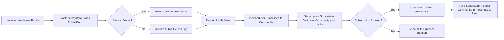

# Functional Requirements – Social and Engagement Features for communityPlatform

## 1. Introduction

### 1.1 Purpose and Scope
The purpose of the social and engagement features is to increase user participation, retention, and discoverability of content on **communityPlatform**, a Reddit-like community service.

THE social and engagement subsystem SHALL define behaviors for:
- User profiles and public activity views.
- Community subscriptions and their impact on feeds.
- Karma display and achievement-like recognition.
- Conceptual notifications about important social events.
- Conceptual search and discovery functions for communities, posts, and users.

THE requirements in this document SHALL describe what the platform must do from a business perspective and SHALL avoid prescribing specific technologies, APIs, or storage designs.

### 1.2 Actors

The social and engagement features involve the following actors:
- **guestUser**: Unauthenticated visitor.
- **memberUser**: Registered and authenticated user.
- **adminUser**: Platform administrator with additional moderation and oversight capabilities.

THE social and engagement subsystem SHALL respect the role definitions and permission boundaries defined for these actors in the identity and permissions requirements.

## 2. User Profiles and Public Activity

### 2.1 Profile Purpose and Overview

THE profile subsystem SHALL provide a public identity view for each memberUser.

THE profile subsystem SHALL aggregate user activity (posts, comments, karma) in a way that allows others to understand the memberUser’s contributions and reputation on the platform.

### 2.2 Profile Structure and Contents

THE profile subsystem SHALL represent each memberUser with a unique profile linked to the underlying account identity.

THE profile subsystem SHALL present at least the following public-profile elements:
- Stable identity handle (e.g., username or similar public identifier).
- Indicator of account age (e.g., derived from registration date).
- Aggregate karma value.
- Recent public posts.
- Recent public comments.

WHEN a profile is displayed, THE profile subsystem SHALL ensure that only fields designated as public are exposed to guestUser and other memberUser.

WHEN a memberUser views their own profile, THE profile subsystem SHALL allow access to additional self-only information such as editable profile fields and private preferences, subject to privacy rules.

IF a profile attribute is optional and not set by the memberUser, THEN THE profile subsystem SHALL omit that attribute from the public profile instead of showing placeholder or dummy text.

### 2.3 Profile Editing and Validation

WHEN a memberUser attempts to edit profile fields that are designated as user-editable (for example, bio or display name), THE profile subsystem SHALL validate these fields against business rules for length, allowed characters, and content policy.

IF a profile edit submission violates length or content rules, THEN THE profile subsystem SHALL reject the change and indicate which general rule was violated (for example, too long, contains prohibited terms).

WHILE a memberUser account is suspended or banned, THE profile subsystem SHALL prevent profile edits and SHALL indicate that the account is restricted from making changes.

WHEN a profile edit is accepted, THE profile subsystem SHALL ensure that subsequent profile views reflect the updated information without requiring the user to re-authenticate.

### 2.4 Profile Visibility and Special States

WHEN any actor requests a profile by a valid public identifier, THE profile subsystem SHALL determine whether the profile is:
- Active and visible.
- Suspended or banned.
- Deleted or fully removed.

WHEN a profile is active, THE profile subsystem SHALL present standard public information according to visibility rules.

WHEN a profile is associated with a banned or suspended account, THE profile subsystem SHALL indicate that the account is restricted and SHALL apply policy-driven rules for showing or hiding past content and karma.

IF a profile corresponds to an account that has been permanently deleted, THEN THE profile subsystem SHALL respond that the profile is unavailable and SHALL avoid revealing historical identifiers that are meant to be removed.

### 2.5 Public Activity Listing

WHEN a profile is viewed, THE profile subsystem SHALL provide lists of recent posts and comments authored by that memberUser, ordered primarily by recency.

THE profile subsystem SHALL limit the number of items returned per request and SHALL support requesting additional pages of activity when more items exist.

IF a post or comment on the profile activity list has been removed or hidden by moderation or by the author, THEN THE profile subsystem SHALL either omit it from the activity listing or show it as a removed item with minimal placeholder text, according to policy.

IF a post or comment belongs to a community that is not visible to the requesting actor (for example, a private community), THEN THE profile subsystem SHALL not reveal that content in the profile activity listing and SHALL not expose community-specific identifiers that the actor cannot otherwise access.

## 3. Community Subscription Behavior

### 3.1 Subscription Concept

THE subscription subsystem SHALL enable memberUser to build a personalized view of the platform by subscribing to communities.

THE subscription subsystem SHALL treat subscriptions as a long-lived relationship between a memberUser and a community that affects personalized feeds and potentially notifications.

### 3.2 Subscribing to Communities

WHEN a memberUser requests to subscribe to a community, THE subscription subsystem SHALL verify that:
- The community exists.
- The community is eligible for subscription by that memberUser (for example, not banned or closed to new subscribers).

IF the community is eligible, THEN THE subscription subsystem SHALL create or confirm a subscription record for that memberUser and community.

IF the memberUser is already subscribed to the community, THEN THE subscription subsystem SHALL treat the subscribe request as idempotent and SHALL leave the subscription state unchanged while indicating that the user remains subscribed.

IF the community is not eligible for subscription (for example, closed, banned, or restricted to certain users), THEN THE subscription subsystem SHALL reject the subscribe request and SHALL indicate that the community cannot be subscribed to.

WHEN a memberUser successfully subscribes to a community, THE subscription subsystem SHALL ensure that future personalized feeds and relevant features treat the memberUser as subscribed.

### 3.3 Unsubscribing from Communities

WHEN a memberUser requests to unsubscribe from a community, THE subscription subsystem SHALL remove or deactivate the subscription record between that memberUser and the community.

IF a memberUser requests to unsubscribe while not currently subscribed, THEN THE subscription subsystem SHALL treat the operation as idempotent and SHALL maintain the state as unsubscribed without error.

WHEN a memberUser unsubscribes from a community, THE subscription subsystem SHALL ensure that new content from that community no longer appears in the memberUser’s subscription-based feeds, while still allowing direct browsing of the community if it is otherwise visible.

### 3.4 Subscription State and Feed Impact

WHILE a memberUser remains subscribed to a community, THE subscription subsystem SHALL include posts from that community when generating the memberUser’s personalized feed, subject to visibility, moderation, and sorting rules.

WHEN a community is archived, closed, or banned according to platform policy, THE subscription subsystem SHALL treat existing subscriptions appropriately by:
- Ceasing to add new content from that community into personalized feeds.
- Deciding whether to maintain or automatically remove subscription records according to business rules.

WHEN a memberUser account is suspended or deleted, THE subscription subsystem SHALL treat all associated subscriptions as inactive and SHALL not use them to generate feeds or notifications.

### 3.5 Subscription Limits and Abuse Prevention

WHERE a maximum number of subscriptions per memberUser is defined, THE subscription subsystem SHALL prevent new subscriptions that exceed this limit and SHALL indicate that the subscription limit has been reached.

WHERE rate limits are defined for subscription changes (for example, rapid subscribe/unsubscribe cycles), THE subscription subsystem SHALL enforce these limits and SHALL reject further subscription changes when limits are exceeded during a defined window.

## 4. Karma Display and Achievements

### 4.1 Karma as Reputation

THE karma subsystem SHALL provide a numerical reputation indicator for each memberUser based on the reception of their posts and comments.

THE karma subsystem SHALL derive karma from voting behavior using rules defined in the voting and business rules documents.

### 4.2 Karma Display Rules

WHEN a profile view is generated, THE karma subsystem SHALL provide the memberUser’s aggregate karma value for display.

WHEN a post or comment is displayed, THE karma subsystem SHALL provide the current score for that item so that users can see how the community has voted.

WHERE separate metrics for post karma and comment karma exist as a business choice, THE karma subsystem SHALL provide these breakdowns during profile and analytics-related views.

IF a post or comment is fully removed such that its karma should no longer affect public reputation, THEN THE karma subsystem SHALL adjust aggregate karma according to platform policy and SHALL ensure that the removed item is not presented with a score.

### 4.3 Achievement-like Behaviors

WHERE achievement thresholds are defined (for example, total karma milestones, number of posts, number of comments, or number of communities participated in), THE karma or achievement subsystem SHALL track progress toward these thresholds.

WHEN a memberUser crosses an achievement threshold, THE karma or achievement subsystem SHALL record that the memberUser has unlocked that achievement and SHALL make this status available for display on the profile and potentially in notifications.

IF subsequent content deletions or moderation actions cause a memberUser’s metrics to drop below a previously reached threshold, THEN THE karma or achievement subsystem SHALL follow platform policy on whether achievements remain permanently unlocked or can be revoked.

### 4.4 Karma Integrity and Abuse

WHERE the platform defines abuse patterns for voting (for example, coordinated vote manipulation or reciprocal voting rings), THE karma subsystem SHALL support detection signals that can be consumed by moderation tools.

WHEN a memberUser’s voting or karma patterns are flagged as suspicious, THE karma subsystem SHALL allow adminUser to review aggregated information and, when necessary, adjust karma totals or neutralize suspicious votes according to policy.

WHILE an account is under a voting-related restriction (for example, prevented from voting due to abuse), THE karma subsystem SHALL not change karma based on votes cast by that account.

## 5. Notifications (Conceptual)

### 5.1 Notification Purpose and Scope

THE notification subsystem SHALL inform memberUser and adminUser about important social and engagement events, such as replies, significant vote milestones (where configured), moderation actions on their content, and subscription-related events.

THE notification subsystem SHALL operate at the conceptual level only in this document and SHALL not specify delivery channels (for example, email, push, or in-app) or transport technologies.

### 5.2 Notification Triggers

WHEN a memberUser receives a direct reply to one of their posts, THE notification subsystem SHALL create a notification record for that memberUser indicating that a reply was received.

WHEN a memberUser receives a direct reply to one of their comments, THE notification subsystem SHALL create a notification record for that memberUser indicating that a reply was received.

WHERE vote-related notifications are enabled by policy (for example, when a post reaches a high vote threshold), THE notification subsystem SHALL generate notifications when such thresholds are reached.

WHEN an adminUser or moderation action affects a memberUser’s content (for example, content removed, locked, or flagged), THE notification subsystem SHALL create a notification summarizing the action, subject to legal and policy constraints.

WHEN a memberUser subscribes to a community, THE notification subsystem MAY create an onboarding notification or welcome message for that subscription according to business rules.

### 5.3 Notification Read State

THE notification subsystem SHALL track whether each notification is unread or read for each memberUser.

WHEN a memberUser views their notification list, THE notification subsystem SHALL include both unread and read notifications, with unread notifications clearly distinguishable.

WHEN a memberUser explicitly marks a notification as read, THE notification subsystem SHALL update the state to read so that the notification is no longer treated as unread in subsequent views.

WHERE viewing details of a notification implies that it is no longer new, THE notification subsystem MAY automatically mark the notification as read according to configuration.

### 5.4 Notification Volume and Frequency Control

WHERE notification categories are configurable (for example, replies, vote milestones, moderation events), THE notification subsystem SHALL respect per-user or platform-wide preferences for which categories generate notifications.

WHERE notification rate limits are defined (for example, maximum notifications per time window per user), THE notification subsystem SHALL enforce these limits and SHALL consolidate or drop redundant notifications when limits are exceeded.

IF excessive notification generation would overwhelm a memberUser or degrade platform performance, THEN THE notification subsystem SHALL prioritize important notifications (for example, moderation-related events) over less critical ones.

## 6. Search and Discovery (Conceptual)

### 6.1 Searchable Domains

THE search subsystem SHALL enable users to find relevant communities, posts, and profiles using search terms and filters.

THE search subsystem SHALL support searching at least the following domains:
- Communities by name and descriptive metadata.
- Posts by title and text content (for text posts) and possibly link metadata.
- Profiles by username or public identifiers.

WHEN a search is performed, THE search subsystem SHALL return only entities that the requesting actor is allowed to see under the current visibility and permission rules.

### 6.2 Search Behavior and Filters

WHEN a user submits a search query, THE search subsystem SHALL validate that the query meets minimum criteria (for example, not empty and not unreasonably long) and SHALL reject invalid queries with a clear reason.

WHEN a search query is valid, THE search subsystem SHALL return results ordered by a relevance measure that may consider text matching, recency, and popularity, without committing to a specific algorithm in this document.

WHERE additional filters are provided (for example, filtering results by community, time range, or content type), THE search subsystem SHALL apply these filters to the result set.

IF no entities match a valid query and applied filters, THEN THE search subsystem SHALL return an empty results set without error.

### 6.3 Discovery Features

THE discovery subsystem SHALL surface communities and posts that may be interesting to users beyond their current subscriptions or browsing history.

WHEN a memberUser requests discovery of communities, THE discovery subsystem SHALL highlight communities that are trending or popular according to business rules, while respecting visibility and moderation status.

WHEN a user requests discovery of posts, THE discovery subsystem SHALL highlight posts that are popular, recent, or otherwise notable according to business rules, independently of the user’s subscriptions.

WHERE recommendation logic uses user activity signals (for example, communities recently visited or posts interacted with), THE discovery subsystem SHALL treat these signals in a privacy-respecting manner and SHALL respect local visibility and moderation rules.

IF a community or post is removed or restricted by moderation, THEN THE discovery subsystem SHALL exclude it from discovery results for actors who are not allowed to see it.

## 7. Permissions and Access Rules for Social Features

### 7.1 Profile Access

WHEN a guestUser requests a profile view, THE profile subsystem SHALL show public information only and SHALL hide any private or account-sensitive details.

WHEN a memberUser requests their own profile, THE profile subsystem SHALL show both public information and owner-only details such as editable fields and settings.

WHEN a memberUser requests another user’s profile, THE profile subsystem SHALL show public information only, consistent with what a guestUser would see, plus any additional details that platform policy allows between authenticated users.

WHEN an adminUser views any profile, THE profile subsystem SHALL allow access to additional moderation-related information as permitted by policy, while still respecting privacy principles.

### 7.2 Subscription and Feed Permissions

WHEN a guestUser attempts to subscribe or unsubscribe to a community, THE subscription subsystem SHALL reject the request and SHALL indicate that authentication is required.

WHEN a memberUser or adminUser subscribes or unsubscribes, THE subscription subsystem SHALL treat them as eligible actors subject to rate limits and community rules.

WHEN a guestUser requests a generalized feed or discovery list, THE feed and discovery subsystems SHALL return only publicly visible content.

WHEN a memberUser requests a personalized feed, THE feed subsystem SHALL include content from communities they are subscribed to and SHALL follow profile, community, and moderation visibility rules.

### 7.3 Notification and Search Permissions

WHEN a guestUser attempts to retrieve notifications, THE notification subsystem SHALL reject the request because notifications are only available to authenticated users.

WHEN a memberUser retrieves notifications, THE notification subsystem SHALL return only notifications associated with that specific user.

WHEN any actor uses search, THE search subsystem SHALL filter results by what that actor is allowed to see; private or restricted content SHALL not appear in results for unauthorized actors.

## 8. Error Handling and Edge Cases (Social and Engagement Scope)

### 8.1 Profile-related Edge Cases

IF a user requests a profile for a username or identifier that does not exist, THEN THE profile subsystem SHALL respond that the profile cannot be found.

IF a memberUser attempts to edit another user’s profile, THEN THE profile subsystem SHALL reject the attempt and SHALL indicate insufficient permissions.

IF a profile is temporarily unavailable due to ongoing moderation or legal review, THEN THE profile subsystem SHALL indicate that the profile is temporarily unavailable without leaking sensitive details.

### 8.2 Subscription and Feed Edge Cases

IF a memberUser attempts to subscribe to a community that is banned, closed, or otherwise restricted, THEN THE subscription subsystem SHALL reject the request and SHALL indicate that the community cannot be subscribed to.

IF a memberUser attempts to fetch a personalized feed while having no active subscriptions, THEN THE feed subsystem SHALL apply business rules for default content, such as showing popular or recommended posts from across the platform.

IF subscription data is temporarily unavailable due to internal issues, THEN THE feed subsystem SHALL fall back to a default feed behavior and SHALL avoid presenting stale or misleading subscription-based content.

### 8.3 Notification Edge Cases

IF a memberUser has no notifications, THEN THE notification subsystem SHALL return an empty notification list without error.

IF a memberUser attempts to mark a notification as read that does not belong to them, THEN THE notification subsystem SHALL reject the action and SHALL not reveal whether such a notification exists.

IF notification generation fails for a non-critical event (for example, an informational milestone), THEN THE notification subsystem SHALL not block the underlying user action that triggered the event.

### 8.4 Search and Discovery Edge Cases

IF a user submits a search query that does not meet basic validation rules (for example, too short or too long), THEN THE search subsystem SHALL reject the query and SHALL indicate that the query is invalid.

IF content or communities returned by a prior search become unavailable due to moderation actions, THEN the next search or refresh SHALL omit those entities, and the search subsystem SHALL not present them as results.

WHEN discovery logic depends on data that is temporarily unavailable (for example, popularity metrics), THE discovery subsystem SHALL fall back to simpler rules (for example, recent content only) rather than returning an error.

## 9. Performance and UX Expectations (Business-Level)

WHEN a memberUser views a profile, THE profile subsystem SHALL return the profile and recent activity within a response time that feels responsive under normal conditions, such as within 2 seconds.

WHEN a memberUser subscribes or unsubscribes to a community, THE subscription subsystem SHALL reflect the new subscription state in subsequent feed requests within a short time window, such as within a few seconds.

WHEN a memberUser views their notifications, THE notification subsystem SHALL return the list within a similar responsive timeframe under normal load.

WHEN a user performs a search or uses discovery, THE search and discovery subsystems SHALL return results within a timeframe that feels immediate under normal conditions, such as within 2–3 seconds.

## 10. Social and Engagement Flow Diagram

THE combined behavior of the profile, subscription, karma, notification, search, and discovery subsystems SHALL support an engaging and understandable social experience for guestUser, memberUser, and adminUser while preserving privacy, respecting permissions, and enabling moderation and abuse-prevention policies defined in related documents.