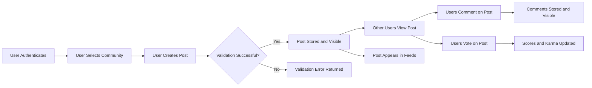

# Functional Requirements Specification – communityPlatform

## Overview

This document defines the complete functional requirements for the Reddit-like community platform referred to as **communityPlatform**. It focuses on what the system must do from a business and user behavior perspective so that backend developers can implement the system without ambiguity.

The scope includes:
- User registration, login, and authenticated interactions.
- Creation and management of communities.
- Creation, editing, and deletion of posts and comments (text, links, and images).
- Upvoting and downvoting of posts and comments.
- User karma system at a conceptual level.
- Subscription to communities and generation of personalized feeds.
- User profiles summarizing activity and reputation.
- Sorting of content by hot, new, top, and controversial.
- Reporting of inappropriate content and basic moderation hooks.

This document:
- Describes **business-level functional behavior only**.
- Does **not** define any API endpoints, data models, database schemas, or specific technologies.
- Uses **EARS (Easy Approach to Requirements Syntax)** for individual requirements, keeping `WHEN`, `WHILE`, `IF`, `THEN`, `WHERE`, `THE`, and `SHALL` in English while all descriptive text remains in en-US natural language.

## Terminology and Actors

### Key Terms

- **Community**: A user-created thematic group (similar to a subreddit) where members can post content and comments.
- **Post**: A content item within a community, which may be a text post, link post, or image-based post.
- **Comment**: A reply associated with a post or another comment, forming a nested threaded discussion.
- **Vote**: An upvote or downvote cast by a user on a post or comment.
- **Score**: The aggregated result of votes on a post or comment, expressed in business terms as the balance of upvotes and downvotes.
- **Karma**: A numeric representation of a user’s contribution reputation derived from votes received on their content.
- **Subscription**: A user’s decision to follow a community such that its posts appear in that user’s personalized feed.
- **Feed**: A list of posts presented to a user, based on subscriptions or a specific community, with selected sorting.
- **Profile**: A public-facing summary of a user’s activity and reputation within communityPlatform.
- **Report**: A user-submitted complaint indicating that a specific post, comment, user, or community may violate policies.

### User Actors

The following actors interact with communityPlatform.

- **guestUser**: Unauthenticated visitor who can browse public communities and posts, view comments, and perform basic searches but cannot create or interact with content beyond viewing and limited reporting if allowed by policy.
- **memberUser**: Registered authenticated user who can create and subscribe to communities, create and edit posts and comments, vote, report content, and manage their own profile and settings.
- **communityModerator**: Elevated member responsible for moderating one or more communities, with permissions to remove or lock content and manage community settings within their communities.
- **platformAdmin**: Platform-level administrator with full control over all communities and users, including enforcement of global policies and handling escalated abuse reports.

All requirements below must be interpreted in the context of these actors unless specified otherwise.

## Global Functional Requirements

### General Content Ownership and Timestamps

1. THE communityPlatform SHALL attribute each community, post, and comment to a single owning user for business ownership purposes.
2. THE communityPlatform SHALL record a creation time and a last-updated time for each community, post, and comment in a consistent time reference.
3. IF content is edited after creation, THEN THE communityPlatform SHALL mark the content as edited in a way that is distinguishable from never-edited content.
4. IF content is removed or hidden by its owner, moderator, or administrator, THEN THE communityPlatform SHALL ensure the content is no longer visible to general users while preserving sufficient internal information for audit and moderation purposes.

### Authentication and Authorization (High-Level Behavior)

5. WHEN a guestUser attempts to perform an action that requires authentication (such as creating a post, voting, or subscribing), THE communityPlatform SHALL reject the action and indicate that authentication is required.
6. THE communityPlatform SHALL enforce that only authenticated users (memberUser, communityModerator, platformAdmin) can create communities, posts, comments, votes, reports, and subscriptions.
7. THE communityPlatform SHALL enforce that only the owner of a piece of content, a relevant communityModerator, or a platformAdmin can perform privileged actions on that content such as deletion, locking, or modification of critical attributes, according to the permissions defined in this document.

## Community Management Requirements

This section defines the functional requirements for creation and management of communities.

### Community Creation

8. WHEN a memberUser submits a request to create a community, THE communityPlatform SHALL require a unique community identifier (name) that is not already in use.
9. THE communityPlatform SHALL treat the community identifier as case-insensitive for uniqueness comparisons while preserving the original casing for display.
10. THE communityPlatform SHALL require each community to have a human-readable title that may differ from the community identifier.
11. THE communityPlatform SHALL allow an optional textual description and optional community rules text to be stored with each community.
12. IF the submitted community identifier is shorter than a configured minimum length or longer than a configured maximum length, THEN THE communityPlatform SHALL reject the community creation request with a validation error.
13. IF the submitted community identifier contains disallowed characters (such as whitespace or characters outside an allowed set), THEN THE communityPlatform SHALL reject the community creation request with a validation error.
14. IF the submitted title or description exceeds configured maximum lengths, THEN THE communityPlatform SHALL reject the community creation request with a validation error.
15. WHEN a community is successfully created, THE communityPlatform SHALL assign the creating memberUser as at least one initial communityModerator for that community.

### Community Management and Updates

16. WHERE a user is a communityModerator for a given community, THE communityPlatform SHALL allow that user to update the community title, description, and rules text within configured length constraints.
17. IF a community update request attempts to change immutable attributes such as the community identifier, THEN THE communityPlatform SHALL reject the update.
18. WHERE a user is a communityModerator or platformAdmin, THE communityPlatform SHALL allow that user to mark a community as active or archived at the business level.
19. WHILE a community is archived, THE communityPlatform SHALL prevent creation of new posts in that community while still allowing access to existing public content unless otherwise restricted by moderation rules.
20. IF a community is archived, THEN THE communityPlatform SHALL ensure that subscription and feed generation behave consistently by treating the community as non-postable but still browseable.

### Community Visibility and Access

21. THE communityPlatform SHALL support communities that are visible to all users (public communities) as the default behavior.
22. WHERE community-level visibility policies exist, THE communityPlatform SHALL follow those policies to determine whether guestUser or certain memberUser actors can view the community and its content.
23. IF a community is globally removed or suspended by a platformAdmin due to policy violation, THEN THE communityPlatform SHALL prevent new content creation and general browsing for that community while retaining information necessary for moderation and auditing.

## Post and Comment Requirements

This section covers the lifecycle and validation of posts and comments.

### Post Types and Fields

24. THE communityPlatform SHALL support at least three post types: text post, link post, and image-based post.
25. WHEN a memberUser creates a text post, THE communityPlatform SHALL require a title and a text body within configured minimum and maximum length constraints.
26. WHEN a memberUser creates a link post, THE communityPlatform SHALL require a title and a target URL.
27. IF a link post’s URL does not conform to a valid URL format or uses a disallowed scheme according to platform policy, THEN THE communityPlatform SHALL reject the post creation request.
28. WHEN a memberUser creates an image-based post, THE communityPlatform SHALL require a title and at least one reference to an image asset while optionally allowing an additional text body.
29. IF any post body or title exceeds configured maximum length limits, THEN THE communityPlatform SHALL reject the post creation request.
30. THE communityPlatform SHALL associate each post with exactly one community.
31. THE communityPlatform SHALL ensure that a post’s type (text, link, image-based) is stored in a way that allows behavior such as rendering and validations to depend on type.

### Post Creation and Permissions

32. WHEN a memberUser submits a post creation request, THE communityPlatform SHALL verify that the target community exists and is not archived or otherwise restricted from posting.
33. IF the target community is archived or restricted from posting, THEN THE communityPlatform SHALL reject the post creation request.
34. WHERE a user is banned or restricted from a specific community based on moderation rules, THE communityPlatform SHALL prevent that user from creating posts in that community.
35. THE communityPlatform SHALL allow communityModerator and platformAdmin actors to create posts in communities they manage or oversee subject to the same validation rules as memberUser.

### Post Editing and Deletion

36. WHERE a user is the owner of a post, THE communityPlatform SHALL allow that user to edit the post’s title and body within configured time and policy constraints.
37. WHERE a user is the owner of a post, THE communityPlatform SHALL allow that user to delete their post, which from a business perspective means that the post is no longer visible in standard feeds and listings.
38. IF a post is edited, THEN THE communityPlatform SHALL update the last-updated time and mark the post as edited.
39. IF a post is deleted by its owner, communityModerator, or platformAdmin, THEN THE communityPlatform SHALL ensure that the post no longer appears in standard queries for visible posts.
40. WHERE post deletion occurs for policy enforcement reasons, THE communityPlatform SHALL preserve the association between the post and its owner for audit purposes.

### Post Locking and State

41. WHERE a user is a communityModerator or platformAdmin for a community, THE communityPlatform SHALL allow that user to lock a post to prevent new comments and votes while preserving existing content.
42. WHILE a post is locked, THE communityPlatform SHALL prevent creation of new comments on that post.
43. WHILE a post is locked, THE communityPlatform SHALL prevent new votes on that post where platform policy requires votes to be frozen.
44. WHEN a post is unlocked by an authorized moderator or administrator, THE communityPlatform SHALL restore the ability to create comments and votes according to normal rules.

### Comment Structure and Creation

45. THE communityPlatform SHALL allow comments to be associated with either a post (top-level comments) or another comment (nested replies).
46. THE communityPlatform SHALL support multiple levels of nesting for comments up to a configured maximum depth.
47. WHEN a memberUser creates a comment, THE communityPlatform SHALL require a non-empty text body within configured length limits.
48. IF a comment body exceeds the configured maximum length, THEN THE communityPlatform SHALL reject the comment creation request.
49. IF a comment is submitted for a post or parent comment that does not exist or is not visible to the commenting user, THEN THE communityPlatform SHALL reject the comment creation request.
50. WHERE a post is locked, THE communityPlatform SHALL prevent the creation of new comments even if the user otherwise has permission to comment.

### Comment Editing and Deletion

51. WHERE a user is the owner of a comment, THE communityPlatform SHALL allow that user to edit the comment body within configured time and policy constraints.
52. IF a comment is edited, THEN THE communityPlatform SHALL update the last-updated time and mark the comment as edited.
53. WHERE a user is the owner of a comment, THE communityPlatform SHALL allow that user to delete their comment, which from a business perspective removes the content from standard views while optionally indicating that a comment was removed.
54. WHERE a communityModerator or platformAdmin removes a comment for moderation reasons, THE communityPlatform SHALL ensure that the comment is removed from standard views and that internal audit information remains available.

### Comment Locking and State

55. WHERE a user is a communityModerator or platformAdmin, THE communityPlatform SHALL allow that user to lock a comment thread to prevent further replies under that comment.
56. WHILE a comment thread is locked, THE communityPlatform SHALL prevent creation of new replies under that locked comment.

## Voting and Karma Requirements (Functional Overview)

Detailed numeric rules are defined in the dedicated voting and karma requirements document. This section captures core functional behavior needed for implementation context.

### Voting on Posts and Comments

57. THE communityPlatform SHALL allow authenticated users (memberUser, communityModerator, platformAdmin) to cast an upvote or downvote on posts.
58. THE communityPlatform SHALL allow authenticated users to cast an upvote or downvote on comments.
59. WHERE a user has already cast a vote on a post or comment, THE communityPlatform SHALL allow that user to change the vote from upvote to downvote or from downvote to upvote.
60. WHERE a user has already cast a vote on a post or comment, THE communityPlatform SHALL allow that user to remove their vote entirely, resulting in no vote for that content item from that user.
61. IF a guestUser attempts to cast or modify a vote, THEN THE communityPlatform SHALL reject the action and indicate that authentication is required.
62. IF a user is banned or restricted from a specific community, THEN THE communityPlatform SHALL prevent that user from casting votes on posts and comments in that community.
63. IF a post or comment has been removed or is no longer visible due to moderation or deletion, THEN THE communityPlatform SHALL reject new voting actions targeting that content.

### Score and Karma Impact (Conceptual)

64. THE communityPlatform SHALL maintain a conceptual score for each post and comment that is derived from the total votes associated with that content.
65. THE communityPlatform SHALL maintain a conceptual karma total for each user that is derived from the aggregate voting outcomes on content owned by that user.
66. WHEN a vote on a post or comment is created, changed, or removed, THE communityPlatform SHALL update the associated content score and the owning user’s karma according to business rules defined consistently with the dedicated voting and karma specification.
67. IF voting is reversed or removed, THEN THE communityPlatform SHALL adjust the affected user’s karma in the opposite or neutral direction according to the business rules.

## Subscription and Feed Requirements

This section defines how users subscribe to communities and how feeds are conceptually constructed.

### Community Subscription Lifecycle

68. WHEN a memberUser chooses to subscribe to a community, THE communityPlatform SHALL create or activate a subscription relationship between that user and the community.
69. IF a memberUser attempts to subscribe to a community that does not exist or is not visible to that user, THEN THE communityPlatform SHALL reject the subscription request.
70. WHERE a subscription relationship exists between a user and a community, THE communityPlatform SHALL treat that community as part of the user’s personalized feed scope.
71. WHEN a memberUser chooses to unsubscribe from a community, THE communityPlatform SHALL deactivate or remove that subscription relationship so that future personalized feeds no longer include posts from that community.
72. WHERE a user re-subscribes to a previously unsubscribed community, THE communityPlatform SHALL treat the renewed subscription as active without preserving any obligation to include older posts outside the defined feed rules.

### Personalized Feed Construction (Conceptual)

73. THE communityPlatform SHALL provide a personalized feed for each authenticated user that includes posts from communities to which the user is subscribed, subject to visibility, moderation, and sorting rules.
74. THE communityPlatform SHALL allow a user to view a community-specific feed that contains posts from a single specified community regardless of the user’s subscription status, as long as the community is visible to that user.
75. WHERE a user has no active subscriptions, THE communityPlatform SHALL handle the personalized feed request by returning an empty feed or a feed based on a default policy such as popular or recommended communities as defined by business strategy.
76. IF a community is archived or removed, THEN THE communityPlatform SHALL exclude new posts from that community from future personalized feeds while handling existing posts according to moderation and archival rules.
77. WHILE a user is banned or restricted from a community, THE communityPlatform SHALL exclude that community’s posts from the user’s personalized feed even if a subscription relationship exists.

## User Profile Requirements

Profiles provide a summary of a user’s activity and reputation.

### Profile Content and Visibility

78. THE communityPlatform SHALL provide a profile for each registered user that includes at minimum a unique username, a join date, and high-level karma information.
79. THE communityPlatform SHALL allow users to optionally add or update profile attributes such as display name, short biography text, and an avatar reference subject to length and format constraints.
80. IF a profile biography or display name exceeds configured length limits, THEN THE communityPlatform SHALL reject the profile update.
81. THE communityPlatform SHALL distinguish between information visible to anyone (public profile information) and information visible only to the profile owner (such as account management settings) according to privacy policy.

### Profile Activity Listings

82. THE communityPlatform SHALL allow viewing of a user’s public posts from their profile, subject to community visibility and moderation rules.
83. THE communityPlatform SHALL allow viewing of a user’s public comments from their profile, subject to community visibility and moderation rules.
84. THE communityPlatform SHALL present the user’s karma summary on the profile in a way consistent with the conceptual karma definition.
85. WHERE policy allows, THE communityPlatform SHALL allow a user to view a list of communities they moderate or have created from their own profile view.

### Profile Editing and Restrictions

86. WHERE a user is the owner of a profile, THE communityPlatform SHALL allow that user to update their display name, biography, and avatar reference within configured constraints.
87. IF a username change is restricted by policy (for example, only allowed under certain conditions), THEN THE communityPlatform SHALL enforce that policy and reject disallowed username change attempts.
88. IF a user account is suspended or deleted according to platform policies, THEN THE communityPlatform SHALL restrict access to that user’s profile and content views according to rules defined in moderation and safety documents.

## Sorting and Ranking Requirements

Sorting and ranking are used when presenting lists of posts (and in some cases comments) in feeds or community views.

### Supported Sorting Modes

89. THE communityPlatform SHALL support at least the following sorting modes for posts in feeds and community listings: "new", "top", "hot", and "controversial".
90. WHERE comments are presented as a list under a post (e.g., top-level comments), THE communityPlatform SHALL support at least a default sorting mode and may also support the same named modes where business rules require.

### New Sorting

91. WHEN posts are requested with "new" sorting, THE communityPlatform SHALL order posts strictly by creation time in reverse chronological order from newest to oldest, subject to visibility and filtering rules.
92. WHERE multiple posts share the same creation time at the used precision, THE communityPlatform SHALL apply a deterministic secondary ordering such as by identifier to ensure stable ordering.

### Top Sorting

93. WHEN posts are requested with "top" sorting, THE communityPlatform SHALL order posts primarily by their score, where higher scores appear before lower scores.
94. WHERE posts share the same score in "top" sorting, THE communityPlatform SHALL apply a deterministic secondary ordering based on creation time or another consistent attribute.
95. WHERE a time range filter (such as "today" or "this week") is applicable in business policy, THE communityPlatform SHALL restrict the set of posts considered in "top" sorting to that time range.

### Hot Sorting

96. WHEN posts are requested with "hot" sorting, THE communityPlatform SHALL order posts according to a business-defined ranking that balances recency and score to favor recently popular posts.
97. THE communityPlatform SHALL ensure that in "hot" sorting significantly older posts with similar scores to newer posts are typically ranked lower than those newer posts.
98. WHERE "hot" sorting is applied to community or personalized feeds, THE communityPlatform SHALL apply the same business rules consistently across contexts.

### Controversial Sorting

99. WHEN posts are requested with "controversial" sorting, THE communityPlatform SHALL prioritize posts where upvotes and downvotes are both relatively high and close to each other according to business-defined thresholds.
100. THE communityPlatform SHALL de-emphasize posts with very low total voting activity in "controversial" sorting even if the ratio of upvotes to downvotes is balanced.

## Reporting and Basic Moderation Hooks

This section focuses on the functional aspects of reporting inappropriate content. Detailed moderation workflows are defined in the dedicated content and moderation documents.

### Reportable Entities

101. THE communityPlatform SHALL allow authenticated users to report posts for potential violations of community or platform policies.
102. THE communityPlatform SHALL allow authenticated users to report comments for potential violations of community or platform policies.
103. WHERE business policy requires, THE communityPlatform SHALL allow authenticated users to report communities or user profiles for policy violations.

### Report Submission

104. WHEN a user submits a report, THE communityPlatform SHALL require identification of the target entity (post, comment, community, or user) in a way that uniquely identifies that entity.
105. THE communityPlatform SHALL require a report reason selected from a set of allowed categories defined by business policy.
106. THE communityPlatform SHALL allow an optional free-text description to be included in a report, subject to maximum length constraints.
107. IF the free-text description in a report exceeds the configured maximum length, THEN THE communityPlatform SHALL reject the report submission.
108. IF a report references a target entity that does not exist or is not visible to the reporting user, THEN THE communityPlatform SHALL reject the report submission.

### Report Handling (High-Level Behavior)

109. WHEN a report is successfully submitted, THE communityPlatform SHALL record the reporting user, the target entity, the reason, and any additional description along with a creation time.
110. THE communityPlatform SHALL make newly created reports visible to appropriate communityModerators for community-level issues and to platformAdmin for platform-level issues according to business routing rules.
111. WHERE a user repeatedly submits reports that are determined to be abusive or in bad faith, THE communityPlatform SHALL allow platformAdmin to restrict or revoke that user’s ability to submit further reports.

## Performance-Related Functional Expectations (Business-Level)

These requirements describe performance expectations from the user perspective, not infrastructure design.

112. WHEN a user submits login credentials, THE communityPlatform SHALL validate the credentials and respond with success or failure feedback within a few seconds under normal operating conditions.
113. WHEN a user submits a new post or comment that passes validation, THE communityPlatform SHALL make the new content available in the relevant community or post view within a few seconds under normal operating conditions.
114. WHEN a user casts or changes a vote on a post or comment, THE communityPlatform SHALL update the visible score for that content within a few seconds under normal operating conditions.
115. WHEN a user requests their personalized feed or a community feed, THE communityPlatform SHALL return the requested list of posts within a few seconds under normal operating conditions.
116. WHEN a user views a profile, THE communityPlatform SHALL present the profile data and a summary of recent activity within a few seconds under normal operating conditions.

## Assumptions and Out-of-Scope Items

117. THE communityPlatform SHALL assume that image assets referenced in image-based posts are provided and managed by an underlying image handling solution, which is outside the scope of this functional document.
118. THE communityPlatform SHALL assume that internationalization, localization, and timezone display preferences are handled consistently by shared platform mechanisms and are outside the detailed scope of this document.
119. WHERE regulatory or legal compliance (such as specific regional data protection rules) is required, THE communityPlatform SHALL follow those rules as defined in higher-level policy documents that are outside the scope of this functional document.

## Example High-Level Flow Diagram

The following Mermaid diagram illustrates a simplified high-level flow of creating a post and subsequent interactions.

## Implementation Autonomy Statement

THE communityPlatform SHALL treat all requirements in this document as **business requirements only**, leaving all technical implementation decisions (including system architecture, APIs, database design, storage strategies, and infrastructure) to the discretion and expertise of the development team. Developers are responsible for choosing how best to implement these behaviors while ensuring that all specified functional outcomes and constraints are satisfied.