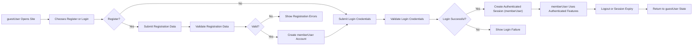
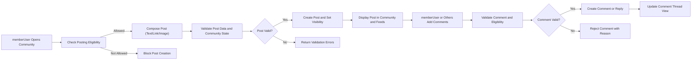
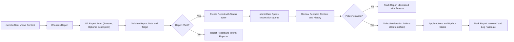

# User Scenarios and Flows for communityPlatform

## User Actors Overview

### guestUser

guestUser is an unauthenticated visitor.
- Can browse public communities and posts.
- Can view comments and user profiles with limited detail.
- Can search and sort public content.
- Cannot create communities, posts, or comments.
- Cannot vote, subscribe, or report content.

### memberUser

memberUser is an authenticated, registered user.
- Can register, log in, and manage an account.
- Can create and manage own communities where allowed by business rules.
- Can create and edit own posts (text, link, image) and comments within constraints.
- Can upvote and downvote posts and comments.
- Can subscribe to communities and see personalized feeds.
- Can view and manage a profile, including posts, comments, and karma.
- Can report inappropriate content.

### adminUser

adminUser is a platform administrator.
- Can review reported content.
- Can take moderation actions on content (hide, remove, lock, or restrict).
- Can apply account-level actions on users where business rules allow.
- Can view necessary information for policy enforcement.

## Primary User Journeys

### Journey A: Registration, Login, and Session Lifecycle

#### Narrative

A prospective participant starts as guestUser, decides to join, registers an account, optionally verifies contact details, logs in as memberUser, uses authenticated features, and eventually logs out or has the session expire.

#### Flow Steps

1. guestUser visits communityPlatform.
2. guestUser decides to participate and chooses registration.
3. guestUser fills required registration fields (such as username, contact detail, and password-equivalent secret).
4. system validates registration data for format, uniqueness, and policy compliance.
5. If registration succeeds, system creates a memberUser account.
6. Where verification is required, system sends a verification challenge and limits account capabilities until verification is complete.
7. memberUser submits login credentials.
8. system validates credentials and, on success, creates an authenticated session bound to the memberUser.
9. memberUser performs authenticated actions until session expiration or explicit logout.
10. memberUser may choose to log out from current device or from all devices.

#### EARS Requirements

- WHEN guestUser submits registration data, THE communityPlatform SHALL validate required fields against business rules including uniqueness, minimum length, and prohibited patterns.
- WHEN registration data passes all validations, THE communityPlatform SHALL create a new memberUser account and mark the initial account state according to verification policy.
- IF registration data fails any validation, THEN THE communityPlatform SHALL reject the registration attempt and SHALL identify each invalid field category in business terms.
- WHERE contact verification is required, THE communityPlatform SHALL restrict the new memberUser from performing actions that require a verified identity until verification succeeds.
- WHEN memberUser submits valid login credentials, THE communityPlatform SHALL create an authenticated session and SHALL treat this actor as memberUser for the duration of the session.
- IF login credentials are invalid or the account is restricted, THEN THE communityPlatform SHALL deny login and SHALL not reveal which specific credential failed beyond allowed business messaging.
- WHILE a memberUser session is active and not expired, THE communityPlatform SHALL apply memberUser permissions to actions initiated under that session.
- WHEN memberUser requests logout, THE communityPlatform SHALL terminate the associated session so that subsequent requests from that context are treated as guestUser.
- WHEN memberUser requests logout from all devices, THE communityPlatform SHALL invalidate all active sessions for that account within a short and predictable time window.
- IF an account is disabled or banned while a session is active, THEN THE communityPlatform SHALL deny further restricted actions within that session starting from the time of restriction.

### Journey B: Discovering and Subscribing to Communities

#### Narrative

Both guestUser and memberUser browse communities to find topics of interest. Only memberUser can subscribe so that posts from these communities appear in personalized feeds.

#### Flow Steps

1. Actor opens a communities discovery view (such as trending, categories, or search results).
2. system displays a list of communities with key metadata (name, description snippet, subscriber count, activity indicator).
3. Actor applies search, filter, or sort (for example by popularity or recency).
4. Actor selects a specific community to inspect.
5. system shows community details and recent posts visible to that actor.
6. If actor is memberUser, system shows whether actor is currently subscribed.
7. memberUser chooses to subscribe or unsubscribe.
8. system updates subscription state and future feeds.

#### EARS Requirements

- WHEN any actor requests community discovery, THE communityPlatform SHALL return a list of communities that the actor is permitted to view, including key descriptive attributes.
- WHEN an actor applies filters or sorting to community discovery, THE communityPlatform SHALL apply the requested filters and sort mode within supported options and SHALL return the filtered, ordered list.
- WHEN an actor opens a specific community, THE communityPlatform SHALL present core community information and recent posts that are visible according to community and actor rules.
- WHEN memberUser views a community, THE communityPlatform SHALL indicate whether that memberUser is currently subscribed to that community.
- WHEN memberUser requests to subscribe to a community open for subscription, THE communityPlatform SHALL create or confirm a subscription relation between that memberUser and that community.
- WHEN memberUser requests to unsubscribe, THE communityPlatform SHALL remove or deactivate the subscription relation so that new posts from that community no longer appear in the memberUser subscription-based feed.
- IF guestUser attempts to subscribe or unsubscribe to a community, THEN THE communityPlatform SHALL reject the operation and SHALL indicate that authentication is required.
- WHERE community access is restricted or closed, THE communityPlatform SHALL enforce additional rules for subscription and SHALL reject or queue subscription requests according to community configuration.

### Journey C: Creating Posts in Communities

#### Narrative

memberUser participates by creating posts in communities. Posts may be text, link, or image based, depending on community and platform policy.

#### Flow Steps

1. memberUser navigates to a community where posting is allowed.
2. system checks that memberUser has permission to post (status, community rules, rate limits).
3. memberUser selects post type (text, link, or image) from allowed types.
4. memberUser enters title and content (body text, URL, or image reference) and submits.
5. system validates community existence, permissions, and content rules.
6. If valid, system creates the post with initial visibility state (immediate or pending review).
7. system includes the post in relevant feeds and community listings according to its visibility and sorting rules.

#### EARS Requirements

- WHEN memberUser initiates post creation in a community, THE communityPlatform SHALL verify that the community exists, is not archived or banned, and allows posting by that memberUser.
- WHEN memberUser selects a post type, THE communityPlatform SHALL present required fields specific to that type and SHALL not accept a submission that omits mandatory fields.
- WHEN memberUser submits a post, THE communityPlatform SHALL validate the title, content, and any URL or media references against length, format, and policy rules.
- IF a post submission violates any validation rule, THEN THE communityPlatform SHALL reject the post creation and SHALL identify the categories of violation such as length, format, or prohibited content.
- WHERE community policy requires pre-moderation, THE communityPlatform SHALL mark newly created posts as not publicly visible until an adminUser or designated moderator approves them.
- WHERE community policy allows immediate publication, THE communityPlatform SHALL make the newly created post visible to permitted actors as soon as the creation succeeds.
- WHEN a post is successfully created, THE communityPlatform SHALL associate it with the author, target community, timestamps, and SHALL initialize its score and vote state according to the voting rules.

### Journey D: Commenting and Nested Replies

#### Narrative

memberUser builds discussions by commenting on posts and replying to existing comments. guestUser can read these discussions, but cannot contribute.

#### Flow Steps

1. Actor opens a post detail view.
2. system retrieves and shows the post and visible comments ordered according to chosen comment sorting mode.
3. memberUser decides to add a top-level comment or reply to a specific comment.
4. memberUser enters comment text and submits.
5. system validates comment text, permissions, and post state (open, locked, deleted).
6. If valid, system creates the comment, linking it to the post and, where relevant, to a parent comment.
7. system returns updated comment thread including the new comment.

#### EARS Requirements

- WHEN memberUser views a post, THE communityPlatform SHALL allow that memberUser to submit a comment on the post if the post and community accept new comments.
- WHERE nested replies are enabled, THE communityPlatform SHALL allow memberUser to reply to existing comments by designating a parent comment.
- WHEN memberUser submits a comment, THE communityPlatform SHALL validate that the comment text is within allowed length bounds and complies with content policies.
- IF comment submission violates validation rules or the post is locked or removed, THEN THE communityPlatform SHALL reject the comment and SHALL indicate why the comment cannot be accepted.
- WHEN a comment is successfully created, THE communityPlatform SHALL associate it with the author, post, optional parent comment, timestamps, and SHALL initialize its score and vote state.
- WHILE a comment remains visible, THE communityPlatform SHALL include it in the comment thread view for that post according to selected sort and pagination rules.
- IF guestUser attempts to submit a comment or reply, THEN THE communityPlatform SHALL reject the action and SHALL require authentication as memberUser.

### Journey E: Voting and Karma Interaction

#### Narrative

Voting on posts and comments drives visibility and user reputation. memberUser can upvote or downvote; guestUser can see resulting scores.

#### Flow Steps

1. Actor views a feed, community, or post with visible vote scores.
2. memberUser chooses to upvote, downvote, or clear a vote on a post or comment.
3. system checks that the user is eligible to vote (role, ownership, restrictions, rate limits).
4. system records the new vote state, adjusting content score and owner karma.
5. system reflects updated score in subsequent views and includes changed ranking in feeds.

#### EARS Requirements

- WHEN memberUser attempts to vote on a post or comment, THE communityPlatform SHALL verify that the content exists, is visible, and is eligible for voting.
- WHERE self-voting is disallowed, THE communityPlatform SHALL prevent a memberUser from voting on own posts or comments and SHALL indicate that self-voting is not allowed.
- WHEN memberUser casts a first-time vote on content, THE communityPlatform SHALL store that vote as either upvote or downvote and SHALL update the content score and owner karma according to configured rules.
- WHEN memberUser changes an existing vote, THE communityPlatform SHALL update the recorded vote, adjust content score accordingly, and SHALL adjust owner karma by reversing the prior impact and applying the new impact.
- WHEN memberUser removes an existing vote, THE communityPlatform SHALL remove the vote record and SHALL update score and karma to reflect no vote from that user on that content.
- IF guestUser attempts to vote, THEN THE communityPlatform SHALL reject the action and SHALL signal that voting is available only to authenticated memberUser.
- WHILE votes change over time, THE communityPlatform SHALL recalculate or adjust scores used for sorting modes such as top, hot, and controversial.

## Secondary Journeys

### Journey F: Browsing and Sorting Feeds

#### Narrative

Users navigate content through feeds: community-specific feeds, personalized feeds for memberUser, and global or discovery-oriented feeds. Sorting modes hot, new, top, and controversial give different perspectives.

#### Flow Steps

1. Actor selects a feed context: specific community, personalized home feed, or global feed.
2. Actor chooses a sorting mode among supported options.
3. system determines eligible posts for that feed based on actor permissions and community visibility.
4. system applies sorting rules for the selected mode.
5. system returns a page of posts with metadata and pagination information.
6. Actor may request additional pages; system returns subsequent slices.

#### EARS Requirements

- THE communityPlatform SHALL provide feed views for at least community-specific feeds, a personalized feed for memberUser, and a global or discovery feed for guestUser and memberUser.
- WHEN an actor requests a feed, THE communityPlatform SHALL compute the set of posts visible to that actor based on community visibility, moderation state, and content status.
- WHEN an actor selects sorting mode new, THE communityPlatform SHALL order posts primarily by creation time descending.
- WHEN an actor selects sorting mode top, THE communityPlatform SHALL order posts primarily by score descending, optionally within a configured time range.
- WHEN an actor selects sorting mode hot, THE communityPlatform SHALL apply a time-weighted function of score and age so that recent popular posts appear before older content.
- WHEN an actor selects sorting mode controversial, THE communityPlatform SHALL favor posts with high volumes of both upvotes and downvotes, subject to minimum vote thresholds.
- IF an actor requests an unsupported sort mode, THEN THE communityPlatform SHALL either reject the request with an error or fall back to a default sort mode and SHALL indicate the effective mode.
- WHEN pagination is applied, THE communityPlatform SHALL return posts in consistent order per sorting mode and SHALL support navigation to additional pages without duplicates or gaps, except where real-time content changes logically affect ordering.

### Journey G: Viewing User Profiles and Activity

#### Narrative

Profiles let any actor see a memberUser’s public identity and activity; the owner has extended management capabilities. Profiles show karma and recent posts and comments.

#### Flow Steps

1. Actor selects a memberUser profile (own or another user’s) via link or search.
2. system checks that the profile is viewable (not fully removed and consistent with privacy and moderation rules).
3. system retrieves public profile attributes and recent visible posts and comments.
4. system displays profile summary, including karma and basic activity indicators.
5. If actor is the profile owner and the account is not restricted, system offers profile edit actions.

#### EARS Requirements

- WHEN any actor requests a profile view for a valid memberUser, THE communityPlatform SHALL present public profile attributes such as username, karma, account age indicator, and recent visible activity.
- WHERE the requesting actor is the profile owner, THE communityPlatform SHALL also present self-management options such as editing bio and preferences, subject to restrictions.
- IF a requested profile belongs to an account that is banned or deactivated, THEN THE communityPlatform SHALL display the account state according to policy and SHALL restrict edit options for that account.
- IF a requested profile does not exist or has been fully removed, THEN THE communityPlatform SHALL respond that the profile is unavailable.
- WHEN profile activity is shown, THE communityPlatform SHALL include only posts and comments that are visible to the requesting actor according to community and moderation rules.
- IF an actor without appropriate permissions attempts to edit another user’s profile, THEN THE communityPlatform SHALL reject the attempt and SHALL indicate insufficient permissions.

### Journey H: Handling Basic Edge Cases in User Journeys

#### Narrative

Edge cases arise when content or account states change while users are interacting with the system, or when operations reach validation or rate limits.

#### EARS Requirements

- IF guestUser attempts to perform actions reserved for memberUser such as posting, commenting, voting, subscribing, or reporting, THEN THE communityPlatform SHALL deny these actions and SHALL require authentication.
- IF memberUser attempts to interact with content that has been deleted, removed, or hidden for that actor, THEN THE communityPlatform SHALL reject the interaction and SHALL indicate that the content is unavailable.
- IF memberUser attempts to post or comment in an archived, locked, or banned community, THEN THE communityPlatform SHALL reject the operation and SHALL indicate that the community is not accepting new content.
- IF a post is deleted or locked while memberUser is composing an interaction (such as a comment or vote), THEN THE communityPlatform SHALL reject the submission and SHALL inform the memberUser that the target content changed state.
- WHERE rate limits apply to posting, commenting, voting, reporting, or other actions, THE communityPlatform SHALL enforce these limits and SHALL reject actions exceeding limits with a generic indication that the action is temporarily limited.

## Admin and Moderation Journeys

### Journey I: Member Reporting Inappropriate Content

#### Narrative

memberUser helps keep communityPlatform safe by reporting content they believe violates rules. Reports feed into moderation workflows handled by adminUser.

#### Flow Steps

1. memberUser encounters content (post or comment) that appears inappropriate.
2. memberUser selects the report action associated with that content.
3. system displays a report form with predefined reasons and optional description.
4. memberUser selects a reason and submits the report.
5. system validates the report (required fields, no duplicate spam, target exists).
6. If valid, system records the report as open and associates it with content, reporter, and community.
7. system makes the report available to adminUser in moderation queues.

#### EARS Requirements

- WHEN memberUser chooses to report a post or comment, THE communityPlatform SHALL present a reporting interface that captures at least a reason category and links the report to the specific content.
- WHEN memberUser submits a report, THE communityPlatform SHALL validate that the target content exists, is visible to the reporter, and is eligible for reporting.
- WHEN report data passes validation, THE communityPlatform SHALL create a report record with status open and SHALL store reporter, target, reason, and timestamps.
- IF report submission fails validation or the target is no longer available, THEN THE communityPlatform SHALL reject the report and SHALL indicate that the report cannot be created for that target.
- WHERE rate limits or abuse rules apply to reporting, THE communityPlatform SHALL enforce those rules and SHALL block excessive or abusive reporting attempts.

### Journey J: Admin Review and Moderation Actions

#### Narrative

adminUser reviews reports and takes appropriate moderation actions on content and accounts to enforce platform policies.

#### Flow Steps

1. adminUser opens the moderation area.
2. system shows a prioritized queue of open reports, possibly grouped by severity or type.
3. adminUser selects a report to review.
4. system displays reported content, history of reports for that content or user, and any prior actions.
5. adminUser evaluates whether the content or behavior violates policy.
6. adminUser chooses an action, such as dismissing the report, hiding or removing content, locking threads, or applying user-level restrictions (warning, temporary or permanent ban).
7. system applies chosen actions and updates content visibility and user capabilities.
8. system updates the report’s status to resolved or dismissed and records rationale.

#### EARS Requirements

- WHEN adminUser views the moderation queue, THE communityPlatform SHALL present reports ordered according to business-defined prioritization rules.
- WHEN adminUser opens a specific report, THE communityPlatform SHALL display the reported content, context, and any prior related reports or actions.
- WHEN adminUser decides that no policy violation occurred, THE communityPlatform SHALL allow the adminUser to mark the report as dismissed with an associated category such as no violation or duplicate.
- WHEN adminUser decides that content violates policy, THE communityPlatform SHALL allow the adminUser to hide, remove, or lock the content and SHALL update content state consistently across all user-facing flows.
- WHEN adminUser applies account-level actions such as warnings, temporary restrictions, or bans, THE communityPlatform SHALL update the memberUser’s status and SHALL enforce these restrictions in subsequent operations.
- WHEN a report is resolved with one or more actions, THE communityPlatform SHALL update the report status to resolved and SHALL record the actions taken and their rationale.

## Consolidated Sequences for Backend Design

### Registration and Login Sequence (Journey A)

1. guestUser chooses registration.
2. system collects registration data.
3. system validates input and either rejects with reasons or creates memberUser.
4. system optionally enforces verification before granting full capabilities.
5. memberUser submits login credentials.
6. system validates and creates a session or rejects the login.
7. memberUser performs actions under that session until logout or expiry.
8. system invalidates session on logout or restriction changes.

### Post Creation Sequence (Journey C)

1. memberUser opens a community.
2. system verifies posting eligibility and allowed post types.
3. memberUser composes post and submits.
4. system validates content and community.
5. system either rejects with validation feedback or creates the post.
6. system sets visibility state and updates feeds.

### Commenting Sequence (Journey D)

1. memberUser opens a post.
2. system displays existing comments.
3. memberUser composes a comment or reply.
4. system validates comment and eligibility.
5. system either rejects or creates the comment.
6. system updates comment thread views.

### Voting Sequence (Journey E)

1. memberUser views content.
2. memberUser chooses vote action.
3. system verifies eligibility and content existence.
4. system stores or updates vote.
5. system adjusts scores and karma.

### Reporting and Moderation Sequence (Journeys I and J)

1. memberUser submits a report against content.
2. system validates and stores the report as open.
3. system exposes report in adminUser’s moderation queue.
4. adminUser reviews reported content and context.
5. adminUser chooses moderation actions.
6. system applies actions to content and accounts.
7. system updates report status and logs decisions.

## Mermaid Diagrams for Key Flows

### Registration and Login Flow

### Post Creation and Commenting Flow

### Reporting and Moderation Flow

## Cross-Journey Considerations

### State Changes Affecting Journeys

- WHILE content or account state changes due to moderation or user actions, THE communityPlatform SHALL ensure that all ongoing and future flows reflect the updated state (for example, removed posts no longer appear in feeds, banned users cannot post).
- WHEN a single action affects multiple flows (such as community archiving affecting posting, commenting, and subscriptions), THE communityPlatform SHALL apply consistent rules across all affected journeys.

### Transitions Between Anonymous and Authenticated Flows

- WHEN guestUser becomes memberUser through successful registration and login, THE communityPlatform SHALL allow seamless continuation into community browsing, posting, commenting, and voting flows without re-collecting already valid information.
- WHEN memberUser logs out, THE communityPlatform SHALL revert to guestUser capabilities for the same browsing flows, removing access to authenticated-only actions while preserving the ability to view public content.

## Non-functional Expectations within Flows

- WHEN users perform key actions in these journeys under normal load, THE communityPlatform SHALL provide outcomes (success or failure) within a few seconds so interactions feel responsive.
- IF internal errors prevent completion of an action in a journey, THEN THE communityPlatform SHALL avoid partial side effects and SHALL clearly signal that the action did not complete, allowing users to retry later.
- WHILE implementing these flows, THE communityPlatform SHALL favor predictable behavior and clear requirement alignment over hidden side effects so developers can reason about state transitions reliably.