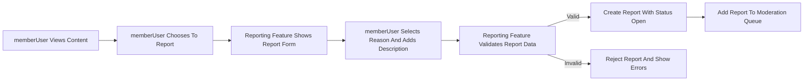
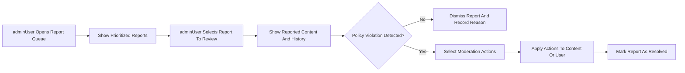

# Reddit-like Community Platform – Content Moderation and Reporting Requirements

## 1. Introduction and Scope

This specification defines the business requirements for content moderation, reporting of inappropriate content, and abuse handling in the **communityPlatform** Reddit-like community service.

The scope covers:
- Reporting of posts, comments, communities, and users for inappropriate behavior.
- Moderation workflows from report creation through review and resolution.
- Administrative actions on content, communities, and user accounts.
- Optional appeals and reversals of moderation decisions.
- Abuse prevention, rate limiting, and audit expectations related to reporting and moderation.
- Business-level error handling and performance expectations for these domains.

Out of scope:
- API endpoint definitions, request/response payloads, or protocols.
- Database schemas, indexing strategies, or storage technologies.
- Frontend layouts, UI widgets, or interaction-level design.

All applicable requirements use EARS (Easy Approach to Requirements Syntax) with English keywords (WHEN, WHILE, IF, THEN, WHERE, THE, SHALL) and en-US business language.

## 2. Terminology and Core Concepts

### 2.1 Key Concepts

- **Content**: Any user-generated material, including posts and comments.
- **Post**: A primary piece of content in a community, which may contain text, a link, or an image.
- **Comment**: A response to a post or another comment, forming nested discussion threads.
- **Community**: A user-created thematic space (similar to a subreddit) where posts and comments belong.
- **Reporter**: A user (memberUser or adminUser) who submits a report about inappropriate content or behavior.
- **Reported Object**: The specific content or entity that is being reported. This includes posts, comments, communities, or user accounts.
- **Report**: A record indicating that a reporter believes a reported object is inappropriate, including a primary reason and optional free-text context.
- **Moderation Action**: Any change performed as a result of a report or proactive review, such as hiding or removing content, locking threads, warning users, or restricting accounts or communities.
- **Abuse of Reporting**: Repeated or malicious use of the reporting feature to harass users, flood the system, or otherwise degrade the platform.
- **Abuse of Moderation**: Improper use of moderation capabilities by admins that leads to biased, inconsistent, or unjustified actions.

### 2.2 Actors

- **guestUser**: Unauthenticated visitor who can view public content but cannot submit reports or perform moderation.
- **memberUser**: Authenticated user who can create content and submit reports.
- **adminUser**: Platform administrator with global moderation powers and access to reporting and moderation tools.

EARS actor requirements:
- THE moderation subsystem SHALL treat any unauthenticated visitor as guestUser for all reporting and moderation-related decisions.
- THE moderation subsystem SHALL treat authenticated non-admin accounts as memberUser for reporting capabilities and as potential subjects of moderation.
- THE moderation subsystem SHALL treat authenticated admin accounts as adminUser, with access to reporting queues, moderation tools, and audit information within policy constraints.

## 3. Reporting Inappropriate Content

### 3.1 Reportable Targets

EARS requirements:
- THE reporting feature SHALL support reports against individual posts as reported objects.
- THE reporting feature SHALL support reports against individual comments as reported objects.
- THE reporting feature SHALL support reports against communities as reported objects.
- THE reporting feature SHALL support reports against individual users as reported objects, even when the complaint concerns behavior across multiple items.

### 3.2 Who Can Report and When

EARS requirements:
- THE reporting feature SHALL only allow memberUser and adminUser to submit new reports.
- WHEN a guestUser attempts to submit a report, THE reporting feature SHALL reject the action and SHALL indicate that registration and login are required to report content.
- WHEN a memberUser attempts to report content, THE reporting feature SHALL require that the content is visible to that memberUser under current visibility rules.
- WHEN a memberUser is subject to a restriction that includes loss of reporting privileges, THE reporting feature SHALL prevent new reports from that memberUser and SHALL indicate that reporting privileges are restricted.
- WHEN an adminUser identifies problematic content or behavior without an existing report, THE reporting feature SHALL allow the adminUser to create an internal report or case record so that the moderation workflows can proceed consistently.

### 3.3 Report Reasons and Metadata

EARS requirements:
- THE reporting feature SHALL require selection of a primary reason category for each report from a controlled set, including at least "spam", "harassment", "hate", "sexual", "self-harm", "illegal", and "other".
- THE reporting feature SHALL allow the reporter to provide an optional free-text description to give context for the report, subject to a maximum length configured by policy.
- THE reporting feature SHALL record for each report the reporter identity, the reported object identity, the associated community (if applicable), the primary reason category, any free-text description, and the timestamp of the report.
- WHERE the report targets a user rather than a single content item, THE reporting feature SHALL allow referencing multiple related incidents through free-text description or references to multiple content items, as permitted by business rules.

### 3.4 Reporting Flow and Validation

EARS requirements:
- WHEN a memberUser initiates a report on a post or comment from a content view, THE reporting feature SHALL pre-populate the reported object type and identifier based on the selected content and SHALL prevent the reporter from altering the object identity.
- WHEN a memberUser submits a report, THE reporting feature SHALL validate that required fields (reason category and reported object) are present and SHALL reject the report if either is missing.
- WHEN a report is successfully created, THE reporting feature SHALL assign it an initial status of "open" and SHALL make it available to the moderation workflows for adminUser review.
- IF a report submission fails validation, THEN THE reporting feature SHALL reject the submission and SHALL inform the reporter which business-level requirements (such as reason selection or description length) were not satisfied.

### 3.5 Constraints and Duplicate Reporting Rules

EARS requirements:
- THE reporting feature SHALL prevent a memberUser from submitting more than one open report with the same reason category on the same post within a configured cooldown period.
- THE reporting feature SHALL prevent a memberUser from submitting more than one open report with the same reason category on the same comment within a configured cooldown period.
- WHERE a memberUser attempts to report their own content, THE reporting feature SHALL treat this as a self-report and SHALL mark the report accordingly so that adminUser can interpret it in context.
- THE reporting feature SHALL enforce maximum length constraints on free-text report descriptions and SHALL reject reports whose descriptions exceed the maximum length.
- THE reporting feature SHALL sanitize free-text report descriptions so that stored descriptions cannot be used to inject harmful content into moderation tools, from a business-behavior perspective.

## 4. Moderation Workflows

Moderation workflows define how reports are processed and how content or users are acted upon.

### 4.1 Report Intake and Triage

EARS requirements:
- WHEN a report is created, THE moderation workflows SHALL assign the report an initial status of "open".
- THE moderation workflows SHALL associate each report with an initial severity level derived from its reason category and any configured severity mapping.
- THE moderation workflows SHALL allow adminUser to adjust the severity level of a report during review if additional context justifies a higher or lower severity.

### 4.2 Prioritization and Queues

EARS requirements:
- THE moderation workflows SHALL present adminUser with a default report queue ordered primarily by severity and secondarily by recency.
- WHERE reports indicate potential real-world harm (such as self-harm threats or credible violence), THE moderation workflows SHALL flag those reports as highest priority and SHALL position them at the top of admin queues.
- WHERE multiple reports exist for the same reported object, THE moderation workflows SHALL group or aggregate these reports in the admin view while preserving individual reporter records, so that adminUser can see volume without redundant entries.

### 4.3 Report Status Lifecycle

EARS requirements:
- THE moderation workflows SHALL support at least the report statuses "open", "in_review", "resolved", and "dismissed".
- WHEN an adminUser begins actively working on a report, THE moderation workflows SHALL transition the report status from "open" to "in_review".
- WHEN an adminUser completes a moderation decision that fully addresses the report, THE moderation workflows SHALL transition the report status from "in_review" to either "resolved" or "dismissed".
- WHERE a report is resolved through a moderation action, THE moderation workflows SHALL link the report record with the specific moderation actions taken.
- WHERE a report is dismissed, THE moderation workflows SHALL record a dismissal reason category such as "no_violation", "duplicate", or "insufficient_information".

### 4.4 Relationship to Other Systems (Conceptual)

EARS requirements:
- THE moderation workflows SHALL access enough information about reported objects and users to allow adminUser to make an informed decision, including content text, context (such as surrounding thread), and prior moderation history, without specifying storage details.
- WHERE a moderation action changes the visibility, availability, or state of content, THE moderation workflows SHALL ensure that subsequent user-facing content operations respect the updated state consistently for all actors.
- WHERE a moderation action restricts a user’s capabilities, THE moderation workflows SHALL ensure that subsequent operations by that user are evaluated against the updated account status.

## 5. Admin Review and Actions

### 5.1 Actions on Content

EARS requirements:
- THE moderation actions subsystem SHALL allow adminUser to hide a post from general visibility while retaining it for internal review and potential appeal.
- THE moderation actions subsystem SHALL allow adminUser to permanently remove a post that clearly violates policies, marking it as removed for policy reasons.
- THE moderation actions subsystem SHALL allow adminUser to hide or permanently remove comments under similar policy rules.
- THE moderation actions subsystem SHALL allow adminUser to lock a post or comment thread, preventing new comments while leaving existing visible content accessible, unless additional actions are taken.
- WHERE content is removed or hidden, THE moderation actions subsystem SHALL ensure that non-admin users see either a standardized placeholder indicating removal or no content at that location, according to policy.
- WHERE content is hidden temporarily pending further review, THE moderation actions subsystem SHALL represent this state distinctly from permanent removal so that adminUser can later restore or escalate it.

### 5.2 Actions on Users

EARS requirements:
- THE moderation actions subsystem SHALL allow adminUser to issue a formal warning to a memberUser and to associate that warning with specific content or behaviors.
- THE moderation actions subsystem SHALL allow adminUser to apply a temporary restriction to a memberUser, specifying the scope (such as no posting, no commenting, no reporting) and the duration of the restriction.
- THE moderation actions subsystem SHALL allow adminUser to apply a permanent ban to a memberUser, preventing future login and use of authenticated features.
- THE moderation actions subsystem SHALL allow adminUser to lift or modify existing warnings, temporary restrictions, or bans as part of appeal outcomes or corrections.
- WHILE a restriction or ban is active on a user account, THE moderation actions subsystem SHALL prevent the restricted actions from succeeding and SHALL ensure that attempts to perform such actions result in outcomes that indicate the account is restricted.

### 5.3 Actions on Communities

EARS requirements:
- THE moderation actions subsystem SHALL allow adminUser to place a community into a restricted state where new posts and comments are limited or disabled, while existing content remains visible according to policy.
- THE moderation actions subsystem SHALL allow adminUser to quarantine a community so that its content is still technically accessible but is demoted in discovery, accompanied by additional warnings to users before access.
- THE moderation actions subsystem SHALL allow adminUser to close a community, preventing further activity and optionally hiding the community from general search and listings.
- WHERE a community is restricted, quarantined, or closed, THE moderation actions subsystem SHALL ensure that feed generation, posting, commenting, and subscription behavior respect the new community status.

### 5.4 Recording Decisions and Rationale

EARS requirements:
- THE moderation actions subsystem SHALL require adminUser to select a reason category for each significant moderation action, such as content removal, user restriction, or community closure.
- THE moderation actions subsystem SHALL allow adminUser to record an optional free-text rationale explaining the context and justification for moderation decisions.
- WHERE multiple moderation actions are taken in response to a single report, THE moderation actions subsystem SHALL link all related actions to that report for traceability.

## 6. Appeals and Reversals

Appeals are optional features and may be enabled or disabled by business policy.

### 6.1 Eligibility for Appeal

EARS requirements:
- WHERE the appeals feature is enabled, THE appeals subsystem SHALL allow a memberUser to request review of moderation actions that directly affect their own content or account.
- WHERE the appeals feature is enabled, THE appeals subsystem SHALL define which action types are appealable, including at least content removals and account bans.
- WHERE the appeals feature is enabled, THE appeals subsystem SHALL restrict appeal initiation to the user whose content or account was affected, except for community-level appeals where additional rules may be defined.

### 6.2 Appeal Submission and Handling

EARS requirements:
- WHERE the appeals feature is enabled, THE appeals subsystem SHALL allow an affected memberUser to submit an appeal within a configured time window from the moderation action.
- WHERE the appeals feature is enabled, THE appeals subsystem SHALL require a brief explanation from the appealing user describing why they believe the moderation action should be changed.
- WHERE the appeals feature is enabled, THE appeals subsystem SHALL present appeals to adminUser in a dedicated appeal queue, separate from the initial report queue.
- WHERE the appeals feature is enabled, THE appeals subsystem SHALL assign and track an appeal status such as "pending", "approved", or "rejected" for each appeal.

### 6.3 Appeal Outcomes

EARS requirements:
- WHERE an appeal is approved, THE appeals subsystem SHALL trigger the appropriate reversal or modification of the original moderation action, such as restoring content or lifting a ban, where technically feasible.
- WHERE an appeal is rejected, THE appeals subsystem SHALL record a rejection reason category that explains why the original moderation action stands.
- WHERE appeal outcomes change the state of content or user accounts, THE appeals subsystem SHALL ensure that subsequent user-facing operations reflect the updated state consistently across the platform.

## 7. Abuse Prevention and Rate Limiting

### 7.1 Anti-abuse Rules for Reporting

EARS requirements:
- THE abuse-prevention subsystem SHALL track the volume and pattern of reports submitted by each memberUser over time.
- WHERE a memberUser repeatedly submits reports that are dismissed as obviously unfounded, abusive, or malicious, THE abuse-prevention subsystem SHALL mark that memberUser as a problematic reporter.
- WHERE a memberUser is marked as a problematic reporter, THE abuse-prevention subsystem SHALL reduce or temporarily suspend that user’s ability to submit new reports and SHALL indicate that reporting capabilities are limited.
- THE abuse-prevention subsystem SHALL define and enforce configurable limits on the number of reports a memberUser can submit within a defined time window to prevent flooding (for example, a maximum number of reports per hour and per day).
- WHERE a report concerns high-severity categories such as self-harm or imminent violence, THE abuse-prevention subsystem SHALL avoid suppressing such reports solely due to rate limits, instead relying on additional checks or manual oversight.

### 7.2 Anti-abuse Rules for Moderation Powers

EARS requirements:
- THE abuse-prevention subsystem SHALL maintain an audit trail of significant moderation actions performed by each adminUser, including what action was taken, on which target, and when.
- THE abuse-prevention subsystem SHALL identify patterns of unusually high volumes of severe moderation actions by a single adminUser over short periods and SHALL flag these patterns for review by higher-level stakeholders according to policy.
- WHERE anomalies or concerns are detected regarding an adminUser’s moderation behavior, THE abuse-prevention subsystem SHALL surface this information for offline review and, where policy allows, SHALL support temporary limitation of that adminUser’s powers.

### 7.3 Reporting and Moderation Rate Limits

EARS requirements:
- THE abuse-prevention subsystem SHALL apply configurable rate limits to report submissions per memberUser per time window and SHALL enforce these limits before accepting additional reports.
- THE abuse-prevention subsystem SHALL apply configurable rate limits to certain destructive moderation actions per adminUser per time window, such as permanent bans or community closures.
- WHEN a rate limit for reporters or admins is exceeded, THE abuse-prevention subsystem SHALL block additional actions within that category until the time window resets and SHALL indicate that a limit has been reached.

## 8. Error Handling Expectations (Moderation Context)

### 8.1 Reporting Errors

EARS requirements:
- IF a report cannot be created because required fields such as reason category or target object are missing or invalid, THEN THE reporting feature SHALL reject the report and SHALL indicate which fields must be corrected.
- IF a report cannot be created because the target content no longer exists or is no longer visible to the reporter, THEN THE reporting feature SHALL reject the report and SHALL indicate that the content is unavailable.
- IF an internal error prevents the report from being stored after validation, THEN THE reporting feature SHALL indicate to the reporter that the report could not be submitted and SHALL instruct the reporter to try again later.

### 8.2 Moderation Action Errors

EARS requirements:
- IF a moderation action fails before completion (for example, the system cannot fully apply a ban or content removal), THEN THE moderation actions subsystem SHALL ensure that the safest state is chosen, prioritizing user safety and policy enforcement, and SHALL record the partial failure for later resolution.
- IF an adminUser attempts a moderation action on a target that no longer exists or has already been acted upon, THEN THE moderation actions subsystem SHALL reject the action and SHALL indicate that the target is no longer in a state that can accept that action.
- IF an appeal submission fails due to internal issues, THEN THE appeals subsystem SHALL indicate to the appealing user that the appeal was not recorded and SHALL not silently discard the appeal content.

## 9. Performance and Non-functional Expectations (Moderation Domain)

EARS requirements:
- WHEN a memberUser submits a report under normal load, THE reporting feature SHALL provide a visible success or failure outcome within 3 seconds from the user’s perspective.
- WHEN an adminUser opens the report queue under normal load, THE moderation workflows SHALL present a prioritized list of reports within 3 seconds.
- WHILE moderation actions propagate through the system, THE moderation actions subsystem SHALL minimize the time during which different users see inconsistent states of the same content, aiming for a short, predictable propagation interval.
- THE abuse-prevention subsystem SHALL operate without causing noticeable delays to normal reporting and moderation operations under expected loads.

## 10. Mermaid Diagrams for Key Flows

### 10.1 Reporting Flow

### 10.2 Admin Moderation Decision Flow

## 11. Summary

The requirements in this specification define the expected business behavior for content moderation and reporting in the communityPlatform service. They cover what content and behaviors can be reported, how reports are processed and resolved, what actions admins can take on content, communities, and users, how appeals and abuse prevention operate, and how errors and performance expectations are managed. All technical design and implementation choices remain the responsibility of the development team, provided that these behaviors are fully satisfied.