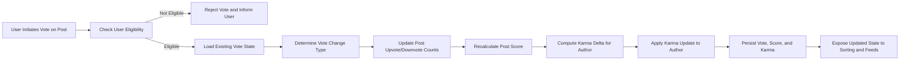

# Voting and Karma Requirements for communityPlatform

## 1. Introduction

This document defines the business requirements for the voting and karma system of the **communityPlatform** service, a Reddit-like community application. It provides a complete description of how upvotes and downvotes affect posts, comments, and users; how user karma is calculated and updated; and how karma influences user capabilities and system behavior.

The focus of this document is **what** the system must do from a business perspective, not **how** it is implemented. All requirements are written in natural language using EARS (Easy Approach to Requirements Syntax) to ensure they are specific, testable, and unambiguous.

The primary audience is backend developers who will implement the voting, ranking, and karma-related logic, and platform stakeholders who need to understand the effects of voting and karma on user reputation and content visibility.

## 2. Goals and Scope of the Voting and Karma System

### 2.1 Business Goals

- Surface the most useful and engaging content.
- Allow the community to collectively indicate approval or disapproval.
- Build a reputation signal (karma) for users based on the community’s response to their contributions.
- Provide quantitative input to sorting modes such as hot, new, top, and controversial.
- Support anti-abuse measures by limiting capabilities of low-reputation accounts and rewarding positive contributors.

EARS requirements:
- THE voting subsystem SHALL provide a binary voting mechanism (upvote/downvote) on posts and comments to capture user sentiment at a coarse-grained level.
- THE reputation subsystem SHALL derive a numeric karma value per user from voting outcomes on that user’s posts and comments.
- THE sorting subsystem SHALL use post scores derived from votes as an input to ordering content in "top", "hot", and "controversial" sorting modes.

### 2.2 Scope

THE voting and karma requirements in this document SHALL cover:
- Voting rules for posts and comments.
- Calculation of scores for posts and comments.
- Calculation of post karma, comment karma, and total karma per user.
- Effects of karma on user capabilities (for example posting limits, community creation eligibility, voting limits).
- Interactions with sorting modes and anti-abuse mechanisms.

THE voting and karma requirements SHALL NOT specify:
- Low-level implementation algorithms for ranking formulas.
- Data storage schemas or API endpoint definitions.
- UI design, visualizations, or client-side state management.

## 3. Concepts and Definitions

### 3.1 Entities Affected by Voting

Definitions:
- **Post vote**: An upvote or downvote applied by a user to a post within a community.
- **Comment vote**: An upvote or downvote applied by a user to a comment or nested reply.
- **Upvote**: A positive vote indicating approval or agreement.
- **Downvote**: A negative vote indicating disapproval or low quality.
- **Post score**: Net score of a post, defined as upvotes minus downvotes.
- **Comment score**: Net score of a comment, defined as upvotes minus downvotes.
- **Post karma**: Sum of post-related karma contributions for a user.
- **Comment karma**: Sum of comment-related karma contributions for a user.
- **Total karma**: Sum of post karma and comment karma for a user.
- **Karma threshold**: Numeric boundary that unlocks or restricts specific capabilities.
- **Freshness**: Conceptual measure of content age used by sorting modes.

EARS requirements:
- THE voting subsystem SHALL treat posts and comments as the only entities that can receive upvotes and downvotes in the initial release.
- WHERE new entity types are introduced in the future, THE voting subsystem SHALL treat those as out of scope unless explicitly added by updated requirements.

### 3.2 User Actors and Eligibility

Actors:
- guestUser
- memberUser
- communityModerator
- platformAdmin

EARS requirements:
- WHERE the actor is guestUser, THE voting subsystem SHALL prevent casting votes on any post or comment.
- WHERE the actor is memberUser, THE voting subsystem SHALL allow casting exactly one active vote per visible post and per visible comment in communities where voting is enabled.
- WHERE the actor is communityModerator, THE voting subsystem SHALL treat that actor as memberUser for voting purposes and SHALL NOT grant additional voting weight based solely on moderator status.
- WHERE the actor is platformAdmin, THE voting subsystem SHALL treat that actor as memberUser for voting purposes and SHALL NOT grant additional voting weight based solely on admin status.

## 4. Post Voting Requirements

### 4.1 Eligibility and Preconditions for Post Voting

EARS requirements:
- WHEN a user attempts to vote on a post, THE voting subsystem SHALL verify that the user is authenticated as memberUser, communityModerator, or platformAdmin before accepting the vote.
- WHEN a user attempts to vote on a post in a community where the user is banned or blocked, THE voting subsystem SHALL reject the vote and SHALL keep existing scores unchanged.
- WHEN a user attempts to vote on a post that is not visible to that user due to community visibility rules or user blocks, THE voting subsystem SHALL reject the vote and SHALL not disclose hidden content details.
- WHEN a post is fully removed from user-facing views, THE voting subsystem SHALL prevent new votes on that post.
- WHERE platform policy disallows self-voting, THE voting subsystem SHALL prevent users from voting on their own posts.

### 4.2 Casting and Updating Votes on Posts

EARS requirements:
- WHEN a user with no prior vote on a post casts an upvote, THE voting subsystem SHALL record an upvote for that user and post and SHALL increase the post’s upvote count by 1.
- WHEN a user with no prior vote on a post casts a downvote, THE voting subsystem SHALL record a downvote for that user and post and SHALL increase the post’s downvote count by 1.
- WHEN a user who previously upvoted a post casts a downvote on the same post, THE voting subsystem SHALL change the stored vote from upvote to downvote, SHALL decrease the post’s upvote count by 1, and SHALL increase the post’s downvote count by 1.
- WHEN a user who previously downvoted a post casts an upvote on the same post, THE voting subsystem SHALL change the stored vote from downvote to upvote, SHALL decrease the post’s downvote count by 1, and SHALL increase the post’s upvote count by 1.
- WHEN a user removes their vote from a post, THE voting subsystem SHALL remove the stored vote association, SHALL adjust the relevant count (upvote or downvote) by -1, and SHALL leave the opposite count unchanged.
- WHEN multiple vote requests are received from the same user for the same post in rapid succession, THE voting subsystem SHALL apply only the final vote state and SHALL ensure that net count changes reflect a single coherent transition.

### 4.3 Post Score Calculation and Maintenance

EARS requirements:
- THE voting subsystem SHALL maintain a numeric score for each post defined as (upvote count minus downvote count).
- WHEN an upvote is added to a post, THE voting subsystem SHALL increase that post’s score by 1.
- WHEN an upvote is removed from a post, THE voting subsystem SHALL decrease that post’s score by 1.
- WHEN a downvote is added to a post, THE voting subsystem SHALL decrease that post’s score by 1.
- WHEN a downvote is removed from a post, THE voting subsystem SHALL increase that post’s score by 1.
- WHERE temporary inconsistencies arise due to processing delays, THE voting subsystem SHALL reconcile post scores so that score equals (upvotes minus downvotes) once processing is complete.

### 4.4 Post Voting Constraints and Rate Limits

Values in this section are conceptual examples; actual numeric thresholds SHALL be configurable.

EARS requirements:
- WHERE a user account age is younger than a configurable threshold (for example 24 hours), THE voting subsystem SHALL enforce a reduced maximum number of post votes per hour for that user.
- WHERE a user’s total karma is below a configurable negative threshold (for example -10), THE voting subsystem SHALL enforce a reduced maximum number of post votes per day for that user.
- WHERE a user’s total karma is above a configurable high-trust threshold (for example 500), THE voting subsystem SHALL allow a higher daily limit of post votes than for low-karma accounts.
- WHEN a user exceeds allowed voting rate limits on posts, THE voting subsystem SHALL reject additional post votes within that time window and SHALL provide a business-level explanation that voting limits have been reached.

### 4.5 Interaction with Moderation and Content State

EARS requirements:
- WHEN a post is locked by a moderator or admin and platform policy defines that votes must not change after locking, THE voting subsystem SHALL prevent new votes and vote changes on that post while locked.
- WHEN a locked post is later unlocked, THE voting subsystem SHALL again allow votes and vote changes according to standard rules.
- WHEN a post is soft-removed (hidden but retained internally), THE voting subsystem SHALL retain existing vote data and SHALL stop accepting new votes on that post.
- WHEN a post is permanently removed by policy, THE voting subsystem SHALL stop accepting votes and SHALL treat the post as non-votable in all contexts.

## 5. Comment Voting Requirements

### 5.1 Eligibility and Preconditions for Comment Voting

EARS requirements:
- WHEN a user attempts to vote on a comment, THE voting subsystem SHALL verify that the user is authenticated and has access to the comment’s parent post and community.
- WHEN a user is banned from a community, THE voting subsystem SHALL block that user from voting on comments in that community.
- WHEN a comment is not visible to a user due to moderation rules or user blocks, THE voting subsystem SHALL reject the vote attempt for that user.

### 5.2 Casting and Updating Votes on Comments

EARS requirements:
- WHEN a user with no prior vote on a comment casts an upvote, THE voting subsystem SHALL record an upvote and SHALL increase the comment’s upvote count by 1.
- WHEN a user with no prior vote on a comment casts a downvote, THE voting subsystem SHALL record a downvote and SHALL increase the comment’s downvote count by 1.
- WHEN a user who previously upvoted a comment casts a downvote on the same comment, THE voting subsystem SHALL change the stored vote, SHALL decrease the comment’s upvote count by 1, and SHALL increase the comment’s downvote count by 1.
- WHEN a user who previously downvoted a comment casts an upvote on the same comment, THE voting subsystem SHALL change the stored vote, SHALL decrease the comment’s downvote count by 1, and SHALL increase the comment’s upvote count by 1.
- WHEN a user removes their vote from a comment, THE voting subsystem SHALL remove the stored vote association, SHALL adjust the relevant count by -1, and SHALL leave the opposite count unchanged.

### 5.3 Comment Score Calculation and Collapse Behavior

EARS requirements:
- THE voting subsystem SHALL maintain a numeric score for each comment defined as (upvote count minus downvote count).
- WHEN an upvote is added to a comment, THE voting subsystem SHALL increase that comment’s score by 1.
- WHEN an upvote is removed from a comment, THE voting subsystem SHALL decrease that comment’s score by 1.
- WHEN a downvote is added to a comment, THE voting subsystem SHALL decrease that comment’s score by 1.
- WHEN a downvote is removed from a comment, THE voting subsystem SHALL increase that comment’s score by 1.
- WHILE a comment’s score is below a configurable collapse threshold (for example -3), THE presentation rules SHALL treat that comment as low quality and eligible for collapsed display by default.
- WHILE a comment is collapsed due to low score, THE system SHALL allow users to expand it on demand without changing the score.

### 5.4 Comment Voting Constraints and Rate Limits

EARS requirements:
- WHERE a user account age is younger than a configurable threshold, THE voting subsystem SHALL enforce a reduced maximum number of comment votes per hour for that user.
- WHERE a user’s total karma is below a configurable negative threshold, THE voting subsystem SHALL enforce a reduced maximum number of comment votes per day for that user.
- WHEN a user attempts to exceed allowed comment voting limits, THE voting subsystem SHALL reject additional comment votes in that period and SHALL communicate that voting limits have been reached.

### 5.5 Interaction with Comment Moderation

EARS requirements:
- WHEN a comment is locked to prevent further replies, THE voting subsystem MAY still allow or disallow new votes on that comment according to configurable policy; THE policy SHALL be applied consistently across all comments.
- WHEN a comment is fully removed from user-facing views, THE voting subsystem SHALL stop accepting new votes on that comment.
- WHEN a comment is soft-removed, THE voting subsystem SHALL retain vote history for auditing and karma purposes while preventing new votes.

## 6. Karma Calculation and Maintenance

### 6.1 Karma Components and Totals

EARS requirements:
- THE reputation subsystem SHALL maintain three numeric karma values for each user: post karma, comment karma, and total karma.
- THE reputation subsystem SHALL define total karma as the sum of post karma and comment karma for that user.
- WHEN post karma or comment karma values change, THE reputation subsystem SHALL update the total karma value accordingly.

### 6.2 Post Karma Rules

EARS requirements:
- WHEN a post receives a new upvote from a user other than the post’s author, THE reputation subsystem SHALL increase the post author’s post karma by 1.
- WHEN a post receives a new downvote from a user other than the post’s author, THE reputation subsystem SHALL decrease the post author’s post karma by 1.
- WHEN an upvote on a post is changed to a downvote, THE reputation subsystem SHALL update the post author’s post karma by -2 relative to the previous state (reversing the +1 and applying -1).
- WHEN a downvote on a post is changed to an upvote, THE reputation subsystem SHALL update the post author’s post karma by +2 relative to the previous state.
- WHEN an upvote on a post is removed without becoming a downvote, THE reputation subsystem SHALL decrease the post author’s post karma by 1.
- WHEN a downvote on a post is removed without becoming an upvote, THE reputation subsystem SHALL increase the post author’s post karma by 1.
- WHERE self-voting is allowed for business reasons, THE reputation subsystem SHALL ignore self-votes when calculating post karma and SHALL NOT change karma based on self-votes.

### 6.3 Comment Karma Rules

EARS requirements:
- WHEN a comment receives a new upvote from a user other than the comment’s author, THE reputation subsystem SHALL increase the comment author’s comment karma by 1.
- WHEN a comment receives a new downvote from a user other than the comment’s author, THE reputation subsystem SHALL decrease the comment author’s comment karma by 1.
- WHEN an upvote on a comment is changed to a downvote, THE reputation subsystem SHALL update the comment author’s comment karma by -2 relative to the previous state.
- WHEN a downvote on a comment is changed to an upvote, THE reputation subsystem SHALL update the comment author’s comment karma by +2 relative to the previous state.
- WHEN an upvote on a comment is removed, THE reputation subsystem SHALL decrease the comment author’s comment karma by 1.
- WHEN a downvote on a comment is removed, THE reputation subsystem SHALL increase the comment author’s comment karma by 1.
- WHERE self-voting is allowed for comments, THE reputation subsystem SHALL ignore self-votes for the purpose of comment karma calculation.

### 6.4 Karma and Content Deletion

EARS requirements:
- WHEN a post is soft-deleted (removed from standard views but retained internally), THE reputation subsystem SHALL retain karma effects originating from that post.
- WHEN a post is permanently removed due to policy, THE reputation subsystem SHALL either retain or reverse karma contributions from that post according to a configurable business rule that SHALL be applied consistently.
- WHEN a comment is soft-deleted, THE reputation subsystem SHALL retain karma effects originating from that comment.
- WHEN a comment is permanently removed, THE reputation subsystem SHALL either retain or reverse karma contributions from that comment according to a configurable business rule.

### 6.5 Karma Consistency and Reconciliation

EARS requirements:
- THE reputation subsystem SHALL ensure that stored post karma equals the sum of contributions from all non-ignored votes on that user’s posts, except during brief reconciliation intervals.
- THE reputation subsystem SHALL ensure that stored comment karma equals the sum of contributions from all non-ignored votes on that user’s comments, except during brief reconciliation intervals.
- WHEN discrepancies between stored karma and underlying votes are detected, THE reputation subsystem SHALL recalculate correct karma totals and SHALL overwrite inconsistent values.

## 7. Karma-Based Capability Rules

### 7.1 Capability Thresholds

Example conceptual levels (configurable in practice):
- New user: total karma < 10.
- Established user: 10 ≤ total karma < 1000.
- Highly trusted user: total karma ≥ 1000.

EARS requirements:
- WHERE a user’s total karma is less than a configurable minimum posting threshold, THE system SHALL limit the number of new posts that user can create per day to a lower value than for users above the threshold.
- WHERE a user’s total karma is greater than or equal to a configurable posting expansion threshold, THE system SHALL allow that user a higher number of new posts per day than the base allowance.
- WHERE a user’s total karma is greater than or equal to a configurable community-creation threshold, THE system SHALL allow that user to create new communities, subject to any other applicable rules.
- WHERE a user’s total karma is below the community-creation threshold, THE system SHALL prevent that user from creating new communities and SHALL indicate that a higher karma level is required.

### 7.2 Voting Limits and Restrictions Based on Karma

EARS requirements:
- WHERE a user’s total karma is below a configurable low-karma threshold, THE voting subsystem SHALL enforce stricter combined daily limits on post and comment votes for that user.
- WHERE a user’s total karma is above a configurable high-trust threshold, THE voting subsystem SHALL allow more generous daily voting limits for that user.
- WHERE a user’s total karma is below a critical negative threshold (for example less than -50), THE voting subsystem SHALL restrict that user from casting new downvotes while allowing a limited number of upvotes.

### 7.3 Using Karma for Moderation and Trust Signals

EARS requirements:
- WHERE communityModerator reviews a user’s activity, THE system SHALL present that user’s karma values as one of several indicators of historical contribution quality.
- WHERE platformAdmin evaluates potential abuse or misuse, THE system SHALL make karma trends (for example sudden sharp drops) available as context, without automatically applying punitive measures purely based on karma.

### 7.4 User Feedback About Karma Effects

EARS requirements:
- WHEN a user encounters a limitation that is directly caused by low karma (for example posting limit, community-creation block), THE system SHALL provide a business-level explanation that references karma-based restrictions without exposing internal thresholds exactly, unless policy allows.
- WHEN a user’s total karma crosses a significant threshold that changes their capabilities, THE system SHALL optionally notify them of new capabilities if the business chooses to highlight this.

## 8. Anti-Abuse and Fraud-Related Voting Rules

### 8.1 Detection Signals

EARS requirements:
- THE voting subsystem SHALL expose internal signals when unusual voting patterns occur, such as many new accounts voting on content from the same user in a short period.
- WHEN repeated patterns of coordinated voting (brigading) are detected according to higher-level abuse rules, THE system SHALL flag affected votes and accounts for potential review by moderators or admins.

### 8.2 Mitigation Measures

EARS requirements:
- WHERE a user’s voting behavior repeatedly triggers abuse detection thresholds, THE system SHALL allow platformAdmin to temporarily restrict that user’s ability to vote while an investigation is conducted.
- WHERE brigading is confirmed, THE system SHALL allow platformAdmin to invalidate or discount votes that are deemed abusive according to platform policy, and SHALL update scores and karma accordingly.

### 8.3 Multi-Account Behavior

EARS requirements:
- WHERE business rules identify multiple accounts as likely belonging to the same individual for abuse-related reasons, THE system SHALL allow platformAdmin to aggregate voting and karma patterns across those accounts for review.
- WHERE linked accounts are used to manipulate votes, THE system SHALL allow platformAdmin to undo karma and score effects from those accounts and to apply sanctions such as bans or vote restrictions.

## 9. Interaction with Sorting and Feeds

### 9.1 Use of Scores in Sorting

EARS requirements:
- WHEN posts are sorted by "top", THE sorting subsystem SHALL primarily use post score as the ordering key within the selected time window.
- WHEN posts are sorted by "hot", THE sorting subsystem SHALL use a combination of post score and post age such that newer highly scored posts tend to be prioritized over older ones with similar scores.
- WHEN posts are sorted by "controversial", THE sorting subsystem SHALL prioritize posts with both a high total number of votes and a relatively balanced mix of upvotes and downvotes.

### 9.2 Handling Negative Scores

EARS requirements:
- WHILE a post’s score is below a configurable negative threshold (for example -5), THE sorting subsystem SHALL consider that post low quality and SHALL de-emphasize it in default feeds even if not removed.
- WHILE a comment’s score is below the collapse threshold, THE system SHALL treat the comment as low quality for display purposes, as described earlier.

### 9.3 Feed Consistency

EARS requirements:
- WHILE scores and karma are being updated, THE system SHALL ensure that any transient discrepancies do not prevent users from viewing or interacting with content within policy.
- WHEN reconciliation completes, THE system SHALL ensure that feed ordering reflects the latest scores according to sorting rules.

## 10. Example Flow Diagram

The following Mermaid diagram illustrates the conceptual flow for casting a vote on a post and updating scores and karma.

## 11. Non-Functional Expectations Related to Voting and Karma

EARS requirements:
- WHEN a user casts or changes a vote, THE system SHALL reflect the updated vote state and local score within a few seconds under normal load.
- WHEN a user views their profile, THE system SHALL show karma values that are reasonably up to date, including votes processed within a short recent period.
- WHILE the platform is under heavy load, THE system SHALL prioritize correct application of votes and karma over immediate recalculation of non-critical derived metrics.

## 12. Summary

The voting and karma system for communityPlatform SHALL provide a consistent, transparent, and abuse-resistant mechanism for users to express approval or disapproval of content and for the platform to derive user reputation and ranking signals from these votes. Votes on posts and comments SHALL directly influence post and comment scores, and those scores SHALL feed into sorting modes and user-facing rankings. Karma accrued from votes SHALL influence user capabilities and SHALL serve as one of several trust indicators for moderation and governance.

All behaviors described in this document are business-level requirements. Development teams SHALL retain full autonomy to choose technical designs, algorithms, and data structures as long as they satisfy these voting and karma behaviors and constraints.