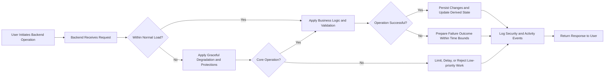

# Non-Functional Requirements for Reddit-like Community Platform (communityPlatform)

## 1. Introduction

### 1.1 Document Purpose

THE communityPlatform non-functional specification SHALL define measurable quality attributes for the Reddit-like backend so that development and QA teams can design, implement, and verify the system against clear performance, scalability, availability, security, privacy, and auditability expectations.

THE non-functional specification SHALL describe what levels of service, protection, and reliability the platform must provide from a business and user-experience perspective and SHALL avoid prescribing any specific infrastructure technologies or implementation mechanisms.

### 1.2 Scope and Relationship to Other Requirements

THE non-functional requirements SHALL apply to all core capabilities of communityPlatform, including:
- Authentication and session management.
- Community creation and browsing.
- Post and comment creation, viewing, voting, and sorting.
- User profiles, karma, subscriptions, and feeds.
- Reporting, moderation, and basic administrative actions.

THE non-functional requirements SHALL be interpreted together with functional, business-rule, error-handling, and data-lifecycle requirements so that the combined behavior of the backend satisfies both feature and quality expectations.

### 1.3 Target Audience

THE non-functional specification SHALL target backend developers, technical leads, architects, QA engineers, and operations staff who are responsible for designing, building, testing, and running the communityPlatform backend.

## 2. System Context and Usage Assumptions

### 2.1 Feature Context

THE communityPlatform system SHALL support a Reddit-like community experience where:
- guestUser can browse public communities, posts, comments, and public profiles.
- memberUser can register, authenticate, create and manage content, vote, subscribe, and report.
- adminUser can review reports, perform moderation, and enforce policies.

### 2.2 Usage Patterns and Load Assumptions

THE communityPlatform usage model SHALL assume that:
- guestUser traffic is predominantly read-heavy (browsing communities, viewing posts and comments).
- memberUser traffic is a mix of read and write operations, with high-frequency voting and lower-frequency posting and commenting.
- adminUser traffic is low volume but may involve resource-intensive queries over reports and historical data.

WHERE capacity planning is performed, THE communityPlatform SHALL use at least the following baseline assumptions for normal growth:
- At least 100,000 registered memberUser accounts.
- At least 10,000 monthly active users and 1,000 daily active users as an initial target, with growth beyond these numbers expected.
- At least 200 concurrent active users during normal peak periods.
- At least 200,000 posts and 2,000,000 comments stored over time.

WHERE long-term growth occurs, THE communityPlatform SHALL be designed so that capacity can be increased without changing externally visible business behavior.

## 3. Performance and Responsiveness Requirements

### 3.1 General Performance Principles

WHEN communityPlatform processes user-facing requests under normal load and typical consumer network conditions, THE system SHALL respond within the performance targets specified per operation category so that the experience feels responsive to end users.

IF system load temporarily exceeds expected peak levels, THEN communityPlatform SHALL degrade gracefully by prioritizing core read operations (browsing and viewing content) over non-essential operations (heavy analytics, non-critical background tasks) rather than failing unpredictably.

WHILE performance optimizations are implemented, THE system SHALL preserve the functional and business rules defined in other documents without altering observable behavior.

### 3.2 Authentication and Session Operations

WHEN a user submits a registration request with valid data under normal load, THE system SHALL return a success or failure outcome within 3 seconds.

WHEN a user submits registration data that fails business validation (such as duplicate identifiers or invalid formats), THE system SHALL return validation feedback within 3 seconds and SHALL not create an account.

WHEN a user submits valid login credentials under normal load, THE system SHALL establish an authenticated session and return a success outcome within 2 seconds.

WHEN a user submits invalid login credentials, THE system SHALL return an authentication failure outcome within 2 seconds without revealing which credential field is incorrect.

WHEN a logged-in user requests logout, THE system SHALL invalidate the effective session and return a confirmation outcome within 2 seconds under normal load.

WHILE requests include valid authentication material, THE session validation logic SHALL contribute no more than 300 milliseconds to the total server-side processing time for standard operations under normal load.

### 3.3 Community, Post, and Comment Browsing

WHEN any actor requests the first page of a community list with default filters under normal load, THE system SHALL return the community list within 2 seconds.

WHEN any actor opens a specific community page with its first page of posts under normal load, THE system SHALL return those posts and essential metadata within 2 seconds.

WHEN any actor opens an individual post with its first page of top-level comments under normal load, THE system SHALL return the post and initial comments within 2 seconds.

WHEN any actor expands a nested comment thread under normal load, THE system SHALL return the requested nested replies within 2 seconds.

WHERE communities or posts contain very large volumes of comments, THE system SHALL use paging or incremental loading so that each individual request for a page of comments returns within 2 seconds under normal load.

### 3.4 Content Creation and Voting

WHEN a memberUser submits a valid new post (text, link, or image) under normal load, THE system SHALL create the post and return a success outcome, including the resulting post identifier and state, within 3 seconds.

WHEN a memberUser submits an invalid post creation request, THE system SHALL return validation errors within 3 seconds and SHALL not create a partial or hidden post.

WHEN a memberUser submits a valid new comment or reply under normal load, THE system SHALL create the comment and return a success outcome within 2 seconds.

WHEN a memberUser casts, changes, or removes a vote on a post or comment under normal load, THE system SHALL register the vote change and return a success outcome within 1 second, including updated score information as defined in the functional requirements.

WHEN a memberUser subscribes to or unsubscribes from a community under normal load, THE system SHALL apply the change and return a success outcome within 2 seconds and SHALL ensure subsequent feed generation reflects the change within one additional feed refresh.

### 3.5 Search, Sorting, and Feed Generation

WHEN a user requests a list of posts with a supported sort mode (hot, new, top, controversial) and default filters under normal load, THE system SHALL return the first page of results within 2 seconds.

WHEN a user applies additional filters or search criteria that are typical (for example, filtering by community or recent time ranges) under normal load, THE system SHALL return the first page of results within 3 seconds.

IF a user submits a highly complex search or filter combination that touches very large result sets, THEN THE system SHALL either:
- Return results within 5 seconds under peak load conditions, or
- Indicate that the query is too complex and suggest simplifying filters, according to business policy.

WHEN a memberUser requests a personalized feed that aggregates subscribed communities under normal load, THE system SHALL generate and return the first page of the feed within 3 seconds.

### 3.6 Performance Under Degraded or Peak Conditions

IF sustained load exceeds the expected peak capacity such that normal targets cannot be met, THEN THE system SHALL:
- Maintain read access to community, post, and comment content with response times not exceeding 5 seconds for the majority of requests.
- Defer or throttle non-essential tasks such as heavy analytics, low-priority notifications, or maintenance jobs before degrading core read and write operations.

IF a specific operation cannot complete within the usual target but remains safe to run asynchronously, THEN THE system SHALL provide a clear indication that the request is accepted for background processing and SHALL avoid blocking the user beyond 5 seconds.

## 4. Scalability Expectations

### 4.1 General Scalability Principles

THE communityPlatform architecture SHALL support horizontal and/or vertical capacity expansion from a business perspective so that increased load can be managed without altering observable behaviors or business rules.

WHEN platform usage grows beyond the baseline assumptions in Section 2, THE system SHALL be adaptable so that capacity for both read-heavy and write-heavy operations can be increased while preserving the functional contract of all features.

### 4.2 User and Content Growth Targets

WHERE growth planning is performed, THE system SHALL be designed so that it can, without fundamental redesign, support at least:
- 100,000 registered memberUser accounts.
- 10,000 daily active users.
- 1,000 concurrent active users during peak hours.
- 1,000,000 posts and 10,000,000 comments accumulated over time.

WHEN user or content counts approach or exceed these thresholds, THE system SHALL allow the operations team to extend capacity through configuration, deployment, or scaling changes without modifying business logic.

### 4.3 Hotspot and Skew Handling

WHEN a small number of communities or posts become highly popular, THE system SHALL ensure that activity concentrated on those hotspots does not cause unacceptable degradation for other communities.

WHEN a single community grows to hundreds of thousands of subscribers or large numbers of active participants, THE system SHALL maintain the performance targets in Section 3 for browsing and posting within that community under normal load conditions.

### 4.4 Burst Traffic

WHEN viral events or external referrals generate short-term spikes in traffic significantly above normal peaks, THE system SHALL:
- Maintain availability for at least core read operations (viewing communities, posts, comments) even if some non-essential features are temporarily limited.
- Favor returning partial but consistent content over failing entire pages where partial responses are allowed by product design.

## 5. Availability and Reliability

### 5.1 Availability Targets

THE communityPlatform core read and write operations SHALL target an availability of at least 99.5% per calendar month, excluding planned maintenance windows announced according to business policy.

Core read operations SHALL include browsing communities, viewing posts and comments, and viewing public profiles.

Core write operations SHALL include registration, login, posting, commenting, voting, subscribing, reporting content, and basic profile updates.

### 5.2 Planned Maintenance

WHEN planned maintenance is required, THE system SHALL support conducting maintenance with minimal downtime, preferably during off-peak hours defined by the business.

WHERE feasible, THE system SHALL allow read-only access to public content during planned maintenance windows while temporarily disabling write operations that cannot be safely processed.

### 5.3 Failure Handling and Graceful Degradation

IF a non-critical subsystem fails (for example recommendation logic or extended analytics), THEN THE system SHALL continue to serve core read and write operations whenever possible, potentially omitting non-critical information rather than returning full-page errors.

IF a failure impacts the ability to safely persist write operations (for example database write unavailability), THEN THE system SHALL reject or queue affected write requests instead of accepting them in a way that risks data loss or inconsistency.

WHEN the system recovers from failures, THE system SHALL restore normal processing while maintaining data consistency and SHALL ensure that content visibility, scores, subscriptions, and reports reflect a coherent state.

### 5.4 Data Durability

WHEN the system confirms to a user that a post, comment, vote, subscription, or report has been successfully created, THE system SHALL persist that change in durable storage according to the data lifecycle requirements and SHALL not lose it due to ordinary failures.

IF data corruption is detected in stored entities, THEN THE system SHALL prevent corrupted entities from being served as valid content and SHALL expose enough information to operators to identify and remediate the issue.

## 6. Security and Privacy Principles

### 6.1 Overall Security Objectives

THE security posture of communityPlatform SHALL protect user accounts, personal information, and content from unauthorized access, modification, or disclosure to the extent reasonably expected of a modern public community service.

### 6.2 Authentication and Authorization

WHEN users register or log in, THE authentication processes SHALL treat credentials and identity information as sensitive and SHALL process them in a way that minimizes exposure to unauthorized actors.

WHEN a user attempts to perform a protected action, THE system SHALL enforce authorization checks server-side, based on the current actor role (guestUser, memberUser, adminUser) and the permissions model defined in the actor and permissions requirements.

IF repeated failed login attempts for an account or source exceed a configured threshold, THEN the authentication subsystem SHALL apply protective measures such as throttling or temporary lockouts and SHALL avoid revealing whether a specific account exists beyond what is allowed by business rules.

WHEN a user requests logout from all devices, THE system SHALL revoke or invalidate active sessions associated with that account as soon as practicable, ensuring that new protected actions require fresh authentication.

### 6.3 Data Protection and Privacy

THE system SHALL treat account identity data (such as contact details and authentication-related values) as high-sensitivity and SHALL avoid exposing it in responses, logs, or analytics beyond what is necessary for platform operation and compliance.

WHEN serving content that is public by design (such as posts and comments in public communities), THE system SHALL avoid including unnecessary internal identifiers or sensitive metadata that is not required for the user experience.

WHERE users exercise rights defined in the data lifecycle and privacy requirements (such as deletion or export where applicable), THE backend SHALL enforce the corresponding data-handling behavior consistently across all storage layers that affect user-visible behavior.

### 6.4 Abuse Prevention and Rate Limiting

WHEN automated or abusive behavior is detected for operations such as posting, commenting, voting, or reporting, THE system SHALL apply rate limits or other restrictions that reduce the impact of abuse while preserving normal usage for unaffected users.

WHERE rate limits exist, THE system SHALL define them in business terms (for example, maximum posts, comments, votes, or reports per time window per account or origin) and SHALL enforce them consistently.

IF an operation is rejected due to rate limits or abuse protections, THEN THE system SHALL respond promptly with an outcome that allows the client to inform the user that limits have been reached, without disclosing exact thresholds.

### 6.5 Security Incident Expectations (Conceptual)

IF a security incident affecting confidentiality, integrity, or availability is detected, THEN the backend SHALL provide sufficient logging and state information to allow authorized operators to investigate, contain, and remediate the incident.

WHILE a security incident is ongoing, THE system SHALL prioritize protection of user data and prevention of further damage, even if this requires temporary restrictions or graceful degradation of certain features.

## 7. Auditability and Logging Requirements

### 7.1 Logging Objectives

THE logging facilities SHALL capture enough information about significant events (such as authentication, content creation, moderation, and configuration changes) to support security investigations, compliance reviews, and troubleshooting, while still respecting privacy and data minimization expectations.

### 7.2 User Activity Logging

WHEN a memberUser performs key actions such as registering, logging in, changing passwords, creating communities, creating or editing posts and comments, voting, reporting content, or changing profile settings, THE system SHALL record an activity log entry that identifies the action type, the actor, the time, and references to the affected resources in business terms.

WHEN a guestUser triggers security-relevant events (such as repeated failed login attempts), THE system SHALL record log entries sufficient to support abuse detection without collecting more personal data than necessary.

### 7.3 Admin and Moderation Logging

WHEN an adminUser performs moderation or administrative actions (such as content removal, bans, community restrictions, configuration of policies), THE system SHALL record log entries that identify the adminUser, the action type, the target resource, and the time of the action.

WHERE moderation decisions are tied to specific reports, THE logging subsystem SHALL preserve linkages between reports, decisions, and applied actions for the retention period defined in moderation requirements.

### 7.4 Security and Privacy in Logs

THE logging subsystem SHALL avoid storing raw credentials, full sensitive tokens, or unnecessary personal data in logs.

WHEN logs contain identifiers such as IP addresses or user identifiers that are considered sensitive, THE logging subsystem SHALL treat these logs as high-sensitivity data and SHALL ensure that access is limited to authorized operational personnel.

WHERE log retention policies require removal or anonymization after a certain period, THE logging subsystem SHALL ensure logs are processed accordingly and SHALL not use expired logs for new operational decisions.

## 8. Non-Functional Requirements by Actor and Feature

### 8.1 guestUser Experience

WHEN a guestUser browses public communities, posts, comments, and profiles under normal load, THE system SHALL respond to standard navigation requests within 2 seconds for the first page of each list.

IF load spikes or partial failures occur, THEN the system SHALL prioritize guestUser read access to public content and SHALL avoid exposing internal error details, falling back to slightly slower responses (up to 5 seconds) rather than returning generic hard failures where possible.

### 8.2 memberUser Experience

WHEN a memberUser uses authenticated features such as posting, commenting, voting, subscribing, reporting, and editing profile information under normal load, THE system SHALL respond within the specific performance targets for those operations defined in Section 3.

WHEN protective measures such as rate limits or temporary restrictions are applied to a memberUser, THE system SHALL maintain the ability for that memberUser to log in (unless banned), view allowed content, and understand that limits are in effect, even if some write operations are blocked.

### 8.3 adminUser Experience

WHEN an adminUser loads queues of reports, performs moderation actions, or reviews historical content and activity under normal load, THE system SHALL return standard moderation views within 3 seconds for typical result sizes.

WHERE adminUser needs to perform heavy queries over large historical datasets, THE system SHALL support such queries with response times that may extend up to 10 seconds under heavy conditions, and SHALL provide clear progress or outcome information so that adminUser can understand that the system is still working.

## 9. High-level Non-Functional Flow Diagram

## 10. Assumptions, Constraints, and Evolution

THE non-functional requirements in this specification SHALL be interpreted as business-level quality expectations rather than technology mandates and SHALL not constrain the development team to any specific infrastructure products.

THE performance targets and availability objectives SHALL assume typical consumer network conditions; actual end-to-end user perception may vary with external factors such as local connectivity.

WHERE future business needs introduce new features, markets, or regulatory obligations, THE communityPlatform design SHALL remain flexible so that new non-functional requirements can be integrated without regressing core performance, security, and reliability targets defined in this document.

THE development and operations teams SHALL retain full autonomy in selecting architectures, APIs, and storage strategies, provided that the resulting implementation can be shown to satisfy the non-functional requirements described here through testing, monitoring, and operational evidence.