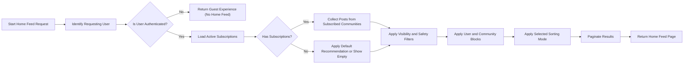

# Subscription and Feed Requirements – communityPlatform

## 1. Introduction and Scope

communityPlatform uses community subscriptions and feeds to control which posts each user sees by default. Subscriptions connect memberUser accounts to communities, and feeds turn those relationships into ordered lists of posts under different sorting modes.

The scope of these requirements includes:
- Subscribing and unsubscribing to communities.
- Construction and behavior of personalized Home Feeds based on subscriptions.
- Behavior of Community Feeds for individual communities.
- Sorting modes ("hot", "new", "top", "controversial") as visible options in feeds.
- Edge cases related to empty feeds, hidden or removed content, blocked users or communities, banned users, and restricted access.

All behaviors are expressed in business terms using EARS format and avoid any technical details such as API endpoints or database schemas.

## 2. Subscription Model Overview

### 2.1 Core Concepts

- Community: Topic-focused space where posts and comments are shared.
- Subscription: Relationship where a memberUser chooses to follow a community.
- Home Feed: Personalized feed for a memberUser that aggregates posts primarily from subscribed communities.
- Community Feed: Feed that lists posts belonging to a single community.

EARS requirements:
- THE communityPlatform service SHALL treat subscriptions as the primary signal for selecting posts for the Home Feed of each memberUser.
- THE communityPlatform service SHALL treat each Community Feed as a list of posts that belong to exactly one community, filtered by visibility and policy rules.

### 2.2 Actors and Subscription Capabilities

Actors:
- guestUser
- memberUser
- communityModerator (a memberUser with extra privileges per community)
- platformAdmin

EARS requirements:
- WHERE the actor is guestUser, THE communityPlatform service SHALL allow the actor to view public Community Feeds but SHALL NOT allow the actor to subscribe or unsubscribe to any community.
- WHERE the actor is memberUser, THE communityPlatform service SHALL allow the actor to subscribe and unsubscribe to communities according to access rules for those communities.
- WHERE the actor is communityModerator, THE communityPlatform service SHALL treat the actor as a memberUser for subscription purposes in addition to moderation abilities.
- WHERE the actor is platformAdmin, THE communityPlatform service SHALL allow the actor to inspect subscriptions for policy and abuse handling purposes while respecting privacy rules defined elsewhere.

### 2.3 Business Goals of Subscriptions and Feeds

EARS requirements:
- THE communityPlatform service SHALL use subscriptions to help memberUser discover and keep up to date with content that matches their interests.
- THE communityPlatform service SHALL allow memberUser to control which communities influence their Home Feed by adding or removing subscriptions.
- THE communityPlatform service SHALL ensure that all feeds respect content visibility, moderation decisions, user safety settings, and community access rules.

## 3. Community Subscription Rules

### 3.1 Eligibility to Subscribe and Unsubscribe

EARS requirements:
- WHEN guestUser attempts to subscribe or unsubscribe to a community, THE communityPlatform service SHALL reject the attempt and SHALL indicate that authentication is required.
- WHEN memberUser attempts to subscribe to a community that is visible and open for new subscribers, THE communityPlatform service SHALL create or confirm an active subscription between that memberUser and that community.
- WHEN memberUser who is banned from a community attempts to subscribe to that community, THE communityPlatform service SHALL reject the subscription and SHALL indicate that the user is banned from that community.
- WHEN memberUser with a globally suspended account attempts to create a new subscription, THE communityPlatform service SHALL reject the subscription attempt and SHALL indicate that the account is currently restricted.
- WHEN memberUser attempts to unsubscribe from a community, THE communityPlatform service SHALL allow the memberUser to remove or deactivate any existing subscription regardless of community status, unless policy requires preserving a specific relationship (for example, mandatory announcements communities).

### 3.2 Subscription Creation Behavior

EARS requirements:
- WHEN memberUser who is eligible attempts to subscribe to a community to which they are not currently subscribed, THE communityPlatform service SHALL create an active subscription relationship that can be used to include that community’s posts in the memberUser Home Feed.
- WHEN memberUser attempts to subscribe to a community where a subscription already exists, THE communityPlatform service SHALL treat the action as idempotent and SHALL NOT create a duplicate subscription.
- WHERE a community requires approval for membership, THE communityPlatform service SHALL treat a new subscription request as pending until approved or rejected according to the community’s access rules.
- WHEN a pending subscription request is approved, THE communityPlatform service SHALL change the subscription to active and SHALL allow posts from that community to appear in the memberUser Home Feed.
- WHEN a pending subscription request is rejected, THE communityPlatform service SHALL keep the subscription inactive for feed construction and SHALL allow the memberUser to see that access was not granted.

### 3.3 Unsubscription Behavior

EARS requirements:
- WHEN memberUser with an active subscription chooses to unsubscribe from a community, THE communityPlatform service SHALL deactivate or remove that subscription so that future Home Feed requests do not include new posts from that community.
- WHEN memberUser attempts to unsubscribe from a community without an existing active subscription, THE communityPlatform service SHALL treat the action as a no-op and SHALL indicate that the user is not currently subscribed.
- WHEN a community is deleted or permanently removed from the platform, THE communityPlatform service SHALL treat all subscriptions to that community as ended and SHALL ensure the deleted community no longer contributes content to any feed.

### 3.4 Subscription Limits and Capacity Constraints

EARS requirements:
- WHERE the business defines a maximum number of communities that one memberUser may subscribe to, THE communityPlatform service SHALL prevent creation of subscriptions beyond that limit and SHALL inform the memberUser that the subscription limit has been reached.
- WHERE the business defines a maximum number of subscribers for a community, THE communityPlatform service SHALL prevent new subscriptions to that community once the limit is reached and SHALL indicate that no additional subscribers can be accepted.

### 3.5 Interaction with Bans, Blocks, and Community State

EARS requirements:
- WHEN communityModerator or platformAdmin applies a community-level ban to memberUser, THE communityPlatform service SHALL prevent that memberUser from creating new subscriptions to that community and SHALL treat any existing subscription as inactive for Home Feed construction.
- WHEN communityModerator or platformAdmin lifts a community-level ban from memberUser, THE communityPlatform service SHALL allow the memberUser to subscribe again and SHALL allow any new subscription to influence the Home Feed.
- WHEN memberUser blocks a community using a user-level block feature, THE communityPlatform service SHALL treat that community as unsubscribed for that memberUser and SHALL exclude posts from that community from the Home Feed regardless of subscription state.
- WHEN memberUser blocks another user, THE communityPlatform service SHALL exclude posts and comments authored by the blocked user from that memberUser Home Feed and Community Feeds where possible, except where policy requires minimal placeholders.
- WHEN a community is set to restricted or private mode, THE communityPlatform service SHALL only allow subscriptions or continued active subscriptions when memberUser meets the community’s membership requirements.

## 4. Personalized Feed Behavior

### 4.1 Types of Feeds

EARS requirements:
- THE communityPlatform service SHALL provide a Home Feed for each authenticated memberUser that is primarily composed of posts from communities to which that memberUser has active subscriptions, subject to visibility and safety rules.
- THE communityPlatform service SHALL provide a Community Feed for each community that lists posts belonging to that community for actors who are allowed to view it.
- THE communityPlatform service SHALL allow viewing of user activity feeds, such as recent posts or comments by a specific user, as described in the profile requirements.

### 4.2 Home Feed Construction

EARS requirements:
- WHEN memberUser requests their Home Feed, THE communityPlatform service SHALL determine the set of communities for which the memberUser has active subscriptions and SHALL use those communities as primary sources of posts, subject to community access, bans, and safety rules.
- WHEN constructing the Home Feed, THE communityPlatform service SHALL exclude posts from communities that the memberUser has blocked.
- WHEN constructing the Home Feed, THE communityPlatform service SHALL exclude posts and comments authored by users that the memberUser has blocked, except where placeholders are required by safety policy.
- WHEN a community is restricted or private, THE communityPlatform service SHALL include posts from that community in the Home Feed only WHERE the memberUser has the appropriate membership or approval.
- WHERE memberUser has no active subscriptions, THE communityPlatform service SHALL construct the Home Feed according to a default business strategy such as recommended or popular communities, or SHALL present an empty Home Feed with guidance to subscribe to communities.

### 4.3 Community Feed Behavior

EARS requirements:
- WHEN any actor requests a Community Feed for a public community, THE communityPlatform service SHALL return posts from that community that are not removed or fully hidden by moderation or safety rules.
- WHEN guestUser requests a Community Feed for a restricted or private community, THE communityPlatform service SHALL not disclose member-only content and SHALL only show content that is permitted for guests, which may be none.
- WHEN memberUser who is banned from a community requests that community’s feed, THE communityPlatform service SHALL deny access to the Community Feed content and SHALL indicate that the memberUser is banned from that community.
- WHEN communityModerator or platformAdmin requests a Community Feed, THE communityPlatform service SHALL allow them to view posts including those under moderation, according to moderation rules, while preserving internal-only indicators where needed.

### 4.4 Visibility and Safety Filters in Feeds

EARS requirements:
- WHEN constructing any feed, THE communityPlatform service SHALL exclude posts and comments that have been fully removed under moderation or deletion rules from standard user views.
- WHEN content is locked or archived but not removed, THE communityPlatform service SHALL allow the content to appear in feeds while enforcing restrictions on new interactions according to content rules.
- WHERE posts are marked as sensitive or NSFW, THE communityPlatform service SHALL apply user-specific safety settings for each actor to decide whether to show, hide, or label such posts.
- WHEN a community is quarantined or limited for policy reasons, THE communityPlatform service SHALL adjust its appearance in feeds to follow the quarantine rules, such as reduced discoverability or additional warnings.

### 4.5 Pagination and Volume

EARS requirements:
- THE communityPlatform service SHALL provide feed results in pages with a business-defined maximum number of posts per page so that navigation remains manageable.
- WHEN a feed request specifies a page or continuation, THE communityPlatform service SHALL return posts for that specific slice of the feed consistent with the selected sorting mode.

### 4.6 Performance Expectations from Feed Perspective

EARS requirements:
- WHEN memberUser requests the first page of their Home Feed under normal load, THE communityPlatform service SHALL return that page within a few seconds so the experience feels responsive.
- WHEN any actor requests the first page of a Community Feed under normal load, THE communityPlatform service SHALL return that page within a few seconds.

## 5. Sorting Options (Hot, New, Top, Controversial)

### 5.1 General Sorting Rules

EARS requirements:
- WHEN a feed is requested with an explicit sorting mode, THE communityPlatform service SHALL order posts according to the semantics of that sorting mode.
- WHERE no sorting mode is specified, THE communityPlatform service SHALL use a business-defined default mode, such as "hot" for the Home Feed and "hot" or "new" for Community Feeds.
- WHERE time ranges are applicable to a sorting mode, THE communityPlatform service SHALL restrict posts considered for that mode to the selected time range.

### 5.2 New Sorting

Business definition: "new" shows posts ordered by creation time, newest first, ignoring score.

EARS requirements:
- WHEN a feed uses the "new" sorting mode, THE communityPlatform service SHALL order posts by creation time in descending order from newest to oldest, subject to visibility filters.
- WHERE two posts share the same creation time at the used precision, THE communityPlatform service SHALL apply a deterministic tie-breaker such as a unique identifier so that the order is stable.

### 5.3 Top Sorting

Business definition: "top" shows posts ordered by their net score over a given period.

EARS requirements:
- WHEN a feed uses the "top" sorting mode, THE communityPlatform service SHALL order posts primarily by score from highest to lowest, where score is derived from votes according to voting requirements.
- WHERE a time range is chosen for "top" mode, THE communityPlatform service SHALL only consider posts created within that time range when constructing the ordered list.
- WHERE two posts have equal score within the applicable time range, THE communityPlatform service SHALL apply a deterministic secondary ordering based on attributes such as creation time.

### 5.4 Hot Sorting

Business definition: "hot" balances recency and score to highlight popular recent posts.

EARS requirements:
- WHEN a feed uses the "hot" sorting mode, THE communityPlatform service SHALL order posts using a combination of recency and score such that newer high-scoring posts tend to appear above older posts with similar scores.
- WHERE a post has a very low or significantly negative score, THE communityPlatform service SHALL treat that post as less likely to appear near the top of "hot" feeds even if it is recent.
- WHERE a post is very old relative to other content, THE communityPlatform service SHALL treat that post as less likely to appear near the top of "hot" feeds even if it has a high score so that newer posts surface.

### 5.5 Controversial Sorting

Business definition: "controversial" emphasizes posts with substantial numbers of both upvotes and downvotes.

EARS requirements:
- WHEN a feed uses the "controversial" sorting mode, THE communityPlatform service SHALL prioritize posts that have both a high total vote count and a relatively balanced mix of upvotes and downvotes.
- WHERE posts have low total vote counts, THE communityPlatform service SHALL generally rank those posts lower in "controversial" mode even if the ratio of upvotes to downvotes is balanced.
- WHERE a time range filter is selected for "controversial" mode, THE communityPlatform service SHALL restrict considered posts to that time range.

### 5.6 Sorting Mode Availability and Defaults

EARS requirements:
- WHERE a feed type does not support one or more sorting modes, THE communityPlatform service SHALL ignore requests for unsupported modes and SHALL use a reasonable default mode instead.
- WHERE a user preference defines a default sorting mode for the Home Feed or Community Feeds, THE communityPlatform service SHALL honor that preference where compatible with business policy.

## 6. Edge Cases (Empty Feeds, Hidden Content, Blocks, Suspensions)

### 6.1 Empty Home Feed

EARS requirements:
- WHEN a newly registered memberUser has no active subscriptions and no default recommendation content, THE communityPlatform service SHALL treat the Home Feed as empty and SHALL indicate that there is no personalized content yet.
- WHEN memberUser unsubscribes from all communities, THE communityPlatform service SHALL treat subsequent Home Feed requests as having no subscription-based content and SHALL either show a default feed based on business rules or SHALL present an empty Home Feed state.

### 6.2 Empty Community Feed

EARS requirements:
- WHEN a community has no posts that are visible under moderation and safety rules, THE communityPlatform service SHALL treat the Community Feed as empty and SHALL not fabricate posts.
- WHEN all posts in a community are removed or hidden due to policy violations or archival, THE communityPlatform service SHALL present an empty Community Feed for that community to regular users while respecting any policy-required messaging.

### 6.3 Hidden, Removed, Locked, or Archived Content

EARS requirements:
- WHEN a post or comment is fully removed according to moderation rules, THE communityPlatform service SHALL exclude that content from all feeds for regular users, except where minimal placeholders are required.
- WHEN a post is locked but not removed, THE communityPlatform service SHALL continue to show the post in feeds while disabling new comments or votes according to content rules.
- WHEN a post is archived due to age or policy, THE communityPlatform service SHALL allow the post to appear in feeds where historical content is relevant while preventing new interactions that conflict with archival rules.

### 6.4 User and Community Blocks

EARS requirements:
- WHEN memberUser blocks another user, THE communityPlatform service SHALL exclude that blocked user’s posts and comments from the blocking memberUser Home Feed and Community Feeds where it is feasible to do so.
- WHEN memberUser blocks a community, THE communityPlatform service SHALL treat that community as unsubscribed for the blocking user and SHALL exclude the community’s posts from that user’s Home Feed.

### 6.5 Suspended or Deleted Users and Communities

EARS requirements:
- WHEN memberUser account is suspended, THE communityPlatform service SHALL prevent that user from accessing their Home Feed and SHALL enforce suspension rules defined in user actor requirements.
- WHEN memberUser account is permanently deleted or anonymized, THE communityPlatform service SHALL cease constructing a Home Feed for that account and SHALL stop using that user’s subscriptions for any processing.
- WHEN a community is permanently deleted or removed from public access, THE communityPlatform service SHALL stop creating a Community Feed for that community and SHALL ensure that posts from that community no longer appear in Home Feeds.

## 7. Actor-Specific Behaviors and Permissions Summary

### 7.1 Capability Matrix

| Action                                  | guestUser | memberUser | communityModerator | platformAdmin |
|-----------------------------------------|----------:|-----------:|-------------------:|--------------:|
| View public Community Feed              | ✅        | ✅         | ✅                 | ✅            |
| View restricted/private Community Feed  | ❌        | Conditional | Conditional        | ✅            |
| Subscribe to community                  | ❌        | ✅         | ✅                 | ✅            |
| Unsubscribe from community              | ❌        | ✅         | ✅                 | ✅            |
| Access personalized Home Feed           | ❌        | ✅         | ✅                 | ✅ (for audit) |
| Change default sorting mode preference  | ❌        | ✅         | ✅                 | ✅            |

EARS requirements:
- WHERE the actor is guestUser, THE communityPlatform service SHALL not provide a personalized Home Feed and SHALL only allow browsing of public Community Feeds.
- WHERE the actor is memberUser or communityModerator, THE communityPlatform service SHALL provide a Home Feed and subscription capabilities according to the rules in this document.
- WHERE the actor is platformAdmin, THE communityPlatform service SHALL allow Home Feed access for diagnostic or audit purposes even if they are not a typical content consumer.

## 8. Mermaid Diagram: Home Feed Construction Flow

## 9. Non-Functional Expectations Related to Feeds

EARS requirements:
- WHEN a Home Feed or Community Feed is requested under normal load, THE communityPlatform service SHALL return the first page of results within a few seconds so that the platform feels responsive.
- WHILE the number of communities, posts, and subscriptions grows, THE communityPlatform service SHALL maintain the ability to construct Home Feeds and Community Feeds within the response time expectations by adjusting internal strategies without changing the external behavior defined in these requirements.
- IF feed construction cannot be completed due to temporary issues, THEN THE communityPlatform service SHALL provide a clear failure response and SHALL avoid returning partially inconsistent feed content.