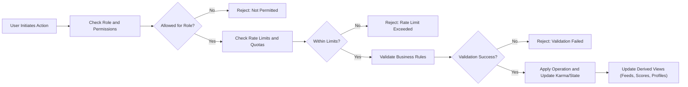

# Business Rules and Validation Requirements for communityPlatform

## 1. Purpose and Scope

THE communityPlatform business rules and validation requirements SHALL define cross-cutting behaviors that apply to communities, posts, comments, profiles, voting, karma, subscriptions, and related interactions.

THE requirements in this document SHALL describe what validations and business constraints the backend must enforce so that behaviors are consistent, predictable, and safe across all features.

THE requirements SHALL avoid any references to specific APIs, database schemas, or infrastructure technologies and SHALL stay at the business-logic level.

## 2. Terminology and Actors

### 2.1 Core Domain Terms

- Community: A named thematic space (similar to a subreddit) where posts are grouped.
- Post: A top-level content item created inside a community, of type text, link, or image-based.
- Comment: A textual response associated with a post or another comment, forming a nested thread.
- Nested reply: A comment whose parent is another comment.
- Vote: A positive (upvote) or negative (downvote) expression on a post or comment.
- Karma: A numerical reputation score derived from votes on a memberUser’s posts and comments.
- Subscription: A relationship where a memberUser follows a community so its posts appear in personalized feeds.
- Profile: A representation of a memberUser’s identity and public activity on communityPlatform.
- Report: A user-submitted flag indicating suspected policy violations.

### 2.2 Actors

- guestUser: Unauthenticated visitor with read-only access to public content.
- memberUser: Registered user who can create content, vote, subscribe, and report.
- adminUser: Platform administrator with elevated moderation and management powers.

WHERE the term user appears without qualification, THE rule SHALL be interpreted as applying to memberUser unless explicitly stated otherwise.

## 3. Global Business Rules

### 3.1 Ownership and Attribution

WHEN a memberUser creates a community, post, or comment, THE system SHALL designate that memberUser as the owner of that entity for business purposes.

WHEN content is displayed, THE system SHALL attribute each post and comment to its owner in a way consistent with privacy and moderation rules.

IF an account is permanently deleted or anonymized, THEN THE system SHALL follow data lifecycle rules to decide whether to anonymize historical ownership indicators while preserving necessary structural information.

### 3.2 Permission and Role-based Actions

WHEN any actor attempts an operation, THE system SHALL verify that the actor’s role (guestUser, memberUser, adminUser) is allowed to perform that operation according to the user-actors and permissions requirements.

IF an actor attempts an operation that their current role is not allowed to perform, THEN THE system SHALL reject the operation due to insufficient permissions and SHALL not execute any part of the requested action.

### 3.3 Visibility and Deletion Semantics

WHEN content (posts or comments) is deleted by its owner, THE system SHALL treat the content as logically deleted and SHALL remove it from standard listing and detail views for regular users.

WHERE the system uses soft deletion for business or moderation reasons, THE system SHALL maintain enough metadata (for example creation time, author reference, community association, and deletion reason category) for auditing, abuse detection, and appeals, without exposing the original content to regular users.

WHEN content is removed by adminUser for policy violations, THE system SHALL distinguish this state from owner-initiated deletion, so that moderation workflows and analytics can differentiate between voluntary removal and enforcement.

### 3.4 Content Policy Compliance

WHEN a user submits or edits any text or link content, THE system SHALL evaluate the content against business-defined policy rules, including prohibited categories such as clearly illegal material, hate, explicit incitement to violence, and other disallowed content.

IF content violates policy rules, THEN THE system SHALL reject the creation or update attempt or SHALL mark the content for moderation and SHALL prevent it from appearing in normal user-facing views as configured by policy.

### 3.5 Global Text Validation

WHEN a user submits text for any business-visible field (such as post title, post body, comment text, community description, profile bio), THE system SHALL:
- Trim leading and trailing whitespace.
- Treat sequences of only whitespace as empty.

IF trimmed text is empty and the field is mandatory, THEN THE system SHALL reject the operation due to missing required content.

WHERE business rules define minimum and maximum lengths for a field, THE system SHALL enforce those limits for all operations that create or update that field.

### 3.6 Time and Ordering Consistency

WHEN time-based comparisons or ordering operations are required (such as sorting by creation time or enforcing edit windows), THE system SHALL use a single consistent notion of current time across all features.

WHERE ordering depends on creation time, THE system SHALL order items in descending order of creation time for "new" views, and SHALL use tie-breaking rules that are deterministic (for example by unique identifier) to avoid non-deterministic results.

### 3.7 Cross-feature Integrity

WHEN an entity transitions to a state that restricts operations (for example a banned community or suspended account), THE system SHALL enforce those restrictions consistently across all features that operate on that entity.

IF a global business rule conflicts with a feature-specific rule, THEN THE system SHALL apply the stricter rule that better protects safety, integrity, and compliance, and product owners SHALL adjust specifications to remove contradictions.

## 4. Content Creation and Editing Rules

### 4.1 General Post and Comment Constraints

WHEN a user creates or edits a post or comment, THE system SHALL validate:
- Ownership and permissions.
- Community status and posting/commenting rules.
- Content policy (prohibited patterns and categories).
- Length constraints for titles and bodies.
- Type-specific requirements (for link and image posts).

IF any validation fails, THEN THE system SHALL reject the operation and SHALL not partially create or update the content.

### 4.2 Post Creation Rules

WHEN a memberUser creates a post, THE system SHALL require:
- A valid target community where posting is allowed.
- A post type: text, link, or image-based.
- A non-empty title that satisfies length rules.
- Type-specific payload (body text, URL, or media reference) that satisfies validation rules.

WHERE the target community is archived, locked, or banned, THE system SHALL reject new post creation attempts in that community.

WHEN a post is successfully created, THE system SHALL associate it with:
- The author memberUser.
- The community.
- The creation timestamp.
- An initial visibility state (for example visible, pending review) consistent with moderation rules.

### 4.3 Post Editing Rules

WHERE business policy defines an editing window for posts, THE system SHALL allow the post owner to edit the post only within that time window after creation.

WHEN a post owner submits an edit request within the allowed window, THE system SHALL validate the new content using the same rules as for post creation.

IF the edit request is outside the allowed window, THEN THE system SHALL reject the edit attempt for the post owner and SHALL allow only adminUser to modify or remove the content as part of moderation.

WHEN a post is edited, THE system SHALL update its content and SHALL record that the post has been edited, including an edit timestamp for business use such as display rules and moderation.

### 4.4 Post Deletion Rules

WHEN a post owner requests deletion of their own post and the post is not locked by moderation, THE system SHALL:
- Mark the post as deleted by the owner.
- Remove the post from user-facing lists and detail views.
- Preserve associations needed for moderation and data lifecycle as configured.

WHEN adminUser removes a post for policy reasons, THE system SHALL:
- Mark the post as removed due to moderation.
- Prevent new comments or votes on the post.
- Ensure that user-facing views either hide the post or show a policy-consistent placeholder.

### 4.5 Comment Creation Rules

WHEN a memberUser creates a comment, THE system SHALL require:
- A valid target post that is visible and open to commenting.
- Optionally, a valid parent comment when creating a nested reply.
- Comment text that satisfies length and content policy rules.

WHERE the target post or parent comment is locked, archived, or removed in a way that disallows new comments, THE system SHALL reject new comment creation attempts referencing that target.

WHEN a comment is successfully created, THE system SHALL associate it with:
- The author memberUser.
- The target post.
- The parent comment, if any.
- The creation timestamp.

### 4.6 Comment Nesting and Depth

WHERE nested comments are supported, THE system SHALL allow replies to comments up to a configurable maximum depth.

WHEN a reply would exceed the maximum depth, THE system SHALL reject the comment creation attempt and SHALL indicate that the nesting limit has been reached.

WHILE a comment is in a visible state, THE system SHALL include it in the representation of the comment tree for its post, ordered according to selected comment sorting rules.

### 4.7 Comment Editing and Deletion Rules

WHERE business policy defines an editing window for comments, THE system SHALL allow a comment owner to edit their comment only within that window.

WHEN a comment owner submits an edit request within the allowed window, THE system SHALL validate the new content with the same text and content policy rules applied to new comments.

IF the edit request is outside the allowed window, THEN THE system SHALL reject the edit attempt for the comment owner and SHALL allow only adminUser to modify or remove the comment.

WHEN a comment owner deletes their comment, THE system SHALL:
- Replace the visible content with an indicator that the comment was deleted by the author.
- Preserve the comment’s place in the thread so that replies remain attached and understandable.

WHEN adminUser removes a comment for policy reasons, THE system SHALL:
- Mark the comment as removed due to moderation.
- Prevent new replies where business rules require.
- Decide, according to policy, whether to show a placeholder or fully hide the comment for regular users.

## 5. Voting and Karma Rules

### 5.1 Voting Eligibility

WHEN a memberUser attempts to vote on a post or comment, THE system SHALL validate that:
- The target post or comment exists.
- The target is visible to that memberUser.
- The target is not locked from voting by moderation or community rules.
- The memberUser is not restricted from voting due to rate limits or abuse controls.

IF any eligibility condition fails, THEN THE system SHALL reject the vote operation and SHALL not update scores or karma.

### 5.2 Vote State and Transitions

THE system SHALL enforce that each memberUser has at most one active vote state per post or comment: upvote, downvote, or no vote.

WHEN a memberUser casts a vote where no prior vote exists for that target, THE system SHALL create a new vote record with the specified direction.

WHEN a memberUser changes a vote from upvote to downvote or from downvote to upvote, THE system SHALL update the existing vote record and adjust the target’s score and the author’s karma accordingly.

WHEN a memberUser removes their vote (for example, toggling back to no vote), THE system SHALL delete or deactivate the existing vote state and adjust the target’s score and karma to remove the previous impact.

WHERE self-voting is disallowed, THE system SHALL prevent a memberUser from voting on their own posts or comments and SHALL not create or update any vote state for such attempts.

### 5.3 Score Calculation Rules

WHEN a vote is applied to a post or comment, THE system SHALL compute the target’s score according to a business-defined function that reflects net community reaction.

WHERE the score is simple net votes, THE system SHALL treat upvotes as positive contributions and downvotes as negative contributions.

WHERE more complex scoring algorithms are used (for example, confidence-based scores), THE system SHALL still ensure that the visible score behaves monotonically with respect to cumulative vote pattern changes (for example, more upvotes should not reduce the visible score).

### 5.4 Karma Updates

WHEN a vote that affects karma is created, changed, or removed, THE system SHALL adjust the content owner’s karma according to business rules.

WHERE different weights apply for upvotes and downvotes, THE system SHALL use the configured increments and decrements consistently across all content types.

IF content is removed or permanently deleted in a way that affects karma, THEN THE system SHALL apply the configured karma adjustments, which may include removing previously granted karma.

WHEN content that was removed is restored, THE system SHALL restore or recompute the associated karma for the owner according to business rules.

### 5.5 Voting Abuse and Integrity

WHERE voting behavior matches abuse patterns defined by policy (for example, mass coordinated voting or vote brigading), THE system SHALL allow adminUser or automated controls to limit further votes from involved accounts or IP ranges.

WHEN voting is restricted for an account due to abuse, THE system SHALL prevent that account from casting or changing votes and SHALL maintain a reason for the restriction for moderation and appeals.

## 6. Community Management Rules

### 6.1 Community Creation Eligibility and Limits

WHEN a memberUser attempts to create a community, THE system SHALL validate that:
- The memberUser account is in good standing (not suspended or banned from community creation).
- The memberUser has not exceeded the allowed community creation quota for the relevant time window.
- The proposed community name and description satisfy naming and content rules.

IF any validation fails, THEN THE system SHALL reject the community creation request and SHALL not create a partial community record.

### 6.2 Community Naming Rules

WHEN a memberUser supplies a community name, THE system SHALL enforce:
- A minimum length that ensures the name is meaningful.
- A maximum length that prevents excessively long names.
- A permitted character set that avoids confusing, invisible, or control characters.

WHEN a community name is compared for uniqueness, THE system SHALL normalize the name (for example case-insensitive comparison and trimming) and SHALL reject a new name that conflicts with any existing community under the normalization rules.

IF a proposed community name contains prohibited phrases (for example, clearly hateful slurs or impersonation of official entities) according to policy, THEN THE system SHALL reject the creation or rename request.

### 6.3 Community Description and Rule Text

WHEN a community description or rule text is created or edited, THE system SHALL enforce maximum length limits and SHALL validate the text against content policy rules.

IF the description or rule text violates policy (for example, includes instructions for prohibited behavior), THEN THE system SHALL reject the update and SHALL not store the offending text.

### 6.4 Community Status and Access Modes

THE system SHALL support distinct conceptual statuses for communities, including at least public, restricted, private, archived, locked, and banned.

WHERE a community is public, THE system SHALL allow any guestUser and memberUser to view its posts and comments, subject to content-level moderation.

WHERE a community is restricted, THE system SHALL limit posting and commenting to authorized members while allowing broader read access where defined by policy.

WHERE a community is private, THE system SHALL restrict both read and write access to authorized members and SHALL not show private communities in public listings or search results for unauthorized actors.

WHEN a community is archived, THE system SHALL prevent new posts and comments while keeping existing allowed content visible according to visibility rules.

WHEN a community is temporarily locked due to policy concerns, THE system SHALL prevent new posts and comments and MAY restrict read access according to configuration.

WHEN a community is banned for severe violations, THE system SHALL prevent all normal user activity (posting, commenting, voting, subscribing) and SHALL remove the community from discovery mechanisms for regular users, while preserving needed data for moderation and legal use.

### 6.5 Subscriptions and Membership

WHEN a memberUser subscribes to a community, THE system SHALL create or confirm a subscription relationship and ensure that future personalized feeds include posts from that community according to feed rules.

WHEN a memberUser unsubscribes from a community, THE system SHALL remove or deactivate the subscription relationship and ensure that future personalized feeds no longer include posts from that community.

WHERE community membership is separate from subscription (for example, private or restricted communities), THE system SHALL ensure that subscription alone does not grant posting or commenting rights without membership, and SHALL enforce membership checks in addition to subscription checks.

## 7. Profile and Identity Rules

### 7.1 Username Rules

WHEN a new memberUser chooses a username, THE system SHALL enforce:
- A minimum and maximum length suitable for display and memorability.
- A permitted character set that avoids confusing or deceptive characters.
- Uniqueness across all active accounts under a normalized form (for example case-insensitive).

IF a username conflicts with an existing one under normalization rules, THEN THE system SHALL reject the proposed username.

IF a username contains prohibited words or suggests impersonation of official entities, THEN THE system SHALL reject the username.

### 7.2 Username Changes

WHERE business policy allows username changes, THE system SHALL enforce:
- A limit on how frequently usernames may be changed.
- The same validation rules as for initial username selection.

IF business policy disallows username changes, THEN THE system SHALL prevent members from changing their usernames after creation.

### 7.3 Profile Visibility

WHEN any actor views a profile, THE system SHALL apply privacy rules to determine which fields are visible:
- Public fields (for example username, public karma, basic join information) SHALL be visible to guestUser and memberUser.
- Sensitive fields (for example contact information, security settings) SHALL only be visible to the account owner and adminUser.

WHEN a memberUser updates optional profile fields such as bio or links, THE system SHALL validate those fields against content and length rules before applying the update.

### 7.4 Account Status and Restrictions

WHERE an account is in good standing, THE system SHALL allow all operations permitted to that role.

WHERE an account is suspended, THE system SHALL prevent the account from performing any privileged operations that require authentication, such as posting, commenting, voting, reporting, or modifying profile data.

WHERE an account is permanently banned, THE system SHALL prevent all authentication-based actions and SHALL follow data lifecycle rules to determine how existing content is presented or anonymized.

WHERE an account is shadow-banned according to policy, THE system SHALL allow the user to appear to post and comment normally from their perspective but SHALL restrict the visibility of their contributions to others in a way defined by moderation rules.

## 8. Rate Limits and Quotas

### 8.1 General Rate Limit Principles

THE system SHALL enforce rate limits on operations that are susceptible to abuse, including posting, commenting, voting, reporting, and community creation.

WHERE rate limits apply, THE system SHALL define per-user windows (for example per minute, per hour, per day) and maximum counts for each operation type.

### 8.2 Posting and Commenting Limits

WHEN a memberUser creates posts, THE system SHALL enforce a maximum number of posts per time window across all communities.

WHEN a memberUser creates comments, THE system SHALL enforce a maximum number of comments per time window across all communities.

WHERE an account is new or has low karma, THE system SHALL apply stricter limits on posts and comments than for established accounts, as defined by business policy.

IF a memberUser exceeds the posting or commenting limit for the current time window, THEN THE system SHALL reject additional creation attempts until the window resets.

### 8.3 Voting Limits

WHEN a memberUser votes on posts and comments, THE system SHALL enforce a maximum number of vote operations per time window to mitigate automated voting.

IF a memberUser exceeds the voting limit, THEN THE system SHALL reject further voting attempts in the current window and SHALL not change vote states for those attempts.

### 8.4 Reporting Limits

WHEN a memberUser submits reports, THE system SHALL enforce a maximum number of reports per time window to reduce report spam.

WHERE a memberUser’s reports are frequently dismissed as malicious or clearly unfounded, THE system SHALL reduce that memberUser’s reporting limits or temporarily disable their ability to file reports.

IF reporting is disabled or limited for a memberUser, THEN THE system SHALL prevent further reports within the relevant time or severity constraints.

### 8.5 Community and Account Creation Limits

WHEN a memberUser creates communities, THE system SHALL enforce a maximum number of community creation operations per time window.

WHERE an account is newly created or unverified, THE system SHALL either restrict community creation entirely or enforce stricter limits.

WHERE the system detects mass account creation attempts from the same source or pattern consistent with automated abuse, THE system SHALL apply protections that limit further registrations from that source according to business rules.

## 9. Cross-cutting Validation and Consistency Rules

### 9.1 Global Uniqueness

WHEN the system validates attributes that must be unique (such as usernames and community names), THE system SHALL apply normalization to avoid duplicates that differ only by case or trivial formatting.

IF a new value conflicts with an existing normalized value, THEN THE system SHALL reject the new value and SHALL not change existing records.

### 9.2 Case and Format Normalization

WHERE identifiers have case-insensitive semantics from a business perspective (such as usernames or community names), THE system SHALL preserve the original case for display but SHALL use a normalized form for comparisons.

WHEN validating structured fields such as URLs, THE system SHALL ensure that they satisfy basic structural criteria (for example scheme and host present) and SHALL reject badly formed inputs.

### 9.3 Uniform Rule Application

THE system SHALL apply the same validation logic for each entity type across all creation and update flows so that equivalent operations cannot bypass business rules through alternate paths.

WHEN business rules are updated, THE system SHALL ensure that new rules are applied consistently to both new and updated content, while historical content is handled according to migration policies defined by product and moderation.

## 10. Combined Flow Diagram (Conceptual)

THE combined flow SHALL guide backend developers in ensuring that every user-initiated action passes through permission checks, rate limits, and business validations before modifying system state.