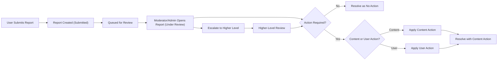

# Reporting and Safety Requirements for communityPlatform

## 1. Introduction

### 1.1 Document Purpose

THE purpose of reporting and safety in communityPlatform SHALL be to describe, in business terms, how reporting, abuse handling, and user safety processes must behave in the communityPlatform service.

THE reporting and safety capabilities of communityPlatform SHALL define what entities can be reported, how reports are processed, how abusive patterns and repeat offenders are handled, and how user safety and privacy are protected.

THE reporting and safety rules in communityPlatform SHALL focus on what the system must do and SHALL not dictate how the system is implemented technically.

### 1.2 Scope

THE reporting and safety behavior in communityPlatform SHALL cover all business behaviors related to:
- User-initiated reporting of content and users.
- Moderator and administrator handling of reports.
- Escalation and resolution of safety-related incidents.
- Policies for detecting and responding to abusive behavior patterns.

THE reporting and safety behavior in communityPlatform SHALL exclude:
- Any description of API definitions or network protocols.
- Any description of data schemas or storage structures.
- Any description of frontend layout or visual design.
- Any reference to specific third-party tools or integrations.

### 1.3 Relationship to Other Requirements

THE reporting and safety behavior in communityPlatform SHALL be consistent with the user actors and permissions defined in the user-actors-and-permissions requirements.

THE reporting and safety behavior in communityPlatform SHALL be consistent with content and moderation rules defined in the content-and-moderation-rules requirements.

THE reporting and safety behavior in communityPlatform SHALL align with functional requirements and non-functional requirements that govern performance and reliability of moderation and reporting flows.

### 1.4 Definitions and Actors

THE following definitions SHALL apply to reporting and safety behavior in communityPlatform:

- "Report" SHALL mean a structured complaint created by an actor about a specific entity for a safety or policy reason.
- "Reporter" SHALL mean the actor who creates a report.
- "Reported entity" SHALL mean the item or user that is the subject of a report.
- "Report reason" SHALL mean the categorical explanation for why a report is submitted.
- "Moderator" SHALL mean a communityModerator responsible for one or more communities.
- "Admin" SHALL mean a platformAdmin responsible for platform-wide enforcement.
- "Member" SHALL mean a memberUser who is authenticated and can participate in communities.
- "Guest" SHALL mean a guestUser who is unauthenticated and may have limited or no ability to report.

THE reporting subsystem of communityPlatform SHALL denote the business logic responsible for accepting, storing, and routing reports.

THE moderation subsystem of communityPlatform SHALL denote the business logic responsible for resolving reports, applying content and user actions, and enforcing safety policies.

## 2. Reporting Overview

### 2.1 Objectives of Reporting and Safety

THE communityPlatform reporting and safety behavior SHALL protect users from harassment, abuse, and harmful content.

THE communityPlatform reporting and safety behavior SHALL enforce both platform-wide rules and community-specific rules.

THE communityPlatform reporting and safety behavior SHALL provide communityModerators and platformAdmins with adequate information and workflows to investigate and resolve reports.

WHEN reports are submitted, THE reporting subsystem SHALL aim to minimize false positives and false negatives by allowing use of detailed reasons and optional free-text descriptions.

### 2.2 Participating Actors and Their Roles

WHERE the actor is a guestUser, THE reporting subsystem SHALL allow that actor to view only those report outcomes that are reflected in visible content states (such as content marked as removed or labeled) and SHALL disallow submitting new reports unless the platform policy explicitly allows anonymous reporting.

WHERE the actor is a memberUser, THE reporting subsystem SHALL allow that actor to submit reports on reportable entities that the actor can view and SHALL allow that actor to view a history of reports submitted by that actor.

WHERE the actor is a communityModerator, THE reporting subsystem SHALL allow that actor to view, triage, and resolve reports related to entities within the communities that actor moderates.

WHERE the actor is a platformAdmin, THE reporting subsystem SHALL allow that actor to view, triage, and resolve any report across all communities and SHALL allow that actor to override communityModerator decisions where platform policy requires.

### 2.3 High-Level Reporting Principles

THE reporting subsystem SHALL separate reporter identity from public visibility and SHALL never expose the reporter identity to the general public.

THE reporting subsystem SHALL allow multiple reports to be created for the same reported entity by different reporters and SHALL preserve each report as a distinct record.

THE reporting subsystem SHALL aggregate reports on the same reported entity for display to moderators and admins to support effective triage.

THE reporting subsystem SHALL preserve a historical record of reports and resolutions for audit and future policy enforcement, subject to data retention rules.

### 2.4 Non-Goals

THE reporting subsystem SHALL not guarantee real-time human review for every report, but SHALL provide clear expectations for response times and SHALL support automatic actions for certain report categories where business policy defines them.

## 3. Reportable Entities and Reasons

### 3.1 Reportable Entities

THE reporting subsystem SHALL support reporting of at least the following entity types:
- Communities.
- Posts.
- Comments.
- Users.

WHEN a report targets a community, THE reporting subsystem SHALL treat that report as related to overall community configuration, content, or behavior.

WHEN a report targets a post, THE reporting subsystem SHALL treat that report as related to the content of a single post and any attached media.

WHEN a report targets a comment, THE reporting subsystem SHALL treat that report as related to the content of a single comment or nested reply.

WHEN a report targets a user, THE reporting subsystem SHALL treat that report as related to the behavior or profile of that user across communities.

### 3.2 Standard Report Reasons

THE platform policy SHALL define a core set of standardized report reasons that apply across communityPlatform, including:
- Spam or irrelevant commercial content.
- Harassment or hate.
- Explicit sexual content.
- Graphic violence.
- Illegal or dangerous activities.
- Misinformation or misleading content.
- Community rule violation or off-topic content.
- Other (free-text explanation required).

THE reporting subsystem SHALL provide a standardized list of report reasons for selection when a report is created.

WHEN a reporter selects the "Other" reason category, THE reporting subsystem SHALL require a free-text explanation.

WHEN a reporter selects a community-specific reason, THE reporting subsystem SHALL store both the community-specific reason and a mapped platform-wide category if such mapping is defined by policy.

### 3.3 Community-Specific Reasons

WHERE a community defines local rules beyond platform-wide policies, THE reporting subsystem SHALL allow communityModerators for that community to configure community-specific report reasons aligned with those local rules.

WHEN community-specific report reasons are configured for a community, THE reporting subsystem SHALL present those reasons as options to reporters when they report content within that community.

IF a communityModerator disables or removes a community-specific report reason, THEN THE reporting subsystem SHALL preserve existing reports that reference that reason and SHALL label those reports as using a legacy reason without preventing access to their details.

### 3.4 Validation and Constraints for Report Submission

THE reporting subsystem SHALL require each report to reference exactly one reported entity.

THE reporting subsystem SHALL require each report to specify at least one report reason from the standardized or community-specific reason lists.

THE reporting subsystem SHALL allow each report to contain optional free-text details that describe the issue, subject to a configurable maximum length.

IF a reporter submits a report without specifying at least one valid reason, THEN THE reporting subsystem SHALL reject the report and SHALL indicate that a reason is required.

IF a reporter submits a report that references a reported entity that is no longer visible due to deletion or sufficient restriction, THEN THE reporting subsystem SHALL reject the report and SHALL indicate that the entity cannot be reported because it is not available.

WHERE a reporter attempts to submit multiple reports for the same reported entity within a short configurable period, THE reporting subsystem SHALL either merge the reports into a single aggregated report record or reject duplicates according to platform rate-limiting rules.

### 3.5 EARS Summary for Reportable Entities and Reasons

WHEN a memberUser is viewing a reportable entity, THE reporting subsystem SHALL allow that memberUser to initiate a report flow for that entity, subject to report rate limits.

WHEN a communityModerator or platformAdmin is viewing a reportable entity, THE reporting subsystem SHALL allow that actor to create internal reports or notes that are not visible to standard users and SHALL store those internal reports for internal tracking.

## 4. Report Handling Workflow

### 4.1 Conceptual Report Lifecycle

THE reporting subsystem SHALL manage each report through a conceptual lifecycle that includes at least the following states:
- Submitted.
- Queued.
- Under Review.
- Resolved - No Action.
- Resolved - Action Taken on Content.
- Resolved - Action Taken on User.
- Escalated.
- Unprocessable.

WHEN a report is created, THE reporting subsystem SHALL assign the report an initial state of Submitted.

WHEN a report becomes available for moderator or admin review, THE reporting subsystem SHALL place the report into a Queued state.

WHEN a moderator or admin begins actively reviewing a report, THE reporting subsystem SHALL mark that report as Under Review.

WHEN a report is resolved, THE reporting subsystem SHALL set the report state to one of the resolved states and SHALL record whether an action was taken on content or on a user.

WHEN a report is escalated from a communityModerator to a platformAdmin, THE reporting subsystem SHALL set the report state to Escalated and SHALL record the escalation metadata.

IF a report cannot be processed because the reported entity data is missing or corrupted, THEN THE reporting subsystem SHALL set the report state to Unprocessable and SHALL store an explanation of the failure.

### 4.2 Report Submission Flow

WHEN a memberUser initiates a report from a visible entity, THE reporting subsystem SHALL pre-fill the report with a reference to that entity and SHALL require the reporter to select at least one reason before accepting the report.

WHEN a report submission passes all validation checks, THE reporting subsystem SHALL persist the report, assign the Submitted state, record the submission timestamp, and acknowledge the submission to the reporter.

IF a reporter attempts to submit a report on a reported entity that the reporter is not permitted to view, THEN THE reporting subsystem SHALL reject the report and SHALL not disclose whether the entity exists.

WHERE platform policy allows guestUser reporting, THE reporting subsystem SHALL treat guestUser reports as anonymous or pseudonymous and SHALL record any non-sensitive identifying information that is available for abuse handling.

### 4.3 Triage and Visibility Rules

WHERE a report targets content within a specific community, THE reporting subsystem SHALL make that report visible to communityModerators for that community and to platformAdmins.

WHERE a report is labeled with platform-level safety reasons such as illegal content or severe abuse, THE reporting subsystem SHALL make that report visible to platformAdmins irrespective of community.

THE reporting subsystem SHALL ensure that reporter identity is visible only to communityModerators for the relevant community, to platformAdmins, and to internal safety staff where applicable.

THE reporting subsystem SHALL ensure that reporter identity is not exposed to standard memberUsers or to the reported user in any user-facing view.

### 4.4 Investigation and Context

WHEN a communityModerator or platformAdmin views a report, THE moderation subsystem SHALL display at least the following information:
- The reported entity type and identifier.
- The community to which the entity belongs, if applicable.
- The content snapshot or profile data as allowed by policy.
- The list of reasons for the report.
- Any free-text descriptions submitted by reporters.
- A summary of past reports for the same entity or the same reported user.

THE moderation subsystem SHALL allow moderators and admins to view past resolved reports related to the same reported entity or reported user to identify patterns.

THE moderation subsystem SHALL allow moderators and admins to add internal notes to a report that are visible only to other moderators and admins.

### 4.5 Resolution Outcomes

THE moderation subsystem SHALL allow the resolver for a report (communityModerator or platformAdmin) to choose from a defined set of resolution outcomes, including at minimum:
- No Action.
- Content Removal.
- Content Restriction (such as labeling as sensitive or limiting to adults).
- User Warning.
- User Temporary Restriction in a community.
- User Temporary Platform-Wide Restriction.
- User Permanent Ban from a community.
- User Permanent Platform-Wide Ban.

WHEN a report is resolved as No Action, THE moderation subsystem SHALL record a justification note for audit purposes.

WHEN a report is resolved with Content Removal, THE moderation subsystem SHALL apply removal actions as defined in content-and-moderation rules and SHALL update the report state to Resolved - Action Taken on Content.

WHEN a report is resolved with Content Restriction, THE moderation subsystem SHALL apply the appropriate visibility or labeling changes and SHALL update the report state to Resolved - Action Taken on Content.

WHEN a report is resolved with a User Warning, THE moderation subsystem SHALL update the user’s violation history and SHALL update the report state to Resolved - Action Taken on User.

WHEN a report is resolved with a User Temporary Restriction, THE moderation subsystem SHALL enforce the restriction for the configured duration and SHALL update the report state to Resolved - Action Taken on User.

WHEN a report is resolved with a User Permanent Ban (community-level or platform-wide), THE moderation subsystem SHALL enforce the ban and SHALL update the report state to Resolved - Action Taken on User.

WHERE platform policy requires notifying reporters of outcomes, THE reporting subsystem SHALL provide reporters with a non-sensitive summary of the outcome (such as "action taken" or "no action"), without disclosing internal details or identities.

### 4.6 Timing Expectations and Automated Actions

WHEN a user submits a report, THE reporting subsystem SHALL respond to the reporter with success or failure within a few seconds under normal operating conditions.

WHILE a report remains in Submitted or Queued state, THE reporting subsystem SHALL make the report available for moderator and admin review within a short delay consistent with near real-time moderation.

WHERE platform policy defines automatic actions for certain report reasons (such as immediate hiding of content for suspected illegal material), THE moderation subsystem SHALL apply those automatic actions as soon as practicable and SHALL flag the report for urgent review.

### 4.7 Aggregation and Reopening of Reports

WHEN multiple reports are submitted about the same reported entity, THE reporting subsystem SHALL aggregate those reports for display to moderators and admins while preserving the individual report records.

WHEN new information arises that may change a resolution, THE moderation subsystem SHALL allow authorized moderators or admins to reopen a previously resolved report by moving the report back to an Under Review state.

WHEN a report is reopened, THE moderation subsystem SHALL preserve all historical actions and SHALL append new actions rather than overwriting old ones.

## 5. Escalation to Moderators and Admins

### 5.1 Allocation of Responsibilities

THE reporting subsystem SHALL assign primary responsibility for reports about community-level rule issues, such as off-topic content or minor rule violations, to communityModerators.

THE reporting subsystem SHALL assign primary responsibility for reports about platform-level safety issues, such as illegal content, cross-community harassment, or severe abuse, to platformAdmins.

WHERE a report contains both community-level and platform-level reasons, THE reporting subsystem SHALL make that report visible to both relevant communityModerators and platformAdmins.

### 5.2 Community-Level Escalation

WHEN a communityModerator encounters a report that exceeds that moderator’s authority or matches platform-level issue categories, THE moderation subsystem SHALL allow that moderator to escalate the report to platformAdmins.

WHEN a communityModerator escalates a report, THE moderation subsystem SHALL mark the report as Escalated, SHALL record the identity of the moderator who escalated it, and SHALL notify platformAdmins conceptually.

WHEN a report is escalated, THE moderation subsystem SHALL preserve original communityModerator notes and SHALL allow platformAdmins to add additional notes and decisions.

### 5.3 Platform-Level Escalation and Aggregation

WHEN a platformAdmin identifies emerging patterns of abuse affecting multiple communities, THE moderation subsystem SHALL allow that admin to link related reports or cases under a common investigation context.

WHEN a platformAdmin resolves a report by applying platform-wide enforcement such as a global ban or global content removal, THE moderation subsystem SHALL ensure that the enforcement is consistently applied across all affected communities.

### 5.4 Moderator Misuse and Conflicts of Interest

WHEN a platformAdmin identifies systematic misuse of moderation powers by a communityModerator, such as arbitrary content removal that conflicts with platform policy, THE moderation subsystem SHALL allow the platformAdmin to restrict or revoke that moderator’s moderation rights.

WHEN content owned by a communityModerator or platformAdmin is reported, THE moderation subsystem SHALL prevent that same moderator or admin from being the sole resolver of reports about their own content.

WHERE conflict-of-interest rules apply, THE moderation subsystem SHALL require that at least one other communityModerator or a platformAdmin resolve the report before it is marked as Resolved.

### 5.5 EARS Summary for Escalation and Role Handling

WHERE the reporter is a memberUser, THE reporting subsystem SHALL ensure that reports submitted by that memberUser are only visible for triage to communityModerators of the relevant community and to platformAdmins, and not to unrelated memberUsers.

WHEN a report is escalated between roles, THE reporting subsystem SHALL update the report state, SHALL record escalation metadata, and SHALL make the report visible to the destination role.

IF a community has no active communityModerators, THEN THE reporting subsystem SHALL route all reports targeting that community directly to platformAdmins for handling.

## 6. User Safety and Abuse Prevention Policies

### 6.1 Safety Principles

THE moderation subsystem SHALL prioritize user safety over content retention when handling reports of severe abuse or illegal content.

THE moderation subsystem SHALL minimize re-exposure of targets to abusive content by ensuring that removed or restricted content is not resurfaced in contexts visible to the targeted users.

### 6.2 Report Rate Limiting and Spam Protection

WHERE a single user submits a large number of reports within a short configurable period, THE reporting subsystem SHALL treat this as potential report spam and SHALL apply rate limits to further report submissions by that user.

WHEN report rate limiting is applied to a user, THE reporting subsystem SHALL prevent that user from creating additional reports during the limitation period and SHALL communicate a business-level explanation indicating that report limits have been reached.

THE reporting subsystem SHALL support configurable thresholds for the number of reports that a single user may submit per defined time window.

IF a user triggers report rate limiting repeatedly over an extended period, THEN THE reporting subsystem SHALL flag that user for potential abuse of the reporting mechanism and SHALL display this flag to moderators and admins reviewing that user’s behavior.

### 6.3 Handling Repeat Offenders

THE moderation subsystem SHALL maintain a conceptual violation history for each user based on resolved reports and applied enforcement actions.

WHEN a user accumulates a configurable number of violations or severe violations within a defined period, THE moderation subsystem SHALL recommend or automatically apply increased enforcement actions such as longer temporary restrictions or permanent bans according to platform policy.

IF a banned user returns using a new account and business rules identify that account as belonging to the same individual, THEN THE moderation subsystem SHALL allow linking of those accounts conceptually and SHALL allow stricter enforcement actions based on the combined violation history.

### 6.4 Protecting Targets of Abuse

WHEN a user is identified as a recurring target of abuse through multiple reports or patterns of harassment, THE moderation subsystem SHALL support limiting direct interactions from users who have been reported for abusive behavior toward that target.

WHERE a user chooses to block interactions from another user, THE moderation subsystem SHALL ensure that the blocked user cannot send direct messages or mentions that generate notifications for the blocking user, subject to platform policy.

### 6.5 Privacy for Reporters and Reported Parties

THE reporting subsystem SHALL keep reporter identity confidential from the reported user and from the general public.

WHEN a report leads to enforcement action on a user, THE moderation subsystem SHALL avoid disclosing detailed reporter information in any messages shown to the reported user.

THE reporting subsystem SHALL store only the minimum necessary personal information in reports to support safety and audit, such as reporter identifiers, timestamps, and reason categories.

### 6.6 Record Keeping and Audit for Safety

THE reporting subsystem SHALL record, for each report, the reporter identity where available, the reported entity, the report reasons, free-text descriptions, creation time, resolution time, final state, and actions taken.

THE reporting subsystem SHALL allow platformAdmins to search and review historical reports and associated actions for audit and policy tuning.

WHILE data retention policies require report data to be retained, THE reporting subsystem SHALL ensure that report data remains accessible to authorized safety and audit personnel.

### 6.7 EARS Summary for Safety and Abuse Prevention

WHEN enforcement actions such as warnings, temporary restrictions, or bans are applied to a user due to resolved reports, THE moderation subsystem SHALL update that user’s conceptual safety profile with the new actions.

IF a user has an active temporary restriction, THEN THE moderation subsystem SHALL prevent that user from performing the restricted actions until the restriction expires.

## 7. Error Handling and Edge Cases in Reporting

### 7.1 Invalid or Duplicate Reports

IF a report is submitted with missing mandatory information such as the reported entity reference or report reason, THEN THE reporting subsystem SHALL reject the report and SHALL return validation feedback indicating the missing information.

IF a user attempts to report the same reported entity repeatedly with identical reasons within a short configurable period, THEN THE reporting subsystem SHALL either merge those reports into a single aggregated report or reject duplicates and SHALL inform the user about duplicate reporting limits.

### 7.2 Reporting Deleted or Hidden Content

IF a report is submitted for content that has already been deleted or permanently removed before report submission, THEN THE reporting subsystem SHALL reject the report and SHALL inform the reporter that the content is no longer available.

IF an existing report targets content that is later deleted or hidden for reasons unrelated to that report, THEN THE reporting subsystem SHALL retain the report record and SHALL mark the content as unavailable in the report context.

### 7.3 Abuse of Reporting Mechanisms

IF a user repeatedly submits reports that are malicious, obviously unfounded, or clearly outside policy categories, THEN THE moderation subsystem SHALL allow moderators or platformAdmins to mark that user as abusing the reporting feature.

WHEN a user is marked as abusing the reporting feature, THE reporting subsystem SHALL support reducing that user’s ability to submit new reports, either temporarily or permanently, according to platform policy.

### 7.4 Conflicting or Anonymous Reports

WHEN multiple reports about the same reported entity contain conflicting descriptions, THE moderation subsystem SHALL present all report details to the reviewing moderator or admin without attempting to automatically reconcile the conflict.

WHERE platform policy allows anonymous reporting, THE reporting subsystem SHALL permit reports without storing an identifiable reporter identity and SHALL still apply rate limiting and abuse detection rules at the level possible with available information.

### 7.5 EARS Summary for Error Handling and Edge Cases

IF a report cannot be associated with any current or historical entity due to data inconsistency, THEN THE reporting subsystem SHALL mark the report as invalid and SHALL keep it in an Unprocessable state for audit.

IF an error occurs during report creation after a reporter has provided input, THEN THE reporting subsystem SHALL ensure that the reporter can retry submission without having to re-enter all details, as far as possible under business constraints.

## 8. Performance and Availability for Reporting and Safety

### 8.1 Responsiveness Requirements

WHEN a user initiates a report, THE reporting subsystem SHALL respond with success or failure feedback within a few seconds under normal load conditions.

WHEN a moderator or admin opens a list of pending reports, THE reporting subsystem SHALL return the list within a few seconds under normal load conditions.

### 8.2 Availability of Reporting Features

WHILE the platform is generally available, THE reporting subsystem and moderation subsystem SHALL also be available so that users can report harmful content at any time.

IF the reporting feature is temporarily unavailable due to maintenance or failure, THEN THE reporting subsystem SHALL provide a business-level message indicating that reporting is temporarily unavailable.

### 8.3 Data Retention for Reports

WHERE platform policy defines a retention period for safety and abuse-related data, THE reporting subsystem SHALL retain report records and associated actions for at least that retention period.

WHERE legal or compliance requirements demand longer retention for specific categories of reports, such as reports of illegal content, THE reporting subsystem SHALL support longer retention for those categories.

## 9. Success Criteria and Metrics for Reporting and Safety

### 9.1 Example Metrics

THE reporting subsystem SHALL support measurement of business-level metrics for reporting and safety, including:
- Time from report submission to first review.
- Time from report submission to final resolution.
- Ratio of valid reports to invalid or abusive reports.
- Number of repeat offenders and time from first violation to restriction.
- Volume of reports per community and per user.

### 9.2 Business-Level Requirements for Metrics

WHEN reports are created and resolved, THE reporting subsystem SHALL store timestamps and classification data sufficient to compute the metrics defined by business policy.

WHERE the business defines target thresholds for reporting and safety metrics, SUCH AS median resolution time for severe reports, THE reporting subsystem SHALL expose data that allows monitoring whether those targets are met.

## 10. Mermaid Diagram – Report Handling Flow

