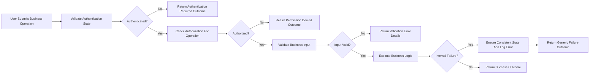

# Error Handling and Edge Cases Requirements for communityPlatform

## 1. Introduction

Error handling and edge-case behavior on **communityPlatform** SHALL be predictable, consistent, and fully aligned with business rules for communities, posts, comments, voting, subscriptions, reporting, moderation, authentication, and profiles.

THE requirements in this document SHALL describe how the system behaves when operations fail or encounter unusual conditions, using business language rather than technical details such as specific API status codes or database errors.

THE document SHALL focus on **what** outcomes must occur in error or edge scenarios so backend developers and QA engineers can design and test the system appropriately.

## 2. Scope and Relationship to Other Documents

THE error-handling specification SHALL apply to:
- Authentication and session flows for guestUser, memberUser, and adminUser.
- Community creation, update, browsing, and status changes.
- Post and comment creation, editing, deletion, viewing, and nesting behaviors.
- Voting and karma updates.
- Sorting and feed retrieval.
- Subscriptions and personalized feeds.
- Reporting inappropriate content and moderation actions.
- Rate limiting and abuse-prevention behaviors.

THE error-handling specification SHALL remain consistent with:
- User actors and permissions requirements.
- Core functional requirements for communities, posts, comments, voting, and feeds.
- Social and engagement requirements (profiles, subscriptions, notifications, search).
- Content moderation and reporting requirements.
- Non-functional requirements and business rules/validation.

THE error-handling specification SHALL NOT introduce:
- API protocols, status codes, or transport details.
- Database schemas, table structures, or storage technologies.
- Frontend layout or visual design decisions.

## 3. General Error Handling Principles

### 3.1 Consistency and Predictability

WHEN communityPlatform handles any failure, THE system SHALL apply consistent rules for similar failure types across all features.

WHEN an operation fails, THE system SHALL provide a single, clear success-or-failure outcome per request from the user perspective.

WHEN the same kind of invalid input or forbidden action occurs in different parts of the platform, THE system SHALL respond with the same category of error outcome.

### 3.2 Separation of Error Types

WHEN an operation fails due to invalid or missing user input, THE system SHALL treat it as a **validation error** and SHALL not treat it as a system failure.

WHEN an operation fails due to lack of authentication or insufficient permissions, THE system SHALL treat it as an **authentication or authorization error** and SHALL not treat it as a validation error.

WHEN an operation fails due to internal problems, dependencies, or infrastructure issues, THE system SHALL treat it as an **internal error** and SHALL not expose internal details to the user.

### 3.3 No Silent Data Loss or Inconsistent Partial Updates

WHEN a multi-step operation fails after some steps have completed, THE system SHALL either:
- Complete the remaining steps so that resulting data is consistent, OR
- Roll back user-visible data to the last consistent business state, according to business rules.

IF the system cannot guarantee consistency after an internal failure, THEN THE system SHALL hide or block access to affected content until consistency is restored or the content is corrected.

WHEN an operation appears successful to the user, THE system SHALL ensure that all related business effects (for example content creation, votes, subscriptions, or reports) are durably applied according to data lifecycle rules.

### 3.4 User-facing Error Communication (Conceptual)

WHEN an operation fails due to invalid input, THE system SHALL return structured information that allows clients to explain which fields or high-level rules were violated in business terms.

WHEN an operation fails due to authentication or authorization, THE system SHALL return structured information that allows clients to indicate that the user is not authenticated or does not have permission for the requested action.

WHEN an operation fails due to internal errors, THE system SHALL return a generic error outcome that does not reveal internal implementation details but indicates that the system encountered an unexpected problem.

### 3.5 Performance Under Error Conditions

WHEN an operation fails due to validation or authorization issues, THE system SHALL respond within the same response-time targets that apply to successful operations for that feature under normal load.

WHEN an operation fails due to internal issues that cannot be resolved quickly, THE system SHALL respond within a maximum of 5 seconds under normal conditions and SHALL avoid leaving the user waiting indefinitely.

### 3.6 Logging and Audit of Errors (Conceptual)

WHEN an error occurs in any business operation, THE system SHALL record a log entry that captures at least the type of operation, broad error category, and time of occurrence, while avoiding storage of unnecessary personal data.

WHEN an error relates to sensitive domains such as authentication, authorization, moderation actions, or data lifecycle operations, THE system SHALL treat corresponding logs as sensitive and SHALL protect them according to security and privacy expectations.

WHEN recurring error patterns appear for a feature, THE system SHALL allow operators to analyze the logs to identify systemic problems or abuse.

## 4. Authentication and Authorization Errors

### 4.1 Unauthenticated Access

WHEN a guestUser attempts an action that business rules restrict to memberUser or adminUser, such as creating communities, posting, commenting, voting, subscribing, or reporting, THE system SHALL reject the action and SHALL indicate that authentication is required.

WHEN a request includes an invalid, expired, or missing authentication token, THE system SHALL treat the actor as guestUser and SHALL deny actions that require authentication.

WHEN a user session has expired due to lifetime or inactivity, THE system SHALL treat subsequent protected actions as unauthenticated and SHALL require the user to log in again.

### 4.2 Unauthorized Access

WHEN a memberUser attempts an action that is reserved for adminUser, such as global moderation operations or platform-level configuration changes, THE system SHALL reject the action and SHALL indicate that the user lacks sufficient permissions.

WHEN a memberUser attempts to edit or delete content that they do not own and do not have explicit moderation rights over, THE system SHALL reject the action and SHALL indicate that the user is not allowed to modify that content.

WHEN a guestUser attempts to access non-public information such as internal moderation queues or detailed user data that requires authentication, THE system SHALL reject the request and SHALL indicate that access is not allowed.

### 4.3 Role and Account Status Changes During Session

IF an authentication token refers to an account that has become banned, suspended, or deactivated since the token was issued, THEN THE system SHALL treat subsequent attempts to perform protected actions as disallowed and SHALL indicate that the account is restricted.

WHEN a user role changes (for example memberUser is elevated to adminUser or adminUser is demoted to memberUser), THE system SHALL ensure that future authorization decisions use the updated role and SHALL not rely on stale role information.

WHEN an account is marked as requiring re-authentication due to security events, THE system SHALL reject protected actions for existing sessions until re-authentication occurs, according to business rules.

### 4.4 Login and Registration Errors

WHEN a user submits registration data that fails validation (such as missing required fields, invalid formats, or non-unique identifiers), THE system SHALL reject the registration attempt and SHALL indicate which high-level validation rules failed.

WHEN a user submits login credentials that do not match any allowed account, THE system SHALL reject the login attempt without revealing whether the username or password was incorrect beyond what business rules permit.

WHEN multiple failed login attempts are detected for a given identifier or source within a short time window, THE system SHALL apply protective behavior such as throttling or temporary lockout and SHALL indicate that login attempts are temporarily limited.

WHEN a password reset process is initiated with information that does not match any eligible account, THE system SHALL avoid confirming whether the account exists and SHALL respond with a generic outcome that does not leak account existence.

## 5. Content-related Errors

### 5.1 Community-related Errors

WHEN a memberUser attempts to create a community with missing or invalid mandatory fields, THE system SHALL reject the community creation and SHALL identify which high-level validations failed (such as invalid name format or description length).

WHEN a memberUser attempts to create a community with a name that already exists or conflicts with uniqueness rules, THE system SHALL reject the request and SHALL indicate that the community name is already taken.

WHEN a user attempts to access a community identifier that does not correspond to any existing community, THE system SHALL indicate that the community is not found.

WHEN a user attempts to access a community that has been archived, locked, or banned according to business rules, THE system SHALL respond according to the community’s state by either treating it as unavailable or clearly indicating that the community is no longer active, consistent with moderation policy.

WHEN a memberUser attempts to post or comment in a community that is read-only, archived, or otherwise configured to block new content, THE system SHALL reject the attempt and SHALL indicate that new content is not allowed in that community.

### 5.2 Post-related Errors

WHEN a memberUser submits a post with missing required fields such as title or type, THE system SHALL reject the post creation and SHALL indicate which fields are missing or invalid.

WHEN a memberUser submits a post with text or title that violates length constraints, THE system SHALL reject the post creation and SHALL indicate that the content is too short or too long according to business rules.

WHEN a memberUser submits a link post with a URL that fails format validation or safety checks, THE system SHALL reject the post and SHALL indicate that the link is not acceptable.

WHEN a memberUser attempts to create a post in a community where they lack posting permission, THE system SHALL reject the request and SHALL indicate that posting is not allowed for that user in that community.

WHEN any actor attempts to view a post that does not exist, THE system SHALL indicate that the post is not found.

WHEN any actor attempts to view a post that has been removed due to author deletion or moderation, THE system SHALL treat the post as unavailable and SHALL, where policy permits, indicate that it was removed without revealing sensitive reasons.

WHEN a memberUser attempts to edit their own post after the allowed editing window has passed, THE system SHALL reject the edit and SHALL indicate that the post is no longer editable.

WHEN a memberUser attempts to delete a post that they do not own and do not have moderation rights over, THE system SHALL reject the deletion and SHALL indicate that the user cannot delete that post.

### 5.3 Comment and Nested Reply Errors

WHEN a memberUser submits a comment or reply with text that is empty or only whitespace, THE system SHALL reject the comment creation and SHALL indicate that the comment content is required.

WHEN a memberUser submits a comment that exceeds the maximum allowed length, THE system SHALL reject the comment and SHALL indicate that the content is too long.

WHEN a memberUser attempts to comment on a post that does not exist or is no longer visible to that user, THE system SHALL reject the comment and SHALL indicate that the target post is unavailable.

WHEN a memberUser attempts to reply to a comment that does not exist or is no longer visible, THE system SHALL reject the reply and SHALL indicate that the parent comment is unavailable.

WHEN a memberUser attempts to reply at a depth that exceeds the configured maximum nesting level, THE system SHALL reject the reply and SHALL indicate that the maximum reply depth has been reached.

WHEN a memberUser attempts to edit a comment after the allowed editing window has passed, THE system SHALL reject the edit and SHALL indicate that the comment is no longer editable.

WHEN a memberUser attempts to delete a comment that they do not own and do not have moderation rights over, THE system SHALL reject the delete action and SHALL indicate that the user cannot delete that comment.

WHEN a parent post or comment is locked for new replies, THE system SHALL reject new comment or reply attempts tied to that parent and SHALL indicate that commenting is locked.

### 5.4 Voting and Karma Errors

WHEN a memberUser attempts to vote on a post or comment that is not visible to them due to permissions, deletion, or moderation, THE system SHALL reject the vote and SHALL indicate that the target is unavailable.

WHEN a memberUser attempts to vote on their own post or comment in violation of self-voting rules, THE system SHALL reject the vote and SHALL indicate that voting on own content is not allowed.

WHEN a memberUser attempts to submit a vote that does not change their existing vote state (for example repeated upvotes), THE system SHALL treat the action as idempotent and SHALL not double-count the vote or change karma.

WHEN an internal problem prevents the safe update of vote counts or karma while processing a vote, THE system SHALL prevent partially updated state from being exposed and SHALL either fully apply the vote or fully reject it, consistent with business rules.

### 5.5 Sorting and Feed Errors

WHEN a user requests a sort mode that is not supported (for example an invalid sort key or invalid time range parameter), THE system SHALL reject the request or fall back to a default sort mode, and SHALL indicate that the requested sort parameters are not valid.

WHEN a feed cannot be generated because all content is filtered out by visibility, moderation, or other constraints, THE system SHALL return an empty feed without error and MAY indicate that no content matches the current criteria.

WHEN load or internal issues temporarily prevent computation of a complex sort mode such as hot or controversial, THE system SHALL either fall back to a simpler, supported mode such as new or SHALL clearly indicate that the feed cannot be loaded at this time, in line with business policy.

### 5.6 Subscription Errors

WHEN a memberUser attempts to subscribe to a community that does not exist or is banned or otherwise unavailable, THE system SHALL reject the subscription and SHALL indicate that the community cannot be subscribed to.

WHEN a memberUser attempts to subscribe to more communities than the configured maximum, THE system SHALL reject additional subscriptions and SHALL indicate that a subscription limit has been reached.

WHEN a memberUser attempts to unsubscribe from a community to which they are not currently subscribed, THE system SHALL treat the operation as idempotent and SHALL return a final state indicating that the user is not subscribed, without treating it as an error.

WHEN a memberUser with restricted account status (for example suspended) attempts to modify subscriptions contrary to policy, THE system SHALL reject the subscription changes and SHALL indicate that the account is restricted.

### 5.7 Reporting Inappropriate Content Errors

WHEN a memberUser attempts to submit a report without selecting a required reason category, THE system SHALL reject the report and SHALL indicate that a reason category is required.

WHEN a memberUser attempts to submit a report for content that does not exist or is already fully removed, THE system SHALL reject the report and SHALL indicate that the target is unavailable.

WHEN a memberUser attempts to report the same content with the same reason more often than allowed by reporting rules, THE system SHALL reject additional reports and SHALL indicate that duplicate reports are not accepted.

WHEN a guestUser attempts to submit a report, THE system SHALL reject the attempt and SHALL indicate that reporting requires authentication.

WHEN a memberUser who has been restricted from using reporting features attempts to submit a report, THE system SHALL reject the report and SHALL indicate that the account cannot submit reports.

## 6. Rate Limit and Abuse-related Errors

### 6.1 General Rate Limiting Behavior

WHEN a user performs an action subject to rate limiting (such as posting, commenting, voting, reporting, or authentication attempts) more frequently than the configured threshold, THE system SHALL reject further attempts within the current time window and SHALL indicate that the action has been performed too often.

WHEN rate limits apply at the account level, THE system SHALL enforce them consistently across all devices and sessions for that account.

WHEN rate limits apply at a broader scope such as IP or device, THE system SHALL enforce them without revealing information about other users who may share that scope.

### 6.2 Abuse and Spam Protections

WHEN the system detects patterns classified as abuse or spam (such as mass posting of similar content, vote manipulation, or mass reporting), THE system SHALL apply additional protective measures such as stricter limits, temporary restrictions, or forced review by adminUser.

WHEN a user is under an abuse-related restriction, THE system SHALL reject disallowed operations and SHALL indicate that the account is temporarily limited or restricted.

WHEN an adminUser removes or modifies restrictions resulting from abuse detection, THE system SHALL ensure that future operations for that user follow the updated restriction state.

### 6.3 Edge Cases in Shared Environments

WHEN rate limits are exceeded in a context where multiple users share the same technical environment (for example shared device, shared network), THE system SHALL enforce limits but SHALL not expose personal information about other users or the exact limit conditions.

WHEN a legitimate user is impacted by broad-scope rate limits, THE system SHALL still enforce those limits but MAY provide a generic explanation that platform protections are active without exposing internal thresholds.

## 7. Recovery and Retry Behaviors

### 7.1 Idempotent Operations

WHEN a memberUser repeats an operation that is business-wise idempotent (such as unsubscribing from a community they are already unsubscribed from, canceling a pending subscription request, or reapplying the same vote state), THE system SHALL return a result reflecting the final state without creating duplicates.

WHEN a client retries a create operation after receiving an unclear outcome due to network problems, THE system SHALL handle the retry such that at most one instance of the underlying business entity is created, or the client is informed that the entity already exists, according to business rules.

### 7.2 User-initiated Retries After Failures

WHEN a failure is clearly caused by transient internal issues or temporary overload, THE system SHALL allow users to retry the operation after a reasonable interval and SHALL not permanently block the operation based solely on temporary failures.

WHEN a validation error occurs, THE system SHALL expect that retry attempts will include corrected input and SHALL validate the new submission independently.

### 7.3 Internal Retries and Consistency (Conceptual)

WHEN the backend performs internal retries to complete multi-step business operations, THE system SHALL ensure that, from the user’s perspective, each request results in a single clear outcome: success or failure.

WHEN internal retries still cannot complete an operation, THE system SHALL present a failure outcome and SHALL record sufficient information for operators to diagnose the problem, while avoiding exposure of sensitive internal details.

## 8. Edge Cases by Domain Area

### 8.1 User Accounts and Status Changes

WHEN an account transitions to a restricted state (such as suspended, banned, or read-only) while the user is active, THE system SHALL allow already-completed operations to remain in their existing state and SHALL reject new operations that are no longer allowed for that account.

WHEN an account is scheduled for deletion, THE system SHALL prevent creation of new content or changes to sensitive settings once the account enters a state where new content is not allowed, according to data lifecycle rules.

WHEN an account is reactivated after a restriction or deactivation, THE system SHALL allow operations that are again permitted and SHALL ensure that previously blocked operations do not resume automatically unless explicitly retried.

### 8.2 Communities

WHEN a community switches from active to archived or locked, THE system SHALL allow viewing of existing content according to policy and SHALL reject new posts and comments that conflict with the new state.

WHEN a community is renamed according to business rules, THE system SHALL treat requests using the old community identifier according to configuration (for example redirecting or indicating that the community has moved) and SHALL avoid responses that make it appear as if the community was silently deleted.

WHEN a community is banned or removed for severe policy violations, THE system SHALL prevent new posts, comments, votes, or subscriptions in that community and SHALL treat it as unavailable for user-facing operations, consistent with moderation policy.

### 8.3 Posts and Comments

WHEN a post is removed while users are attempting to interact with it (such as adding comments or votes), THE system SHALL reject new interactions initiated after removal and SHALL indicate that the post is no longer available.

WHEN a comment is removed while users are attempting to reply or vote on it, THE system SHALL reject new interactions and SHALL indicate that the comment is no longer available.

WHEN a comment tree contains deleted parents and visible children, THE system SHALL display children according to visibility rules and SHALL avoid errors when retrieving or traversing the thread.

### 8.4 Voting State and Concurrency

WHEN users submit concurrent vote changes on the same content, THE system SHALL ensure that the final vote and karma state reflects a consistent outcome that matches one valid sequence of vote changes.

WHEN a vote is removed or reset concurrently with another vote change, THE system SHALL avoid ending in a contradictory state such as both upvoted and downvoted by the same user.

WHEN vote recalculation logic fails or is delayed, THE system SHALL avoid exposing obviously inconsistent scores (for example negative vote counts where business rules prohibit them) and SHALL correct them as soon as normal processing resumes.

### 8.5 Reporting and Moderation

WHEN a report targets content that is removed before the report is reviewed, THE system SHALL treat the report according to moderation policy (for example resolving it automatically or marking it as addressed) without causing user-visible errors for the reporter.

WHEN a reporter no longer has access to the reported content due to privacy or moderation changes, THE system SHALL still allow the reporter to see high-level report status where allowed but SHALL not reveal restricted content details.

WHEN moderation actions conflict (for example two admins take different actions on the same content nearly simultaneously), THE system SHALL enforce a deterministic resolution order and SHALL ensure that the final content state and report state are consistent with the chosen business precedence rules.

## 9. User Experience and Error Messaging Expectations

WHEN clients display errors, THE system SHALL provide error information categorized broadly as validation, authentication, authorization, rate limit, not found, conflict, or internal error so that clients can map categories to localized messages.

WHEN an error involves sensitive domains such as security or moderation decisions, THE system SHALL avoid exposing internal reasoning or configuration values in error categories or messages.

WHEN clients require localization, THE system SHALL provide stable error categories and fields that can be mapped to localized texts on the client side without depending on backend message wording.

## 10. Performance Expectations Under Error Conditions

WHEN errors occur due to invalid user input, THE system SHALL detect and report these errors before performing unnecessary heavy processing.

WHEN rate limiting or abuse protection blocks an operation, THE system SHALL fail the request quickly, without performing non-essential business logic.

WHEN internal failures occur that cannot be resolved quickly, THE system SHALL fail fast within the upper time bound defined in non-functional requirements and SHALL avoid long, unbounded waits.

## 11. Compliance, Security, and Audit Considerations for Errors

WHEN errors occur in domains subject to regulatory or policy requirements (such as data access, deletion, moderation actions, or authentication), THE system SHALL log enough information to support later audits and investigations, while following data minimization principles.

WHEN storing or processing error-related data that includes personal information, THE system SHALL treat it as sensitive and SHALL handle it according to privacy and data lifecycle requirements.

WHEN admins or operators review error logs, THE system SHALL restrict access to authorized personnel only and SHALL avoid exposing unnecessary personal information in log views.

## 12. Example Error Handling Flow Diagram

## 13. Summary

THE error handling and edge-case requirements for communityPlatform SHALL ensure that every business operation either completes successfully with consistent data or fails in a clear, predictable, and auditable way.

THE system SHALL distinguish between validation, authentication, authorization, not found, rate limit, and internal errors and SHALL treat each category according to the behaviors described in this document.

THE system SHALL give backend developers and QA engineers enough specificity to implement and test robust error handling without constraining technical choices for implementation details such as APIs, storage, or infrastructure.