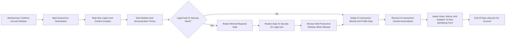

# Data Lifecycle and Privacy Requirements for communityPlatform

## 1. Introduction and Purpose

THE data handling behavior for communityPlatform SHALL protect user privacy, support legal compliance, and preserve platform integrity while enabling a Reddit-like community experience.

THE data lifecycle SHALL cover how data is created, used, updated, retained, deleted, and anonymized for all core features such as communities, posts, comments, voting, subscriptions, reports, profiles, and moderation.

THE data handling behavior SHALL avoid prescribing specific technical storage or database designs, while remaining precise enough that backend developers can implement compliant behavior.

## 2. Actors and Data Categories

### 2.1 Actors in Data Handling Context

- guestUser: Unauthenticated visitor who can browse public content but has no persistent identity in stored account data.
- memberUser: Registered user with a persistent account, profile, content, and interaction history.
- adminUser: Platform administrator with extended access to moderation and audit information.

THE data handling behavior SHALL apply different visibility and control rules for each actor type according to their role.

### 2.2 Data Categories and Sensitivity

THE platform SHALL conceptually classify data into the following categories:

- Account identity data: Identifiers and credentials used for authentication and account management.
- Profile and public identity data: Information that represents the user on the platform (username-like identifiers, bios, avatar references, karma summaries).
- Community data: Names, descriptions, rules, and status of communities.
- Content data: Posts and comments, including titles, bodies, links, and references to images.
- Interaction data: Votes, subscriptions, saves, hides, and similar engagement signals.
- Moderation and reporting data: Reports, decisions, warnings, bans, appeals, and related metadata.
- Operational and security logs: Records of authentication events, configuration changes, and sensitive operations.
- Analytics and aggregated metrics: Aggregated, anonymized usage statistics.
- Support and communication data: User support requests and system notifications as stored for reference.

WHERE data is account identity data, moderation data, or security logs, THE platform SHALL treat it as high sensitivity.

WHERE data is public content or profile data, THE platform SHALL treat it as medium sensitivity and SHALL still protect it from misuse and unnecessary exposure.

WHERE data is analytics and aggregated metrics that cannot reasonably be re-linked to individuals, THE platform SHALL treat it as low sensitivity.

## 3. Global Data Lifecycle Principles

### 3.1 Data Minimization and Purpose Limitation

THE platform SHALL collect only data that is necessary to provide the Reddit-like community experience, support security, and fulfill legal obligations.

WHEN any new feature requires additional data, THE platform SHALL document the purpose and SHALL ensure that data is not reused for incompatible purposes.

### 3.2 Consistent Lifecycle Stages

THE platform SHALL conceptually handle each data category using these lifecycle stages:

- Creation: Data is first recorded as a result of user or system actions.
- Normal use: Data is read, displayed, and processed to support platform features.
- Update: Data is modified by users or admins according to business rules.
- Soft deletion or hiding: Data is removed from ordinary user views but retained for audit and integrity.
- Hard deletion or anonymization: Data is irreversibly removed or disconnected from individual identities when retention periods expire.

WHEN a data item changes stage, THE platform SHALL ensure that all dependent features respect the new stage.

## 4. Category-specific Lifecycle Requirements

### 4.1 Account Identity Data

WHEN a visitor completes registration and becomes a memberUser, THE platform SHALL create account identity data including at least a stable internal account identifier and required login credentials.

WHEN a memberUser updates editable identity data such as contact information or password, THE platform SHALL update the stored data and SHALL preserve minimal historical data needed for security and audit, such as the fact and time of the change.

IF a memberUser requests account deletion, THEN THE platform SHALL mark the account as scheduled for deactivation and SHALL begin the account lifecycle for deletion while preserving any data required for security, fraud prevention, or legal compliance.

WHILE an account is scheduled for deletion and within a defined grace period, THE platform SHALL prevent new content contributions from that account and SHALL allow only limited access necessary to confirm or cancel deletion, if cancellation is allowed by business policy.

WHEN the grace period has ended and no legal or security hold applies, THE platform SHALL hard-delete or anonymize account identity data so that the account can no longer authenticate or be used to identify the memberUser in normal operations.

### 4.2 Profile and Public Identity Data

WHEN a memberUser sets or updates profile attributes such as display name, avatar reference, or bio, THE platform SHALL store the new values and SHALL replace older values in the public view.

WHEN profile data is publicly visible, THE platform SHALL ensure that only intended public fields are exposed to guestUser and other memberUser actors.

IF a memberUser deletes their account, THEN THE platform SHALL remove profile data from public views and SHALL either delete or pseudonymize it internally so that it cannot be used to identify the memberUser in general features.

WHERE profile data is needed for moderation or legal purposes, THE platform SHALL retain only the minimal subset required (for example a record that an account existed, and that it was banned) and SHALL not use this retained data for personalization or recommendations.

### 4.3 Community Data

WHEN a memberUser or adminUser creates a community, THE platform SHALL record community identity, descriptive fields, ownership, and creation time.

WHEN a community owner or adminUser updates community metadata such as description and rules, THE platform SHALL apply the changes for future use and SHALL retain a minimal history for moderation and abuse investigation.

IF a community is archived or closed, THEN THE platform SHALL stop accepting new posts and comments in that community while allowing continued access to historical content according to visibility rules.

IF a community is permanently removed for policy reasons, THEN THE platform SHALL remove it from search, discovery, and direct navigation and SHALL apply the content lifecycle rules to its posts and comments.

### 4.4 Content Data (Posts and Comments)

WHEN a memberUser creates a post or comment, THE platform SHALL record the content, the author, the community, and timestamps, and SHALL initialize visibility according to community and moderation rules.

WHEN a memberUser edits a post or comment within allowed conditions, THE platform SHALL update the visible content and SHALL record that the content was edited, while retaining minimal historical information to support moderation and abuse investigations.

IF a memberUser deletes their own post, THEN THE platform SHALL remove that post from normal content listings for guestUser and memberUser and SHALL either replace it with a deletion marker or remove it from view entirely, consistent with the comment and thread behavior rules.

IF a memberUser deletes their own comment, THEN THE platform SHALL replace the visible text with a deletion indicator and SHALL preserve the thread structure so that replies remain understandable.

WHEN an adminUser removes posts or comments for policy violations, THE platform SHALL mark the content as removed by moderation and SHALL preserve the original content and metadata for a defined retention period to support appeals, audits, and legal inquiries.

WHEN the retention period for moderated content expires and no legal hold is active, THE platform SHALL permanently delete or anonymize the underlying content while maintaining only aggregate or anonymized metrics if needed.

### 4.5 Interaction Data (Votes, Subscriptions, Saves)

WHEN a memberUser casts a vote on a post or comment, THE platform SHALL record that interaction in a way that supports unique voting per user per item and SHALL use it to compute scores and karma.

WHEN a memberUser changes or removes a vote, THE platform SHALL update the stored interaction and adjust any derived metrics such as karma and ranking accordingly.

WHEN a memberUser subscribes to or unsubscribes from a community, THE platform SHALL update subscription records and SHALL ensure that personalized feeds and notifications reflect the current subscription state.

IF a memberUser account is deleted or fully anonymized, THEN THE platform SHALL remove or anonymize direct links between the memberUser identity and specific interaction records while allowing retention of aggregated scores that no longer identify the memberUser.

### 4.6 Moderation and Reporting Data

WHEN a memberUser submits a report on content or on another user, THE platform SHALL record the report with reporter identity, target, category, and timestamp.

WHEN an adminUser reviews and updates a report (for example from open to resolved or dismissed), THE platform SHALL store the decision, the action taken, and any relevant notes.

WHERE a report leads to enforcement action such as content removal or user restriction, THE platform SHALL retain report and decision data for a period sufficient to handle appeals, support legal inquiries, and analyze repeated violations.

WHEN the retention period for resolved and non-critical moderation cases expires, THE platform SHALL delete or anonymize personal identifiers in the related moderation records while retaining aggregated statistics used for platform health monitoring.

### 4.7 Operational and Security Logs

WHEN authentication events, password changes, or high-impact admin actions occur, THE platform SHALL record security-relevant logs including the event type, time, and limited contextual metadata necessary for security monitoring.

WHERE security logs contain IP addresses or other identifiers, THE platform SHALL treat them as high sensitivity data and SHALL protect them with strict access controls.

WHEN security logs reach the end of their configured retention period and are not under legal hold, THE platform SHALL delete them or anonymize identifying elements while keeping aggregate statistics where needed.

### 4.8 Analytics and Aggregated Metrics

WHEN usage analytics are calculated, THE platform SHALL ensure that analytics datasets are anonymized or aggregated so that individual memberUser identities cannot be reasonably inferred.

WHERE analytics are properly anonymized, THE platform SHALL allow longer-term retention of aggregated metrics for business analysis.

IF any analytics dataset still contains residual identifiers or linkable information, THEN THE platform SHALL treat it as identifiable data and apply stricter retention and access rules until anonymization is complete.

### 4.9 Support and Communication Data

WHEN a memberUser opens a support request or receives a system notification that is stored for reference, THE platform SHALL record the content of the communication and the relationships to the involved users.

WHEN support cases are resolved and reach the end of their defined retention period, THE platform SHALL delete or anonymize communication content while maintaining minimal non-identifying metrics, such as counts and categories of support issues.

## 5. Privacy, Visibility, and User Control

### 5.1 Public vs Private Data

WHERE posts and comments are created in public communities, THE platform SHALL treat their content as public from a visibility perspective and SHALL allow guestUser to view them, subject to moderation and community rules.

WHERE profile data is explicitly public (such as usernames and karma indicators), THE platform SHALL make this data visible in profiles and content listings while avoiding exposure of contact details or security-related data.

WHERE operational logs, account identity data, and moderation records exist, THE platform SHALL restrict them to adminUser and authorized operational personnel only.

### 5.2 User Access to Their Data

WHEN a memberUser views their account or profile settings, THE platform SHALL provide a clear summary of the main data held about that memberUser, such as identifiers, profile information, and key preferences.

WHERE a memberUser requests a more complete export of their personal data, THE platform SHALL provide a mechanism to request and receive that data in a structured, machine-readable form within business-defined timeframes, subject to authentication and rate limits.

### 5.3 Correction and Update Rights

WHEN a memberUser updates editable data about themselves, including profile and certain account settings, THE platform SHALL apply the update promptly and SHALL ensure that subsequent operations reflect the new data.

IF a requested update would violate business rules (for example, a username that infringes on naming policies), THEN THE platform SHALL reject the change and SHALL explain in business terms why the update is not allowed.

### 5.4 Deactivation and Deletion

WHEN a memberUser initiates account deactivation, THE platform SHALL transition the account to a deactivated state where login-dependent actions are blocked but core data remains retained according to policy.

WHEN a memberUser confirms that their account should be permanently deleted, THE platform SHALL remove the account from normal operation, SHALL stop further processing of personal data for standard product features, and SHALL start deletion or anonymization workflows for all related data categories.

IF complete deletion of certain records would conflict with legitimate security or legal interests, THEN THE platform SHALL retain only the minimal necessary data, mark it as restricted to those purposes, and SHALL not use it for personalization, ranking, or general analytics.

### 5.5 Control over Authored Content

WHEN a memberUser deletes their own posts or comments, THE platform SHALL remove them from regular browsing views for other users and SHALL apply retention rules for the underlying content.

WHERE legal or community policy requires that some content remain available (for example, evidence of serious abuse), THE platform SHALL prevent full deletion while allowing removal from normal feeds and SHALL clearly mark such content as removed or restricted.

WHEN a memberUser edits content to remove personal information, THE platform SHALL treat the new version as the authoritative public version and SHALL retain only minimal prior content snapshots needed for moderation or legal obligations.

## 6. Compliance, Legal Holds, and Regional Variation

### 6.1 General Compliance Principles

THE platform SHALL support implementation of applicable data protection principles including lawfulness, fairness, transparency, data minimization, purpose limitation, and storage limitation.

WHERE regional laws grant specific user rights such as access, rectification, deletion, or portability, THE platform SHALL support implementing workflows to honor those rights in a consistent manner.

### 6.2 Legal Holds

WHEN a legal hold is applied to certain data (for example content or logs related to an investigation), THE platform SHALL override the normal retention-based deletion schedule for the held data and SHALL preserve it until the hold is explicitly lifted.

WHEN a legal hold is lifted, THE platform SHALL resume normal retention and deletion behavior for the affected data.

### 6.3 Regional Differences

WHERE platform usage spans multiple regions with different data protection rules, THE platform SHALL allow configuration of region-specific retention periods, deletion behaviors, and user rights workflows.

WHEN a memberUser is subject to stricter regional protections, THE platform SHALL treat that memberUser’s data according to the stricter rule set.

### 6.4 Consent and Legitimate Interests

WHERE specific data processing operations rely on explicit user consent (for example certain kinds of notifications or analytics beyond core operations), THE platform SHALL record the consent status, SHALL allow the memberUser to withdraw consent, and SHALL stop the consent-based processing after withdrawal.

WHERE data processing is based on legitimate interests of the platform (such as preventing abuse or measuring basic engagement), THE platform SHALL apply such processing in a way that does not override fundamental user rights, and SHALL respect opt-outs where applicable.

## 7. Non-functional Expectations for Data Lifecycle Operations

WHEN a memberUser updates account or profile data under normal load, THE platform SHALL apply the changes so that subsequent requests reflect the new data within a time that feels immediate to the user.

WHEN a memberUser initiates account deletion, THE platform SHALL acknowledge the request immediately and SHALL complete the logical deactivation phase promptly, while background deletion or anonymization steps proceed within configured retention and processing windows.

WHEN a memberUser requests data export, THE platform SHALL complete the export within a business-defined timeframe that balances operational feasibility with user expectations, and SHALL inform the user about progress or completion.

IF a data lifecycle operation such as deletion or export fails due to temporary system constraints, THEN THE platform SHALL retry or queue the operation and SHALL avoid giving a false impression that the operation completed successfully.

## 8. Conceptual Data Lifecycle Flow

## 9. Summary of Key Testable Requirements

WHEN users create, update, or delete data, THE platform SHALL respect category-specific lifecycle rules and SHALL maintain data consistency across related features.

WHEN retention periods expire and no legal hold is active, THE platform SHALL delete or anonymize data so that it can no longer be used to identify individual memberUser actors in normal platform behavior.

WHEN memberUser exercise rights to access, correct, export, or delete their data, THE platform SHALL provide mechanisms to honor those rights within defined timeframes and SHALL apply the results consistently across all relevant data categories.

WHERE sensitive data such as account identity, moderation records, and security logs exists, THE platform SHALL restrict access to adminUser and authorized personnel, SHALL apply stricter retention controls, and SHALL not expose this data in general user features.

WHERE analytics and aggregated metrics are used for business insights, THE platform SHALL ensure that such datasets are anonymized or aggregated enough that individual users are not reasonably identifiable from them.