# Prisma Markdown

> Generated by [`prisma-markdown`](https://github.com/samchon/prisma-markdown)

- [Systematic](#systematic)
- [Actors](#actors)
- [Catalog](#catalog)
- [Carts](#carts)
- [Orders](#orders)
- [Payments](#payments)
- [RefundsAndDisputes](#refundsanddisputes)
- [Reviews](#reviews)
- [SellerPortal](#sellerportal)
- [Admin](#admin)
- [Analytics](#analytics)
- [default](#default)

## Systematic

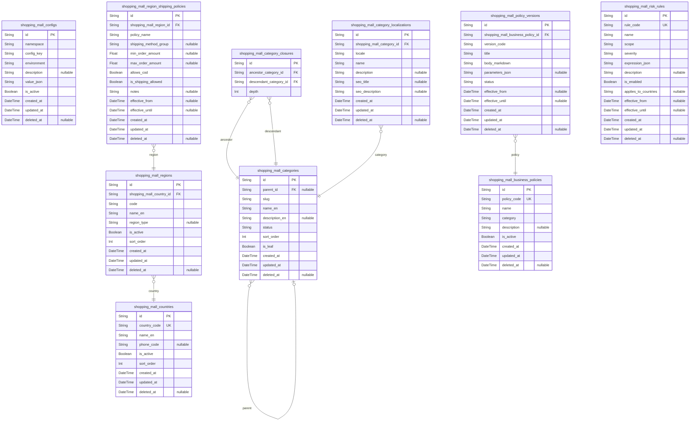

### `shopping_mall_configs`

Global configuration sets for the shoppingMall platform.

Represents named configuration groups and key/value style configuration
documents that control behavior across multiple domains such as feature
flags, thresholds, and default limits.

Configs are referenced logically by name or environment from application
code rather than through foreign keys from business entities. Multiple
configurations can coexist for different environments (for example
production vs staging) while only one is active per environment and key
at a time.

Historical changes are tracked by updated_at timestamps and soft deletion
rather than separate snapshot tables, because business requirements
emphasize current effective values and auditability over full temporal
reconstruction.

Properties as follows:

- `id`: Primary key. Unique identifier of the configuration set.
- `namespace`
  > Logical namespace grouping for this configuration set.
  > Examples: "checkout", "catalog", "reviews", "risk".
  > Used to avoid key collisions and to group related configuration entries.
- `config_key`
  > Business-level key identifying a particular configuration within the
  > namespace.
  > Together with namespace and environment, this uniquely identifies a
  > configuration document.
- `environment`
  > Environment where this configuration applies.
  > Typical values include "production", "staging", or "development".
  > Allows the platform to maintain different configuration values per
  > environment.
- `description`
  > Human-readable description of what this configuration controls.
  > Used by admins and operators to understand the impact of changes.
- `value_json`
  > Configuration payload encoded as JSON text.
  > Stores structured parameters such as thresholds, booleans, and feature
  > flags.
  > Application code is responsible for validating and interpreting this JSON.
- `is_active`
  > Indicates whether this configuration entry is currently considered active.
  > Inactive entries are kept for historical reference but are ignored by
  > runtime configuration loaders.
- `created_at`: Timestamp when this configuration entry was first created.
- `updated_at`: Timestamp when this configuration entry was last updated.
- `deleted_at`
  > Soft deletion timestamp.
  > When set, the configuration is considered logically removed but retained
  > for audit and rollback scenarios.

### `shopping_mall_countries`

Master data for countries used across the shoppingMall platform.

Defines the set of supported countries for customer addresses, shipping
destinations, tax handling, and regional reporting.

Other components reference this table via foreign keys (for example
customer addresses, warehouses, and seller configurations), but this
model itself does not depend on downstream tables, keeping the
foundational layer free of cyclic references.

Each country is identified by a stable ISO-like code and has display
names and status flags to control availability.

Properties as follows:

- `id`: Primary key. Unique identifier of the country record.
- `country_code`
  > Canonical country code, typically an ISO 3166-1 alpha-2 or alpha-3 code.
  > Used as a stable business identifier across the platform.
- `name_en`
  > Country name in English used as the default display value when no
  > localization is applied.
- `phone_code`
  > Optional international calling code prefix for the country.
  > Used in phone number formatting and validation where needed.
- `is_active`
  > Indicates whether this country is currently enabled for use in addresses,
  > shipping, and related flows.
- `sort_order`
  > Integer value used to control display ordering in country selection lists.
  > Lower values are typically shown first.
- `created_at`: Timestamp when this country record was created.
- `updated_at`: Timestamp when this country record was last updated.
- `deleted_at`
  > Soft deletion timestamp.
  > When set, the country is logically removed from selection lists but
  > retained for historical reference in orders and addresses.

### `shopping_mall_regions`

Sub-national or logical regions used for shipping, pricing, risk
segmentation, and policy scoping.

Each region belongs to exactly one country and may represent states,
provinces, or custom business-defined regions such as "EU-West" or "Metro
Area".

Regions are referenced by shipping policies, seller warehouses, and risk
rules, enabling fine-grained control over availability, fees, and risk
treatments per geographic area.

Properties as follows:

- `id`: Primary key. Unique identifier of the region.
- `shopping_mall_country_id`
  > Foreign key referencing the country this region belongs to.
  > Links to [shopping_mall_countries](#shopping_mall_countries) for country-level metadata and
  > validation.
- `code`
  > Business-level code for the region within its country.
  > May represent ISO subdivision codes or internal identifiers.
  > Unique per country.
- `name_en`: Region name in English used as a default display label.
- `region_type`
  > Optional semantic classification of the region, such as "state",
  > "province", "city", or a custom business type.
  > Used for reporting and UI grouping.
- `is_active`
  > Indicates whether this region is enabled for use in shipping, risk, and
  > address validation.
- `sort_order`
  > Display ordering value within the country.
  > Lower values appear earlier in region selection lists.
- `created_at`: Timestamp when this region record was created.
- `updated_at`: Timestamp when this region record was last updated.
- `deleted_at`
  > Soft deletion timestamp.
  > When set, the region is not offered for new operations but remains
  > referenced in historical orders and addresses.

### `shopping_mall_region_shipping_policies`

Region-specific shipping capability and constraint configurations.

Defines how shipping behaves for a given region, including whether
shipping is allowed, which carrier or method group is preferred, and
high-level business constraints such as minimum or maximum order amounts.

This table does not store runtime shipment records but rather acts as
configuration used by checkout validation and shipping option
calculation.

Entries are subsidiary to [shopping_mall_regions](#shopping_mall_regions) and can be
changed without affecting historical shipments, which retain their own
snapshots.

Properties as follows:

- `id`: Primary key. Unique identifier of the region shipping policy.
- `shopping_mall_region_id`
  > Foreign key referencing the region this shipping policy applies to.
  > Targets [shopping_mall_regions](#shopping_mall_regions) to scope shipping rules
  > geographically.
- `policy_name`
  > Human-readable name of the shipping policy for this region.
  > Used mainly in admin tools and configuration UIs.
- `shipping_method_group`
  > Optional identifier of a shipping method group or profile that this
  > region prefers.
  > For example, a code that maps to specific carriers or service levels used
  > elsewhere.
- `min_order_amount`
  > Minimum order total required for shipping to be allowed in this region.
  > Expressed in the platform base currency unless configured otherwise.
- `max_order_amount`
  > Maximum order total for which this particular policy is applicable.
  > Can be used to route high-value orders through different workflows.
- `allows_cod`
  > Flag indicating whether cash-on-delivery or pay-on-delivery is allowed
  > for this region, subject to global payment configuration.
- `is_shipping_allowed`
  > Flag indicating whether the platform allows any shipping to this region
  > at all.
  > If false, checkout for addresses mapped to this region must be blocked.
- `notes`
  > Optional free-form notes for operators explaining special conditions or
  > rationale for this policy.
- `effective_from`
  > Optional start timestamp from which this policy becomes effective.
  > Null means effective immediately or since system initialization.
- `effective_until`
  > Optional end timestamp after which this policy is no longer considered.
  > Null means no predefined expiration.
- `created_at`: Timestamp when this region shipping policy was created.
- `updated_at`: Timestamp when this region shipping policy was last updated.
- `deleted_at`
  > Soft deletion timestamp.
  > When set, this policy is ignored by business logic but kept for
  > historical audit.

### `shopping_mall_categories`

Global product category taxonomy for the shoppingMall platform.

Represents hierarchical categories used to organize products for
navigation, search filtering, commissions, and reporting.

Each category has a single parent except root categories, and the
transitive hierarchy is materialized through {@link
shopping_mall_category_closures}. Localized labels are stored in {@link
shopping_mall_category_localizations}.

Categories support lifecycle states such as active, hidden, or
deprecated, enabling controlled evolution of the taxonomy without
breaking historical product assignments.

Properties as follows:

- `id`: Primary key. Unique identifier of the category.
- `parent_id`
  > Optional self-referential foreign key to the parent category.
  > Null indicates a root category.
  > Used together with [shopping_mall_category_closures](#shopping_mall_category_closures) to represent
  > the hierarchy.
- `slug`
  > URL-friendly and unique slug used to identify the category in
  > external-facing links and integrations.
  > Unique among siblings to prevent conflicts.
- `name_en`
  > Category name in English serving as the default label when localization
  > is not applied.
- `description_en`
  > Optional English description that explains the scope and usage of this
  > category.
- `status`
  > Lifecycle status of the category.
  > Typical values include "active", "hidden", and "deprecated".
  > Controls visibility and eligibility for new product assignments.
- `sort_order`
  > Ordering value used to control the display order among sibling categories.
  > Lower values appear earlier in navigation menus.
- `is_leaf`
  > Flag indicating whether the category is currently considered a leaf in
  > the hierarchy.
  > Primarily used for UI optimizations and validation rules for product
  > assignment.
- `created_at`: Timestamp when this category was created.
- `updated_at`: Timestamp when this category was last updated.
- `deleted_at`
  > Soft deletion timestamp.
  > When set, the category is no longer offered for new assignments but
  > remains preserved for historical orders and catalog snapshots.

### `shopping_mall_category_closures`

Closure table representing all ancestor–descendant relationships between
categories.

Supports efficient hierarchical queries such as retrieving all
descendants of a category, all ancestors of a leaf, or computing
breadcrumb paths without recursive queries.

Each record links an ancestor category to a descendant category with an
integer depth. Depth 0 rows represent reflexive relationships (a category
as its own ancestor).

This table is purely structural and is managed by application logic
whenever the category tree changes.

Properties as follows:

- `id`: Primary key. Unique identifier of the category closure row.
- `ancestor_category_id`
  > Foreign key to the ancestor category in the hierarchy.
  > References [shopping_mall_categories](#shopping_mall_categories).
- `descendant_category_id`
  > Foreign key to the descendant category in the hierarchy.
  > References [shopping_mall_categories](#shopping_mall_categories).
- `depth`
  > Number of edges between ancestor and descendant.
  > Depth 0 means ancestor and descendant are the same category.
  > Depth 1 means direct parent–child relationships.

### `shopping_mall_category_localizations`

Localized labels and descriptions for categories.

Stores localized names, descriptions, and optional SEO-related fields for
each category and locale.

This table enables multi-language category trees without duplicating
structural information; the hierarchy itself is defined in {@link
shopping_mall_categories} and [shopping_mall_category_closures](#shopping_mall_category_closures).

Each (category, locale) pair is unique, and English defaults remain in
the primary category table.

Properties as follows:

- `id`: Primary key. Unique identifier of the category localization entry.
- `shopping_mall_category_id`
  > Foreign key referencing the category that this localization belongs to.
  > Targets [shopping_mall_categories](#shopping_mall_categories).
- `locale`
  > Locale code for this localization, such as "en-US", "ko-KR", or "ja-JP".
  > Used by the application to select appropriate translations.
- `name`: Localized category name displayed to end users for the specified locale.
- `description`
  > Optional localized description that explains the category in the
  > specified language.
- `seo_title`
  > Optional localized SEO title for the category.
  > Used in page metadata where applicable.
- `seo_description`
  > Optional localized SEO description for the category.
  > Used in page metadata where applicable.
- `created_at`: Timestamp when this category localization was created.
- `updated_at`: Timestamp when this category localization was last updated.
- `deleted_at`
  > Soft deletion timestamp.
  > When set, this localization is no longer used for rendering but remains
  > preserved for audit.

### `shopping_mall_business_policies`

Logical business policy definitions used to govern behavior such as
refunds, reviews, seller performance, and risk thresholds.

Represents high-level policy objects that are versioned through {@link
shopping_mall_policy_versions}. Each policy groups multiple versions over
time, with metadata describing the policy domain and purpose.

Policies are referenced by other components (for example refund systems,
review moderation, or risk engines) through stable identifiers, while the
active version is chosen based on effective dates and status in the
version table.

Properties as follows:

- `id`: Primary key. Unique identifier of the business policy.
- `policy_code`
  > Stable business identifier for the policy, such as "refund_standard",
  > "review_content", or "seller_performance".
  > Used by other systems to refer to the policy independent of specific
  > versions.
- `name`
  > Human-readable name of the policy.
  > Displayed in admin dashboards and configuration tools.
- `category`
  > Broad classification of the policy domain.
  > Examples include "refund", "review", "seller", "risk", or "shipping".
  > Used for filtering and analytics.
- `description`
  > Detailed description of the policy and business intent.
  > Helps admins understand what behavior this policy governs.
- `is_active`
  > Flag indicating whether this policy is currently in use.
  > Inactive policies are preserved for audit but not used when choosing
  > effective versions.
- `created_at`: Timestamp when this business policy definition was created.
- `updated_at`: Timestamp when this business policy definition was last updated.
- `deleted_at`
  > Soft deletion timestamp.
  > When set, the policy is logically retired but remains referenced by
  > historical policy versions and cases.

### `shopping_mall_policy_versions`

Versioned instances of business policies specifying concrete rules,
thresholds, and descriptive texts.

Each record belongs to a [shopping_mall_business_policies](#shopping_mall_business_policies) row and
defines a particular version with an effective date range, status, and
serialized rule parameters.

This allows the platform to change policies over time while keeping a
precise history of what rules were in effect when specific orders,
reviews, or disputes occurred.

Properties as follows:

- `id`: Primary key. Unique identifier of the policy version.
- `shopping_mall_business_policy_id`
  > Foreign key referencing the logical business policy that this version
  > belongs to.
  > Targets [shopping_mall_business_policies](#shopping_mall_business_policies).
- `version_code`
  > Business-facing identifier for this version of the policy.
  > Examples: "v1", "2024-01", or semantic version strings.
  > Uniquely identifies versions per policy.
- `title`
  > Short title or heading summarizing the key intent of this policy version.
  > Shown in admin tools and audit views.
- `body_markdown`
  > Full policy body content expressed as Markdown text.
  > Contains human-readable rules that may also be surfaced to customers or
  > sellers.
- `parameters_json`
  > Optional JSON-encoded structured parameters for programmatic evaluation.
  > Might contain numeric thresholds, time windows, and flags that engines
  > use when enforcing the policy.
- `status`
  > Status of this policy version.
  > Typical values include "draft", "active", and "retired".
  > Only active versions should be used for new decisions.
- `effective_from`
  > Timestamp from which this policy version becomes applicable.
  > Null means effective immediately from creation or when status becomes
  > active.
- `effective_until`
  > Timestamp after which this policy version is no longer applicable.
  > Null means no scheduled expiry.
- `created_at`: Timestamp when this policy version was created.
- `updated_at`: Timestamp when this policy version was last updated.
- `deleted_at`
  > Soft deletion timestamp.
  > When set, this version is excluded from selection even if its effective
  > dates would otherwise include a given time.

### `shopping_mall_risk_rules`

Configuration of risk evaluation rules used by the risk engine to flag
suspicious activity, high-risk orders, or risky accounts.

Each risk rule defines a scope (such as account, order, payment, or
seller), severity, and a JSON-encoded expression or parameter set that
determines how the rule is evaluated.

Rules can be enabled or disabled without deletion and are versioned by
creating new rows with different effective date ranges when logic
changes. Risk cases and events in other components reference these rules
to explain why specific actions were taken.

Properties as follows:

- `id`: Primary key. Unique identifier of the risk rule.
- `rule_code`
  > Stable business identifier for the risk rule, such as "high_refund_rate",
  > "multiple_failed_logins", or "suspicious_address_mismatch".
  > Used by risk services and reporting.
- `name`
  > Human-readable name of the risk rule.
  > Displayed in admin risk dashboards and configuration tools.
- `scope`
  > Scope in which this rule operates.
  > Examples include "account", "order", "payment", "seller", or "session".
  > Determines what kind of entity the rule evaluates.
- `severity`
  > Business severity level for this rule.
  > Examples include "low", "medium", "high", or "critical".
  > Used to prioritize alerts and responses.
- `expression_json`
  > JSON-encoded representation of the rule logic or parameters.
  > May contain conditions, thresholds, and window definitions that the risk
  > engine interprets.
- `description`
  > Optional detailed explanation of what this rule detects and recommended
  > remediation actions.
- `is_enabled`
  > Flag indicating whether this rule is currently active in risk evaluation.
  > Disabled rules are preserved but ignored by the runtime engine.
- `applies_to_countries`
  > Optional JSON-encoded array of country codes where this rule is
  > applicable.
  > Null means the rule is global.
  > Used for region-specific risk tuning.
- `effective_from`
  > Timestamp from which this risk rule becomes effective.
  > Null means effective immediately on creation or enablement.
- `effective_until`
  > Timestamp after which this risk rule is no longer considered.
  > Null means no scheduled expiry.
- `created_at`: Timestamp when this risk rule was created.
- `updated_at`: Timestamp when this risk rule was last updated.
- `deleted_at`
  > Soft deletion timestamp.
  > When set, the rule is logically retired and should not be used in new
  > evaluations even if its date range is current.

## Actors

```mermaid
erDiagram
"shopping_mall_customers" {
  String id PK
  String email UK
  String password_hash
  String status
  Boolean email_verified
  DateTime last_login_at "nullable"
  DateTime created_at
  DateTime updated_at
  DateTime deleted_at "nullable"
}
"shopping_mall_customer_sessions" {
  String id PK
  String shopping_mall_customer_id FK
  String ip
  String href
  String referrer
  DateTime created_at
  DateTime expired_at "nullable"
}
"shopping_mall_sellers" {
  String id PK
  String email UK
  String password_hash
  String status
  Boolean email_verified
  DateTime created_at
  DateTime updated_at
  DateTime deleted_at "nullable"
}
"shopping_mall_seller_sessions" {
  String id PK
  String shopping_mall_seller_id FK
  String ip
  String href
  String referrer
  DateTime created_at
  DateTime expired_at "nullable"
}
"shopping_mall_admins" {
  String id PK
  String email UK
  String password_hash
  String status
  Boolean email_verified
  DateTime created_at
  DateTime updated_at
  DateTime deleted_at "nullable"
}
"shopping_mall_admin_sessions" {
  String id PK
  String shopping_mall_admin_id FK
  String ip
  String href
  String referrer
  DateTime created_at
  DateTime expired_at "nullable"
}
"shopping_mall_guestusers" {
  String id PK
  String external_reference "nullable"
  DateTime created_at
  DateTime updated_at
  DateTime deleted_at "nullable"
}
"shopping_mall_guestuser_sessions" {
  String id PK
  String shopping_mall_guestuser_id FK
  String ip
  String href
  String referrer
  DateTime created_at
  DateTime expired_at "nullable"
}
"shopping_mall_customer_profiles" {
  String id PK
  String shopping_mall_customer_id FK,UK
  String full_name "nullable"
  String phone_number "nullable"
  String locale "nullable"
  String time_zone "nullable"
  DateTime created_at
  DateTime updated_at
  DateTime deleted_at "nullable"
}
"shopping_mall_seller_profiles" {
  String id PK
  String shopping_mall_seller_id FK,UK
  String store_name
  String store_description "nullable"
  String support_email "nullable"
  String support_phone "nullable"
  DateTime created_at
  DateTime updated_at
  DateTime deleted_at "nullable"
}
"shopping_mall_admin_profiles" {
  String id PK
  String shopping_mall_admin_id FK,UK
  String full_name "nullable"
  String phone_number "nullable"
  DateTime created_at
  DateTime updated_at
  DateTime deleted_at "nullable"
}
"shopping_mall_customer_addresses" {
  String id PK
  String shopping_mall_customer_id FK
  String shopping_mall_country_id FK
  String shopping_mall_region_id FK "nullable"
  String recipient_name
  String line1
  String line2 "nullable"
  String city
  String postal_code
  String phone_number "nullable"
  Boolean is_default
  DateTime created_at
  DateTime updated_at
  DateTime deleted_at "nullable"
}
"shopping_mall_customer_address_snapshots" {
  String id PK
  String shopping_mall_customer_id FK
  String shopping_mall_customer_address_id FK "nullable"
  String shopping_mall_country_id FK
  String shopping_mall_region_id FK "nullable"
  String recipient_name
  String line1
  String line2 "nullable"
  String city
  String postal_code
  String phone_number "nullable"
  DateTime created_at
}
"shopping_mall_account_risk_flags" {
  String id PK
  String actor_type
  String code
  String reason "nullable"
  String severity
  Boolean active
  DateTime expires_at "nullable"
  DateTime created_at
  DateTime updated_at
  DateTime deleted_at "nullable"
}
"shopping_mall_actor_security_events" {
  String id PK
  String actor_type
  String event_type
  String ip "nullable"
  String user_agent "nullable"
  String metadata "nullable"
  DateTime created_at
  DateTime updated_at
  DateTime deleted_at "nullable"
}
"shopping_mall_account_risk_flags_of_customers" {
  String id PK
  String shopping_mall_account_risk_flag_id FK,UK
  String shopping_mall_customer_id FK
  DateTime created_at
}
"shopping_mall_account_risk_flags_of_sellers" {
  String id PK
  String shopping_mall_account_risk_flag_id FK,UK
  String shopping_mall_seller_id FK
  DateTime created_at
}
"shopping_mall_account_risk_flags_of_admins" {
  String id PK
  String shopping_mall_account_risk_flag_id FK,UK
  String shopping_mall_admin_id FK
  DateTime created_at
}
"shopping_mall_account_risk_flags_of_guestusers" {
  String id PK
  String shopping_mall_account_risk_flag_id FK,UK
  String shopping_mall_guestuser_id FK
  DateTime created_at
}
"shopping_mall_actor_security_events_of_customers" {
  String id PK
  String shopping_mall_actor_security_event_id FK,UK
  String shopping_mall_customer_id FK
  DateTime created_at
}
"shopping_mall_actor_security_events_of_sellers" {
  String id PK
  String shopping_mall_actor_security_event_id FK,UK
  String shopping_mall_seller_id FK
  DateTime created_at
}
"shopping_mall_actor_security_events_of_admins" {
  String id PK
  String shopping_mall_actor_security_event_id FK,UK
  String shopping_mall_admin_id FK
  DateTime created_at
}
"shopping_mall_actor_security_events_of_guestusers" {
  String id PK
  String shopping_mall_actor_security_event_id FK,UK
  String shopping_mall_guestuser_id FK
  DateTime created_at
}
"shopping_mall_customer_sessions" }o--|| "shopping_mall_customers" : customer
"shopping_mall_seller_sessions" }o--|| "shopping_mall_sellers" : seller
"shopping_mall_admin_sessions" }o--|| "shopping_mall_admins" : admin
"shopping_mall_guestuser_sessions" }o--|| "shopping_mall_guestusers" : guestuser
"shopping_mall_customer_profiles" |o--|| "shopping_mall_customers" : customer
"shopping_mall_seller_profiles" |o--|| "shopping_mall_sellers" : seller
"shopping_mall_admin_profiles" |o--|| "shopping_mall_admins" : admin
"shopping_mall_customer_addresses" }o--|| "shopping_mall_customers" : customer
"shopping_mall_customer_address_snapshots" }o--|| "shopping_mall_customers" : customer
"shopping_mall_customer_address_snapshots" }o--o| "shopping_mall_customer_addresses" : address
"shopping_mall_account_risk_flags_of_customers" |o--|| "shopping_mall_account_risk_flags" : riskFlag
"shopping_mall_account_risk_flags_of_customers" }o--|| "shopping_mall_customers" : customer
"shopping_mall_account_risk_flags_of_sellers" |o--|| "shopping_mall_account_risk_flags" : riskFlag
"shopping_mall_account_risk_flags_of_sellers" }o--|| "shopping_mall_sellers" : seller
"shopping_mall_account_risk_flags_of_admins" |o--|| "shopping_mall_account_risk_flags" : riskFlag
"shopping_mall_account_risk_flags_of_admins" }o--|| "shopping_mall_admins" : admin
"shopping_mall_account_risk_flags_of_guestusers" |o--|| "shopping_mall_account_risk_flags" : riskFlag
"shopping_mall_account_risk_flags_of_guestusers" }o--|| "shopping_mall_guestusers" : guestuser
"shopping_mall_actor_security_events_of_customers" |o--|| "shopping_mall_actor_security_events" : securityEvent
"shopping_mall_actor_security_events_of_customers" }o--|| "shopping_mall_customers" : customer
"shopping_mall_actor_security_events_of_sellers" |o--|| "shopping_mall_actor_security_events" : securityEvent
"shopping_mall_actor_security_events_of_sellers" }o--|| "shopping_mall_sellers" : seller
"shopping_mall_actor_security_events_of_admins" |o--|| "shopping_mall_actor_security_events" : securityEvent
"shopping_mall_actor_security_events_of_admins" }o--|| "shopping_mall_admins" : admin
"shopping_mall_actor_security_events_of_guestusers" |o--|| "shopping_mall_actor_security_events" : securityEvent
"shopping_mall_actor_security_events_of_guestusers" }o--|| "shopping_mall_guestusers" : guestuser
```

### `shopping_mall_customers`

Registered customer accounts for the shoppingMall marketplace.

Represents end-user buyers who can register, authenticate, manage
addresses, maintain carts and wishlists, place orders, and write reviews.
Each row is an identity principal with its own credentials and status
lifecycle such as active, suspended, or blocked.

Profiles, addresses, sessions, orders, reviews, and risk flags all
reference this table to enforce ownership and authorization boundaries.
Historical behavior such as orders or reviews remains even if the account
is soft-deleted or suspended.

Properties as follows:

- `id`: Primary key. Uniquely identifies a customer account across the platform.
- `email`
  > Unique email address used as the primary login identifier for the
  > customer and for account-related communication.
- `password_hash`
  > Hashed representation of the customer’s authentication secret. Plain text
  > passwords are never stored.
- `status`
  > Business status of the customer account, such as active, suspended, or
  > blocked. Drives permission enforcement at login and during operations.
- `email_verified`
  > Indicates whether the customer’s email address has been verified through
  > the configured verification flow.
- `last_login_at`
  > Timestamp of the most recent successful login for this customer, or null
  > if the customer has never logged in successfully.
- `created_at`: Timestamp when the customer account was created.
- `updated_at`: Timestamp when the customer account record was last updated.
- `deleted_at`
  > Soft deletion timestamp. When set, the account is considered logically
  > removed while historical references remain.

### `shopping_mall_customer_sessions`

Authentication sessions for customer accounts.

Represents individual authenticated sessions created when a customer logs
in successfully. Each session captures connection context such as IP,
href, and referrer, and its temporal lifecycle from creation to expiry.

Sessions are used for audit trails and for associating user activity with
specific login events. Sessions are not directly managed by end users;
they are managed via authentication flows and cleanup processes.

Properties as follows:

- `id`: Primary key. Uniquely identifies a customer session instance.
- `shopping_mall_customer_id`
  > Customer that owns this authenticated session. {@link
  > shopping_mall_customers}.
- `ip`: IP address from which the customer established this session.
- `href`
  > Full URL (href) that the customer used when establishing the session,
  > used for context and security auditing.
- `referrer`
  > Referrer URL observed when the session was created, used for risk
  > analysis and marketing attribution.
- `created_at`: Timestamp when the session was created after successful authentication.
- `expired_at`
  > Timestamp when the session was explicitly terminated or expired due to
  > inactivity or policy, or null if still active.

### `shopping_mall_sellers`

Registered seller accounts on the shoppingMall platform.

Represents merchants or business entities that can onboard, manage their
catalog, adjust inventory, and fulfill orders. Each seller has its own
login, lifecycle status, and linkage to seller profiles, warehouses, and
financial records in other components.

The table is the root identity for all seller-related operations and is
referenced by products, SKUs, earnings, payouts, and risk evaluation
entities.

Properties as follows:

- `id`: Primary key. Uniquely identifies a seller account.
- `email`: Unique business contact email used for seller login and communication.
- `password_hash`: Hashed seller password used for authentication into the seller portal.
- `status`
  > Lifecycle status of the seller account, such as pending_review, active,
  > suspended, or terminated.
- `email_verified`
  > Indicates whether the seller’s contact email has been successfully
  > verified.
- `created_at`: Timestamp when the seller account record was created.
- `updated_at`: Timestamp when the seller account record was last updated.
- `deleted_at`
  > Soft deletion timestamp for the seller account, or null if the account is
  > still logically present.

### `shopping_mall_seller_sessions`

Authentication sessions for seller accounts.

Stores individual login sessions created when a seller successfully
authenticates into the seller portal. Each session records the owning
seller, basic connection metadata, and its temporal validity.

These records support security investigation, abuse detection, and
operational analytics on seller access behavior.

Properties as follows:

- `id`: Primary key. Uniquely identifies a seller session.
- `shopping_mall_seller_id`
  > Seller that owns this authenticated session. {@link
  > shopping_mall_sellers}.
- `ip`: IP address from which the seller established this session.
- `href`
  > Full URL used when establishing the session, captured for context and
  > risk analysis.
- `referrer`
  > Referrer URL at session creation time for attribution and anomaly
  > detection.
- `created_at`: Timestamp when the seller session was created after successful login.
- `expired_at`: Timestamp when the session ended or expired, or null if still active.

### `shopping_mall_admins`

Administrator accounts for the shoppingMall platform.

Represents internal staff users who operate the marketplace, perform
governance, moderation, and configuration tasks. Each admin has a unique
login identity and may be associated with roles and permissions defined
in other components.

Admin actions must be auditable, so this entity is referenced by audit
logs, risk cases, and many governance records.

Properties as follows:

- `id`: Primary key. Uniquely identifies an admin account.
- `email`: Unique email address used as the primary login for the admin account.
- `password_hash`
  > Hashed password used for admin authentication. May be supplemented by
  > stronger mechanisms such as multi-step verification.
- `status`: Business status of the admin, for example active, suspended, or disabled.
- `email_verified`
  > Indicates whether the admin’s email has been verified or otherwise
  > assured as valid.
- `created_at`: Timestamp when the admin account was created.
- `updated_at`: Timestamp when the admin account record was last updated.
- `deleted_at`
  > Soft deletion timestamp for the admin account, or null when still
  > logically active.

### `shopping_mall_admin_sessions`

Authentication sessions for admin accounts.

Tracks every authenticated admin session, capturing when and from where
admins access the system. This is critical for governance, auditability,
and detection of potential internal misuse.

These records are managed exclusively by the authentication subsystem and
are not directly edited by admins themselves.

Properties as follows:

- `id`: Primary key. Uniquely identifies an admin session.
- `shopping_mall_admin_id`: Admin account that owns this session. [shopping_mall_admins](#shopping_mall_admins).
- `ip`: IP address from which the admin initiated the session.
- `href`
  > Full URL used when the session was created, useful for audit and
  > troubleshooting.
- `referrer`
  > Referrer URL at the time of login, used for analyzing access paths and
  > potential abuse.
- `created_at`
  > Timestamp when the admin session was created after successful
  > authentication.
- `expired_at`: Timestamp when the session ended or expired, or null if still active.

### `shopping_mall_guestusers`

Logical identities for guest users of the shoppingMall platform.

Represents unauthenticated visitors who may still own transient business
data such as temporary carts or wishlists before converting to registered
customers. Each guestuser row provides a stable identifier for analytics,
risk analysis, and possible later conversion.

Guest users do not authenticate with passwords, but may be linked to
devices or sessions for behavioral tracking under privacy rules.

Properties as follows:

- `id`: Primary key. Uniquely identifies a guest user identity.
- `external_reference`
  > Optional external or device-based reference used to correlate guest
  > sessions, such as a cookie or device identifier, stored in a
  > privacy-aware way.
- `created_at`: Timestamp when the guest user identity was created.
- `updated_at`: Timestamp when this guest user record was last updated.
- `deleted_at`
  > Soft deletion timestamp, used when the guest record is no longer needed
  > but historic relations must remain.

### `shopping_mall_guestuser_sessions`

Session records for guest users.

Captures browsing sessions for unauthenticated visitors. These sessions
are used to manage temporary carts or wishlists and to analyze
pre-registration behavior, while respecting privacy and security
policies.

Guest sessions follow the same structural pattern as customer, seller,
and admin sessions but do not link to any authenticated credentials.

Properties as follows:

- `id`: Primary key. Uniquely identifies a guest user session.
- `shopping_mall_guestuser_id`: Guest user that owns this session. [shopping_mall_guestusers](#shopping_mall_guestusers).
- `ip`: IP address observed for the guest session.
- `href`: URL that initiated the guest session, used as browsing context.
- `referrer`: Referrer URL at the time the guest session started.
- `created_at`: Timestamp when the guest session was first created.
- `expired_at`: Timestamp when the guest session expired or was terminated.

### `shopping_mall_customer_profiles`

Extended profile information for customers.

Stores non-authentication attributes for customers such as display name
and optional demographic fields. This separation allows profile data to
evolve independently from authentication credentials and to be governed
differently.

A customer has at most one profile, enforced via a unique constraint on
the foreign key. Orders, reviews, and analytics components may reference
profile data for personalization and reporting.

Properties as follows:

- `id`: Primary key. Uniquely identifies a customer profile.
- `shopping_mall_customer_id`
  > Customer that this profile belongs to. Enforced as a 1:1 relationship.
  > [shopping_mall_customers](#shopping_mall_customers).
- `full_name`
  > Customer’s full name as used for display and shipping, independent from
  > authentication email.
- `phone_number`: Optional phone number for contact and delivery coordination.
- `locale`
  > Preferred locale or language code for this customer, used to personalize
  > communication.
- `time_zone`: Preferred time zone identifier for scheduling and timestamp display.
- `created_at`: Timestamp when the profile was created.
- `updated_at`: Timestamp when the profile was last updated.
- `deleted_at`: Soft deletion timestamp for the profile, or null if it is active.

### `shopping_mall_seller_profiles`

Extended profile information for sellers.

Contains business-facing attributes that describe how the seller appears
to customers, such as store name, description, and contact information.
This is separate from seller authentication fields to support independent
governance and evolution.

Each seller has at most one profile, enforced using a unique constraint
on the seller foreign key. Other components such as catalog and analytics
can reference this table for display and reporting.

Properties as follows:

- `id`: Primary key. Uniquely identifies a seller profile.
- `shopping_mall_seller_id`
  > Seller that this profile belongs to. Enforced as 1:1. {@link
  > shopping_mall_sellers}.
- `store_name`: Public store name displayed to customers for this seller.
- `store_description`
  > Long-form description of the seller’s store, including brand story or
  > policies.
- `support_email`
  > Dedicated customer support email address for this seller, if different
  > from login email.
- `support_phone`
  > Customer support phone number for this seller, used in order
  > communications.
- `created_at`: Timestamp when the seller profile was created.
- `updated_at`: Timestamp when the seller profile was last updated.
- `deleted_at`: Soft deletion timestamp for the profile, or null if still active.

### `shopping_mall_admin_profiles`

Extended profile information for admin accounts.

Stores human-readable attributes for admins such as display name and
optional contact phone. This aids in auditability and operational
coordination without mixing profile data into the authentication table.

Each admin account has at most one profile, enforced via a uniqueness
constraint on the admin foreign key.

Properties as follows:

- `id`: Primary key. Uniquely identifies an admin profile.
- `shopping_mall_admin_id`
  > Admin account that this profile belongs to. Enforced as 1:1. {@link
  > shopping_mall_admins}.
- `full_name`: Admin’s full name used internally in dashboards and audit logs.
- `phone_number`: Optional phone number for internal coordination or escalation.
- `created_at`: Timestamp when the admin profile was created.
- `updated_at`: Timestamp when the admin profile was last updated.
- `deleted_at`: Soft deletion timestamp for the profile, or null when still in use.

### `shopping_mall_customer_addresses`

Current shipping addresses managed by customers.

Represents the address book entries that customers can create, update,
and delete for use during checkout. Each address belongs to exactly one
customer and may be referenced by orders through snapshots in other
components.

This table stores only the current editable form of addresses. Historical
snapshots for individual orders or audit are stored separately in
shopping_mall_customer_address_snapshots.

Properties as follows:

- `id`: Primary key. Uniquely identifies a customer address entry.
- `shopping_mall_customer_id`: Customer that owns this address. [shopping_mall_customers](#shopping_mall_customers).
- `shopping_mall_country_id`
  > Country in which this address resides, referencing the master countries
  > table. [shopping_mall_countries](#shopping_mall_countries).
- `shopping_mall_region_id`
  > Optional region or state associated with this address, when applicable.
  > [shopping_mall_regions](#shopping_mall_regions).
- `recipient_name`: Name of the person or entity receiving deliveries at this address.
- `line1`: First address line, typically street address and house or building number.
- `line2`
  > Optional second address line, such as apartment, suite, or additional
  > directions.
- `city`: City or locality component of the address.
- `postal_code`: Postal or ZIP code associated with this address.
- `phone_number`
  > Phone number to contact the recipient regarding deliveries to this
  > address.
- `is_default`
  > Indicates whether this address is the customer’s preferred default
  > shipping address.
- `created_at`: Timestamp when the address record was created.
- `updated_at`: Timestamp when the address record was last updated.
- `deleted_at`: Soft deletion timestamp for the address, or null if active.

### `shopping_mall_customer_address_snapshots`

Historical snapshots of customer addresses.

Captures point-in-time copies of customer address data used for orders,
refunds, or audits. Snapshots are immutable records that preserve how an
address looked at a specific time, even if the customer later edits or
deletes the address in their address book.

Each snapshot links back to the owning customer and optionally to the
live address record if it still exists, as well as the canonical country
and region entities for reference.

Properties as follows:

- `id`: Primary key. Uniquely identifies a customer address snapshot.
- `shopping_mall_customer_id`
  > Customer who owned the address at the time of snapshot creation. {@link
  > shopping_mall_customers}.
- `shopping_mall_customer_address_id`
  > Optional reference to the current editable address record this snapshot
  > was derived from, if it still exists. {@link
  > shopping_mall_customer_addresses}.
- `shopping_mall_country_id`: Country at the time of snapshot creation. [shopping_mall_countries](#shopping_mall_countries).
- `shopping_mall_region_id`
  > Region or state at the time of snapshot creation, when applicable. {@link
  > shopping_mall_regions}.
- `recipient_name`: Recipient name captured at the moment the snapshot was created.
- `line1`: First address line captured for the snapshot.
- `line2`: Second address line captured for the snapshot, if any.
- `city`: City or locality captured for the snapshot.
- `postal_code`: Postal or ZIP code captured for the snapshot.
- `phone_number`
  > Phone number captured at snapshot creation, used for historical contact
  > reference.
- `created_at`
  > Timestamp when this snapshot record was created. Snapshots are
  > append-only and are never updated or soft-deleted.

### `shopping_mall_account_risk_flags`

Risk and trust flags associated with accounts and actors.

Represents business-level risk indicators such as high refund rate,
chargeback history, suspicious behavior, or policy violations. These
flags are used by risk engines and admins to determine additional
verification, suspension, or closure actions.

Each row captures a single conceptual flag with a specific actor_type and
machine-readable code, while the concrete owning actor (customer, seller,
admin, or guestuser) is linked through dedicated subtype tables. This
main table holds the lifecycle and severity of the flag, while subtype
tables ensure normalized polymorphic ownership.

Properties as follows:

- `id`: Primary key. Uniquely identifies an account risk flag entry.
- `actor_type`
  > Type of actor this risk flag applies to, such as customer, seller, admin,
  > or guestuser. Used for filtering and reporting but not for direct foreign
  > key linkage.
- `code`
  > Short machine-oriented risk code, such as HIGH_REFUND_RATE or
  > SUSPICIOUS_LOGIN_PATTERN, used for rule evaluation and analytics.
- `reason`
  > Human-readable explanation of why this risk flag was created, suitable
  > for admin review and investigations.
- `severity`
  > Business severity of the risk, for example low, medium, high, or
  > critical, influencing automated and manual decisions.
- `active`
  > Indicates whether this risk flag is currently active and should influence
  > decisions, or has been cleared or superseded.
- `expires_at`
  > Optional timestamp when this risk flag should automatically stop being
  > considered, for temporary or time-boxed flags.
- `created_at`: Timestamp when the risk flag was created.
- `updated_at`: Timestamp when the risk flag entry was last updated.
- `deleted_at`
  > Soft deletion timestamp, used when the risk flag should no longer appear
  > in normal queries but remains for audit and compliance purposes.

### `shopping_mall_actor_security_events`

Security-related events associated with actors.

Captures events such as failed logins, account lockouts, password resets,
suspicious access patterns, and other authentication or authorization
anomalies across all actor types (customers, sellers, admins, and guest
users).

Each row represents a conceptual event identified by actor_type and
event_type, with technical metadata such as IP, user agent, and arbitrary
investigation metadata. Concrete linkage to a specific customer, seller,
admin, or guestuser is handled by dedicated subtype tables that own the
actual foreign keys, keeping this table normalized and flexible for
future actor types.

Properties as follows:

- `id`: Primary key. Uniquely identifies a security event record.
- `actor_type`
  > Type of actor this security event concerns, such as customer, seller,
  > admin, or guestuser. Used for filtering and analytics.
- `event_type`
  > Machine-readable type of event, for example LOGIN_FAILED, ACCOUNT_LOCKED,
  > PASSWORD_RESET_REQUESTED, or SESSION_REVOKED.
- `ip`
  > IP address associated with the event, when available, used for
  > investigation and anomaly detection.
- `user_agent`
  > Optional user agent string captured for the event, useful for device
  > fingerprinting and pattern analysis.
- `metadata`
  > Optional JSON-encoded or structured metadata as a string, providing
  > additional context needed for investigation or correlation.
- `created_at`: Timestamp when the security event was recorded.
- `updated_at`
  > Timestamp when the security event record was last updated, typically
  > unchanged after initial insert.
- `deleted_at`
  > Soft deletion timestamp for the event, used if certain records must be
  > hidden from routine queries while preserved for strict audit or
  > compliance reasons.

### `shopping_mall_account_risk_flags_of_customers`

Customer-specific linkage records for account risk flags.

Each row links a single conceptual risk flag from {@link
shopping_mall_account_risk_flags} to exactly one customer account. This
table normalizes polymorphic ownership by holding the concrete foreign
key to the customer while the main risk flag row contains shared business
attributes.

The 1:1 constraint between a risk flag and its customer subtype row is
enforced via a unique index on the risk flag foreign key.

Properties as follows:

- `id`
  > Primary key. Uniquely identifies a customer-specific account risk flag
  > linkage.
- `shopping_mall_account_risk_flag_id`
  > Risk flag that this customer-specific linkage belongs to. Enforced as a
  > 1:1 relationship. [shopping_mall_account_risk_flags.id](#shopping_mall_account_risk_flags).
- `shopping_mall_customer_id`
  > Customer account that this risk flag applies to. {@link
  > shopping_mall_customers.id}.
- `created_at`
  > Timestamp when this customer-specific linkage was created. Typically
  > aligned with the creation time of the underlying risk flag.

### `shopping_mall_account_risk_flags_of_sellers`

Seller-specific linkage records for account risk flags.

Each row links a single conceptual risk flag from {@link
shopping_mall_account_risk_flags} to exactly one seller account. This
table holds the concrete foreign key to the seller entity, enabling
normalized polymorphic ownership.

The 1:1 relationship between a risk flag and a seller subtype row is
enforced via a unique index on the risk flag foreign key.

Properties as follows:

- `id`
  > Primary key. Uniquely identifies a seller-specific account risk flag
  > linkage.
- `shopping_mall_account_risk_flag_id`
  > Risk flag that this seller-specific linkage belongs to. Enforced as 1:1.
  > [shopping_mall_account_risk_flags.id](#shopping_mall_account_risk_flags).
- `shopping_mall_seller_id`
  > Seller account that this risk flag applies to. {@link
  > shopping_mall_sellers.id}.
- `created_at`: Timestamp when this seller-specific linkage was created.

### `shopping_mall_account_risk_flags_of_admins`

Admin-specific linkage records for account risk flags.

Each row links a single conceptual risk flag from {@link
shopping_mall_account_risk_flags} to exactly one admin account. This
separates admin-specific ownership details from the shared risk flag
attributes.

A unique index on the risk flag foreign key enforces a strict 1:1
relationship between the flag and its admin-specific linkage row.

Properties as follows:

- `id`
  > Primary key. Uniquely identifies an admin-specific account risk flag
  > linkage.
- `shopping_mall_account_risk_flag_id`
  > Risk flag that this admin-specific linkage belongs to. Enforced as 1:1.
  > [shopping_mall_account_risk_flags.id](#shopping_mall_account_risk_flags).
- `shopping_mall_admin_id`
  > Admin account that this risk flag applies to. {@link
  > shopping_mall_admins.id}.
- `created_at`: Timestamp when this admin-specific linkage was created.

### `shopping_mall_account_risk_flags_of_guestusers`

Guest user-specific linkage records for account risk flags.

Each row links a single conceptual risk flag from {@link
shopping_mall_account_risk_flags} to exactly one guest user identity.
This allows the risk engine to reason about anonymous or pre-registration
behavior in a normalized structure.

The 1:1 association between a risk flag and its guestuser linkage is
enforced via a unique index on the risk flag foreign key.

Properties as follows:

- `id`
  > Primary key. Uniquely identifies a guestuser-specific account risk flag
  > linkage.
- `shopping_mall_account_risk_flag_id`
  > Risk flag that this guestuser-specific linkage belongs to. Enforced as
  > 1:1. [shopping_mall_account_risk_flags.id](#shopping_mall_account_risk_flags).
- `shopping_mall_guestuser_id`
  > Guest user that this risk flag applies to. {@link
  > shopping_mall_guestusers.id}.
- `created_at`: Timestamp when this guestuser-specific linkage was created.

### `shopping_mall_actor_security_events_of_customers`

Customer-specific linkage records for actor security events.

Each row links a conceptual security event from {@link
shopping_mall_actor_security_events} to a concrete customer account. This
table provides the normalized foreign key to the customer while the main
security event table stores shared event attributes.

A unique index on the security event foreign key ensures a strict 1:1
relationship between a security event and its customer-specific linkage
row.

Properties as follows:

- `id`
  > Primary key. Uniquely identifies a customer-specific actor security event
  > linkage.
- `shopping_mall_actor_security_event_id`
  > Security event that this customer-specific linkage belongs to. Enforced
  > as 1:1. [shopping_mall_actor_security_events.id](#shopping_mall_actor_security_events).
- `shopping_mall_customer_id`
  > Customer involved in this security event. {@link
  > shopping_mall_customers.id}.
- `created_at`: Timestamp when this customer-specific linkage was created.

### `shopping_mall_actor_security_events_of_sellers`

Seller-specific linkage records for actor security events.

Each row links a conceptual security event from {@link
shopping_mall_actor_security_events} to a concrete seller account. This
allows investigations and analytics focused on seller behavior without
violating normalization.

A unique index on the security event foreign key enforces a strict 1:1
relationship between a security event and its seller-specific linkage
row.

Properties as follows:

- `id`
  > Primary key. Uniquely identifies a seller-specific actor security event
  > linkage.
- `shopping_mall_actor_security_event_id`
  > Security event that this seller-specific linkage belongs to. Enforced as
  > 1:1. [shopping_mall_actor_security_events.id](#shopping_mall_actor_security_events).
- `shopping_mall_seller_id`: Seller involved in this security event. [shopping_mall_sellers.id](#shopping_mall_sellers).
- `created_at`: Timestamp when this seller-specific linkage was created.

### `shopping_mall_actor_security_events_of_admins`

Admin-specific linkage records for actor security events.

Each row links a conceptual security event from {@link
shopping_mall_actor_security_events} to an admin account. This enables
fine-grained audit capability for administrative security incidents while
keeping the main event table actor-agnostic.

A unique index on the security event foreign key enforces a strict 1:1
relationship between a security event and its admin-specific linkage row.

Properties as follows:

- `id`
  > Primary key. Uniquely identifies an admin-specific actor security event
  > linkage.
- `shopping_mall_actor_security_event_id`
  > Security event that this admin-specific linkage belongs to. Enforced as
  > 1:1. [shopping_mall_actor_security_events.id](#shopping_mall_actor_security_events).
- `shopping_mall_admin_id`: Admin involved in this security event. [shopping_mall_admins.id](#shopping_mall_admins).
- `created_at`: Timestamp when this admin-specific linkage was created.

### `shopping_mall_actor_security_events_of_guestusers`

Guest user-specific linkage records for actor security events.

Each row links a conceptual security event from {@link
shopping_mall_actor_security_events} to a guest user identity. This
allows pre-registration and anonymous behavior to be audited and analyzed
while keeping the main event table normalized.

A unique index on the security event foreign key enforces a strict 1:1
relationship between a security event and its guestuser-specific linkage
row.

Properties as follows:

- `id`
  > Primary key. Uniquely identifies a guestuser-specific actor security
  > event linkage.
- `shopping_mall_actor_security_event_id`
  > Security event that this guestuser-specific linkage belongs to. Enforced
  > as 1:1. [shopping_mall_actor_security_events.id](#shopping_mall_actor_security_events).
- `shopping_mall_guestuser_id`
  > Guest user involved in this security event. {@link
  > shopping_mall_guestusers.id}.
- `created_at`: Timestamp when this guestuser-specific linkage was created.

## Catalog

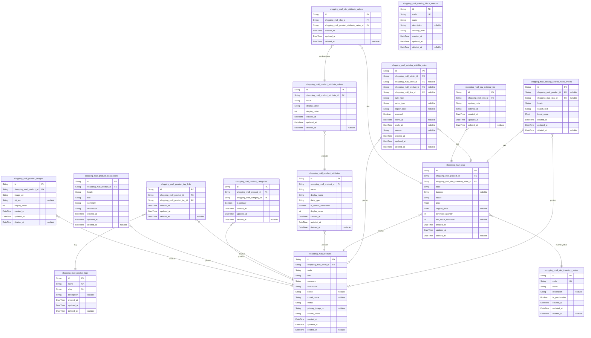

### `shopping_mall_products`

Core product catalog entity representing a sellable product concept owned
by a single seller.

Each product aggregates shared attributes that apply to all of its SKUs,
such as title, summary, detailed description, brand, and primary media.
It serves as the main business anchor for catalog browsing, search, and
reviews.

Products are linked to sellers from the seller domain and to navigation
categories via [shopping_mall_product_categories](#shopping_mall_product_categories). Localized
content is stored in [shopping_mall_product_localizations](#shopping_mall_product_localizations), images
in [shopping_mall_product_images](#shopping_mall_product_images), attributes in {@link
shopping_mall_product_attributes}, and tags via {@link
shopping_mall_product_tag_links}.

The table stores only the current state of a product; historical price
and description snapshots are captured in order and review domains. Soft
deletion is supported so that orders and reviews can continue to
reference historical products even after they are removed from the live
catalog.

Properties as follows:

- `id`: Primary key of the product. [shopping_mall_products.id](#shopping_mall_products).
- `shopping_mall_seller_id`: Owning seller of this product. [shopping_mall_sellers.id](#shopping_mall_sellers).
- `code`
  > Business-level product code unique per seller, used for internal
  > references and integrations.
- `title`
  > Primary product title in default locale, used for product detail and
  > search when localization is not available.
- `summary`
  > Short summary description suitable for listing views in the default
  > locale.
- `description`
  > Detailed product description in the default locale, including features
  > and usage information.
- `brand`: Optional brand associated with the product.
- `model_name`: Optional model name or number that further identifies the product.
- `status`
  > Lifecycle status of the product such as draft, active, inactive,
  > discontinued, or admin_unpublished.
- `primary_image_uri`
  > URI of the primary product image used in listings and product detail
  > pages.
- `default_locale`
  > IETF language tag representing the default locale used for title and
  > descriptions when localized records are missing.
- `created_at`: Timestamp when the product record was created.
- `updated_at`: Timestamp when the product record was last updated.
- `deleted_at`: Timestamp when the product was soft-deleted, if applicable.

### `shopping_mall_product_images`

Additional image resources associated with a product for gallery-style
display.

Each record represents a single image or media resource that belongs to a
[shopping_mall_products](#shopping_mall_products) row. Images can be ordered for
presentation, and may include alternative text for accessibility.

These records are subsidiary because they are always managed through the
parent product and never manipulated independently at business level.

Properties as follows:

- `id`: Primary key of the product image. [shopping_mall_product_images.id](#shopping_mall_product_images).
- `shopping_mall_product_id`: Product that this image belongs to. [shopping_mall_products.id](#shopping_mall_products).
- `image_uri`: URI of the image or media resource.
- `alt_text`
  > Optional human-readable alternative text describing the image for
  > accessibility.
- `display_order`
  > Numeric ordering value used to control gallery image sequence for the
  > product.
- `created_at`: Timestamp when this image entry was created.
- `updated_at`: Timestamp when this image entry was last updated.
- `deleted_at`: Timestamp when this image entry was soft-deleted, if applicable.

### `shopping_mall_product_localizations`

Localized product content per locale for a given product.

Each record stores localized versions of title, summary, and description
fields for a [shopping_mall_products](#shopping_mall_products) entry. This allows the
catalog to serve localized content without duplicating the core product
entity.

Content is always managed relative to a parent product and locale; thus
the table is classified as subsidiary.

Properties as follows:

- `id`
  > Primary key of the product localization. {@link
  > shopping_mall_product_localizations.id}.
- `shopping_mall_product_id`
  > Product that this localization belongs to. {@link
  > shopping_mall_products.id}.
- `locale`: IETF language tag for this localization such as en-US or ko-KR.
- `title`: Localized product title for this locale.
- `summary`: Localized short summary description suitable for listing views.
- `description`: Localized detailed product description.
- `created_at`: Timestamp when this localization was created.
- `updated_at`: Timestamp when this localization was last updated.
- `deleted_at`: Timestamp when this localization was soft-deleted, if applicable.

### `shopping_mall_product_categories`

Junction table linking products to navigation categories.

This table represents many-to-many assignments between {@link
shopping_mall_products} and [shopping_mall_categories](#shopping_mall_categories). It supports
primary and secondary category relationships via the is_primary flag.

It is subsidiary because assignments are managed through product or
category management flows and not as a standalone business entity. Soft
deletion is supported so historical category assignments remain for audit
and reporting without blocking new active assignments.

Properties as follows:

- `id`
  > Primary key of the product-category link. {@link
  > shopping_mall_product_categories.id}.
- `shopping_mall_product_id`: Product that is assigned to a category. [shopping_mall_products.id](#shopping_mall_products).
- `shopping_mall_category_id`
  > Category to which the product is assigned. {@link
  > shopping_mall_categories.id}.
- `is_primary`
  > Flag indicating whether this assignment is the primary category for the
  > product. At most one active (non-deleted) row per product should be
  > primary, enforced at application level.
- `created_at`: Timestamp when this category assignment was created.
- `updated_at`: Timestamp when this category assignment was last updated.
- `deleted_at`: Timestamp when this category assignment was soft-deleted, if applicable.

### `shopping_mall_product_tags`

Master list of tags that can be associated with products for discovery
and search.

Each record defines a tag label that may be linked to multiple products
via [shopping_mall_product_tag_links](#shopping_mall_product_tag_links). Tags can be created and
managed by admins to support curated navigation and search facets.

This is a primary table because tags can be independently managed,
searched, and reported on across all products, beyond their individual
associations.

Properties as follows:

- `id`: Primary key of the product tag. [shopping_mall_product_tags.id](#shopping_mall_product_tags).
- `name`: Canonical tag label used for classification and search.
- `slug`
  > URL-friendly slug version of the tag name used in navigation or search
  > URLs.
- `description`
  > Optional description explaining how the tag should be used in curation or
  > search.
- `created_at`: Timestamp when the tag was created.
- `updated_at`: Timestamp when the tag was last updated.
- `deleted_at`: Timestamp when the tag was soft-deleted, if applicable.

### `shopping_mall_product_tag_links`

Junction table representing associations between products and tags.

Each record links a [shopping_mall_products](#shopping_mall_products) entry to a {@link
shopping_mall_product_tags} tag. This enables tagging products for
search, filtering, and curation features.

The table is subsidiary because links are always created and managed
through product or tag flows and do not represent independent business
entities.

Properties as follows:

- `id`
  > Primary key of the product-tag link. {@link
  > shopping_mall_product_tag_links.id}.
- `shopping_mall_product_id`: Product that is tagged. [shopping_mall_products.id](#shopping_mall_products).
- `shopping_mall_product_tag_id`: Tag applied to the product. [shopping_mall_product_tags.id](#shopping_mall_product_tags).
- `created_at`: Timestamp when this tag link was created.
- `updated_at`: Timestamp when this tag link was last updated.
- `deleted_at`: Timestamp when this tag link was soft-deleted, if applicable.

### `shopping_mall_product_attributes`

Definitions of variant-capable attributes for a specific product.

Each record represents an attribute such as color, size, or capacity that
is applicable to SKUs under a [shopping_mall_products](#shopping_mall_products) entry.
Attributes are used to structure SKU variants and for faceted filtering.

This table is primary because attributes must be managed independently
for each product, searched in admin tools, and referenced from value and
SKU mapping tables.

Properties as follows:

- `id`
  > Primary key of the product attribute. {@link
  > shopping_mall_product_attributes.id}.
- `shopping_mall_product_id`: Product that this attribute belongs to. [shopping_mall_products.id](#shopping_mall_products).
- `name`: Internal attribute name such as color or size used in configuration.
- `display_name`: Human-readable name of the attribute shown to customers.
- `data_type`
  > Attribute data type such as string, int, or double used for validation
  > and filtering.
- `is_variant_dimension`
  > Flag indicating whether this attribute participates in SKU variant
  > uniqueness.
- `display_order`
  > Numeric ordering value used to sort attributes in product detail and
  > filter UIs.
- `created_at`: Timestamp when the attribute was created.
- `updated_at`: Timestamp when the attribute was last updated.
- `deleted_at`: Timestamp when the attribute was soft-deleted, if applicable.

### `shopping_mall_product_attribute_values`

Allowed values for a given product attribute.

Each record defines a permissible value for a {@link
shopping_mall_product_attributes} entry, such as "Red" for color or "XL"
for size. These values are referenced by {@link
shopping_mall_sku_attribute_values} when binding values to specific SKUs.

The table is primary because attribute values can be managed
independently within each product and are reused across many SKUs, making
them a stable business concept.

Properties as follows:

- `id`
  > Primary key of the product attribute value. {@link
  > shopping_mall_product_attribute_values.id}.
- `shopping_mall_product_attribute_id`
  > Product attribute that this value belongs to. {@link
  > shopping_mall_product_attributes.id}.
- `value`: Canonical representation of the attribute value, for example Red or XL.
- `display_value`
  > Human-readable display value for the attribute value, which may differ
  > slightly from the canonical form.
- `display_order`
  > Numeric ordering value controlling the order of possible values in
  > selection UIs.
- `created_at`: Timestamp when this attribute value was created.
- `updated_at`: Timestamp when this attribute value was last updated.
- `deleted_at`: Timestamp when this attribute value was soft-deleted, if applicable.

### `shopping_mall_skus`

Stock keeping units representing concrete sellable variants of products.

Each SKU belongs to exactly one [shopping_mall_products](#shopping_mall_products) record and
describes a specific combination of attribute values, its own price and
inventory quantity. It is the atomic unit for cart, order, inventory, and
eligibility logic across the platform.

This table stores the authoritative current inventory quantity and
SKU-level status. Detailed adjustment history is kept in inventory
adjustment tables in the SellerPortal domain. Attribute combinations are
modeled via [shopping_mall_sku_attribute_values](#shopping_mall_sku_attribute_values), and optional
external identifiers via [shopping_mall_sku_external_ids](#shopping_mall_sku_external_ids).

Properties as follows:

- `id`: Primary key of the SKU. [shopping_mall_skus.id](#shopping_mall_skus).
- `shopping_mall_product_id`: Product that this SKU belongs to. [shopping_mall_products.id](#shopping_mall_products).
- `shopping_mall_sku_inventory_state_id`
  > Current inventory state of the SKU describing availability semantics.
  > [shopping_mall_sku_inventory_states.id](#shopping_mall_sku_inventory_states).
- `code`
  > Business-level SKU code unique per product or seller, used in operations
  > and integrations.
- `barcode`
  > Optional barcode or similar identifier used for physical warehouse
  > operations.
- `status`
  > Lifecycle status of the SKU such as draft, active, inactive,
  > discontinued, or blocked_by_admin.
- `price`: Current selling price for this SKU in the platform base currency.
- `original_price`: Optional reference or list price used for showing discount information.
- `inventory_quantity`
  > Authoritative current on-hand inventory quantity for this SKU, not
  > including external reservations.
- `low_stock_threshold`
  > Optional threshold at or below which the SKU is considered low stock for
  > seller alerts.
- `created_at`: Timestamp when the SKU was created.
- `updated_at`: Timestamp when the SKU was last updated.
- `deleted_at`: Timestamp when the SKU was soft-deleted, if applicable.

### `shopping_mall_sku_attribute_values`

Junction table binding attribute values to specific SKUs, defining
variant combinations.

Each record links a [shopping_mall_skus](#shopping_mall_skus) entry to a {@link
shopping_mall_product_attribute_values} entry for the parent product. The
complete set of rows for a SKU describes its selected values across all
variant dimensions and non-variant attributes.

This table is subsidiary because it exists purely to model the
many-to-many relationship between SKUs and attribute values and is always
managed through product and SKU flows.

Properties as follows:

- `id`
  > Primary key of the SKU-attribute-value link. {@link
  > shopping_mall_sku_attribute_values.id}.
- `shopping_mall_sku_id`: SKU that uses the attribute value. [shopping_mall_skus.id](#shopping_mall_skus).
- `shopping_mall_product_attribute_value_id`
  > Attribute value applied to the SKU. {@link
  > shopping_mall_product_attribute_values.id}.
- `created_at`: Timestamp when this SKU attribute value link was created.
- `updated_at`: Timestamp when this SKU attribute value link was last updated.
- `deleted_at`
  > Timestamp when this SKU attribute value link was soft-deleted, if
  > applicable.

### `shopping_mall_sku_external_ids`

External system identifiers associated with SKUs for integrations.

Each record stores an identifier used by an external system, such as a
warehouse management system, marketplace integration, or barcode
registry, and links it to a [shopping_mall_skus](#shopping_mall_skus) entry.

The table is subsidiary because these identifiers are managed in the
context of a SKU and are not independently searchable by business users
outside of integration and operations tooling.

Properties as follows:

- `id`
  > Primary key of the SKU external identifier. {@link
  > shopping_mall_sku_external_ids.id}.
- `shopping_mall_sku_id`
  > SKU that this external identifier refers to. {@link
  > shopping_mall_skus.id}.
- `system_code`
  > Code identifying the external system, such as WMS, ERP, or marketplace
  > code.
- `external_id`: Identifier value used by the external system for this SKU.
- `created_at`: Timestamp when this external identifier was created.
- `updated_at`: Timestamp when this external identifier was last updated.
- `deleted_at`: Timestamp when this external identifier was soft-deleted, if applicable.

### `shopping_mall_sku_inventory_states`

Reference table defining inventory state semantics used by SKUs.

Each entry represents a business-level inventory state such as in_stock,
out_of_stock, preorder, or discontinued. [shopping_mall_skus](#shopping_mall_skus)
records reference this table to describe how inventory quantities should
be interpreted in cart and checkout flows.

The table is a primary entity because the set of inventory states is
centrally configured and reused across all SKUs and is important for
reporting and rule configuration.

Properties as follows:

- `id`
  > Primary key of the SKU inventory state. {@link
  > shopping_mall_sku_inventory_states.id}.
- `code`
  > Machine-readable code for the inventory state such as in_stock or
  > preorder.
- `name`: Human-readable name of the inventory state shown in admin tools.
- `description`
  > Optional description explaining how this inventory state behaves in
  > catalog and checkout flows.
- `is_purchasable`
  > Flag indicating whether SKUs in this state are eligible to be added to
  > carts and orders.
- `created_at`: Timestamp when the inventory state was created.
- `updated_at`: Timestamp when the inventory state was last updated.
- `deleted_at`: Timestamp when the inventory state was soft-deleted, if applicable.

### `shopping_mall_catalog_visibility_rules`

Catalog visibility rules that control which products or SKUs are visible
to which actors under what conditions.

Each row represents a rule created typically by admins to hide or show
subsets of the catalog based on actor type, region, lifecycle status, or
configuration flags. Rules can target an entire catalog, a specific
seller, a product, or a SKU by using foreign keys where applicable.

This is a primary table because visibility rules are managed and audited
as first-class business entities and influence catalog behavior across
multiple components.

Properties as follows:

- `id`
  > Primary key of the catalog visibility rule. {@link
  > shopping_mall_catalog_visibility_rules.id}.
- `shopping_mall_admin_id`: Admin who created this visibility rule. [shopping_mall_admins.id](#shopping_mall_admins).
- `shopping_mall_seller_id`
  > Optional seller that this rule applies to, if the rule is seller-scoped.
  > [shopping_mall_sellers.id](#shopping_mall_sellers).
- `shopping_mall_product_id`
  > Optional product that this rule applies to, if the rule is
  > product-specific. [shopping_mall_products.id](#shopping_mall_products).
- `shopping_mall_sku_id`
  > Optional SKU that this rule applies to, if the rule is SKU-specific.
  > [shopping_mall_skus.id](#shopping_mall_skus).
- `rule_type`
  > Type of the rule such as hide, show_only_to_registered, or
  > region_restricted.
- `actor_type`
  > Optional actor type the rule targets, for example guestUser, customer,
  > seller, or admin.
- `region_code`: Optional region or market code used when the rule is region-specific.
- `enabled`: Flag indicating whether this visibility rule is currently active.
- `starts_at`: Optional timestamp from which the rule becomes effective.
- `ends_at`: Optional timestamp after which the rule no longer applies.
- `reason`
  > Optional human-readable explanation of why this rule exists, useful for
  > governance and audit views.
- `created_at`: Timestamp when the visibility rule was created.
- `updated_at`: Timestamp when the visibility rule was last updated.
- `deleted_at`: Timestamp when the visibility rule was soft-deleted, if applicable.

### `shopping_mall_catalog_search_index_entries`

Denormalized search index entries for products and SKUs used to
accelerate catalog search.

Each record aggregates search-relevant fields such as titles, summaries,
tags, and attribute text for a single target entity, typically a {@link
shopping_mall_products} or [shopping_mall_skus](#shopping_mall_skus) record. The index
supports full-text search and ranking without touching all normalized
tables at query time.

Although it stores derived data, it is modeled as a regular table rather
than an mv_ view to allow flexible rebuilding strategies. It is
subsidiary because it is populated and maintained by background processes
and never edited directly by business users.

Properties as follows:

- `id`
  > Primary key of the catalog search index entry. {@link
  > shopping_mall_catalog_search_index_entries.id}.
- `shopping_mall_product_id`
  > Product that this index entry refers to, if the entry is product-scoped.
  > [shopping_mall_products.id](#shopping_mall_products).
- `shopping_mall_sku_id`
  > SKU that this index entry refers to, if the entry is SKU-scoped. {@link
  > shopping_mall_skus.id}.
- `locale`: Locale of the indexed text, such as en-US or ko-KR.
- `search_text`
  > Concatenated and normalized text used for full-text search, including
  > titles, summaries, tags, and attribute labels.
- `boost_score`
  > Precomputed numeric boost used to influence ranking, for example based on
  > popularity or recency.
- `created_at`: Timestamp when this index entry was created or last rebuilt.
- `updated_at`: Timestamp when this index entry metadata was last updated.
- `deleted_at`: Timestamp when this index entry was soft-deleted, if applicable.

### `shopping_mall_catalog_block_reasons`

Reference table describing reasons why catalog entities are blocked or
removed from sale.

Each record defines a reusable business-level reason such as
policy_violation, legal_request, counterfeit_suspected, or safety_issue.
These reasons can be referenced by governance and moderation components
when blocking products or SKUs via visibility rules or other mechanisms.

The table is a primary entity because block reasons are centrally
configured, audited, and reused across many enforcement actions and
reports.

Properties as follows:

- `id`
  > Primary key of the catalog block reason. {@link
  > shopping_mall_catalog_block_reasons.id}.
- `code`
  > Machine-readable code representing the block reason, such as
  > policy_violation or legal_request.
- `name`: Human-readable name of the block reason displayed in admin tools.
- `description`: Optional detailed description of when this block reason should be used.
- `severity_level`
  > Business-level severity classification such as low, medium, or high used
  > for risk reporting.
- `created_at`: Timestamp when the block reason was created.
- `updated_at`: Timestamp when the block reason was last updated.
- `deleted_at`: Timestamp when the block reason was soft-deleted, if applicable.

## Carts

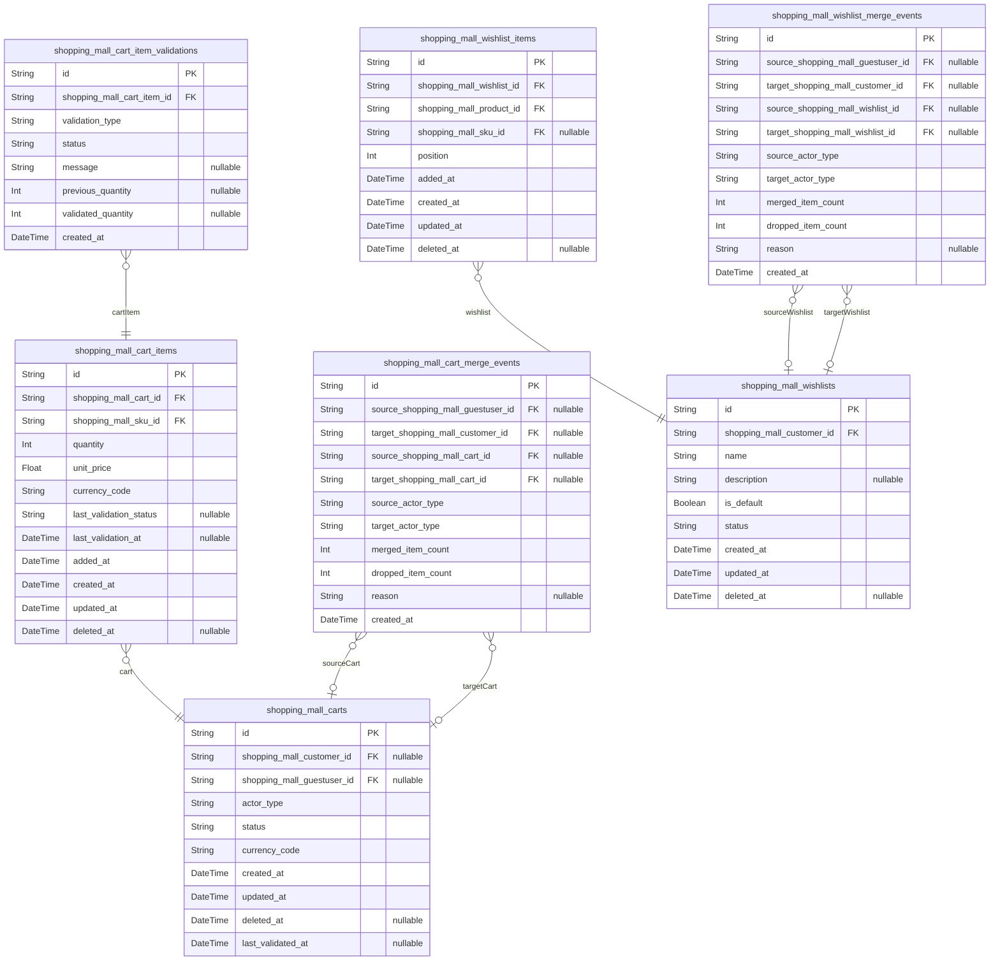

### `shopping_mall_carts`

Shopping cart header entities for both guest users and authenticated
customers.

Each cart represents a collection of items (SKUs) that a user intends to
purchase but has not yet converted into an order. A cart can belong to
either a guestUser or a customer actor, identified by the actor_type
field and corresponding foreign key.

Carts track lifecycle state through a flexible status string (for example
active, converted_to_order, merged, abandoned) and store timestamps for
creation, update, soft deletion, and the last time full validation was
executed.

Carts are linked to [shopping_mall_cart_items](#shopping_mall_cart_items) for line items and
[shopping_mall_cart_merge_events](#shopping_mall_cart_merge_events) for guest-to-customer merge
history. They reference external actor models {@link
shopping_mall_customers} and [shopping_mall_guestusers](#shopping_mall_guestusers).

Properties as follows:

- `id`: Primary key. Unique identifier of the cart.
- `shopping_mall_customer_id`
  > Owning authenticated customer when actor_type is "customer". {@link
  > shopping_mall_customers.id}.
- `shopping_mall_guestuser_id`
  > Owning guest user when actor_type is "guestuser". {@link
  > shopping_mall_guestusers.id}.
- `actor_type`
  > Type of actor that owns the cart. Expected business values include
  > "guestuser" and "customer" and must be consistent with which foreign key
  > is populated.
- `status`
  > Current business status of the cart such as "active",
  > "converted_to_order", "merged", or "abandoned". Used by background jobs
  > and APIs to filter carts.
- `currency_code`
  > ISO currency code representing the pricing currency for items in this
  > cart. All monetary values for cart items should be expressed in this
  > currency.
- `created_at`: Timestamp when the cart was created.
- `updated_at`
  > Timestamp when the cart was last updated, including item changes or
  > status transitions.
- `deleted_at`
  > Soft deletion timestamp. When set, the cart is considered logically
  > removed but retained for analytics and audit.
- `last_validated_at`
  > Timestamp when the cart and its items were last fully validated for
  > availability, pricing, and other business rules.

### `shopping_mall_cart_items`

Line items associated with shopping carts.

Each cart item represents a specific SKU and quantity that a user has
added to a cart. Items reference the owning cart header and the SKU from
the product catalog.

Cart items store quantity and unit price snapshots in the cart currency,
enabling order creation to capture prices at the time of checkout. They
also include lightweight validation status fields for quick checks, with
detailed validation history stored in {@link
shopping_mall_cart_item_validations}.

Properties as follows:

- `id`: Primary key. Unique identifier of the cart item.
- `shopping_mall_cart_id`: Owning cart header. [shopping_mall_carts.id](#shopping_mall_carts).
- `shopping_mall_sku_id`: SKU being purchased in this cart item. [shopping_mall_skus.id](#shopping_mall_skus).
- `quantity`
  > Requested quantity of the SKU in this cart item. Must be a positive
  > integer and is revalidated against inventory and purchase limits.
- `unit_price`
  > Snapshot unit price of the SKU in the cart currency at the time it was
  > last recalculated.
- `currency_code`
  > ISO currency code for the unit_price. Should match the currency_code of
  > the owning cart.
- `last_validation_status`
  > Result of the most recent lightweight validation for this item such as
  > "ok", "out_of_stock", or "price_changed". Detailed history is kept in
  > cart item validations.
- `last_validation_at`: Timestamp when last_validation_status was updated.
- `added_at`: Timestamp when the item was first added to the cart.
- `created_at`: Timestamp when the cart item record was created.
- `updated_at`: Timestamp when the cart item was last modified.
- `deleted_at`
  > Soft deletion timestamp. When set, this item is logically removed from
  > the cart while preserving historical data for analytics.

### `shopping_mall_cart_item_validations`

Historical validation records for individual cart items.

Each record captures the result of a validation pass against a specific
cart item, such as when a user adds an item, opens the cart, or begins
checkout. It stores the type of validation, the outcome status, optional
descriptive messages, and any quantity adjustments.

These records provide an audit trail that supports debugging, analytics
on cart friction, and compliance needs. They supplement the lightweight
status maintained directly on [shopping_mall_cart_items](#shopping_mall_cart_items).

Properties as follows:

- `id`: Primary key. Unique identifier for the validation record.
- `shopping_mall_cart_item_id`: Target cart item that was validated. [shopping_mall_cart_items.id](#shopping_mall_cart_items).
- `validation_type`
  > Business type of validation such as "add_to_cart", "cart_view", or
  > "checkout". Used for analytics and rule-specific behavior.
- `status`
  > Outcome of the validation such as "success", "error", or "adjusted"
  > indicating whether the item remains valid, was rejected, or underwent
  > corrections.
- `message`
  > Human-readable explanation or error message describing the validation
  > result. Useful for customer-facing messaging and support analysis.
- `previous_quantity`
  > Quantity before any adjustment applied by this validation. Null when not
  > applicable.
- `validated_quantity`
  > Quantity after validation and any applied adjustment. Null when
  > validation did not change quantity.
- `created_at`: Timestamp when the validation record was created.

### `shopping_mall_cart_merge_events`

Audit records for guest-to-customer or cart-to-cart merge operations.

When a guestUser authenticates and the system merges a temporary cart
into an existing customer cart, each merge is recorded in this table. The
record includes references to source and target actors and carts, counts
of merged and dropped items, and a reason field for business diagnostics.

These events support audit trails, debugging of merge logic, and
analytics around how often and how effectively carts are preserved when
users log in. They relate to [shopping_mall_carts](#shopping_mall_carts) and to external
actor models [shopping_mall_customers](#shopping_mall_customers) and {@link
shopping_mall_guestusers}.

Properties as follows:

- `id`: Primary key. Unique identifier for the merge event.
- `source_shopping_mall_guestuser_id`
  > Source guest user whose temporary cart was merged. {@link
  > shopping_mall_guestusers.id}.
- `target_shopping_mall_customer_id`
  > Target customer who received merged cart contents. {@link
  > shopping_mall_customers.id}.
- `source_shopping_mall_cart_id`: Source cart whose items were merged. [shopping_mall_carts.id](#shopping_mall_carts).
- `target_shopping_mall_cart_id`
  > Target cart that absorbed items from the source cart. {@link
  > shopping_mall_carts.id}.
- `source_actor_type`
  > Type of the source actor, typically "guestuser". Helps interpret which
  > foreign keys are expected to be populated.
- `target_actor_type`
  > Type of the target actor, typically "customer". Helps interpret which
  > foreign keys are expected to be populated.
- `merged_item_count`
  > Number of items successfully merged from the source cart into the target
  > cart.
- `dropped_item_count`
  > Number of items that could not be merged due to validation failures such
  > as discontinued SKUs or policy violations.
- `reason`
  > Optional business reason or additional context for the merge, such as
  > policy or strategy name used for conflict resolution.
- `created_at`: Timestamp when the merge event occurred.

### `shopping_mall_wishlists`

Customer-owned wishlists for saving products of interest.

Each wishlist belongs to a single authenticated customer and contains one
or more items referencing products and optionally SKUs. Customers can
maintain multiple named wishlists or a single default list depending on
business configuration.

Wishlists support soft deletion and a flexible status string so they can
be archived or hidden while preserving their contents for analytics.
Related items are stored in [shopping_mall_wishlist_items](#shopping_mall_wishlist_items), and
merge events from guest wishlists are stored in {@link
shopping_mall_wishlist_merge_events}.

Properties as follows:

- `id`: Primary key. Unique identifier of the wishlist.
- `shopping_mall_customer_id`: Customer who owns this wishlist. [shopping_mall_customers.id](#shopping_mall_customers).
- `name`
  > Human-readable name of the wishlist such as "Default", "Gifts", or
  > "Later".
- `description`: Optional longer description or notes about the purpose of this wishlist.
- `is_default`
  > Flag indicating whether this is the customer's default wishlist used when
  > no specific list is chosen.
- `status`
  > Business status of the wishlist such as "active" or "archived". Controls
  > whether it is shown in standard customer flows.
- `created_at`: Timestamp when the wishlist was created.
- `updated_at`: Timestamp when the wishlist was last updated.
- `deleted_at`
  > Soft deletion timestamp. When set, the wishlist is logically removed from
  > customer flows but may be retained for analytics.

### `shopping_mall_wishlist_items`

Items contained in customer wishlists.

Each record links a wishlist to a specific product and optionally a
specific SKU when the customer saved a particular variant. It maintains
the order in which items were added and supports soft deletion for audit
and analytics.

Wishlist items allow marketing and analytics teams to query across all
lists for demand signals, while customers manage their lists through
application features. The table references {@link
shopping_mall_wishlists}, [shopping_mall_products](#shopping_mall_products), and {@link
shopping_mall_skus}.

Properties as follows:

- `id`: Primary key. Unique identifier of the wishlist item.
- `shopping_mall_wishlist_id`
  > Owning wishlist that contains this item. {@link
  > shopping_mall_wishlists.id}.
- `shopping_mall_product_id`
  > Product that the customer saved to the wishlist. {@link
  > shopping_mall_products.id}.
- `shopping_mall_sku_id`
  > Optional specific SKU variant saved to the wishlist when the customer
  > selected a concrete option. [shopping_mall_skus.id](#shopping_mall_skus).
- `position`
  > Relative ordering position of the item within the wishlist. Lower values
  > are displayed earlier.
- `added_at`: Timestamp when the item was added to the wishlist.
- `created_at`: Timestamp when the wishlist item record was created.
- `updated_at`: Timestamp when the wishlist item was last updated.
- `deleted_at`
  > Soft deletion timestamp. When set, the item is logically removed from the
  > wishlist but retained for historical analysis.

### `shopping_mall_wishlist_merge_events`

Audit records for guest-to-customer wishlist merge operations.

When a guestUser signs in and the system merges a temporary wishlist into
a customer's existing wishlists, each merge operation is recorded here.
Records capture source and target actors and wishlists, counts of merged
and dropped items, and a free-form reason.

These events are important for understanding how well wishlist data is
preserved across sessions and devices and for diagnosing merge policies.
They relate to [shopping_mall_wishlists](#shopping_mall_wishlists), {@link
shopping_mall_customers}, and [shopping_mall_guestusers](#shopping_mall_guestusers).

Properties as follows:

- `id`: Primary key. Unique identifier for the wishlist merge event.
- `source_shopping_mall_guestuser_id`
  > Source guest user whose temporary wishlist was merged. {@link
  > shopping_mall_guestusers.id}.
- `target_shopping_mall_customer_id`
  > Target customer who received the merged wishlist items. {@link
  > shopping_mall_customers.id}.
- `source_shopping_mall_wishlist_id`
  > Source wishlist whose items were merged. {@link
  > shopping_mall_wishlists.id}.
- `target_shopping_mall_wishlist_id`
  > Target wishlist that absorbed items from the source wishlist. {@link
  > shopping_mall_wishlists.id}.
- `source_actor_type`
  > Type of the source actor, typically "guestuser". Indicates which actor
  > foreign key should be populated.
- `target_actor_type`
  > Type of the target actor, typically "customer". Indicates which actor
  > foreign key should be populated.
- `merged_item_count`
  > Number of wishlist items successfully merged from the source into the
  > target wishlist.
- `dropped_item_count`
  > Number of wishlist items that could not be merged due to product
  > visibility, policy, or duplication rules.
- `reason`
  > Optional textual reason or context for the merge, such as merge policy
  > name or conflict resolution notes.
- `created_at`: Timestamp when the wishlist merge event occurred.

## Orders

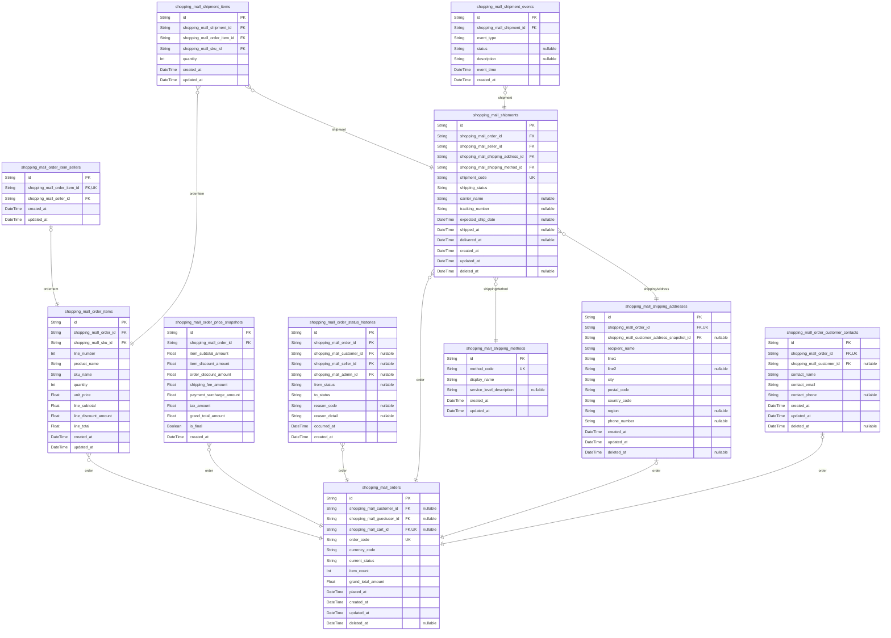

### `shopping_mall_orders`

Customer-facing order headers representing confirmed checkouts.

Each record captures the core business identity and high-level lifecycle
of an order, including ownership, association to the originating cart,
monetary summary, and the current status for efficient querying.

Detailed monetary breakdowns, historical price changes, and status
timelines are normalized into supporting tables such as {@link
shopping_mall_order_price_snapshots} and {@link
shopping_mall_order_status_histories}.

Orders are the parent for [shopping_mall_order_items](#shopping_mall_order_items) and {@link
shopping_mall_shipments}, enabling multi-seller and multi-shipment
scenarios while preserving a single customer-visible order identifier.

Properties as follows:

- `id`
  > Primary key for the order record. Globally unique identifier for this
  > order.
- `shopping_mall_customer_id`
  > Optional reference to the authenticated customer who owns this order.
  > [shopping_mall_customers.id](#shopping_mall_customers).
  >
  > Null when the order is associated with a guest user account instead of a
  > registered customer.
- `shopping_mall_guestuser_id`
  > Optional reference to a guest user entity when the order was placed
  > without full customer registration. [shopping_mall_guestusers.id](#shopping_mall_guestusers).
  >
  > Exactly one of shopping_mall_customer_id or shopping_mall_guestuser_id is
  > expected to be non-null at business level.
- `shopping_mall_cart_id`
  > Reference to the cart from which this order was created, if such a cart
  > existed. [shopping_mall_carts.id](#shopping_mall_carts).
  >
  > Null for orders created through flows that do not use a persistent cart.
- `order_code`
  > Business-facing order code shown to customers in communications and order
  > history.
  >
  > Typically a human-friendly identifier such as a formatted sequence; must
  > be unique per platform.
- `currency_code`
  > ISO 4217 currency code used for all monetary values in this order (for
  > example "USD" or "KRW").
- `current_status`
  > Current high-level business status of the order.
  >
  > Examples include: "awaiting_payment", "payment_confirmed",
  > "preparing_shipment", "shipped", "delivered", "cancelled", "refunded".
  >
  > Detailed history of transitions is stored in {@link
  > shopping_mall_order_status_histories}.
- `item_count`
  > Total count of order line items at the time of order confirmation.
  >
  > This is a denormalized convenience value used for quick listing and does
  > not replace the authoritative data in [shopping_mall_order_items](#shopping_mall_order_items).
- `grand_total_amount`
  > Total amount charged to the customer for this order in the order currency.
  >
  > This includes item subtotals, discounts, shipping fees, surcharges, and
  > taxes according to business rules at the time of confirmation.
- `placed_at`
  > Timestamp when the customer confirmed checkout and the order record was
  > created.
- `created_at`: Timestamp when this order row was first persisted in the database.
- `updated_at`
  > Timestamp when this order row was last updated, including status or
  > summary updates.
- `deleted_at`
  > Soft deletion timestamp for this order.
  >
  > Null for active orders; set when an order is logically removed from
  > normal views while retained for audit and compliance.

### `shopping_mall_order_items`

Individual order line items representing purchased SKUs within an order.

Each row binds a product SKU to an order with a quantity and monetary
amounts captured at the time of order confirmation.

Seller ownership for each line is further normalized into {@link
shopping_mall_order_item_sellers} so that multi-seller orders can be
settled and fulfilled correctly.

The line data is immutable after confirmation except for fields related
to cancellations or adjustments that are handled in payment and refund
domains.

Properties as follows:

- `id`: Primary key for the order item row.
- `shopping_mall_order_id`
  > Reference to the parent order that owns this line item. {@link
  > shopping_mall_orders.id}.
- `shopping_mall_sku_id`
  > Reference to the SKU being purchased on this line. {@link
  > shopping_mall_skus.id}.
  >
  > The SKU snapshot at order time is preserved via external snapshot
  > mechanisms; this FK ensures linkage to the catalog entity.
- `line_number`
  > Sequential position of this line item within the order, starting from 1.
  >
  > Used to provide stable ordering in order detail views.
- `product_name`
  > Snapshot of the product name at the time of order.
  >
  > This prevents later catalog changes from altering historical order
  > presentations.
- `sku_name`
  > Snapshot of the SKU variant title or descriptive label at the time of
  > order.
  >
  > Provides quick understanding of the selected variant without extra joins.
- `quantity`
  > Quantity of the SKU purchased on this line.
  >
  > Must be a positive integer.
- `unit_price`
  > Per-unit selling price for this SKU at order time in the order currency,
  > before line-level discounts.
- `line_subtotal`
  > Subtotal for this line before discounts, calculated as quantity ×
  > unit_price.
  >
  > Stored as a raw value for audit and quick aggregation.
- `line_discount_amount`
  > Total discount amount applied to this line, including seller-funded and
  > platform-funded discounts.
  >
  > A non-negative monetary value.
- `line_total`
  > Final payable amount for this line after discounts but before order-level
  > fees and taxes.
  >
  > This value is part of the order monetary snapshot.
- `created_at`: Timestamp when this order item row was created.
- `updated_at`: Timestamp when this order item row was last updated.

### `shopping_mall_order_item_sellers`

Mapping table linking order items to their owning sellers in multi-seller
orders.

Each row associates a line item in [shopping_mall_order_items](#shopping_mall_order_items) with
a single seller from [shopping_mall_sellers](#shopping_mall_sellers), enabling
seller-specific order views, fulfillment, and earnings calculations.

The table enforces a 1:1 relationship between an order line and its
seller mapping while allowing multiple sellers per order across different
lines.

Properties as follows:

- `id`: Primary key for the order item seller mapping row.
- `shopping_mall_order_item_id`
  > Reference to the order item that this mapping describes. {@link
  > shopping_mall_order_items.id}.
  >
  > Enforced unique to ensure one seller mapping per order line.
- `shopping_mall_seller_id`
  > Reference to the seller responsible for supplying the SKU on this order
  > line. [shopping_mall_sellers.id](#shopping_mall_sellers).
- `created_at`: Timestamp when this mapping row was created.
- `updated_at`: Timestamp when this mapping row was last updated.

### `shopping_mall_order_price_snapshots`

Monetary snapshot records capturing decomposed price components per order.

Each snapshot stores item subtotals, discounts, shipping fees,
surcharges, taxes, and total payable amounts at a particular point in the
order lifecycle.

Snapshots support audit, reporting, and reconciliation of order-level
monetary values independently from payment attempts and refunds, which
are modeled in dedicated payment components.

Multiple snapshots can exist per order, for example initial quote versus
final charged amount, with the application treating the latest snapshot
as authoritative for most business queries.

Properties as follows:

- `id`: Primary key for the order price snapshot row.
- `shopping_mall_order_id`
  > Reference to the order whose monetary state this snapshot describes.
  > [shopping_mall_orders.id](#shopping_mall_orders).
- `item_subtotal_amount`
  > Sum of item-level subtotals before discounts for this order at the time
  > of snapshot.
- `item_discount_amount`
  > Total discount amount applied at line level across all items, including
  > seller and platform funded discounts.
- `order_discount_amount`
  > Total discount amount applied at order level (for example coupon or
  > campaign discounts) at the time of snapshot.
- `shipping_fee_amount`
  > Total shipping fee amount charged to the customer in this snapshot.
  >
  > May be zero when free shipping promotions apply.
- `payment_surcharge_amount`
  > Total payment method surcharge charged to the customer in this snapshot,
  > if any.
  >
  > Represents platform-owned or pass-through fees depending on configuration.
- `tax_amount`
  > Total tax amount calculated for the order at the time of snapshot.
  >
  > May be zero for tax-exempt jurisdictions or orders.
- `grand_total_amount`
  > Total amount to be charged to the customer for this snapshot.
  >
  > Equals item_subtotal_amount minus discounts plus shipping_fee_amount,
  > surcharges, and taxes.
- `is_final`
  > Flag indicating whether this snapshot represents the final confirmed
  > monetary state for the order.
  >
  > Business logic treats the latest snapshot with is_final = true as
  > authoritative for reporting.
- `created_at`: Timestamp when this snapshot row was created.

### `shopping_mall_order_status_histories`

Historical records of order status transitions over time.

Each row captures a change in the high-level business status of an order,
including when it happened, optional reason, and which actor type
initiated the transition.

This model enables detailed audit trails for order lifecycle analysis,
compliance, and customer support without overloading the main {@link
shopping_mall_orders} table.

Properties as follows:

- `id`: Primary key for the order status history row.
- `shopping_mall_order_id`
  > Reference to the order whose status changed. {@link
  > shopping_mall_orders.id}.
- `shopping_mall_customer_id`
  > Optional reference to the customer who triggered this status change, when
  > applicable. [shopping_mall_customers.id](#shopping_mall_customers).
- `shopping_mall_seller_id`
  > Optional reference to the seller who triggered this status change, when
  > applicable. [shopping_mall_sellers.id](#shopping_mall_sellers).
- `shopping_mall_admin_id`
  > Optional reference to the admin who triggered this status change, when
  > applicable. [shopping_mall_admins.id](#shopping_mall_admins).
- `from_status`
  > Previous status value before this transition.
  >
  > Null when this is the initial status for the order.
- `to_status`
  > New status value applied to the order as a result of this transition.
  >
  > Values mirror those used in shopping_mall_orders.current_status.
- `reason_code`
  > Optional machine-readable reason code for the status change, such as
  > "payment_confirmed", "customer_cancelled", or "system_timeout".
- `reason_detail`
  > Optional human-readable explanation of why this status change occurred.
  >
  > Useful for support and audit reviews.
- `occurred_at`: Timestamp when this status change took effect from a business perspective.
- `created_at`: Timestamp when this history row was persisted.

### `shopping_mall_shipments`

Shipment headers representing fulfillment units derived from orders.

Each shipment is associated with a single seller and covers a subset of
items from a customer order, potentially routed to a specific
destination.

The model holds high-level shipping status, carrier and tracking details,
and links to the chosen shipping method and shipping address snapshot.

Detailed shipment item allocations and event timelines are modeled in
[shopping_mall_shipment_items](#shopping_mall_shipment_items) and {@link
shopping_mall_shipment_events}.

Properties as follows:

- `id`: Primary key for the shipment record.
- `shopping_mall_order_id`
  > Reference to the customer order that this shipment fulfills. {@link
  > shopping_mall_orders.id}.
- `shopping_mall_seller_id`
  > Reference to the seller responsible for shipping the items in this
  > shipment. [shopping_mall_sellers.id](#shopping_mall_sellers).
- `shopping_mall_shipping_address_id`
  > Reference to the shipping address snapshot used for this shipment. {@link
  > shopping_mall_shipping_addresses.id}.
- `shopping_mall_shipping_method_id`
  > Reference to the shipping method record chosen for this shipment. {@link
  > shopping_mall_shipping_methods.id}.
- `shipment_code`
  > Business-facing shipment code used for seller and customer communication.
  >
  > Often derived from order code with a suffix or separate sequence.
- `shipping_status`
  > Current shipping status for this shipment.
  >
  > Examples include: "pending", "preparing", "ready_for_pickup", "shipped",
  > "in_transit", "out_for_delivery", "delivered", "delivery_failed",
  > "returned", "cancelled".
  >
  > Detailed event history is stored in [shopping_mall_shipment_events](#shopping_mall_shipment_events).
- `carrier_name`
  > Name of the carrier handling this shipment, such as a courier company.
  >
  > Null when shipment has not yet been assigned to a carrier.
- `tracking_number`
  > Tracking identifier assigned by the carrier for this shipment.
  >
  > Null when tracking is not yet available or not supported.
- `expected_ship_date`
  > Optional date-time when the shipment is expected to leave the seller or
  > warehouse.
  >
  > Used for SLA tracking and customer expectations.
- `shipped_at`
  > Timestamp when the shipment first entered the carrier network or was
  > marked as shipped.
- `delivered_at`
  > Timestamp when the shipment was confirmed delivered to the customer, if
  > applicable.
- `created_at`: Timestamp when this shipment row was created.
- `updated_at`: Timestamp when this shipment row was last updated.
- `deleted_at`
  > Soft deletion timestamp for this shipment, used when hiding it from
  > normal views while retaining it for historical purposes.

### `shopping_mall_shipment_items`

Association table binding shipments to the specific order items and SKUs
they contain.

Each row represents a quantity of a particular order item allocated to a
shipment, enabling partial shipments, backorders, and complex fulfillment
scenarios across multiple sellers or warehouses.

The table ensures that shipped quantities can be reconciled against
ordered quantities without duplicating catalog or pricing information.

Properties as follows:

- `id`: Primary key for the shipment item row.
- `shopping_mall_shipment_id`
  > Reference to the shipment that includes this item. {@link
  > shopping_mall_shipments.id}.
- `shopping_mall_order_item_id`
  > Reference to the order item being shipped. {@link
  > shopping_mall_order_items.id}.
- `shopping_mall_sku_id`
  > Reference to the SKU for this shipment item, mirroring the SKU used on
  > the order line. [shopping_mall_skus.id](#shopping_mall_skus).
- `quantity`
  > Quantity of the order item allocated to this shipment.
  >
  > Must be a positive integer and not exceed the remaining unshipped
  > quantity for the corresponding order item.
- `created_at`: Timestamp when this shipment item row was created.
- `updated_at`: Timestamp when this shipment item row was last updated.

### `shopping_mall_shipment_events`

Event log entries representing the detailed shipping and tracking
timeline for a shipment.

Each row captures a discrete event such as status updates from the
carrier, internal state transitions, or manual admin adjustments.

These records provide a fine-grained view of shipment progress for
customer tracking, support investigations, and SLA monitoring,
complementing the high-level shipping_status field on {@link
shopping_mall_shipments}.

Properties as follows:

- `id`: Primary key for the shipment event row.
- `shopping_mall_shipment_id`
  > Reference to the shipment whose timeline this event belongs to. {@link
  > shopping_mall_shipments.id}.
- `event_type`
  > Machine-readable type of event, such as "status_change", "carrier_scan",
  > "address_correction", or "manual_override".
- `status`
  > Optional shipping status value associated with this event, mirroring
  > shipping_status values on the parent shipment.
  >
  > Null when the event does not represent a status change.
- `description`
  > Optional human-readable description providing more detail about the event.
  >
  > This text can be shown in customer-facing tracking views or internal
  > tools.
- `event_time`
  > Timestamp when the event occurred from a business perspective.
  >
  > May come from carrier data or internal system time.
- `created_at`: Timestamp when this event row was persisted.

### `shopping_mall_shipping_addresses`

Snapshot records of shipping addresses used for orders and shipments.

Each row stores the recipient and address details that were effective at
the time of order confirmation or shipment creation, ensuring that later
changes to customer address book entries do not affect historical
records.

Shipments reference these snapshots via [shopping_mall_shipments](#shopping_mall_shipments),
and orders can also use them for order-level address reporting.

Properties as follows:

- `id`: Primary key for the shipping address snapshot row.
- `shopping_mall_order_id`
  > Reference to the order that uses this shipping address snapshot. {@link
  > shopping_mall_orders.id}.
- `shopping_mall_customer_address_snapshot_id`
  > Optional reference to the underlying customer address snapshot from the
  > identity domain. [shopping_mall_customer_address_snapshots.id](#shopping_mall_customer_address_snapshots).
  >
  > Null when the shipping address was entered ad-hoc at checkout without
  > being stored as a reusable customer address.
- `recipient_name`
  > Name of the person or entity that should receive the shipment as captured
  > at checkout.
- `line1`: First line of the street address or primary address information.
- `line2`
  > Second line of the street address, such as apartment, suite, or building
  > information.
- `city`: City or locality component of the shipping address.
- `postal_code`: Postal or ZIP code for the shipping address.
- `country_code`: ISO 3166-1 alpha-2 country code for the destination country.
- `region`: Region, state, or province information, if applicable to the country.
- `phone_number`
  > Contact phone number associated with the shipping address, used by
  > carriers and support.
- `created_at`: Timestamp when this shipping address snapshot row was created.
- `updated_at`: Timestamp when this shipping address snapshot row was last updated.
- `deleted_at`
  > Soft deletion timestamp for this snapshot.
  >
  > Used when the address snapshot must be hidden from most queries but
  > retained for legal or audit purposes.

### `shopping_mall_shipping_methods`

Records representing shipping methods selected on orders and shipments.

Each row describes a named shipping method in business terms at the time
of selection, including a code and human-readable label, plus optional
metadata about service level.

Orders and shipments reference these records to understand which service
(for example standard or express) was used without directly depending on
external configuration tables that may change over time.

Properties as follows:

- `id`: Primary key for the shipping method record.
- `method_code`
  > Machine-readable shipping method code used internally, such as
  > "standard", "express", or carrier-specific identifiers.
- `display_name`
  > Human-readable shipping method name shown to customers and sellers, such
  > as "Standard Shipping" or "Express Courier".
- `service_level_description`
  > Optional description of service level expectations, such as estimated
  > delivery windows or special handling notes.
- `created_at`: Timestamp when this shipping method record was created.
- `updated_at`: Timestamp when this shipping method record was last updated.

### `shopping_mall_order_customer_contacts`

Snapshot records of customer contact information used for orders.

Each row stores name, email, and phone details that were current at the
time of order placement, ensuring that later profile changes do not
affect historical communication records.

The snapshot is used for order notifications, customer support, and
compliance with communication audit requirements, and is linked from
[shopping_mall_orders](#shopping_mall_orders).

Properties as follows:

- `id`: Primary key for the order customer contact snapshot row.
- `shopping_mall_order_id`
  > Reference to the order whose contact information this snapshot holds.
  > [shopping_mall_orders.id](#shopping_mall_orders).
  >
  > Enforced as unique so that each order has at most one primary contact
  > snapshot.
- `shopping_mall_customer_id`
  > Optional reference to the customer account associated with this contact
  > snapshot. [shopping_mall_customers.id](#shopping_mall_customers).
  >
  > Null when the order was placed by a guest or when contact information
  > does not map cleanly to a single customer account.
- `contact_name`: Customer name used for order communications at the time of placement.
- `contact_email`
  > Email address used for order confirmations and notifications at the time
  > of placement.
- `contact_phone`
  > Optional phone number used for order-related communication at the time of
  > placement.
- `created_at`: Timestamp when this order customer contact snapshot row was created.
- `updated_at`: Timestamp when this order customer contact snapshot row was last updated.
- `deleted_at`
  > Soft deletion timestamp for this snapshot.
  >
  > Used when contact data must be hidden while retaining the order record
  > for reporting or legal reasons.

## Payments

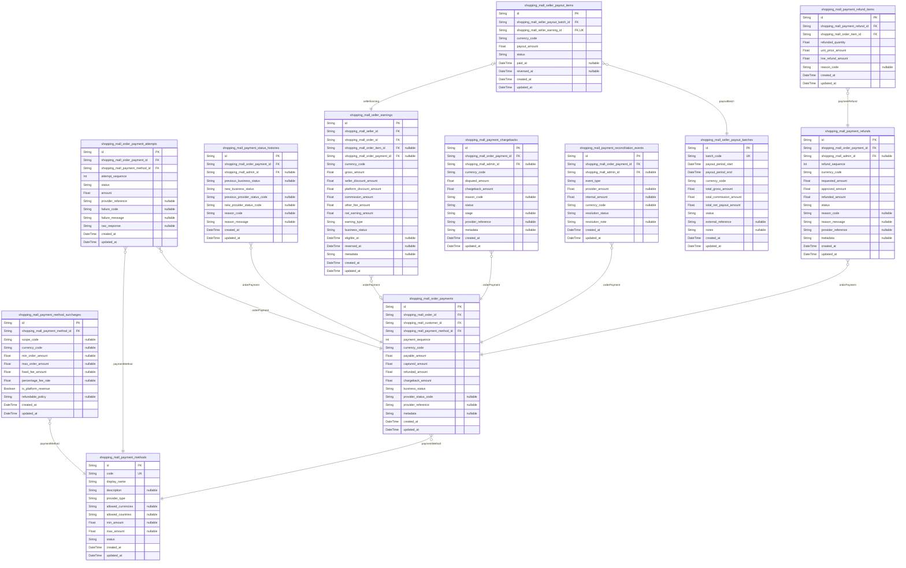

### `shopping_mall_payment_methods`

Configured payment methods that customers can use during checkout.

Each row represents a conceptual payment method, such as a card
processor, bank transfer, wallet, or COD, as seen by business logic.
Methods are referenced by order payments to determine which rails were
used for a payment.

Business rules and availability (region, currency, status) are stored
here so that payment selection during checkout can be validated and
audited over time.

Properties as follows:

- `id`: Primary key.
- `code`
  > Business identifier for the payment method (e.g., "card",
  > "bank_transfer"). Used in configuration and references from other tables.
- `display_name`
  > Human-readable name of the payment method shown in backoffice and
  > possibly to customers (for example "Credit Card", "Bank Transfer").
- `description`
  > Optional longer description of the payment method for admin reference or
  > customer hints.
- `provider_type`
  > High-level provider type or gateway family (for example "card_processor",
  > "bank_gateway", "wallet", "cod").
- `allowed_currencies`
  > Optional serialized list or expression of allowed order currencies for
  > this method (for example comma-separated ISO 4217 codes).
- `allowed_countries`
  > Optional serialized list or expression of allowed customer shipping or
  > billing countries for this method (for example comma-separated ISO 3166-1
  > alpha-2 codes).
- `min_amount`
  > Optional minimum payable amount for using this method, in the order
  > currency.
- `max_amount`
  > Optional maximum payable amount for using this method, in the order
  > currency.
- `status`
  > Lifecycle status of the payment method at business level (for example
  > "active", "disabled"). Determines whether it may be chosen at checkout.
- `created_at`: Timestamp when this payment method configuration was created.
- `updated_at`: Timestamp when this payment method configuration was last updated.

### `shopping_mall_payment_method_surcharges`

Payment method surcharge and fee configuration.

Each row defines fee behavior for a particular payment method under some
business scope, such as a specific region, currency, or order amount
range. These rows allow calculation of customer-facing surcharges and
platform-owned or pass-through fees per payment method.

This table is subsidiary to [shopping_mall_payment_methods](#shopping_mall_payment_methods) and is
not managed independently by end users.

Properties as follows:

- `id`: Primary key.
- `shopping_mall_payment_method_id`
  > Payment method that this surcharge configuration belongs to. {@link
  > shopping_mall_payment_methods.id}.
- `scope_code`
  > Optional business scope identifier for this surcharge (for example a
  > region code, channel code, or customer segment).
- `currency_code`
  > Optional ISO 4217 currency code for which this surcharge configuration
  > applies. If null, applies to all currencies of the parent method.
- `min_order_amount`
  > Optional minimum order amount for which this surcharge configuration is
  > valid.
- `max_order_amount`
  > Optional maximum order amount for which this surcharge configuration is
  > valid.
- `fixed_fee_amount`
  > Optional fixed fee amount added when this payment method is used and this
  > rule applies.
- `percentage_fee_rate`
  > Optional percentage fee rate applied to the payable amount when this rule
  > applies (for example 2.9 for 2.9%).
- `is_platform_revenue`
  > Flag indicating whether this surcharge is owned by the platform (true) or
  > pass-through to external parties such as carriers or gateways (false).
- `refundable_policy`
  > Optional policy string explaining how this surcharge behaves in refunds
  > (for example "refundable", "non_refundable", or a more complex
  > expression).
- `created_at`: Timestamp when this surcharge rule was created.
- `updated_at`: Timestamp when this surcharge rule was last updated.

### `shopping_mall_order_payments`

Logical payments associated with customer orders.

Each row represents a payment at the business level for one order, which
may be fully or partially covered by one or more attempts or split
payments. The row holds the payable amount, method, and high-level status
used to drive order payment lifecycle.

Refunds, chargebacks, and reconciliation events reference this entity to
adjust and audit financial outcomes over time.

Properties as follows:

- `id`: Primary key.
- `shopping_mall_order_id`
  > Order that this logical payment belongs to. {@link
  > shopping_mall_orders.id}.
- `shopping_mall_customer_id`
  > Customer who owns the order and thus the payment. {@link
  > shopping_mall_customers.id}.
- `shopping_mall_payment_method_id`
  > Payment method used for this payment from the platform perspective.
  > [shopping_mall_payment_methods.id](#shopping_mall_payment_methods).
- `payment_sequence`
  > Sequence number of this payment within the order, starting from 1. Allows
  > multiple payments per order (partial or split payments).
- `currency_code`: ISO 4217 currency code in which this payment is denominated.
- `payable_amount`
  > Total amount that should be paid for this payment in currency_code,
  > including items, taxes, and customer-facing fees that belong to this
  > payment.
- `captured_amount`
  > Total amount that has actually been captured or otherwise confirmed as
  > paid so far for this payment.
- `refunded_amount`
  > Total amount that has been refunded for this payment across all completed
  > refunds.
- `chargeback_amount`
  > Total amount that has been chargebacked for this payment across all
  > chargebacks.
- `business_status`
  > Business status for this payment (for example "pending", "paid",
  > "partially_refunded", "refunded", "chargeback", "cancelled"). Drives
  > order eligibility to ship and refund.
- `provider_status_code`
  > Optional provider-specific status code summarizing the last known state
  > from the payment gateway.
- `provider_reference`
  > Optional reference identifier from the payment provider (for example
  > payment intent id or transaction id) at the payment level.
- `metadata`
  > Optional serialized metadata for payment, such as structured JSON storing
  > provider or internal diagnostic information.
- `created_at`: Timestamp when this payment record was created.
- `updated_at`: Timestamp when this payment record was last updated.

### `shopping_mall_order_payment_attempts`

Concrete payment attempts for a logical order payment.

Each row represents one technical attempt to pay the amount indicated by
the parent payment, such as a card charge attempt or bank transfer
initiation. Multiple attempts may exist for the same business payment due
to retries or switching methods, depending on policy.

Attempts are subsidiary and are mainly used for audit, troubleshooting,
and risk analysis rather than independent management.

Properties as follows:

- `id`: Primary key.
- `shopping_mall_order_payment_id`
  > Parent logical order payment that this attempt belongs to. {@link
  > shopping_mall_order_payments.id}.
- `shopping_mall_payment_method_id`
  > Payment method actually used in this attempt (could differ from the main
  > payment configuration in exceptional flows). {@link
  > shopping_mall_payment_methods.id}.
- `attempt_sequence`
  > Sequence number of this attempt for the given payment, starting from 1.
  > Used to order attempts chronologically or by retry count.
- `status`
  > Status of this attempt (for example "pending", "success", "failed",
  > "error", "expired").
- `amount`
  > Amount that this attempt tried to authorize or capture, denominated in
  > the payment currency.
- `provider_reference`
  > Attempt-level reference from the payment provider (for example
  > transaction id or intent id).
- `failure_code`
  > Optional failure or error code reported by the payment provider for this
  > attempt.
- `failure_message`
  > Optional human-readable message explaining why the attempt failed or
  > errored, suitable for internal support analysis.
- `raw_response`
  > Optional serialized raw response or payload received from the payment
  > provider for this attempt for debugging and audits.
- `created_at`: Timestamp when this attempt record was created.
- `updated_at`: Timestamp when this attempt record was last updated.

### `shopping_mall_payment_status_histories`

Historical status changes for order payments.

Each row records a transition of business_status and optionally
provider_status_code for a particular payment. This provides an
append-only audit trail showing how payment state evolved over time and
which process or actor triggered each change.

It is subsidiary to [shopping_mall_order_payments](#shopping_mall_order_payments) and used mainly
for audit, risk, and debugging purposes.

Properties as follows:

- `id`: Primary key.
- `shopping_mall_order_payment_id`: Payment whose status changed. [shopping_mall_order_payments.id](#shopping_mall_order_payments).
- `shopping_mall_admin_id`
  > Optional admin who manually changed the status, if the transition was
  > admin-driven. [shopping_mall_admins.id](#shopping_mall_admins).
- `previous_business_status`
  > Previous business_status value before this change. Null if this is the
  > first recorded status.
- `new_business_status`: New business_status value after this change.
- `previous_provider_status_code`: Previous provider_status_code before this change, if any.
- `new_provider_status_code`: New provider_status_code after this change, if any.
- `reason_code`
  > Optional structured code describing why the status change occurred (for
  > example "payment_confirmed", "refund_completed", "manual_override").
- `reason_message`
  > Optional human-readable explanation providing more detail about the
  > status change for audit purposes.
- `created_at`: Timestamp when this status change was recorded.
- `updated_at`
  > Timestamp when this record was last updated. Generally equals created_at
  > for immutable history rows.

### `shopping_mall_payment_refunds`

Refund operations executed against payments.

Each row represents a refund transaction at the payment level, covering
some portion or all of one order payment. Refunds reference order
payments rather than orders directly, aligning financial flows with
payment records.

Refund items provide per-line breakdowns, and external provider
references allow reconciliation with gateway-side refund transactions.

Properties as follows:

- `id`: Primary key.
- `shopping_mall_order_payment_id`
  > Payment that this refund operation applies to. {@link
  > shopping_mall_order_payments.id}.
- `shopping_mall_admin_id`
  > Admin who approved or executed the refund, when applicable. {@link
  > shopping_mall_admins.id}.
- `refund_sequence`
  > Sequence number of this refund for the given payment, starting from 1.
  > Used to differentiate multiple refunds against the same payment.
- `currency_code`
  > ISO 4217 currency code in which this refund is denominated. Usually
  > matches the payment currency.
- `requested_amount`: Amount initially requested to be refunded at business level.
- `approved_amount`: Amount that was approved for refund based on policy and decision.
- `refunded_amount`
  > Amount that the payment provider confirms has actually been refunded to
  > the customer.
- `status`
  > Status of this refund (for example "pending", "approved", "rejected",
  > "completed", "failed").
- `reason_code`
  > Optional structured reason code for the refund, aligned with
  > business-level refund reasons.
- `reason_message`
  > Optional free-text explanation describing why the refund was requested or
  > approved, suitable for audit.
- `provider_reference`: Optional refund transaction reference from the payment provider.
- `metadata`
  > Optional serialized metadata with provider or internal diagnostic details
  > regarding this refund.
- `created_at`: Timestamp when this refund record was created.
- `updated_at`: Timestamp when this refund record was last updated.

### `shopping_mall_payment_refund_items`

Per-order-item breakdown of a refund.

Each row represents a portion of a refund allocated to a particular order
item. It supports item-level refund amounts, quantities, and reason codes
so that refunds can be analyzed at the SKU or seller level.

This table is subsidiary to [shopping_mall_payment_refunds](#shopping_mall_payment_refunds) and
[shopping_mall_order_items](#shopping_mall_order_items).

Properties as follows:

- `id`: Primary key.
- `shopping_mall_payment_refund_id`
  > Refund that this item-level breakdown belongs to. {@link
  > shopping_mall_payment_refunds.id}.
- `shopping_mall_order_item_id`
  > Order item whose charge is being refunded in whole or part. {@link
  > shopping_mall_order_items.id}.
- `refunded_quantity`
  > Quantity of the order item being refunded. Supports fractional quantities
  > if the platform allows them.
- `unit_price_amount`
  > Unit price amount used as basis for this refund for the item in
  > currency_code of the parent refund.
- `line_refund_amount`
  > Total monetary amount refunded for this order item line within this
  > refund operation.
- `reason_code`
  > Optional item-specific reason code (for example "damaged", "wrong_item",
  > "customer_remorse").
- `created_at`: Timestamp when this refund item record was created.
- `updated_at`: Timestamp when this refund item record was last updated.

### `shopping_mall_payment_chargebacks`

Chargeback cases associated with payments.

Each row represents a chargeback event opened by a card issuer, bank, or
wallet provider against a specific payment. It captures the disputed
amount, status, stages of the dispute, and provider references.

This table enables risk and loss tracking, as well as coordination with
order state and seller earnings adjustments.

Properties as follows:

- `id`: Primary key.
- `shopping_mall_order_payment_id`
  > Payment that this chargeback relates to. {@link
  > shopping_mall_order_payments.id}.
- `shopping_mall_admin_id`
  > Optional admin overseeing this chargeback or responsible for manual
  > decisions. [shopping_mall_admins.id](#shopping_mall_admins).
- `currency_code`
  > ISO 4217 currency code of the disputed amount. Usually matches the
  > payment currency.
- `disputed_amount`: Amount disputed by the issuer or payment provider.
- `chargeback_amount`
  > Amount that has actually been withdrawn from the platform due to this
  > chargeback, if any.
- `reason_code`: Provider or scheme-defined chargeback reason code.
- `status`
  > Business status of the chargeback case (for example "open", "won",
  > "lost", "writing_off").
- `stage`
  > Optional stage indicator for the lifecycle of the chargeback (for example
  > "first_presentment", "pre_arbitration", "arbitration").
- `provider_reference`
  > Chargeback reference identifier from the payment provider, card scheme,
  > or bank network.
- `metadata`
  > Optional serialized metadata including provider payloads, internal notes,
  > or evidence references.
- `created_at`: Timestamp when this chargeback record was created.
- `updated_at`: Timestamp when this chargeback record was last updated.

### `shopping_mall_payment_reconciliation_events`

Reconciliation events recorded for payments.

Each row captures a reconciliation finding or adjustment for a payment,
such as mismatched amounts between provider and internal records, late
notifications, or manual corrections.

These events are subsidiary to [shopping_mall_order_payments](#shopping_mall_order_payments) and
help auditors and operations track how discrepancies were detected and
resolved.

Properties as follows:

- `id`: Primary key.
- `shopping_mall_order_payment_id`
  > Payment that this reconciliation event concerns. {@link
  > shopping_mall_order_payments.id}.
- `shopping_mall_admin_id`
  > Optional admin who created or resolved this reconciliation event. {@link
  > shopping_mall_admins.id}.
- `event_type`
  > Type of reconciliation event (for example "amount_mismatch",
  > "late_capture", "provider_report_only").
- `provider_amount`
  > Amount reported by the provider when this event was detected, if
  > applicable.
- `internal_amount`
  > Internal amount recorded in the platform at the time of detection, if
  > applicable.
- `currency_code`
  > Currency in which the mismatch was detected, typically matching the
  > payment currency.
- `resolution_status`
  > Status of reconciliation (for example "open", "in_progress", "resolved",
  > "won_t_fix").
- `resolution_note`
  > Optional human-readable explanation of how this reconciliation event is
  > being or was resolved.
- `created_at`: Timestamp when this reconciliation event was recorded.
- `updated_at`: Timestamp when this reconciliation event was last updated.

### `shopping_mall_seller_earnings`

Seller earnings records derived from orders and payments.

Each row represents a unit of earnings for a seller, typically linked to
one order item or adjustment, after applying commissions, platform-funded
discounts, and seller-funded discounts.

These records serve as the source of truth for payout eligibility and
support KPI calculations such as GMV, NMV, and seller net earnings over
time.

Properties as follows:

- `id`: Primary key.
- `shopping_mall_seller_id`: Seller who owns this earning. [shopping_mall_sellers.id](#shopping_mall_sellers).
- `shopping_mall_order_id`
  > Customer order from which this earning originates. {@link
  > shopping_mall_orders.id}.
- `shopping_mall_order_item_id`
  > Specific order item that generated this earning, if applicable. {@link
  > shopping_mall_order_items.id}.
- `shopping_mall_order_payment_id`
  > Payment associated with this earning when relevant (for example when
  > earnings depend on payment completion). {@link
  > shopping_mall_order_payments.id}.
- `currency_code`: ISO 4217 currency code of this earning record.
- `gross_amount`
  > Gross merchandise amount associated with this earning before commissions
  > and platform-funded promotions.
- `seller_discount_amount`
  > Amount of discount funded by the seller for this earning (reduces seller
  > gross earnings).
- `platform_discount_amount`
  > Amount of discount funded by the platform for this earning (does not
  > reduce seller gross earnings, but affects platform cost).
- `commission_amount`: Commission amount charged by the platform for this earning.
- `other_fee_amount`
  > Any other fee amount that affects net earnings for this seller (for
  > example per-order fees or adjustments).
- `net_earning_amount`
  > Net amount owed to the seller for this earning after subtracting
  > commissions and seller-funded discounts, plus any adjustments.
- `earning_type`
  > Type of earning (for example "order_item", "shipping",
  > "manual_adjustment").
- `business_status`
  > Lifecycle status of this earning (for example "pending", "eligible",
  > "paid_out", "reversed"). Pending and eligible control payout eligibility.
- `eligible_at`
  > Timestamp at which this earning became eligible for payout (for example
  > after refund window closes).
- `reversed_at`
  > Timestamp when this earning was reversed due to refund, chargeback, or
  > manual adjustment, if applicable.
- `metadata`
  > Optional serialized metadata describing the commission rule applied,
  > campaign identifiers, or internal notes.
- `created_at`: Timestamp when this earning record was created.
- `updated_at`: Timestamp when this earning record was last updated.

### `shopping_mall_seller_payout_batches`

Payout batches aggregating multiple seller earnings for settlement.

Each row represents a payout run or batch in which multiple sellers may
be paid, or a specific batch per seller depending on configuration. It
captures the payout period, totals, and status.

Payout items attach individual seller earnings to a batch, and external
references connect the batch to bank or payment processor instructions.

Properties as follows:

- `id`: Primary key.
- `batch_code`
  > Business identifier for this payout batch, unique for traceability (for
  > example "PO-2025-03-15-001").
- `payout_period_start`
  > Start timestamp of the business period that this batch covers for
  > reporting purposes.
- `payout_period_end`
  > End timestamp of the business period that this batch covers for reporting
  > purposes.
- `currency_code`: ISO 4217 currency code used for monetary amounts in this payout batch.
- `total_gross_amount`
  > Total gross earnings included in this batch before any adjustments or
  > negative balances.
- `total_commission_amount`: Total commission amount associated with earnings included in this batch.
- `total_net_payout_amount`
  > Total amount to be transferred to sellers in this batch after commissions
  > and adjustments.
- `status`
  > Status of this payout batch at business level (for example "draft",
  > "processing", "completed", "failed", "cancelled").
- `external_reference`
  > Optional reference to a bank file, payout run ID, or external instruction
  > identifier associated with this batch.
- `notes`
  > Optional internal notes for finance or operations explaining special
  > handling or anomalies in this batch.
- `created_at`: Timestamp when this payout batch was created.
- `updated_at`: Timestamp when this payout batch was last updated.

### `shopping_mall_seller_payout_items`

Payout batch items linking seller earnings to a batch.

Each row associates a single seller earning with a payout batch and
records the amount being paid out in that batch. This table materializes
which earnings were settled when and supports reconciliation with both
seller statements and platform finance records.

The table is subsidiary to [shopping_mall_seller_payout_batches](#shopping_mall_seller_payout_batches)
and [shopping_mall_seller_earnings](#shopping_mall_seller_earnings).

Properties as follows:

- `id`: Primary key.
- `shopping_mall_seller_payout_batch_id`
  > Payout batch that this payout item belongs to. {@link
  > shopping_mall_seller_payout_batches.id}.
- `shopping_mall_seller_earning_id`
  > Seller earning that is being paid in this batch item. {@link
  > shopping_mall_seller_earnings.id}.
- `currency_code`
  > ISO 4217 currency code of the payout amount. Usually matches the batch
  > and earning currency.
- `payout_amount`
  > Amount paid out for this earning in this batch. Normally equals the
  > net_earning_amount, but may differ if partial payouts or previous
  > adjustments exist.
- `status`
  > Status of this payout item (for example "pending", "included", "paid",
  > "reversed").
- `paid_at`
  > Timestamp when this payout item was confirmed as paid to the seller, if
  > applicable.
- `reversed_at`
  > Timestamp when this payout item was reversed due to negative adjustments,
  > chargebacks, or other corrections.
- `created_at`: Timestamp when this payout item was created.
- `updated_at`: Timestamp when this payout item was last updated.

## RefundsAndDisputes

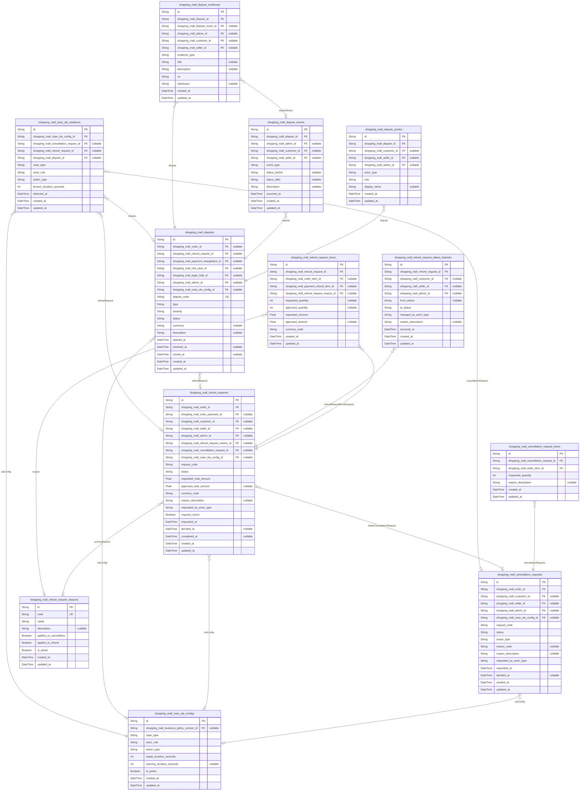

### `shopping_mall_cancellation_requests`

High-level customer or seller initiated requests to cancel orders or
specific order items.

Represents the business case that a placed order should be cancelled
partially or fully, prior to or during fulfillment. Each cancellation
request links to a single order but can cover multiple order items via
[shopping_mall_cancellation_request_items](#shopping_mall_cancellation_request_items). It stores the current
lifecycle status and key timestamps for SLA monitoring.

These records are permanent audit entities; they are never soft-deleted
and form the core of after-order cancellation workflows.

Properties as follows:

- `id`: Primary key of the cancellation request.
- `shopping_mall_order_id`
  > Order that this cancellation request is targeting. {@link
  > shopping_mall_orders}.
- `shopping_mall_customer_id`
  > Customer who initiated the cancellation, if the requester is a customer.
  > [shopping_mall_customers](#shopping_mall_customers).
- `shopping_mall_seller_id`
  > Seller who initiated the cancellation when seller-driven. {@link
  > shopping_mall_sellers}.
- `shopping_mall_admin_id`
  > Admin who created the cancellation on behalf of another actor or as an
  > operational action. [shopping_mall_admins](#shopping_mall_admins).
- `shopping_mall_case_sla_config_id`
  > SLA configuration that governs this cancellation request, when a
  > dedicated SLA rule applies. [shopping_mall_case_sla_configs](#shopping_mall_case_sla_configs).
- `request_code`
  > Business-visible identifier for the cancellation request, unique per
  > order for reference in communications.
- `status`
  > Current lifecycle status of the cancellation request, such as pending,
  > approved, rejected, or expired.
- `scope_type`
  > Scope of the cancellation, for example full_order or partial_items, used
  > to distinguish request semantics.
- `reason_code`
  > Optional structured reason code selected from policy-defined values, such
  > as change_of_mind or ordered_by_mistake.
- `reason_description`
  > Free-text explanation describing why cancellation is requested, as
  > written by the requester.
- `requested_by_actor_type`
  > Actor type who requested the cancellation, such as customer, seller, or
  > admin, used for governance and analytics.
- `requested_at`: Timestamp when the cancellation request was created in the system.
- `decided_at`
  > Timestamp when the cancellation request reached a terminal decision such
  > as approved or rejected.
- `created_at`: Timestamp when this cancellation request record was created.
- `updated_at`: Timestamp when this cancellation request record was last updated.

### `shopping_mall_cancellation_request_items`

Order item level lines that belong to a cancellation request.

Each row represents a specific order item and quantity that is included
in a parent [shopping_mall_cancellation_requests](#shopping_mall_cancellation_requests). This allows
partial item-level cancellations and accurate audit of what was requested
to be cancelled.

These records are append-only in practice and are not soft-deleted;
corrections are done via additional requests or business rules.

Properties as follows:

- `id`: Primary key of the cancellation request item.
- `shopping_mall_cancellation_request_id`
  > Parent cancellation request that owns this line. {@link
  > shopping_mall_cancellation_requests}.
- `shopping_mall_order_item_id`
  > Order item that the cancellation line refers to. {@link
  > shopping_mall_order_items}.
- `requested_quantity`: Quantity of the order item that the requester wants to cancel.
- `reason_description`
  > Optional item-specific cancellation explanation, when different from the
  > header reason.
- `created_at`: Timestamp when this cancellation request item record was created.
- `updated_at`: Timestamp when this cancellation request item record was last updated.

### `shopping_mall_refund_requests`

High-level refund cases initiated by customers, sellers, or admins after
or around delivery.

Stores the primary business record for a refund case linked to an order
and often to a payment. It contains lifecycle status, requested and
approved amounts, and links to more granular {@link
shopping_mall_refund_request_items} and status histories.

Refund requests are core governance entities and must remain immutable
from an audit perspective except for status progression and
administrative annotations.

Properties as follows:

- `id`: Primary key of the refund request.
- `shopping_mall_order_id`: Order for which this refund is requested. [shopping_mall_orders](#shopping_mall_orders).
- `shopping_mall_order_payment_id`
  > Specific order payment that this refund request is associated with, when
  > applicable. [shopping_mall_order_payments](#shopping_mall_order_payments).
- `shopping_mall_customer_id`
  > Customer who requested the refund, when the requester is a customer.
  > [shopping_mall_customers](#shopping_mall_customers).
- `shopping_mall_seller_id`
  > Seller who initiated the refund or concession, when seller-driven. {@link
  > shopping_mall_sellers}.
- `shopping_mall_admin_id`
  > Admin who created the refund request, often in manual adjustment
  > scenarios. [shopping_mall_admins](#shopping_mall_admins).
- `shopping_mall_refund_request_reason_id`
  > Primary structured reason selected for this refund request from the
  > reason catalog. [shopping_mall_refund_request_reasons](#shopping_mall_refund_request_reasons).
- `shopping_mall_cancellation_request_id`
  > Linked cancellation request when the refund stems from a cancellation
  > case. [shopping_mall_cancellation_requests](#shopping_mall_cancellation_requests).
- `shopping_mall_case_sla_config_id`
  > SLA configuration that governs this refund request, if a specific SLA
  > rule applies. [shopping_mall_case_sla_configs](#shopping_mall_case_sla_configs).
- `request_code`
  > Business-visible identifier for the refund request, used in support and
  > communication flows.
- `status`
  > Current lifecycle status of the refund request, such as requested,
  > under_review, approved, rejected, or completed.
- `requested_total_amount`
  > Total monetary amount that the requester asks to be refunded, expressed
  > in the order currency.
- `approved_total_amount`
  > Total monetary amount approved to be refunded after review, expressed in
  > the order currency.
- `currency_code`
  > Currency code for the requested and approved amounts, typically matching
  > the order currency (for example, USD or KRW).
- `reason_description`
  > Free-text explanation providing additional context for the refund request
  > beyond the structured reason code.
- `requested_by_actor_type`
  > Actor type who initiated the refund request, such as customer, seller, or
  > admin.
- `requires_return`
  > Indicates whether physical goods must be returned as part of fulfilling
  > this refund request.
- `requested_at`: Timestamp when the refund request was created in the system.
- `decided_at`: Timestamp when a final decision was made, such as approved or rejected.
- `completed_at`: Timestamp when the financial refund was fully processed and completed.
- `created_at`: Timestamp when this refund request record was created.
- `updated_at`: Timestamp when this refund request record was last updated.

### `shopping_mall_refund_request_items`

Line-level mapping between refund requests and the specific monetary
impact per order item or payment component.

Each record belongs to a [shopping_mall_refund_requests](#shopping_mall_refund_requests) and
optionally references an [shopping_mall_order_items](#shopping_mall_order_items) or a low-level
payment refund item. It captures requested and approved amounts per
component, enabling detailed reconciliation.

These rows form the granular basis for how a refund request breaks down
financially without storing any derived aggregates.

Properties as follows:

- `id`: Primary key of the refund request item.
- `shopping_mall_refund_request_id`
  > Parent refund request that owns this line. {@link
  > shopping_mall_refund_requests}.
- `shopping_mall_order_item_id`
  > Order item that this refund amount is associated with, when the refund
  > targets a specific item. [shopping_mall_order_items](#shopping_mall_order_items).
- `shopping_mall_payment_refund_item_id`
  > Underlying payment refund item that implements this refund line at the
  > payment provider level. [shopping_mall_payment_refund_items](#shopping_mall_payment_refund_items).
- `shopping_mall_refund_request_reason_id`
  > Specific structured reason associated with this line, which may differ
  > from the header reason. [shopping_mall_refund_request_reasons](#shopping_mall_refund_request_reasons).
- `requested_quantity`
  > Quantity of the item for which refund is requested, when the refund is
  > quantity-based.
- `approved_quantity`
  > Quantity approved for refund, when the refund is quantity-based and
  > partially accepted.
- `requested_amount`
  > Monetary amount requested to be refunded for this line in the order
  > currency.
- `approved_amount`
  > Monetary amount approved for this line after review, in the order
  > currency.
- `currency_code`
  > Currency code for the requested and approved amounts, typically matching
  > the order currency.
- `created_at`: Timestamp when this refund request item record was created.
- `updated_at`: Timestamp when this refund request item record was last updated.

### `shopping_mall_refund_request_reasons`

Catalog of structured reason codes that can be associated with refund and
cancellation requests.

Defines stable business-level categories such as change_of_mind,
damaged_item, wrong_item, or not_delivered. These reasons are used by
both [shopping_mall_refund_requests](#shopping_mall_refund_requests) and {@link
shopping_mall_refund_request_items} for consistent analytics and policy
enforcement.

Admins can manage these reasons, but they are treated as configuration
records rather than primary business cases.

Properties as follows:

- `id`: Primary key of the refund request reason.
- `code`
  > Unique machine-friendly code representing the refund or cancellation
  > reason, such as damaged_item.
- `name`
  > Human-readable name of the reason as shown in management tools or
  > localized catalogs.
- `description`
  > Detailed explanation of when this reason should be used, written for
  > admins or internal staff.
- `applies_to_cancellation`: Indicates whether this reason can be used for cancellation requests.
- `applies_to_refund`: Indicates whether this reason can be used for refund requests.
- `is_active`: Flag indicating if this reason is currently allowed for new requests.
- `created_at`: Timestamp when this reason record was created.
- `updated_at`: Timestamp when this reason record was last updated.

### `shopping_mall_refund_request_status_histories`

Historical record of all status transitions that occurred on a refund
request.

Each row captures a single transition for a {@link
shopping_mall_refund_requests} instance, including the previous status,
the new status, the actor responsible, and timestamps. This enables full
audit of how and when a refund case was processed.

The table is append-only and not subject to soft deletion, preserving a
reliable audit trail for compliance and dispute resolution.

Properties as follows:

- `id`: Primary key of the refund request status history entry.
- `shopping_mall_refund_request_id`
  > Refund request whose status changed in this history record. {@link
  > shopping_mall_refund_requests}.
- `shopping_mall_customer_id`
  > Customer involved in this status change, when the customer triggered the
  > transition. [shopping_mall_customers](#shopping_mall_customers).
- `shopping_mall_seller_id`
  > Seller involved in this status change, when the seller provided a
  > decision or response. [shopping_mall_sellers](#shopping_mall_sellers).
- `shopping_mall_admin_id`
  > Admin who performed or recorded this status change. {@link
  > shopping_mall_admins}.
- `from_status`
  > Previous status of the refund request before this transition. Null when
  > the request is first created.
- `to_status`: New status of the refund request after this transition.
- `changed_by_actor_type`
  > Actor type that caused the status change, such as customer, seller,
  > admin, or system.
- `reason_description`: Optional human-readable explanation for why this status change occurred.
- `occurred_at`: Timestamp when this status change took effect.
- `created_at`: Timestamp when this status history record was created.
- `updated_at`: Timestamp when this status history record was last updated, if ever.

### `shopping_mall_disputes`

Platform-level disputes that encapsulate high-severity conflicts
involving orders, refunds, chargebacks, or policy violations.

A dispute is a higher-level construct that may reference one or more
refund or cancellation cases and payment chargebacks. It is used by
admins and risk teams to investigate, decide, and document outcomes
within a dedicated dispute lifecycle.

This table stores core attributes, such as dispute type, severity,
status, and external references, while {@link
shopping_mall_dispute_events}, [shopping_mall_dispute_parties](#shopping_mall_dispute_parties), and
[shopping_mall_dispute_evidences](#shopping_mall_dispute_evidences) capture the detailed history and
context.

Properties as follows:

- `id`: Primary key of the dispute.
- `shopping_mall_order_id`
  > Order primarily associated with this dispute, when the dispute is
  > order-centric. [shopping_mall_orders](#shopping_mall_orders).
- `shopping_mall_refund_request_id`
  > Refund request that triggered or is central to this dispute, if
  > applicable. [shopping_mall_refund_requests](#shopping_mall_refund_requests).
- `shopping_mall_payment_chargeback_id`
  > Payment chargeback record associated with this dispute, when the dispute
  > originates from a chargeback. [shopping_mall_payment_chargebacks](#shopping_mall_payment_chargebacks).
- `shopping_mall_risk_case_id`
  > Risk case that tracks broader risk analysis related to this dispute.
  > [shopping_mall_risk_cases](#shopping_mall_risk_cases).
- `shopping_mall_legal_hold_id`
  > Legal hold that constrains modifications or deletions related to this
  > dispute data. [shopping_mall_legal_holds](#shopping_mall_legal_holds).
- `shopping_mall_admin_id`
  > Admin currently assigned as the owner or primary handler of this dispute.
  > [shopping_mall_admins](#shopping_mall_admins).
- `shopping_mall_case_sla_config_id`
  > SLA configuration that governs this dispute, defining response or
  > resolution targets. [shopping_mall_case_sla_configs](#shopping_mall_case_sla_configs).
- `dispute_code`
  > Business-visible identifier for the dispute case used across admin tools
  > and communications.
- `type`
  > High-level dispute type, such as payment_chargeback, refund_dispute,
  > policy_violation, or other configured types.
- `severity`
  > Business-defined severity level for prioritization, for example low,
  > medium, high, or critical.
- `status`
  > Current lifecycle status of the dispute, such as open,
  > under_investigation, resolved, or closed.
- `summary`
  > Short human-readable summary describing the nature of the dispute for
  > quick scanning in dashboards.
- `description`
  > Detailed description of the dispute, used by admins to capture context
  > and notes about the situation.
- `opened_at`: Timestamp when the dispute was opened.
- `resolved_at`: Timestamp when a resolution decision was made for the dispute.
- `closed_at`
  > Timestamp when the dispute was fully closed and no further actions are
  > expected.
- `created_at`: Timestamp when this dispute record was created.
- `updated_at`: Timestamp when this dispute record was last updated.

### `shopping_mall_dispute_parties`

Entities that participate in a dispute, such as customers, sellers,
admins, or external entities.

This table links [shopping_mall_disputes](#shopping_mall_disputes) to the parties involved
and classifies each party by role (for example complainant, respondent,
or observer) and actor type. It supports multiple parties per dispute and
multiple roles per actor when necessary.

The design keeps the schema normalized by storing only identifiers and
role metadata without duplicating profile data from the underlying actor
tables.

Properties as follows:

- `id`: Primary key of the dispute party.
- `shopping_mall_dispute_id`
  > Dispute that this party is associated with. {@link
  > shopping_mall_disputes}.
- `shopping_mall_customer_id`
  > Customer participating in the dispute, when actor_type is customer.
  > [shopping_mall_customers](#shopping_mall_customers).
- `shopping_mall_seller_id`
  > Seller participating in the dispute, when actor_type is seller. {@link
  > shopping_mall_sellers}.
- `shopping_mall_admin_id`
  > Admin participating in the dispute, when actor_type is admin. {@link
  > shopping_mall_admins}.
- `actor_type`
  > Type of party, such as customer, seller, admin, or external, used to
  > interpret which foreign keys are populated.
- `role`
  > Role of this party in the dispute, for example complainant, respondent,
  > witness, or observer.
- `display_name`
  > Name shown in admin tools for this party, which may be derived from the
  > actor profile or manually entered for external parties.
- `created_at`: Timestamp when this dispute party record was created.
- `updated_at`: Timestamp when this dispute party record was last updated.

### `shopping_mall_dispute_events`

Timeline of events that occur during the lifecycle of a dispute.

Each record documents a single business event related to a {@link
shopping_mall_disputes} instance, such as creation, assignment, evidence
submission, note additions, escalation, or resolution. Events support
detailed audit tracking, SLA analysis, and operational visibility.

This table is append-only, capturing immutable history without soft
deletion to maintain integrity of the dispute timeline.

Properties as follows:

- `id`: Primary key of the dispute event.
- `shopping_mall_dispute_id`: Dispute that this event relates to. [shopping_mall_disputes](#shopping_mall_disputes).
- `shopping_mall_admin_id`
  > Admin who performed the action or recorded this event, when applicable.
  > [shopping_mall_admins](#shopping_mall_admins).
- `shopping_mall_customer_id`
  > Customer involved in this event, when customer-initiated or
  > customer-facing. [shopping_mall_customers](#shopping_mall_customers).
- `shopping_mall_seller_id`
  > Seller involved in this event, when seller-initiated or seller-facing.
  > [shopping_mall_sellers](#shopping_mall_sellers).
- `event_type`
  > Type of event, such as created, note_added, status_changed, escalated,
  > evidence_added, or external_update.
- `status_before`
  > Dispute status before this event occurred, when the event changed the
  > status.
- `status_after`
  > Dispute status after this event occurred, when the event changed the
  > status.
- `description`
  > Human-readable description or notes for this event, explaining what
  > happened or why.
- `occurred_at`: Timestamp when this event occurred in business terms.
- `created_at`: Timestamp when this dispute event record was created.
- `updated_at`: Timestamp when this dispute event record was last updated.

### `shopping_mall_dispute_evidences`

Evidence artifacts attached to disputes to support investigations and
decisions.

Stores references to documents, images, messages, or external systems
that are relevant to a [shopping_mall_disputes](#shopping_mall_disputes) instance. Evidence
items may optionally be linked to a specific {@link
shopping_mall_dispute_events} entry that introduced them.

Only metadata and URIs are stored here; the actual binary content is
expected to live in separate storage services. Records are append-only to
preserve evidentiary integrity.

Properties as follows:

- `id`: Primary key of the dispute evidence.
- `shopping_mall_dispute_id`: Dispute that this evidence supports. [shopping_mall_disputes](#shopping_mall_disputes).
- `shopping_mall_dispute_event_id`
  > Specific dispute event that introduced this evidence, when applicable.
  > [shopping_mall_dispute_events](#shopping_mall_dispute_events).
- `shopping_mall_admin_id`
  > Admin who attached this evidence, when the evidence was supplied by an
  > admin. [shopping_mall_admins](#shopping_mall_admins).
- `shopping_mall_customer_id`
  > Customer who provided this evidence, when relevant. {@link
  > shopping_mall_customers}.
- `shopping_mall_seller_id`
  > Seller who provided this evidence, when relevant. {@link
  > shopping_mall_sellers}.
- `evidence_type`
  > Type of evidence, such as image, document, message_log, or
  > external_reference.
- `title`: Short title or label that describes this evidence item in admin tools.
- `description`
  > Detailed description or notes about what this evidence shows or why it is
  > relevant.
- `uri`
  > URI pointing to the stored evidence content in external storage or
  > another system.
- `checksum`
  > Optional checksum or hash of the evidence content for integrity
  > verification.
- `created_at`: Timestamp when this dispute evidence record was created.
- `updated_at`: Timestamp when this dispute evidence record was last updated.

### `shopping_mall_case_sla_configs`

Configuration of service-level agreements (SLAs) for different case types
such as cancellations, refunds, and disputes.

Defines time-bound expectations for response or resolution by actor role
and case type, for example seller must respond within X hours to a refund
request. These configs are referenced by {@link
shopping_mall_cancellation_requests}, {@link
shopping_mall_refund_requests}, and [shopping_mall_disputes](#shopping_mall_disputes).

This table allows policy teams to adjust SLA thresholds without changing
core business tables, and it is treated as a primary configuration entity
in the refunds and disputes domain.

Properties as follows:

- `id`: Primary key of the case SLA configuration.
- `shopping_mall_business_policy_version_id`
  > Business policy version this SLA config is associated with, enabling
  > policy evolution tracking. [shopping_mall_policy_versions](#shopping_mall_policy_versions).
- `case_type`
  > Type of case this SLA applies to, such as cancellation, refund, or
  > dispute.
- `actor_role`
  > Actor role whose behavior is constrained, such as customer, seller, or
  > admin.
- `action_type`
  > Action governed by the SLA, for example initial_response or
  > final_decision.
- `target_duration_seconds`
  > Target time window in seconds within which the action should be completed
  > from the relevant start time.
- `warning_duration_seconds`
  > Optional duration in seconds after which a warning should be raised
  > before the SLA breach occurs.
- `is_active`: Flag indicating whether this SLA rule is currently active for new cases.
- `created_at`: Timestamp when this SLA configuration record was created.
- `updated_at`: Timestamp when this SLA configuration record was last updated.

### `shopping_mall_case_sla_violations`

Recorded SLA breaches for specific cases such as cancellations, refunds,
or disputes.

Each row represents a detected violation of a particular {@link
shopping_mall_case_sla_configs} rule, linking back to the concrete
business case. These records provide an immutable audit of SLA
performance, enabling compliance reporting and operational tuning.

The table is subsidiary because it supports analysis and risk management
rather than representing a primary business case itself.

Properties as follows:

- `id`: Primary key of the case SLA violation.
- `shopping_mall_case_sla_config_id`
  > SLA configuration that was violated. {@link
  > shopping_mall_case_sla_configs}.
- `shopping_mall_cancellation_request_id`
  > Cancellation request that violated this SLA, when the case is a
  > cancellation. [shopping_mall_cancellation_requests](#shopping_mall_cancellation_requests).
- `shopping_mall_refund_request_id`
  > Refund request that violated this SLA, when the case is a refund. {@link
  > shopping_mall_refund_requests}.
- `shopping_mall_dispute_id`
  > Dispute that violated this SLA, when the case is a dispute. {@link
  > shopping_mall_disputes}.
- `case_type`
  > Type of case that violated the SLA, such as cancellation, refund, or
  > dispute, mirroring the SLA config.
- `actor_role`: Actor role responsible for satisfying the SLA, such as seller or admin.
- `action_type`
  > Action for which the SLA was defined, such as initial_response or
  > final_decision.
- `breach_duration_seconds`
  > Number of seconds by which the SLA was exceeded beyond the target
  > duration.
- `detected_at`: Timestamp when the system detected the SLA violation.
- `created_at`: Timestamp when this SLA violation record was created.
- `updated_at`: Timestamp when this SLA violation record was last updated.

## Reviews

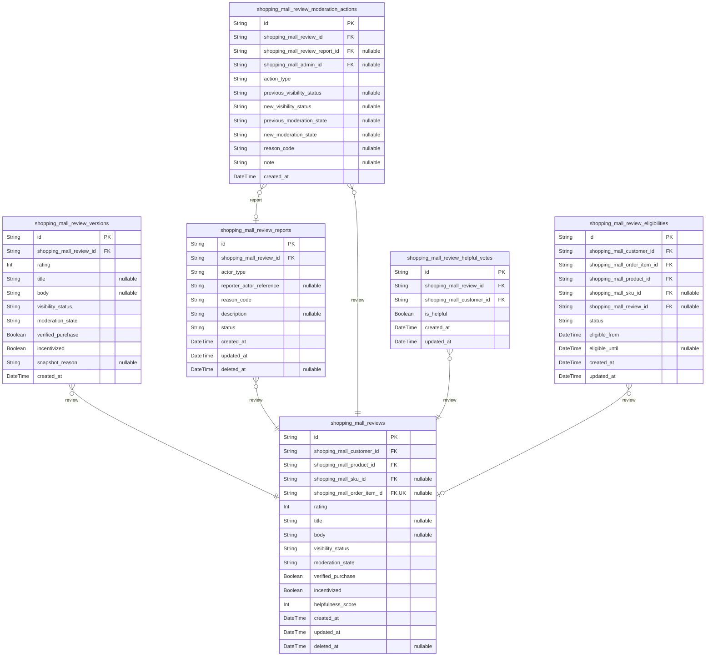

### `shopping_mall_reviews`

Customer-written product reviews and ratings.

Stores the canonical current version of each public review that a
customer has written about a purchased product or SKU. Each review is
linked to a specific order item to ensure verified purchase semantics and
to a product and optional SKU for aggregation. The table captures rating
score, optional title and body, visibility and moderation states, and
flags such as verified purchase and incentivized review.

The historical versions of the content are tracked in {@link
shopping_mall_review_versions}. Reports and moderation actions
referencing a review are stored in [shopping_mall_review_reports](#shopping_mall_review_reports)
and [shopping_mall_review_moderation_actions](#shopping_mall_review_moderation_actions). Helpful votes are
stored in [shopping_mall_review_helpful_votes](#shopping_mall_review_helpful_votes).

Properties as follows:

- `id`: Primary key. Unique identifier for the review.
- `shopping_mall_customer_id`: Customer who authored the review. [shopping_mall_customers.id](#shopping_mall_customers).
- `shopping_mall_product_id`: Reviewed product. [shopping_mall_products.id](#shopping_mall_products).
- `shopping_mall_sku_id`
  > Reviewed SKU variant when the review targets a specific SKU. Nullable
  > when the review is at product level only. [shopping_mall_skus.id](#shopping_mall_skus).
- `shopping_mall_order_item_id`
  > Order item that granted eligibility for this review. Nullable when the
  > review is not tied to a single order item (for example legacy imports).
  > [shopping_mall_order_items.id](#shopping_mall_order_items).
- `rating`
  > Star rating value given by the customer. Uses a discrete integer scale
  > such as 1–5 where higher numbers represent more positive evaluations.
- `title`
  > Optional short title summarizing the review. Used for quick scanning in
  > lists.
- `body`
  > Optional free-form text body containing the detailed review content
  > provided by the customer.
- `visibility_status`
  > Current visibility status of the review in customer-facing contexts.
  > Typical values include visible, hidden, pending_moderation, and removed.
  > Business logic controls which values are allowed.
- `moderation_state`
  > High-level moderation state reflecting whether the review has passed
  > checks, is flagged, or is under investigation. Used to drive moderation
  > queues and workflows.
- `verified_purchase`
  > Indicates whether this review is considered a verified purchase based on
  > linkage to completed order items and business rules.
- `incentivized`
  > Indicates whether the review was written under some incentive program,
  > such as coupons or rewards. Required for transparency and compliance with
  > regulations.
- `helpfulness_score`
  > Derived integer score representing net helpfulness (for example helpful
  > minus not helpful votes). Updated by application logic for ranking but
  > not used as the authoritative vote log.
- `created_at`: Timestamp when the review was first created.
- `updated_at`
  > Timestamp when the review was last updated, either by the author or by
  > system processes such as moderation state changes.
- `deleted_at`
  > Soft deletion timestamp. When not null the review should be excluded from
  > normal user-facing queries but retained for audit.

### `shopping_mall_review_versions`

Historical versions of review content for audit and change tracking.

Each row captures a point-in-time snapshot of the content and key flags
of a review from [shopping_mall_reviews](#shopping_mall_reviews). Versions are append-only
and allow the platform to reconstruct how a review looked at any time,
including rating, title, body, visibility status, and moderation state.

Snapshots are typically created whenever a customer edits their review or
when moderation actions change visibility-critical fields. This table
supports audit, dispute resolution, and compliance investigations.

Properties as follows:

- `id`: Primary key. Unique identifier for the review version snapshot.
- `shopping_mall_review_id`
  > The review whose state is captured in this version snapshot. {@link
  > shopping_mall_reviews.id}.
- `rating`
  > Rating value at the time of this snapshot. Preserves the historical score
  > even if the customer later edits it.
- `title`
  > Review title at the time of this snapshot. May differ from the current
  > review title.
- `body`
  > Review body text at the time of this snapshot. Captures the exact wording
  > used for audit purposes.
- `visibility_status`
  > Visibility status of the review at the time of this snapshot. Allows
  > reconstruction of when the review was visible or hidden.
- `moderation_state`
  > Moderation state at the time of this snapshot. Used for investigating
  > moderation decisions and their timeline.
- `verified_purchase`
  > Whether the review was marked as a verified purchase at the time of this
  > snapshot.
- `incentivized`
  > Whether the review was flagged as incentivized at the time of this
  > snapshot.
- `snapshot_reason`
  > Optional business-level reason describing why this snapshot was taken,
  > such as author_edit, moderation_change, or system_migration.
- `created_at`
  > Timestamp when this version snapshot was created. Represents the
  > effective time of the captured state.

### `shopping_mall_review_reports`

Reports and flags submitted against reviews.

Represents complaints and reports created by customers, sellers, or
internal systems regarding potentially problematic reviews stored in
[shopping_mall_reviews](#shopping_mall_reviews). Each report records who reported, the
category of the issue, free-form details, and current processing state.

Reports feed moderation workflows and can be linked to moderation actions
in [shopping_mall_review_moderation_actions](#shopping_mall_review_moderation_actions). Multiple reports may
exist for a single review, and a single reporter may file reports on
multiple reviews over time.

Properties as follows:

- `id`: Primary key. Unique identifier for the review report.
- `shopping_mall_review_id`
  > The review that has been reported as problematic. {@link
  > shopping_mall_reviews.id}.
- `actor_type`
  > Type of actor that submitted the report, such as customer, seller, or
  > system. Used to interpret reporter context in higher layers.
- `reporter_actor_reference`
  > Opaque reference identifier for the reporter, interpreted according to
  > actor_type by the application layer. Not enforced as a foreign key to
  > avoid polymorphic nullable FKs in this component.
- `reason_code`
  > Categorized reason for the report, such as offensive_content, spam,
  > conflict_of_interest, or other. Used to group and prioritize moderation
  > work.
- `description`
  > Optional free-form description provided by the reporter, giving more
  > context about why the review is considered problematic.
- `status`
  > Processing status of the report, such as open, under_review, resolved, or
  > dismissed. Drives moderation queues and SLAs.
- `created_at`: Timestamp when the report was created.
- `updated_at`
  > Timestamp when the report record was last updated, for example when
  > status changes.
- `deleted_at`
  > Soft deletion timestamp for the report. When set, the report is excluded
  > from normal moderation views but retained for audit.

### `shopping_mall_review_moderation_actions`

Moderation decisions and actions applied to reviews and related reports.

Records discrete actions taken by admins or automated policies when
handling reported or flagged reviews. Examples include hiding a review,
restoring a review, editing visibility status, or applying sanctions to
authors.

Each row links to the affected review in [shopping_mall_reviews](#shopping_mall_reviews),
optionally to a specific report in [shopping_mall_review_reports](#shopping_mall_review_reports),
and to the admin who performed the action from {@link
shopping_mall_admins}. Actions are append-only and provide a full audit
trail for governance and compliance.

Properties as follows:

- `id`: Primary key. Unique identifier for the moderation action.
- `shopping_mall_review_id`
  > Review that the moderation action targets. {@link
  > shopping_mall_reviews.id}.
- `shopping_mall_review_report_id`
  > Optional associated report that triggered this moderation action.
  > Nullable because some actions may be proactive or system-driven without a
  > specific report. [shopping_mall_review_reports.id](#shopping_mall_review_reports).
- `shopping_mall_admin_id`
  > Admin who performed the moderation action, when not automated. Nullable
  > for system-generated actions. [shopping_mall_admins.id](#shopping_mall_admins).
- `action_type`
  > Type of moderation action performed, such as hide_review, restore_review,
  > edit_visibility, or escalate_dispute.
- `previous_visibility_status`
  > Previous visibility status of the review before this action, when
  > relevant. Useful for debugging and audit but may be null when not
  > applicable.
- `new_visibility_status`
  > New visibility status applied by this action, when the action changes
  > visibility. Null when the action does not affect visibility.
- `previous_moderation_state`: Previous moderation state before this action, when relevant.
- `new_moderation_state`: New moderation state applied by this action, when relevant.
- `reason_code`
  > Categorized reason for the moderation action, for example
  > policy_violation, legal_request, or manual_override.
- `note`
  > Optional internal note providing additional context or explanation for
  > the moderation decision.
- `created_at`: Timestamp when the moderation action was recorded.

### `shopping_mall_review_helpful_votes`

Helpful vote records on reviews by customers.

Represents the many-to-many relationship between customers and reviews
where customers indicate whether a review is helpful. Each row
corresponds to one customer’s vote on one review.

This table is the authoritative log of votes used to derive aggregated
helpfulness metrics in [shopping_mall_reviews](#shopping_mall_reviews). It supports both
positive and negative votes so that net helpfulness can be computed.

Properties as follows:

- `id`: Primary key. Unique identifier for the helpful vote entry.
- `shopping_mall_review_id`
  > Review that received the helpfulness vote. {@link
  > shopping_mall_reviews.id}.
- `shopping_mall_customer_id`
  > Customer who cast the helpfulness vote. {@link
  > shopping_mall_customers.id}.
- `is_helpful`
  > Indicates whether the customer marked the review as helpful (true) or not
  > helpful (false).
- `created_at`: Timestamp when the vote was created.
- `updated_at`
  > Timestamp when the vote was last updated, for example when a customer
  > changes from helpful to not helpful.

### `shopping_mall_review_eligibilities`

Eligibility records indicating when customers are allowed to write reviews.

Represents the link between delivered order items and the customer’s
permission to submit a review for a product or SKU. Each row indicates
that a specific customer became eligible to review a specific product or
SKU based on an order item reaching a completed or delivered state.

The table captures eligibility status, timing constraints such as
expiration, and whether the eligibility has already been consumed by an
actual review in [shopping_mall_reviews](#shopping_mall_reviews). This supports business
rules like one review per purchase, review windows, and verified purchase
checks.

Properties as follows:

- `id`: Primary key. Unique identifier for the review eligibility record.
- `shopping_mall_customer_id`
  > Customer who becomes eligible to write a review. {@link
  > shopping_mall_customers.id}.
- `shopping_mall_order_item_id`
  > Order item whose completion or delivery created this review eligibility.
  > [shopping_mall_order_items.id](#shopping_mall_order_items).
- `shopping_mall_product_id`
  > Product that may be reviewed under this eligibility. {@link
  > shopping_mall_products.id}.
- `shopping_mall_sku_id`
  > SKU variant that may be reviewed under this eligibility when the purchase
  > was for a specific variant. Nullable when the eligibility is only at
  > product level. [shopping_mall_skus.id](#shopping_mall_skus).
- `shopping_mall_review_id`
  > Review that consumed this eligibility, when one has been created.
  > Nullable when the eligibility has not yet been used. {@link
  > shopping_mall_reviews.id}.
- `status`
  > Current eligibility status, such as eligible, used, expired, or revoked.
  > Controls whether the customer can currently create a review from this
  > record.
- `eligible_from`
  > Timestamp from which the customer is allowed to submit a review based on
  > this eligibility, typically when the order item is marked delivered or
  > completed.
- `eligible_until`
  > Optional timestamp after which this eligibility expires and can no longer
  > be used to create a new review.
- `created_at`: Timestamp when the eligibility record was created.
- `updated_at`
  > Timestamp when the eligibility record was last updated, for example when
  > status changes.

## SellerPortal

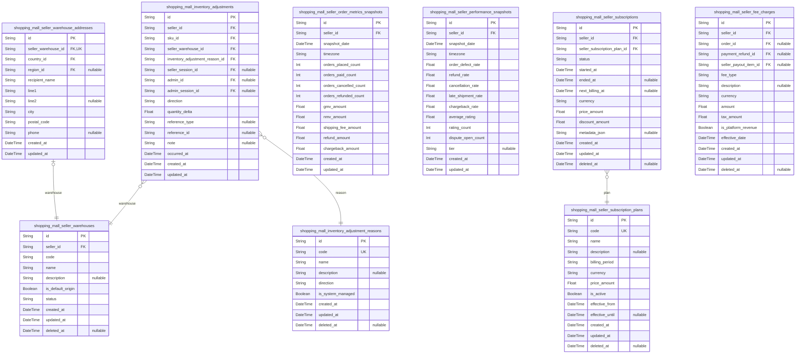

### `shopping_mall_seller_warehouses`

Physical or logical warehouses owned by sellers for inventory storage and
shipment origin.

Each warehouse belongs to exactly one seller and represents a location
from which SKUs are stocked and fulfilled. The warehouse stores
high-level metadata such as internal code, human-readable name,
operational status, and whether it is the default origin for the seller.

Address details are normalized into {@link
shopping_mall_seller_warehouse_addresses} so that postal information
remains independent and auditable over time. Inventory adjustment records
in [shopping_mall_inventory_adjustments](#shopping_mall_inventory_adjustments) reference warehouses to
indicate where stock changes occurred.

Admins may read and govern warehouses across sellers, while sellers
typically manage only their own warehouses via seller-portal flows.

Properties as follows:

- `id`: Primary key. Unique identifier of the seller warehouse.
- `seller_id`: Seller that owns this warehouse. [shopping_mall_sellers.id](#shopping_mall_sellers).
- `code`
  > Seller-scoped warehouse code used for internal reference. Must be unique
  > per seller and stable once assigned for reconciliation.
- `name`: Human-readable warehouse name shown in seller portal and internal tools.
- `description`
  > Optional longer description of the warehouse, such as notes about
  > purpose, capacity, or internal comments.
- `is_default_origin`
  > Whether this warehouse is the seller’s default shipping origin for new
  > SKUs and orders when no explicit origin is chosen.
- `status`
  > Operational status of the warehouse from business perspective, e.g.
  > active, inactive, suspended. Controls whether it can be used for new
  > fulfilment operations.
- `created_at`: Timestamp when the warehouse record was created.
- `updated_at`: Timestamp when the warehouse record was last updated.
- `deleted_at`
  > Soft deletion timestamp. When set, the warehouse is logically removed
  > from new operations but preserved for historical reference.

### `shopping_mall_seller_warehouse_addresses`

Postal and contact address details attached to seller warehouses.

This table stores normalized address information for {@link
shopping_mall_seller_warehouses}. Using a separate table avoids repeating
address columns across warehouse-like entities and supports future
extension such as multiple address types per warehouse (shipping origin,
return address) while maintaining 3NF.

Warehouse address records are typically managed indirectly via
seller-portal flows that edit a warehouse together with its address
fields rather than through independent CRUD operations.

Properties as follows:

- `id`: Primary key. Unique identifier of the warehouse address row.
- `seller_warehouse_id`
  > Warehouse that this address belongs to. One-to-one relationship with
  > [shopping_mall_seller_warehouses.id](#shopping_mall_seller_warehouses).
- `country_id`: Country of the warehouse location. [shopping_mall_countries.id](#shopping_mall_countries).
- `region_id`
  > Optional region or state of the warehouse address. {@link
  > shopping_mall_regions.id}.
- `recipient_name`
  > Recipient or contact name used for carrier labels and operational
  > communication.
- `line1`
  > First line of the warehouse street address (street, number, or primary
  > descriptor).
- `line2`: Second address line, such as building, floor, or suite information.
- `city`: City or locality of the warehouse.
- `postal_code`
  > Postal or ZIP code of the warehouse location, following local formatting
  > rules.
- `phone`
  > Optional phone number for the warehouse to be shared with carriers and
  > used for delivery issues.
- `created_at`: Timestamp when this address record was created.
- `updated_at`: Timestamp when this address record was last updated.

### `shopping_mall_inventory_adjustment_reasons`

Master data representing standardized reasons for inventory adjustments.

Each row describes a business-level reason why stock is increased or
decreased, such as purchase, correction, damage, shrinkage, or manual
reconciliation. These reasons are referenced by inventory adjustment
records in [shopping_mall_inventory_adjustments](#shopping_mall_inventory_adjustments).

Having a dedicated reasons table ensures consistent semantics across
sellers and time and supports governance, reporting, and policy
enforcement by admins.

Properties as follows:

- `id`: Primary key. Unique identifier of the inventory adjustment reason.
- `code`
  > Stable, system-wide reason code, for example PURCHASE_INBOUND or
  > STOCK_CORRECTION. Used in configuration and reporting.
- `name`: Human-readable name of the adjustment reason shown in UI and reports.
- `description`
  > Optional detailed explanation of when this reason should be used and any
  > relevant policy notes.
- `direction`
  > Business direction of the adjustment for reporting, such as increase,
  > decrease, or neutral. Application logic interprets this string as an
  > enum.
- `is_system_managed`
  > Indicates whether this reason is system-managed and cannot be edited or
  > deleted by regular admins.
- `created_at`: Timestamp when the reason record was created.
- `updated_at`: Timestamp when the reason record was last updated.
- `deleted_at`
  > Soft deletion timestamp. When set, the reason is no longer available for
  > new adjustments but remains for historical records.

### `shopping_mall_inventory_adjustments`

Atomic inventory adjustment events per seller, SKU, and warehouse.

Each record represents a single change to the on-hand or available
quantity of a SKU for a seller at a given warehouse. Adjustments are used
for manual corrections, inbound receipts, write-offs, damage, shrinkage,
and other non-order-based changes.

The table links to [shopping_mall_sellers](#shopping_mall_sellers) for ownership, {@link
shopping_mall_skus} for the affected SKU, {@link
shopping_mall_seller_warehouses} for the physical location, and {@link
shopping_mall_inventory_adjustment_reasons} for the standardized reason.
Optional references to sessions and admins allow clear audit trails about
who initiated the adjustment.

This table is append-only from a business perspective; corrections are
expressed as compensating adjustments rather than in-place updates,
maintaining a robust audit history aligned with risk and compliance
expectations.

Properties as follows:

- `id`: Primary key. Unique identifier of the inventory adjustment event.
- `seller_id`
  > Seller that owns the stock being adjusted. {@link
  > shopping_mall_sellers.id}.
- `sku_id`: SKU whose inventory is adjusted. [shopping_mall_skus.id](#shopping_mall_skus).
- `seller_warehouse_id`
  > Warehouse where the stock change occurs. {@link
  > shopping_mall_seller_warehouses.id}.
- `inventory_adjustment_reason_id`
  > Reason category explaining why this adjustment was performed. {@link
  > shopping_mall_inventory_adjustment_reasons.id}.
- `seller_session_id`
  > Optional seller session that initiated the adjustment, for traceability.
  > [shopping_mall_seller_sessions.id](#shopping_mall_seller_sessions).
- `admin_id`
  > Optional admin responsible for this adjustment when done via admin tools.
  > [shopping_mall_admins.id](#shopping_mall_admins).
- `admin_session_id`
  > Optional admin session associated with the adjustment event. {@link
  > shopping_mall_admin_sessions.id}.
- `direction`
  > Adjustment direction from the event’s own perspective, for example
  > increase or decrease. Typically matches or refines the direction on the
  > reason.
- `quantity_delta`
  > Quantity change applied to the SKU at this warehouse. Positive values
  > increase stock, negative values decrease stock.
- `reference_type`
  > Optional business reference type string describing the origin context,
  > e.g. inbound_shipment, inventory_audit, manual_correction.
- `reference_id`
  > Optional external business identifier associated with the adjustment,
  > such as an internal document ID or shipment reference.
- `note`
  > Optional free-text note describing details of the adjustment for human
  > audit and explanation.
- `occurred_at`
  > Business timestamp when the stock change actually occurred, which may
  > differ slightly from record creation time.
- `created_at`: Timestamp when this adjustment record was inserted.
- `updated_at`
  > Timestamp when metadata of this adjustment record was last updated.
  > Quantity and core links are typically immutable.

### `shopping_mall_seller_order_metrics_snapshots`

Time-series snapshots of seller order-related metrics for analytics and
monitoring.

Each record represents aggregated metrics for a seller over a specific
snapshot period, such as a day. The table captures values like order
counts, GMV, cancellation volume, refund volume, and derived KPIs used
for dashboards and risk checks.

Snapshots are computed from transactional sources such as {@link
shopping_mall_orders}, [shopping_mall_order_items](#shopping_mall_order_items), and refund
components, but those details are not duplicated here beyond raw metrics.
This table is treated as an append-only snapshot store with a clear
snapshot_date dimension to support efficient trend queries and KPI
computations.

Properties as follows:

- `id`: Primary key. Unique identifier of the seller order metrics snapshot row.
- `seller_id`
  > Seller for whom these order metrics are recorded. {@link
  > shopping_mall_sellers.id}.
- `snapshot_date`
  > Date or date-time representing the logical period boundary for this
  > snapshot, typically the start of the day being summarized.
- `timezone`
  > Business timezone identifier used when aggregating metrics, such as
  > Asia/Seoul. Ensures consistent day boundaries across reports.
- `orders_placed_count`
  > Number of orders that entered a placed or confirmed state for the seller
  > within the snapshot period.
- `orders_paid_count`
  > Number of orders that reached a paid state for the seller within the
  > snapshot period.
- `orders_cancelled_count`
  > Number of orders or order segments cancelled for the seller during the
  > snapshot period, regardless of reason.
- `orders_refunded_count`
  > Number of orders or line segments with approved refunds affecting the
  > seller during the snapshot period.
- `gmv_amount`
  > Gross merchandise value for the seller’s orders in the snapshot period,
  > before cancellations and refunds.
- `nmv_amount`
  > Net merchandise value after accounting for cancellations and refunds in
  > the snapshot period, from the seller’s perspective.
- `shipping_fee_amount`
  > Total shipping fees charged to customers associated with the seller’s
  > items in the snapshot period.
- `refund_amount`
  > Total customer refund amount impacting the seller’s items in the snapshot
  > period.
- `chargeback_amount`
  > Total amount involved in chargebacks associated with the seller in the
  > snapshot period.
- `created_at`
  > Timestamp when this snapshot row was created by the metrics computation
  > process.
- `updated_at`
  > Timestamp when this snapshot row was last recalculated or corrected, if
  > applicable.

### `shopping_mall_seller_performance_snapshots`

Aggregated performance KPIs per seller at defined points in time.

This table summarizes seller-level health indicators such as refund
rates, cancellation rates, late shipment rates, dispute counts, and
rating statistics. It is used by admins and risk engines to classify
sellers into tiers and to trigger governance workflows.

The data is derived from transactional tables like orders, shipments,
refunds, disputes, and reviews ([shopping_mall_orders](#shopping_mall_orders), {@link
shopping_mall_shipments}, [shopping_mall_reviews](#shopping_mall_reviews)), but those
details are not repeated here. Instead, this table stores normalized
numeric metrics in snapshot form, supporting trend analysis and
segmentation while preserving 3NF in the transactional schema.

Properties as follows:

- `id`: Primary key. Unique identifier of the seller performance snapshot row.
- `seller_id`
  > Seller whose performance metrics are represented. {@link
  > shopping_mall_sellers.id}.
- `snapshot_date`
  > Logical date or date-time representing when this performance snapshot was
  > computed.
- `timezone`
  > Timezone context used for computing the performance window, such as
  > Asia/Seoul.
- `order_defect_rate`
  > Order defect rate for the seller during the analysis window, expressed as
  > a fraction between 0 and 1.
- `refund_rate`
  > Refund rate for the seller during the analysis window, expressed as a
  > fraction between 0 and 1.
- `cancellation_rate`
  > Cancellation rate for the seller during the analysis window, expressed as
  > a fraction between 0 and 1.
- `late_shipment_rate`
  > Proportion of shipments that were dispatched or delivered late in the
  > analysis window, expressed as a fraction between 0 and 1.
- `chargeback_rate`
  > Proportion of paid orders that resulted in chargebacks during the
  > analysis window, expressed as a fraction between 0 and 1.
- `average_rating`
  > Average product rating (for example 1–5 scale) for the seller’s catalog
  > at this snapshot point, derived from reviews.
- `rating_count`: Number of ratings considered when computing average_rating.
- `dispute_open_count`
  > Number of open disputes involving the seller at the time of snapshot
  > computation.
- `tier`
  > Optional seller tier classification at this snapshot (for example new,
  > standard, premium, high_risk). Evaluated by business rules.
- `created_at`: Timestamp when the snapshot row was created.
- `updated_at`
  > Timestamp when the snapshot row was last updated due to recomputation or
  > corrections.

### `shopping_mall_seller_subscription_plans`

Catalog of subscription plans and service offerings available to sellers.

Each row describes a plan that a seller can subscribe to, such as basic,
standard, or premium tiers. Plans define attributes like billing period,
base fee, included features, and whether they are currently available for
new sign-ups.

Subscriptions in [shopping_mall_seller_subscriptions](#shopping_mall_seller_subscriptions) reference
these plans to determine pricing and entitlements. Admins manage this
table to add, modify, or retire plans over time while preserving
historical understanding of what each plan contained when a subscription
was active.

Properties as follows:

- `id`: Primary key. Unique identifier of the seller subscription plan.
- `code`
  > Stable business code for the plan, such as BASIC, PRO, or ENTERPRISE.
  > Used in configuration, integrations, and reporting.
- `name`: Human-readable plan name exposed to sellers in the portal.
- `description`
  > Optional detailed description of features and benefits included in this
  > plan.
- `billing_period`
  > Billing period identifier, for example monthly or yearly. Application
  > logic treats this string as an enum.
- `currency`: ISO currency code used for billing this plan, such as USD or KRW.
- `price_amount`
  > Subscription fee amount per billing period, expressed in the plan’s
  > currency.
- `is_active`
  > Whether the plan is currently active and available for new subscriptions.
  > Existing subscriptions may continue even if the plan is deactivated.
- `effective_from`
  > Timestamp from which the plan is considered effective for new
  > subscriptions and pricing calculations.
- `effective_until`
  > Optional timestamp after which the plan is no longer offered for new
  > subscriptions. Null means open-ended.
- `created_at`: Timestamp when the plan record was created.
- `updated_at`: Timestamp when the plan record was last updated.
- `deleted_at`
  > Soft deletion timestamp for plans that should no longer appear anywhere,
  > subject to business retention rules.

### `shopping_mall_seller_subscriptions`

Individual subscriptions of sellers to specific subscription plans.

Each record links a seller to a plan from {@link
shopping_mall_seller_subscription_plans} and tracks the subscription
lifecycle, including start and end timestamps, current status, and
billing amounts.

These records are used to determine which features and limits apply to a
seller at a given time and to drive billing, invoicing, and revenue
recognition logic. They align with the business model requirements for
seller subscriptions and service fees outlined in the revenue and goals
specification.

Properties as follows:

- `id`: Primary key. Unique identifier for the seller subscription instance.
- `seller_id`: Seller who owns this subscription. [shopping_mall_sellers.id](#shopping_mall_sellers).
- `seller_subscription_plan_id`
  > Subscription plan that defines pricing and entitlements for this
  > subscription. [shopping_mall_seller_subscription_plans.id](#shopping_mall_seller_subscription_plans).
- `status`
  > Current subscription status, such as pending, active, past_due,
  > cancelled, or expired. Application logic treats this as a business enum.
- `started_at`: Timestamp when the subscription became active for the seller.
- `ended_at`
  > Timestamp when the subscription ended or is scheduled to end. Null while
  > the subscription is ongoing.
- `next_billing_at`
  > Timestamp of the next expected billing event, if applicable for this
  > subscription.
- `currency`
  > Currency code in which this subscription is billed. Usually matches the
  > plan currency but stored explicitly for historical accuracy.
- `price_amount`
  > Nominal price per billing period for this subscription at the time of
  > activation, in the subscription currency.
- `discount_amount`
  > Per-period discount amount applied to this subscription, if any. Zero
  > means no discount.
- `metadata_json`
  > Optional JSON-encoded metadata capturing configuration or context
  > specific to this subscription instance. Not used for computed values.
- `created_at`: Timestamp when the subscription record was created.
- `updated_at`: Timestamp when the subscription record was last updated.
- `deleted_at`
  > Soft deletion timestamp. Used when a subscription is logically removed
  > from normal views but retained for compliance and revenue audits.

### `shopping_mall_seller_fee_charges`

Individual fee and commission charges applied to sellers for
transactional and service events.

Each record represents a distinct charge that impacts the net earnings or
balance of a seller, such as transaction commissions, platform-owned
fees, subscription charges, advertising fees, adjustments, or penalties.

The table links to [shopping_mall_sellers](#shopping_mall_sellers) and may optionally
reference an order in [shopping_mall_orders](#shopping_mall_orders), a refund in {@link
shopping_mall_payment_refunds}, or a payout item in {@link
shopping_mall_seller_payout_items} for reconciliation. It aligns with the
revenue model by making each charge explicit, auditable, and traceable
through time without pre-aggregating data.

Properties as follows:

- `id`: Primary key. Unique identifier of the seller fee charge row.
- `seller_id`: Seller to whom this fee charge applies. [shopping_mall_sellers.id](#shopping_mall_sellers).
- `order_id`
  > Optional related order that caused this charge, if any. {@link
  > shopping_mall_orders.id}.
- `payment_refund_id`
  > Optional related payment refund record when this fee is associated with a
  > refund event. [shopping_mall_payment_refunds.id](#shopping_mall_payment_refunds).
- `seller_payout_item_id`
  > Optional payout item that settled this fee charge, used for
  > reconciliation. [shopping_mall_seller_payout_items.id](#shopping_mall_seller_payout_items).
- `fee_type`
  > Business category of the fee, such as transaction_commission,
  > platform_service_fee, subscription_fee, advertising_fee, or adjustment.
  > Application treats this as an enum.
- `description`
  > Optional human-readable description explaining the origin of the fee
  > charge.
- `currency`: Currency code in which the fee amount is expressed.
- `amount`
  > Fee amount applied to the seller. Positive values represent charges to
  > the seller (reducing net earnings), while negative values may represent
  > fee reversals or credits.
- `tax_amount`
  > Tax portion associated with this fee, if applicable, expressed in the
  > same currency. Zero when no tax applies.
- `is_platform_revenue`
  > Indicates whether this fee contributes to platform revenue (true) or is a
  > pass-through amount due entirely to third parties (false).
- `effective_date`
  > Business date on which the fee is considered effective for revenue
  > recognition and reporting.
- `created_at`: Timestamp when this fee charge record was created.
- `updated_at`: Timestamp when this fee charge record was last updated.
- `deleted_at`
  > Soft deletion timestamp for logically removed fee charges, preserved for
  > audit and reconciliation use cases.

## Admin

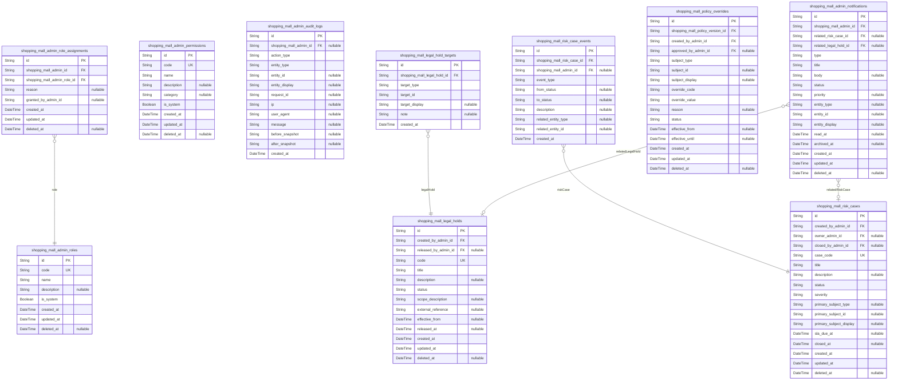

### `shopping_mall_admin_roles`

Administrative role definitions for RBAC within the shoppingMall platform.

Each record represents a named role that can be assigned to one or more
admin accounts. Roles encapsulate collections of permissions in
application logic and are used to control which governance and
operational actions each admin may perform.

Roles are referenced from [shopping_mall_admin_role_assignments](#shopping_mall_admin_role_assignments)
and may be used implicitly in audit log interpretations and risk
workflows.

Properties as follows:

- `id`: Primary key for the admin role record.
- `code`
  > Stable, unique machine-oriented code for the role (for example,
  > "super_admin", "operations_admin"). Used in configuration and application
  > logic.
- `name`: Human-readable display name for the role as shown in admin tools.
- `description`
  > Optional detailed description explaining the purpose, scope, and intended
  > users of this role.
- `is_system`
  > Indicates whether this role is a system-protected role that cannot be
  > freely edited or deleted by regular admins.
- `created_at`: Timestamp when this role was created.
- `updated_at`: Timestamp when this role was last updated.
- `deleted_at`
  > Soft deletion timestamp. When set, the role should no longer be assigned
  > to admins but remains for historical reference.

### `shopping_mall_admin_role_assignments`

Assignments linking admin accounts to administrative roles.

Each record associates a specific admin with a specific {@link
shopping_mall_admin_roles} entry and indicates when and why the
assignment was made. This table forms the many-to-many junction between
admins and roles and is critical for RBAC evaluation.

Assignments may be soft-deleted when revoked, but historical admin audit
logs reference them indirectly through the roles and permissions granted
at the time of an action.

Properties as follows:

- `id`: Primary key for the admin role assignment record.
- `shopping_mall_admin_id`
  > Identifier of the admin account receiving the role assignment. {@link
  > shopping_mall_admins.id}.
- `shopping_mall_admin_role_id`
  > Identifier of the role assigned to the admin. {@link
  > shopping_mall_admin_roles.id}.
- `reason`
  > Optional human-readable reason or justification for granting this role to
  > the admin.
- `granted_by_admin_id`
  > Identifier of the admin who granted this role. Nullable for
  > system-granted roles. References [shopping_mall_admins.id](#shopping_mall_admins)
  > logically, but kept as a plain field for flexibility in historical data.
- `created_at`: Timestamp when this role assignment was created.
- `updated_at`: Timestamp when this role assignment was last updated.
- `deleted_at`
  > Soft deletion timestamp indicating when the role was revoked for this
  > admin.

### `shopping_mall_admin_permissions`

Catalog of fine-grained administrative permissions used by RBAC.

Each record describes a single permission that can be conceptually linked
to roles or directly evaluated by application logic. Permissions
typically correspond to actions such as viewing or editing users,
moderating catalog entries, or resolving disputes.

Although there is no explicit role-permission join table in this
component, permission codes are referenced in configuration and in {@link
shopping_mall_business_policies} for governance rules.

Properties as follows:

- `id`: Primary key for the admin permission record.
- `code`
  > Stable, unique machine-oriented code for the permission (for example,
  > "user.manage", "seller.suspend"). Used in RBAC evaluation.
- `name`
  > Human-readable display name for the permission as seen by admins
  > configuring RBAC.
- `description`
  > Optional detailed description of what the permission allows and any
  > constraints or warnings.
- `category`
  > Optional high-level category or module name to group related permissions
  > (for example, "users", "orders", "catalog").
- `is_system`
  > Indicates whether this permission is system-defined and cannot be removed
  > or arbitrarily modified.
- `created_at`: Timestamp when this permission definition was created.
- `updated_at`: Timestamp when this permission definition was last updated.
- `deleted_at`
  > Soft deletion timestamp. When set, the permission is no longer assignable
  > but kept for historical interpretation of past actions.

### `shopping_mall_admin_audit_logs`

Append-only audit trail of administrative actions performed on the
shoppingMall platform.

Each record represents a single action taken by an admin or system
process against some business entity, including changes to users,
sellers, catalog, orders, refunds, disputes, policies, or configuration.

The table supports compliance, forensic analysis, and governance
reporting and is typically queried by time range, admin, entity type, or
action type. Records are never soft-deleted or updated once created.

Properties as follows:

- `id`: Primary key for the admin audit log entry.
- `shopping_mall_admin_id`
  > Identifier of the admin who performed the action. Nullable for
  > system-initiated events. [shopping_mall_admins.id](#shopping_mall_admins).
- `action_type`
  > Machine-readable code identifying the type of action performed (for
  > example, "USER_STATUS_CHANGE", "SELLER_APPROVAL", "PRODUCT_BLOCK").
- `entity_type`
  > Type of business entity affected by the action (for example, "customer",
  > "seller", "product", "order", "refund_request", "dispute").
- `entity_id`
  > Identifier of the target entity as stored in its domain table. Nullable
  > for actions that do not target a specific entity.
- `entity_display`
  > Human-friendly identifier for the target entity such as email, seller
  > name, or order code, captured at the time of the action.
- `request_id`
  > Optional correlation identifier for the request or session in which the
  > action occurred, useful for tracing grouped operations.
- `ip`
  > Best-effort textual representation of the remote IP address from which
  > the admin action was triggered.
- `user_agent`
  > User agent string or descriptive label for the client used to perform the
  > action.
- `message`
  > Short human-readable summary of the action, suitable for audit browsing
  > and search.
- `before_snapshot`
  > Optional serialized representation of relevant entity fields before the
  > change, stored as text for audit purposes.
- `after_snapshot`
  > Optional serialized representation of relevant entity fields after the
  > change, stored as text for audit purposes.
- `created_at`: Timestamp when this audit log entry was recorded.

### `shopping_mall_legal_holds`

Legal hold records that prevent deletion or alteration of data for
compliance or investigation.

Each legal hold is created by an admin to preserve information related to
specific users, sellers, orders, disputes, or other entities for legal or
regulatory reasons. Holds have a lifecycle from creation through possible
release.

Targets of a legal hold are represented in {@link
shopping_mall_legal_hold_targets}, allowing a single hold to apply to
many business entities across domains.

Properties as follows:

- `id`: Primary key for the legal hold record.
- `created_by_admin_id`
  > Identifier of the admin who created the legal hold. {@link
  > shopping_mall_admins.id}.
- `released_by_admin_id`
  > Identifier of the admin who formally released the legal hold, if any.
  > [shopping_mall_admins.id](#shopping_mall_admins).
- `code`
  > Stable identifier or reference code for the legal hold, suitable for
  > external correspondence and internal search.
- `title`
  > Short human-readable title describing the legal hold, such as a case name
  > or subject summary.
- `description`
  > Optional detailed explanation of the reason for the legal hold, including
  > legal context and scope notes.
- `status`
  > Current status of the legal hold, such as "active", "released", or other
  > business-defined states.
- `scope_description`
  > Optional description of the intended scope of the hold in business terms,
  > such as which entities or time periods are covered.
- `external_reference`
  > Optional external case or ticket identifier used by legal or compliance
  > teams.
- `effective_from`
  > Optional datetime from which the hold should be considered effective. If
  > null, the hold is effective from creation time.
- `released_at`: Timestamp when the legal hold was officially released, if applicable.
- `created_at`: Timestamp when the legal hold was created.
- `updated_at`: Timestamp when the legal hold record was last updated.
- `deleted_at`
  > Soft deletion timestamp. When set, the hold is no longer active for new
  > operations but remains for historical audits.

### `shopping_mall_legal_hold_targets`

Targets associated with a given legal hold, representing the specific
entities whose data must be preserved.

Each record links a [shopping_mall_legal_holds](#shopping_mall_legal_holds) entry to a single
business entity, such as a customer, seller, order, dispute, or review.
Polymorphic fields are used so that the same hold can apply across
multiple domains without separate subtype tables.

This table is append-only and provides fine-grained traceability for
which records are impacted by a legal hold at any given time.

Properties as follows:

- `id`: Primary key for the legal hold target record.
- `shopping_mall_legal_hold_id`
  > Identifier of the legal hold to which this target belongs. {@link
  > shopping_mall_legal_holds.id}.
- `target_type`
  > Type of entity affected by the hold (for example, "customer", "seller",
  > "order", "dispute", "review").
- `target_id`
  > Identifier of the targeted entity in its own domain table. The
  > application enforces correct pairing with target_type.
- `target_display`
  > Optional human-friendly display identifier for the target entity such as
  > an email address, seller name, or order number captured at linking time.
- `note`
  > Optional note about why this particular target was included in the legal
  > hold.
- `created_at`: Timestamp when this target was attached to the legal hold.

### `shopping_mall_risk_cases`

High-level risk or fraud cases managed by governance and risk teams.

Each record represents a single risk investigation or case, such as
suspicious seller behavior, abnormal customer refunds, or potential abuse
patterns. Cases have lifecycle states, severity classification, and
associations to primary subjects.

Timeline events linked to a case are stored in {@link
shopping_mall_risk_case_events}, while policy overrides, legal holds, and
admin notifications may reference cases for coordinated risk handling.

Properties as follows:

- `id`: Primary key for the risk case record.
- `created_by_admin_id`
  > Identifier of the admin who created the risk case. {@link
  > shopping_mall_admins.id}.
- `owner_admin_id`
  > Identifier of the admin currently responsible for managing the risk case.
  > [shopping_mall_admins.id](#shopping_mall_admins).
- `closed_by_admin_id`
  > Identifier of the admin who closed the risk case, if closed. {@link
  > shopping_mall_admins.id}.
- `case_code`
  > Stable code or reference identifier for the case, used in reporting and
  > cross-system references.
- `title`
  > Short summary title describing the risk case, such as the main suspicion
  > or subject.
- `description`
  > Optional detailed description of the risk scenario, context, and initial
  > findings at case creation.
- `status`
  > Current status of the case, such as "open", "under_review", or "closed"
  > according to business policy.
- `severity`
  > Business-level severity classification for the case, such as "low",
  > "medium", "high", or "critical".
- `primary_subject_type`
  > Type of primary subject for the case, such as "customer", "seller",
  > "order", or "payment". Nullable if the case is purely systemic.
- `primary_subject_id`
  > Identifier of the primary subject entity in its own domain table, used
  > for direct association in reports and filtering.
- `primary_subject_display`
  > Human-readable identifier for the primary subject such as email, seller
  > name, or order number.
- `sla_due_at`
  > Datetime by which the case should be handled according to SLA, if
  > applicable.
- `closed_at`: Timestamp when the case reached a terminal or closed status.
- `created_at`: Timestamp when the risk case was created.
- `updated_at`: Timestamp when the risk case was last updated.
- `deleted_at`
  > Soft deletion timestamp. When set, the case is hidden from normal work
  > queues but kept for historical and audit purposes.

### `shopping_mall_risk_case_events`

Timeline events and activities associated with a risk case.

Each record represents a single event in the lifecycle of a {@link
shopping_mall_risk_cases} entry, such as creation, status change, note
added, escalation, or automatic rule evaluation.

Events are append-only, provide a chronological history of the case, and
reference the admin who triggered the event when applicable.

Properties as follows:

- `id`: Primary key for the risk case event record.
- `shopping_mall_risk_case_id`
  > Identifier of the risk case to which this event belongs. {@link
  > shopping_mall_risk_cases.id}.
- `shopping_mall_admin_id`
  > Identifier of the admin who triggered this event, if any. Nullable for
  > automated events. [shopping_mall_admins.id](#shopping_mall_admins).
- `event_type`
  > Machine-readable type of event, such as "created", "status_changed",
  > "note_added", "rule_triggered".
- `from_status`
  > Previous status of the risk case when this event represents a status
  > change. Null for events that did not change status.
- `to_status`
  > New status of the risk case when this event represents a status change.
  > Null for non-status-change events.
- `description`
  > Optional human-readable description or note explaining what happened in
  > this event.
- `related_entity_type`
  > Optional type of a related entity referenced by the event, such as an
  > order, payment, or dispute.
- `related_entity_id`: Identifier of the related entity in its own domain table, when applicable.
- `created_at`: Timestamp when this event was recorded.

### `shopping_mall_policy_overrides`

Explicit overrides of default business policies for specific subjects.

Each record represents a deviation from the standard policy
configuration, such as custom refund windows for a seller, custom
commission rates for a category, or special rating rules for a campaign.

Policy overrides reference a base policy version and apply to a
particular subject, allowing governance teams to manage exceptions
explicitly. They may be associated with risk cases or legal contexts at
the application level.

Properties as follows:

- `id`: Primary key for the policy override record.
- `shopping_mall_policy_version_id`
  > Identifier of the base policy version being overridden. {@link
  > shopping_mall_policy_versions.id}.
- `created_by_admin_id`
  > Identifier of the admin who created this policy override. {@link
  > shopping_mall_admins.id}.
- `approved_by_admin_id`
  > Identifier of the admin who approved this override, if approval is
  > required. [shopping_mall_admins.id](#shopping_mall_admins).
- `subject_type`
  > Type of subject to which the override applies, such as "seller",
  > "category", "product", or "global".
- `subject_id`
  > Identifier of the specific subject entity when applicable (for example a
  > seller ID or category ID). May be null for global overrides.
- `subject_display`
  > Human-friendly representation of the subject, such as a seller name or
  > category path, stored for quick reference.
- `override_code`
  > Code or key that identifies which aspect of the policy is being
  > overridden (for example refund window, commission rate, or SLA
  > threshold).
- `override_value`
  > Business-level value used in place of the default policy configuration,
  > stored as text to allow flexible interpretation in application logic.
- `reason`
  > Optional explanation of why this override exists, including links to
  > cases or legal reasons if relevant.
- `status`: Current status of the override, such as "pending", "active", or "expired".
- `effective_from`
  > Datetime from which the override should start applying. Null means
  > effective immediately at creation.
- `effective_until`: Datetime after which the override should no longer apply, if defined.
- `created_at`: Timestamp when the policy override was created.
- `updated_at`: Timestamp when the policy override was last updated.
- `deleted_at`
  > Soft deletion timestamp. When set, the override is inactive but preserved
  > for historical and audit purposes.

### `shopping_mall_admin_notifications`

Notifications and tasks directed to admin users for governance,
operations, or risk handling.

Each record represents a notification item or to-do entry shown in admin
dashboards, such as pending seller approvals, escalated disputes, SLA
breaches, or required policy reviews.

Notifications are associated with specific admins and may link to risk
cases, legal holds, or other entities via polymorphic references. They
have statuses to support unread, read, and archived workflows.

Properties as follows:

- `id`: Primary key for the admin notification record.
- `shopping_mall_admin_id`
  > Identifier of the admin who should see or act on this notification.
  > [shopping_mall_admins.id](#shopping_mall_admins).
- `related_risk_case_id`
  > Optional reference to a related risk case for quick navigation. {@link
  > shopping_mall_risk_cases.id}.
- `related_legal_hold_id`
  > Optional reference to a related legal hold for quick navigation. {@link
  > shopping_mall_legal_holds.id}.
- `type`
  > Machine-readable type of the notification, such as
  > "seller_approval_needed", "refund_escalation", or "risk_sla_violation".
- `title`: Short title summarizing the notification content.
- `body`
  > Optional detailed body text providing context, instructions, or
  > additional information for the admin.
- `status`
  > Current status of the notification from the admin perspective, such as
  > "unread", "read", or "archived".
- `priority`
  > Optional business-level priority indicator such as "low", "normal", or
  > "high".
- `entity_type`
  > Optional polymorphic entity type associated with the notification (for
  > example, "seller", "order", "dispute").
- `entity_id`
  > Identifier of the associated entity, used for deep linking from the
  > notification to a specific record.
- `entity_display`
  > Human-friendly label for the associated entity such as a name or code,
  > stored for quick reference.
- `read_at`: Timestamp when the admin first marked or viewed this notification as read.
- `archived_at`: Timestamp when the notification was archived or explicitly dismissed.
- `created_at`: Timestamp when the notification was created.
- `updated_at`: Timestamp when the notification was last updated, such as status changes.
- `deleted_at`
  > Soft deletion timestamp. When set, the notification is not shown in
  > normal views but remains for audit purposes.

## Analytics

```mermaid
erDiagram
"shopping_mall_order_daily_stats" {
  String id PK
  DateTime stats_date UK
  Int order_count
  Int paid_order_count
  Int cancelled_order_count
  Int refunded_order_count
  Float gmv_amount
  Float nmv_amount
  Int item_count
  Int unique_customer_count
  Int unique_seller_count
  Float average_order_value
  Float refund_amount
  Float chargeback_amount
  DateTime created_at
  DateTime updated_at
}
"shopping_mall_seller_daily_stats" {
  String id PK
  String shopping_mall_seller_id FK
  DateTime stats_date
  Int order_count
  Int paid_order_count
  Int cancelled_order_count
  Int refunded_order_count
  Float gmv_amount
  Float nmv_amount
  Float commission_amount
  Float seller_earnings_amount
  Int unique_customer_count
  Int shipment_created_count
  Int shipment_delivered_count
  Int late_shipment_count
  Int dispute_opened_count
  Int dispute_lost_count
  Float average_rating
  Int rating_review_count
  DateTime created_at
  DateTime updated_at
}
"shopping_mall_customer_daily_stats" {
  String id PK
  String shopping_mall_customer_id FK
  DateTime stats_date
  Int order_count
  Int paid_order_count
  Float gmv_amount
  Float nmv_amount
  Float refund_amount
  Int cart_add_count
  Int wishlist_add_count
  Int session_count
  Boolean is_new_customer
  Boolean has_repeat_orders
  DateTime created_at
  DateTime updated_at
}
"shopping_mall_campaign_metrics" {
  String id PK
  DateTime stats_date
  String campaign_code
  Int order_count
  Int paid_order_count
  Float gmv_amount
  Float nmv_amount
  Float discount_total_amount
  Float platform_funded_discount_amount
  Float seller_funded_discount_amount
  Int new_customer_order_count
  DateTime created_at
  DateTime updated_at
}
"shopping_mall_platform_kpi_snapshots" {
  String id PK
  String period_type
  DateTime period_start
  DateTime period_end
  Float gmv_amount
  Float nmv_amount
  Float platform_revenue_amount
  Float take_rate
  Int order_count
  Int paid_order_count
  Int active_customer_count
  Int new_customer_count
  Int active_seller_count
  Int refund_request_count
  Int approved_refund_count
  Float refunded_amount
  Int chargeback_count
  Float chargeback_amount
  Float average_order_value
  DateTime created_at
  DateTime updated_at
}
"shopping_mall_payment_method_stats" {
  String id PK
  String shopping_mall_payment_method_id FK "nullable"
  DateTime stats_date
  String payment_method_code
  Int payment_attempt_count
  Int payment_success_count
  Int payment_failure_count
  Int payment_expired_count
  Float paid_gmv_amount
  Float refunded_amount
  Float chargeback_amount
  DateTime created_at
  DateTime updated_at
}
"shopping_mall_shipping_performance_stats" {
  String id PK
  String shopping_mall_shipping_method_id FK "nullable"
  DateTime stats_date
  String shipping_method_code
  Int shipment_created_count
  Int shipment_shipped_count
  Int shipment_delivered_count
  Int shipment_delivery_failed_count
  Int shipment_returned_count
  Float median_fulfillment_time_hours
  Float median_transit_time_hours
  Float on_time_delivery_rate
  DateTime created_at
  DateTime updated_at
}
"shopping_mall_refund_and_dispute_stats" {
  String id PK
  DateTime stats_date UK
  Int refund_request_count
  Int approved_refund_request_count
  Int rejected_refund_request_count
  Float refunded_amount
  Int partial_refund_count
  Int full_refund_count
  Int dispute_opened_count
  Int dispute_resolved_count
  Int dispute_resolved_for_customer_count
  Int dispute_resolved_for_seller_count
  Float average_refund_resolution_time_hours
  Float average_dispute_resolution_time_hours
  DateTime created_at
  DateTime updated_at
}
```

### `shopping_mall_order_daily_stats`

Daily aggregated order and revenue statistics for the entire marketplace.

Each row represents metrics for a single calendar date covering all
orders across all sellers and customers. It is populated by ETL or batch
jobs based on transactional order, payment, refund, and shipment data.

These aggregates are used to compute GMV, NMV, order counts, item counts,
and other high-level KPIs required by business and analytics teams. Rows
are typically append-only and updated if recomputation is needed for a
given date.

Properties as follows:

- `id`: Primary key for the daily order stats snapshot row.
- `stats_date`
  > Calendar date for which these statistics are calculated. Time component
  > SHOULD be normalized to midnight UTC for consistency.
- `order_count`
  > Total number of successfully created orders on this date, regardless of
  > payment outcome.
- `paid_order_count`: Number of orders that reached a paid state on this date.
- `cancelled_order_count`
  > Number of orders that were cancelled on this date, including customer-
  > and system-initiated cancellations.
- `refunded_order_count`: Number of orders that had at least one refund completed on this date.
- `gmv_amount`
  > Gross Merchandise Value (GMV) for orders associated with this date,
  > before refunds and cancellations, expressed in the platform base
  > currency.
- `nmv_amount`
  > Net Merchandise Value (NMV) for this date after subtracting refunded or
  > cancelled amounts, expressed in the platform base currency.
- `item_count`: Total number of order line items across all orders created on this date.
- `unique_customer_count`: Number of distinct customers who placed at least one order on this date.
- `unique_seller_count`
  > Number of distinct sellers who had at least one item included in orders
  > created on this date.
- `average_order_value`
  > Average order value (AOV) for this date, typically calculated as GMV
  > divided by paid_order_count.
- `refund_amount`
  > Total amount refunded on this date across all orders, expressed in the
  > platform base currency.
- `chargeback_amount`
  > Total value of chargebacks recorded on this date, expressed in the
  > platform base currency.
- `created_at`
  > Timestamp when this snapshot row was first created by the analytics
  > pipeline.
- `updated_at`
  > Timestamp when this snapshot row was last recomputed or corrected by the
  > analytics pipeline.

### `shopping_mall_seller_daily_stats`

Daily aggregated performance and revenue statistics per seller.

Each row represents metrics for a given seller on a specific calendar
date. It is populated by analytics or ETL jobs from transactional orders,
payments, refunds, shipments, reviews, and risk data.

These statistics help compute seller GMV, earnings, cancellation and
refund rates, dispute volumes, and basic operational KPIs used in seller
dashboards and risk monitoring.

Properties as follows:

- `id`: Primary key for the seller daily stats snapshot row.
- `shopping_mall_seller_id`
  > Identifier of the seller to which these daily statistics apply.
  > References the logical [shopping_mall_sellers.id](#shopping_mall_sellers) in the
  > operational schema.
- `stats_date`
  > Calendar date for which these seller metrics are calculated. Time
  > component SHOULD be normalized to midnight UTC for consistency.
- `order_count`
  > Number of orders that included at least one item from this seller created
  > on this date.
- `paid_order_count`
  > Number of orders that reached a paid state and contained items from this
  > seller on this date.
- `cancelled_order_count`
  > Number of seller-related order segments cancelled on this date, based on
  > seller items only.
- `refunded_order_count`
  > Number of seller-related order segments that had at least one refund
  > completed on this date.
- `gmv_amount`
  > Gross Merchandise Value (GMV) attributable to this seller on this date,
  > before refunds and commissions, in platform base currency.
- `nmv_amount`
  > Net Merchandise Value (NMV) for this seller on this date after applying
  > refunds or cancellations, in platform base currency.
- `commission_amount`
  > Total platform commission charged to this seller on this date for
  > completed items, in platform base currency.
- `seller_earnings_amount`
  > Net earnings owed to this seller on this date after commissions and
  > seller-funded discounts, in platform base currency.
- `unique_customer_count`
  > Number of distinct customers who purchased at least one item from this
  > seller on this date.
- `shipment_created_count`: Number of shipments created for this seller on this date.
- `shipment_delivered_count`
  > Number of shipments for this seller that were marked as delivered on this
  > date.
- `late_shipment_count`
  > Number of shipments for this seller that violated shipping or delivery
  > SLAs on this date.
- `dispute_opened_count`: Number of disputes involving this seller that were opened on this date.
- `dispute_lost_count`
  > Number of disputes for this seller that were resolved against the seller
  > (customer-favored or platform-favored) on this date.
- `average_rating`
  > Snapshot of the average product rating for this seller’s catalog as of
  > this date, computed from visible reviews.
- `rating_review_count`
  > Number of reviews considered in the average_rating metric for this seller
  > on this date.
- `created_at`
  > Timestamp when this seller daily snapshot row was first created by the
  > analytics pipeline.
- `updated_at`
  > Timestamp when this seller daily snapshot row was last recomputed or
  > corrected by the analytics pipeline.

### `shopping_mall_customer_daily_stats`

Daily aggregated activity and revenue statistics per customer.

Each row represents metrics for a single customer on a specific calendar
date, derived from orders, carts, wishlists, and engagement actions.

These statistics are used to analyze customer acquisition, retention,
repeat purchase behavior, and engagement patterns for growth and
marketing teams.

Properties as follows:

- `id`: Primary key for the customer daily stats snapshot row.
- `shopping_mall_customer_id`
  > Identifier of the customer whose metrics are captured in this row.
  > References the logical [shopping_mall_customers.id](#shopping_mall_customers) in the
  > operational schema.
- `stats_date`
  > Calendar date for which these customer metrics are calculated. Time
  > component SHOULD be normalized to midnight UTC for consistency.
- `order_count`: Number of orders created by this customer on this date.
- `paid_order_count`: Number of this customer’s orders that reached a paid state on this date.
- `gmv_amount`
  > Total gross merchandise value of orders created by this customer on this
  > date, in platform base currency.
- `nmv_amount`
  > Net merchandise value for this customer on this date after applying
  > refunds or cancellations, in platform base currency.
- `refund_amount`
  > Total amount refunded to this customer on this date, in platform base
  > currency.
- `cart_add_count`: Number of add-to-cart actions performed by this customer on this date.
- `wishlist_add_count`: Number of wishlist-add actions performed by this customer on this date.
- `session_count`: Number of authenticated sessions started by this customer on this date.
- `is_new_customer`
  > Flag indicating whether this date is considered the customer’s
  > acquisition date (first registration or first order) for analytics
  > purposes.
- `has_repeat_orders`
  > Flag indicating whether the customer has placed more than one order over
  > their lifetime as of the end of this date.
- `created_at`
  > Timestamp when this customer daily snapshot row was first created by the
  > analytics pipeline.
- `updated_at`
  > Timestamp when this customer daily snapshot row was last recomputed or
  > corrected by the analytics pipeline.

### `shopping_mall_campaign_metrics`

Aggregated performance metrics for marketing or pricing campaigns.

Each row represents metrics for a specific campaign code on a given date.
Campaigns can correspond to vouchers, discounts, or other promotional
constructs defined in business configuration layers.

These metrics help marketing and business teams measure GMV, NMV, order
volume, new customer acquisition, and promotional cost splits between
platform and sellers.

Properties as follows:

- `id`: Primary key for the campaign metrics snapshot row.
- `stats_date`
  > Calendar date for which these campaign metrics are calculated. Time
  > component SHOULD be normalized to midnight UTC for consistency.
- `campaign_code`
  > Business identifier of the campaign (for example voucher code, campaign
  > ID, or promotion key) used when pricing rules are applied.
- `order_count`: Number of orders on this date that were affected by this campaign.
- `paid_order_count`: Number of campaign-affected orders on this date that reached a paid state.
- `gmv_amount`
  > Gross merchandise value attributable to this campaign on this date,
  > before refunds, in platform base currency.
- `nmv_amount`
  > Net merchandise value attributable to this campaign on this date after
  > refunds or cancellations, in platform base currency.
- `discount_total_amount`
  > Total discount amount granted under this campaign on this date,
  > regardless of who funds the discount.
- `platform_funded_discount_amount`
  > Portion of discount_total_amount funded by the platform for this campaign
  > on this date.
- `seller_funded_discount_amount`
  > Portion of discount_total_amount funded by sellers for this campaign on
  > this date.
- `new_customer_order_count`
  > Number of paid orders under this campaign on this date created by
  > customers considered new within the campaign attribution rules.
- `created_at`
  > Timestamp when this campaign metrics row was first created by the
  > analytics pipeline.
- `updated_at`
  > Timestamp when this campaign metrics row was last recomputed or corrected
  > by the analytics pipeline.

### `shopping_mall_platform_kpi_snapshots`

Snapshot table for aggregated platform-level KPIs over arbitrary
reporting periods.

Each row stores high-level metrics such as GMV, NMV, platform revenue,
take rate, active customers, active sellers, refund and chargeback rates,
and other key performance indicators for a defined period.

These snapshots are used for executive dashboards, business reporting,
and non-functional monitoring of marketplace health.

Properties as follows:

- `id`: Primary key for the platform KPI snapshot row.
- `period_type`
  > Type of reporting period this KPI snapshot represents, such as "day",
  > "week", "month", or "custom".
- `period_start`
  > Inclusive start timestamp of the reporting period covered by this
  > snapshot.
- `period_end`: Exclusive end timestamp of the reporting period covered by this snapshot.
- `gmv_amount`
  > Gross Merchandise Value (GMV) for the reporting period, before refunds
  > and cancellations, in platform base currency.
- `nmv_amount`
  > Net Merchandise Value (NMV) for the reporting period after applying
  > refunds and cancellations, in platform base currency.
- `platform_revenue_amount`
  > Total platform revenue recognized during the reporting period, including
  > commissions, platform-owned fees, subscriptions, and advertising fees,
  > net of adjustments.
- `take_rate`
  > Platform take rate for the reporting period, typically calculated as
  > platform_revenue_amount divided by gmv_amount.
- `order_count`: Number of successfully created orders within the reporting period.
- `paid_order_count`: Number of orders that reached a paid state within the reporting period.
- `active_customer_count`
  > Number of active customers during the reporting period according to
  > configured activity criteria (for example at least one session or one
  > order).
- `new_customer_count`: Number of newly registered customers during the reporting period.
- `active_seller_count`
  > Number of active sellers during the reporting period based on seller
  > activity rules (for example at least one paid order).
- `refund_request_count`: Number of refund requests created during the reporting period.
- `approved_refund_count`: Number of refund requests approved during the reporting period.
- `refunded_amount`
  > Total amount refunded during the reporting period, in platform base
  > currency.
- `chargeback_count`: Number of chargebacks recorded during the reporting period.
- `chargeback_amount`
  > Total value of chargebacks recorded during the reporting period, in
  > platform base currency.
- `average_order_value`
  > Average order value (AOV) for the reporting period, usually computed as
  > GMV divided by paid_order_count.
- `created_at`
  > Timestamp when this KPI snapshot row was first created by the analytics
  > pipeline.
- `updated_at`
  > Timestamp when this KPI snapshot row was last recomputed or corrected by
  > the analytics pipeline.

### `shopping_mall_payment_method_stats`

Daily aggregated metrics per payment method.

Each row represents payment performance statistics for a specific payment
method on a given date. It is derived from payment attempts, payment
statuses, refunds, and chargebacks.

These metrics help operations and finance teams monitor success rates,
failure patterns, and monetization behavior per payment instrument.

Properties as follows:

- `id`: Primary key for the payment method stats snapshot row.
- `shopping_mall_payment_method_id`
  > Optional identifier of the payment method configuration record.
  > References logical [shopping_mall_payment_methods.id](#shopping_mall_payment_methods). Nullable to
  > allow aggregating legacy or external methods not represented in the core
  > table.
- `stats_date`
  > Calendar date for which these payment method metrics are calculated. Time
  > component SHOULD be normalized to midnight UTC for consistency.
- `payment_method_code`
  > Stable business code identifying the payment method (for example "card",
  > "bank_transfer", or provider-specific identifier).
- `payment_attempt_count`
  > Number of payment attempts initiated using this payment method on this
  > date.
- `payment_success_count`
  > Number of payment attempts that completed successfully (paid) using this
  > method on this date.
- `payment_failure_count`
  > Number of payment attempts that definitively failed or were declined
  > using this method on this date.
- `payment_expired_count`
  > Number of payment attempts using this method that expired without a final
  > success or failure outcome by timeout rules on this date.
- `paid_gmv_amount`
  > GMV associated with successful payments using this method on this date,
  > in platform base currency.
- `refunded_amount`
  > Total amount refunded for payments that used this method on this date, in
  > platform base currency.
- `chargeback_amount`
  > Total amount of chargebacks related to this payment method on this date,
  > in platform base currency.
- `created_at`
  > Timestamp when this payment method stats row was first created by the
  > analytics pipeline.
- `updated_at`
  > Timestamp when this payment method stats row was last recomputed or
  > corrected by the analytics pipeline.

### `shopping_mall_shipping_performance_stats`

Daily aggregated shipping and delivery performance metrics, optionally
per shipping method.

Each row represents shipment-related statistics for a specific shipping
method (or overall, if no code) on a given date. Data is derived from
shipment records and tracking events.

These metrics are used to monitor fulfillment speed, on-time delivery
rates, and failure patterns for operations and logistics teams.

Properties as follows:

- `id`: Primary key for the shipping performance stats snapshot row.
- `shopping_mall_shipping_method_id`
  > Optional identifier of the shipping method configuration record.
  > References logical [shopping_mall_shipping_methods.id](#shopping_mall_shipping_methods). Nullable to
  > permit aggregating legacy or external methods.
- `stats_date`
  > Calendar date for which these shipping performance metrics are
  > calculated. Time component SHOULD be normalized to midnight UTC for
  > consistency.
- `shipping_method_code`
  > Business code identifying the shipping method or carrier/service
  > combination used for aggregation. Can be a generic code such as
  > "standard" or "express".
- `shipment_created_count`: Number of shipments created on this date using this shipping method.
- `shipment_shipped_count`
  > Number of shipments that transitioned to a shipped state on this date
  > using this method.
- `shipment_delivered_count`
  > Number of shipments that were marked as delivered on this date using this
  > method.
- `shipment_delivery_failed_count`
  > Number of shipments that entered a delivery failed state on this date
  > using this method.
- `shipment_returned_count`
  > Number of shipments that were marked as returned to sender on this date
  > using this method.
- `median_fulfillment_time_hours`
  > Median time in hours from order payment confirmation to shipment handover
  > (fulfillment cycle) for shipments associated with this method on this
  > date.
- `median_transit_time_hours`
  > Median time in hours from shipment handover to delivery confirmation
  > (transit cycle) for shipments using this method delivered on this date.
- `on_time_delivery_rate`
  > Proportion of shipments delivered on or before their expected delivery
  > time threshold for this method on this date, represented as a value
  > between 0 and 1.
- `created_at`
  > Timestamp when this shipping performance stats row was first created by
  > the analytics pipeline.
- `updated_at`
  > Timestamp when this shipping performance stats row was last recomputed or
  > corrected by the analytics pipeline.

### `shopping_mall_refund_and_dispute_stats`

Daily aggregated statistics for refund and dispute activity across the
platform.

Each row represents refund requests, approved refunds, refunded amounts,
disputes, and dispute outcomes for a specific calendar date. Data is
derived from refund request, payment refund, and dispute records.

These metrics are used by operations, risk, and finance teams to monitor
after-sales workloads, customer satisfaction, and risk exposure.

Properties as follows:

- `id`: Primary key for the refund and dispute stats snapshot row.
- `stats_date`
  > Calendar date for which these refund and dispute metrics are calculated.
  > Time component SHOULD be normalized to midnight UTC for consistency.
- `refund_request_count`: Number of refund requests created on this date.
- `approved_refund_request_count`
  > Number of refund requests approved on this date, regardless of when the
  > request was originally created.
- `rejected_refund_request_count`: Number of refund requests rejected on this date.
- `refunded_amount`
  > Total amount refunded (completed payment refunds) on this date, in
  > platform base currency.
- `partial_refund_count`
  > Number of refund operations on this date that were partial relative to
  > the original order or item amount.
- `full_refund_count`
  > Number of refund operations on this date that fully refunded the relevant
  > items or orders.
- `dispute_opened_count`
  > Number of disputes created on this date for any reason (for example
  > payment disputes or fulfillment conflicts).
- `dispute_resolved_count`
  > Number of disputes resolved on this date, regardless of when they were
  > opened.
- `dispute_resolved_for_customer_count`: Number of disputes resolved in favor of the customer on this date.
- `dispute_resolved_for_seller_count`: Number of disputes resolved in favor of the seller on this date.
- `average_refund_resolution_time_hours`
  > Average elapsed time in hours between refund request creation and final
  > decision (approved or rejected) for refund cases resolved on this date.
- `average_dispute_resolution_time_hours`
  > Average elapsed time in hours between dispute creation and resolution for
  > disputes resolved on this date.
- `created_at`
  > Timestamp when this refund and dispute stats row was first created by the
  > analytics pipeline.
- `updated_at`
  > Timestamp when this refund and dispute stats row was last recomputed or
  > corrected by the analytics pipeline.

## default

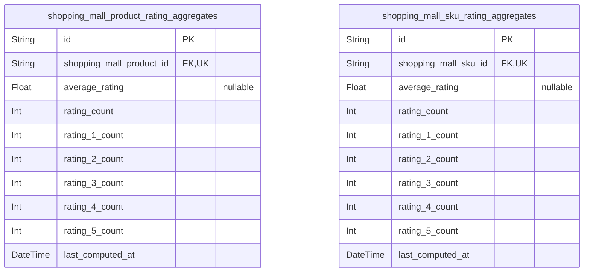

### `shopping_mall_product_rating_aggregates`

Precomputed rating aggregates per product.

Stores summary statistics such as average rating and review counts for
each product, derived from the underlying reviews in {@link
shopping_mall_reviews}. This table is optimized for fast reads from
product detail and listing pages.

The table is maintained by batch jobs or triggers outside of this schema
and should be treated as a materialized aggregate view rather than a
source of truth for individual reviews.

Properties as follows:

- `id`: Primary key. Unique identifier for the product rating aggregate row.
- `shopping_mall_product_id`
  > Product whose rating metrics are aggregated in this row. {@link
  > shopping_mall_products.id}.
- `average_rating`
  > Average rating value for the product computed from included reviews.
  > Nullable when no reviews exist.
- `rating_count`
  > Total number of included reviews contributing to the aggregate metrics
  > for this product.
- `rating_1_count`
  > Number of included reviews with the lowest rating value, for example
  > 1-star reviews.
- `rating_2_count`
  > Number of included reviews with the second rating value on the scale, for
  > example 2-star reviews.
- `rating_3_count`
  > Number of included reviews with a mid-range rating value, for example
  > 3-star reviews.
- `rating_4_count`
  > Number of included reviews with a high rating value, for example 4-star
  > reviews.
- `rating_5_count`
  > Number of included reviews with the highest rating value, for example
  > 5-star reviews.
- `last_computed_at`
  > Timestamp when the aggregate metrics were last recomputed for this
  > product.

### `shopping_mall_sku_rating_aggregates`

Precomputed rating aggregates per SKU variant.

Stores summary statistics such as average rating and review counts for
each SKU, derived from the underlying reviews in {@link
shopping_mall_reviews} that are associated with specific SKUs. This
enables variant-level quality signals and filtering.

The table is maintained by background processes and is conceptually a
materialized aggregate view. It should not be manually edited as part of
normal business workflows.

Properties as follows:

- `id`: Primary key. Unique identifier for the SKU rating aggregate row.
- `shopping_mall_sku_id`
  > SKU whose rating metrics are aggregated in this row. {@link
  > shopping_mall_skus.id}.
- `average_rating`
  > Average rating value for the SKU computed from included reviews. Nullable
  > when no reviews exist for this SKU.
- `rating_count`
  > Total number of included reviews that target this SKU and contribute to
  > the aggregate metrics.
- `rating_1_count`
  > Number of included reviews for this SKU with the lowest rating value, for
  > example 1-star reviews.
- `rating_2_count`
  > Number of included reviews for this SKU with the second rating value on
  > the scale, for example 2-star reviews.
- `rating_3_count`
  > Number of included reviews for this SKU with a mid-range rating value,
  > for example 3-star reviews.
- `rating_4_count`
  > Number of included reviews for this SKU with a high rating value, for
  > example 4-star reviews.
- `rating_5_count`
  > Number of included reviews for this SKU with the highest rating value,
  > for example 5-star reviews.
- `last_computed_at`: Timestamp when the aggregate metrics were last recomputed for this SKU.
