# Prisma Markdown

> Generated by [`prisma-markdown`](https://github.com/samchon/prisma-markdown)

- [Systematic](#systematic)
- [Actors](#actors)
- [Catalog](#catalog)
- [Carts](#carts)
- [Orders](#orders)
- [Payments](#payments)
- [Inventory](#inventory)
- [Reviews](#reviews)
- [AdminOps](#adminops)
- [Logs](#logs)
- [default](#default)

## Systematic

```mermaid
erDiagram
"shopping_mall_configs" {
  String id PK
  String namespace
  String key
  String value
  String description "nullable"
  Boolean active
  DateTime created_at
  DateTime updated_at
  DateTime deleted_at "nullable"
}
"shopping_mall_policy_settings" {
  String id PK
  String code UK
  String name
  String description "nullable"
  String category
  String config_payload "nullable"
  Boolean active
  DateTime effective_from "nullable"
  DateTime effective_to "nullable"
  DateTime created_at
  DateTime updated_at
  DateTime deleted_at "nullable"
}
"shopping_mall_cancellation_policies" {
  String id PK
  String shopping_mall_region_setting_id FK "nullable"
  String shopping_mall_policy_setting_id FK "nullable"
  String code UK
  String name
  String description "nullable"
  Int max_hours_after_payment "nullable"
  Boolean allow_cancellation_before_shipment
  Boolean allow_partial_cancellation
  String config_payload "nullable"
  Boolean active
  DateTime effective_from "nullable"
  DateTime effective_to "nullable"
  DateTime created_at
  DateTime updated_at
  DateTime deleted_at "nullable"
}
"shopping_mall_refund_policies" {
  String id PK
  String shopping_mall_region_setting_id FK "nullable"
  String shopping_mall_policy_setting_id FK "nullable"
  String code UK
  String name
  String description "nullable"
  Int max_days_after_delivery "nullable"
  Boolean allow_full_refund
  Boolean allow_partial_refund
  Float require_admin_approval_over_amount "nullable"
  String config_payload "nullable"
  Boolean active
  DateTime effective_from "nullable"
  DateTime effective_to "nullable"
  DateTime created_at
  DateTime updated_at
  DateTime deleted_at "nullable"
}
"shopping_mall_review_policies" {
  String id PK
  String shopping_mall_region_setting_id FK "nullable"
  String shopping_mall_policy_setting_id FK "nullable"
  String code UK
  String name
  String description "nullable"
  Int max_days_after_delivery_for_review "nullable"
  Int allow_edit_within_days "nullable"
  Int auto_hide_report_threshold "nullable"
  String config_payload "nullable"
  Boolean active
  DateTime effective_from "nullable"
  DateTime effective_to "nullable"
  DateTime created_at
  DateTime updated_at
  DateTime deleted_at "nullable"
}
"shopping_mall_age_restriction_policies" {
  String id PK
  String shopping_mall_region_setting_id FK "nullable"
  String shopping_mall_policy_setting_id FK "nullable"
  String code UK
  String name
  String description "nullable"
  Int minimum_age_years "nullable"
  Boolean require_verified_age
  String config_payload "nullable"
  Boolean active
  DateTime effective_from "nullable"
  DateTime effective_to "nullable"
  DateTime created_at
  DateTime updated_at
  DateTime deleted_at "nullable"
}
"shopping_mall_category_trees" {
  String id PK
  String code UK
  String name
  String description "nullable"
  String default_locale "nullable"
  Boolean active
  DateTime created_at
  DateTime updated_at
  DateTime deleted_at "nullable"
}
"shopping_mall_categories" {
  String id PK
  String shopping_mall_category_tree_id FK
  String parent_id FK "nullable"
  String code
  String slug
  String name
  String description "nullable"
  Int display_order
  Boolean is_leaf
  Boolean active
  DateTime created_at
  DateTime updated_at
  DateTime deleted_at "nullable"
}
"shopping_mall_region_settings" {
  String id PK
  String code UK
  String name
  String iso_country_code "nullable"
  String currency_code "nullable"
  String timezone "nullable"
  Boolean active
  DateTime created_at
  DateTime updated_at
  DateTime deleted_at "nullable"
}
"shopping_mall_shipping_zone_settings" {
  String id PK
  String shopping_mall_region_setting_id FK "nullable"
  String code UK
  String name
  String description "nullable"
  Boolean active
  DateTime created_at
  DateTime updated_at
  DateTime deleted_at "nullable"
}
"shopping_mall_cancellation_policies" }o--o| "shopping_mall_region_settings" : regionSetting
"shopping_mall_cancellation_policies" }o--o| "shopping_mall_policy_settings" : policySetting
"shopping_mall_refund_policies" }o--o| "shopping_mall_region_settings" : regionSetting
"shopping_mall_refund_policies" }o--o| "shopping_mall_policy_settings" : policySetting
"shopping_mall_review_policies" }o--o| "shopping_mall_region_settings" : regionSetting
"shopping_mall_review_policies" }o--o| "shopping_mall_policy_settings" : policySetting
"shopping_mall_age_restriction_policies" }o--o| "shopping_mall_region_settings" : regionSetting
"shopping_mall_age_restriction_policies" }o--o| "shopping_mall_policy_settings" : policySetting
"shopping_mall_categories" }o--|| "shopping_mall_category_trees" : categoryTree
"shopping_mall_categories" }o--o| "shopping_mall_categories" : parent
"shopping_mall_shipping_zone_settings" }o--o| "shopping_mall_region_settings" : primaryRegion
```

### `shopping_mall_configs`

Global configuration entries for the shoppingMall platform.

Stores low-level key/value style configuration items grouped by
namespace. Each row represents a single configuration key with its
current value, used for feature toggles, numeric thresholds, and string
parameters referenced by multiple subsystems.

Configs are managed primarily by platform administrators and are intended
to be relatively static, with updates happening infrequently and under
change control. Historical behavior for orders, payments, and reviews is
preserved in their own domains by recording effective values or
referencing specific policy records instead of retroactively changing
past data.

Properties as follows:

- `id`: Primary key for the configuration entry.
- `namespace`
  > Logical namespace that groups related configuration keys, such as
  > "checkout", "payment", or "reviews". Used to organize configs and
  > simplify lookups.
- `key`
  > Unique configuration key within a namespace, such as "max_cart_items" or
  > "payment_timeout_seconds".
- `value`
  > Configuration value serialized as text. The consuming subsystem is
  > responsible for interpreting the value as boolean, number, JSON, or other
  > structured type.
- `description`
  > Human-readable explanation of the configuration key and how it is used
  > across the platform.
- `active`
  > Indicates whether this configuration row is currently considered active
  > for runtime evaluation. Inactive rows remain for audit and potential
  > rollback.
- `created_at`: Timestamp when this configuration row was created.
- `updated_at`: Timestamp when this configuration row was last updated.
- `deleted_at`
  > Soft deletion timestamp. When set, the configuration row is logically
  > removed from active use but preserved for audit.

### `shopping_mall_policy_settings`

High-level policy groups and configuration profiles for the shoppingMall
platform.

Represents named collections of rules or parameters that describe how the
platform behaves in different contexts, such as default cancellation
windows, review time windows, or fraud-related thresholds. These settings
are referenced by domain-specific policy tables and can be used as
building blocks for more detailed rules.

Each policy setting is identified by a code and can be activated or
deactivated independently, allowing platform administrators to prepare
future configurations and switch between them in a controlled way.

Properties as follows:

- `id`: Primary key for the policy setting.
- `code`
  > Business identifier for the policy setting, such as
  > "default_cancellation_profile" or "holiday_refund_profile". Used as a
  > stable reference by other components.
- `name`
  > Human-friendly name of the policy setting profile displayed in admin
  > tools.
- `description`
  > Detailed explanation of what this policy setting profile controls and in
  > which business scenarios it is intended to be used.
- `category`
  > Logical category of the policy setting, such as "cancellation", "refund",
  > "review", or "age_restriction".
- `config_payload`
  > Serialized configuration payload that holds structured parameters for
  > this policy setting. Typically stores JSON text interpreted by the
  > consuming subsystem.
- `active`
  > Indicates whether this policy setting profile is active and can be
  > referenced by domain-specific policies.
- `effective_from`
  > Optional timestamp from which this policy setting becomes effective.
  > Allows scheduling of policy changes.
- `effective_to`
  > Optional timestamp after which this policy setting is no longer
  > considered effective.
- `created_at`: Timestamp when this policy setting profile was created.
- `updated_at`: Timestamp when this policy setting profile was last updated.
- `deleted_at`
  > Soft deletion timestamp. When set, the profile is no longer available for
  > new references but remains for historical audit.

### `shopping_mall_cancellation_policies`

Cancellation policy definitions for shoppingMall orders.

Each record describes how cancellations should be handled for a
particular business context, including allowed time windows, conditions,
and any associated configuration profile. These policies are referenced
by the order and payment domains when processing customer- or
seller-initiated cancellation requests.

Policies can be scoped by region and can be activated or deactivated over
time. Historical orders and requests should store references to specific
policies rather than relying on current defaults.

Properties as follows:

- `id`: Primary key for the cancellation policy.
- `shopping_mall_region_setting_id`
  > Optional reference to the [shopping_mall_region_settings](#shopping_mall_region_settings) entry
  > that this cancellation policy applies to. When null, the policy is
  > considered global or multi-region.
- `shopping_mall_policy_setting_id`
  > Optional reference to the [shopping_mall_policy_settings](#shopping_mall_policy_settings) profile
  > that provides shared configuration parameters for this cancellation
  > policy.
- `code`
  > Business code identifying the cancellation policy, such as
  > "default_cancellation" or "express_shipping_strict".
- `name`: Human-friendly name of the cancellation policy shown in admin tools.
- `description`
  > Detailed description of the cancellation rules, such as allowed time
  > windows, eligible statuses, and who may initiate cancellations.
- `max_hours_after_payment`
  > Maximum number of hours after successful payment during which
  > cancellations are normally accepted. Null means that the policy uses only
  > state-based rules or relies on the configuration payload.
- `allow_cancellation_before_shipment`
  > Indicates whether customers can cancel orders up to the moment before
  > shipment according to this policy.
- `allow_partial_cancellation`
  > Indicates whether partial cancellation of individual order lines is
  > allowed, rather than requiring cancellation of the entire order.
- `config_payload`
  > Serialized configuration payload for complex cancellation rules, such as
  > per-status behavior or product-category exceptions. Typically structured
  > as JSON text.
- `active`
  > Indicates whether this cancellation policy is currently active for new
  > orders or flows that reference it.
- `effective_from`: Optional timestamp from which this cancellation policy becomes effective.
- `effective_to`
  > Optional timestamp after which this cancellation policy is no longer
  > effective for new operations.
- `created_at`: Timestamp when this cancellation policy definition was created.
- `updated_at`: Timestamp when this cancellation policy definition was last updated.
- `deleted_at`
  > Soft deletion timestamp. When set, the policy is logically removed but
  > remains for audit and historical references.

### `shopping_mall_refund_policies`

Refund policy definitions for orders and payments in shoppingMall.

Each record describes how refunds should be processed in different
business contexts, including allowed refund windows, full vs partial
refund behavior, and eligibility rules. The payment and order subsystems
reference these policies when handling refund requests, returns, and
admin interventions.

Refund policies can be scoped by region and may link to shared policy
setting profiles. Historical records reference specific policies to
preserve the rules that were in force at the time of the transaction.

Properties as follows:

- `id`: Primary key for the refund policy.
- `shopping_mall_region_setting_id`
  > Optional reference to [shopping_mall_region_settings](#shopping_mall_region_settings) specifying
  > the region this refund policy applies to. Null indicates a global or
  > multi-region policy.
- `shopping_mall_policy_setting_id`
  > Optional reference to [shopping_mall_policy_settings](#shopping_mall_policy_settings) profile for
  > this refund policy, carrying shared configuration parameters.
- `code`
  > Business code for the refund policy, such as "default_refund" or
  > "digital_goods_nonrefundable".
- `name`: Human-friendly name of the refund policy shown in admin interfaces.
- `description`
  > Detailed description of refund rules, including full vs partial refund
  > eligibility, fees, and conditions.
- `max_days_after_delivery`
  > Maximum number of days after delivery within which a customer can request
  > a refund or return. Null indicates that only other conditions or
  > configuration payload define the window.
- `allow_full_refund`
  > Indicates whether full refunds are allowed in business scenarios governed
  > by this policy.
- `allow_partial_refund`
  > Indicates whether partial refunds (for selected items or partial amounts)
  > are permitted.
- `require_admin_approval_over_amount`
  > Optional amount threshold over which admin approval is required for
  > refunds. Null means no threshold is configured here.
- `config_payload`
  > Serialized configuration payload with advanced refund rules, such as
  > product-category exclusions or tiered policies. Typically stored as JSON
  > text.
- `active`
  > Indicates whether this refund policy is active for new orders and refund
  > flows that reference it.
- `effective_from`: Optional timestamp from which this refund policy becomes effective.
- `effective_to`
  > Optional timestamp after which this refund policy is no longer effective
  > for new transactions.
- `created_at`: Timestamp when this refund policy was created.
- `updated_at`: Timestamp when this refund policy was last updated.
- `deleted_at`
  > Soft deletion timestamp. When set, the policy is no longer active but
  > remains for audit and historical orders.

### `shopping_mall_review_policies`

Review and rating policy definitions for the shoppingMall platform.

Each record defines rules governing product reviews and ratings,
including eligibility, time windows, content restrictions, and moderation
behavior. Review subsystems consult these policies when allowing
customers to create, edit, or delete reviews, and when evaluating reports
and moderation thresholds.

Policies can be scoped by region and may reference shared configuration
profiles. Historical review records can store references to specific
policies to preserve the criteria that applied when the review was
created or moderated.

Properties as follows:

- `id`: Primary key for the review policy.
- `shopping_mall_region_setting_id`
  > Optional reference to [shopping_mall_region_settings](#shopping_mall_region_settings) representing
  > the region this review policy targets. Null means global or multi-region
  > scope.
- `shopping_mall_policy_setting_id`
  > Optional reference to [shopping_mall_policy_settings](#shopping_mall_policy_settings) profile that
  > provides shared configuration parameters for this review policy.
- `code`
  > Business code that uniquely identifies the review policy, for example
  > "default_review" or "strict_moderation".
- `name`: Human-readable name of the review policy used in admin tools.
- `description`
  > Detailed description of the review rules, including eligibility,
  > moderation strategies, and time windows.
- `max_days_after_delivery_for_review`
  > Maximum number of days after delivered status during which a customer is
  > allowed to submit a review. Null means the policy relies entirely on
  > configuration payload or other conditions.
- `allow_edit_within_days`
  > Number of days after review creation during which a customer can edit
  > their review. Null indicates editing is either not restricted by time
  > here or defined in another configuration field.
- `auto_hide_report_threshold`
  > Number of distinct abuse reports required to automatically hide a review
  > pending moderation. Null disables automatic hiding based on report counts
  > in this policy.
- `config_payload`
  > Serialized configuration payload describing additional review rules, such
  > as prohibited content categories or rating scale specifics. Typically
  > stored as JSON text.
- `active`
  > Indicates whether this review policy is currently active for new reviews
  > and moderation flows.
- `effective_from`: Optional timestamp from which this review policy becomes effective.
- `effective_to`
  > Optional timestamp after which this review policy ceases to apply to new
  > operations.
- `created_at`: Timestamp when this review policy was created.
- `updated_at`: Timestamp when this review policy was last updated.
- `deleted_at`
  > Soft deletion timestamp, indicating the policy is retired from active use
  > but preserved for historical references.

### `shopping_mall_age_restriction_policies`

Age and eligibility restriction policies for products and categories in
shoppingMall.

Defines rules controlling access to age-restricted or otherwise sensitive
products based on customer age, region, and other eligibility criteria.
Catalog, checkout, and review subsystems reference these policies to
determine whether a customer may view, purchase, or review restricted
items.

Policies may be tied to specific regions and configuration profiles,
enabling different legal and regulatory requirements across markets.

Properties as follows:

- `id`: Primary key for the age restriction policy.
- `shopping_mall_region_setting_id`
  > Optional reference to [shopping_mall_region_settings](#shopping_mall_region_settings) indicating
  > the region this age restriction policy covers. Null indicates a global or
  > cross-region policy.
- `shopping_mall_policy_setting_id`
  > Optional reference to [shopping_mall_policy_settings](#shopping_mall_policy_settings) profile
  > sharing configuration parameters for this age restriction policy.
- `code`
  > Business code identifying the age restriction policy, such as
  > "adult_only" or "teen_restricted".
- `name`: Human-friendly name of the age restriction policy used in admin tools.
- `description`
  > Detailed description of the age and eligibility constraints imposed by
  > this policy.
- `minimum_age_years`
  > Minimum age in years required for a customer to access products governed
  > by this policy. Null indicates that age is not the primary criterion and
  > the policy uses other eligibility rules.
- `require_verified_age`
  > Indicates whether customers must have a verified age status in their
  > account to access items under this policy.
- `config_payload`
  > Serialized configuration payload for complex eligibility rules, such as
  > region-specific legal adjustments or additional verification steps.
  > Typically stored as JSON text.
- `active`: Indicates whether this age restriction policy is currently active.
- `effective_from`
  > Optional timestamp from which this age restriction policy becomes
  > effective.
- `effective_to`
  > Optional timestamp after which this age restriction policy is no longer
  > effective for new operations.
- `created_at`: Timestamp when this age restriction policy was created.
- `updated_at`: Timestamp when this age restriction policy was last updated.
- `deleted_at`
  > Soft deletion timestamp indicating that the policy is retired from active
  > use while remaining available for audit.

### `shopping_mall_category_trees`

Top-level category tree definitions for the shoppingMall catalog.

Represents independent category hierarchies, such as the main
customer-facing catalog, specialized regional trees, or admin-only
classification structures. Each tree contains many categories stored in
[shopping_mall_categories](#shopping_mall_categories), which reference the tree by foreign
key.

Tree definitions carry metadata such as purpose, default locale, and
visibility flags, allowing the platform to manage multiple separate
taxonomies if required.

Properties as follows:

- `id`: Primary key for the category tree.
- `code`
  > Business code that uniquely identifies the category tree, such as
  > "main_catalog" or "regional_tree_eu".
- `name`
  > Human-friendly name of the category tree, displayed in admin tools and
  > configuration screens.
- `description`
  > Detailed description of the purpose and scope of this category tree,
  > including which products or markets it serves.
- `default_locale`
  > Optional locale identifier, such as "en-US" or "ko-KR", used as the
  > primary language for category names and labels in this tree.
- `active`
  > Indicates whether this category tree is active and available for catalog
  > navigation.
- `created_at`: Timestamp when this category tree definition was created.
- `updated_at`: Timestamp when this category tree definition was last updated.
- `deleted_at`
  > Soft deletion timestamp. When set, the category tree is retired from
  > active use while remaining for historical references.

### `shopping_mall_categories`

Category nodes within a specific category tree for the shoppingMall catalog.

Each record represents a single category in a tree, with optional parent
linkage to form a hierarchy. Categories hold display names, slugs, and
ordering information. They can be activated or deactivated without
deleting underlying products, allowing the catalog to evolve.

Categories reference [shopping_mall_category_trees](#shopping_mall_category_trees) to support
multiple parallel trees. They provide the taxonomy backbone for products
and influence search, filtering, and catalog navigation behavior across
the platform.

Properties as follows:

- `id`: Primary key for the category node.
- `shopping_mall_category_tree_id`
  > Reference to the [shopping_mall_category_trees](#shopping_mall_category_trees) record this
  > category belongs to.
- `parent_id`
  > Optional self-referential link to the parent {@link
  > shopping_mall_categories} node. Null for root categories.
- `code`
  > Business code that uniquely identifies this category within the platform,
  > often used by integrations or internal rules.
- `slug`
  > URL-friendly identifier used for building category paths in web
  > frontends, unique within a tree.
- `name`
  > Human-readable category name displayed to customers in navigation and
  > search results.
- `description`
  > Optional description of the category, used for SEO and to help customers
  > understand the scope of products included.
- `display_order`
  > Ordering position of the category among siblings under the same parent.
  > Lower values are typically displayed first.
- `is_leaf`
  > Indicates whether this category is intended to be a leaf node in the tree
  > (no child categories). This helps optimization and UI decisions but does
  > not enforce structural constraints by itself.
- `active`
  > Indicates whether this category is currently visible in navigation and
  > catalog browsing. Inactive categories can still appear in historical
  > orders.
- `created_at`: Timestamp when this category was created.
- `updated_at`: Timestamp when this category was last updated.
- `deleted_at`
  > Soft deletion timestamp. When set, the category is logically removed
  > while remaining in historical references.

### `shopping_mall_region_settings`

Region configuration entries representing markets or geographic areas in
shoppingMall.

Each record defines a logical region, such as a country, group of
countries, or custom market segment, that can be referenced by policies,
catalog rules, payment constraints, and shipping configurations. Regions
capture basic metadata such as ISO codes, names, and activation status.

Other subsystems, including cancellation, refund, review, age
restriction, and shipping zone policies, reference region settings to
apply region-specific behavior without duplicating regional attributes.

Properties as follows:

- `id`: Primary key for the region setting.
- `code`
  > Business code for the region, such as an ISO country code ("US", "KR") or
  > a platform-defined market identifier like "EU_MARKET".
- `name`
  > Human-readable name of the region, for example "United States" or
  > "European Union".
- `iso_country_code`
  > Optional ISO country code associated with this region. May be null for
  > composite or non-standard regions.
- `currency_code`
  > Default currency code (such as "USD" or "KRW") typically used for
  > transactions in this region.
- `timezone`
  > Representative timezone identifier for the region, used in time-based
  > policy calculations like cancellation windows.
- `active`
  > Indicates whether this region is active and can be referenced by new
  > policies or configuration entries.
- `created_at`: Timestamp when this region setting record was created.
- `updated_at`: Timestamp when this region setting record was last updated.
- `deleted_at`
  > Soft deletion timestamp. When set, the region is retired from active use
  > while remaining for audit and historical references.

### `shopping_mall_shipping_zone_settings`

Shipping zone configuration for grouping regions into logistics and
pricing areas.

Each record represents a shipping zone that may cover one or more regions
and is used by fulfillment and pricing subsystems to determine available
shipping methods, rates, and constraints. Zones can be regional (such as
"Domestic", "EU", or "International") and are linked indirectly to orders
through region assignments.

This table provides the canonical set of zones, while relationships
between zones and regions may be represented by separate junction tables
in other components if many-to-many mappings are required.

Properties as follows:

- `id`: Primary key for the shipping zone setting.
- `shopping_mall_region_setting_id`
  > Optional reference to a primary [shopping_mall_region_settings](#shopping_mall_region_settings)
  > record associated with this shipping zone. Additional region-zone
  > mappings may exist in other tables.
- `code`
  > Business code for the shipping zone, such as "DOMESTIC", "EU_ZONE", or
  > "GLOBAL".
- `name`
  > Human-readable name of the shipping zone displayed in admin tools and
  > logistics configuration screens.
- `description`
  > Description of which regions or countries are included in this shipping
  > zone and how it is used for shipping rate calculations.
- `active`
  > Indicates whether this shipping zone is active and can be used for
  > shipping configuration and rate calculation.
- `created_at`: Timestamp when this shipping zone was created.
- `updated_at`: Timestamp when this shipping zone was last updated.
- `deleted_at`
  > Soft deletion timestamp indicating that the shipping zone is retired from
  > active use but remains for historical references.

## Actors

```mermaid
erDiagram
"shopping_mall_guestuser" {
  String id PK
  String temporary_identifier "nullable"
  String user_agent "nullable"
  DateTime created_at
  DateTime updated_at
  DateTime deleted_at "nullable"
}
"shopping_mall_customer" {
  String id PK
  String email UK
  String name
  String status
  Boolean is_verified
  DateTime created_at
  DateTime updated_at
  DateTime deleted_at "nullable"
}
"shopping_mall_seller" {
  String id PK
  String email UK
  String store_name UK
  String contact_phone "nullable"
  String status
  DateTime created_at
  DateTime updated_at
  DateTime deleted_at "nullable"
}
"shopping_mall_platformadmin" {
  String id PK
  String email UK
  String name
  String status
  DateTime created_at
  DateTime updated_at
  DateTime deleted_at "nullable"
}
"shopping_mall_customer_sessions" {
  String id PK
  String shopping_mall_customer_id FK
  String ip
  String href
  String referrer
  DateTime created_at
  DateTime expired_at "nullable"
}
"shopping_mall_seller_sessions" {
  String id PK
  String shopping_mall_seller_id FK
  String ip
  String href
  String referrer
  DateTime created_at
  DateTime expired_at "nullable"
}
"shopping_mall_platformadmin_sessions" {
  String id PK
  String shopping_mall_platformadmin_id FK
  String ip
  String href
  String referrer
  DateTime created_at
  DateTime expired_at "nullable"
}
"shopping_mall_auth_credentials" {
  String id PK
  String actor_type
  String email
  String password_hash
  String status
  DateTime last_login_at "nullable"
  DateTime created_at
  DateTime updated_at
}
"shopping_mall_email_verification_tokens" {
  String id PK
  String shopping_mall_auth_credentials_id FK
  String token UK
  DateTime expires_at
  DateTime consumed_at "nullable"
  DateTime created_at
  DateTime updated_at
}
"shopping_mall_password_reset_tokens" {
  String id PK
  String shopping_mall_auth_credentials_id FK
  String token UK
  DateTime expires_at
  DateTime consumed_at "nullable"
  DateTime created_at
  DateTime updated_at
}
"shopping_mall_risk_flags" {
  String id PK
  String shopping_mall_auth_credentials_id FK
  String risk_level
  String reason_category
  Boolean active
  String notes "nullable"
  DateTime created_at
  DateTime cleared_at "nullable"
}
"shopping_mall_admin_roles" {
  String id PK
  String code UK
  String name
  String description_text "nullable"
  DateTime created_at
  DateTime updated_at
  DateTime deleted_at "nullable"
}
"shopping_mall_admin_role_assignments" {
  String id PK
  String shopping_mall_platformadmin_id FK
  String shopping_mall_admin_role_id FK
  DateTime assigned_at
  DateTime revoked_at "nullable"
}
"shopping_mall_security_events" {
  String id PK
  String shopping_mall_auth_credentials_id FK "nullable"
  String actor_type "nullable"
  String actor_identifier "nullable"
  String event_type
  String ip "nullable"
  String user_agent "nullable"
  String metadata "nullable"
  DateTime created_at
}
"shopping_mall_auth_credentials_of_customers" {
  String id PK
  String shopping_mall_auth_credentials_id FK,UK
  String shopping_mall_customer_id FK
  DateTime created_at
}
"shopping_mall_auth_credentials_of_sellers" {
  String id PK
  String shopping_mall_auth_credentials_id FK,UK
  String shopping_mall_seller_id FK
  DateTime created_at
}
"shopping_mall_auth_credentials_of_platformadmins" {
  String id PK
  String shopping_mall_auth_credentials_id FK,UK
  String shopping_mall_platformadmin_id FK
  DateTime created_at
}
"shopping_mall_customer_sessions" }o--|| "shopping_mall_customer" : customer
"shopping_mall_seller_sessions" }o--|| "shopping_mall_seller" : seller
"shopping_mall_platformadmin_sessions" }o--|| "shopping_mall_platformadmin" : platformAdmin
"shopping_mall_email_verification_tokens" }o--|| "shopping_mall_auth_credentials" : credentials
"shopping_mall_password_reset_tokens" }o--|| "shopping_mall_auth_credentials" : credentials
"shopping_mall_risk_flags" }o--|| "shopping_mall_auth_credentials" : credentials
"shopping_mall_admin_role_assignments" }o--|| "shopping_mall_platformadmin" : platformAdmin
"shopping_mall_admin_role_assignments" }o--|| "shopping_mall_admin_roles" : adminRole
"shopping_mall_security_events" }o--o| "shopping_mall_auth_credentials" : credentials
"shopping_mall_auth_credentials_of_customers" |o--|| "shopping_mall_auth_credentials" : credentials
"shopping_mall_auth_credentials_of_customers" }o--|| "shopping_mall_customer" : customer
"shopping_mall_auth_credentials_of_sellers" |o--|| "shopping_mall_auth_credentials" : credentials
"shopping_mall_auth_credentials_of_sellers" }o--|| "shopping_mall_seller" : seller
"shopping_mall_auth_credentials_of_platformadmins" |o--|| "shopping_mall_auth_credentials" : credentials
"shopping_mall_auth_credentials_of_platformadmins" }o--|| "shopping_mall_platformadmin" : platformAdmin
```

### `shopping_mall_guestuser`

Guest user identities representing unauthenticated visitors that may
transition into customers.

This table stores minimal, optional identity context for guests when the
platform decides to persist it beyond an in-memory session, such as for
tracking conversion funnels or consent. It does not hold login
credentials because guests cannot authenticate, but it provides a stable
identifier that other systems can reference if needed.

Guest records can later be associated with customer accounts during
registration without retroactively changing historical information.

Properties as follows:

- `id`: Primary key. Unique identifier for the guest user record.
- `temporary_identifier`
  > Opaque identifier used to correlate guest activity such as carts or
  > visits before registration. Typically derived from cookies or device
  > identifiers.
- `user_agent`
  > Captured user agent string or a normalized descriptor for the guest’s
  > primary device during the first tracked interaction.
- `created_at`: Timestamp when the guest record was first created in the system.
- `updated_at`: Timestamp when the guest record was last updated.
- `deleted_at`
  > Soft delete timestamp. When set, the guest record is considered logically
  > removed while preserving history for analytics.

### `shopping_mall_customer`

Customer accounts representing authenticated buyers on the shoppingMall
platform.

Each record corresponds to a unique customer identity with core profile
attributes and account status. Credentials such as password hashes are
stored in [shopping_mall_auth_credentials](#shopping_mall_auth_credentials), while this table
focuses on identity and lifecycle.

Customers own resources like addresses, carts, wishlists, orders, and
reviews through foreign keys from other components. Status and
risk-related behavior are governed by this table in combination with
[shopping_mall_risk_flags](#shopping_mall_risk_flags).

Properties as follows:

- `id`: Primary key. Unique identifier for the customer account.
- `email`
  > Primary email address for the customer. Used for communication and may
  > match the login email stored in credentials. Must be unique across
  > customers.
- `name`
  > Display name or full name of the customer used in profile views and
  > communications.
- `status`
  > High-level lifecycle status of the customer such as active, suspended, or
  > closed. Authorization logic uses this value to enable or block actions.
- `is_verified`
  > Flag indicating whether the customer’s email has passed verification
  > flows.
- `created_at`: Timestamp when the customer account was created.
- `updated_at`: Timestamp when the customer account was last updated.
- `deleted_at`
  > Soft delete timestamp. When set, the customer account is logically closed
  > but retained for legal and audit purposes.

### `shopping_mall_seller`

Seller accounts representing merchants that operate stores within the
marketplace.

Each record corresponds to a seller identity that controls product
catalogs, SKUs, inventory, and order fulfillment for its listings. Login
credentials live in [shopping_mall_auth_credentials](#shopping_mall_auth_credentials), while this
table stores seller-specific profile data and lifecycle status.

Seller suspension or termination is managed through the status field and
is combined with policy tables and admin actions from other components.

Properties as follows:

- `id`: Primary key. Unique identifier for the seller account and store.
- `email`
  > Primary business email address for the seller. Used for communications
  > and may be aligned with the login email stored in credentials.
- `store_name`
  > Public store or brand name shown to customers when viewing products and
  > orders from this seller.
- `contact_phone`
  > Optional seller contact phone number used for operations or support
  > communication.
- `status`
  > Lifecycle status of the seller such as pending, active, suspended, or
  > terminated. Controls access to catalog and fulfillment features.
- `created_at`: Timestamp when the seller account and store record were created.
- `updated_at`: Timestamp when the seller record was last updated.
- `deleted_at`
  > Soft delete timestamp. When set, the seller account is logically closed
  > while retaining historical order, payment, and audit information.

### `shopping_mall_platformadmin`

Platform administrator accounts with elevated privileges to operate and
moderate the marketplace.

Each record represents a human operator or system account that can manage
customers, sellers, catalog content, orders, payments, and policies.
Role-based permissions are defined via [shopping_mall_admin_roles](#shopping_mall_admin_roles)
and linked through [shopping_mall_admin_role_assignments](#shopping_mall_admin_role_assignments).

Authentication credentials are stored in {@link
shopping_mall_auth_credentials}, while this table captures identity and
status attributes required for governance and audit.

Properties as follows:

- `id`: Primary key. Unique identifier for the platform administrator account.
- `email`
  > Admin email address used for communication and login. Must be unique
  > among platform admins and separate from regular customer or seller emails
  > when required by policy.
- `name`
  > Display name or full name for the administrator, used in audit records
  > and admin listings.
- `status`
  > Lifecycle and access status of the admin account such as active,
  > suspended, or closed. Critical for restricting sensitive admin actions.
- `created_at`: Timestamp when the admin account was created.
- `updated_at`: Timestamp when the admin account was last updated.
- `deleted_at`
  > Soft delete timestamp. When set, the admin account is logically removed
  > while preserving references in audit logs and configuration change
  > histories.

### `shopping_mall_customer_sessions`

Authentication sessions for customer actors used to trace login context
across requests.

Each record represents one authenticated session belonging to a customer,
linked to [shopping_mall_customer](#shopping_mall_customer). The table follows the strict
session pattern: minimal connection metadata, creation time, and optional
expiry time.

Sessions are used for authorization context, audit trails, and security
analytics but are managed as supporting entities rather than business
objects.

Properties as follows:

- `id`: Primary key. Unique identifier for the customer session.
- `shopping_mall_customer_id`
  > Foreign key to the owning customer account. {@link
  > shopping_mall_customer.id}.
- `ip`
  > IP address captured when the session was established. Used for security
  > analytics and anomaly detection.
- `href`
  > URL or path that initiated the authenticated session, such as the login
  > page or entry route.
- `referrer`
  > Referring URL when the session was created, used for tracing login
  > sources and campaigns.
- `created_at`: Timestamp when the session was created.
- `expired_at`
  > Timestamp when the session expired or was terminated. Null for
  > still-active sessions.

### `shopping_mall_seller_sessions`

Authentication sessions for seller actors used to track merchant activity
and security context.

Each record represents a single authenticated session for a seller,
referencing [shopping_mall_seller](#shopping_mall_seller). The schema follows the global
session pattern with minimal connection metadata and temporal fields.

These sessions allow investigation of inventory changes, catalog
modifications, and order updates in conjunction with audit logs from
other components.

Properties as follows:

- `id`: Primary key. Unique identifier for the seller session.
- `shopping_mall_seller_id`: Foreign key to the owning seller account. [shopping_mall_seller.id](#shopping_mall_seller).
- `ip`: IP address observed when the seller session was established.
- `href`: Entry URL that initiated the seller login session.
- `referrer`: Referrer URL at the time of seller login creation.
- `created_at`: Timestamp when the seller session started.
- `expired_at`
  > Timestamp when the seller session expired or was explicitly terminated.
  > Null while still active.

### `shopping_mall_platformadmin_sessions`

Authentication sessions for platform administrator actors.

Each record represents one authenticated admin session associated with
[shopping_mall_platformadmin](#shopping_mall_platformadmin). The table strictly follows the
standardized session schema to keep security-critical session data
minimal and consistent.

These sessions are fundamental for correlating high-impact admin actions
with connection context in audit and security analysis.

Properties as follows:

- `id`: Primary key. Unique identifier for the platform admin session.
- `shopping_mall_platformadmin_id`
  > Foreign key to the owning platform administrator account. {@link
  > shopping_mall_platformadmin.id}.
- `ip`: IP address seen when the admin session was established.
- `href`: Entry URL that initiated the admin login session.
- `referrer`: Referrer URL at the time of admin login creation.
- `created_at`: Timestamp when the admin session was created.
- `expired_at`
  > Timestamp when the admin session expired or was explicitly invalidated.
  > Null for active sessions.

### `shopping_mall_auth_credentials`

Authentication credentials for all persistent actor types in the platform.

This table centralizes login identifiers and password hashes for
customers, sellers, and platform administrators. Each row defines how one
actor authenticates to the system and serves as the root entity for
credential-related subtype records.

Actor ownership is modeled through dedicated subtype tables such as
[shopping_mall_auth_credentials_of_customers](#shopping_mall_auth_credentials_of_customers), {@link
shopping_mall_auth_credentials_of_sellers}, and {@link
shopping_mall_auth_credentials_of_platformadmins}. This avoids multiple
nullable foreign keys and enforces that each credentials record belongs
to exactly one actor type based on the actor_type field.

Security events and risk flags reference this table for identity-centric
analysis and decision-making.

Properties as follows:

- `id`: Primary key. Unique identifier for the credentials record.
- `actor_type`
  > Type of actor this credential belongs to, such as customer, seller, or
  > platformAdmin. Used for authorization routing and to select the
  > appropriate subtype entity that links to the concrete actor record.
- `email`
  > Login email identifier associated with this credential. Must be unique
  > within the scope of actor_type and the owning actor according to platform
  > policy.
- `password_hash`
  > Secure non-reversible representation of the actor’s password used for
  > authentication. Plain text passwords are never stored.
- `status`
  > Credential status such as active, locked, or compromised. Controls
  > whether authentication using this record is allowed.
- `last_login_at`
  > Timestamp of the most recent successful login using these credentials, or
  > null if no login has occurred yet.
- `created_at`: Timestamp when the credential record was created.
- `updated_at`
  > Timestamp when the credential record was last updated, for example when
  > rotating password hashes or changing status.

### `shopping_mall_email_verification_tokens`

Email verification tokens used to confirm ownership of email addresses
for actors.

Each token references a credentials record in {@link
shopping_mall_auth_credentials} and captures the lifecycle of
verification, including expiry and consumption timestamps.

These tokens support customer, seller, and admin onboarding flows as well
as email change confirmations while preserving auditability of
verification attempts.

Properties as follows:

- `id`: Primary key. Unique identifier for the email verification token.
- `shopping_mall_auth_credentials_id`
  > Foreign key to the credentials record whose email is being verified.
  > [shopping_mall_auth_credentials.id](#shopping_mall_auth_credentials).
- `token`
  > Opaque verification token sent to the user via email. Must be unique to
  > safely locate the verification attempt.
- `expires_at`: Timestamp after which the token is no longer valid for verification.
- `consumed_at`
  > Timestamp when the token was successfully used to complete email
  > verification. Null while pending.
- `created_at`: Timestamp when the token was created and dispatched.
- `updated_at`
  > Timestamp when the token record was last updated, typically when marked
  > as consumed or expired by background jobs.

### `shopping_mall_password_reset_tokens`

Password reset tokens that allow actors to set new credentials after
passing ownership checks.

Each token is associated with [shopping_mall_auth_credentials](#shopping_mall_auth_credentials) and
includes validity and consumption metadata. The system never stores the
new password in this table, only the reset workflow identifiers.

Tokens can be invalidated or expired according to security policies and
are crucial evidence for audit and breach investigations.

Properties as follows:

- `id`: Primary key. Unique identifier for the password reset token.
- `shopping_mall_auth_credentials_id`
  > Foreign key to the credentials record whose password is being reset.
  > [shopping_mall_auth_credentials.id](#shopping_mall_auth_credentials).
- `token`
  > Opaque password reset token delivered via secure channel. Must be unique
  > to prevent collisions and guessing attacks.
- `expires_at`
  > Timestamp after which the reset token is no longer valid and must not be
  > accepted by the system.
- `consumed_at`
  > Timestamp when the token was successfully used to complete a password
  > reset operation. Null while still pending.
- `created_at`: Timestamp when the password reset token was created.
- `updated_at`
  > Timestamp when the token record was last updated, usually when consumed
  > or invalidated.

### `shopping_mall_risk_flags`

Risk and fraud-related flags attached to actor credentials to influence
authorization and operations.

Each record represents a specific risk assessment or incident tied to
[shopping_mall_auth_credentials](#shopping_mall_auth_credentials), such as suspected fraud or abuse.
Business rules use these flags to tighten security, require manual
review, or restrict actions.

Historical records allow risk teams and admins to analyze patterns, even
after a flag has been cleared.

Properties as follows:

- `id`: Primary key. Unique identifier for the risk flag entry.
- `shopping_mall_auth_credentials_id`
  > Foreign key to the credentials record this risk flag applies to. {@link
  > shopping_mall_auth_credentials.id}.
- `risk_level`
  > Risk severity level such as low, medium, high, or critical indicating the
  > strength of the concern.
- `reason_category`
  > Categorized reason for the risk flag such as suspected_fraud,
  > abuse_reports, chargeback_history, or account_compromise.
- `active`
  > Indicates whether this risk flag is currently active and should influence
  > authorization decisions.
- `notes`
  > Optional free-form notes describing the context or evidence behind the
  > risk assessment for internal teams.
- `created_at`: Timestamp when the risk flag was created.
- `cleared_at`
  > Timestamp when the risk flag was cleared or downgraded, or null if the
  > flag is still active.

### `shopping_mall_admin_roles`

Role definitions for platform administrators that determine available
admin capabilities.

Each row represents a reusable role such as super_admin, support_agent,
or risk_analyst that aggregates permissions outside this schema. Roles
are assigned to admin accounts via {@link
shopping_mall_admin_role_assignments}.

This table is central to the least-privilege model and supports
independent lifecycle management and auditing of administrative
responsibilities.

Properties as follows:

- `id`: Primary key. Unique identifier for the admin role definition.
- `code`
  > Short machine-friendly code for the admin role, such as SUPER_ADMIN or
  > SUPPORT_AGENT. Must be unique.
- `name`: Human-readable name for the admin role presented in admin dashboards.
- `description_text`
  > Optional detailed description of what responsibilities and permissions
  > this role entails.
- `created_at`: Timestamp when the admin role was created.
- `updated_at`: Timestamp when the admin role definition was last updated.
- `deleted_at`
  > Soft delete timestamp. When set, the role is no longer assignable but
  > remains for historical references.

### `shopping_mall_admin_role_assignments`

Assignments of admin roles to specific platform administrator accounts.

This junction table links [shopping_mall_platformadmin](#shopping_mall_platformadmin) records
with [shopping_mall_admin_roles](#shopping_mall_admin_roles) to express which roles each admin
has at any given time.

Assignments support start and end timestamps to enable time-bounded
responsibilities and to reconstruct historical permission sets for audit
and compliance.

Properties as follows:

- `id`: Primary key. Unique identifier for the admin role assignment.
- `shopping_mall_platformadmin_id`
  > Foreign key to the platform administrator who receives the role. {@link
  > shopping_mall_platformadmin.id}.
- `shopping_mall_admin_role_id`
  > Foreign key to the admin role being assigned. {@link
  > shopping_mall_admin_roles.id}.
- `assigned_at`: Timestamp when this role assignment became effective for the admin.
- `revoked_at`
  > Timestamp when this role assignment was revoked or expired, or null if it
  > is still active.

### `shopping_mall_security_events`

Security-related events associated with identities and sessions for
monitoring and forensics.

Each row records one significant security event, such as login success,
login failure, password change, token misuse, or suspicious activity.
Events may reference [shopping_mall_auth_credentials](#shopping_mall_auth_credentials) when an
identity can be resolved.

This table is not a full audit log for all business operations but
focuses on authentication, authorization, and security anomalies
important for risk and compliance reporting.

Properties as follows:

- `id`: Primary key. Unique identifier for the security event.
- `shopping_mall_auth_credentials_id`
  > Optional foreign key to the credentials record involved in the event when
  > identifiable. [shopping_mall_auth_credentials.id](#shopping_mall_auth_credentials).
- `actor_type`
  > Type of actor involved in the event such as customer, seller,
  > platformAdmin, or guestUser. Null when the actor could not be resolved.
- `actor_identifier`
  > Non-sensitive identifier for the actor such as email or a masked login
  > identifier, used only when credentials cannot be linked directly.
- `event_type`
  > Machine-friendly category for the security event such as LOGIN_SUCCESS,
  > LOGIN_FAILURE, PASSWORD_RESET_REQUEST, or TOKEN_REVOKED.
- `ip`
  > IP address observed for this security event, used in threat detection and
  > analysis.
- `user_agent`
  > User agent string or normalized device descriptor associated with this
  > event.
- `metadata`
  > Optional JSON-encoded or structured text payload containing additional
  > context for the event, such as error codes or geo information.
- `created_at`: Timestamp when the security event was recorded.

### `shopping_mall_auth_credentials_of_customers`

Subtype entity connecting authentication credentials to customer actors.

Each record represents the ownership of a {@link
shopping_mall_auth_credentials} row by a specific {@link
shopping_mall_customer}. It enforces a 1:1 relationship between
credentials and customer while keeping the main credentials table free of
multiple nullable foreign keys.

This table is treated as a supporting entity and is managed by
authentication and account management flows rather than directly by end
users.

Properties as follows:

- `id`
  > Primary key. Unique identifier for the customer credentials subtype
  > record.
- `shopping_mall_auth_credentials_id`
  > Foreign key to the root credentials record associated with this customer.
  > [shopping_mall_auth_credentials.id](#shopping_mall_auth_credentials). Enforced as unique to maintain
  > a 1:1 relationship.
- `shopping_mall_customer_id`
  > Foreign key to the owning customer account. {@link
  > shopping_mall_customer.id}.
- `created_at`
  > Timestamp when this customer-credentials link was created, typically at
  > registration or when credentials were first attached to the customer
  > account.

### `shopping_mall_auth_credentials_of_sellers`

Subtype entity connecting authentication credentials to seller actors.

Each record represents the ownership of a {@link
shopping_mall_auth_credentials} row by a specific {@link
shopping_mall_seller}. This implements the polymorphic ownership pattern
without multiple nullable foreign keys in the main credentials table.

The table is a supporting entity and is created and updated by seller
onboarding and account management workflows.

Properties as follows:

- `id`: Primary key. Unique identifier for the seller credentials subtype record.
- `shopping_mall_auth_credentials_id`
  > Foreign key to the root credentials record associated with this seller.
  > [shopping_mall_auth_credentials.id](#shopping_mall_auth_credentials). Enforced as unique to maintain
  > a 1:1 relationship.
- `shopping_mall_seller_id`: Foreign key to the owning seller account. [shopping_mall_seller.id](#shopping_mall_seller).
- `created_at`
  > Timestamp when this seller-credentials link was created, usually during
  > seller registration or credential assignment.

### `shopping_mall_auth_credentials_of_platformadmins`

Subtype entity connecting authentication credentials to platform
administrator actors.

Each record represents the ownership of a {@link
shopping_mall_auth_credentials} row by a specific {@link
shopping_mall_platformadmin}. This pattern ensures strict normalization
by separating admin-specific ownership data from the main credentials
table.

The table is managed through admin provisioning processes and supports
precise auditability for sensitive administrative access.

Properties as follows:

- `id`
  > Primary key. Unique identifier for the platform admin credentials subtype
  > record.
- `shopping_mall_auth_credentials_id`
  > Foreign key to the root credentials record associated with this
  > administrator. [shopping_mall_auth_credentials.id](#shopping_mall_auth_credentials). Enforced as
  > unique to maintain a 1:1 relationship.
- `shopping_mall_platformadmin_id`
  > Foreign key to the owning platform admin account. {@link
  > shopping_mall_platformadmin.id}.
- `created_at`
  > Timestamp when this platform-admin-credentials link was created,
  > typically during admin account provisioning.

## Catalog

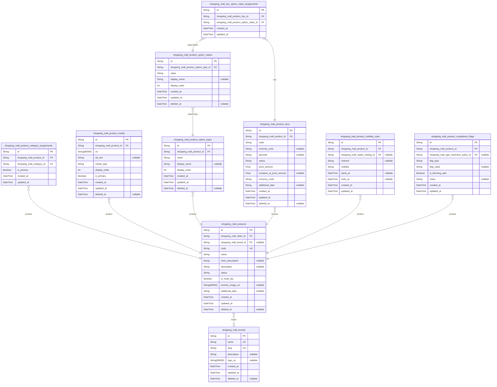

### `shopping_mall_brands`

Brand entities used to label products in the catalog.

Represents manufacturers, labels, or store brands that own or market
products. Brands are shared across many products and can be searched and
filtered independently.

Brand information is global and is not tied to a specific seller account,
although business policy may restrict which sellers can use which brands.
Historical references from orders and reviews rely on brand data
remaining available, so soft deletion is supported.

Properties as follows:

- `id`: Primary key for the brand record.
- `name`
  > Display name of the brand. Must be unique across the platform for
  > consistent filtering and search.
- `slug`
  > URL-friendly identifier for the brand, typically derived from the name.
  > Used in catalog routing and SEO contexts.
- `description`
  > Optional descriptive text about the brand, presented on brand landing
  > pages or product detail sections.
- `logo_uri`
  > URI pointing to the primary brand logo image stored in a media service or
  > CDN.
- `created_at`: Timestamp when the brand record was first created.
- `updated_at`: Timestamp when the brand record was last updated.
- `deleted_at`
  > Timestamp marking when the brand was soft-deleted. Null when the brand is
  > active.

### `shopping_mall_products`

Core product definitions in the shoppingMall catalog.

Each product groups one or more purchasable SKUs under a common name,
descriptions, media, and category associations. Products belong to
exactly one seller and may optionally reference a brand.

Product lifecycle and visibility (draft, active, inactive, discontinued)
are driven by status and related visibility/compliance rules. SKUs hold
price and inventory links, while catalog products provide the structure
used for browsing and search.

Properties as follows:

- `id`: Primary key for the product record.
- `shopping_mall_seller_id`
  > Owning seller for this product. Links the catalog entry to a single
  > merchant entity. [shopping_mall_seller.id](#shopping_mall_seller).
- `shopping_mall_brand_id`
  > Optional brand associated with this product. If null, the product may be
  > treated as unbranded or seller-branded. [shopping_mall_brands.id](#shopping_mall_brands).
- `code`
  > Business-visible product code or identifier used internally and in
  > integrations. Unique per platform for stable references.
- `name`
  > Primary product name displayed in catalog listings and product detail
  > pages.
- `short_description`: Short description or tagline suitable for list views and summaries.
- `description`
  > Full product description used on product detail pages. May include
  > rich-text content serialized as text.
- `status`
  > Lifecycle status of the product such as draft, pending_review, active,
  > inactive, or discontinued. Business logic constrains allowed values.
- `is_multi_sku`
  > Flag indicating whether this product has multiple SKUs (variants). If
  > false, the product typically has a single SKU.
- `primary_image_uri`
  > URI of the primary image displayed in listings. A convenience pointer to
  > one of the media records or an external image.
- `additional_data`
  > Optional JSON-encoded metadata string for custom catalog attributes not
  > modeled as separate fields.
- `created_at`: Timestamp when the product was created.
- `updated_at`: Timestamp when the product was last updated.
- `deleted_at`
  > Timestamp when the product was soft-deleted. Null when the product is
  > active in the catalog.

### `shopping_mall_product_category_assignments`

Junction table linking products to categories in the catalog hierarchy.

Represents both primary and secondary category associations for a
product. This allows products to appear under multiple categories for
navigation and search while delegating category structure to the separate
categories component.

Assignments are maintained by sellers or admins and are used heavily in
catalog browsing and filtering.

Properties as follows:

- `id`: Primary key for the category assignment record.
- `shopping_mall_product_id`
  > Product that is assigned to the category. {@link
  > shopping_mall_products.id}.
- `shopping_mall_category_id`
  > Target category under which the product should appear. {@link
  > shopping_mall_categories.id}.
- `is_primary`
  > Indicates whether this category is the primary category for the product.
  > Only one assignment per product should typically be primary.
- `created_at`: Timestamp when the category assignment was created.
- `updated_at`: Timestamp when the category assignment was last updated.

### `shopping_mall_product_media`

Media assets associated with catalog products.

Stores references to images or other media files used in product listings
and detail pages. Each record points to one media asset and includes
ordering information and role flags such as whether it is featured.

Media URIs are typically stored in object storage or a CDN, and this
table only holds references and metadata.

Properties as follows:

- `id`: Primary key for the product media record.
- `shopping_mall_product_id`
  > Product to which this media asset belongs. {@link
  > shopping_mall_products.id}.
- `uri`
  > URI pointing to the media asset (image, video thumbnail, etc.) in storage
  > or CDN.
- `alt_text`
  > Optional alternative text describing the media asset for accessibility
  > and SEO.
- `media_type`
  > Type of media such as image, video, or other supported categories.
  > Business rules define allowed values.
- `display_order`
  > Order index used to sort media assets for display. Lower numbers usually
  > appear first.
- `is_primary`
  > Flag indicating whether this media asset is the primary one for the
  > product, typically reflected in primary_image_uri on the product.
- `created_at`: Timestamp when the media record was created.
- `updated_at`: Timestamp when the media record was last updated.
- `deleted_at`
  > Timestamp when the media record was soft-deleted. Null when the media is
  > active.

### `shopping_mall_product_option_types`

Option dimensions that define variant structures for a product.

Each record represents an option type such as color, size, material, or
style, scoped to a single product. Option types organize option values
and drive variant selection UI and SKU composition.

Option types are only meaningful in the context of their product and are
managed when defining or editing product variants.

Properties as follows:

- `id`: Primary key for the product option type record.
- `shopping_mall_product_id`: Product that owns this option type. [shopping_mall_products.id](#shopping_mall_products).
- `name`
  > Human-readable name of the option type, such as "Color" or "Size". Unique
  > per product.
- `display_name`
  > Optional display name or label shown in UI. When null, the name value is
  > typically used.
- `display_order`
  > Ordering index specifying the sequence in which option types appear for
  > the product.
- `created_at`: Timestamp when the option type was created.
- `updated_at`: Timestamp when the option type was last updated.
- `deleted_at`: Timestamp when the option type was soft-deleted. Null when active.

### `shopping_mall_product_option_values`

Concrete option values under a product's option types.

Each record represents a selectable value such as "Red", "Blue", "Small",
or "XL" associated with a specific option type. These values are combined
through SKU option assignments to define distinct purchasable variants.

Option values are scoped to a product via their option type and
participate in SKU uniqueness constraints when composing variant
combinations.

Properties as follows:

- `id`: Primary key for the product option value record.
- `shopping_mall_product_option_type_id`
  > Parent option type that this value belongs to. {@link
  > shopping_mall_product_option_types.id}.
- `value`: Canonical value label such as "Red" or "XL". Unique per option type.
- `display_name`
  > Optional display label for this value, allowing localized or
  > user-friendly text.
- `display_order`: Ordering index specifying how values are presented within the option type.
- `created_at`: Timestamp when the option value was created.
- `updated_at`: Timestamp when the option value was last updated.
- `deleted_at`: Timestamp when the option value was soft-deleted. Null when active.

### `shopping_mall_product_skus`

Purchasable product variants represented as SKUs.

Each SKU corresponds to a concrete combination of option values (such as
a specific color and size) for a product and carries pricing information
and lifecycle status. Inventory quantities and reservations are handled
in the Inventory component, but SKUs provide the catalog-facing identity
for those records.

SKUs are the unit of cart lines, order lines, and inventory tracking;
prices, compare-at prices, and SKU-level status determine availability in
the catalog and checkout flows.

Properties as follows:

- `id`: Primary key for the SKU record.
- `shopping_mall_product_id`: Product that this SKU belongs to. [shopping_mall_products.id](#shopping_mall_products).
- `code`
  > Business-defined SKU code used in inventory systems and order line
  > references. Unique per product.
- `external_code`
  > Optional external code such as a seller-specific identifier or
  > marketplace reference.
- `barcode`
  > Optional machine-readable code such as UPC or EAN for scanning and
  > logistics.
- `status`
  > Lifecycle status of the SKU such as active, inactive, or discontinued.
  > Determines catalog and checkout eligibility together with product and
  > inventory status.
- `price_amount`
  > Current unit price for the SKU in the platform’s base currency or in a
  > currency defined elsewhere.
- `compare_at_price_amount`
  > Optional original or reference price used to display discounts when lower
  > than this value.
- `currency_code`
  > Currency code for price fields, such as USD or EUR. The allowed set is
  > managed by configuration tables.
- `additional_data`
  > Optional JSON-encoded metadata for SKU-level catalog attributes beyond
  > standard fields.
- `created_at`: Timestamp when the SKU was created.
- `updated_at`: Timestamp when the SKU was last updated.
- `deleted_at`: Timestamp when the SKU was soft-deleted. Null when active.

### `shopping_mall_sku_option_value_assignments`

Assignments connecting SKUs to specific option values.

Represents the mapping from a SKU to the set of option values (for
example, Color: Red, Size: M) that define its variant combination. This
structure allows flexible modeling of multi-dimensional options while
enforcing uniqueness of combinations per product.

Assignments are used to reconstruct variant selections in UI and to
validate that each SKU corresponds to a unique combination of values
under its product.

Properties as follows:

- `id`: Primary key for the SKU option value assignment record.
- `shopping_mall_product_sku_id`
  > SKU that this option value is assigned to. {@link
  > shopping_mall_product_skus.id}.
- `shopping_mall_product_option_value_id`
  > Option value that participates in the SKU’s variant combination. {@link
  > shopping_mall_product_option_values.id}.
- `created_at`: Timestamp when the assignment was created.
- `updated_at`: Timestamp when the assignment was last updated.

### `shopping_mall_product_visibility_rules`

Per-product visibility configuration for regions and channels.

Encapsulates rules that determine where and to whom a product is visible
in the catalog. Rules may specify region constraints, sales channels, and
override visibility states relative to the product’s base lifecycle
status.

This table enables flexible configurations such as region-restricted
products, channel-specific offerings, or temporary hiding in certain
markets without changing the core product status.

Properties as follows:

- `id`: Primary key for the product visibility rule record.
- `shopping_mall_product_id`
  > Product that this visibility rule applies to. {@link
  > shopping_mall_products.id}.
- `shopping_mall_region_setting_id`
  > Optional region settings record that scopes this rule to a specific
  > geographic region. Null means the rule is global. {@link
  > shopping_mall_region_settings.id}.
- `channel`
  > Optional sales channel identifier such as web, mobile, or marketplace.
  > Null indicates the rule is not channel-specific.
- `visibility`
  > Visibility effect of this rule, such as visible, hidden, or restricted.
  > Combined with product status and compliance flags to determine final
  > exposure.
- `starts_at`
  > Optional start timestamp from which the rule becomes effective. Null
  > means it is effective immediately.
- `ends_at`
  > Optional end timestamp after which the rule no longer applies. Null means
  > it has no scheduled end.
- `created_at`: Timestamp when the visibility rule was created.
- `updated_at`: Timestamp when the visibility rule was last updated.

### `shopping_mall_product_compliance_flags`

Compliance and restriction metadata applied to products.

Captures regulatory and policy-related flags such as age restrictions,
hazardous materials indicators, region-based sales restrictions, or
custom policy tags. These flags influence catalog visibility, checkout
eligibility, and downstream processes in other domains.

Compliance flags are additive and may be combined to express multiple
restrictions on a single product. They are managed primarily by admins or
trusted sellers according to platform policy.

Properties as follows:

- `id`: Primary key for the product compliance flag record.
- `shopping_mall_product_id`
  > Product that this compliance flag applies to. {@link
  > shopping_mall_products.id}.
- `shopping_mall_age_restriction_policy_id`
  > Optional reference to a predefined age restriction policy that applies to
  > this product. [shopping_mall_age_restriction_policies.id](#shopping_mall_age_restriction_policies).
- `flag_type`
  > Type of compliance flag such as age_restriction, hazardous_material, or
  > region_restricted. Business configuration defines valid values.
- `flag_value`
  > Optional detailed value for the flag, such as a specific regulation code
  > or descriptive tag.
- `is_blocking_sale`
  > Indicates whether this flag blocks sale entirely under certain conditions
  > or only affects visibility and messaging.
- `notes`
  > Optional internal notes describing why this flag was applied or
  > additional regulatory context.
- `created_at`: Timestamp when the compliance flag was created.
- `updated_at`: Timestamp when the compliance flag was last updated.

## Carts

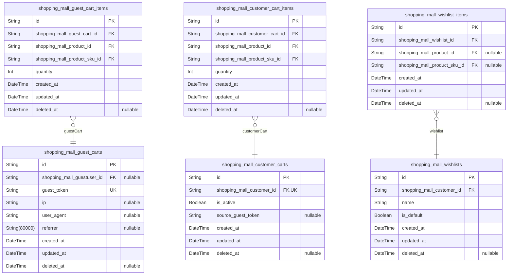

### `shopping_mall_guest_carts`

Temporary shopping carts owned by unauthenticated guest users.

Represents a transient cart created when a guestUser first adds an item
before registration or login. Each guest cart is bound to an anonymous
token and basic context such as originating URL, allowing later
association with a customer account during registration or login.

Guest carts are persisted for a configurable retention window for
continuity and analytics. They do not carry any payment or order state;
once checkout completes and an order is created, the cart can be cleared
or soft-deleted without affecting historical orders.

Properties as follows:

- `id`
  > Primary key for the guest cart. Uniquely identifies a temporary cart
  > instance for a guestUser.
- `shopping_mall_guestuser_id`
  > Optional reference to a guest user record if the platform maintains guest
  > identities. [shopping_mall_guestuser.id](#shopping_mall_guestuser).
- `guest_token`
  > Opaque anonymous token that identifies the guest cart within a
  > browser/session context. Used to retrieve the cart for an unauthenticated
  > visitor.
- `ip`
  > IP address captured when the guest cart was created or last significantly
  > modified. Used for security analysis and geo-based business rules.
- `user_agent`
  > Optional user agent string or a truncated representation, used for
  > analytics and troubleshooting guest cart behavior.
- `referrer`
  > Initial referrer URL when the cart was first created, if available. Helps
  > understand acquisition and funnel behavior.
- `created_at`: Timestamp when the guest cart was created.
- `updated_at`
  > Timestamp when the guest cart was last updated (for example, item added
  > or removed).
- `deleted_at`
  > Soft deletion timestamp. When set, indicates that the guest cart has been
  > logically removed or expired but kept for audit or analytics.

### `shopping_mall_guest_cart_items`

Line items belonging to a guest cart, representing SKU selections and
quantities.

Each record corresponds to a single SKU that a guestUser intends to
purchase. Items depend entirely on their parent guest cart and are
removed or updated when the guest modifies the cart or when the cart
expires.

This table does not store prices or discounts, as cart pricing is derived
at read time and firmly recorded only when orders are created.

Properties as follows:

- `id`
  > Primary key for the guest cart item. Uniquely identifies a specific SKU
  > entry within a guest cart.
- `shopping_mall_guest_cart_id`
  > Reference to the parent guest cart that owns this item. {@link
  > shopping_mall_guest_carts.id}.
- `shopping_mall_product_id`
  > Reference to the base catalog product for this item. {@link
  > shopping_mall_products.id}.
- `shopping_mall_product_sku_id`
  > Reference to the specific SKU variant (for example, size and color) that
  > the guest selected. [shopping_mall_product_skus.id](#shopping_mall_product_skus).
- `quantity`
  > Requested quantity of the SKU in the guest cart. Must be a positive
  > integer constrained by inventory and business limits at application
  > level.
- `created_at`: Timestamp when the item was first added to the guest cart.
- `updated_at`: Timestamp when the cart item was last updated, such as quantity changes.
- `deleted_at`
  > Soft deletion timestamp. When set, indicates that the item has been
  > logically removed from the cart but optionally retained for audit or
  > analytics.

### `shopping_mall_customer_carts`

Persistent shopping carts owned by authenticated customers.

Represents the main cart that a customer maintains across sessions and
devices. Each customer normally has at most one active persistent cart,
which can be merged with guest carts during registration or login.

Customer carts hold no payment or order state. When checkout completes
and an order is created, application logic may clear the cart, update
timestamps, or soft-delete the cart while preserving audit history.

Properties as follows:

- `id`
  > Primary key for the customer cart. Uniquely identifies a persistent cart
  > instance associated with a customer.
- `shopping_mall_customer_id`
  > Reference to the authenticated customer who owns this cart. {@link
  > shopping_mall_customer.id}.
- `is_active`
  > Flag indicating whether this cart is currently considered active for the
  > customer. Used to support scenarios with archived or historical carts.
- `source_guest_token`
  > Optional anonymous token from a source guest cart that was merged into
  > this customer cart. Useful for tracing guest-to-customer conversions.
- `created_at`: Timestamp when the customer cart was created.
- `updated_at`
  > Timestamp when the customer cart was last updated, such as when items or
  > quantities changed.
- `deleted_at`
  > Soft deletion timestamp. When set, indicates that the cart has been
  > logically removed or archived but kept for audit or analytics.

### `shopping_mall_customer_cart_items`

Line items belonging to a customer’s persistent cart, representing SKU
selections and quantities.

Each record corresponds to a specific SKU that an authenticated customer
has added to their cart. Items are tightly coupled to their parent
customer cart and are updated or removed when the customer changes
quantities, removes items, or clears the cart.

The table only captures structural details (product, SKU, quantity).
Pricing and promotions are evaluated dynamically during cart retrieval
and checkout and are recorded in the order domain instead of this table.

Properties as follows:

- `id`
  > Primary key for the customer cart item. Uniquely identifies a SKU entry
  > within a customer’s cart.
- `shopping_mall_customer_cart_id`
  > Reference to the parent customer cart that owns this item. {@link
  > shopping_mall_customer_carts.id}.
- `shopping_mall_product_id`
  > Reference to the base catalog product for this cart item. {@link
  > shopping_mall_products.id}.
- `shopping_mall_product_sku_id`
  > Reference to the specific SKU variant chosen by the customer for this
  > cart item. [shopping_mall_product_skus.id](#shopping_mall_product_skus).
- `quantity`
  > Requested quantity of the SKU in the customer cart. Must be a positive
  > integer enforced by stock and policy validations at application level.
- `created_at`: Timestamp when the item was first added to the customer cart.
- `updated_at`
  > Timestamp when the cart item was last updated, such as quantity
  > adjustments.
- `deleted_at`
  > Soft deletion timestamp. When set, indicates that the item has been
  > logically removed from the cart but retained for audit or analytics.

### `shopping_mall_wishlists`

Customer-owned wishlists that group products or SKUs for future
consideration.

Each wishlist belongs to a single authenticated customer and may be the
default wishlist that is created at registration. Customers can
optionally create additional wishlists, rename them, and manage their
contents while their account is active.

Wishlists are used only for planning and discovery and have no direct
payment or fulfillment state. They are independent primary entities that
can be listed, filtered, and moderated as needed.

Properties as follows:

- `id`
  > Primary key for the wishlist. Uniquely identifies a single wishlist
  > instance owned by a customer.
- `shopping_mall_customer_id`
  > Reference to the customer who owns this wishlist. {@link
  > shopping_mall_customer.id}.
- `name`
  > Human-readable name of the wishlist as chosen by the customer, such as
  > "Default", "Birthday Gifts", or "Ideas".
- `is_default`
  > Flag indicating whether this wishlist is the default wishlist for the
  > owning customer. Business logic ensures at most one default per customer.
- `created_at`: Timestamp when the wishlist was created.
- `updated_at`: Timestamp when the wishlist metadata or items were last updated.
- `deleted_at`
  > Soft deletion timestamp. When set, indicates that the wishlist has been
  > logically removed but retained for audit or potential recovery.

### `shopping_mall_wishlist_items`

Entries within a customer wishlist, referencing either products or
specific SKUs.

Each wishlist item associates a wishlist with a target in the catalog.
Depending on platform configuration, the target may be the whole product
or a particular SKU. To accommodate both modes without separate tables,
the record carries foreign keys for product and SKU, with application
logic enforcing which field is used for a given entry.

Wishlist items have no independent lifecycle apart from their parent
wishlist. They support soft deletion for audit, and they help avoid
duplicate entries for the same target within the same wishlist.

Properties as follows:

- `id`
  > Primary key for the wishlist item. Uniquely identifies a single entry
  > within a wishlist.
- `shopping_mall_wishlist_id`
  > Reference to the parent wishlist that owns this entry. {@link
  > shopping_mall_wishlists.id}.
- `shopping_mall_product_id`
  > Optional reference to a product being wished. Used when platform operates
  > with product-level wishlists. [shopping_mall_products.id](#shopping_mall_products).
- `shopping_mall_product_sku_id`
  > Optional reference to a specific SKU being wished. Used when platform
  > supports SKU-level wishlists. [shopping_mall_product_skus.id](#shopping_mall_product_skus).
- `created_at`: Timestamp when the wishlist item was created.
- `updated_at`: Timestamp when the wishlist item was last updated.
- `deleted_at`
  > Soft deletion timestamp. When set, indicates that the wishlist entry has
  > been logically removed but may still be retained for audit or analytics.

## Orders

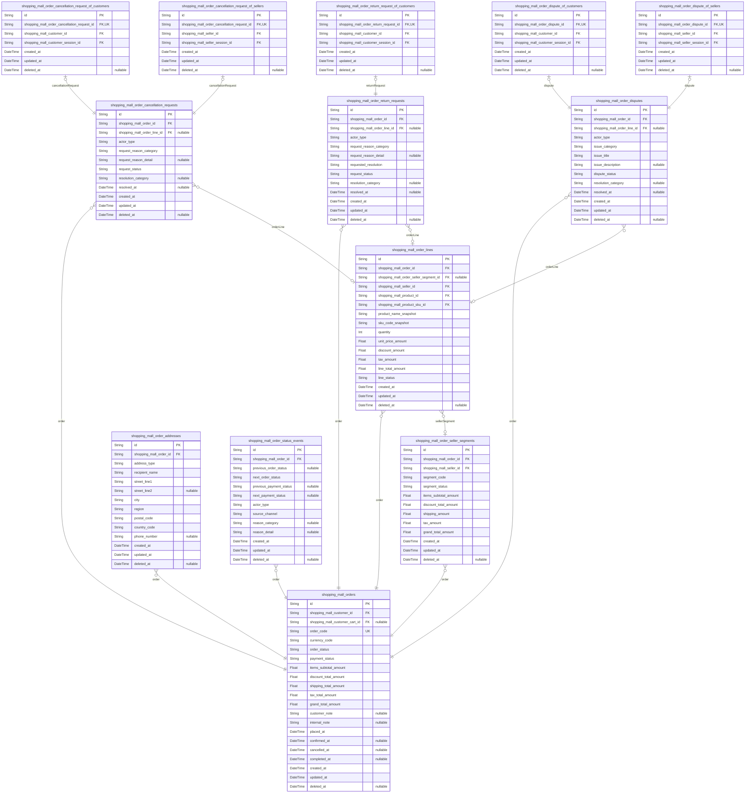

### `shopping_mall_orders`

Customer-facing master orders representing a checkout result and
aggregating items from multiple sellers.

Each order belongs to a single customer and may contain items from
multiple sellers via seller segments and order lines. The model stores
immutable business snapshots such as order code, currency, and price
totals at creation time, as well as mutable lifecycle fields like
order_status and payment_status that mirror current business state.

It references customer identity and optionally the originating customer
cart for traceability. Historical changes in order and payment status are
tracked via [shopping_mall_order_status_events](#shopping_mall_order_status_events). Cancellation,
return, and dispute records reference this entity as their primary
context.

Soft deletion is supported for operational removal from primary views
while preserving auditability.

Properties as follows:

- `id`: Primary key. Unique identifier of the order.
- `shopping_mall_customer_id`: Customer who owns this order. [shopping_mall_customer.id](#shopping_mall_customer).
- `shopping_mall_customer_cart_id`
  > Optional reference to the customer cart from which this order was
  > created. [shopping_mall_customer_carts.id](#shopping_mall_customer_carts).
- `order_code`
  > Business order code visible to customers and support. Typically unique
  > and human-readable (for example, 'ORD-20251114-0001').
- `currency_code`
  > ISO 4217 currency code for all monetary fields in this order snapshot
  > (for example, 'USD' or 'KRW').
- `order_status`
  > Current high-level business status of the order (for example,
  > pending_payment, processing, shipped, delivered, cancelled, refunded).
  > Managed by order workflows and mirrored by status events.
- `payment_status`
  > Current payment status snapshot for this order (for example,
  > payment_pending, payment_captured, payment_failed, partially_refunded,
  > refunded). Synchronized with payment domain events but stored as raw
  > state here.
- `items_subtotal_amount`
  > Snapshot subtotal of all line items before discounts, taxes, and
  > shipping, recorded at order creation time.
- `discount_total_amount`
  > Snapshot total of all discounts applied to this order at creation time,
  > including item-level and order-level promotions.
- `shipping_total_amount`
  > Snapshot total shipping cost across all seller segments at order creation
  > time.
- `tax_total_amount`: Snapshot total tax amount calculated for this order at creation time.
- `grand_total_amount`
  > Snapshot grand total amount payable for this order (items_subtotal_amount
  > - discount_total_amount + shipping_total_amount + tax_total_amount).
- `customer_note`
  > Optional free-text note provided by the customer during checkout for
  > sellers or support to see.
- `internal_note`
  > Internal note for support or platformAdmin about this order, not visible
  > to customers.
- `placed_at`
  > Timestamp when the order was successfully placed after checkout and
  > payment initiation.
- `confirmed_at`
  > Timestamp when the order was confirmed as ready for fulfillment according
  > to payment and validation rules.
- `cancelled_at`: Timestamp when the order became fully cancelled, if applicable.
- `completed_at`
  > Timestamp when the order lifecycle finished successfully (for example,
  > all items delivered and beyond return window).
- `created_at`: Timestamp when this order record was created in the system.
- `updated_at`: Timestamp when this order record was last updated.
- `deleted_at`
  > Soft deletion timestamp. When set, the order is hidden from normal
  > listings but retained for audit purposes.

### `shopping_mall_order_seller_segments`

Per-seller segments of a customer order representing the portion of the
order handled by a single seller.

Each segment links a [shopping_mall_orders](#shopping_mall_orders) record with a specific
[shopping_mall_seller](#shopping_mall_seller). It aggregates price totals, shipping
amounts, and fulfillment status for that seller’s portion of the order.

Sellers operate primarily on these segments for picking, packing,
shipping, and after-sales flows such as cancellations and refunds scoped
to their items. Soft deletion is supported for operational cleanup while
historical data is maintained.

Properties as follows:

- `id`: Primary key. Unique identifier of the order seller segment.
- `shopping_mall_order_id`
  > Order to which this seller segment belongs. {@link
  > shopping_mall_orders.id}.
- `shopping_mall_seller_id`
  > Seller responsible for fulfilling this segment of the order. {@link
  > shopping_mall_seller.id}.
- `segment_code`
  > Business-visible code that uniquely identifies this seller segment within
  > the order context (for example, 'ORD-20251114-0001-S1').
- `segment_status`
  > Current fulfillment-oriented status for this seller segment (for example,
  > new, preparing, shipped, delivered, cancelled).
- `items_subtotal_amount`
  > Snapshot subtotal of line items belonging to this seller segment before
  > discounts, taxes, and shipping.
- `discount_total_amount`: Snapshot total discount amount applied to this seller segment.
- `shipping_amount`: Snapshot shipping cost charged for this segment only.
- `tax_amount`: Snapshot tax amount allocated to this seller segment.
- `grand_total_amount`
  > Snapshot grand total amount for this seller segment (items_subtotal -
  > discounts + shipping + tax).
- `created_at`: Timestamp when this seller segment record was created.
- `updated_at`: Timestamp when this seller segment record was last updated.
- `deleted_at`
  > Soft deletion timestamp for this seller segment. When set, the segment is
  > excluded from normal lists but preserved for audit.

### `shopping_mall_order_addresses`

Snapshot of shipping and billing addresses associated with an order at
the time of checkout.

Addresses are stored as denormalized raw fields so that later changes to
customer address book do not affect historical orders. Each record is
tied to a [shopping_mall_orders](#shopping_mall_orders) entity and categorized by
address_type (for example, shipping or billing).

The model is subsidiary since addresses are managed through order
workflows and not independently. A uniqueness constraint ensures at most
one address per order and address_type combination.

Properties as follows:

- `id`: Primary key. Unique identifier of the order address snapshot.
- `shopping_mall_order_id`
  > Order that this address snapshot belongs to. {@link
  > shopping_mall_orders.id}.
- `address_type`
  > Type of address in relation to the order (for example, shipping,
  > billing). Determines how the address is used during fulfillment and
  > invoicing.
- `recipient_name`: Name of the recipient as provided at checkout for this order address.
- `street_line1`: First line of the street address for this order address snapshot.
- `street_line2`
  > Second line of the street address such as apartment, suite, or building
  > information.
- `city`: City component of the address at the time of order.
- `region`: Region, state, or province component of the address at the time of order.
- `postal_code`: Postal or ZIP code for this order address snapshot.
- `country_code`
  > ISO 3166-1 alpha-2 country code for this address (for example, 'KR' or
  > 'US').
- `phone_number`
  > Recipient contact phone number associated with this address at the time
  > of order.
- `created_at`: Timestamp when this address snapshot record was created.
- `updated_at`: Timestamp when this address snapshot record was last updated.
- `deleted_at`
  > Soft deletion timestamp for this address snapshot, used if an address
  > needs to be hidden from standard views.

### `shopping_mall_order_lines`

Individual line items within an order representing concrete SKUs,
quantities, and pricing snapshots.

Each line belongs to a [shopping_mall_orders](#shopping_mall_orders) record and optionally
to a [shopping_mall_order_seller_segments](#shopping_mall_order_seller_segments) entity when multi-seller
orders are split by seller. Lines reference catalog entities such as
[shopping_mall_products](#shopping_mall_products) and [shopping_mall_product_skus](#shopping_mall_product_skus)
rather than duplicating product attributes, while storing immutable price
and tax amounts recorded at order creation.

Lines are primary because they support independent queries across orders,
such as seller analytics, fulfillment operations, and item-level
cancellation, return, and dispute flows.

Properties as follows:

- `id`: Primary key. Unique identifier of the order line.
- `shopping_mall_order_id`: Order that this line item belongs to. [shopping_mall_orders.id](#shopping_mall_orders).
- `shopping_mall_order_seller_segment_id`
  > Optional seller segment that is responsible for fulfilling this line.
  > [shopping_mall_order_seller_segments.id](#shopping_mall_order_seller_segments).
- `shopping_mall_seller_id`
  > Seller that owns this item and will fulfill it. {@link
  > shopping_mall_seller.id}.
- `shopping_mall_product_id`: Product purchased in this line. [shopping_mall_products.id](#shopping_mall_products).
- `shopping_mall_product_sku_id`
  > SKU representing the specific variant purchased in this line. {@link
  > shopping_mall_product_skus.id}.
- `product_name_snapshot`
  > Product name as displayed to the customer at the time of ordering. Stored
  > as raw text to preserve historical names.
- `sku_code_snapshot`
  > Seller-facing or system SKU code value at the time of order, providing
  > historical traceability even if SKU metadata later changes.
- `quantity`
  > Number of units of the SKU purchased in this line. Represents the ordered
  > quantity, not necessarily shipped yet.
- `unit_price_amount`
  > Per-unit price of the SKU at the time of order before discounts and tax,
  > in the order currency.
- `discount_amount`
  > Total discount applied to this line across all units, recorded at order
  > creation.
- `tax_amount`
  > Total tax amount applied to this line across all units, recorded at order
  > creation.
- `line_total_amount`
  > Final total amount charged for this line after discounts and taxes,
  > recorded at order creation.
- `line_status`
  > Current status of this line from an order and fulfillment perspective
  > (for example, pending, fulfilled, cancelled, returned).
- `created_at`: Timestamp when this order line record was created.
- `updated_at`: Timestamp when this order line record was last updated.
- `deleted_at`
  > Soft deletion timestamp for this order line, used when the line should
  > not appear in normal operations.

### `shopping_mall_order_status_events`

Historical log of status transitions for orders, capturing how order and
payment states evolve over time.

Each status event is associated with a [shopping_mall_orders](#shopping_mall_orders)
record and records the previous and next status values as well as the
actor_type and source channel that triggered the change. This provides an
audit trail useful for customer support, compliance, and analytics.

The model is subsidiary because it is append-only supporting data for
orders and is not managed directly by end users.

Properties as follows:

- `id`: Primary key. Unique identifier of the order status event.
- `shopping_mall_order_id`: Order whose status was changed. [shopping_mall_orders.id](#shopping_mall_orders).
- `previous_order_status`
  > Order status value before this transition occurred. Nullable when this is
  > the initial status event for the order.
- `next_order_status`: Order status value after this transition occurred.
- `previous_payment_status`
  > Payment status value before this transition occurred. Nullable when no
  > payment state was previously set.
- `next_payment_status`
  > Payment status value after this transition occurred, if the payment state
  > changed as part of this event.
- `actor_type`
  > Type of actor that triggered the status change (for example, system,
  > customer, seller, platform_admin).
- `source_channel`
  > Channel through which the status change was initiated (for example, api,
  > admin_dashboard, seller_portal, customer_portal).
- `reason_category`
  > Optional category describing why the status changed (for example,
  > payment_confirmed, stock_issue, manual_adjustment).
- `reason_detail`
  > Optional free-text explanation or additional context for the status
  > change event.
- `created_at`: Timestamp when this status event was recorded.
- `updated_at`
  > Timestamp when this status event record was last updated, usually equal
  > to created_at since events are append-only.
- `deleted_at`
  > Soft deletion timestamp for this status event, used rarely for
  > operational cleanup while preserving integrity.

### `shopping_mall_order_cancellation_requests`

Cancellation requests raised against orders or specific order lines,
regardless of which actor initiated the request.

This main entity holds shared business fields for all cancellations such
as order linkage, optional line linkage, request_reason_category,
free-text details, current request_status, and resolution information. It
is associated with orders via [shopping_mall_orders](#shopping_mall_orders) and optionally
to lines via [shopping_mall_order_lines](#shopping_mall_order_lines).

Compatible actor subtypes {@link
shopping_mall_order_cancellation_request_of_customers} and {@link
shopping_mall_order_cancellation_request_of_sellers} carry actor-specific
foreign keys and sessions, enforcing 1:1 relationships and avoiding
multiple nullable FKs. The actor_type field enables filtering by actor
class while keeping the core cancellation behavior centralized.

Properties as follows:

- `id`: Primary key. Unique identifier of the cancellation request.
- `shopping_mall_order_id`
  > Order that this cancellation request refers to. {@link
  > shopping_mall_orders.id}.
- `shopping_mall_order_line_id`
  > Optional order line that this cancellation request targets, enabling
  > line-level cancellations. [shopping_mall_order_lines.id](#shopping_mall_order_lines).
- `actor_type`
  > Actor type that triggered the request (for example, customer, seller,
  > platform_admin). Used for filtering and consistency with subtype tables.
- `request_reason_category`
  > Categorized reason for the cancellation request (for example,
  > changed_mind, ordered_by_mistake, stock_issue, policy_violation).
- `request_reason_detail`
  > Free-text explanation provided by the actor describing why the
  > cancellation is being requested.
- `request_status`
  > Current status of the cancellation request (for example, pending,
  > approved, rejected, cancelled_by_actor).
- `resolution_category`
  > Category describing how the request was resolved (for example,
  > auto_approved, seller_approved, admin_override, rejected_policy).
- `resolved_at`
  > Timestamp when the request reached a terminal state such as approved or
  > rejected.
- `created_at`: Timestamp when this cancellation request was created.
- `updated_at`: Timestamp when this cancellation request was last updated.
- `deleted_at`: Soft deletion timestamp for this cancellation request record.

### `shopping_mall_order_cancellation_request_of_customers`

Customer-specific subtype entity linking a cancellation request to the
customer identity and session that created it.

Each record forms a 1:1 relationship with {@link
shopping_mall_order_cancellation_requests}, enforced via a unique index
on shopping_mall_order_cancellation_request_id. It references the {@link
shopping_mall_customer} and the [shopping_mall_customer_sessions](#shopping_mall_customer_sessions)
used when issuing the request.

This model is subsidiary because it is managed through the main
cancellation request lifecycle and is not manipulated independently from
business workflows.

Properties as follows:

- `id`
  > Primary key. Unique identifier of the customer cancellation request
  > subtype record.
- `shopping_mall_order_cancellation_request_id`
  > Cancellation request main record that this customer subtype details.
  > [shopping_mall_order_cancellation_requests.id](#shopping_mall_order_cancellation_requests).
- `shopping_mall_customer_id`
  > Customer who initiated this cancellation request. {@link
  > shopping_mall_customer.id}.
- `shopping_mall_customer_session_id`
  > Customer session used when submitting the request, providing audit
  > context. [shopping_mall_customer_sessions.id](#shopping_mall_customer_sessions).
- `created_at`: Timestamp when this customer subtype record was created.
- `updated_at`: Timestamp when this customer subtype record was last updated.
- `deleted_at`: Soft deletion timestamp for this customer subtype record.

### `shopping_mall_order_cancellation_request_of_sellers`

Seller-specific subtype entity linking a cancellation request to the
seller identity and session that created it.

Each record represents a cancellation request initiated by a seller for
their own order lines or segments. It forms a 1:1 relationship with
[shopping_mall_order_cancellation_requests](#shopping_mall_order_cancellation_requests) via a unique index.
Actor-specific context such as seller and seller session are retained
here instead of in the main table to preserve normalization.

The model is subsidiary and accessed through cancellation request
workflows and seller dashboards rather than managed independently.

Properties as follows:

- `id`
  > Primary key. Unique identifier of the seller cancellation request subtype
  > record.
- `shopping_mall_order_cancellation_request_id`
  > Cancellation request main record that this seller subtype details. {@link
  > shopping_mall_order_cancellation_requests.id}.
- `shopping_mall_seller_id`
  > Seller who initiated this cancellation request. {@link
  > shopping_mall_seller.id}.
- `shopping_mall_seller_session_id`
  > Seller session used when submitting the request, enabling audit and risk
  > analysis. [shopping_mall_seller_sessions.id](#shopping_mall_seller_sessions).
- `created_at`: Timestamp when this seller subtype record was created.
- `updated_at`: Timestamp when this seller subtype record was last updated.
- `deleted_at`: Soft deletion timestamp for this seller subtype record.

### `shopping_mall_order_return_requests`

Return or refund requests initiated for delivered order items, usually by
customers within the allowed return window.

The main entity captures common attributes such as the target order and
optional specific line, actor_type (normally customer but extensible),
reason category and details, requested resolution, and request_status. It
also stores resolution information such as resolution_category and
resolved_at.

It is complemented by the subtype {@link
shopping_mall_order_return_request_of_customers}, which ties the request
to the customer and session. Financial refund transactions are handled by
the Payments component, which references this entity when necessary.

Properties as follows:

- `id`: Primary key. Unique identifier of the return request.
- `shopping_mall_order_id`
  > Order that this return or refund request refers to. {@link
  > shopping_mall_orders.id}.
- `shopping_mall_order_line_id`
  > Optional specific order line that this return request targets when the
  > request is item-level. [shopping_mall_order_lines.id](#shopping_mall_order_lines).
- `actor_type`
  > Actor type that initiated the request, typically 'customer', but modeled
  > generically for future extensions.
- `request_reason_category`
  > Categorized reason for the return (for example, defective_item,
  > wrong_item, not_as_described, changed_mind).
- `request_reason_detail`
  > Free-text description of the problem from the actor's perspective, such
  > as defect description or fit issues.
- `requested_resolution`
  > Requested resolution type (for example, refund, replacement,
  > store_credit).
- `request_status`
  > Current status of the return request (for example, pending, approved,
  > rejected, awaiting_item, refunded, closed).
- `resolution_category`
  > Category describing how the request was resolved (for example,
  > refund_issued, replacement_shipped, denied_policy).
- `resolved_at`: Timestamp when the request reached a final resolution state.
- `created_at`: Timestamp when this return request was created.
- `updated_at`: Timestamp when this return request was last updated.
- `deleted_at`: Soft deletion timestamp for this return request.

### `shopping_mall_order_return_request_of_customers`

Customer-specific subtype entity linking a return request to the customer
identity and session that created it.

This model enforces a 1:1 relationship with {@link
shopping_mall_order_return_requests} via a unique index on
shopping_mall_order_return_request_id. It references the {@link
shopping_mall_customer} and the [shopping_mall_customer_sessions](#shopping_mall_customer_sessions)
active at the time of submission.

It is subsidiary because it is managed exclusively through return request
workflows and serves to preserve actor context for audit, fraud analysis,
and customer service traces.

Properties as follows:

- `id`
  > Primary key. Unique identifier of the customer return request subtype
  > record.
- `shopping_mall_order_return_request_id`
  > Return request main record that this customer subtype details. {@link
  > shopping_mall_order_return_requests.id}.
- `shopping_mall_customer_id`
  > Customer who initiated this return request. {@link
  > shopping_mall_customer.id}.
- `shopping_mall_customer_session_id`
  > Customer session used when submitting the return request. {@link
  > shopping_mall_customer_sessions.id}.
- `created_at`: Timestamp when this customer subtype record was created.
- `updated_at`: Timestamp when this customer subtype record was last updated.
- `deleted_at`: Soft deletion timestamp for this customer subtype record.

### `shopping_mall_order_disputes`

Disputes raised in relation to orders, order lines, or after-sales
interactions, covering complaints such as non-delivery, damaged goods, or
service dissatisfaction.

This main entity contains shared dispute data including links to {@link
shopping_mall_orders}, optional [shopping_mall_order_lines](#shopping_mall_order_lines),
actor_type, issue_category, description, dispute_status, and resolution
information. It is complemented by subtype entities for customer and
seller perspectives.

Disputes provide a central record for platformAdmin to resolve conflicts
and interact with payment chargebacks, refunds, and inventory
corrections, while preserving a full timeline of interactions from
different actors.

Properties as follows:

- `id`: Primary key. Unique identifier of the dispute.
- `shopping_mall_order_id`: Order that this dispute is about. [shopping_mall_orders.id](#shopping_mall_orders).
- `shopping_mall_order_line_id`
  > Optional specific order line that the dispute targets when it is
  > line-level. [shopping_mall_order_lines.id](#shopping_mall_order_lines).
- `actor_type`
  > Actor type that opened the dispute (for example, customer, seller,
  > platform_admin).
- `issue_category`
  > Categorized type of problem being disputed (for example, non_delivery,
  > damaged_item, incorrect_item, payment_issue, policy_violation).
- `issue_title`: Short summary title describing the dispute, used in lists and dashboards.
- `issue_description`
  > Detailed description of the problem, including contextual information
  > provided by the actor.
- `dispute_status`
  > Current status of the dispute (for example, open, awaiting_seller,
  > awaiting_customer, resolved_customer_favored, resolved_seller_favored,
  > closed_without_action).
- `resolution_category`
  > Category describing the resolution outcome (for example, refund_given,
  > replacement_sent, claim_rejected, goodwill_credit).
- `resolved_at`: Timestamp when the dispute reached a terminal resolved state.
- `created_at`: Timestamp when this dispute was opened.
- `updated_at`: Timestamp when this dispute record was last updated.
- `deleted_at`: Soft deletion timestamp for this dispute record.

### `shopping_mall_order_dispute_of_customers`

Customer-specific subtype entity linking a dispute to the customer and
session that opened it.

It enforces a 1:1 relationship with [shopping_mall_order_disputes](#shopping_mall_order_disputes)
using a unique constraint on shopping_mall_order_dispute_id. The entity
references [shopping_mall_customer](#shopping_mall_customer) and {@link
shopping_mall_customer_sessions} to provide traceable actor context.

Being subsidiary, the model is created and managed only as part of
dispute workflows and not through independent CRUD operations.

Properties as follows:

- `id`: Primary key. Unique identifier of the customer dispute subtype record.
- `shopping_mall_order_dispute_id`
  > Main dispute record that this customer subtype details. {@link
  > shopping_mall_order_disputes.id}.
- `shopping_mall_customer_id`: Customer who opened this dispute. [shopping_mall_customer.id](#shopping_mall_customer).
- `shopping_mall_customer_session_id`
  > Customer session used when submitting the dispute. {@link
  > shopping_mall_customer_sessions.id}.
- `created_at`: Timestamp when this customer subtype record was created.
- `updated_at`: Timestamp when this customer subtype record was last updated.
- `deleted_at`: Soft deletion timestamp for this customer subtype record.

### `shopping_mall_order_dispute_of_sellers`

Seller-specific subtype entity linking a dispute to the seller and
session that opened it.

The model captures disputes initiated by sellers about order items, such
as fraudulent customer claims or logistical issues. It maintains a 1:1
relationship with [shopping_mall_order_disputes](#shopping_mall_order_disputes) and references
[shopping_mall_seller](#shopping_mall_seller) and [shopping_mall_seller_sessions](#shopping_mall_seller_sessions).

This entity is subsidiary, created and modified through dispute
management workflows and seller tools, ensuring that ownership and
session context remains normalized and auditable.

Properties as follows:

- `id`: Primary key. Unique identifier of the seller dispute subtype record.
- `shopping_mall_order_dispute_id`
  > Main dispute record that this seller subtype details. {@link
  > shopping_mall_order_disputes.id}.
- `shopping_mall_seller_id`: Seller who opened this dispute. [shopping_mall_seller.id](#shopping_mall_seller).
- `shopping_mall_seller_session_id`
  > Seller session used when submitting the dispute. {@link
  > shopping_mall_seller_sessions.id}.
- `created_at`: Timestamp when this seller subtype record was created.
- `updated_at`: Timestamp when this seller subtype record was last updated.
- `deleted_at`: Soft deletion timestamp for this seller subtype record.

## Payments

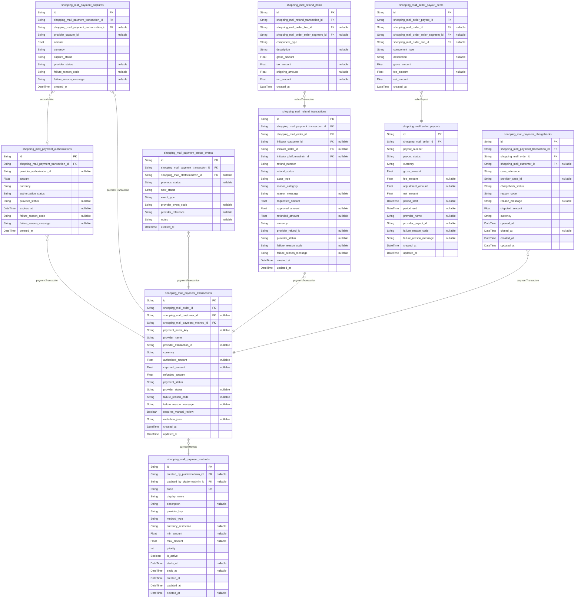

### `shopping_mall_payment_methods`

Configurable payment methods available on the shoppingMall platform.

Stores the catalog of conceptual payment methods such as credit card,
bank transfer, and digital wallet as they are exposed to checkout. Each
method is linked to a payment provider integration and can be enabled or
disabled over time.

The table is used by payment transactions to record which method was
chosen for a given order. Admin users manage these rows as business
configuration, adjusting display names, ordering, and availability
windows without touching historical financial records.

Properties as follows:

- `id`: Primary key of the payment method.
- `created_by_platformadmin_id`
  > Administrator who initially created this payment method configuration.
  > [shopping_mall_platformadmin.id](#shopping_mall_platformadmin).
- `updated_by_platformadmin_id`
  > Most recent administrator who updated this payment method configuration.
  > [shopping_mall_platformadmin.id](#shopping_mall_platformadmin).
- `code`
  > Business identifier for the payment method, unique across the platform,
  > such as "card", "bank_transfer", or a provider-specific key.
- `display_name`
  > Human readable name shown to customers at checkout, such as "Credit Card"
  > or "Bank Transfer".
- `description`
  > Optional longer description of the payment method, including business
  > notes or eligibility information.
- `provider_key`
  > Identifier of the underlying payment provider configuration that should
  > be used when processing this method, for example a gateway code or
  > profile key.
- `method_type`
  > Logical type of the payment method, such as "card", "bank", "wallet", or
  > "offline". Used for business rules and reporting.
- `currency_restriction`
  > Optional list or pattern of currencies that this method supports, encoded
  > as a business string when a method is not globally available.
- `min_amount`
  > Optional minimum order amount in the platform currency for which this
  > payment method is allowed.
- `max_amount`
  > Optional maximum order amount in the platform currency for which this
  > payment method is allowed.
- `priority`
  > Display priority for this payment method in checkout lists. Lower values
  > are shown earlier.
- `is_active`
  > Indicates whether this payment method is currently available for new
  > checkouts.
- `starts_at`
  > Optional datetime after which this payment method becomes eligible for
  > use in checkout.
- `ends_at`
  > Optional datetime after which this payment method should no longer appear
  > in checkout selections.
- `created_at`: Timestamp when this payment method row was first created.
- `updated_at`: Timestamp when this payment method row was last updated.
- `deleted_at`
  > Soft deletion timestamp used to hide this method from configuration lists
  > while keeping historical references intact.

### `shopping_mall_payment_transactions`

Customer payment transactions associated with shoppingMall orders.

Represents the platform-level payment record for an order, independent of
the underlying provider implementation. Each transaction references the
order it pays for, the payment method chosen at checkout, and key
provider identifiers used for reconciliation.

The table captures amounts authorized and captured, the current business
payment status, and links to associated authorization and capture
attempts, refund transactions, chargebacks, and status events. It forms
the core of financial reporting for incoming payments.

Properties as follows:

- `id`: Primary key of the payment transaction.
- `shopping_mall_order_id`
  > Order that this payment transaction is associated with. {@link
  > shopping_mall_orders.id}.
- `shopping_mall_customer_id`
  > Customer who owns the order and initiated the payment. Nullable for edge
  > cases where the customer record is unavailable. {@link
  > shopping_mall_customer.id}.
- `shopping_mall_payment_method_id`
  > Payment method used for this transaction at checkout time. {@link
  > shopping_mall_payment_methods.id}.
- `payment_intent_key`
  > Optional platform-side identifier grouping multiple provider interactions
  > for the same logical payment intent, such as an internal intent code.
- `provider_name`
  > Name or code of the payment provider handling this transaction, such as a
  > gateway identifier.
- `provider_transaction_id`
  > Identifier of the transaction at the payment provider, used for
  > reconciliation and support inquiries.
- `currency`
  > ISO currency code for the amounts in this transaction, for example "USD"
  > or "EUR".
- `authorized_amount`
  > Total amount that has been successfully authorized by the provider but
  > not necessarily captured yet.
- `captured_amount`
  > Total amount that has been successfully captured from the provider for
  > this transaction.
- `refunded_amount`
  > Total amount that has been refunded against this payment transaction,
  > aggregated from refund transactions.
- `payment_status`
  > Business payment status for the order, such as "payment_pending",
  > "payment_in_progress", "payment_authorized", "payment_captured",
  > "payment_failed", "payment_expired", "partially_refunded", or "refunded".
- `provider_status`
  > Raw or provider-specific status code representing the latest known state
  > of the provider transaction.
- `failure_reason_code`
  > Optional code describing why the payment failed, using either
  > platform-defined or provider-defined categories.
- `failure_reason_message`
  > Optional human readable message explaining why the payment failed or
  > could not be processed.
- `requires_manual_review`
  > Indicates that this payment transaction requires manual investigation or
  > review due to risk signals or inconsistencies.
- `metadata_json`
  > Optional JSON-encoded metadata from business logic or the provider. Only
  > raw data is stored; interpretation happens in application code.
- `created_at`: Timestamp when this payment transaction record was created.
- `updated_at`: Timestamp when this payment transaction record was last updated.

### `shopping_mall_payment_authorizations`

Authorization attempts associated with payment transactions.

Each row represents a single authorization interaction with a payment
provider for a given payment transaction. It stores provider
authorization identifiers, amounts, and status codes, and supports
multiple attempts or re-authorizations where business policy allows.

This table acts as supporting audit detail for {@link
shopping_mall_payment_transactions} and is not typically manipulated
directly by end users, but it is important for troubleshooting and
reconciliation.

Properties as follows:

- `id`: Primary key of the payment authorization attempt.
- `shopping_mall_payment_transaction_id`
  > Payment transaction that this authorization attempt belongs to. {@link
  > shopping_mall_payment_transactions.id}.
- `provider_authorization_id`
  > Identifier of the authorization at the payment provider, used to
  > reference or capture funds later.
- `amount`: Amount that was requested for authorization in the transaction currency.
- `currency`
  > ISO currency code for the authorization amount, matching the parent
  > payment transaction.
- `authorization_status`
  > Business status for this authorization attempt, such as "authorized",
  > "authorization_failed", or "authorization_voided".
- `provider_status`: Raw status code returned by the provider for this authorization attempt.
- `expires_at`
  > Datetime when the authorization is expected to expire according to
  > provider rules.
- `failure_reason_code`
  > Optional code describing why the authorization failed when the status
  > represents a failure.
- `failure_reason_message`
  > Optional human readable explanation describing authorization failure
  > returned by the provider or produced by the platform.
- `created_at`: Timestamp when this authorization record was created.

### `shopping_mall_payment_captures`

Capture attempts for previously authorized payment transactions.

Each row records a capture interaction with the payment provider, which
moves funds from an authorized state to a captured state. The design
supports multiple partial captures against the same authorization or
payment transaction and records provider identifiers and status codes for
each attempt.

These records provide fine-grained audit trails that complement the
aggregate captured_amount stored on {@link
shopping_mall_payment_transactions}.

Properties as follows:

- `id`: Primary key of the payment capture attempt.
- `shopping_mall_payment_transaction_id`
  > Payment transaction that this capture attempt belongs to. {@link
  > shopping_mall_payment_transactions.id}.
- `shopping_mall_payment_authorization_id`
  > Authorization record that this capture is based on, when a specific
  > authorization was used. [shopping_mall_payment_authorizations.id](#shopping_mall_payment_authorizations).
- `provider_capture_id`
  > Identifier of the capture at the payment provider, used for
  > reconciliation.
- `amount`
  > Amount that was requested to be captured in this attempt, expressed in
  > the transaction currency.
- `currency`
  > ISO currency code for the capture amount, matching the parent payment
  > transaction.
- `capture_status`
  > Business status for this capture attempt, such as "capture_succeeded" or
  > "capture_failed".
- `provider_status`: Raw status code from the provider describing the capture result.
- `failure_reason_code`
  > Optional code describing why the capture failed when capture_status
  > indicates failure.
- `failure_reason_message`: Optional human readable message describing capture failure details.
- `created_at`: Timestamp when this capture record was created.

### `shopping_mall_payment_status_events`

Status and event history for payment transactions.

Captures an append-only stream of state changes, notifications, and
significant events related to a payment transaction. This includes
transitions between business payment statuses, asynchronous webhooks from
providers, and manual changes triggered by admins.

The table provides a detailed timeline for troubleshooting, analysis, and
compliance investigations and complements the current payment_status on
[shopping_mall_payment_transactions](#shopping_mall_payment_transactions).

Properties as follows:

- `id`: Primary key of the payment status event.
- `shopping_mall_payment_transaction_id`
  > Payment transaction that this status event belongs to. {@link
  > shopping_mall_payment_transactions.id}.
- `shopping_mall_platformadmin_id`
  > Administrator responsible for this event when it represents a manual
  > override or adjustment. [shopping_mall_platformadmin.id](#shopping_mall_platformadmin).
- `previous_status`
  > Payment status before this event was applied, using the same business
  > vocabulary as payment_status on the transaction.
- `new_status`
  > Payment status after this event was applied, using the same business
  > vocabulary as payment_status on the transaction.
- `event_type`
  > Categorized type of status event, such as "provider_webhook",
  > "manual_update", or "system_transition".
- `provider_event_code`
  > Optional raw event code from the provider when the event was triggered by
  > an external notification.
- `provider_reference`
  > Optional reference identifier from the provider, such as an event ID or
  > notification ID.
- `notes`
  > Optional human readable notes describing the reason or context for this
  > status change.
- `created_at`: Timestamp when this status event was recorded.

### `shopping_mall_refund_transactions`

Refund transactions that return funds to customers for all or part of an
order.

Each row represents a distinct refund event against a payment transaction
and order. It stores the refunded amount, reason categories, and status,
and provides links to the underlying payment transaction and order for
reconciliation.

Refunds may be triggered by customers, sellers, or platform admins. The
table records the initiating actor type and identifiers and is
complemented by [shopping_mall_refund_items](#shopping_mall_refund_items) for line-level
breakdowns and [shopping_mall_payment_transactions](#shopping_mall_payment_transactions) for the
original payment context.

Properties as follows:

- `id`: Primary key of the refund transaction.
- `shopping_mall_payment_transaction_id`
  > Payment transaction that this refund is applied to. {@link
  > shopping_mall_payment_transactions.id}.
- `shopping_mall_order_id`
  > Order whose financial amounts are being refunded. {@link
  > shopping_mall_orders.id}.
- `initiator_customer_id`
  > Customer who initiated the refund request when it originates from the
  > buyer. [shopping_mall_customer.id](#shopping_mall_customer).
- `initiator_seller_id`
  > Seller who initiated the refund when the request originates from the
  > merchant side. [shopping_mall_seller.id](#shopping_mall_seller).
- `initiator_platformadmin_id`
  > Administrator who initiated or approved the refund when it is an
  > admin-driven adjustment. [shopping_mall_platformadmin.id](#shopping_mall_platformadmin).
- `refund_number`
  > Business identifier for the refund transaction, unique per payment for
  > audit and customer communication.
- `refund_status`
  > Business status of the refund, such as "refund_pending",
  > "refund_in_progress", "refund_failed", or "refund_completed".
- `actor_type`
  > Categorical type of the actor that initiated the refund, such as
  > "customer", "seller", or "admin". Used for reporting and business rules.
- `reason_category`
  > Categorized reason for the refund, such as "customer_cancellation",
  > "seller_cancellation", "return", or "admin_adjustment".
- `reason_message`
  > Optional free text explanation describing why the refund was requested or
  > approved.
- `requested_amount`: Amount initially requested to be refunded in the payment currency.
- `approved_amount`
  > Amount that was approved for refund, which may be less than the
  > requested_amount according to policy.
- `refunded_amount`
  > Amount actually refunded through the provider once the refund is
  > completed.
- `currency`
  > ISO currency code for all amounts, matching the currency of the payment
  > transaction.
- `provider_refund_id`
  > Identifier for this refund at the payment provider, used for
  > reconciliation and support.
- `provider_status`
  > Raw status code from the payment provider describing the current state of
  > the refund.
- `failure_reason_code`
  > Optional code describing why the refund failed when refund_status
  > indicates a failure.
- `failure_reason_message`: Optional message giving more detail about a refund failure.
- `created_at`: Timestamp when the refund transaction record was created.
- `updated_at`: Timestamp when the refund transaction record was last updated.

### `shopping_mall_refund_items`

Line-level breakdown of amounts within a refund transaction.

Each row represents a component of a refund, such as a specific order
line, shipping portion, or manual adjustment. This allows the platform to
explain which parts of an order were refunded and to match refund amounts
to item-level and fee-level amounts.

The table is managed as a child of {@link
shopping_mall_refund_transactions} and may reference order lines or
seller segments defined in the order domain.

Properties as follows:

- `id`: Primary key of the refund item.
- `shopping_mall_refund_transaction_id`
  > Refund transaction that this item belongs to. {@link
  > shopping_mall_refund_transactions.id}.
- `shopping_mall_order_line_id`
  > Order line that this refund item relates to, when the refund targets
  > specific items. [shopping_mall_order_lines.id](#shopping_mall_order_lines).
- `shopping_mall_order_seller_segment_id`
  > Seller segment that this refund item relates to when the refund is
  > computed at seller-scope instead of a single line. {@link
  > shopping_mall_order_seller_segments.id}.
- `component_type`
  > Type of amount being refunded, such as "item_price", "tax", "shipping",
  > or "adjustment".
- `description`
  > Optional description of this refund component, suitable for
  > customer-facing explanations.
- `gross_amount`
  > Gross amount of this refund component before any fees, expressed in the
  > refund currency.
- `tax_amount`
  > Amount of tax included in this refund component when tax needs to be
  > reported separately.
- `shipping_amount`: Portion of shipping cost included in this component when applicable.
- `net_amount`
  > Net amount of this refund component after subtracting non-refundable fees
  > if any are applied by the business.
- `created_at`: Timestamp when this refund item record was created.

### `shopping_mall_payment_chargebacks`

Chargebacks raised through financial institutions against completed
payments.

Represents disputes initiated outside the platform, typically via a
customer’s bank or card issuer. Each record groups information about the
chargeback case, including the amount contested, provider reason codes,
and the current chargeback status.

These rows link back to the original payment transaction and order and
are used by platform admins and finance teams to manage responses, report
loss due to chargebacks, and align with dispute-handling policies.

Properties as follows:

- `id`: Primary key of the chargeback record.
- `shopping_mall_payment_transaction_id`
  > Payment transaction that this chargeback relates to. {@link
  > shopping_mall_payment_transactions.id}.
- `shopping_mall_order_id`
  > Order whose payment is being disputed through the chargeback. {@link
  > shopping_mall_orders.id}.
- `shopping_mall_customer_id`
  > Customer associated with the order under dispute. {@link
  > shopping_mall_customer.id}.
- `case_reference`
  > Platform-side identifier for the chargeback case, unique per payment
  > transaction for internal tracking.
- `provider_case_id`
  > Identifier for the chargeback case at the payment provider or card
  > network.
- `chargeback_status`
  > Current business status of the chargeback, such as "chargeback_open",
  > "chargeback_won", or "chargeback_lost".
- `reason_code`
  > Provider or scheme reason code indicating why the chargeback was opened,
  > such as fraud, non-receipt, or product dissatisfaction.
- `reason_message`
  > Optional human readable explanation or description associated with the
  > reason code.
- `disputed_amount`
  > Amount that is being disputed through the chargeback, expressed in the
  > payment currency.
- `currency`
  > ISO currency code for the disputed amount, usually matching the original
  > payment currency.
- `opened_at`: Datetime when the chargeback was first reported to the platform.
- `closed_at`
  > Datetime when the chargeback case was closed, either in favor of the
  > customer or the platform.
- `created_at`: Timestamp when this chargeback record was created in the system.
- `updated_at`: Timestamp when this chargeback record was last updated.

### `shopping_mall_seller_payouts`

Payout batches that transfer funds from the platform to individual sellers.

Each row aggregates net earnings, adjustments, and fees for a seller over
a payout period, and maps them to a single outbound payment to the
seller, such as a bank transfer. The table tracks payout status and
provider identifiers and is the root for {@link
shopping_mall_seller_payout_items} that detail per-order allocations.

Finance and accounting teams use this entity to reconcile platform
liabilities and to report on what has been paid out or is still pending
for each seller.

Properties as follows:

- `id`: Primary key of the seller payout.
- `shopping_mall_seller_id`: Seller that receives this payout. [shopping_mall_seller.id](#shopping_mall_seller).
- `payout_number`
  > Business identifier of the payout, unique per seller for reconciliation
  > and communication.
- `payout_status`
  > Current status of the payout, such as "payout_pending",
  > "payout_in_progress", "payout_failed", or "payout_sent".
- `currency`
  > ISO currency code of the payout, usually the settlement currency agreed
  > with the seller.
- `gross_amount`
  > Total gross amount of all positive earnings included in this payout
  > before fees and adjustments.
- `fee_amount`
  > Total amount of fees or commissions deducted from the seller as part of
  > this payout.
- `adjustment_amount`
  > Net effect of manual adjustments, such as manual credits or debits,
  > included in this payout.
- `net_amount`
  > Net amount that is actually paid out to the seller after fees and
  > adjustments.
- `period_start`
  > Optional start of the earnings period covered by this payout, used for
  > reporting and reconciliation.
- `period_end`
  > Optional end of the earnings period covered by this payout, used for
  > reporting and reconciliation.
- `provider_name`
  > Name or code of the external payment provider or bank used to send this
  > payout.
- `provider_payout_id`
  > Identifier for this payout at the provider or bank, used for tracing
  > payouts.
- `failure_reason_code`
  > Optional code describing why the payout failed when payout_status
  > indicates failure.
- `failure_reason_message`
  > Optional human readable description giving more information about a
  > payout failure.
- `created_at`: Timestamp when this payout record was created.
- `updated_at`: Timestamp when this payout record was last updated.

### `shopping_mall_seller_payout_items`

Per-order and per-line components included in a seller payout.

Each row represents a specific contribution to a seller payout such as
revenue from a particular order line, a refund adjustment, or a manual
correction. This breakdown links payout amounts back to underlying orders
and seller segments to support transparent statements and reconciliation.

The table is a child of [shopping_mall_seller_payouts](#shopping_mall_seller_payouts) and relies
on order-centric tables for the underlying commercial context.

Properties as follows:

- `id`: Primary key of the seller payout item.
- `shopping_mall_seller_payout_id`
  > Seller payout that this item contributes to. {@link
  > shopping_mall_seller_payouts.id}.
- `shopping_mall_order_id`
  > Order that this payout item is derived from when applicable. {@link
  > shopping_mall_orders.id}.
- `shopping_mall_order_seller_segment_id`
  > Seller segment of the order that this payout item relates to, when
  > allocation is tracked at segment level. {@link
  > shopping_mall_order_seller_segments.id}.
- `shopping_mall_order_line_id`
  > Order line that this payout item relates to when the payout is calculated
  > at line level. [shopping_mall_order_lines.id](#shopping_mall_order_lines).
- `component_type`
  > Type of component included in the payout, such as "item_revenue",
  > "shipping_revenue", "refund_deduction", or "manual_adjustment".
- `description`: Optional explanation shown in seller statements for this payout component.
- `gross_amount`: Gross amount for this payout component before deducting platform fees.
- `fee_amount`: Amount of platform fees allocated to this component when available.
- `net_amount`
  > Net amount from this component that contributes to the seller’s payout
  > after fees.
- `created_at`: Timestamp when this payout item record was created.

## Inventory

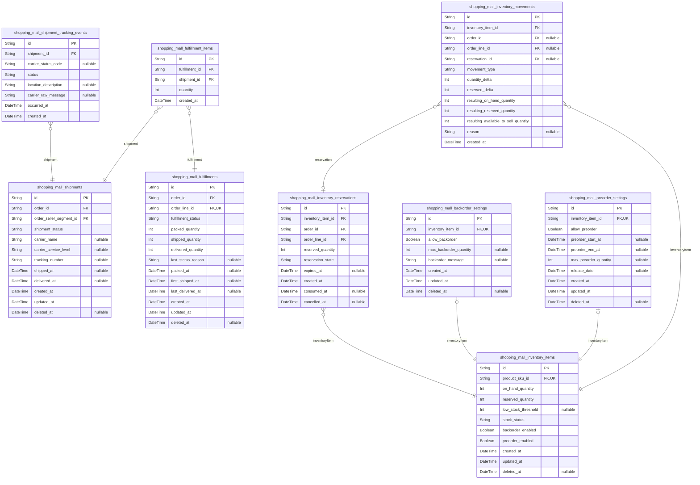

### `shopping_mall_inventory_items`

Per-SKU inventory state for each sellable variant.

Represents the authoritative stock position for a single product SKU,
including on-hand and reserved quantities. This model is the core
reference for inventory-related decisions in cart validation, checkout,
and fulfillment.

Each record is linked to exactly one SKU in {@link
shopping_mall_product_skus}. It exposes normalized quantitative fields
and status flags. Detailed configuration for backorders and preorders is
stored in [shopping_mall_backorder_settings](#shopping_mall_backorder_settings) and {@link
shopping_mall_preorder_settings} via 1:1 relationships.

Soft deletion is supported via deleted_at to allow historical
reconstruction without losing past inventory states. Any
available-to-sell figures should be computed dynamically from
on_hand_quantity and reserved_quantity or via materialized views, not
stored redundantly in this table.

Properties as follows:

- `id`: Primary key for the inventory item record.
- `product_sku_id`
  > Target SKU whose inventory is being tracked. {@link
  > shopping_mall_product_skus.id}.
- `on_hand_quantity`
  > Number of units physically available in storage for this SKU, not yet
  > sold or reserved.
- `reserved_quantity`
  > Number of units currently reserved for pending orders that are not yet
  > fully paid or fulfilled.
- `low_stock_threshold`
  > Optional threshold at or below which this SKU should be considered low
  > stock for alerts and catalog signals.
- `stock_status`
  > Current stock status flag such as in_stock, low_stock, out_of_stock,
  > backorder_allowed, or preorder_only. Business logic interprets allowed
  > values.
- `backorder_enabled`
  > Indicates whether backorders are allowed for this SKU based on current
  > configuration and policies.
- `preorder_enabled`
  > Indicates whether this SKU is currently available for preorder only,
  > before normal stock is available.
- `created_at`: Timestamp when this inventory item record was created.
- `updated_at`: Timestamp when this inventory item record was last updated.
- `deleted_at`
  > Timestamp when this inventory item record was soft-deleted. Null when the
  > record is active.

### `shopping_mall_inventory_reservations`

Temporary reservations of inventory units linked to orders and order lines.

Each reservation represents a portion of stock held for a given order
line while payment and checkout are in progress. Reservations prevent
overselling by reducing the available-to-sell quantity without
immediately decrementing on-hand stock.

Reservations may expire when payment is not completed within configured
windows. They are always linked to an {@link
shopping_mall_inventory_items} record and usually to {@link
shopping_mall_orders} and [shopping_mall_order_lines](#shopping_mall_order_lines).

Properties as follows:

- `id`: Primary key for the inventory reservation record.
- `inventory_item_id`
  > Inventory item whose quantity is being temporarily reserved. {@link
  > shopping_mall_inventory_items.id}.
- `order_id`
  > Order for which this reservation was created. {@link
  > shopping_mall_orders.id}.
- `order_line_id`
  > Specific order line that consumes this reservation. {@link
  > shopping_mall_order_lines.id}.
- `reserved_quantity`: Number of units reserved for the related order line.
- `reservation_state`
  > Current state of the reservation such as pending, active, consumed,
  > expired, or cancelled.
- `expires_at`
  > Timestamp when this reservation expires if payment is not completed. Null
  > if managed by other business rules.
- `created_at`: Timestamp when this reservation record was created.
- `consumed_at`
  > Timestamp when this reservation was consumed into a paid order or
  > otherwise finalized.
- `cancelled_at`
  > Timestamp when this reservation was cancelled without consumption. Null
  > when still active or consumed.

### `shopping_mall_inventory_movements`

Historical record of inventory quantity changes per SKU.

Each row captures a single business event that changes inventory
quantities for an [shopping_mall_inventory_items](#shopping_mall_inventory_items) record, such as
restock, manual adjustment, order capture, cancellation, or return.

Movements allow audit and reconciliation of stock levels over time. They
can optionally reference order lines or reservations to tie stock changes
to commercial events.

Properties as follows:

- `id`: Primary key for the inventory movement record.
- `inventory_item_id`
  > Inventory item whose quantities were changed by this movement. {@link
  > shopping_mall_inventory_items.id}.
- `order_id`
  > Optional order related to this movement, for example when stock is
  > deducted for a sale. [shopping_mall_orders.id](#shopping_mall_orders).
- `order_line_id`
  > Optional order line related to this movement, giving more granular
  > context. [shopping_mall_order_lines.id](#shopping_mall_order_lines).
- `reservation_id`
  > Optional reservation that triggered this movement, used for transitions
  > from reserved to sold or released. {@link
  > shopping_mall_inventory_reservations.id}.
- `movement_type`
  > Category of the movement such as restock, sale, cancellation_release,
  > return_restock, return_nonrestock, manual_adjustment, or correction.
- `quantity_delta`
  > Signed quantity change applied to on-hand stock, where positive values
  > increase stock and negative values decrease stock.
- `reserved_delta`
  > Signed change applied to reserved quantity, used when reservations are
  > created or released.
- `resulting_on_hand_quantity`
  > On-hand quantity for the inventory item immediately after this movement
  > was applied.
- `resulting_reserved_quantity`
  > Reserved quantity for the inventory item immediately after this movement
  > was applied.
- `resulting_available_to_sell_quantity`
  > Available-to-sell quantity for the inventory item immediately after this
  > movement was applied.
- `reason`
  > Optional human-readable reason or note explaining why this movement
  > occurred.
- `created_at`
  > Timestamp when this movement record was created. Represents the time the
  > inventory change was applied.

### `shopping_mall_fulfillments`

Per-order-line fulfillment aggregate representing physical processing state.

Each record corresponds to the fulfillment lifecycle of a single {@link
shopping_mall_order_lines} entry. It tracks how far the seller has
progressed, including packing, shipping, delivery, and failure or return
states.

Fulfillments connect order lines to shipments via {@link
shopping_mall_fulfillment_items}. They enable clear separation between
financial order state and physical movement of goods.

Properties as follows:

- `id`: Primary key for the fulfillment record.
- `order_id`
  > Order that owns the order line being fulfilled. {@link
  > shopping_mall_orders.id}.
- `order_line_id`
  > Order line whose physical fulfillment is represented by this record.
  > [shopping_mall_order_lines.id](#shopping_mall_order_lines).
- `fulfillment_status`
  > Business-defined fulfillment status such as pending, pending_fulfillment,
  > packed, ready_to_ship, shipped, delivered, delivery_failed, returned, or
  > lost.
- `packed_quantity`
  > Quantity of the order line that has been packed and is ready or already
  > assigned to shipments.
- `shipped_quantity`: Quantity of the order line that has been shipped across all shipments.
- `delivered_quantity`
  > Quantity of the order line that has been confirmed as delivered across
  > all shipments.
- `last_status_reason`
  > Optional human-readable explanation for the current fulfillment status,
  > such as delivery failure reason or manual notes.
- `packed_at`: Timestamp when this fulfillment first reached a packed state.
- `first_shipped_at`: Timestamp when units in this fulfillment were first shipped.
- `last_delivered_at`: Timestamp when units in this fulfillment were last marked as delivered.
- `created_at`: Timestamp when this fulfillment record was created.
- `updated_at`: Timestamp when this fulfillment record was last updated.
- `deleted_at`: Timestamp when this fulfillment record was soft-deleted. Null when active.

### `shopping_mall_fulfillment_items`

Junction records connecting fulfillments to shipments with quantities.

Each row describes how much of a specific fulfillment (per order line) is
included in a given shipment. This enables partial shipments and multiple
shipments for a single order line.

The table is subsidiary, serving as a many-to-many link with additional
quantitative context between [shopping_mall_fulfillments](#shopping_mall_fulfillments) and
[shopping_mall_shipments](#shopping_mall_shipments).

Properties as follows:

- `id`: Primary key for the fulfillment item record.
- `fulfillment_id`
  > Fulfillment entity whose quantity is being shipped. {@link
  > shopping_mall_fulfillments.id}.
- `shipment_id`
  > Shipment that carries part or all of the fulfillment quantity. {@link
  > shopping_mall_shipments.id}.
- `quantity`: Quantity of the fulfillment’s order line included in this shipment.
- `created_at`: Timestamp when this fulfillment item link was created.

### `shopping_mall_shipments`

Physical shipments grouping one or more fulfillment items.

Each shipment represents a package or logical shipping unit that can
contain items from one or more fulfillments of a single seller segment.
It tracks high-level status, carrier, and tracking reference used for
customer-facing order tracking.

Shipments link back to [shopping_mall_order_seller_segments](#shopping_mall_order_seller_segments) to
respect multi-seller orders and isolate seller responsibilities. Detailed
tracking milestones are stored in {@link
shopping_mall_shipment_tracking_events}.

Properties as follows:

- `id`: Primary key for the shipment record.
- `order_id`
  > Customer-facing order that this shipment belongs to. {@link
  > shopping_mall_orders.id}.
- `order_seller_segment_id`
  > Seller segment within the order that this shipment serves. {@link
  > shopping_mall_order_seller_segments.id}.
- `shipment_status`
  > High-level shipment status such as pending, ready_to_ship, shipped,
  > in_transit, out_for_delivery, delivered, delivery_failed, or lost.
- `carrier_name`
  > Name of the carrier handling this shipment, such as a logistics company
  > or postal service.
- `carrier_service_level`
  > Optional service level name from the carrier, for example standard,
  > express, or next_day.
- `tracking_number`
  > Primary tracking number assigned by the carrier for this shipment, used
  > for both internal and customer-facing tracking links.
- `shipped_at`: Timestamp when this shipment was handed over to the carrier.
- `delivered_at`
  > Timestamp when this shipment was confirmed delivered by the carrier or
  > seller.
- `created_at`: Timestamp when this shipment record was created.
- `updated_at`: Timestamp when this shipment record was last updated.
- `deleted_at`: Timestamp when this shipment record was soft-deleted. Null while active.

### `shopping_mall_shipment_tracking_events`

Detailed tracking events for shipments from carriers or internal systems.

Each record represents a point-in-time status update for a {@link
shopping_mall_shipments} record, such as in_transit, arrived_at_hub,
out_for_delivery, delivered, or delivery_failed. It may also record
location and free-form carrier messages.

These events allow reconstruction of the shipment journey and are
important for customer support and dispute resolution. They are
append-only and typically not soft-deleted.

Properties as follows:

- `id`: Primary key for the shipment tracking event record.
- `shipment_id`
  > Shipment whose tracking status is being updated. {@link
  > shopping_mall_shipments.id}.
- `carrier_status_code`
  > Optional status code as provided by the carrier, capturing
  > vendor-specific status values.
- `status`
  > Normalized shipment tracking status such as shipped, in_transit,
  > out_for_delivery, delivered, delivery_failed, or exception.
- `location_description`
  > Optional human-readable description of the shipment location, such as
  > city or facility name.
- `carrier_raw_message`
  > Optional free-form message from the carrier describing this tracking
  > event.
- `occurred_at`
  > Timestamp when this tracking event occurred according to carrier or
  > internal records.
- `created_at`: Timestamp when this tracking event record was created in the system.

### `shopping_mall_backorder_settings`

Per-inventory-item configuration for backorders.

Defines whether backorders are allowed for a given {@link
shopping_mall_inventory_items} record and, if so, within what
quantitative limits. Backorders permit orders even when available-to-sell
quantity is zero, relying on future stock replenishment.

The table is in a 1:1 relationship with inventory items for which
backorders are explicitly configured. It is subsidiary because it only
provides configuration for the primary inventory entity.

Properties as follows:

- `id`: Primary key for the backorder settings record.
- `inventory_item_id`
  > Inventory item that these backorder settings apply to. {@link
  > shopping_mall_inventory_items.id}.
- `allow_backorder`
  > Indicates whether backorders are allowed for this inventory item when
  > available-to-sell is non-positive.
- `max_backorder_quantity`
  > Maximum number of units that may be placed on backorder across all
  > customers. Null means unlimited or governed by higher-level policies.
- `backorder_message`
  > Optional customer-facing message used when the item is sold in backorder
  > mode, such as extended delivery times.
- `created_at`: Timestamp when this backorder settings record was created.
- `updated_at`: Timestamp when this backorder settings record was last updated.
- `deleted_at`
  > Timestamp when this backorder settings record was soft-deleted. Null when
  > active.

### `shopping_mall_preorder_settings`

Per-inventory-item configuration for preorders.

Defines preorder behavior for inventory items that may be sold before
stock physically exists, for example product launches. Preorders enable
customers to place orders ahead of availability and restrict quantities
or time windows according to policy.

The table is in a 1:1 relationship with {@link
shopping_mall_inventory_items} for which preorder rules are explicitly
defined and is considered subsidiary configuration data.

Properties as follows:

- `id`: Primary key for the preorder settings record.
- `inventory_item_id`
  > Inventory item that these preorder settings apply to. {@link
  > shopping_mall_inventory_items.id}.
- `allow_preorder`
  > Indicates whether this inventory item can be sold as a preorder before
  > regular stock becomes available.
- `preorder_start_at`
  > Timestamp when preorder sales are allowed to start for this item. Null
  > when controlled by other policies.
- `preorder_end_at`
  > Timestamp after which preorder sales are no longer allowed. Null when
  > open-ended or controlled elsewhere.
- `max_preorder_quantity`
  > Maximum number of units that may be sold in preorder across all
  > customers. Null means unlimited or governed by higher-level policies.
- `release_date`
  > Expected release or availability date used for customer communication and
  > fulfillment planning.
- `created_at`: Timestamp when this preorder settings record was created.
- `updated_at`: Timestamp when this preorder settings record was last updated.
- `deleted_at`
  > Timestamp when this preorder settings record was soft-deleted. Null when
  > active.

## Reviews

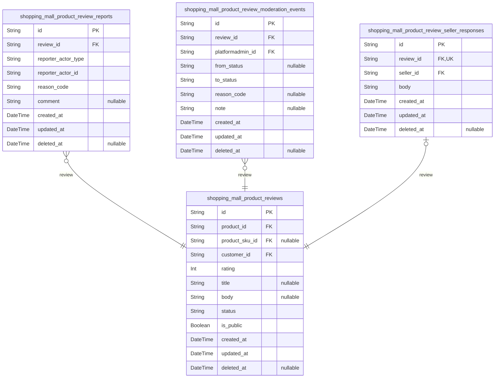

### `shopping_mall_product_reviews`

Customer-authored product reviews and star ratings.

Stores individual reviews created by customers for products they have
purchased. Each review contains a numeric rating, an optional textual
comment, and state indicating whether it is visible in public listings.

The table links each review to a specific product and optionally to a
concrete SKU variant when reviews are configured at SKU level. It also
links to the customer who authored the review and supports standard
temporal fields for audit and soft deletion.

Moderation state is stored here for fast filtering, while detailed
moderation history is kept in {@link
shopping_mall_product_review_moderation_events}. Aggregated rating
statistics per product are stored separately in {@link
shopping_mall_product_rating_aggregates}.

Properties as follows:

- `id`: Primary key for the product review record.
- `product_id`
  > Identifier of the product being reviewed. References the catalog product
  > entity. [shopping_mall_products.id](#shopping_mall_products).
- `product_sku_id`
  > Optional identifier of the specific SKU variant being reviewed when
  > SKU-level reviews are enabled. [shopping_mall_product_skus.id](#shopping_mall_product_skus).
- `customer_id`: Customer who authored the review. [shopping_mall_customer.id](#shopping_mall_customer).
- `rating`
  > Star rating value provided by the customer. Uses a fixed integer scale
  > such as 15 inclusive, where the lowest value indicates the worst
  > experience and the highest value the best.
- `title`
  > Optional short summary or headline for the review. Shown in listing views
  > where a brief title is helpful.
- `body`
  > Optional free-form text comment describing the customer experience,
  > subject to length limits and content policies.
- `status`
  > Moderation and lifecycle status of the review. Typical values include
  > pending, approved, hidden, rejected, and removed, and determine public
  > visibility and eligibility for aggregation.
- `is_public`
  > Indicates whether the review is currently visible in public product
  > review lists. Derived from status but stored for efficient filtering.
- `created_at`: Timestamp when the review record was first created.
- `updated_at`
  > Timestamp when the review record was last updated, including moderation
  > changes or customer edits.
- `deleted_at`
  > Optional timestamp indicating when the review was soft-deleted. Null when
  > the review is active.

### `shopping_mall_product_review_reports`

Reports and abuse flags submitted against product reviews.

Stores complaints created by customers, sellers, or administrators about
specific product reviews. Each report records who reported the review,
why they reported it, and when the report was created.

Reports feed moderation workflows and help surface reviews that may
contain spam, abusive language, policy violations, or other issues.
Detailed moderation decisions based on these reports are captured in
[shopping_mall_product_review_moderation_events](#shopping_mall_product_review_moderation_events).

Properties as follows:

- `id`: Primary key for the review report record.
- `review_id`
  > Identifier of the review being reported. {@link
  > shopping_mall_product_reviews.id}.
- `reporter_actor_type`
  > Type of actor who submitted the report. Typical values include customer,
  > seller, and platformAdmin and determine how reporter_actor_id is
  > interpreted at the application level.
- `reporter_actor_id`
  > Identifier of the actor who submitted the report. Interpreted together
  > with reporter_actor_type to reference customer, seller, or platform admin
  > identities in their own tables.
- `reason_code`
  > Structured reason code categorizing why the review was reported, such as
  > spam, inappropriate_language, privacy_violation, off_topic, or
  > conflict_of_interest.
- `comment`
  > Optional free-form comment from the reporter providing additional context
  > or explanation for the report.
- `created_at`: Timestamp when the report was created.
- `updated_at`
  > Timestamp when the report record was last updated, for example when
  > changing reason_code or comment.
- `deleted_at`
  > Optional timestamp indicating when the report was soft-deleted or
  > logically cleared. Null while the report is active.

### `shopping_mall_product_review_moderation_events`

Historical moderation actions applied to product reviews.

Captures an append-only timeline of moderation decisions taken for each
review, such as approving, hiding, rejecting, or removing content. Each
event links to the target review and the platform administrator who
performed the action.

This table provides an immutable audit trail for compliance and dispute
resolution, complementing the current status fields stored on {@link
shopping_mall_product_reviews}. It supports queries over moderation
history by review, by admin actor, or by event type.

Properties as follows:

- `id`: Primary key for the moderation event record.
- `review_id`
  > Identifier of the review to which this moderation decision applies.
  > [shopping_mall_product_reviews.id](#shopping_mall_product_reviews).
- `platformadmin_id`
  > Platform administrator who performed the moderation action. {@link
  > shopping_mall_platformadmin.id}.
- `from_status`
  > Previous moderation status of the review before this event was applied.
  > Null for the initial moderation event when there is no prior status.
- `to_status`
  > New moderation status of the review after this event, such as approved,
  > hidden, rejected, or removed.
- `reason_code`
  > Optional structured reason code describing why this moderation action was
  > taken, for example policy_violation, abuse, spam, or legal_request.
- `note`
  > Optional free-form note provided by the moderator with additional context
  > or justification for the decision.
- `created_at`: Timestamp when the moderation event was recorded.
- `updated_at`
  > Timestamp when the moderation event record was last updated, usually
  > matching created_at in append-only usage.
- `deleted_at`
  > Optional timestamp indicating when the moderation event was logically
  > removed from active views. Null under normal append-only usage.

### `shopping_mall_product_review_seller_responses`

Seller-authored responses to customer product reviews.

Stores optional replies written by sellers in response to customer
reviews of their products. Each response is associated with exactly one
review and one seller and is constrained so that at most one response
exists per review.

Seller responses allow merchants to address feedback publicly while
keeping the original review content unchanged. Visibility and moderation
of responses can be coordinated with the parent review and overall
moderation policies.

Properties as follows:

- `id`: Primary key for the seller response record.
- `review_id`
  > Identifier of the review this seller response is attached to. Enforced as
  > 1:1 so each review has at most one response. {@link
  > shopping_mall_product_reviews.id}.
- `seller_id`: Seller who authored the response. [shopping_mall_seller.id](#shopping_mall_seller).
- `body`
  > Text content of the seller response visible to customers, subject to
  > moderation and content policies.
- `created_at`: Timestamp when the seller response was created.
- `updated_at`: Timestamp when the seller response was last updated.
- `deleted_at`
  > Optional timestamp indicating when the seller response was soft-deleted
  > or hidden from public view.

## AdminOps

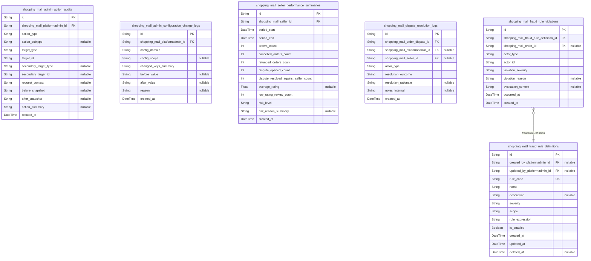

### `shopping_mall_admin_action_audits`

Audit records for administrative actions performed by platform
administrators.

Each row represents a single state-changing or sensitive read operation
triggered by a platformAdmin across any domain (users, sellers, products,
orders, payments, reviews, configuration, etc.).

The model links to the acting [shopping_mall_platformadmin](#shopping_mall_platformadmin) and
captures generic target information via target_type and target_id fields,
so it can represent actions on many different entity types without
polymorphic foreign keys.

These records are append-only and are used for compliance audits,
forensic investigations, and internal reporting about admin behavior.

Properties as follows:

- `id`: Primary key for the admin action audit record.
- `shopping_mall_platformadmin_id`
  > Identifier of the platform administrator who performed the action. {@link
  > shopping_mall_platformadmin.id}.
- `action_type`
  > High-level category of the admin action (for example, user_status_change,
  > product_visibility_update, refund_approval, seller_suspension).
- `action_subtype`
  > Optional more granular subtype or reason code for the action, used to
  > distinguish specific flows within the action_type.
- `target_type`
  > Business type of the primary target resource of this action (for example,
  > customer, seller, product, order, payment, review, configuration).
- `target_id`
  > Opaque identifier string of the primary target resource. Stores the ID
  > value from the target table as text to avoid polymorphic foreign keys.
- `secondary_target_type`
  > Optional business type of a secondary target resource affected by the
  > action, when applicable.
- `secondary_target_id`
  > Optional opaque identifier string of a secondary target resource affected
  > by the action.
- `request_context`
  > Optional serialized context about the request, such as IP address, user
  > agent, or admin dashboard module information, stored as text or JSON
  > string.
- `before_snapshot`
  > Optional snapshot of key fields from before the action, stored as a
  > serialized JSON string for audit comparison.
- `after_snapshot`
  > Optional snapshot of key fields from after the action, stored as a
  > serialized JSON string for audit comparison.
- `action_summary`: Human-readable summary of the action, suitable for audit UI and reports.
- `created_at`: Timestamp when this admin action was recorded.

### `shopping_mall_admin_configuration_change_logs`

Audit log of configuration changes made by platform administrators.

Each record represents a single logical change to platform-wide
configuration or policy settings, such as cancellation windows, refund
policies, review rules, or risk thresholds.

The log links to the acting [shopping_mall_platformadmin](#shopping_mall_platformadmin) and
stores generic information about which configuration domain was changed,
what keys were affected, and serialized before/after values. This table
is append-only and used for compliance and debugging of
configuration-related behavior.

Properties as follows:

- `id`: Primary key for the configuration change log record.
- `shopping_mall_platformadmin_id`
  > Identifier of the platform administrator who changed the configuration.
  > [shopping_mall_platformadmin.id](#shopping_mall_platformadmin).
- `config_domain`
  > Logical domain of the configuration that was changed (for example,
  > cancellation_policy, refund_policy, review_policy, inventory_settings,
  > risk_settings).
- `config_scope`
  > Optional scope information for the configuration change (for example,
  > region code, category, or specific seller scope).
- `changed_keys_summary`
  > Short textual summary of which configuration keys or sections were
  > modified, used for quick scanning and search.
- `before_value`
  > Serialized representation of the configuration values before the change,
  > typically stored as a JSON string.
- `after_value`
  > Serialized representation of the configuration values after the change,
  > typically stored as a JSON string.
- `reason`
  > Optional human-readable justification or comment entered by the admin
  > explaining why the configuration was changed.
- `created_at`: Timestamp when this configuration change was recorded.

### `shopping_mall_seller_performance_summaries`

Periodic performance summaries and risk indicators for individual sellers.

Each row aggregates metrics for a specific [shopping_mall_seller](#shopping_mall_seller)
over a defined time period (for example, daily, weekly, or monthly).
Metrics can include order volume, cancellation rates, refund rates,
dispute counts, review distributions, and other KPIs.

These records are used by platformAdmin to monitor seller health,
identify risk patterns, and feed rule-based or manual interventions. They
are append-only snapshots rather than live counters.

Properties as follows:

- `id`: Primary key for the seller performance summary record.
- `shopping_mall_seller_id`
  > Identifier of the seller whose performance is summarized. {@link
  > shopping_mall_seller.id}.
- `period_start`: Start timestamp of the period this summary covers (inclusive).
- `period_end`
  > End timestamp of the period this summary covers (exclusive or inclusive,
  > according to reporting conventions).
- `orders_count`
  > Total count of orders that contained this seller’s items during the
  > period.
- `cancelled_orders_count`
  > Count of orders or order segments cancelled for this seller during the
  > period.
- `refunded_orders_count`
  > Count of orders or order segments for this seller that had refunds
  > processed during the period.
- `dispute_opened_count`: Number of disputes opened against this seller’s orders during the period.
- `dispute_resolved_against_seller_count`
  > Number of disputes resolved against the seller (favoring the customer)
  > during the period.
- `average_rating`
  > Average product review rating for this seller’s products during the
  > period, based on contributing reviews. Nullable if no reviews exist.
- `low_rating_review_count`
  > Count of low-rated reviews (for example, 1–2 stars) for this seller’s
  > products during the period.
- `risk_level`
  > Categorical risk level derived from metrics (for example, low, medium,
  > high, critical).
- `risk_reason_summary`
  > Optional human-readable summary explaining why the seller was assigned
  > the given risk_level for this period.
- `created_at`: Timestamp when this performance summary snapshot was generated.

### `shopping_mall_dispute_resolution_logs`

Resolution history for order disputes handled by sellers, platform
administrators, or automated systems.

Each record represents a discrete resolution decision or state change for
a particular [shopping_mall_order_disputes](#shopping_mall_order_disputes) instance. It captures
who made the decision (seller or platform admin through foreign keys, or
an automated system via actor_type), what outcome was chosen, and the
rationale.

The actor_type field describes the logical actor category (for example,
seller, platform_admin, automated_rule). When actor_type is seller, the
shopping_mall_seller_id field MUST be populated. When actor_type is
platform_admin, the shopping_mall_platformadmin_id field MUST be
populated. For automated or system-driven resolutions, both foreign keys
may be null.

These logs provide a complete audit trail for dispute handling and
support compliance reviews, conflict-of-interest checks, and quality
monitoring of dispute resolutions. Indexes are optimized for querying
timelines per dispute, filtering by outcome, and looking up records by
the concrete human actor when present.

Properties as follows:

- `id`: Primary key for the dispute resolution log record.
- `shopping_mall_order_dispute_id`
  > Identifier of the order dispute to which this resolution event belongs.
  > [shopping_mall_order_disputes.id](#shopping_mall_order_disputes).
- `shopping_mall_platformadmin_id`
  > Identifier of the platform administrator who made or approved this
  > resolution decision, when the actor_type is platform_admin. {@link
  > shopping_mall_platformadmin.id}.
- `shopping_mall_seller_id`
  > Identifier of the seller who made this resolution decision when the
  > actor_type is seller. [shopping_mall_seller.id](#shopping_mall_seller).
- `actor_type`
  > Type of actor that performed this resolution action (for example, seller,
  > platform_admin, automated_rule). Determines which concrete actor foreign
  > key must be present when the actor is a human.
- `resolution_outcome`
  > Outcome code of the resolution step (for example, refund_approved_full,
  > refund_approved_partial, refund_rejected, replacement_issued,
  > goodwill_credit).
- `resolution_rationale`
  > Detailed human-readable explanation of why this resolution outcome was
  > chosen.
- `notes_internal`
  > Optional internal notes for platform use only, not exposed to customers
  > or sellers.
- `created_at`: Timestamp when this resolution event was recorded.

### `shopping_mall_fraud_rule_definitions`

Definitions of fraud and risk rules evaluated against orders, payments,
accounts, or other events.

Each record describes a single business rule that can detect suspicious
behavior or policy violations. Rules are configured and maintained by
platformAdmin and may be evaluated by background services or at runtime.

The table stores metadata such as rule code, severity, scope, and a
serialized rule_expression that external engines can interpret. It also
tracks enabled state and lifecycle timestamps.

Properties as follows:

- `id`: Primary key for the fraud or risk rule definition.
- `created_by_platformadmin_id`
  > Identifier of the platform administrator who originally created this rule
  > definition. [shopping_mall_platformadmin.id](#shopping_mall_platformadmin).
- `updated_by_platformadmin_id`
  > Identifier of the platform administrator who last updated this rule
  > definition. [shopping_mall_platformadmin.id](#shopping_mall_platformadmin).
- `rule_code`
  > Stable business identifier for the rule, unique across all
  > fraud_rule_definitions (for example, HIGH_REFUND_RATE,
  > MULTIPLE_CARDS_SAME_IP).
- `name`: Human-readable name for this rule, used in admin tools and reports.
- `description`
  > Detailed description of the rule’s purpose, detection logic, and expected
  > handling guidance for admins.
- `severity`
  > Configured severity level of this rule (for example, low, medium, high,
  > critical) used for prioritization and alerting.
- `scope`
  > Scope of entities the rule applies to (for example, order, payment,
  > customer_account, seller_account, session_activity).
- `rule_expression`
  > Machine-interpretable expression or configuration payload that encodes
  > the rule logic, stored as a JSON or DSL string. The evaluation engine
  > interprets this expression.
- `is_enabled`
  > Flag indicating whether this rule is currently active and should be
  > evaluated by the fraud engine.
- `created_at`: Timestamp when this rule definition was created.
- `updated_at`: Timestamp when this rule definition was last updated.
- `deleted_at`
  > Soft deletion timestamp when this rule was logically removed from use.
  > Null when the rule is still part of history or active configuration.

### `shopping_mall_fraud_rule_violations`

Recorded violations or hits of configured fraud and risk rules.

Each row represents a single evaluation event where a {@link
shopping_mall_fraud_rule_definitions} rule triggered for a particular
actor or transaction. It captures the rule, the entity context
(actor_type and actor_id), associated order if any, and descriptive
information about why the rule fired.

These records are used for risk analysis dashboards, manual review
queues, escalation workflows, and to correlate fraud patterns across
customers, sellers, orders, and payment instruments.

Properties as follows:

- `id`: Primary key for the fraud rule violation record.
- `shopping_mall_fraud_rule_definition_id`
  > Identifier of the fraud rule definition that was violated. {@link
  > shopping_mall_fraud_rule_definitions.id}.
- `shopping_mall_order_id`
  > Identifier of the related order when the violation concerns a specific
  > order. [shopping_mall_orders.id](#shopping_mall_orders).
- `actor_type`
  > Type of actor or entity the violation is associated with (for example,
  > customer, seller, platform_admin, session, payment_method).
- `actor_id`
  > Opaque identifier string of the actor or entity the violation is
  > associated with, stored as text to support multiple target types.
- `violation_severity`
  > Severity classification of this particular violation instance (for
  > example, info, warning, critical), which may match or refine the rule’s
  > severity.
- `violation_reason`
  > Detailed human-readable explanation of why this rule fired, often
  > including key metric values or threshold comparisons.
- `evaluation_context`
  > Serialized evaluation payload or context used when the rule was
  > evaluated, stored as JSON or another structured format for later
  > inspection.
- `occurred_at`: Timestamp when the rule evaluation that produced this violation occurred.
- `created_at`: Timestamp when this violation record was stored.

## Logs

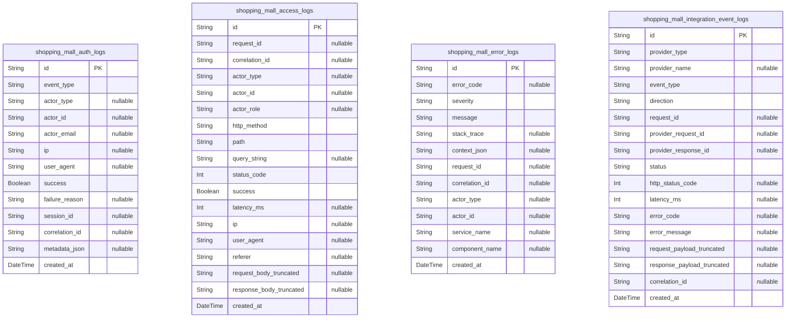

### `shopping_mall_auth_logs`

Authentication-related log entries for login, logout, and token lifecycle
events.

Captures security-relevant information about authentication attempts and
session lifecycle for all actor types (customer, seller, platformAdmin)
as well as guest-to-customer transitions. Each row represents an
immutable point-in-time event, such as a successful login, failed login,
token refresh, or logout.

The table intentionally stores denormalized identifiers (such as email
and actor_role) as observed at the time of the event. Core identity and
session tables from other components may reference these log entries when
performing investigations, but this model does not maintain foreign keys
to them to keep the Logs component decoupled.

Operations and security teams use these logs for incident response, fraud
detection support, and compliance reporting around authentication
behavior.

Properties as follows:

- `id`: Primary key. Unique identifier for this authentication log entry.
- `event_type`
  > High-level type of authentication event. Examples include
  > "login_success", "login_failure", "logout", "token_refresh",
  > "password_reset_request", and "password_reset_success".
- `actor_type`
  > Logical actor type associated with the event, if known. Typical values
  > are "guestUser", "customer", "seller", or "platformAdmin". Null when the
  > actor type cannot be determined (for example, malformed requests).
- `actor_id`
  > Opaque identifier of the actor record at the time of the event, when
  > available. This can refer to a customer, seller, or platform admin record
  > depending on actor_type. Stored as raw UUID without a foreign key to keep
  > this component independent.
- `actor_email`
  > Email address presented or associated with the authentication event.
  > Captured as plain text to allow investigation of repeated failed
  > attempts. May be null for token-only flows or where email is not used.
- `ip`
  > IP address from which the authentication event originated. Useful for
  > security analysis and anomaly detection. May be IPv4 or IPv6 formatted
  > string.
- `user_agent`
  > Raw user agent string supplied by the client, if available. Used for
  > device and browser fingerprinting during security investigations.
- `success`
  > Indicates whether the authentication event is considered successful from
  > the business perspective. For example, true for completed logins and
  > successful token refreshes, false for failed login attempts.
- `failure_reason`
  > Business-level reason for authentication failure, when success is false.
  > Examples include "invalid_credentials", "account_suspended",
  > "password_expired", or "rate_limited". Null for successful events.
- `session_id`
  > Opaque identifier referencing a session record in its own domain, when a
  > session is involved. Stored as UUID without explicit foreign key to avoid
  > cross-component coupling.
- `correlation_id`
  > Correlation identifier that ties this authentication event to a broader
  > request or workflow. Used to trace multi-step interactions across logs.
- `metadata_json`
  > Optional JSON-encoded string carrying additional structured metadata
  > about the event, such as region, risk scores, or MFA method. The schema
  > is intentionally flexible and interpreted by application logic.
- `created_at`
  > Timestamp when this authentication event was recorded. Represents the
  > effective time of the event for analysis purposes.

### `shopping_mall_access_logs`

High-level access log entries for API or web requests handled by the
platform.

Each row describes a single logical request as seen by the backend,
including metadata such as HTTP method, path, status code, latency, actor
context, and client information. These logs are primarily used for
observability, performance monitoring, and security analytics.

The model stores denormalized copies of actor identity attributes and
request metadata without foreign keys to core domain tables. This allows
the Logs component to remain independent while still supporting rich
analysis of traffic and behavior patterns across customers, sellers, and
admins.

Properties as follows:

- `id`: Primary key. Unique identifier for this access log entry.
- `request_id`
  > Application-level identifier for the request, if one was generated. Used
  > to correlate this access log with other technical logs or traces.
- `correlation_id`
  > Correlation identifier linking this request to a broader workflow or user
  > interaction that may span multiple services or events.
- `actor_type`
  > Logical actor type that executed the request when known, such as
  > "guestUser", "customer", "seller", or "platformAdmin". Null when no actor
  > context is associated with the request.
- `actor_id`
  > Opaque identifier of the actor that performed the request, when
  > available. This might correspond to a customer, seller, or admin in the
  > core domain, but no foreign key is enforced here.
- `actor_role`
  > Role or permission profile applied during authorization evaluation for
  > this request. This can be more specific than actor_type, such as an admin
  > role name.
- `http_method`
  > HTTP method of the request as seen by the backend, such as "GET", "POST",
  > "PUT", or "DELETE".
- `path`
  > Normalized request path or route template for the accessed endpoint. Used
  > for grouping and analyzing traffic per API surface.
- `query_string`
  > Raw query string or a normalized representation of query parameters, if
  > captured. Useful for debugging and analytics. May be null if not
  > recorded.
- `status_code`
  > HTTP status code returned to the client for this request, such as 200,
  > 400, or 500.
- `success`
  > Boolean indicator that the business operation completed successfully from
  > the platform perspective. Typically true for 2xx responses, false for 4xx
  > and 5xx, but can be customized by application logic.
- `latency_ms`
  > Total time in milliseconds spent processing this request on the backend,
  > excluding client network latency. Used for performance monitoring and SLO
  > tracking.
- `ip`
  > Client IP address from which the request originated. May be derived from
  > headers such as X-Forwarded-For in proxy setups.
- `user_agent`
  > Raw user agent string associated with the request. Provides insight into
  > client device and browser characteristics.
- `referer`
  > HTTP Referer header value when present, indicating the previous page or
  > origin of the request. Useful for traffic flow analysis.
- `request_body_truncated`
  > Optional truncated representation of the request body, redacted to avoid
  > sensitive information. Intended for debugging problematic calls and is
  > stored as a plain string or JSON snippet.
- `response_body_truncated`
  > Optional truncated representation of the response body, redacted to avoid
  > sensitive information. Useful for troubleshooting and verifying business
  > behavior.
- `created_at`
  > Timestamp when this access log entry was recorded. Typically corresponds
  > to the time when the response was sent to the client.

### `shopping_mall_error_logs`

Application error and exception logs capturing failures in business flows
and technical operations.

Each row represents a single error event, such as an unhandled exception,
failed business rule evaluation, or external dependency failure that
surfaces as an error in the backend. These logs are essential for
incident analysis, debugging, and reliability improvements.

The model includes context fields like error_code, severity, message,
stack summary, and a generic context JSON payload. It also records
correlation and request identifiers to allow cross-referencing with
access and integration logs. No foreign keys are used so that the Logs
component remains independent of specific domain schemas.

Properties as follows:

- `id`: Primary key. Unique identifier for this error log entry.
- `error_code`
  > Application-specific error code or symbolic identifier for this error
  > condition. Examples include domain-specific codes such as
  > "ORDER_VALIDATION_FAILED" or "PAYMENT_PROVIDER_TIMEOUT".
- `severity`
  > Severity level of the error as determined by the application, such as
  > "info", "warning", "error", or "critical". Used to prioritize incident
  > response.
- `message`
  > Human-readable error message summarizing the failure. May be redacted to
  > avoid exposing sensitive information while still helping debugging.
- `stack_trace`
  > Captured stack trace or stack summary for the error, if available. May be
  > truncated or sanitized to control volume and protect sensitive data.
- `context_json`
  > JSON-encoded string containing structured context about the error, such
  > as input identifiers, business parameters, or state snapshots. The schema
  > is flexible and controlled by application code.
- `request_id`
  > Identifier of the request during which the error occurred, when known.
  > Used for correlating with access logs and higher-level traces.
- `correlation_id`
  > Correlation identifier tying this error to a broader workflow, saga, or
  > asynchronous process across services.
- `actor_type`
  > Logical actor type affected by the error, such as "guestUser",
  > "customer", "seller", or "platformAdmin". May be null for purely
  > background or system-level errors.
- `actor_id`
  > Opaque identifier of the actor related to this error, when applicable.
  > Stored as UUID without enforcing foreign key constraints.
- `service_name`
  > Logical name of the service or bounded context that produced the error.
  > Useful in multi-service or modular architectures.
- `component_name`
  > Name of the component, module, or subsystem within the service where the
  > error originated, such as a domain area or technical layer.
- `created_at`
  > Timestamp when this error event was recorded. Represents the time at
  > which the failure was observed by the backend.

### `shopping_mall_integration_event_logs`

Logs for interactions with external integration partners and
infrastructure services.

Each row captures a single outbound or inbound integration event
involving external payment providers, email services, shipping carriers,
fraud engines, or other third-party systems. Events include requests,
callbacks, notifications, and asynchronous messages.

The model records provider type, provider name, event type, direction
(outbound or inbound), technical and business statuses, timing
information, and optional payload snippets. Correlation and request IDs
allow cross-referencing with other logs. No foreign keys are maintained
so that logs remain independent and can be written even when core
transactional operations fail.

Properties as follows:

- `id`: Primary key. Unique identifier for this integration event log entry.
- `provider_type`
  > High-level category of external provider involved in the integration
  > event, such as "payment", "email", "shipping", "fraud", or "analytics".
- `provider_name`
  > Specific provider name or identifier, such as a payment gateway or
  > carrier code. Used for per-provider reliability and SLA analysis.
- `event_type`
  > Business-level type of integration event, such as
  > "authorization_request", "capture", "refund", "tracking_update", or
  > "webhook_notification".
- `direction`
  > Indicates whether the event is outbound from shoppingMall to the provider
  > (for example, API call) or inbound from the provider to shoppingMall (for
  > example, webhook). Typical values include "outbound" and "inbound".
- `request_id`
  > Identifier associated with the request within the platform, when the
  > integration call is part of a larger flow. Enables correlation with
  > access and error logs.
- `provider_request_id`
  > Identifier assigned by the external provider to the request or message,
  > if available. Useful for provider-side support and reconciliation.
- `provider_response_id`
  > Identifier for the provider response or transaction, when distinct from
  > provider_request_id. Often used in payment and shipping APIs.
- `status`
  > Overall status of the integration event from the platform perspective,
  > such as "success", "failure", or "timeout".
- `http_status_code`
  > HTTP status code returned by the provider for outbound calls, where
  > applicable. Null for non-HTTP integrations or inbound-only events without
  > a direct code.
- `latency_ms`
  > Elapsed time in milliseconds between sending a request and receiving a
  > response from the external provider, for outbound events. May be null for
  > inbound-only notifications or where not measured.
- `error_code`
  > Provider-specific or platform-specific error code when status indicates
  > failure. Facilitates troubleshooting and mapping of recurring integration
  > issues.
- `error_message`
  > Human-readable error message or description associated with a failed
  > integration event, often derived from the provider response or internal
  > handling.
- `request_payload_truncated`
  > Optional truncated and sanitized representation of the request payload
  > sent to the provider. Captured as a string or JSON snippet for debugging
  > while avoiding sensitive content where required.
- `response_payload_truncated`
  > Optional truncated and sanitized representation of the provider response
  > payload. Used for debugging integration behavior without storing full raw
  > messages.
- `correlation_id`
  > Correlation identifier that links this integration event to other
  > application-level operations, such as orders or payments, across
  > different log tables.
- `created_at`
  > Timestamp when this integration event log entry was recorded. Represents
  > the time the platform processed the event.

## default

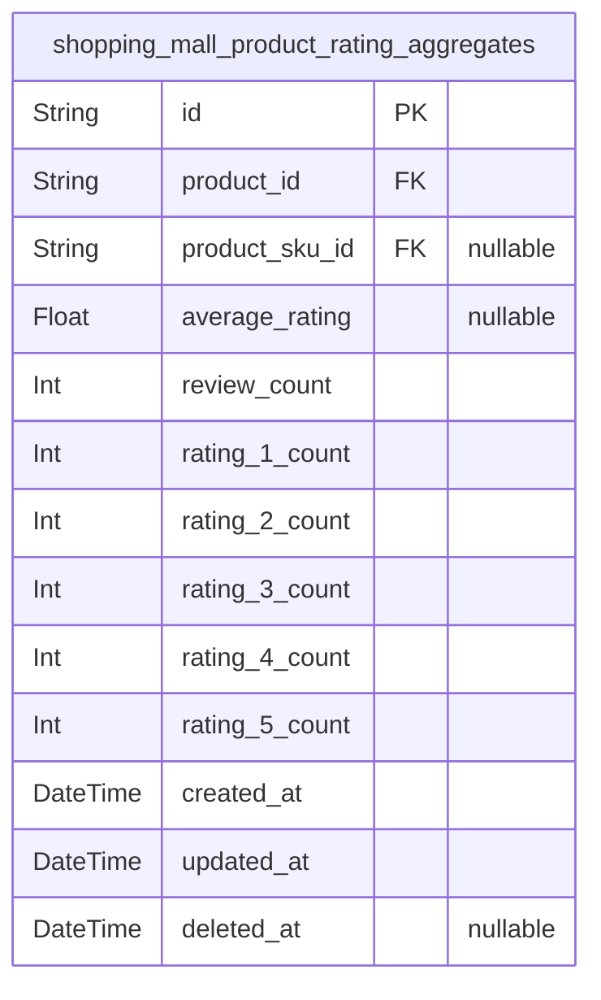

### `shopping_mall_product_rating_aggregates`

Materialized aggregate ratings and review counts per product and optional
SKU.

Caches denormalized statistics derived from {@link
shopping_mall_product_reviews}, such as average rating and total count of
contributing reviews. This table is optimized for fast catalog and
product-detail queries that require rating summaries without scanning all
individual reviews.

Entries are typically maintained by background jobs or transactional
update logic whenever reviews are created, edited, or re-moderated. It
supports both product-level and SKU-level aggregates when SKU-specific
reviews are enabled.

Properties as follows:

- `id`: Primary key for the rating aggregate record.
- `product_id`
  > Identifier of the product for which rating aggregates are computed.
  > [shopping_mall_products.id](#shopping_mall_products).
- `product_sku_id`
  > Optional identifier of the SKU variant when aggregates are calculated at
  > SKU level. Null for product-level aggregates. {@link
  > shopping_mall_product_skus.id}.
- `average_rating`
  > Average rating value for this product or SKU based on approved reviews.
  > Null when no contributing reviews exist.
- `review_count`
  > Total number of reviews contributing to this aggregate for the product or
  > SKU, typically counting only approved and public reviews.
- `rating_1_count`
  > Number of contributing reviews with the lowest rating value (for example,
  > 1 star) for this product or SKU.
- `rating_2_count`
  > Number of contributing reviews with rating value 2 for this product or
  > SKU when using a 15 scale.
- `rating_3_count`
  > Number of contributing reviews with rating value 3 for this product or
  > SKU when using a 15 scale.
- `rating_4_count`
  > Number of contributing reviews with rating value 4 for this product or
  > SKU when using a 15 scale.
- `rating_5_count`
  > Number of contributing reviews with the highest rating value (for
  > example, 5 stars) for this product or SKU.
- `created_at`: Timestamp when the aggregate record was first created.
- `updated_at`: Timestamp when the aggregate record was last recalculated or updated.
- `deleted_at`
  > Optional timestamp indicating when this aggregate was logically removed,
  > for example when the product is deprecated. Null while active.
