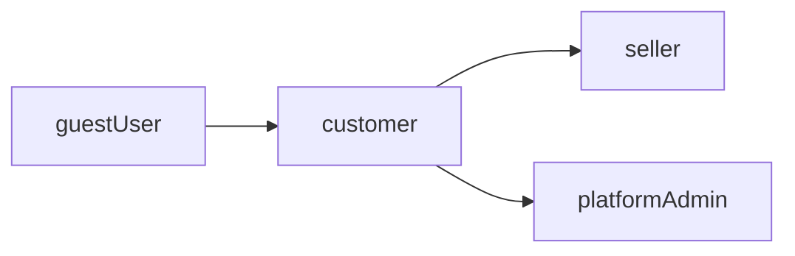
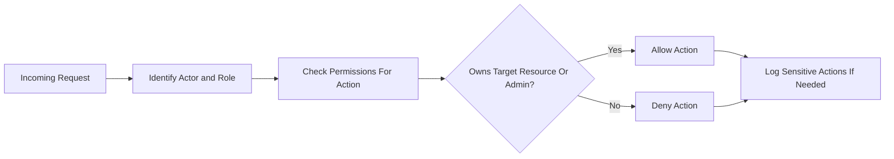

# User Actors and Permissions Requirements for shoppingMall Backend

## 1. Introduction

This document defines the user actors and permissions model for the shoppingMall e-commerce backend. It describes who can perform which business actions, under which conditions, and with which limitations, in a way that backend developers can implement directly.

The focus is exclusively on business-level requirements and behaviors:
- No API endpoint shapes.
- No database schema design.
- No infrastructure or technology stack choices.

All functional requirements are expressed in natural language using EARS (Easy Approach to Requirements Syntax), keeping the EARS keywords in English and all other wording in en-US.

## 2. Actor List and Descriptions

### 2.1 Actor Summary

The shoppingMall platform uses the following actors:

- guestUser (guest)
- customer (authenticated member)
- seller (authenticated member with merchant privileges)
- platformAdmin (administrative operator)

### 2.2 guestUser

A guestUser is an unauthenticated visitor who can browse the public catalog, search for products, and read product information and reviews without logging in.

Key characteristics:
- Has no persistent identity in the system.
- May start a temporary shopping cart before registration or login.
- Cannot perform any action that requires a persistent account (orders, payments, reviews, seller operations, admin operations).

### 2.3 customer

A customer is an authenticated end user who purchases products from one or more sellers on the platform.

Key characteristics:
- Has a persistent account with authentication credentials.
- Manages one or more delivery addresses.
- Manages personal carts and wishlists.
- Places orders and makes payments.
- Tracks order status.
- Initiates post-order actions such as cancellation requests, refund requests, and writing reviews.

### 2.4 seller

A seller is a merchant who uses the platform to list products, manage inventory, and fulfill orders containing their products.

Key characteristics:
- Has a persistent account associated with one seller entity (store or brand) within the platform.
- Manages own product catalog, SKUs, and prices.
- Manages stock and inventory per SKU.
- Views and processes orders that contain own products.
- Updates fulfillment and shipping statuses for own order lines.

### 2.5 platformAdmin

A platformAdmin is an operator employed by the platform owner to manage the entire system.

Key characteristics:
- Has full visibility of users, sellers, products, orders, and reviews.
- Performs moderation, dispute resolution, and high-level configuration tasks.
- Has the ability to intervene in critical flows such as order corrections, refunds, and seller suspension, while maintaining auditability.

### 2.6 User Lifecycle Assumptions

- THE shoppingMall backend SHALL support the lifecycle of guestUser transitioning to customer through registration.
- WHERE a seller applies and is approved by platformAdmin, THE shoppingMall backend SHALL associate the seller role with a specific seller entity.
- THE shoppingMall backend SHALL allow platformAdmin accounts to be created and maintained only by existing platformAdmin actors or through controlled internal processes defined by business policy.

## 3. Permission Hierarchy

### 3.1 Hierarchy Overview

The roles follow a general hierarchy:

- guestUser: lowest privileges, read-only access to public information.
- customer: member with consumer privileges, extends guestUser capabilities with account-bound features.
- seller: member with merchant privileges, extends customer account concept with store-level management; seller permissions apply only to seller-owned resources.
- platformAdmin: highest privileges, can view and manage all entities, with specific business constraints and auditing.

### 3.2 Inheritance Rules

- THE shoppingMall backend authorization SHALL treat customer and seller as authenticated member roles distinct from guestUser.
- WHERE an authenticated user is a customer, THE shoppingMall backend authorization SHALL grant all guestUser read-only capabilities plus customer-specific capabilities.
- WHERE an authenticated user is a seller, THE shoppingMall backend authorization SHALL grant all customer capabilities plus seller-specific capabilities limited to seller-owned resources.
- WHERE an authenticated user is a platformAdmin, THE shoppingMall backend authorization SHALL allow admin capabilities that supersede or override seller and customer actions within the constraints defined in this document.

### 3.3 Access Boundaries

- THE shoppingMall backend authorization SHALL prevent guestUser from performing any action that creates, modifies, or deletes persistent account-bound data.
- THE shoppingMall backend authorization SHALL prevent customer from performing seller-specific operations on resources they do not own.
- THE shoppingMall backend authorization SHALL prevent seller from performing platform-level operations such as managing other sellers, changing system-wide settings, or resolving disputes outside their own orders.
- THE shoppingMall backend authorization SHALL ensure platformAdmin can access all resources but SHALL log sensitive administrative actions for auditing.

## 4. Per-Actor Capabilities

### 4.1 guestUser Capabilities

#### 4.1.1 Catalog Browsing and Search

- THE shoppingMall backend authorization SHALL allow guestUser to view publicly visible products, categories, and product details.
- THE shoppingMall backend authorization SHALL allow guestUser to search products by keywords, categories, and filter criteria that are marked as public.

#### 4.1.2 Reviews Visibility

- THE shoppingMall backend authorization SHALL allow guestUser to view approved product reviews and ratings.

#### 4.1.3 Temporary Cart

- WHERE a guestUser creates a temporary cart, THE shoppingMall backend authorization SHALL allow adding, updating, and removing product items from that temporary cart, subject to stock and policy limits.
- IF a guestUser session ends or expires, THEN THE shoppingMall backend authorization SHALL permit the temporary cart content to be discarded according to business-configured retention rules.

### 4.2 customer Capabilities

#### 4.2.1 Registration and Profile

- WHEN a new user registers successfully, THE shoppingMall backend authorization SHALL grant that user the customer role.
- THE shoppingMall backend authorization SHALL allow customer to view and update own profile data, excluding fields explicitly marked as immutable by business policy.

#### 4.2.2 Address Management

- THE shoppingMall backend authorization SHALL allow customer to create, update, and delete own delivery addresses.
- IF a customer attempts to modify another user’s address, THEN THE shoppingMall backend authorization SHALL deny the operation.

#### 4.2.3 Cart Management

- THE shoppingMall backend authorization SHALL allow customer to maintain a persistent cart linked to own account.
- WHEN a customer adds an item to own cart, THE shoppingMall backend authorization SHALL validate that the actor is the owner of the cart.
- WHEN a guestUser logs in or registers and becomes customer, THE shoppingMall backend authorization SHALL allow merging temporary cart items into the customer’s persistent cart according to cart business rules.

#### 4.2.4 Wishlist Management

- THE shoppingMall backend authorization SHALL allow customer to create and manage own wishlists.
- THE shoppingMall backend authorization SHALL allow customer to add and remove products or SKUs from own wishlists.

#### 4.2.5 Order Placement and Access

- WHEN a customer proceeds to checkout with a valid cart, THE shoppingMall backend authorization SHALL verify that the cart belongs to that customer before allowing order creation.
- THE shoppingMall backend authorization SHALL allow customer to view detailed information of own orders, including line items, prices, and statuses.

#### 4.2.6 Payment Initiation

- WHEN a customer attempts to initiate payment for an order, THE shoppingMall backend authorization SHALL verify that the order belongs to that customer and that the order is in a state that allows payment.

#### 4.2.7 Order Tracking

- THE shoppingMall backend authorization SHALL allow customer to view order and shipment statuses, and tracking information, for own orders only.

#### 4.2.8 Cancellation and Refund Requests

- WHEN an order is in a business-defined cancelable state, THE shoppingMall backend authorization SHALL allow the owning customer to submit cancellation requests for that order or its eligible items.
- WHEN a delivered order is within the business-defined refund window, THE shoppingMall backend authorization SHALL allow the owning customer to submit refund or return requests for eligible items.

#### 4.2.9 Reviews and Ratings

- WHEN a customer has at least one completed purchase of a product, THE shoppingMall backend authorization SHALL allow that customer to create a review and rating for that product, subject to the review eligibility rules.
- THE shoppingMall backend authorization SHALL allow a customer to edit or delete own reviews while the review is in an editable state and not locked by moderation.

### 4.3 seller Capabilities

#### 4.3.1 Seller Profile and Store Management

- WHERE a user has seller role, THE shoppingMall backend authorization SHALL allow that user to manage seller-specific profile information such as store name and contact details.

#### 4.3.2 Product and SKU Management

- THE shoppingMall backend authorization SHALL allow seller to create new products under own seller entity.
- THE shoppingMall backend authorization SHALL allow seller to create and manage SKUs for own products.
- THE shoppingMall backend authorization SHALL allow seller to update and deactivate only own products and SKUs.

#### 4.3.3 Inventory Management

- THE shoppingMall backend authorization SHALL allow seller to set and update inventory quantities for SKUs that belong to that seller.

#### 4.3.4 Order Access and Fulfillment

- THE shoppingMall backend authorization SHALL allow seller to view order lines that contain SKUs owned by that seller, including necessary customer shipping information for fulfillment, within privacy constraints.
- WHEN a seller updates shipment status or tracking information for an order line, THE shoppingMall backend authorization SHALL verify that the line belongs to that seller before applying the change.

#### 4.3.5 After-Sales Interactions

- WHERE a customer requests cancellation or refund for items belonging to a seller, THE shoppingMall backend authorization SHALL allow that seller to access and respond to those requests for own items, subject to platform rules and admin oversight.

### 4.4 platformAdmin Capabilities

#### 4.4.1 User and Seller Management

- THE shoppingMall backend authorization SHALL allow platformAdmin to view customer and seller account information necessary for operations.
- THE shoppingMall backend authorization SHALL allow platformAdmin to change user and seller statuses (for example, active, suspended) in line with admin business rules.

#### 4.4.2 Catalog and Content Moderation

- THE shoppingMall backend authorization SHALL allow platformAdmin to view and moderate all products, categories, and reviews.
- WHEN platformAdmin flags content as violating policy, THE shoppingMall backend authorization SHALL allow corresponding visibility changes such as hiding or removing content.

#### 4.4.3 Orders, Payments, and Refunds Oversight

- THE shoppingMall backend authorization SHALL allow platformAdmin to view all orders, payments, cancellations, and refunds across the platform.
- WHEN platformAdmin needs to intervene in a dispute or exceptional case, THE shoppingMall backend authorization SHALL allow state changes such as forcing refunds or adjusting order status, subject to audit rules.

#### 4.4.4 Configuration and Reporting

- WHERE certain business policies are configurable, THE shoppingMall backend authorization SHALL allow platformAdmin to manage those settings (for example, cancellation windows, refund limits) within allowed ranges.
- THE shoppingMall backend authorization SHALL allow platformAdmin to access platform-wide reports while respecting privacy constraints.

### 4.5 Cross-Actor Shared Capabilities

- THE shoppingMall backend authorization SHALL allow all authenticated actors (customer, seller, platformAdmin) to change their own authentication credentials through authorized flows.
- THE shoppingMall backend authorization SHALL allow authenticated actors to view own security-related activity logs where required by compliance policies.

## 5. Per-Actor Restrictions

### 5.1 guestUser Restrictions

- IF a guestUser attempts to access any account-specific resource (such as profile, addresses, orders, or wishlists), THEN THE shoppingMall backend authorization SHALL deny access and SHALL require authentication.
- IF a guestUser attempts to place an order or initiate payment, THEN THE shoppingMall backend authorization SHALL prevent order creation until the user becomes an authenticated customer.
- IF a guestUser attempts to create a review or rating, THEN THE shoppingMall backend authorization SHALL deny the operation.

### 5.2 customer Restrictions

- IF a customer attempts to view or modify another customer’s profile, addresses, cart, wishlist, or orders, THEN THE shoppingMall backend authorization SHALL deny access.
- IF a customer attempts to perform seller-specific actions such as creating products, managing inventory, or updating shipping status, THEN THE shoppingMall backend authorization SHALL deny the operation.
- IF a customer attempts to create a review for a product they have never purchased, THEN THE shoppingMall backend authorization SHALL block the review creation.

### 5.3 seller Restrictions

- IF a seller attempts to modify products, SKUs, or inventory that belong to another seller, THEN THE shoppingMall backend authorization SHALL deny the update.
- IF a seller attempts to view orders that do not contain any of that seller’s SKUs, THEN THE shoppingMall backend authorization SHALL deny access.
- IF a seller attempts to modify platform-level settings or user roles, THEN THE shoppingMall backend authorization SHALL deny the operation.

### 5.4 platformAdmin Restrictions

- WHERE business policy defines restricted administrative capabilities (such as irreversible data deletion), THE shoppingMall backend authorization SHALL limit these operations to designated high-privilege admin roles and shall require additional safeguards such as explicit confirmation.
- IF a platformAdmin attempts to bypass audit requirements for sensitive actions by using unsupported paths, THEN THE shoppingMall backend authorization SHALL prevent the action or SHALL still ensure appropriate audit logging is recorded.

### 5.5 Separation of Duties

- WHERE a user holds both customer and seller roles, THE shoppingMall backend authorization SHALL enforce owner-based rules so that resources tied to the seller entity remain isolated from resources tied to the customer identity, except where explicitly allowed (for example, the same person buying their own products as a customer).
- WHERE a platformAdmin is also a customer or seller, THE shoppingMall backend authorization SHALL distinguish between their administrative actions and personal customer or seller actions and SHALL log these roles clearly in audit trails.

## 6. Permission Matrix by Feature

### 6.1 Feature Permission Table

| Feature / Action                                     | guestUser | customer | seller | platformAdmin |
|------------------------------------------------------|-----------|----------|--------|---------------|
| Browse products and categories                       | ✅        | ✅       | ✅     | ✅            |
| Search products                                      | ✅        | ✅       | ✅     | ✅            |
| View reviews and ratings                             | ✅        | ✅       | ✅     | ✅            |
| Register account                                     | ✅        | ✅       | ✅     | ❌            |
| Manage own profile                                   | ❌        | ✅       | ✅     | ✅ (self)     |
| Manage addresses                                     | ❌        | ✅       | ✅     | ❌            |
| Manage temporary cart                                | ✅        | ✅       | ✅     | ❌            |
| Manage persistent cart                               | ❌        | ✅       | ✅     | ❌            |
| Manage wishlist                                      | ❌        | ✅       | ✅     | ❌            |
| Place order                                          | ❌        | ✅       | ✅     | ✅ (special)  |
| View personal order history                          | ❌        | ✅       | ✅     | ❌            |
| View all orders                                      | ❌        | ❌       | ❌     | ✅            |
| Request cancellation                                 | ❌        | ✅       | ✅     | ✅            |
| Request refund                                       | ❌        | ✅       | ✅     | ✅            |
| Respond to cancellation/refund for owned items       | ❌        | ❌       | ✅     | ✅            |
| Create products                                      | ❌        | ❌       | ✅     | ✅            |
| Manage own products and SKUs                         | ❌        | ❌       | ✅     | ✅            |
| Manage inventory for own SKUs                        | ❌        | ❌       | ✅     | ✅            |
| Manage other sellers’ SKUs and inventory             | ❌        | ❌       | ❌     | ✅            |
| Update shipping status for owned items               | ❌        | ❌       | ✅     | ✅            |
| Leave review and rating                              | ❌        | ✅       | ✅     | ❌            |
| Moderate or remove reviews                           | ❌        | ❌       | ❌     | ✅            |
| Approve or suspend sellers                           | ❌        | ❌       | ❌     | ✅            |
| Deactivate user accounts                             | ❌        | ❌       | ❌     | ✅            |
| Access system-wide reporting                         | ❌        | ❌       | ❌     | ✅            |

### 6.2 Representative EARS Requirements by Feature

#### 6.2.1 Product Catalog and Search

- THE shoppingMall backend authorization SHALL permit guestUser, customer, seller, and platformAdmin to browse public products and categories.
- IF a product is marked as hidden or inactive, THEN THE shoppingMall backend authorization SHALL prevent guestUser and customer from seeing it in standard catalog listings, while still allowing visibility in historical order views where necessary.

#### 6.2.2 Cart and Wishlist

- WHEN an authenticated customer adds a product or SKU to own persistent cart, THE shoppingMall backend authorization SHALL verify that the actor owns the cart and that the product is eligible for sale to that actor.
- IF any actor attempts to add or modify items in a cart belonging to a different user, THEN THE shoppingMall backend authorization SHALL deny the operation.
- WHEN a customer modifies a wishlist, THE shoppingMall backend authorization SHALL ensure only the owning customer can make changes to that wishlist.

#### 6.2.3 Orders and Payments

- WHEN a customer initiates checkout, THE shoppingMall backend authorization SHALL confirm that the actor is authenticated and that the cart belongs to that customer.
- IF any order-level or item-level action such as cancellation or refund request is initiated by an actor who is neither the owning customer, the owning seller for that line (where permitted), nor a platformAdmin, THEN THE shoppingMall backend authorization SHALL deny the action.

#### 6.2.4 Seller Operations

- WHEN a seller modifies inventory of a SKU, THE shoppingMall backend authorization SHALL verify that the SKU belongs to that seller’s store.
- IF a seller attempts to modify or deactivate a product owned by another seller, THEN THE shoppingMall backend authorization SHALL deny the operation.

#### 6.2.5 Admin Operations

- WHEN a platformAdmin attempts to suspend a seller, THE shoppingMall backend authorization SHALL ensure the actor has appropriate admin permissions and SHALL allow the suspension while recording an audit entry.
- IF a non-admin actor attempts to access admin-only reporting or configuration features, THEN THE shoppingMall backend authorization SHALL deny access.

## 7. Business Rules for Authorization

### 7.1 Ownership Rules

- THE shoppingMall backend authorization SHALL associate each customer-owned resource (profile, address, cart, wishlist, order, review) with a single customer identity.
- THE shoppingMall backend authorization SHALL associate each seller-owned resource (products, SKUs, inventory records, seller-specific shipping entries) with a single seller identity or store.
- WHEN an operation is performed on a resource, THE shoppingMall backend authorization SHALL validate that the actor’s identity matches the resource owner or that the actor is a platformAdmin with override capability.

### 7.2 Tenant Isolation for Sellers

- THE shoppingMall backend authorization SHALL ensure that each seller can see only own products, inventories, and order line details, except for customer information explicitly needed for fulfillment.
- IF a seller attempts to access another seller’s internal data, THEN THE shoppingMall backend authorization SHALL deny access.

### 7.3 State-Driven Restrictions

- WHILE an order is beyond the business-defined cancellation window, THE shoppingMall backend authorization SHALL prevent customers from initiating standard cancellation for that order.
- WHILE a review is in a moderated or locked state, THE shoppingMall backend authorization SHALL prevent further edits or deletions by the customer, except where platformAdmin overrides per moderation rules.

### 7.4 Time-Based Rules

- WHERE refund policies specify a maximum time after delivery for refund requests, THE shoppingMall backend authorization SHALL disallow new refund requests by customers for items delivered beyond that period, unless platformAdmin explicitly overrides.

### 7.5 Cross-Domain Consistency Rules

- THE shoppingMall backend authorization SHALL enforce consistent permissions across related domains so that actions permitted in cart flows align with order, payment, inventory, and review flows.
- WHEN a user’s role or status changes (for example, seller suspended), THE shoppingMall backend authorization SHALL update allowed actions in all relevant domains, such as hiding the seller’s products from catalog and blocking fulfillment actions for new orders.

## 8. Performance and Audit Expectations for Permissions

### 8.1 Performance Expectations

- THE shoppingMall backend authorization SHALL evaluate standard authorization checks, such as verifying actor role and resource ownership, fast enough that typical authenticated requests meet the performance targets defined in nonfunctional requirements.
- THE shoppingMall backend authorization SHALL avoid redundant checks for the same actor and resource within a single business operation, while still maintaining correctness and security.

### 8.2 Audit and Logging Requirements

- THE shoppingMall backend SHALL record audit entries for sensitive resource access denials and for all state-changing administrative actions that depend on authorization decisions.
- WHEN a platformAdmin performs an action that modifies another actor’s resources, THE shoppingMall backend SHALL log the acting admin identity, target resource identity, action type, and timestamp.
- WHERE required by regulation or internal policy, THE shoppingMall backend SHALL provide authorized roles with the ability to review audit logs related to authorization, while protecting sensitive personal data according to privacy rules.

## 9. Diagrams

### 9.1 Actor and Role Relationship Overview

### 9.2 High-Level Authorization Decision Flow

These diagrams provide a conceptual overview of how actor roles relate to each other and how authorization decisions are made at a high level for shoppingMall.