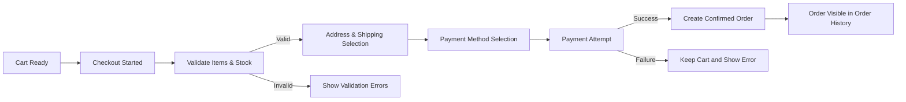
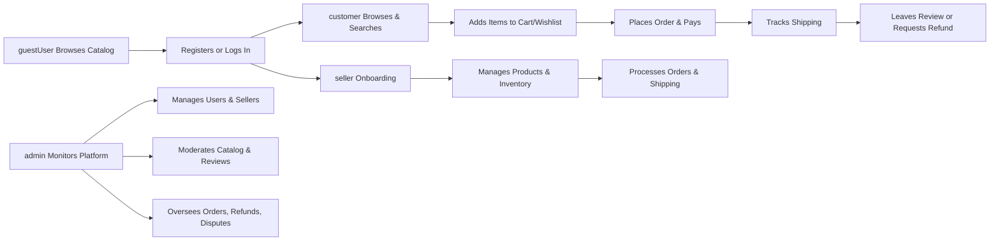

# shoppingMall E-commerce Platform – Consolidated Business Requirements

## 1. Service Overview

THE shoppingMall platform SHALL operate as a multi-seller e-commerce shopping mall where customers can discover, compare, and purchase products from multiple independent sellers through a unified experience.

THE shoppingMall platform SHALL support a full purchase lifecycle including browsing, cart and wishlist management, order placement, payment processing, shipping and tracking, product reviews, seller operations, and admin governance.

THE shoppingMall platform SHALL focus on clear business rules so that backend developers can implement a consistent, predictable, and testable backend without ambiguity.

## 2. Actors and Global Concepts

### 2.1 Actors

THE shoppingMall platform SHALL recognize the following actors:

- **guestUser**: unauthenticated visitor.
- **customer**: authenticated buyer who manages addresses, carts, wishlists, orders, and reviews.
- **seller**: authenticated merchant who manages products, SKUs, inventory, and seller-side orders.
- **admin**: platform operator responsible for governance, moderation, and operations.

WHEN any requirement refers to "the system", THE system SHALL mean the shoppingMall backend as observed through its external behavior.

### 2.2 Global EARS Principles

- THE system SHALL describe business rules using EARS style where applicable.
- WHEN a trigger occurs, THE system SHALL respond according to the defined business rule.
- WHILE a state holds, THE system SHALL maintain behaviors associated with that state.
- IF an unwanted condition occurs, THEN THE system SHALL handle it with clearly defined outcomes.

## 3. User Registration, Login, and Address Management

### 3.1 Customer Registration

WHEN a person requests creation of a customer account, THE system SHALL require at minimum a unique email address, a password that satisfies the password policy, and explicit agreement to terms of service and privacy policy.

WHEN customer registration input is submitted, THE system SHALL validate that the email has a valid format and is not already associated with an existing account.

IF the email already exists, THEN THE system SHALL reject registration with a business error that indicates the email is already in use without disclosing any other account details.

WHERE email verification is enabled, THE system SHALL mark the new customer as "email-unverified" until the verification step is completed.

WHEN email verification is successfully completed, THE system SHALL update the customer status to allow full use of customer-only features.

### 3.2 Seller Registration

WHEN a person or entity applies for a seller account, THE system SHALL capture required seller information in business terms including business name, contact details, and any required legal identifiers.

WHEN seller registration data is submitted, THE system SHALL set seller status to a pending state until required checks are finished.

WHEN an admin approves a pending seller, THE system SHALL mark seller status as active and SHALL allow access to seller portal capabilities.

IF seller registration is rejected, THEN THE system SHALL retain the application record and SHALL prevent seller access to seller operations while exposing a human-readable rejection reason to admin and, where policy allows, to the applicant.

### 3.3 Admin Account Provisioning

WHEN an organization needs a new admin account, THE system SHALL allow creation of that admin account only through controlled internal provisioning, not through public registration flows.

WHEN an admin account is created, THE system SHALL require strong credentials consistent with security policy and SHALL record who created the admin account and when.

### 3.4 Login and Logout

WHEN a customer, seller, or admin submits login credentials, THE system SHALL validate identity and SHALL start an authenticated session if the credentials and account status are valid.

IF the account is suspended or blocked, THEN THE system SHALL deny login and SHALL indicate that the account is not currently active without exposing internal reasons.

WHEN an authenticated actor performs a logout action, THE system SHALL terminate the corresponding session and SHALL treat subsequent requests as unauthenticated until login occurs again.

### 3.5 Address Management

WHEN a customer is authenticated, THE system SHALL allow the customer to create, update, and delete multiple shipping addresses.

WHEN a customer saves an address, THE system SHALL validate that all required address fields are present and conform to business format rules such as country, city, postal code, and street information.

IF an address fails validation, THEN THE system SHALL reject the change and SHALL return field-level errors in business terms.

WHILE an address is associated with existing orders, THE system SHALL retain that address snapshot in those orders regardless of later changes to the customer’s address book.

## 4. Product Catalog, Categories, and Search

### 4.1 Product Structure

THE system SHALL represent each product as a business concept owned by exactly one seller.

THE system SHALL store for each product at least a title, a summary description, a detailed description, a primary category, at least one image, and a lifecycle status.

WHEN a seller creates a new product, THE system SHALL initialize that product in a draft status that is not visible to customers or guest users.

WHEN a seller requests that a product become active, THE system SHALL ensure all mandatory product attributes and at least one valid SKU exist and SHALL reject activation if validation fails.

### 4.2 Categories and Navigation

THE system SHALL maintain a hierarchical category structure where each category may have a single parent and multiple children.

WHEN an admin creates or updates a category, THE system SHALL prevent creation of circular category relationships.

WHILE a category is active, THE system SHALL include that category in customer and guest navigation menus.

WHEN a category is deactivated, THE system SHALL prevent new product assignments to that category and SHALL remove it from customer-facing navigation while allowing admins and sellers to view it for maintenance.

### 4.3 SKU and Variant Modeling

THE system SHALL model each SKU as a specific sellable variant of a product with its own price, inventory quantity, and variant attributes.

WHEN a seller creates a SKU for a product, THE system SHALL ensure that the combination of variant attributes (for example color and size) is unique under that product.

IF a seller attempts to create a SKU with a variant combination that already exists, THEN THE system SHALL reject the creation with a clear message that the variant combination is duplicated.

WHILE a SKU is marked active and inventory is available, THE system SHALL treat the SKU as eligible for purchase subject to any additional restrictions.

### 4.4 Catalog Visibility Rules

WHERE the actor is a guestUser, THE system SHALL show only products and SKUs that are in active state and not restricted to registered customers.

WHERE the actor is a customer, THE system SHALL show products and SKUs that are active and permitted for that customer according to any segmentation rules.

WHERE the actor is a seller, THE system SHALL show all products and SKUs owned by that seller regardless of public visibility plus any catalog information needed for comparison if permitted by policy.

WHERE the actor is an admin, THE system SHALL allow viewing of all products and SKUs in any lifecycle state.

WHEN all SKUs of a product are non-purchasable due to stock or status, THE system SHALL disable add-to-cart actions for that product while allowing browsing according to configuration.

### 4.5 Search and Filtering

WHEN a guestUser or customer submits a search query, THE system SHALL return a list of matching products that are visible and in-scope for that actor.

WHEN search results are requested, THE system SHALL support sorting by relevance, price, newest, and popularity as configured.

WHEN a user applies filters such as category, price range, or variant attributes, THE system SHALL limit results to products whose SKUs satisfy the filter criteria.

IF the combination of search and filters yields no results, THEN THE system SHALL return an empty result indicator and SHALL allow users to clear or adjust filters.

## 5. Shopping Cart and Wishlist

### 5.1 Cart Ownership and Creation

WHEN a guestUser adds the first SKU to cart, THE system SHALL create a temporary cart associated with that browsing context.

WHEN a customer adds the first SKU to cart while authenticated, THE system SHALL create a persistent cart tied to that customer account when none exists.

WHILE a customer account remains active, THE system SHALL persist that customer’s cart across sessions until it is emptied or converted into an order or removed by policy.

### 5.2 Guest Cart to Customer Cart Merge

WHEN a guestUser with a temporary cart authenticates as a customer, THE system SHALL merge the temporary cart into the customer’s persistent cart using a deterministic merge policy.

WHERE the same SKU appears in both carts, THE system SHALL either sum quantities or choose a preferred quantity according to configured business rules.

IF any SKU in the temporary cart is no longer purchasable at merge time, THEN THE system SHALL omit that SKU from the merged cart and SHALL mark it as unavailable in user-facing feedback.

### 5.3 Cart Item Validation

WHEN a SKU is added to cart, THE system SHALL verify that the SKU is visible, active, and meets purchase eligibility conditions such as stock availability and purchase limits.

IF a SKU fails validation for reasons such as inactive status, insufficient stock, or restricted sale conditions, THEN THE system SHALL reject the add-to-cart request and SHALL inform the user why the item cannot be added in business terms.

WHEN a customer updates the quantity of a cart item, THE system SHALL re-validate the requested quantity against inventory and purchase limits.

IF the updated quantity exceeds available inventory or allowed limits, THEN THE system SHALL adjust the quantity down to the maximum permitted value or SHALL reject the change according to configured policy and SHALL inform the customer.

### 5.4 Cart Display and Revalidation

WHEN a customer opens the cart view, THE system SHALL recalculate current prices, discounts, and stock status for each cart item based on the latest business data.

IF any cart item has become unavailable or changed in price since it was added, THEN THE system SHALL reflect the new status or price and SHALL identify the affected items to the customer.

WHILE checkout has not begun, THE system SHALL allow customers to adjust quantities, remove items, or clear the cart entirely.

### 5.5 Wishlist Behavior

WHEN a customer chooses to add a product to a wishlist, THE system SHALL record that preference in a wishlist associated with that customer account.

WHERE business policy allows multiple wishlists, THE system SHALL allow the customer to create, name, and delete wishlists and to move items between them.

IF an attempt is made to add a product that is no longer visible or has been removed, THEN THE system SHALL reject the addition and SHALL indicate that the product is unavailable.

WHEN a customer chooses to move a wishlist item to cart, THE system SHALL apply the same SKU and availability validations used for direct add-to-cart actions.

## 6. Order Placement and Payment Processing

### 6.1 Checkout Pre-conditions

WHEN a customer initiates checkout, THE system SHALL require that the customer is authenticated.

WHEN checkout begins, THE system SHALL validate all cart items for SKU existence, visibility, purchase eligibility, and inventory sufficiency.

IF any cart item fails validation, THEN THE system SHALL block progression to payment selection and SHALL prompt the customer to resolve the problematic items.

### 6.2 Address and Shipping Selection

WHEN checkout progresses beyond cart validation, THE system SHALL require selection of at least one shipping address for all items that require physical delivery.

WHEN a shipping address is selected, THE system SHALL validate address fields as compatible with supported shipping regions and SHALL ensure that at least one shipping option exists for that address and set of items.

IF no shipping method is available for a combination of address and items, THEN THE system SHALL prevent order confirmation and SHALL identify the problematic items.

### 6.3 Payment Method Selection

WHEN all order details and shipping selections are valid, THE system SHALL present the customer with a set of allowed payment methods appropriate for the region, currency, and order amount.

WHEN the customer selects a payment method, THE system SHALL lock the payable amount and SHALL initiate payment processing according to that method’s rules.

IF payment authorization succeeds, THEN THE system SHALL mark the payment as successful at business level and SHALL create or update the order in a paid state.

IF payment authorization fails or is declined, THEN THE system SHALL record the failure reason, SHALL leave the cart intact for potential retry, and SHALL not mark the order as paid.

### 6.4 Order Creation and Confirmation

WHEN payment is confirmed or otherwise deemed acceptable, THE system SHALL create an order record that contains a snapshot of items, SKUs, prices, discounts, fees, taxes, shipping details, and payment status at the time of confirmation.

WHEN an order is successfully created, THE system SHALL provide the customer with an order identifier and summarized order details.

WHEN an order includes items from multiple sellers, THE system SHALL record the seller attribution for each order line so that subsequent seller-specific processing can occur.

### 6.5 Payment Status Lifecycle

WHEN a payment attempt is initiated, THE system SHALL set payment status to a pending state until a final outcome is known or a timeout occurs.

WHEN a payment completes successfully, THE system SHALL set payment status to paid and SHALL ensure that the order becomes eligible for fulfillment.

IF a payment is declined or fails, THEN THE system SHALL mark payment status as failed and SHALL prevent shipment until a successful payment exists.

WHEN a refund is approved and processed, THE system SHALL update payment-related records to reflect the refunded amount and SHALL store the reason for that refund.

### 6.6 Mermaid Diagram – Checkout and Payment

## 7. Order Tracking, Shipping, and Status Updates

### 7.1 Order Status Lifecycle

THE system SHALL maintain a high-level order status lifecycle that reflects major business stages such as created, paid, preparing, shipped, delivered, cancelled, and refunded.

WHEN payment is confirmed, THE system SHALL transition order status from waiting-for-payment to a paid state and SHALL allow shipping preparation actions.

WHEN shipping activities progress, THE system SHALL update order-related shipping statuses so that customers can see current progress.

### 7.2 Shipping Status

WHEN an order is ready to be fulfilled by a seller, THE system SHALL create one or more shipment records for that order according to splitting rules.

WHEN the seller indicates that items have been shipped, THE system SHALL update shipping status to a shipped or in-transit state and SHALL record carrier and tracking identifiers where available.

WHEN the carrier reports delivery, THE system SHALL update shipping status to delivered and SHALL record delivery timestamp.

IF a shipment fails delivery, THEN THE system SHALL update shipping status to a failed state and SHALL record the failure reason for later review.

### 7.3 Customer-Facing Tracking

WHEN a customer views order details, THE system SHALL display the order status and each shipment’s shipping status, carrier, tracking identifier, and last known tracking event where available.

IF tracking information is not yet available, THEN THE system SHALL indicate that the shipment is being prepared and that tracking will appear later.

### 7.4 Handling Exceptional Shipping Scenarios

IF a shipment is lost, THEN THE system SHALL mark that shipment accordingly and SHALL allow admin and seller to trigger appropriate compensation steps such as replacement or refund.

IF a shipment is returned to sender, THEN THE system SHALL update status to returned and SHALL allow subsequent order and refund decisions based on return condition.

## 8. Order History, Cancellations, and Refund Requests

### 8.1 Order History

WHEN a customer is authenticated, THE system SHALL allow the customer to view a chronological list of that customer’s orders.

WHEN a customer selects a specific order from history, THE system SHALL present detailed information including items, prices, shipping states, payment state, and any associated cancellations or refunds.

IF an authenticated actor attempts to open an order that does not belong to that actor, THEN THE system SHALL deny access and SHALL not disclose whether the order exists.

### 8.2 Cancellation Requests

WHEN an order is in a business-defined cancellable state such as not yet shipped, THE system SHALL allow the owning customer to request cancellation of the order in whole or in part.

WHEN a cancellation request is submitted, THE system SHALL record the request, including items, quantities, reason, and requested scope, and SHALL route the request to the appropriate seller or admin workflow.

IF the order is no longer cancellable (for example already shipped), THEN THE system SHALL reject new cancellation requests and SHALL suggest using refund or return flows where applicable.

### 8.3 Refund Requests

WHEN an order or line item meets conditions for refund eligibility such as delivery completed within a return period, THE system SHALL allow the customer to request a refund.

WHEN a refund request is created, THE system SHALL require a reason category and, where required, additional details such as description of issues or photographic evidence references.

WHEN a refund request is submitted, THE system SHALL create a refund case linked to the order and SHALL track its status from requested through approved or rejected.

IF the refund request is approved, THEN THE system SHALL mark related order items as refunded, SHALL store the approved refund amount, and SHALL update payment status accordingly.

IF the refund request is rejected, THEN THE system SHALL record the rejection reason in business terms and SHALL expose that reason to the customer.

## 9. Product Reviews and Ratings

### 9.1 Eligibility

WHEN an order line item is delivered, THE system SHALL mark the associated customer as eligible to submit a review and rating for the purchased product or SKU.

IF a customer attempts to submit a review for a product that the customer has not purchased or has not yet received, THEN THE system SHALL reject the review and SHALL indicate that reviews are allowed only for completed purchases.

### 9.2 Rating Scale

THE system SHALL use a rating scale where higher numeric values represent more positive evaluations, and SHALL default to a range from 1 to 5 inclusive unless configured otherwise.

WHEN a review is submitted, THE system SHALL require a rating value within the allowed range and SHALL reject any rating outside that range.

### 9.3 Review Content

WHEN a customer submits review text, THE system SHALL require the content to respect configured minimum and maximum length constraints and SHALL strip or reject any unsupported markup.

IF review content contains prohibited content such as hate speech or personal contact information, THEN THE system SHALL flag the review and SHALL hide it or send it for moderation according to policy.

### 9.4 Review Updates and Deletion

WHEN a customer owns an existing review, THE system SHALL allow the customer to update or delete that review within any defined policy time limits.

WHEN a review is updated, THE system SHALL preserve an internal history of changes for audit while showing only the latest version to general users.

WHEN a review is deleted by its author or removed by admin, THE system SHALL exclude that review from rating aggregations and public display while retaining it internally for an appropriate retention period.

### 9.5 Aggregation and Visibility

WHEN computing product rating aggregates, THE system SHALL include only reviews that are visible, non-deleted, and not excluded by policy.

WHEN a product detail page is viewed, THE system SHALL show aggregated rating information such as average rating and count of reviews when at least one review exists.

IF a product has no reviews, THEN THE system SHALL indicate that no rating is yet available rather than showing a misleading default value.

## 10. Seller Accounts, Product Management, and Inventory

### 10.1 Seller Profile and Access

WHEN a seller account is active, THE system SHALL allow that seller to access the seller portal and manage products, SKUs, inventory, and seller-specific orders.

IF a seller account is suspended, THEN THE system SHALL prevent that seller from publishing new products or modifying critical data and SHALL show that operations are restricted.

### 10.2 Product Management by Sellers

WHEN a seller creates or edits a product, THE system SHALL restrict changes to that seller’s own products only.

IF a seller attempts to modify a product that belongs to another seller, THEN THE system SHALL deny the operation and SHALL log the attempt.

WHEN a seller updates product attributes such as title, description, or category, THE system SHALL validate new values against business rules and SHALL reject invalid updates.

WHEN a seller marks a product as active, THE system SHALL ensure that at least one SKU is active and that all mandatory product fields are complete.

### 10.3 SKU and Inventory Management

WHEN a seller sets or adjusts inventory for a SKU, THE system SHALL ensure that resulting inventory is not negative unless overselling is explicitly allowed by configuration.

IF a requested inventory adjustment would cause the quantity to drop below zero and overselling is disabled, THEN THE system SHALL reject the adjustment.

WHEN customer orders reserve or consume inventory, THE system SHALL adjust the effective available stock according to configured reservation or deduction rules.

WHEN inventory for a SKU reaches zero and overselling is not allowed, THE system SHALL prevent new orders that would require that SKU.

### 10.4 Seller Order Views and Actions

WHEN a seller accesses the list of orders, THE system SHALL show only orders that include that seller’s products.

WHEN a seller opens an order view, THE system SHALL display only the items, quantities, prices, and shipping address details necessary to fulfill the portion belonging to that seller.

WHEN a seller marks items as shipped and provides tracking information, THE system SHALL update the shipping status for those items and SHALL make the tracking information visible to the relevant customer.

## 11. Admin Dashboard and Governance

### 11.1 Admin Visibility

WHEN an admin views the admin dashboard, THE system SHALL present aggregate information about users, sellers, products, orders, refunds, disputes, and key operational metrics.

WHEN an admin searches for a specific user, seller, product, or order, THE system SHALL allow searching by business identifiers and SHALL show matching results with sufficient detail for governance.

### 11.2 Admin Actions on Users and Sellers

WHEN an admin needs to change the status of a user or seller account, THE system SHALL require the admin to specify the new status, a reason category, and optional explanatory text.

WHEN a user or seller is set to suspended or blocked, THE system SHALL prevent that actor from performing additional actions that are incompatible with the new status while preserving historical data and audit trails.

### 11.3 Admin Catalog Governance

WHEN an admin identifies a product or SKU that violates policy, THE system SHALL allow the admin to hide or block that product or SKU from future sales while keeping it visible in historical orders and in admin views.

WHEN a product or SKU is blocked by admin, THE system SHALL ensure that customers and guest users cannot add it to cart or create new orders for it.

### 11.4 Admin Handling of Orders, Refunds, and Disputes

WHEN a refund or dispute requires admin intervention, THE system SHALL provide admins with complete relevant data including order details, prior decisions, and any evidence provided by customer or seller.

WHEN an admin decides a dispute outcome, THE system SHALL apply the decision to order, payment, and refund records and SHALL record the decision and reasoning for audit.

IF an admin attempts to perform an action that contradicts business rules such as approving a refund larger than the total paid amount, THEN THE system SHALL prevent the action and SHALL show a clear error.

## 12. High-Level User Journeys Diagram

## 13. Error Handling and Unwanted Behavior (Cross-Cutting)

### 13.1 Authorization Failures

IF any actor attempts an operation outside that actor’s permission scope, THEN THE system SHALL deny the request and SHALL respond with an authorization error without revealing sensitive internal details.

WHILE repeated unauthorized attempts are detected from the same actor or device within a defined period, THE system SHALL log the attempts and MAY limit further requests from that source according to security policy.

### 13.2 Data Validation Failures

WHEN input data is missing mandatory fields or violates business constraints such as length limits or invalid formats, THE system SHALL reject the operation and SHALL return field-level validation errors in business terms.

WHEN multiple validation failures occur in a single request, THE system SHALL report all relevant issues in one response where practical.

### 13.3 Concurrency and Consistency Issues

IF a data conflict is detected due to concurrent changes such as simultaneous cart updates or stock adjustments, THEN THE system SHALL apply a deterministic resolution strategy such as last-write-wins or version-based conflict handling and SHALL make the final state visible to affected actors.

WHEN concurrency conflicts affect customer-facing operations such as checkout, THE system SHALL err on the side of preventing over-commitment of inventory and SHALL explain the conflict to the customer.

## 14. Non-functional Business Expectations (Summary)

THE system SHALL provide response times that are generally within a few seconds for all customer-facing operations under normal load so that the shopping experience feels responsive.

THE system SHALL provide high availability for catalog browsing, cart operations, checkout, and order history consistent with business uptime targets.

THE system SHALL protect personal and business data from unauthorized access and SHALL maintain audit trails for sensitive operations, especially those performed by admin actors.

THE system SHALL retain essential business records including orders, payments, refunds, and seller information for periods sufficient to satisfy legal, tax, and operational requirements.

THE system SHALL allow adjustments to policies such as refund windows, rating rules, and seller performance thresholds through configuration so that business teams can adapt rules without rewriting core logic.

THE requirements in this document SHALL guide backend developers and QA engineers in implementing and validating the shoppingMall backend strictly from a business behavior perspective.