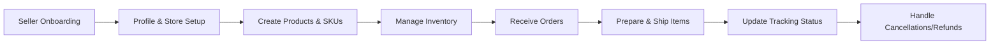

# shoppingMall Platform – Consolidated Business Requirements

## 1. Platform Overview

shoppingMall is a multi-seller e-commerce marketplace where customers can browse a shared product catalog, manage carts and wishlists, place orders with online payment, track shipping, leave reviews, and interact indirectly with sellers under the governance of platform admins.

The system supports four primary actors:
- **guestUser** – unauthenticated visitor who can browse catalog and reviews.
- **customer** – authenticated end-user who manages addresses, carts, wishlists, orders, and reviews.
- **seller** – authenticated merchant who manages their own products, SKUs, inventory, and seller-side order handling.
- **admin** – platform staff who manage users, sellers, catalog, orders, reviews, and policies.

All requirements in this document are expressed in business terms and follow EARS-style wording where applicable (WHEN/WHILE/IF/THEN/THE/SHALL). They define **what** the platform must do, not **how** it is implemented.

## 2. Actors and High-Level Capabilities

### 2.1 guestUser

- THE platform SHALL allow guestUser to browse categories, search products, and view product details and reviews without authentication.
- THE platform SHALL prevent guestUser from placing orders, managing persistent addresses, writing reviews, or accessing any personal data.

### 2.2 customer

- THE platform SHALL allow customer to register, log in, manage profile and addresses, maintain a cart and wishlist, place orders, track shipments, view order history, request cancellations and refunds, and leave product reviews.

### 2.3 seller

- THE platform SHALL allow seller to onboard, manage seller profile, create and manage products and SKUs, adjust inventory per SKU, view orders containing their products, and update shipment-related information.

### 2.4 admin

- THE platform SHALL allow admin to manage users and sellers, moderate catalog and reviews, oversee orders and refunds, monitor platform health, and configure business policies.

## 3. Registration, Login, and Address Management

### 3.1 Registration

- WHEN a person signs up as customer, THE platform SHALL require at minimum a unique email address and a password that satisfies the password policy.
- WHEN a person signs up as seller, THE platform SHALL require both login credentials and required business details (for example business name and contact information) before granting seller capabilities.
- IF the email is already used by an existing account, THEN THE platform SHALL reject registration and SHALL indicate that the email is already in use.

### 3.2 Login and Logout

- WHEN customer, seller, or admin submits valid credentials, THE platform SHALL create an authenticated session associated with that actor.
- WHEN credentials are invalid, THE platform SHALL respond with a generic authentication failure without revealing whether the email exists.
- WHEN an authenticated actor logs out, THE platform SHALL terminate the active session so further protected actions require authentication again.

### 3.3 Address Management for Customers

- THE platform SHALL allow customer to maintain one or more shipping addresses stored under their account.
- WHEN customer adds a new address, THE platform SHALL require mandatory fields such as recipient name, street, city, postal code, and country.
- WHEN customer marks an address as default, THE platform SHALL prefer that address during checkout unless customer selects a different one.
- IF an address is missing mandatory fields or violates format rules, THEN THE platform SHALL reject the address and SHALL list the invalid fields.

### 3.4 Address Use During Checkout

- WHEN customer proceeds to checkout, THE platform SHALL require selection of a valid shipping address for each shipment group.
- IF no valid address is available, THEN THE platform SHALL require customer to create or correct an address before continuing.

## 4. Product Catalog, Categories, and Search

### 4.1 Catalog Visibility

- THE platform SHALL show only active products and SKUs to guestUser and customer, subject to stock and policy rules.
- WHERE a product is active but all SKUs are unavailable for purchase, THE platform SHALL still allow viewing the product details but SHALL indicate that no variants are currently purchasable.

### 4.2 Categories

- THE platform SHALL organize products into a hierarchical category structure (for example Electronics → Mobile Phones).
- WHEN a user selects a category, THE platform SHALL show products assigned to that category and optionally its subcategories according to configuration.
- IF a category contains no visible products, THEN THE platform SHALL show an empty result state and MAY suggest other categories.

### 4.3 Search and Filtering

- WHEN guestUser or customer enters a search term, THE platform SHALL return a list of matching products ordered by a configurable relevance rule.
- THE platform SHALL allow filtering product lists by at least category and price range and MAY support additional filters like brand or attributes.
- WHEN a user applies filters, THE platform SHALL restrict results to products that satisfy all selected filters.
- IF no products match the search and filters, THEN THE platform SHALL show an empty state and SHALL allow users to clear or adjust filters.

### 4.4 Product Details

- THE platform SHALL store for each product a title, summary, description, at least one image, owning seller, categories, and status.
- WHEN a user opens a product page, THE platform SHALL display product information, available SKUs with variant attributes, current prices, and aggregated rating information.

## 5. Product Variants (SKUs) and Inventory

### 5.1 SKU Modeling

- THE platform SHALL represent each purchasable variant of a product as a SKU with its own price, inventory quantity, and variant attributes (for example color, size, option).
- THE platform SHALL ensure that within a single product, each unique combination of variant attributes maps to at most one SKU.

### 5.2 SKU Availability

- THE platform SHALL treat a SKU as purchasable only when the product is active, the SKU is enabled, and the SKU has sufficient stock or is otherwise allowed for sale.
- WHEN a customer selects a specific variant combination, THE platform SHALL indicate whether that SKU is available, limited stock, or out of stock.
- IF stock for a SKU is zero and overselling is not permitted, THEN THE platform SHALL prevent adding that SKU to cart.

### 5.3 Inventory Management (Seller Perspective)

- WHEN seller updates inventory quantity for one of their SKUs, THE platform SHALL adjust the recorded stock quantity for that SKU.
- IF a seller attempts to set stock below zero, THEN THE platform SHALL reject the change and SHALL indicate that stock cannot be negative.
- WHEN orders are placed and confirmed, THE platform SHALL reduce available stock for the ordered SKUs according to the order quantities and inventory rules.
- WHEN an order is cancelled entirely before shipment and stock restoration is allowed by policy, THE platform SHALL increase available stock for affected SKUs by the cancelled quantities.

## 6. Shopping Cart Behavior

### 6.1 Cart Ownership and Persistence

- WHEN guestUser adds the first SKU to cart, THE platform SHALL create a temporary cart tied to that browsing context.
- WHEN customer adds the first SKU to cart, THE platform SHALL create or reuse a persistent cart tied to that customer account.
- WHILE customer account remains active, THE platform SHALL preserve that customer’s persistent cart contents across sessions until the cart is cleared or converted to orders.

### 6.2 Guest Cart to Customer Cart Merge

- WHEN guestUser with a temporary cart logs in or registers to become customer, THE platform SHALL merge the temporary cart into the customer’s persistent cart using a deterministic merge rule.
- WHERE the same SKU exists in both carts, THE platform SHALL either sum the quantities or choose the larger quantity, as defined by business policy, and SHALL ensure final quantity does not exceed allowed per-SKU limits.
- IF a SKU in the guest cart is no longer valid or purchasable, THEN THE platform SHALL exclude that SKU from the merged cart and SHALL inform customer after login.

### 6.3 Add, Update, Remove

- WHEN a user adds a SKU to cart, THE platform SHALL validate that the SKU is visible, enabled, and purchasable.
- IF the requested quantity exceeds the available quantity or per-customer limit, THEN THE platform SHALL cap the quantity at the maximum allowed and SHALL inform the user.
- WHEN a user updates the quantity of a cart item, THE platform SHALL re-validate stock and rules before applying the change.
- WHEN a user removes a cart item, THE platform SHALL remove that item from the cart while keeping other items unchanged.

### 6.4 Cart Validation During Checkout

- WHEN customer initiates checkout, THE platform SHALL validate all cart items for SKU existence, visibility, purchasability, price validity, and inventory sufficiency.
- IF any cart item fails validation (for example out of stock or price changed), THEN THE platform SHALL block progression to payment until the customer acknowledges and adjusts the cart.

## 7. Wishlist Behavior

### 7.1 Wishlist Ownership and Scope

- THE platform SHALL allow each customer to maintain at least one wishlist associated with their account.
- THE platform SHALL restrict viewing and managing a wishlist to its owning customer.

### 7.2 Wishlist Operations

- WHEN customer adds a product or SKU to wishlist, THE platform SHALL create a wishlist entry without reserving stock.
- IF the product is already in the wishlist, THEN THE platform SHALL avoid creating duplicates and MAY update a timestamp or metadata.
- WHEN customer removes an item from wishlist, THE platform SHALL delete that entry without affecting cart or orders.
- WHEN customer decides to move a wishlist item to cart, THE platform SHALL treat it as an add-to-cart operation and SHALL apply all SKU validation and stock checks.

## 8. Order Placement and Payment Processing

### 8.1 Preconditions for Order Creation

- WHEN customer proceeds from validated cart to order, THE platform SHALL require:
  - An authenticated customer session.
  - At least one valid cart item.
  - A valid shipping address for each shipment group.
  - Selection of valid shipping methods where required.
  - Selection of an allowed payment method.

- IF any of these preconditions are not met, THEN THE platform SHALL block order creation and SHALL present clear error messages.

### 8.2 Order Creation Flow

- WHEN customer confirms checkout details, THE platform SHALL create an order record that captures:
  - Ordered items with references to SKUs and product names.
  - Snapshot of unit prices, discounts, and totals.
  - Selected shipping addresses and methods.
  - Chosen payment method information in business terms.

- WHEN an order is created, THE platform SHALL set an initial order status (for example "Awaiting Payment") and a corresponding payment status consistent with payment rules.

### 8.3 Payment Processing

- WHEN payment is initiated for an order, THE platform SHALL lock the payable amount for that order so that subsequent price changes do not alter the amount for this payment attempt.
- WHEN payment succeeds for the full order amount, THE platform SHALL mark the payment status as Paid and SHALL transition the order to a status that allows fulfillment (for example "Payment Confirmed").
- IF payment fails or is declined, THEN THE platform SHALL mark the payment attempt as Failed, SHALL keep or revert the order to an unpaid state, and SHALL present a suitable error so customer can retry or choose a different payment method.
- IF payment remains pending beyond a configured timeout, THEN THE platform SHALL treat the payment as Expired and SHALL transition the order to a status equivalent to "Payment Expired" or automatic cancellation according to policy.

### 8.4 Multi-Seller Orders

- WHERE an order contains items from multiple sellers, THE platform SHALL still create a single customer-facing order while internally associating each line item with its owning seller.
- THE platform SHALL ensure that payment is taken for the entire order, then SHALL allocate financial amounts per seller according to business rules.

### 8.5 Error and Edge Cases

- IF payment succeeds but order persistence temporarily fails, THEN THE platform SHALL ensure that either a corresponding order is created later or that the payment is refunded according to operations policies, and SHALL keep an auditable record for reconciliation.
- IF network errors prevent returning a confirmation screen after successful order creation, THEN THE platform SHALL make the order visible in the customer’s order history so it can be reviewed on subsequent login.

## 9. Order Tracking and Shipping Status Updates

### 9.1 Shipping Status Lifecycle

- THE platform SHALL represent shipping status for each shipment using a defined set of states such as Pending, Preparing, Shipped, InTransit, OutForDelivery, Delivered, DeliveryFailed, Returned, and Cancelled.

- WHEN payment is confirmed for an order, THE platform SHALL create one or more shipment records in Pending state according to order splitting rules.
- WHEN seller or warehouse starts preparing items, THE platform SHALL allow transition of shipments from Pending to Preparing.
- WHEN a carrier picks up the package, THE platform SHALL allow transition from Preparing or ReadyForPickup to Shipped and SHALL capture a pickup timestamp.
- WHEN carrier events indicate progress, THE platform SHALL update shipping status accordingly (InTransit, OutForDelivery, Delivered, DeliveryFailed, Returned).

### 9.2 Tracking Information

- THE platform SHALL allow storing tracking numbers, carrier names, and tracking events per shipment.
- WHEN customer opens the order detail page, THE platform SHALL display current shipping status, the carrier (where known), tracking identifier (subject to privacy rules), and key tracking events.
- IF tracking information is not yet available, THEN THE platform SHALL show that the order is being prepared and tracking will be available later.

### 9.3 Handling Delivery Problems

- IF carrier reports DeliveryFailed, THEN THE platform SHALL update shipping status accordingly and SHALL display a suitable message to customer with next steps (for example re-delivery attempt or return to sender), based on policy.
- IF a shipment is marked as Returned, THEN THE platform SHALL allow sellers and admins to initiate appropriate handling, such as re-shipment or refund, according to business rules.

## 10. Product Reviews and Ratings

### 10.1 Eligibility and Timing

- THE platform SHALL allow only customers who have purchased a product and whose order items have reached a Delivered state to create reviews for that product.
- WHEN an order line item is delivered, THE platform SHALL mark the corresponding customer as eligible to review that SKU or product within a defined review window.
- IF a customer attempts to review a product they have not purchased under their account, THEN THE platform SHALL reject the review and SHALL indicate that only verified purchasers can review.

### 10.2 Rating and Review Content

- THE platform SHALL require every review to include a numeric rating within the configured scale (for example 1–5).
- THE platform MAY allow text reviews and media attachments subject to length and size limits defined by policy.
- IF a review exceeds allowed length or attachment limits, THEN THE platform SHALL reject the review and SHALL describe which limits were violated.

### 10.3 Review Management by Customer

- THE platform SHALL allow customer to edit or delete their own reviews within business-defined constraints (for example limited time window for edits).
- WHEN a review is deleted by its author, THE platform SHALL remove it from public visibility and from rating aggregation while keeping an internal record for audit if required.

### 10.4 Moderation and Reporting

- THE platform SHALL allow customers and sellers to report reviews they consider inappropriate or in violation of policy.
- WHEN a review is reported, THE platform SHALL record the reporter, reason category, and timestamp and SHALL surface the review in admin moderation views.
- THE platform SHALL allow admins to hide, remove, or reinstate reviews based on moderation decisions, and SHALL ensure that hidden or removed reviews no longer contribute to aggregated ratings.

### 10.5 Aggregated Ratings

- THE platform SHALL compute average rating and review count per product from all included reviews.
- WHEN a user views a product, THE platform SHALL show its aggregated rating and the number of reviews where at least one review exists; otherwise, it SHALL show that there are no ratings yet.

## 11. Seller Accounts and Product / Inventory Management

### 11.1 Seller Onboarding

- WHEN a person applies to become a seller, THE platform SHALL collect required business information and SHALL create a seller entity in a Pending state.
- WHERE manual approval is required, THE platform SHALL allow admins to change seller status from Pending to Active or Rejected based on review.
- WHEN seller status is Active, THE platform SHALL grant access to seller portal capabilities such as product and inventory management and order handling for that seller.

### 11.2 Seller Profile

- THE platform SHALL allow seller to configure store display name, description text, contact email, default shipping origin address, and default return address.
- WHEN seller updates profile information, THE platform SHALL validate required fields and SHALL use updated information in future customer-facing contexts without altering historical records that must remain unchanged.

### 11.3 Product Management by Seller

- WHEN seller creates a new product, THE platform SHALL require product title, category, basic description, and at least one SKU definition prior to activation.
- WHEN seller edits an existing product they own, THE platform SHALL allow changes to text fields, categories within allowed values, visibility state, and SEO-related metadata where applicable.
- IF a product has been part of customer orders, THEN THE platform SHALL prevent full deletion of the product and SHALL require using an inactive or discontinued state instead.

### 11.4 Inventory Management by Seller

- WHEN seller adjusts stock for a SKU they own, THE platform SHALL update stock quantity accordingly while preventing negative values.
- WHEN stock for a SKU falls below a seller-defined threshold, THE platform SHALL mark that SKU as low stock in seller views and MAY support notifications according to configuration.

### 11.5 Seller View of Orders

- THE platform SHALL allow seller to view orders that contain their products, including item details, quantities, prices, shipping address necessary for fulfillment, and status fields relevant to the seller.
- IF seller attempts to access an order that does not contain any of their products, THEN THE platform SHALL deny access.
- WHEN seller ships their items, THE platform SHALL allow them to record carrier and tracking information for those items and SHALL update shipping status for affected shipments.

## 12. Order History, Cancellation, and Refund Requests

### 12.1 Order History for Customers

- THE platform SHALL maintain an order history for each customer that lists all orders created by that customer.
- WHEN customer views their order list, THE platform SHALL present orders in reverse chronological order with key details such as order identifier, creation date, total amount, and current status.
- WHEN customer opens an individual order, THE platform SHALL display full details including line items, shipping address, shipping status, payment summary, and status timeline.

### 12.2 Cancellation Requests

- THE platform SHALL define which order states are cancellable (for example before shipment) and SHALL expose a cancellation option only when the order is in those states.
- WHEN customer requests cancellation for an eligible order or item, THE platform SHALL create a cancellation request and SHALL transition the order or items to an intermediate state while the cancellation is processed.
- IF an order is not in a cancellable state (for example already shipped beyond policy), THEN THE platform SHALL prevent new cancellation requests and SHALL direct the customer to refund or return flows where applicable.

### 12.3 Refund Requests

- THE platform SHALL allow customer to request a refund for eligible orders or items, specifying a reason from a predefined list and optional comments.
- WHEN a refund request is submitted, THE platform SHALL create a refund case linked to the order and items and SHALL surface it to the relevant seller and admin according to policy.
- THE platform SHALL track refund status through states such as Requested, UnderReview, Approved, Rejected, and Completed.

### 12.4 Processing Refunds

- WHERE policy allows sellers to handle refunds, THE platform SHALL allow seller to respond to refund requests by approving or contesting them with reasons.
- WHEN a refund is approved by seller or admin, THE platform SHALL initiate financial refund according to payment provider rules and SHALL update payment and order statuses appropriately.
- WHEN a refund is rejected, THE platform SHALL store the rejection reason and SHALL inform customer of the outcome.
- WHERE a refund requires return of goods, THE platform SHALL provide instructions (for example return address) and SHALL allow marking whether returned items have been received.

## 13. Admin Dashboard and Operations

### 13.1 User and Seller Management

- THE platform SHALL allow admin to search and view customers and sellers by identifiers such as email, name, or ID.
- WHEN admin views a user or seller, THE platform SHALL show status (for example Active, Suspended, Blocked for users; Pending, Active, Suspended, Terminated for sellers) and key metrics such as number of orders or disputes.
- WHEN admin changes account status, THE platform SHALL require a reason and SHALL log the change for audit purposes.

### 13.2 Catalog Governance

- THE platform SHALL allow admin to manage categories, including creating, renaming, hiding, deprecating, and reassigning.
- WHEN admin hides or disables a product or SKU due to policy, THE platform SHALL prevent new purchases for that product or SKU while keeping existing orders intact.

### 13.3 Order, Refund, and Dispute Oversight

- THE platform SHALL allow admin to search and view any order, including full financial and shipping history and associated refund or dispute records.
- WHEN refund or cancellation requests are escalated or disputed, THE platform SHALL allow admin to review case details and make final decisions that update order and payment statuses.
- THE platform SHALL require admin to provide a reason when overriding seller decisions or manually adjusting order statuses and SHALL log those actions.

### 13.4 Monitoring and Reporting

- THE platform SHALL provide admin with aggregated metrics such as order volume, refund rate, dispute count, active sellers, and GMV over configurable time ranges.
- THE platform SHALL allow admin to export business reports subject to privacy and access rules, for example per-seller sales summaries and refund statistics.

## 14. High-Level Flow Diagrams

### 14.1 Customer Purchase and Review Flow

```mermaid
graph LR
  A["Browse Catalog"] --> B["Add SKU to Cart"]
  B --> C["Checkout"]
  C --> D["Payment Processing"]
  D -->|"Success"| E["Order Created & Paid"]
  E --> F["Shipment Preparation"]
  F --> G["Shipped & In Transit"]
  G --> H["Delivered"]
  H --> I["Review Eligible"]
  I --> J["Customer Leaves Review"]
```

### 14.2 Seller Operations Flow

## 15. Consolidated Key EARS Requirements

- THE platform SHALL treat guestUser, customer, seller, and admin as distinct actors with clearly separated capabilities.
- WHEN a user registers as customer, THE platform SHALL require a unique email and password and SHALL prevent duplicate email usage.
- WHEN customer manages addresses, THE platform SHALL validate mandatory fields and SHALL not allow checkout without at least one valid shipping address.
- WHEN users search or browse the catalog, THE platform SHALL display only active products and purchasable SKUs for their actor type.
- WHEN customer adds a SKU to cart, THE platform SHALL validate SKU availability, stock, and purchase rules before increasing cart quantity.
- WHEN customer starts checkout, THE platform SHALL validate cart items, shipping addresses, shipping options, and payment method selection before creating an order.
- WHEN payment succeeds, THE platform SHALL mark the associated order as paid and eligible for fulfillment and SHALL capture a price and fee snapshot.
- WHEN shipment status changes, THE platform SHALL update shipping status and SHALL expose the new state in customer order tracking.
- WHEN a delivered order item is eligible for review, THE platform SHALL allow the purchasing customer to submit one rating per product or SKU within the allowed timeframe.
- WHEN a customer requests cancellation or refund, THE platform SHALL create a case, enforce eligibility rules, and route the case to seller and admin according to policy.
- WHEN seller updates inventory or product status, THE platform SHALL ensure that customer-facing catalog and cart validation reflect the new availability state.
- WHEN admin changes user, seller, product, order, or refund status, THE platform SHALL require reasons and SHALL record audit entries for governance.

These business requirements collectively define the expected behavior for the shoppingMall e-commerce backend from the perspective of core features requested: account and address management, catalog and variants, cart and wishlist, order and payment, tracking, reviews, seller operations, inventory per SKU, order history, cancellations and refunds, and admin dashboard operations.