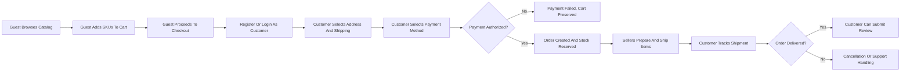

# Requirement Overview for shoppingMall E-commerce Platform

## 1. Purpose and Scope

The shoppingMall platform enables customers to browse products from multiple sellers, manage carts and wishlists, place and pay for orders, track shipments, and submit reviews, while sellers manage their catalog and inventory and platform administrators oversee operations, content, and disputes.

The requirements in this document define business behavior for the backend across these key areas:
- User registration and login with address management.
- Product catalog with categories and search.
- Product variants as SKUs with different colors, sizes, and options.
- Shopping cart and wishlist.
- Order placement and payment processing.
- Order tracking and shipping status updates.
- Product reviews and ratings.
- Seller accounts to manage their products and inventory.
- Order history and cancellation/refund requests.
- Admin dashboard for order and product management.

All requirements use EARS syntax where applicable and describe observable behavior, not technical implementation.

## 2. Actors and High-Level Responsibilities

### 2.1 Actors

- **guestUser**: Unauthenticated visitor who can browse the catalog, view products and reviews, and manage a temporary cart.
- **customer**: Authenticated user who can maintain addresses, persistent carts and wishlists, place orders, pay, track shipments, and submit reviews.
- **seller**: Authenticated merchant who can manage products, SKUs, inventory, and fulfillment-related updates for their items.
- **platformAdmin**: Administrative operator who can oversee users, sellers, products, orders, payments, refunds, and reviews.

### 2.2 High-Level Responsibilities

- THE shoppingMall platform SHALL allow guestUser and customer to discover products, configure variants, and prepare carts and wishlists.
- THE shoppingMall platform SHALL allow customer to complete checkout, payment, and post-purchase actions according to business rules.
- THE shoppingMall platform SHALL allow seller to manage catalog and inventory for their SKUs and to fulfill orders containing their products.
- THE shoppingMall platform SHALL allow platformAdmin to enforce policies, resolve disputes, and maintain platform integrity.

## 3. User Registration, Login, and Address Management

### 3.1 Registration

- WHEN a guestUser submits required registration information for a customer account, THE system SHALL validate mandatory fields such as unique email and password according to configured rules.
- WHEN validation passes, THE system SHALL create a customer account in an initial state (for example, unverified) and SHALL initiate any required verification steps such as email confirmation.
- IF the provided email is already associated with an active customer or seller, THEN THE system SHALL reject registration and SHALL inform the user that the email is already in use.

### 3.2 Login and Session Recognition

- WHEN a customer, seller, or platformAdmin submits valid credentials, THE system SHALL authenticate the actor and SHALL establish an authenticated session that can be used for subsequent requests.
- WHEN a request is received without valid authentication, THE system SHALL treat the actor as guestUser and SHALL restrict capabilities to guestUser permissions.

### 3.3 Address Management

- WHEN a customer is authenticated, THE system SHALL allow the customer to create, update, and delete their own shipping addresses, including fields such as recipient name, street address, city, region, postal code, and contact phone number.
- WHEN a customer attempts to modify or delete an address that is not owned by that customer, THE system SHALL deny the operation.
- WHEN a customer places an order, THE system SHALL require selection of a valid address that meets shipping eligibility rules for the items in the cart.
- IF a customer attempts to place an order without at least one usable shipping address, THEN THE system SHALL prevent order placement and SHALL prompt the customer to add or select an address.
- WHERE a customer updates or deletes an address used in past orders, THE system SHALL preserve address details on those past orders for historical and compliance purposes and SHALL not retroactively change the stored address on completed orders.

## 4. Product Catalog and Categories

### 4.1 Category Structure

- THE system SHALL organize products into a category hierarchy with at least one top-level category and optional nested subcategories.
- WHEN a category is marked active, THE system SHALL allow products assigned to that category to appear in browsing and search results according to product visibility rules.
- WHEN a category is marked inactive, THE system SHALL hide that category from navigation and SHALL prevent new product assignments while maintaining visibility of existing orders that reference products in that category.

### 4.2 Product Visibility and Status

- THE system SHALL treat each product as having a lifecycle status including at least draft, active, inactive, and discontinued.
- WHEN a product is in draft status, THE system SHALL prevent guestUser and customer from viewing that product in standard catalog views.
- WHEN a product is active, THE system SHALL allow it to appear in catalog browsing and search results where stock and compliance rules are satisfied.
- WHEN a product is inactive or discontinued, THE system SHALL prevent it from being added to cart or wishlist by guestUser or customer and SHALL only expose it through historical views such as order history.

### 4.3 Catalog Browsing and Product Detail

- WHEN guestUser or customer opens a category, THE system SHALL list active and visible products within that category, respecting stock and seller status constraints.
- WHEN guestUser or customer opens a product detail, THE system SHALL present product attributes, available variant options, SKU-level prices, stock availability indicators, and aggregated review information.
- IF a requested product identifier does not correspond to a visible product, THEN THE system SHALL return a business-level indication that the product is unavailable without exposing internal identifiers.

### 4.4 Search and Filtering

- WHEN guestUser or customer submits a free-text search query, THE system SHALL return a paginated list of active, visible products that match search criteria according to configured relevance rules.
- THE system SHALL allow filtering of search results by at least category, price range, brand where applicable, and selected attributes such as size or color when variants exist.
- IF no products satisfy the search and filter conditions, THEN THE system SHALL return an empty result set with a clear indication that no products were found.

## 5. Product Variants and SKU Management

### 5.1 SKU Definition and Ownership

- THE system SHALL represent each purchasable variation of a product as a distinct SKU with defined variant attributes (for example, size, color, or other options).
- THE system SHALL associate each SKU with exactly one product and one owning seller.
- THE system SHALL treat SKUs as the unit of inventory tracking and order line creation.

### 5.2 Variant Selection Behavior

- WHEN guestUser or customer views a product that has multiple SKUs, THE system SHALL present available variant options and SHALL allow selection of a specific combination that maps to an active SKU.
- IF a selected combination of options does not correspond to an active SKU, THEN THE system SHALL indicate that the combination is unavailable and SHALL not allow adding that selection to cart or wishlist.
- WHILE a valid active SKU is selected, THE system SHALL display the SKU-specific price and availability derived from inventory status.

### 5.3 SKU Availability and Status

- WHEN all SKUs for an active product are out of stock or inactive, THE system SHALL either mark the product as unavailable or hide it from general catalog browsing according to configurable business policy.
- WHEN a SKU is inactive or out of stock without backorder permission, THE system SHALL prevent guestUser and customer from adding that SKU to cart or wishlist or from placing orders containing that SKU.

## 6. Shopping Cart Requirements

### 6.1 Cart Ownership and Persistence

- WHEN guestUser adds the first SKU to a cart, THE system SHALL create a temporary cart associated with that guest session and SHALL maintain it within a business-defined retention window.
- WHEN customer adds the first SKU to a cart, THE system SHALL create or reuse a persistent cart associated with that customer account.
- WHEN guestUser becomes customer by registering or logging in, THE system SHALL offer to merge the temporary cart with the existing persistent cart for that customer using rules that prevent invalid or duplicate items.
- WHILE a customer account remains active, THE system SHALL persist the customer’s cart until items are converted to orders or explicitly removed.

### 6.2 Cart Item Validation

- WHEN guestUser or customer attempts to add a SKU to cart, THE system SHALL validate that the SKU exists, is active, is visible to that actor, and is eligible for sale in the actor’s region.
- WHEN requested quantity exceeds current available inventory and backorders are disallowed, THE system SHALL cap the quantity to the maximum allowed and SHALL inform the actor.
- WHEN a SKU belongs to a seller who is suspended or otherwise restricted from selling, THE system SHALL reject attempts to add that SKU to cart and SHALL indicate that the item is not available.

### 6.3 Cart Updates and Removal

- WHEN a customer modifies the quantity of a cart item, THE system SHALL revalidate the requested quantity against inventory and policy limits and SHALL apply the change only when valid.
- IF updated quantity violates limits or availability, THEN THE system SHALL adjust the quantity to the maximum allowable and SHALL communicate the adjustment.
- WHEN a cart item’s quantity is set to zero, THE system SHALL remove that item from the cart.
- WHEN a customer requests to clear the cart, THE system SHALL remove all items from that cart instance.

### 6.4 Cart Price Calculation

- WHEN the cart is retrieved for viewing, THE system SHALL calculate per-item line totals and overall cart totals including item prices, applicable discounts, estimated shipping costs, and taxes according to business rules.
- WHEN any product price or promotion changes, THE system SHALL recalculate cart prices at the next cart retrieval or at checkout and SHALL require customer confirmation for orders where totals increase relative to earlier displays.

### 6.5 Cart Validation Prior to Checkout

- WHEN customer initiates checkout, THE system SHALL perform a comprehensive validation of all cart items, including product visibility, SKU availability, and region-based restrictions.
- IF any item fails validation, THEN THE system SHALL identify invalid items, prevent progression to payment, and SHALL allow customer to adjust or remove those items.

## 7. Wishlist Requirements

### 7.1 Wishlist Availability

- THE system SHALL allow only authenticated customer to create and manage wishlists.
- WHEN customer account is created, THE system SHALL create at least one default wishlist for that customer.

### 7.2 Wishlist Item Management

- WHEN a customer adds a product or SKU to a wishlist, THE system SHALL prevent duplicates within the same wishlist.
- WHEN a wishlist entry references a product or SKU that becomes inactive or is removed, THE system SHALL mark the entry as unavailable and SHALL either hide or remove it from the wishlist according to policy.
- WHEN a customer moves an item from wishlist to cart, THE system SHALL apply the same validation rules as standard add-to-cart actions.

## 8. Checkout and Order Placement

### 8.1 Checkout Entry and Preconditions

- WHEN a customer initiates checkout, THE system SHALL require the customer to be authenticated and SHALL ensure that the cart is not empty.
- WHEN checkout begins, THE system SHALL validate all cart items, recalculate prices, and confirm that payment and shipping options are available for items and the customer’s address.

### 8.2 Address and Shipping Selection

- WHEN checkout reaches the address selection stage, THE system SHALL present the customer’s saved addresses and SHALL allow creation of a new address that meets validation check.
- WHEN a shipping address is selected, THE system SHALL determine shipping eligibility for each cart item based on seller and region rules.
- IF any items cannot be shipped to the selected address, THEN THE system SHALL identify those items and SHALL prevent checkout from proceeding until the customer removes them or selects another address.

### 8.3 Payment Option Selection

- WHEN a customer reaches payment selection, THE system SHALL present available payment methods based on region, order amount, and platform configuration.
- WHEN a customer selects a payment method, THE system SHALL ensure that all required payment-related information is collected before initiating payment authorization.

### 8.4 Order Creation and Multi-Seller Handling

- WHEN payment authorization succeeds according to payment rules, THE system SHALL create a customer-facing order that represents the entire purchase.
- WHERE the cart includes items from multiple sellers, THE system SHALL create per-seller segments or suborders that can be managed independently for fulfillment and settlements.
- THE system SHALL store a snapshot of item prices, discounts, shipping costs, and taxes at the time of order creation and SHALL not retroactively update those values due to later pricing changes.

### 8.5 Failure During Checkout

- IF payment authorization fails or is declined, THEN THE system SHALL keep the cart unchanged, SHALL mark the associated order attempt as payment-failed or expired, and SHALL allow the customer to retry payment according to configured limits.
- IF an internal error occurs after payment authorization but before successful order creation, THEN THE system SHALL either roll back payment authorization where possible or initiate refunds and SHALL not leave the customer with an ambiguous order state.

## 9. Order Status Lifecycle and Tracking

### 9.1 Customer-Facing Order States

- THE system SHALL maintain a clear order status lifecycle visible to customers, including at minimum: pending payment, confirmed/processing, shipped, delivered, cancelled, and refunded.
- WHEN order status changes, THE system SHALL update customer order history and SHALL ensure that the current state is available in order detail views.

### 9.2 Seller Fulfillment States

- THE system SHALL maintain seller-facing fulfillment states per order line or per seller segment, including at least: new, preparing, shipped, delivered, and cancelled.
- WHEN a seller updates fulfillment status, THE system SHALL validate that the transition is allowed from the current state and SHALL propagate relevant updates to customer views.

### 9.3 Shipping Information and Tracking

- WHEN seller or platformAdmin provides shipping carrier information and tracking identifiers for a shipment, THE system SHALL store these values and SHALL surface them to customers in order tracking views.
- WHILE order items are in transit, THE system SHALL display the latest known shipping status and key milestones when such information is available from carriers or seller updates.

### 9.4 Order History

- THE system SHALL maintain an order history for each customer, listing all past and current orders with key attributes including order date, total amount, primary status, and seller information.
- WHEN a customer views order history, THE system SHALL paginate results and SHALL allow filtering by time period and status where supported.

## 10. Cancellation and Refund Requests

### 10.1 Customer-Initiated Cancellations

- WHEN a customer requests cancellation of an order or item before shipment and within the allowed cancellation window, THE system SHALL accept the request and SHALL either auto-approve or route it to seller or platformAdmin for approval according to policy.
- WHEN cancellation is approved for items that have been paid but not shipped, THE system SHALL mark those items as cancelled, SHALL initiate refunds according to payment rules, and SHALL restore inventory as described in inventory requirements.
- IF a customer attempts to cancel an order or item after it passes the allowed cancellation state (for example, after shipment), THEN THE system SHALL reject standard cancellation and SHALL direct the customer toward return or refund flows where applicable.

### 10.2 Refund Requests After Shipment or Delivery

- WHEN a customer submits a refund or return request for delivered items within the configured refund window and according to product eligibility, THE system SHALL record the request with reasons and SHALL expose it to seller and platformAdmin for processing.
- WHEN a refund request is approved, THE system SHALL trigger the refund process through payment systems and SHALL update order and payment statuses to reflect refund completion or pending state.

### 10.3 Seller and Admin Roles in Cancellation/Refund

- THE system SHALL allow seller to view and respond to cancellation and refund requests that concern their items, within policy constraints.
- THE system SHALL allow platformAdmin to override seller decisions, initiate or adjust refunds, and close disputes when necessary for policy enforcement.

## 11. Product Reviews and Ratings

### 11.1 Eligibility to Review

- WHEN a customer attempts to submit a review for a product, THE system SHALL verify that the customer has at least one completed order containing that product and that the submission is within the permitted review window.
- IF eligibility criteria are not met, THEN THE system SHALL deny review creation and SHALL explain that reviews are limited to verified purchasers or to a specific time window.

### 11.2 Review Submission and Editing

- WHEN an eligible customer submits a review with rating and optional comment, THE system SHALL validate rating value against the allowed scale and comment length against policies, then SHALL store the review in an initial moderation state.
- WHEN a customer edits or deletes their own review within allowed conditions, THE system SHALL update or remove the review accordingly and SHALL recalculate aggregated rating for the associated product.

### 11.3 Rating Aggregation and Display

- THE system SHALL maintain an average rating and review count for each product based on reviews that are in a state considered public and approved.
- WHEN product details or listings are displayed, THE system SHALL show aggregated ratings and review counts where available, and SHALL indicate when no reviews exist.

### 11.4 Moderation and Reporting

- WHEN customers or sellers report a review as abusive, fraudulent, or irrelevant, THE system SHALL record the report and SHALL expose reported reviews to platformAdmin for moderation.
- WHEN platformAdmin removes or hides a review, THE system SHALL update product rating aggregation to exclude that review and SHALL prevent the review from appearing in public views.

## 12. Seller Accounts, Inventory, and Order Management

### 12.1 Seller Catalog Management

- WHEN a seller account is approved and active, THE system SHALL allow the seller to create, update, and deactivate products and SKUs associated with that seller only.
- WHEN creating or publishing a product, THE system SHALL require mandatory fields such as name, category, base description, at least one SKU, and initial stock where required.

### 12.2 Inventory Management per SKU

- WHEN seller updates on-hand inventory quantities for a SKU, THE system SHALL adjust available stock accordingly and SHALL enforce updated quantities in subsequent cart and checkout validation.
- WHEN orders are placed, cancelled, or refunded, THE system SHALL coordinate with inventory rules to adjust on-hand and reserved quantities for affected SKUs.

### 12.3 Seller Order Management

- THE system SHALL allow seller to view orders that contain their items, including line-level details, shipping address, and contact information necessary for fulfillment.
- WHEN a seller updates fulfillment status or tracking information for their items, THE system SHALL store the updates and SHALL reflect them in customer-facing order tracking where appropriate.

## 13. Admin Dashboard for Order and Product Management

### 13.1 Admin Visibility

- THE system SHALL allow platformAdmin to search, filter, and view all customers, sellers, products, and orders with relevant details needed for operations and compliance.

### 13.2 Admin Actions

- WHEN policy violations, fraud indicators, or disputes occur, THE system SHALL allow platformAdmin to take actions such as suspending sellers, hiding products, moderating reviews, adjusting order statuses, and initiating or adjusting refunds, within documented business constraints.
- THE system SHALL record all admin actions affecting core entities in audit logs with at least acting admin identity, affected entity, timestamp, and a reason or justification field.

## 14. Key End-to-End Flow Diagram

## 15. Measurable Acceptance Criteria (Examples)

- WHEN a customer with a valid cart, address, and payment method completes checkout under normal conditions, THE system SHALL create a confirmed order and respond with order details within a few seconds for at least 95 percent of such attempts.
- WHEN an eligible customer submits a review with valid rating and comment, THE system SHALL make the review visible (subject to moderation policy) and update aggregated ratings within a short, business-acceptable delay.
- WHEN a seller updates fulfillment status or tracking details, THE system SHALL reflect this information in customer-facing order tracking views within a short, business-acceptable delay.
- WHEN a cancellation or refund request meets all policy criteria, THE system SHALL update order and payment statuses and SHALL adjust inventory according to defined rules without manual data correction.

These requirements describe business behavior for the shoppingMall backend in a way that can be implemented and validated without prescribing specific technical solutions.