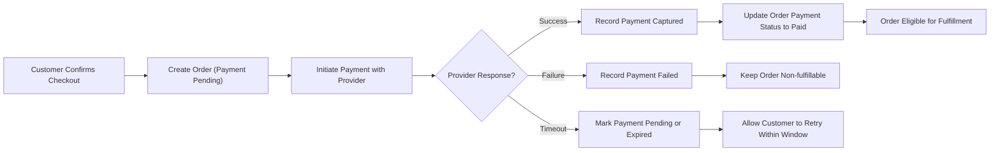
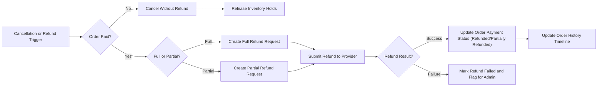

# Payment and Refund Requirements for shoppingMall Backend

## 1. Document Purpose and Scope

This document defines the business requirements for how the shoppingMall platform handles payments, order payment states, order history visibility, cancellations, and refunds. It is written for backend developers and product owners who need a precise description of **what** the system must do from a business perspective, without prescribing **how** to implement it.

Scope of this document:
- Payment processing behavior and interactions with external payment providers at a conceptual level
- Required payment-related states and transitions for orders
- Rules and timelines for cancellations initiated by customers, sellers, and platform admins
- Rules and timelines for refunds, including full and partial refunds
- How payment and refund information appears in order history for different actors
- High-level performance, security, and audit expectations related to payments

Out of scope for this document:
- Technical details of API calls to payment providers
- Database schemas or data models
- User interface layouts or screen designs
- Low-level error codes, HTTP status codes, or infrastructure design

All functional requirements in this document are written using EARS (Easy Approach to Requirements Syntax) templates, with EARS keywords in English and requirement descriptions in en-US natural language.

## 2. Terminology and Actors

### 2.1 Key Business Terms

- **Order**: A confirmed purchase created from a customer’s cart, potentially containing products from one or multiple sellers.
- **Order item**: A single line item within an order, linked to a specific product SKU and quantity.
- **Payment transaction**: A single interaction with an external payment provider to authorize, capture, refund, or void funds for an order.
- **Payment provider**: Any external service that processes financial transactions for the platform (e.g., card processors, digital wallets), referenced generically without vendor names.
- **Authorization**: A temporary hold on customer funds initiated during checkout, awaiting capture.
- **Capture**: The action that transfers authorized funds from the customer to the platform or seller accounts.
- **Settlement**: The completion of the financial transfer from the payment provider to the platform or sellers, which may occur asynchronously.
- **Refund**: A payment transaction that returns funds to the customer for part or all of an order.
- **Chargeback**: A dispute initiated through the customer’s bank or card issuer, resulting in a forced reversal of funds.
- **Cancellation**: The action of invalidating an order, such that it will not be fulfilled. This may or may not involve a refund depending on payment state.
- **Dispute**: A formal complaint raised by a customer about an order, payment, or refund, handled by sellers and/or platformAdmin.

### 2.2 Actors

The following actors are relevant for payment and refund processes:

- **guestUser**: Unauthenticated visitor who can browse products and build a temporary cart, but cannot place orders or view order history.
- **customer**: Authenticated end user who places orders, pays, views order history, requests cancellations and refunds, and tracks their financial transactions.
- **seller**: Merchant responsible for managing products, inventory, and order fulfillment for orders that contain their products. Sellers participate in decisions about refunds and disputes for their orders.
- **platformAdmin**: Platform operator with global visibility and authority to manage orders, refunds, disputes, and financial adjustments according to platform policy.

## 3. Payment Processing Requirements

### 3.1 Supported Payment Concepts

Business assumptions:
- The platform supports multiple conceptual payment methods (such as credit/debit card, bank transfer, or digital wallet) through one or more external payment providers.
- The platform does not store sensitive payment instrument details directly and relies on tokens or references returned by providers.

EARS requirements:
- THE shoppingMall payment subsystem SHALL treat all external payment providers as abstract services that accept a payment request and return a success or failure result with a reference identifier.
- THE shoppingMall payment subsystem SHALL support at least one online immediate payment method where payment authorization occurs during checkout.
- WHERE a payment provider supports distinct authorization and capture steps, THE shoppingMall payment subsystem SHALL track these steps separately in its business records.
- WHERE a payment provider performs immediate capture without separate authorization, THE shoppingMall payment subsystem SHALL treat the payment as both authorized and captured at the moment of provider success.

### 3.2 Payment Initiation from Checkout

Payment is initiated after the customer completes the checkout flow defined in the cart and order document.

EARS requirements:
- WHEN a customer confirms checkout for a cart, THE shoppingMall payment subsystem SHALL create a new order in a "payment pending" state before initiating any external payment request.
- WHEN a customer confirms checkout, THE shoppingMall payment subsystem SHALL initiate a payment transaction request to the selected payment provider for the total payable amount of the order, including taxes, shipping, and discounts according to current business rules.
- IF a payment initiation attempt fails before any provider confirmation is received, THEN THE shoppingMall payment subsystem SHALL keep the order in a "payment failed" or equivalent non-payable state and SHALL not mark the order as paid or ready for fulfillment.
- IF a customer abandons the payment process without provider confirmation (for example by closing the payment page), THEN THE shoppingMall payment subsystem SHALL leave the order in a "payment pending" or "payment expired" state according to configured timeouts and SHALL not proceed to fulfillment.

### 3.3 Payment Authorization, Capture, and Settlement

EARS requirements:
- WHEN a payment provider returns a successful authorization response, THE shoppingMall payment subsystem SHALL record a payment transaction with status "authorized" and SHALL associate it with the corresponding order.
- WHEN a payment provider returns a successful capture response, THE shoppingMall payment subsystem SHALL record a payment transaction with status "captured" and SHALL update the order payment status accordingly.
- WHERE the platform business policy requires capture only after certain checks (such as fraud checks or stock confirmation), THE shoppingMall payment subsystem SHALL delay the capture request until those checks are satisfied and SHALL keep the order in a state that is not yet fully paid.
- WHILE a payment is in "authorized" but not "captured" state, THE shoppingMall payment subsystem SHALL prevent shipment-related status transitions that assume funds are captured, such as "shipped" or "completed".
- IF a capture request fails after a successful authorization, THEN THE shoppingMall payment subsystem SHALL transition the payment transaction to a "capture failed" state, SHALL prevent order fulfillment, and SHALL provide enough information for platformAdmin and seller, via their views, to decide on reattempts or cancellation.

### 3.4 Handling Payment Success

EARS requirements:
- WHEN a payment is successfully captured or treated as captured by the provider, THE shoppingMall payment subsystem SHALL update the order payment status to indicate that it is fully paid.
- WHEN an order becomes fully paid, THE shoppingMall payment subsystem SHALL allow the order to enter fulfillment states (such as "processing" and "ready to ship") according to the fulfillment requirements document.
- WHEN a payment succeeds, THE shoppingMall payment subsystem SHALL ensure that the order total, currency, and captured amount are consistent; IF inconsistencies are detected, THEN THE shoppingMall payment subsystem SHALL flag the order for platformAdmin review and SHALL prevent automatic fulfillment until resolved.
- WHEN a payment is successfully processed, THE shoppingMall payment subsystem SHALL provide the customer-facing order views with a stable payment reference identifier in order history so the customer can verify the transaction with their financial institution if needed.

### 3.5 Handling Payment Failure, Timeouts, and Retries

EARS requirements:
- IF a payment provider explicitly returns a failure result (for example, insufficient funds or declined card), THEN THE shoppingMall payment subsystem SHALL mark the payment transaction as "failed" and SHALL keep the order in a non-fulfillable state.
- IF a payment transaction fails, THEN THE shoppingMall payment subsystem SHALL allow the customer, through appropriate flows, to reattempt payment for the same order within a defined business-configurable time window, provided that the order has not been cancelled or expired.
- WHEN a payment attempt times out without a confirmation from the provider within the expected timeframe, THE shoppingMall payment subsystem SHALL treat the transaction as "timeout" and SHALL either mark the order as "payment expired" or keep it as "payment pending" with clear indication that the payment outcome is unknown.
- IF a payment timeout is later followed by a delayed provider success notification, THEN THE shoppingMall payment subsystem SHALL reconcile the order and payment statuses to treat the order as paid, provided that the order has not already been cancelled or replaced, and SHALL record an audit entry describing the delayed confirmation.
- IF a payment timeout is later followed by a delayed provider failure notification, THEN THE shoppingMall payment subsystem SHALL keep or move the order to a "payment failed" state and SHALL not allow fulfillment without a new successful payment.

### 3.6 Partial Payments and Multi-seller Orders

In multi-seller scenarios, a single customer order may contain items from multiple sellers, but the payment to the platform is usually a single transaction.

EARS requirements:
- THE shoppingMall payment subsystem SHALL treat customer-facing payment as a single payable amount per order, even when the order contains products from multiple sellers.
- WHERE internal settlement splits the payment among multiple sellers, THE shoppingMall payment subsystem SHALL maintain internal allocation records at the order item level, without exposing these allocations as separate payments to the customer.
- WHERE the business model later supports partial payments (such as deposits or installments), THE shoppingMall payment subsystem SHALL represent each partial payment as a distinct payment transaction linked to the same order, with clear indication of which portion of the order total each transaction covers.

## 4. Order Payment Statuses

### 4.1 Payment-related Order States

The platform must maintain clear payment-related states for each order.

Representative payment-related states (names are conceptual and may differ in implementation):
- "payment pending"
- "payment in progress"
- "payment authorized"
- "payment captured" (fully paid)
- "payment failed"
- "payment expired"
- "refunded" (full)
- "partially refunded"

EARS requirements:
- THE shoppingMall payment subsystem SHALL maintain a payment status for each order that is separate from shipment or fulfillment status.
- THE shoppingMall payment subsystem SHALL allow only one primary active payment status per order at any time.
- WHEN an order is created at checkout, THE shoppingMall payment subsystem SHALL assign an initial payment status equivalent to "payment pending".
- WHEN payment succeeds, THE shoppingMall payment subsystem SHALL set the payment status to a state equivalent to "payment captured".
- WHEN payment fails and cannot be reattempted, THE shoppingMall payment subsystem SHALL set the payment status to a state equivalent to "payment failed".
- WHEN all captured amounts for an order are fully refunded, THE shoppingMall payment subsystem SHALL set the payment status to a state equivalent to "refunded".
- WHEN only a portion of the captured amount has been refunded, THE shoppingMall payment subsystem SHALL set the payment status to a state equivalent to "partially refunded".

### 4.2 State Transitions and Business Rules

EARS requirements:
- WHEN an order is in "payment pending", THE shoppingMall payment subsystem SHALL allow transitions to "payment in progress", "payment failed", "payment expired", or "payment captured" based on payment outcomes.
- WHEN an order is in "payment captured", THE shoppingMall payment subsystem SHALL allow transitions to "partially refunded" or "refunded" based on refund processing.
- WHEN an order is in "payment failed" or "payment expired" and the business rules allow retry, THE shoppingMall payment subsystem SHALL allow a transition back to "payment in progress" upon a new payment attempt.
- IF an order has payment status "refunded", THEN THE shoppingMall payment subsystem SHALL prevent further shipment or fulfillment actions for that order.
- IF an order payment status changes due to asynchronous provider events (such as delayed capture confirmation), THEN THE shoppingMall payment subsystem SHALL update the state consistently and SHALL append the event to an audit trail.

### 4.3 Relationship between Order Status and Payment Status

EARS requirements:
- IF an order payment status is not in a paid or authorized state, THEN THE shoppingMall order management subsystem SHALL prevent the order from moving into shipment states such as "shipped" or "delivered".
- WHILE an order is in a state equivalent to "payment in progress", THE shoppingMall order management subsystem SHALL prevent irreversible order actions such as permanent cancellation, except where business rules explicitly allow it.
- WHEN an order is cancelled before payment capture, THE shoppingMall payment subsystem SHALL attempt to void the authorization where supported by the provider and SHALL record the result in payment history.
- WHEN an order is cancelled after full payment capture, THE shoppingMall payment subsystem SHALL initiate a refund process instead of voiding the payment, according to cancellation and refund rules.

### 4.4 Seller and Admin Visibility of Payment States

EARS requirements:
- THE shoppingMall payment subsystem SHALL provide seller-facing views with payment-related information for their orders sufficient to know whether they may proceed with fulfillment, without exposing sensitive customer payment details.
- THE shoppingMall payment subsystem SHALL provide platformAdmin-facing views with full visibility into payment statuses, payment transactions, refunds, and chargebacks for all orders.
- WHEN a payment status changes for an order, THE shoppingMall payment subsystem SHALL ensure that seller and platformAdmin views reflect the updated status within a timeframe consistent with non-functional requirements.

## 5. Order History Access

### 5.1 Customer Order History Requirements

EARS requirements:
- THE shoppingMall order history subsystem SHALL provide customer-facing views with access to a chronological list of their past and current orders including payment and refund information.
- WHEN a customer views an order in order history, THE shoppingMall order history subsystem SHALL display at least the order creation date, order identifier, payment status, total amount paid, and any refunded amounts.
- WHEN a refund is processed for an order, THE shoppingMall order history subsystem SHALL record the refund details in order history, including refunded amount, date, and high-level reason category.
- IF a customer has no completed orders, THEN THE shoppingMall order history subsystem SHALL return an empty order history list without error.

### 5.2 Seller View of Orders and Payouts

EARS requirements:
- THE shoppingMall seller order subsystem SHALL provide seller with access to order lists that include only orders containing one or more of their products.
- WHEN a seller views order details, THE shoppingMall seller order subsystem SHALL display the portion of the order amount that relates to that seller’s products, as well as payment status relevant to their fulfillment decisions.
- WHERE the business model involves periodic payouts to sellers, THE shoppingMall payout subsystem SHALL maintain records of payout calculations and SHALL link them to underlying orders and refunds for audit purposes.

### 5.3 Admin Access to Global Order History

EARS requirements:
- THE shoppingMall admin order subsystem SHALL provide platformAdmin with search and filtering capabilities over all orders, payment statuses, refunds, and disputes.
- WHEN platformAdmin views an order, THE shoppingMall admin order subsystem SHALL display complete payment and refund history, including all payment transactions, attempts, and external provider reference identifiers where available.
- THE shoppingMall admin order subsystem SHALL allow platformAdmin to filter orders by payment-related criteria such as "payment failed", "partially refunded", "refunded", "chargeback", and by date ranges, seller, or customer.

### 5.4 Filtering, Sorting, and Export Expectations

EARS requirements:
- THE shoppingMall order history subsystem SHALL allow customer to sort order history by at least order date and optionally by order status or amount.
- THE shoppingMall seller order subsystem SHALL allow seller to filter their order lists by payment status and timeframe so they can focus on orders ready for fulfillment or requiring refund handling.
- WHERE the business requires data export for accounting, THE shoppingMall admin order subsystem SHALL provide platformAdmin with mechanisms to export order and payment history data in a commonly accepted, non-proprietary format.

## 6. Cancellation Rules

### 6.1 Customer-initiated Cancellations (Before Shipment)

EARS requirements:
- WHEN a customer requests cancellation for an order whose payment status is "payment pending", THE shoppingMall cancellation subsystem SHALL cancel the order without initiating any payment transaction and SHALL release any temporary holds not yet confirmed by the provider where possible.
- WHEN a customer requests cancellation for an order whose payment status is "payment captured" and whose fulfillment status is still in an early stage (for example "processing" or "not shipped"), THE shoppingMall cancellation subsystem SHALL treat the request as a cancellation with refund eligibility according to refund rules.
- IF an order is already in a fulfillment status equivalent to "shipped" or "delivered", THEN THE shoppingMall cancellation subsystem SHALL not allow direct cancellation by the customer and SHALL instead direct the process toward returns or refunds according to the refund requirements document.
- THE shoppingMall cancellation subsystem SHALL require the customer to choose a reason category when submitting a cancellation request (for example "changed mind", "ordered by mistake", "found cheaper elsewhere", "delivery taking too long", "other"), and SHALL record this information for reporting.

### 6.2 Seller-initiated Cancellations (Stock or Operational Issues)

EARS requirements:
- WHEN a seller identifies that they cannot fulfill an order item due to stock or operational issues before shipment, THE shoppingMall cancellation subsystem SHALL allow the seller to request cancellation for affected items with a reason category (for example "out of stock", "pricing error", "shipping restriction", "logistics failure").
- WHERE an order contains multiple items from multiple sellers, THE shoppingMall cancellation subsystem SHALL allow seller to cancel only the items they own, resulting in partial cancellation of the order.
- WHEN seller-initiated cancellation affects one or more items in a fully paid order, THE shoppingMall cancellation subsystem SHALL trigger a refund process for the cancelled items in accordance with refund rules.
- IF repeated seller-initiated cancellations indicate potential abuse or poor performance, THEN THE shoppingMall admin reporting subsystem SHALL provide platformAdmin with visibility and reporting to take appropriate actions according to platform policy.

### 6.3 Admin-initiated Cancellations (Fraud or Policy Violations)

EARS requirements:
- WHEN platformAdmin detects fraud, payment anomalies, or policy violations, THE shoppingMall cancellation subsystem SHALL allow platformAdmin to cancel orders or order items regardless of seller or customer actions, subject to internal governance rules.
- WHEN platformAdmin cancels an order that has been paid, THE shoppingMall cancellation subsystem SHALL initiate refunds for the appropriate amounts and SHALL record the reason as an admin action with a specific category (for example "suspected fraud", "policy violation", "duplicate order", "customer safety concern").
- THE shoppingMall cancellation subsystem SHALL ensure that admin-initiated cancellations are logged with the acting admin identity, timestamp, and justification text for auditability.

### 6.4 Time Windows and Constraints per Order State

EARS requirements:
- THE shoppingMall cancellation subsystem SHALL support business-configurable time windows during which customers can request order cancellation after payment, for example up to a certain number of hours before shipment.
- WHERE time windows are configured, THE shoppingMall cancellation subsystem SHALL enforce them consistently and SHALL prevent cancellation requests outside allowed time unless overridden by seller or platformAdmin.
- WHERE local regulations require longer cooling-off periods for cancellations, THE shoppingMall cancellation subsystem SHALL support configuration of different time windows based on market or product category.

### 6.5 Effects of Cancellation on Inventory and Payments

EARS requirements:
- WHEN an order or order item is cancelled before payment capture, THE shoppingMall cancellation subsystem, together with the inventory subsystem, SHALL release any reserved inventory quantities associated with that order or item.
- WHEN an order or order item is cancelled after payment capture, THE shoppingMall cancellation subsystem, together with the payment and inventory subsystems, SHALL ensure that the cancellation process is tightly linked to refund processing so that inventory and financial records remain consistent.
- IF a cancellation action fails to trigger the expected refund due to external payment provider issues, THEN THE shoppingMall cancellation subsystem SHALL flag the order for manual review by platformAdmin and SHALL not silently mark the order as fully resolved.

## 7. Refund and Dispute Handling

### 7.1 Refund Types: Full vs Partial

EARS requirements:
- THE shoppingMall refund subsystem SHALL support full refunds where the entire captured amount for an order is returned to the customer.
- THE shoppingMall refund subsystem SHALL support partial refunds where only part of the captured amount is returned, such as when one item in a multi-item order is cancelled or returned.
- WHEN a refund is created, THE shoppingMall refund subsystem SHALL record at least the refunded amount, currency, associated order, responsible actor (seller or platformAdmin), and reason category.
- WHEN multiple refunds are created for the same order, THE shoppingMall refund subsystem SHALL keep a cumulative record of refunded amounts and SHALL ensure that the total refunded amount does not exceed the total captured amount for that order.

### 7.2 Refund Triggers and Eligibility Conditions

EARS requirements:
- WHEN a customer cancels an order that has been paid but not shipped, THE shoppingMall refund subsystem SHALL treat the order as eligible for a refund of the full captured amount, subject to any applicable fees defined by platform policy and regulations.
- WHEN a customer cancels or returns only part of an order, THE shoppingMall refund subsystem SHALL treat the relevant items as eligible for partial refund equal to the item price plus associated taxes and any shipping portions to be refunded according to business rules.
- WHEN seller cancels items due to their own stock or operational issues, THE shoppingMall refund subsystem SHALL treat the affected amounts as eligible for full refund to the customer, without penalizing the customer.
- WHERE products are non-refundable by business policy (for example certain digital goods or personalized items), THE shoppingMall refund subsystem SHALL enforce these policies by preventing automatic refund eligibility, while still allowing platformAdmin to override in exceptional cases.

### 7.3 Refund Approval Flows (Seller vs Admin)

EARS requirements:
- WHERE platform policy allows sellers to approve refunds for their orders, THE shoppingMall refund subsystem SHALL allow seller to create refund requests for orders they own, within the limits of not exceeding the captured amounts for their items.
- WHERE refund requests require platformAdmin approval (for example high-value refunds or complex disputes), THE shoppingMall refund subsystem SHALL support a two-step process where seller proposes the refund and platformAdmin reviews and approves or rejects.
- WHEN a refund request is approved, THE shoppingMall refund subsystem SHALL initiate a refund transaction through the payment provider and SHALL track its status until completion or failure.
- IF a refund transaction fails at the payment provider, THEN THE shoppingMall refund subsystem SHALL mark the refund record as "refund failed" and SHALL notify the responsible actors (seller and/or platformAdmin) for manual follow-up.

### 7.4 Dispute and Chargeback Management

EARS requirements:
- WHEN a customer reports a problem with an order that they believe justifies a refund but does not fit automated rules, THE shoppingMall dispute subsystem SHALL allow the customer to create a dispute record with a description and optional evidence references.
- THE shoppingMall dispute subsystem SHALL allow seller to respond to disputes for their orders with their explanation and evidence.
- THE shoppingMall dispute subsystem SHALL allow platformAdmin to view the full dispute history and make a final decision, which may result in a refund, partial refund, replacement, or rejection of the claim.
- IF a chargeback notification is received from a payment provider, THEN THE shoppingMall dispute subsystem SHALL create or update a dispute record reflecting the chargeback, SHALL adjust internal payment and refund statuses, and SHALL provide platformAdmin with information for further action.

### 7.5 Refund Timelines and User Communication

EARS requirements:
- THE shoppingMall refund subsystem SHALL provide customers, through customer-facing views, with clear expectations about how long refunds typically take to appear on their payment method once approved (for example a range of business days), and these expectations SHALL be configurable at the business level.
- WHEN a refund is approved and the refund transaction is successfully initiated, THE shoppingMall refund subsystem SHALL reflect a "refund pending" or equivalent state in the customer’s order history until confirmation from the payment provider is received.
- WHEN the payment provider confirms refund completion, THE shoppingMall refund subsystem SHALL update the refund record to "refund completed" and SHALL ensure that this status is visible in the customer’s order history and admin views.

### 7.6 Representation of Refunds in Order History

EARS requirements:
- THE shoppingMall order history subsystem SHALL show refund activity as part of the order timeline for customer, seller, and platformAdmin, including dates and amounts.
- WHEN a full refund is completed, THE shoppingMall order history subsystem SHALL clearly label the order as fully refunded so that customers do not expect additional charges or delivery for that order.
- WHEN partial refunds are completed, THE shoppingMall order history subsystem SHALL clearly show the remaining net charged amount for the order after all refunds.

## 8. Non-functional Expectations Related to Payments

### 8.1 Performance and Responsiveness Requirements

EARS requirements:
- WHEN a customer submits a payment during checkout under normal load, THE shoppingMall payment subsystem SHALL provide a definitive success or failure result within a target time that feels immediate for typical network conditions, and this target SHALL be configurable for different payment methods.
- WHEN customers access order history, THE shoppingMall order history subsystem SHALL return a list of orders including payment and refund summaries within a few seconds for typical account sizes, in line with global non-functional requirements.
- WHILE asynchronous payment or refund confirmations are pending, THE shoppingMall payment and refund subsystems SHALL maintain consistent and understandable intermediate statuses to avoid confusing customers and support teams.

### 8.2 Security and Compliance Expectations (Business-level)

EARS requirements:
- THE shoppingMall payment subsystem SHALL avoid storing raw payment instrument details such as full card numbers or sensitive authentication data and SHALL rely on tokens or references provided by payment providers.
- THE shoppingMall payment and refund subsystems SHALL treat all payment and refund records as sensitive data and SHALL restrict access based on actor roles and least-privilege principles.
- WHERE applicable regulations require specific handling of financial data and refunds, THE shoppingMall payment and refund subsystems SHALL support configuration and data retention rules to meet those obligations.

### 8.3 Auditability and Traceability of Financial Events

EARS requirements:
- THE shoppingMall auditing subsystem SHALL maintain an immutable audit trail of key financial events, including payment authorizations, captures, refunds, cancellations affecting payments, and chargebacks.
- WHEN any actor (seller or platformAdmin) manually adjusts payment or refund records, THE shoppingMall auditing subsystem SHALL record the acting identity, timestamp, and justification.
- THE shoppingMall auditing subsystem SHALL provide platformAdmin, via admin tools, with reporting views that summarize payment volumes, refund rates, and chargeback rates over time to support risk management and business decisions.

## 9. Mermaid Diagrams

### 9.1 Payment Flow from Checkout to Confirmation

### 9.2 Cancellation and Refund Flow

## 10. Success Criteria and Future Extensions

### 10.1 Success Criteria

From a business perspective, payment and refund handling in shoppingMall is considered successful when:

- Orders cannot proceed to fulfillment stages unless payment has been successfully captured or otherwise authorized according to business rules.
- Customers can reliably see accurate, up-to-date payment and refund information in their order history without confusion.
- Sellers have enough visibility into payment status to make correct fulfillment and refund decisions, without exposure to sensitive customer payment data.
- Platform admins can audit and report on all financial operations, including payment attempts, refunds, cancellations, and disputes.
- Refunds and cancellations are processed within clearly defined, configurable timelines that align with customer expectations and legal requirements.

### 10.2 Future Extensions (Non-binding)

Potential enhancements that may be considered in future:

- Support for scheduled or recurring payments (subscriptions) using the same payment status model.
- Support for advanced payment methods such as installments, buy-now-pay-later services, or loyalty points.
- Support for automated risk scoring and fraud detection rules that influence authorization and capture timing.

These possible extensions should be considered when designing the overall payment and refund domain model so that future changes can be integrated without disrupting the core flows defined here.