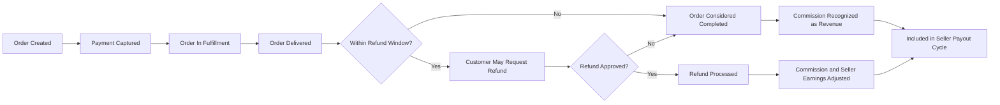

# Business Model and Goals for shoppingMall E-commerce Platform

## 1. Introduction and Scope

The shoppingMall e-commerce platform operates as a multi-seller marketplace where multiple independent sellers list products, customers purchase those products, and the platform operator earns revenue primarily from transaction-related fees and value-added services.

THE business model specification for shoppingMall SHALL define:
- What revenue mechanisms the platform relies on.
- What fee and commission rules apply to orders, cancellations, and refunds.
- What growth and retention strategies the platform must support and measure.
- What key performance indicators (KPIs) are needed for monitoring business health.
- What risk, compliance, and governance expectations exist around monetary flows.

THE specification SHALL describe these topics strictly in business terms and SHALL avoid prescribing any technical implementation details (such as APIs, database schemas, or infrastructure choices).

### 1.1 In-Scope Topics

THE business model for shoppingMall SHALL cover at least the following areas:
- Market problem and opportunity that justify the platform.
- Value propositions for customers, sellers, and the platform operator.
- Revenue streams, including commissions, customer-facing fees, and optional seller subscriptions or promotional fees.
- Fee and commission concepts and their interaction with cancellations, refunds, and chargebacks.
- Growth and retention strategies for both customers and sellers.
- KPIs that the backend must be able to compute and support.
- Business-level risk, compliance, and governance requirements relating to revenue, payouts, and disputes.

### 1.2 Out-of-Scope Topics

THE business model SHALL not define:
- Technical architecture, microservice boundaries, or API specifications.
- Database schema, table structures, or storage technologies.
- Frontend user interface layouts or visual design.

THE development team SHALL interpret this document purely as a definition of **what** business behaviors and data concepts must be supported, not **how** they are implemented.

## 2. Market Problem and Opportunity

### 2.1 Customer and Seller Pain Points

Customers frequently face fragmented e-commerce experiences, including:
- Difficulty comparing similar products across different sellers.
- Low transparency regarding shipping times, return policies, and refund timelines.
- Unclear or manual processes for cancellations and refunds.
- Limited trust in less-known sellers.

Sellers, particularly small and mid-sized merchants, face challenges such as:
- Limited access to large pools of customers.
- High cost and complexity of building and operating an independent online store.
- Lack of standardized tools for inventory management, sales analytics, and customer feedback.

### 2.2 shoppingMall Opportunity

shoppingMall positions itself as a centralized multi-seller marketplace that:
- Aggregates diverse sellers under a unified catalog and checkout experience.
- Provides customers with a single account, unified order tracking, and consistent cancellation/refund flows.
- Provides sellers with standardized tools for product listing, SKU management, and order handling.
- Enables the platform operator to generate revenue from commissions, fees, and future value-added services.

Ubiquitous requirements:
- THE platform business model SHALL assume that multiple independent sellers can list products simultaneously in overlapping categories.
- THE platform business model SHALL assume that a single customer order MAY contain items from multiple sellers.
- THE platform business model SHALL require that all revenue and cost-related data can be broken down by seller, product category, and time period for analysis.

## 3. Value Proposition

### 3.1 Value for Customers

Customers seek convenience, reliability, and transparency.

Ubiquitous requirements:
- THE platform SHALL allow customers to discover and purchase products from multiple sellers using a single account and a single integrated checkout flow.
- THE platform SHALL expose clear order status, shipping status, and refund status information so that customers can understand where their money and goods are at all times.
- THE platform SHALL support customer-friendly refund and cancellation processes that are consistent across sellers, subject to category-specific policies.
- THE platform SHALL use product reviews, ratings, and seller performance indicators to help customers decide what to buy.

### 3.2 Value for Sellers

Sellers seek reach, standardized tools, and predictable earnings.

Ubiquitous requirements:
- THE platform SHALL allow sellers to onboard without building their own independent store infrastructure.
- THE platform SHALL provide sellers with tools to list products, manage SKUs and inventory, and monitor orders and refunds related to their catalog.
- THE platform SHALL allow sellers to see business-level metrics such as sales volumes, refund rates, and basic customer feedback related to their products.
- THE platform SHALL ensure that sellers can understand how much they earn per order after commissions, fees, and refunds.

### 3.3 Value for Platform Operator

The platform operator seeks profitable, sustainable revenue and controllable risk.

Ubiquitous requirements:
- THE platform business model SHALL define commission and fee structures that can be configured per category, per seller, and per campaign without code changes.
- THE platform business model SHALL support tracking of gross merchandise value (GMV), net merchandise value (NMV), platform revenue, and take rate.
- THE platform business model SHALL support mechanisms for reducing fraud, abuse, and excessive losses due to chargebacks and disputes.

## 4. Revenue Streams

### 4.1 Transaction Commissions

The primary revenue stream is commission on each successfully paid and completed order item.

Event-driven requirements:
- WHEN a customer payment is successfully captured for an order, THE platform business logic SHALL calculate a commission amount for each order line item according to active commission rules.
- WHEN an order line item reaches a business-defined completed state (for example, after delivery and beyond the standard refund window), THE platform business logic SHALL recognize the associated commission as **earned platform revenue** for that item.

Business rules:
- THE platform SHALL define a default global commission rule that applies when no more specific rule exists.
- WHERE category-specific commission is configured, THE platform SHALL apply the commission rule defined for the product’s primary category.
- WHERE seller-specific commission overrides exist, THE platform SHALL use the seller-specific rules according to a defined priority order.
- THE commission base for each item SHALL be clearly defined, for example: item price after seller discounts but before customer-facing shipping fees and taxes.

Unwanted behavior requirements:
- IF an order item is fully refunded for any reason, THEN THE platform SHALL treat the corresponding commission for that item as not earned and SHALL reverse or cancel that commission.
- IF an order item is partially refunded (for example, quantity reduction or partial price refund), THEN THE platform SHALL reduce the commission in proportion to the refunded amount or quantity as defined by policy.
- IF a chargeback is received from a payment provider for an item that previously generated commission revenue, THEN THE platform SHALL mark the commission as disputed and SHALL support reducing future payout or recognizing a negative revenue adjustment.

### 4.2 Seller Subscription and Service Fees (Optional)

In addition to transaction commissions, the platform MAY charge recurring or one-time fees to sellers.

Optional feature requirements:
- WHERE subscription plans for sellers are offered, THE platform SHALL represent for each seller:
  - Subscription plan identifier.
  - Billing cycle (for example monthly, yearly).
  - Subscription fee amount.
  - Subscription status (active, past due, cancelled, expired).
- WHEN a seller subscribes or upgrades to a paid plan, THE platform SHALL record the effective date, fees, and benefits at a business level (such as higher exposure or additional analytics).
- WHERE one-time service fees are charged (for example, paid onboarding support or catalog optimization), THE platform SHALL associate these fees with the seller and the service, and SHALL treat them as part of platform revenue.

Unwanted behavior requirements:
- IF a seller fails to pay subscription or service fees by a business-defined grace period, THEN THE platform SHALL mark the subscription or service as inactive and SHALL apply corresponding business restrictions (for example, reduced visibility or inability to list new products).
- IF subscription fees are refunded due to service-level issues, THEN THE platform SHALL recognize a negative adjustment to subscription revenue and SHALL track the reason.

### 4.3 Customer-Facing Fees and Surcharges

The platform MAY charge additional fees to customers, such as shipping fees, packaging fees, or payment method surcharges.

Event-driven requirements:
- WHEN a customer places an order, THE platform pricing logic SHALL calculate customer-facing fees according to configured rules and SHALL include them in the order total.

Business rules:
- THE platform SHALL distinguish between:
  - Platform-owned fees that contribute to platform revenue (for example a service fee).
  - Pass-through fees that are fully remitted to carriers or third parties (for example pure courier charge).
- WHERE certain fees are designated as refundable (for example shipping fee when the entire order is cancelled before shipment), THE platform SHALL include these fees in refund calculations according to policy.
- WHERE certain fees are designated as non-refundable (for example payment method surcharges), THE platform SHALL exclude these fees from customer refund amounts even if the order is refunded.

Unwanted behavior requirements:
- IF business rules specify that a fee must never exceed a defined maximum percentage or amount relative to the order value, THEN THE platform SHALL validate fee calculations against those limits and SHALL reject any calculation that exceeds them.

### 4.4 Promotional Subsidies and Discounts

Promotions can impact who bears the cost of discounts (seller or platform).

Business rules:
- THE platform SHALL distinguish discounts funded by sellers (for example seller’s own coupon or markdown) from discounts funded by the platform (for example platform-wide campaigns).
- WHERE a discount is seller-funded, THE platform SHALL reduce the seller’s gross sales accordingly but SHALL still calculate commission according to defined rules (for example commission on discounted price).
- WHERE a discount is platform-funded, THE platform SHALL treat the undiscounted line-item price as the basis for seller earnings and commission, and SHALL recognize the discount as a promotional cost borne by the platform.

Event-driven requirements:
- WHEN a promotional campaign applies to an order or line item, THE platform SHALL record the campaign identifier and the split of discount responsibility (seller vs platform) so that later reporting can attribute costs correctly.

### 4.5 Advertising, Boosts, and Future Revenue Streams (Optional)

Optional feature requirements:
- WHERE advertising placements or boosted listings are sold to sellers, THE platform SHALL represent each such purchase with:
  - Seller identity.
  - Placement type or campaign identifier.
  - Fee amount and billing period.
- WHERE advertising fees are charged based on impressions or clicks, THE platform SHALL record aggregated counts of impressions and clicks per advertising agreement at a business level.

## 5. Fee and Commission Concepts

### 5.1 Commission Rule Hierarchy

Commission rules may exist at multiple levels: global, category, seller, and campaign.

Ubiquitous requirements:
- THE platform SHALL define for each order line which single commission rule was applied and why.
- THE platform SHALL support a deterministic priority order such as:
  1. Specific campaign-based commission rule (if applicable).
  2. Seller-specific commission rule.
  3. Category-specific commission rule.
  4. Global default commission rule.

Event-driven requirements:
- WHEN multiple commission rules could logically apply to a line item, THE platform SHALL select the rule with highest priority according to configured hierarchy and SHALL record that decision.

Unwanted behavior requirements:
- IF no applicable commission rule is found for an order item, THEN THE platform SHALL prevent the order from being finalized until a valid rule is configured or an explicit decision is made by business stakeholders.

### 5.2 Order Price Components

Each order’s monetary structure must be decomposable for reporting and settlement.

Ubiquitous requirements:
- THE platform SHALL represent for each order at least the following monetary components:
  - Item subtotal (sum of line items before discounts and fees).
  - Item-level discounts.
  - Order-level discounts.
  - Shipping fees and other delivery-related charges.
  - Payment method surcharges (if any).
  - Taxes where applicable.
  - Total amount charged to the customer.
- THE platform SHALL represent for each line item:
  - Seller gross amount before commission.
  - Platform commission amount.
  - Net amount owed to the seller after commission (and after any platform-funded promotions).

### 5.3 Refunds, Cancellations, and Chargebacks

Event-driven requirements:
- WHEN a cancellation or refund is approved for an order item, THE platform SHALL compute:
  - Customer refund amount (including or excluding certain fees based on policy).
  - Reduction in seller earnings.
  - Reduction or reversal of platform commission.
- WHEN a chargeback is received from a payment provider, THE platform SHALL mark affected items with a chargeback status and SHALL link this to negative adjustments for both seller earnings and platform revenue.

Unwanted behavior requirements:
- IF a refund or cancellation is requested for an amount that exceeds the original customer payment for the relevant items, THEN THE platform SHALL reject the request as invalid.
- IF a refund is attempted more than once for the same item, THEN THE platform SHALL prevent duplicate refunds by enforcing maximum refundable amounts per line item.

### 5.4 Payouts to Sellers

Seller payouts represent the transfer of accumulated net earnings from the platform to the seller.

State-driven requirements:
- WHILE an order is within the standard refund or chargeback window, THE platform SHALL treat associated seller earnings as **pending** and not yet eligible for payout.
- WHEN an order passes the refund and chargeback window without any open disputes, THE platform SHALL treat the related seller earnings as **payout-eligible**.

Event-driven requirements:
- WHEN a payout cycle runs (for example weekly or monthly), THE platform SHALL sum all payout-eligible earnings per seller and SHALL create a payout record that includes:
  - Seller identity.
  - Payout period.
  - Gross seller earnings included.
  - Adjustments (for example prior negative balances or manual corrections).
  - Final payout amount to be transferred.

Unwanted behavior requirements:
- IF a refund or chargeback is applied to an order after a payout that included the relevant earnings, THEN THE platform SHALL track a negative adjustment for the seller, such that future payouts are reduced or a negative balance is recorded.
- IF a seller’s negative balance exceeds a business-defined threshold, THEN THE platform SHALL flag this seller for risk review and MAY suspend payouts or seller operations according to policy.

## 6. Growth and Retention Strategy

### 6.1 Customer Acquisition and Activation

Event-driven requirements:
- WHEN a guestUser registers as a customer, THE platform SHALL record a customer acquisition event including registration timestamp and basic acquisition channel where known.
- WHEN a newly registered customer completes their first paid order, THE platform SHALL record a conversion event that can be used to measure time-to-first-purchase.

Business rules:
- THE platform SHALL support segmentation of customers by acquisition channel, registration date, and first-order date to allow analysis of marketing effectiveness.

### 6.2 Customer Retention and Engagement

Event-driven requirements:
- WHEN a customer completes each paid order, THE platform SHALL record that event such that the number of distinct customers with one order, two orders, and three or more orders per period can be computed.
- WHEN a customer adds items to a wishlist or marks products as favorites, THE platform SHALL record these actions in a way that can be used for future engagement strategies (for example targeted campaigns), without prescribing any specific campaign engine.

Business rules:
- THE platform SHALL support identification of inactive customers based on configurable criteria such as no login or no order for a defined number of days.
- THE platform SHALL support highlighting high-value customers based on criteria such as total spend over a period or frequency of orders, for business-led retention initiatives.

### 6.3 Seller Acquisition and Quality

Event-driven requirements:
- WHEN a seller completes onboarding and becomes active, THE platform SHALL record the activation date and basic seller attributes (such as category focus or region).
- WHEN a seller receives their first paid order, THE platform SHALL record a seller activation metric that can be used to monitor seller ramp-up speed.

Business rules:
- THE platform SHALL support classification of sellers into tiers (for example new, standard, premium) based on performance metrics such as GMV, refund rate, and ratings.
- THE platform SHALL support applying different business policies by seller tier, such as access to promotions, support levels, or commission variations.

### 6.4 Promotions and Campaign Measurement

Optional feature requirements:
- WHERE marketing campaigns are used (for example voucher codes, category-wide discounts, seasonal sales), THE platform SHALL record for each affected order or line item the associated campaign identifier.
- THE platform SHALL enable computation of campaign-level metrics such as GMV, NMV, number of orders, number of new customers acquired, and incremental increase in activity compared to baseline.

## 7. Business KPIs and Targets

### 7.1 Commercial KPIs

Ubiquitous requirements:
- THE platform SHALL enable calculation of **Gross Merchandise Value (GMV)** as the sum of order line item amounts for successfully paid orders within a defined period, before refunds and cancellations.
- THE platform SHALL enable calculation of **Net Merchandise Value (NMV)** as GMV minus the impact of refunded or cancelled items within the same or subsequent periods, depending on selected reporting logic.
- THE platform SHALL enable calculation of **Platform Revenue** as the sum of recognized commissions, platform-owned customer-facing fees, subscription fees, advertising fees, and other monetization sources, net of adjustments.
- THE platform SHALL enable calculation of **Take Rate** as Platform Revenue divided by GMV for a given period.

### 7.2 Customer Behavior KPIs

Ubiquitous requirements:
- THE platform SHALL enable calculation of **Number of Active Customers** in a period based on configurable activity definitions (for example customers with at least one session, one order, or one add-to-cart action in that period).
- THE platform SHALL enable calculation of **New Customers** per period, based on registration date.
- THE platform SHALL enable calculation of **First-Order Conversion Rate** as the proportion of newly registered customers who place at least one order within a defined time window (for example 30 days).
- THE platform SHALL enable calculation of **Repeat Purchase Rate** as the proportion of ordering customers in a period who place more than one order within that period.
- THE platform SHALL enable calculation of **Average Order Value (AOV)** as total GMV divided by number of successfully paid orders in the period.

### 7.3 Seller Performance KPIs

Ubiquitous requirements:
- THE platform SHALL enable calculation of **Seller GMV** per seller and period.
- THE platform SHALL enable calculation of **Seller Net Earnings** per seller and period (seller gross sales minus commissions and seller-borne discounts, before payouts and adjustments).
- THE platform SHALL enable calculation of **Cancellation Rate** per seller as the ratio of cancelled or fully refunded items to successfully paid items over a period.
- THE platform SHALL enable calculation of **Late Shipment Rate** per seller, where relevant shipment timestamps are available.
- THE platform SHALL enable calculation of **Average Product Rating** per seller and per product, using rating data from the reviews and ratings domain.

### 7.4 Operational and Risk KPIs

Ubiquitous requirements:
- THE platform SHALL enable calculation of **Order Fulfillment Time** metrics, such as median time from payment confirmation to shipment, and from shipment to delivery.
- THE platform SHALL enable calculation of **Refund Resolution Time**, such as median time from refund request creation to final decision and completion.
- THE platform SHALL enable tracking of **Dispute Volume** and **Dispute Win/Loss Ratios** (for example customer-favored vs seller-favored outcomes) per seller and per period.
- THE platform SHALL enable tracking of **Chargeback Rate** as the number or value of chargebacks relative to total paid orders, globally and per seller.

## 8. Risk, Compliance, and Governance Considerations

### 8.1 Auditability of Financial Flows

Ubiquitous requirements:
- THE platform SHALL maintain an auditable record of order creation, payment status changes, refunds, chargebacks, commission calculations, and payouts.
- THE platform SHALL ensure that for each financial adjustment (for example refund, manual adjustment, or chargeback), the responsible actor (system, seller, admin) and the reason are recorded at a business level.

### 8.2 Compliance with Financial and Tax Regulations

Business-level expectations:
- THE platform SHALL store financial data (orders, payments, refunds, commissions, payouts) in a way that supports preparation of statutory financial statements and tax filings according to jurisdictions where the business operates.
- THE platform SHALL support multi-period reporting (for example monthly, quarterly, yearly) with consistent cut-off rules based on transaction dates and statuses.

### 8.3 Anti-Fraud and Risk Management

Unwanted behavior requirements:
- IF unusual patterns such as very high refund rates, high chargeback rates, or suspicious ordering behavior are detected for a seller, THEN THE platform SHALL flag the seller for risk review and MAY trigger temporary measures such as delayed payouts, additional verification, or suspension, according to policy.
- IF high-risk payment behavior is detected on a customer account or device (for example multiple declined payments or inconsistent shipping addresses), THEN THE platform SHALL mark the account or device as high risk and MAY require additional verification steps before allowing further orders.

### 8.4 Data Protection for Monetary Information

Business-level privacy expectations:
- THE platform SHALL ensure that detailed payout and commission information is visible only to relevant actors: each seller can see their own payouts and commissions, while admins can see all sellers’ data.
- THE platform SHALL ensure that customers cannot see internal commission or payout breakdowns beyond what is necessary (for example customers see order prices and refunds, but not internal commission splits).

## 9. Conceptual Revenue and Refund Lifecycle Diagram

The conceptual lifecycle below shows how an order evolves from creation to revenue recognition and payout.

This diagram is purely conceptual and SHALL NOT be interpreted as a technical workflow or architecture diagram. It exists to clarify business expectations regarding when commissions are considered tentative, when they are recognized as revenue, and how refunds influence payouts.

## 10. Business-Only Nature of This Document

THE business model and goals described here SHALL be treated as business requirements only.

THE platform SHALL implement these business rules in ways chosen by the development team, including how data is stored, how services are architected, and which external providers are integrated.

THE development team SHALL ensure that any technical implementation, however designed, enables:
- Accurate computation of all defined monetary components and KPIs.
- Traceable and auditable flows from order placement through payment, refund, and payout.
- Adaptability so that changes in commission rates, fee structures, or policies can be applied without rewriting fundamental business logic.

THE business stakeholders SHALL use this document to decide commercial terms (such as commission levels, refund windows, and promotional budgets), while recognizing that technical teams retain full autonomy over **how** these decisions are implemented in the system.