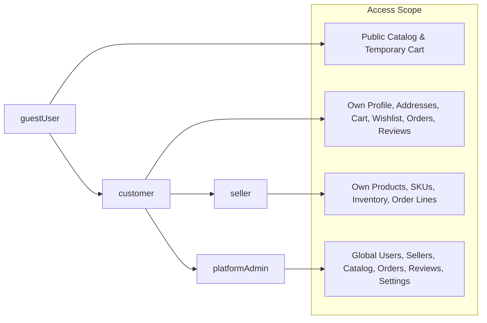
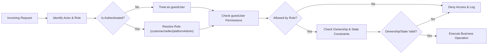

# User Actors and Permissions Requirements for shoppingMall Backend

## 1. Introduction

This specification defines the user actors and permissions model for the **shoppingMall** e-commerce backend. It describes **who** can perform **which business actions**, **under which conditions**, and **with which limitations**, in a way that backend developers can implement directly.

The focus is exclusively on business-level behavior:
- No API endpoint shapes
- No database schema design
- No infrastructure or technology stack choices

All functional requirements are expressed in natural language using EARS (Easy Approach to Requirements Syntax). EARS keywords are kept in English and all wording is in en-US.

### 1.1 Scope

The scope includes:
- Definition of all user actors
- Permissions and restrictions per actor
- Ownership and visibility rules for key resources (customers, sellers, products, SKUs, carts, wishlists, orders, shipments, payments, reviews, disputes, configuration)
- Hierarchical relationships between guestUser, customer, seller, and platformAdmin roles
- High-level expectations about performance and auditing of permission checks

The scope excludes:
- UI/UX design
- Frontend behavioral details
- Technical implementation details of authentication mechanisms (covered conceptually in the authentication requirements)

### 1.2 Relationship to Other Documents

The permissions in this document are tightly coupled with other domain requirements:
- Authentication and token behavior are defined in **Authentication and Session Requirements**.
- Product structures and catalog behavior are defined in **Product and Catalog Requirements**.
- Cart, wishlist, checkout, and order workflows are defined in **Cart, Wishlist, and Order Flow Requirements**.
- Payment and refund behavior is defined in **Payment and Refund Requirements**.
- Inventory and fulfillment behavior is defined in **Inventory and Fulfillment Requirements**.
- Review and rating behavior is defined in **Review and Rating Requirements**.
- Admin powers and moderation flows are defined in **Admin Operations and Moderation Requirements**.

Authorization behavior described here SHALL be interpreted consistently with those domain-specific documents.

### 1.3 EARS Notation

The specification uses the following EARS templates:

- Ubiquitous: `THE <system> SHALL <function>.`
- Event-driven: `WHEN <trigger>, THE <system> SHALL <function>.`
- State-driven: `WHILE <state>, THE <system> SHALL <function>.`
- Unwanted behavior: `IF <condition>, THEN THE <system> SHALL <function>.`
- Optional features: `WHERE <feature/condition>, THE <system> SHALL <function>.`

Unless otherwise stated, `<system>` refers to **shoppingMall backend authorization** or simply **shoppingMall backend**.

## 2. Actor List and Descriptions

### 2.1 Actor Summary

The shoppingMall platform uses four primary actors:

- **guestUser** – unauthenticated visitor.
- **customer** – authenticated buyer.
- **seller** – authenticated merchant managing their own catalog and fulfillment.
- **platformAdmin** – administrative operator for the entire marketplace.

### 2.2 guestUser

A guestUser is an unauthenticated visitor who interacts only with public features.

Characteristics:
- No persistent identity in the system.
- May maintain a temporary cart bound to a session.
- Cannot access account-bound resources.

EARS requirements:
- THE shoppingMall backend authorization SHALL treat any request without a valid authenticated identity as originating from guestUser.
- THE shoppingMall backend authorization SHALL allow guestUser to access only public catalog and review information and temporary cart features.

### 2.3 customer

A customer is an authenticated end user who purchases products on the platform.

Characteristics:
- Has a persistent account with credentials.
- Manages profile and address book.
- Maintains a personal cart and wishlists.
- Places and tracks orders and payments.
- Writes reviews for purchased products.

EARS requirements:
- THE shoppingMall backend authorization SHALL treat authenticated non-seller, non-admin accounts as customer by default.
- WHEN an actor is customer, THE shoppingMall backend authorization SHALL allow access to resources owned by that customer and to shared marketplace features allowed for all authenticated members.

### 2.4 seller

A seller is a merchant operating a store within the marketplace.

Characteristics:
- Has a persistent account mapped to a seller entity (store or brand).
- Manages own products, SKUs, and inventory.
- Views and fulfills orders containing their SKUs.
- Participates in cancellation and refund handling for their order lines.

EARS requirements:
- WHERE an authenticated account is linked to a seller entity, THE shoppingMall backend authorization SHALL treat that actor as seller for seller functions.
- THE shoppingMall backend authorization SHALL ensure that seller capabilities always apply only to resources owned by that seller.

### 2.5 platformAdmin

A platformAdmin is a privileged operator of the marketplace.

Characteristics:
- Has visibility across all users, sellers, products, orders, payments, and reviews.
- Performs moderation, dispute resolution, and configuration changes.
- Performs actions that may override customer or seller actions, subject to audit.

EARS requirements:
- WHERE an authenticated account is designated as platformAdmin, THE shoppingMall backend authorization SHALL grant access to admin-only capabilities described in this specification.
- THE shoppingMall backend authorization SHALL require additional safeguards (such as explicit confirmation or dual-control processes defined at business level) around high-impact platformAdmin actions.

### 2.6 User Lifecycle Assumptions

EARS requirements:
- THE shoppingMall backend SHALL support transitions from guestUser to customer through registration and login.
- WHERE a customer is approved as seller, THE shoppingMall backend SHALL associate that account with a seller entity and SHALL enable seller capabilities in addition to their customer capabilities where appropriate.
- WHERE platformAdmin accounts are maintained, THE shoppingMall backend SHALL restrict creation, modification, and deletion of platformAdmin accounts to existing platformAdmin actors or controlled internal processes.

## 3. Permission Hierarchy

### 3.1 Hierarchy Overview

From least to most privileged:

1. guestUser – public read-only access plus temporary cart.
2. customer – guestUser capabilities plus account-bound shopping features.
3. seller – customer capabilities plus store management and fulfillment features, scoped to own store.
4. platformAdmin – cross-tenant operational and moderation powers, within business safeguards.

### 3.2 Inheritance Rules

EARS requirements:
- THE shoppingMall backend authorization SHALL treat customer and seller as authenticated member roles distinct from guestUser.
- WHERE an actor is customer, THE shoppingMall backend authorization SHALL permit all guestUser capabilities plus customer-specific capabilities.
- WHERE an actor is seller, THE shoppingMall backend authorization SHALL permit all customer capabilities plus seller-specific capabilities, limited to seller-owned resources.
- WHERE an actor is platformAdmin, THE shoppingMall backend authorization SHALL permit admin-only capabilities in addition to read access to most resources, subject to constraints in this document.

### 3.3 Access Boundaries

EARS requirements:
- THE shoppingMall backend authorization SHALL deny any attempt by guestUser to create or modify persistent account-bound data.
- THE shoppingMall backend authorization SHALL deny any attempt by customer to perform seller-specific actions or admin actions.
- THE shoppingMall backend authorization SHALL deny any attempt by seller to manage other sellers’ resources or platform-wide settings.
- THE shoppingMall backend authorization SHALL ensure that platformAdmin actions are always logged and reviewable.

## 4. Per-Actor Capabilities

This section describes what each actor **may do** from a business perspective.

### 4.1 guestUser Capabilities

#### 4.1.1 Catalog and Reviews

EARS requirements:
- THE shoppingMall backend authorization SHALL allow guestUser to browse visible categories and product listings.
- THE shoppingMall backend authorization SHALL allow guestUser to view product detail pages, including prices, variant options, and public review summaries.
- THE shoppingMall backend authorization SHALL allow guestUser to read public reviews and ratings, but not to create or modify them.

#### 4.1.2 Temporary Cart

EARS requirements:
- WHEN guestUser adds items to cart, THE shoppingMall backend authorization SHALL allow creation and modification of a temporary cart bound to the guest session.
- THE shoppingMall backend authorization SHALL allow guestUser to change quantities and remove items in their temporary cart, subject to catalog and inventory rules.
- WHILE guestUser remains unauthenticated, THE shoppingMall backend authorization SHALL limit guestUser capabilities to operations on their own temporary cart only.

### 4.2 customer Capabilities

#### 4.2.1 Profile and Address Management

EARS requirements:
- THE shoppingMall backend authorization SHALL allow customer to view and update their own profile data (such as name and contact details) within business rules.
- THE shoppingMall backend authorization SHALL allow customer to create, update, and delete their own shipping addresses.
- IF a customer attempts to view or modify another customer’s profile or addresses, THEN THE shoppingMall backend authorization SHALL deny the operation.

#### 4.2.2 Cart and Wishlist

EARS requirements:
- THE shoppingMall backend authorization SHALL allow customer to maintain a persistent cart linked to their account.
- WHEN customer is authenticated, THE shoppingMall backend authorization SHALL allow merging temporary cart items into the persistent cart according to business merge rules.
- THE shoppingMall backend authorization SHALL allow customer to create and manage wishlists and wishlist contents owned by that customer.

#### 4.2.3 Orders and Payments

EARS requirements:
- WHEN customer initiates checkout from their own cart, THE shoppingMall backend authorization SHALL allow creation of orders linked to that customer, subject to domain validations.
- THE shoppingMall backend authorization SHALL allow customer to view the full details of their own orders, including line items, prices, payment status, and fulfillment status.
- IF a customer attempts to view or modify an order that does not belong to them, THEN THE shoppingMall backend authorization SHALL deny access without confirming the existence of that order.

#### 4.2.4 Cancellations and Refund Requests

EARS requirements:
- WHEN an order meets business conditions for customer-initiated cancellation, THE shoppingMall backend authorization SHALL allow that customer to request cancellation for their own order or eligible order lines.
- WHEN an order meets business conditions for customer-initiated refund, THE shoppingMall backend authorization SHALL allow that customer to submit refund requests for their own orders.

#### 4.2.5 Reviews and Ratings

EARS requirements:
- WHEN customer has an eligible completed purchase of a product, THE shoppingMall backend authorization SHALL allow that customer to create, edit, or delete their own review for that product within policy limits.
- THE shoppingMall backend authorization SHALL allow customer to report any visible review for potential abuse or policy violations.

### 4.3 seller Capabilities

#### 4.3.1 Seller Profile and Store Settings

EARS requirements:
- THE shoppingMall backend authorization SHALL allow seller to view and update seller-specific profile information such as store name and contact details for their own store.
- IF a seller attempts to update another seller’s store information, THEN THE shoppingMall backend authorization SHALL deny the operation.

#### 4.3.2 Product and SKU Management

EARS requirements:
- THE shoppingMall backend authorization SHALL allow seller to create, edit, and deactivate products and SKUs owned by that seller.
- WHEN a product or SKU is created, THE shoppingMall backend authorization SHALL ensure it is associated with exactly one seller owner.
- IF a seller attempts to manage a product or SKU whose owner is another seller, THEN THE shoppingMall backend authorization SHALL deny the attempt.

#### 4.3.3 Inventory Management

EARS requirements:
- THE shoppingMall backend authorization SHALL allow seller to adjust on-hand inventory and business attributes (such as low-stock thresholds) for SKUs owned by that seller.
- IF a seller attempts to adjust inventory of a SKU owned by another seller, THEN THE shoppingMall backend authorization SHALL deny the update.

#### 4.3.4 Order and Fulfillment Handling

EARS requirements:
- THE shoppingMall backend authorization SHALL allow seller to access order lines that contain SKUs owned by that seller, including customer shipping details necessary for fulfillment.
- THE shoppingMall backend authorization SHALL allow seller to update fulfillment-related information (such as pack status, carrier, tracking number, and shipping status) for their own order lines.
- IF a seller attempts to access or modify order lines that contain no SKUs owned by that seller, THEN THE shoppingMall backend authorization SHALL deny access.

#### 4.3.5 Seller Participation in Cancellations and Refunds

EARS requirements:
- WHERE business rules require seller participation in cancellations and refunds, THE shoppingMall backend authorization SHALL allow seller to respond to cancellation and refund requests for order lines owned by that seller.
- IF a seller attempts to respond to cancellation or refund requests for order lines owned by another seller, THEN THE shoppingMall backend authorization SHALL deny the operation.

### 4.4 platformAdmin Capabilities

#### 4.4.1 User and Seller Management

EARS requirements:
- THE shoppingMall backend authorization SHALL allow platformAdmin to view all customer and seller accounts, including status and key metrics.
- WHEN platformAdmin changes the status of a customer or seller account (for example, active, suspended, terminated), THE shoppingMall backend authorization SHALL permit the change and SHALL ensure that subsequent authorization decisions reflect the new status.

#### 4.4.2 Catalog and Content Moderation

EARS requirements:
- THE shoppingMall backend authorization SHALL allow platformAdmin to view and manage all products, SKUs, categories, and reviews.
- THE shoppingMall backend authorization SHALL allow platformAdmin to change product and SKU visibility (for example, hide, re-enable) for policy and compliance reasons.
- THE shoppingMall backend authorization SHALL allow platformAdmin to moderate reviews, including hiding, removing, or restoring them, according to review and rating requirements.

#### 4.4.3 Orders, Payments, and Disputes

EARS requirements:
- THE shoppingMall backend authorization SHALL allow platformAdmin to view all orders, payments, refunds, and disputes across all customers and sellers.
- THE shoppingMall backend authorization SHALL allow platformAdmin to perform corrective actions on orders (such as adjusting status, forcing cancellation, or initiating refunds) where business policies allow.

#### 4.4.4 Configuration and Reporting

EARS requirements:
- WHERE business configuration parameters exist (such as cancellation windows or review policies), THE shoppingMall backend authorization SHALL allow platformAdmin to manage such parameters within permitted ranges.
- THE shoppingMall backend authorization SHALL allow platformAdmin to access reporting views aggregating data across sellers, products, orders, and reviews, while applying privacy rules to personally identifiable information.

### 4.5 Cross-Actor Shared Capabilities

EARS requirements:
- THE shoppingMall backend authorization SHALL allow all authenticated actors (customer, seller, platformAdmin) to manage their own authentication credentials and security preferences via flows defined in authentication requirements.
- THE shoppingMall backend authorization SHALL allow authenticated actors to view limited history of their own security-related events (such as recent logins) where required by compliance.

## 5. Per-Actor Restrictions

This section defines **what actors may not do**, even if technically feasible.

### 5.1 guestUser Restrictions

EARS requirements:
- IF guestUser attempts to access account-bound resources (such as profile, addresses, persistent cart, wishlist, orders, payments, reviews), THEN THE shoppingMall backend authorization SHALL deny access.
- IF guestUser attempts to place an order or initiate payment, THEN THE shoppingMall backend authorization SHALL deny the action and SHALL require authentication as customer.
- IF guestUser attempts to create, edit, or delete reviews, THEN THE shoppingMall backend authorization SHALL deny the operation.

### 5.2 customer Restrictions

EARS requirements:
- IF customer attempts to view or modify another customer’s profile, addresses, carts, wishlists, orders, or reviews, THEN THE shoppingMall backend authorization SHALL deny the operation.
- IF customer attempts to create, edit, or deactivate products, SKUs, or inventory, THEN THE shoppingMall backend authorization SHALL deny the operation.
- IF customer attempts to access seller-only dashboards or admin dashboards, THEN THE shoppingMall backend authorization SHALL deny access.
- IF customer attempts to review a product without any eligible completed order for that product according to review rules, THEN THE shoppingMall backend authorization SHALL deny review creation.

### 5.3 seller Restrictions

EARS requirements:
- IF seller attempts to view or modify products, SKUs, inventory, or seller configuration belonging to another seller, THEN THE shoppingMall backend authorization SHALL deny the action.
- IF seller attempts to view customer data beyond what is required for fulfilling their own orders, THEN THE shoppingMall backend authorization SHALL deny the access.
- IF seller attempts to modify platform-level configuration (such as global policies) or admin-only entities (such as other sellers’ statuses), THEN THE shoppingMall backend authorization SHALL deny the action.
- IF seller attempts to create reviews for products they own, THEN THE shoppingMall backend authorization SHALL deny the operation.

### 5.4 platformAdmin Restrictions and Guardrails

EARS requirements:
- WHERE business policy restricts irreversible operations (such as hard deletion of data that must be retained), THE shoppingMall backend authorization SHALL prevent platformAdmin from performing such operations through normal admin workflows.
- IF platformAdmin attempts to perform an action that would break legal or policy constraints (for example, removing mandatory financial records), THEN THE shoppingMall backend authorization SHALL deny the action and SHALL indicate that the operation is not allowed.

### 5.5 Separation of Duties and Multi-Role Accounts

EARS requirements:
- WHERE a single human identity is both customer and seller, THE shoppingMall backend authorization SHALL apply ownership checks based on resource type and association, ensuring that operations still respect tenant isolation.
- WHERE a platformAdmin is also a customer or seller for personal use, THE shoppingMall backend authorization SHALL distinguish between actions performed in administrative capacity and actions performed as customer or seller, and SHALL log the acting role for each action.

## 6. Permission Matrix by Feature

The following matrix summarizes which actor can perform which high-level actions. This is a business view for developers; it does not replace detailed EARS requirements.

### 6.1 Feature Permission Table

| Feature / Action                                             | guestUser | customer | seller | platformAdmin |
|--------------------------------------------------------------|-----------|----------|--------|---------------|
| Browse products and categories                               | ✅        | ✅       | ✅     | ✅            |
| Search products                                              | ✅        | ✅       | ✅     | ✅            |
| View product details                                         | ✅        | ✅       | ✅     | ✅            |
| View public reviews and ratings                              | ✅        | ✅       | ✅     | ✅            |
| Create account (self-registration)                           | ✅        | ✅       | ✅     | ❌            |
| Login / logout                                               | ❌        | ✅       | ✅     | ✅            |
| Manage own profile                                           | ❌        | ✅       | ✅     | ✅ (self)     |
| Manage own addresses                                         | ❌        | ✅       | ✅     | ❌            |
| Manage temporary cart                                        | ✅        | ✅       | ✅     | ❌            |
| Manage persistent cart                                       | ❌        | ✅       | ✅     | ❌            |
| Manage wishlists                                             | ❌        | ✅       | ✅     | ❌            |
| Place orders                                                 | ❌        | ✅       | ✅     | ✅ (special)  |
| View own order history                                       | ❌        | ✅       | ✅     | ❌            |
| View all orders across platform                              | ❌        | ❌       | ❌     | ✅            |
| Request cancellation for own orders                          | ❌        | ✅       | ✅     | ✅            |
| Request refund for own orders                                | ❌        | ✅       | ✅     | ✅            |
| Respond to cancellations/refunds for owned order lines       | ❌        | ❌       | ✅     | ✅            |
| Create products and SKUs                                     | ❌        | ❌       | ✅     | ✅            |
| Manage own products / SKUs / inventory                       | ❌        | ❌       | ✅     | ✅            |
| Manage other sellers’ products / SKUs / inventory            | ❌        | ❌       | ❌     | ✅            |
| Update shipping and tracking for owned order lines           | ❌        | ❌       | ✅     | ✅            |
| Leave product reviews and ratings                            | ❌        | ✅       | ✅     | ❌            |
| Report reviews                                               | ❌        | ✅       | ✅     | ✅            |
| Moderate or remove reviews                                   | ❌        | ❌       | ❌     | ✅            |
| Approve or suspend sellers                                   | ❌        | ❌       | ❌     | ✅            |
| Deactivate user accounts                                     | ❌        | ❌       | ❌     | ✅            |
| Access system-wide admin reporting                           | ❌        | ❌       | ❌     | ✅            |

## 7. Business Rules for Authorization

### 7.1 Ownership Rules

EARS requirements:
- THE shoppingMall backend authorization SHALL associate each customer-owned resource (profile, address, cart, wishlist, order, review, payment method reference where applicable) with exactly one customer identity.
- THE shoppingMall backend authorization SHALL associate each seller-owned resource (seller profile, products, SKUs, inventory records, seller-specific shipments) with exactly one seller identity.
- WHEN an operation targets a customer-owned resource, THE shoppingMall backend authorization SHALL verify that the actor is either the owning customer or a platformAdmin with suitable permission.
- WHEN an operation targets a seller-owned resource, THE shoppingMall backend authorization SHALL verify that the actor is either the owning seller or a platformAdmin with suitable permission.

### 7.2 Tenant Isolation for Sellers

EARS requirements:
- THE shoppingMall backend authorization SHALL enforce that sellers can only access orders at the line-item level for SKUs they own, not for other sellers.
- THE shoppingMall backend authorization SHALL ensure that sellers can only view the subset of customer data required to fulfill their own orders, not full customer history or other sellers’ customer data.
- IF a seller attempts to bypass isolation by referencing identifiers of another seller’s resources, THEN THE shoppingMall backend authorization SHALL deny access and SHALL not reveal whether such resources exist.

### 7.3 State-Driven Rules

EARS requirements:
- WHILE an order is in a state not eligible for customer cancellation according to business policies, THE shoppingMall backend authorization SHALL deny customer-initiated cancellation actions for that order.
- WHILE a review is in a locked or finalized moderation state, THE shoppingMall backend authorization SHALL deny edit or delete operations from customers and sellers for that review.
- WHILE an account is in suspended or terminated status, THE shoppingMall backend authorization SHALL deny state-changing actions initiated by that account, such as new orders, reviews, and product changes.

### 7.4 Time-Based Rules

EARS requirements:
- WHERE refund or review policies define a maximum time window for certain actions, THE shoppingMall backend authorization SHALL consult the applicable time window before allowing the action.
- IF the current time is beyond the allowed window for a particular action (such as creating a review or requesting an exchange), THEN THE shoppingMall backend authorization SHALL deny the action and SHALL indicate that the time window has expired.

### 7.5 Performance Expectations for Authorization Checks

EARS requirements:
- THE shoppingMall backend authorization SHALL evaluate standard authorization checks (such as role membership and resource ownership) quickly enough that typical authenticated business operations respect the global performance targets defined in nonfunctional requirements.
- WHERE multiple authorization checks are needed for the same request, THE shoppingMall backend authorization SHALL avoid redundant evaluations that could significantly degrade response times.

### 7.6 Audit and Logging for Authorization Decisions

EARS requirements:
- THE shoppingMall backend SHALL record audit entries for sensitive authorization decisions, such as denied access to orders, modifications by platformAdmin, and cross-tenant access attempts.
- WHEN platformAdmin performs an action that changes another actor’s resources (such as suspending a seller, adjusting an order, or hiding a product), THE shoppingMall backend SHALL log the acting admin, the target resource, the type of action, and the timestamp.
- WHERE regulations or internal policies require review of authorization decisions, THE shoppingMall backend SHALL provide a way for authorized staff to access relevant audit logs without exposing unnecessary personal data.

## 8. Mermaid Diagrams

### 8.1 Actor Relationship Overview

### 8.2 High-Level Authorization Flow

These diagrams conceptually illustrate actor relationships and the high-level flow of authorization decisions. They do not specify technical architecture.

## 9. Summary of Key EARS Requirements

For quick reference, this section summarizes core authorization requirements; detailed versions appear in previous sections.

- THE shoppingMall backend authorization SHALL distinguish between guestUser, customer, seller, and platformAdmin and SHALL enforce different capabilities for each.
- THE shoppingMall backend authorization SHALL ensure that customers can only access and modify their own account-bound resources.
- THE shoppingMall backend authorization SHALL ensure that sellers can only manage products, SKUs, inventory, and order lines owned by their seller entity.
- THE shoppingMall backend authorization SHALL ensure that platformAdmin can view and manage cross-tenant resources while all admin actions are audited.
- WHEN any actor attempts to access resources they do not own and are not permitted to manage, THE shoppingMall backend authorization SHALL deny the attempt and SHALL not reveal sensitive information about those resources.
- WHERE policies define state- or time-based constraints (such as cancellation windows, review windows, or account suspension), THE shoppingMall backend authorization SHALL enforce those constraints consistently.
- THE shoppingMall backend SHALL log sensitive authorization outcomes, especially denials and admin overrides, in a form suitable for later auditing and compliance checks.

This specification defines **business requirements** for user actors and permissions in the shoppingMall backend. Implementation details such as frameworks, database schemas, and API designs remain the responsibility of the development team, provided that all behaviors described here are satisfied.