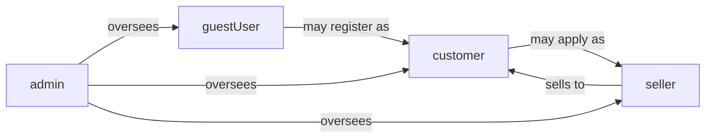
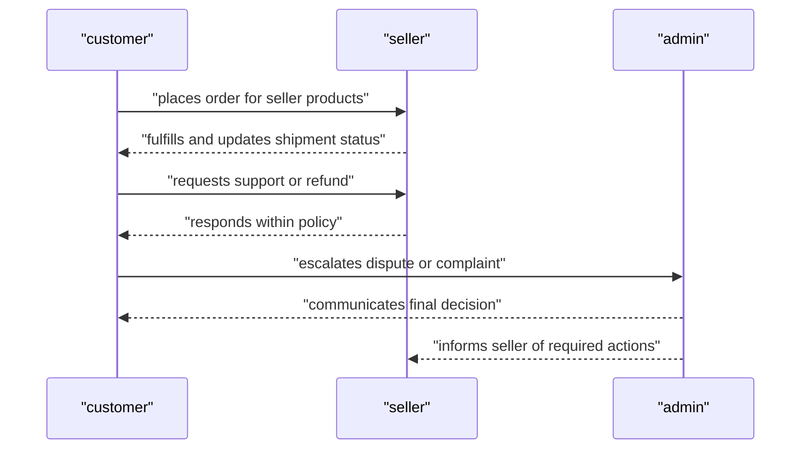

# User Actors and Permissions Requirements for shoppingMall Platform

## 1. Introduction

### 1.1 Purpose

THE shoppingMall platform user-actor specification SHALL define in business terms who can use the system, what each actor is allowed to do, and what each actor is forbidden to do.

THE requirements in this document SHALL be used by backend developers and QA engineers to implement and verify authentication, authorization, and access control for all business features of the shoppingMall platform.

### 1.2 Scope

THE scope of this document SHALL include:
- Definition of all actors: `guestUser`, `customer`, `seller`, and `admin`.
- Business capabilities and prohibitions for each actor.
- Cross-actor interactions that depend on permissions.
- A permission matrix that summarizes which actor may perform which business action.
- Error and unwanted-behavior rules for forbidden or unauthorized operations.

THE scope of this document SHALL exclude:
- Technical design such as API routes, HTTP status codes, or database schemas.
- Frontend layout or graphical UI design.
- Low-level security mechanisms such as token formats or cryptographic choices.

### 1.3 Relationship With Other Requirements

WHEN developers implement authentication and sessions according to the authentication and session requirements, THE actor capabilities in this document SHALL be treated as the authoritative description of who may do what from a business perspective.

WHEN developers implement catalog, cart, orders, payments, shipping, reviews, and admin governance according to the corresponding functional documents, THE actor permissions in this document SHALL constrain which flows are accessible to each actor.

### 1.4 Assumptions

THE following assumptions SHALL apply:
- THE shoppingMall platform SHALL operate as a multi-seller e-commerce marketplace.
- THE platform SHALL be accessible to unauthenticated visitors (guestUser) and authenticated actors (customer, seller, admin).
- THE platform authorization model SHALL be role-based using the four actors defined here; additional technical roles MAY exist but SHALL remain consistent with these business rules.

## 2. Actor List and Descriptions

### 2.1 Overview of Actors

THE shoppingMall platform actors SHALL consist of four distinct types:
- `guestUser`: unauthenticated visitor.
- `customer`: authenticated buyer.
- `seller`: authenticated merchant.
- `admin`: authenticated platform administrator.

### 2.2 guestUser

THE `guestUser` actor SHALL represent any visitor who has not authenticated.

Ubiquitous requirements:
- THE `guestUser` actor SHALL be allowed to browse public catalog content and visible reviews.
- THE `guestUser` actor SHALL not be allowed to perform any operation that creates or exposes personal account data.

Event-driven requirements:
- WHEN a visitor accesses the platform without logging in, THE platform SHALL treat that visitor as `guestUser` for all permission checks.
- WHEN a `guestUser` starts a registration or login flow and completes authentication successfully, THE platform SHALL switch the active actor context from `guestUser` to the authenticated actor type (customer, seller, or admin as applicable).

### 2.3 customer

THE `customer` actor SHALL represent an individual who has registered a personal account for purchasing goods.

THE `customer` actor SHALL be responsible for managing their own profile, addresses, carts, wishlists, orders, and reviews.

Event- and state-driven requirements:
- WHEN a user completes customer registration and login, THE platform SHALL treat that user as `customer` for business flows that require buying capabilities.
- WHILE a session is active in `customer` context, THE platform SHALL allow only `customer`-permitted actions and SHALL apply all customer-specific business rules.

### 2.4 seller

THE `seller` actor SHALL represent a business entity or individual merchant that lists and manages products on the platform.

THE `seller` actor SHALL manage only their own catalog, inventory, and seller-side order operations.

Ubiquitous requirements:
- THE platform SHALL treat each `seller` as distinct from all other sellers and SHALL enforce catalog and order ownership boundaries between them.
- THE platform SHALL not allow a `seller` to act as `admin` under the same actor context.

### 2.5 admin

THE `admin` actor SHALL represent platform staff responsible for global operations, governance, and compliance.

Ubiquitous requirements:
- THE `admin` actor SHALL have broad read and write access at platform level, restricted only by internal governance rules.
- THE `admin` actor SHALL not use admin capabilities as a shortcut for ordinary purchasing or selling activity; such activity SHALL occur only through separate `customer` or `seller` contexts.

## 3. Actor Relationships and Hierarchy

### 3.1 Conceptual Trust Levels

THE platform SHALL treat actors according to the following conceptual trust levels:
- `guestUser`: lowest trust, read-only access to public information.
- `customer`: personal data and payment-related rights for own account only.
- `seller`: commercial responsibilities for own catalog and related orders.
- `admin`: highest trust, governance over the entire platform.

State-driven requirement:
- WHILE an actor operates at a higher trust level, THE platform SHALL still enforce separation of duties to reduce misuse of power.

### 3.2 Separation of Duties

Ubiquitous requirements:
- THE platform SHALL ensure that `guestUser` has only read-only access to public catalog and reviews.
- THE platform SHALL ensure that `customer` can act only on their own profile, addresses, carts, wishlists, orders, and reviews.
- THE platform SHALL ensure that `seller` can act only on products, SKUs, inventory, and orders that belong to that seller.
- THE platform SHALL ensure that `admin` can manage all actors and resources but SHALL be subject to audit for governance actions.

Unwanted behavior requirement:
- IF any actor attempts to perform an action outside their role’s allowed capabilities, THEN THE platform SHALL deny the action and SHALL record an appropriate audit event where required by policy.

### 3.3 Ownership Concepts

Ownership requirements:
- THE platform SHALL treat addresses, carts, wishlists, and orders as owned by the `customer` who created them.
- THE platform SHALL treat products, SKUs, and inventory as owned by the `seller` entity assigned to them.
- THE platform SHALL treat governance settings, category taxonomies, policies, and system-wide configurations as owned by the platform and managed only by `admin` actors.

Unwanted behavior:
- IF an actor requests access to a resource that they do not own and do not have explicit governance rights over, THEN THE platform SHALL refuse the request without revealing confidential details.

### 3.4 Role Relationship Diagram

## 4. Permissions by Actor

### 4.1 General Permission Principles

Ubiquitous requirements:
- THE platform authorization model SHALL be role-based and SHALL evaluate the actor role for every protected business action.
- THE platform authorization model SHALL consider resource ownership (such as who owns an order or product) before approving or denying an action.

Unwanted behavior:
- IF a permission check fails for any reason, THEN THE platform SHALL deny the requested action and SHALL not leak additional information about inaccessible resources.

### 4.2 guestUser Permissions

#### 4.2.1 Allowed Actions

Ubiquitous requirements:
- THE platform SHALL allow `guestUser` to browse product lists and categories that are marked as publicly visible.
- THE platform SHALL allow `guestUser` to open product detail views for publicly visible products.
- THE platform SHALL allow `guestUser` to view publicly visible product reviews and rating aggregates.
- THE platform SHALL allow `guestUser` to perform catalog search and filtering over publicly visible products.

Optional cart behavior:
- WHERE the business model supports a temporary anonymous cart, THE platform SHALL allow `guestUser` to add visible, purchasable SKUs to a non-persistent or device-tied cart.

#### 4.2.2 Limitations and Prohibitions

Unwanted behavior requirements:
- IF a `guestUser` attempts to register persistent profile information such as addresses, THEN THE platform SHALL require completion of registration into at least `customer` role before saving such data.
- IF a `guestUser` attempts to place an order or initiate payment, THEN THE platform SHALL redirect or require authentication and SHALL not create a confirmed order as `guestUser`.
- IF a `guestUser` attempts to access any personal order history, wishlist, or review management features, THEN THE platform SHALL deny access and SHALL prompt for login where appropriate.
- IF a `guestUser` attempts to access seller or admin features, THEN THE platform SHALL deny the action and SHALL not disclose internal system details.

### 4.3 customer Permissions

#### 4.3.1 Profile and Address Management

Event-driven requirements:
- WHEN an authenticated `customer` requests to view or edit their own profile, THE platform SHALL allow the `customer` to read and update their own profile fields within validation rules.
- WHEN an authenticated `customer` manages addresses, THE platform SHALL allow the `customer` to create, edit, and delete addresses owned by that `customer` and SHALL allow one or more addresses to be marked as preferred according to business rules.

Unwanted behavior:
- IF a `customer` attempts to view or modify another user’s profile or addresses, THEN THE platform SHALL deny the request and SHALL not disclose whether the other account exists.

#### 4.3.2 Cart Management

Ubiquitous requirements:
- THE platform SHALL maintain a persistent cart for each `customer` account.

Event-driven requirements:
- WHEN a `customer` adds a purchasable SKU to their cart, THE platform SHALL add or update the corresponding cart item after validating SKU visibility, availability, and business constraints.
- WHEN a `customer` updates or removes items in their cart, THE platform SHALL adjust the cart content accordingly and SHALL re-validate constraints such as maximum purchase limits where applicable.

Unwanted behavior:
- IF a `customer` attempts to add a SKU that is not visible, inactive, blocked, or not purchasable, THEN THE platform SHALL reject the addition and SHALL communicate that the item is not available.

#### 4.3.3 Wishlist Management

Ubiquitous requirements:
- THE platform SHALL provide at least one persistent wishlist per `customer`.

Event-driven requirements:
- WHEN a `customer` adds a visible product to their wishlist, THE platform SHALL create or update an entry that links the wishlist and the product (and optional SKU) for that `customer`.
- WHEN a `customer` removes an item from their wishlist, THE platform SHALL delete only that wishlist entry.

Unwanted behavior:
- IF a `customer` attempts to add a product that is blocked or not visible to that `customer` at all, THEN THE platform SHALL reject the attempt and SHALL not create a wishlist entry.

#### 4.3.4 Order Placement and Payment Access

Event-driven requirements:
- WHEN an authenticated `customer` initiates checkout, THE platform SHALL require that the cart belongs to that `customer` and SHALL validate all items before creating an order.
- WHEN an authenticated `customer` confirms an order with a valid payment method, THE platform SHALL create an order owned by that `customer` and SHALL associate payment and shipping details as described in the order and payment documents.

Unwanted behavior:
- IF a `customer` attempts to place an order that includes items owned by another `customer` or any non-seller actor, THEN THE platform SHALL deny the attempt and SHALL not create such an order.

#### 4.3.5 Order History and Tracking

Ubiquitous requirements:
- THE platform SHALL allow each `customer` to view a list of orders owned by that `customer`.

Event-driven requirements:
- WHEN a `customer` opens an order detail, THE platform SHALL show only orders that are owned by that `customer` and SHALL provide the business-level information needed to understand status and fulfillment progress.

Unwanted behavior:
- IF a `customer` attempts to open an order detail by referencing an order that is not owned by that `customer`, THEN THE platform SHALL deny access and SHALL not confirm or deny the existence of that order.

#### 4.3.6 Cancellations and Refund Requests

Event-driven requirements:
- WHEN a `customer` views an order that is in a cancellable state according to policy, THE platform SHALL allow the `customer` to submit a cancellation request for eligible parts of the order.
- WHEN a `customer` views an order that is eligible for refund, THE platform SHALL allow the `customer` to submit a refund request with a reason drawn from allowed categories.

Unwanted behavior:
- IF a `customer` attempts to cancel or request refund for an order that is not eligible (for example outside allowed time window or after a non-refundable state), THEN THE platform SHALL deny the request and SHALL present a business-level explanation.

#### 4.3.7 Reviews and Ratings

Event-driven requirements:
- WHEN a `customer` has at least one completed delivery for a SKU, THE platform SHALL treat that `customer` as eligible to review that SKU subject to review timing rules.
- WHEN an eligible `customer` submits a review and rating for a product they purchased, THE platform SHALL create a review linked to that `customer`, the product, and at least one originating order line and SHALL apply review validation rules.

Unwanted behavior:
- IF a `customer` attempts to review a product that the `customer` has never purchased under their account, THEN THE platform SHALL deny the review creation.
- IF a `customer` attempts to edit or delete another user’s review, THEN THE platform SHALL deny the action and SHALL not reveal any internal details about the target review.

#### 4.3.8 Forbidden Actions for customer

Unwanted behavior requirements:
- IF a `customer` attempts to create, update, or delete products, SKUs, or seller profiles, THEN THE platform SHALL deny the action.
- IF a `customer` attempts to access platform-wide reports, admin dashboards, or seller-only analytics, THEN THE platform SHALL deny the action.
- IF a `customer` attempts to change the status of orders that belong to other actors (such as marking a seller order as shipped), THEN THE platform SHALL deny the action.

### 4.4 seller Permissions

#### 4.4.1 Seller Profile and Onboarding

Event-driven requirements:
- WHEN a user operates in `seller` context, THE platform SHALL allow management of seller profile data such as store name, contact details, and business identifiers, subject to validation and potential admin approval.
- WHEN a seller submits onboarding information, THE platform SHALL create or update a seller entity and SHALL track its approval status as defined in seller onboarding rules.

Unwanted behavior:
- IF a `seller` attempts to change approval status or risk flags on their own account, THEN THE platform SHALL deny such changes and SHALL restrict them to `admin` actors.

#### 4.4.2 Product and Catalog Management

Ubiquitous requirements:
- THE platform SHALL allow each `seller` to create and manage only products and SKUs owned by that seller.

Event-driven requirements:
- WHEN a `seller` creates a product, THE platform SHALL associate that product with the seller’s identity and SHALL set its initial visibility state as defined by catalog rules (for example draft).
- WHEN a `seller` edits a product’s descriptions, categories, or visibility state, THE platform SHALL apply those changes only to products owned by that `seller`.

Unwanted behavior:
- IF a `seller` attempts to modify or delete products or SKUs owned by another seller, THEN THE platform SHALL deny the action.
- IF a `seller` attempts to change global category structures, THEN THE platform SHALL deny the action and SHALL reserve such changes for `admin`.

#### 4.4.3 Inventory Management

Event-driven requirements:
- WHEN a `seller` adjusts inventory quantities for a SKU, THE platform SHALL apply the change only to SKUs owned by that seller and SHALL enforce non-negative inventory unless overselling rules explicitly allow otherwise.

Unwanted behavior:
- IF a `seller` attempts to adjust inventory for SKUs not owned by that seller, THEN THE platform SHALL deny the inventory change.

#### 4.4.4 Order Views and Fulfillment

Ubiquitous requirements:
- THE platform SHALL allow each `seller` to view orders that contain at least one SKU belonging to that seller, but only for the portion of the order relevant to that seller.

Event-driven requirements:
- WHEN a `seller` opens an order view, THE platform SHALL show only items, quantities, and customer shipping information necessary for that seller’s fulfillment.
- WHEN a `seller` updates shipment-related statuses (for example prepared, shipped) for their own items, THE platform SHALL store these updates and SHALL expose corresponding status information to the owning `customer` in order tracking views.

Unwanted behavior:
- IF a `seller` attempts to view all details of an order that does not contain any of their items, THEN THE platform SHALL deny access.
- IF a `seller` attempts to modify payment status or platform-wide order status fields that are reserved for `admin`, THEN THE platform SHALL deny these changes.

#### 4.4.5 Cancellations and Refund Participation

Event-driven requirements:
- WHEN a cancellation or refund request involves items from a `seller`, THE platform SHALL allow that `seller` to review the request and provide an approval, rejection, or additional information within allowed time windows if the business model grants such rights.

Unwanted behavior:
- IF a `seller` attempts to override a final refund decision made by `admin`, THEN THE platform SHALL deny this override and SHALL record the attempt where appropriate.

#### 4.4.6 Forbidden Actions for seller

Unwanted behavior requirements:
- IF a `seller` attempts to access or modify customer profile data unrelated to orders that contain their items, THEN THE platform SHALL deny the action and SHALL reveal only minimal information required for order fulfillment.
- IF a `seller` attempts to access another seller’s performance metrics, payouts, or private order details, THEN THE platform SHALL deny the action.
- IF a `seller` attempts to manage platform policies, fee settings, or admin roles, THEN THE platform SHALL deny the action.

### 4.5 admin Permissions

#### 4.5.1 User and Seller Management

Ubiquitous requirements:
- THE platform SHALL allow `admin` to search, view, and manage `customer` and `seller` accounts according to governance rules.

Event-driven requirements:
- WHEN an `admin` changes an account status (for example active, suspended, blocked), THE platform SHALL apply the change to the target account and SHALL record the action with acting admin identity and reason.

Unwanted behavior:
- IF an `admin` attempts to perform actions beyond their internal admin level (for example support admin attempting super-admin-only operations), THEN THE platform SHALL deny the action and SHALL log the attempt.

#### 4.5.2 Catalog and Category Governance

Event-driven requirements:
- WHEN an `admin` manages categories, THE platform SHALL apply those changes platform-wide and SHALL enforce integrity of the category tree.
- WHEN an `admin` hides or blocks a product or SKU for policy reasons, THE platform SHALL immediately prevent new purchases of that item while preserving historical data.

#### 4.5.3 Orders, Refunds, and Disputes

Ubiquitous requirements:
- THE platform SHALL allow `admin` to view any order and all associated financial, shipping, and dispute details for governance and compliance.

Event-driven requirements:
- WHEN an `admin` intervenes in a refund or dispute, THE platform SHALL allow the `admin` to approve, partially approve, or reject refunds within defined business constraints and SHALL update order and payment states accordingly.
- WHEN an `admin` overrides seller decisions on cancellations or refunds, THE platform SHALL record this override along with rationale for audit.

#### 4.5.4 Monitoring and Reporting

Ubiquitous requirements:
- THE platform SHALL allow `admin` to access dashboards and reports that summarize platform performance, risk, and compliance metrics without violating privacy rules.

#### 4.5.5 Forbidden Actions for admin

Unwanted behavior requirements:
- IF an `admin` attempts to use admin-only capabilities to create or manipulate their own commercial transactions in ways unavailable to ordinary users (for example free orders not aligned with policy), THEN THE platform SHALL restrict such flows according to governance rules and SHALL log them for audit.

### 4.6 Cross-Cutting Permission Rules

Ubiquitous requirements:
- THE platform SHALL apply the same permission checks consistently across all channels (for example web, mobile, internal tools) for the same actor role.
- THE platform SHALL expose only the minimum data required for each actor to perform their allowed actions, following data minimization principles.

## 5. Cross-Actor Interactions

### 5.1 Customer–Seller Interactions

Event-driven requirements:
- WHEN a `customer` places an order containing products from a `seller`, THE platform SHALL share only the customer information required for that seller to fulfill the order (for example shipping name and address, contact method) and SHALL not share unrelated customer data.
- WHEN a `customer` sends a question or message about an order, THE platform SHALL allow the `seller` owning the relevant items to view and respond, while protecting any data not required for the context.
- WHEN a `customer` writes a review for a product, THE platform SHALL allow the `seller` owning that product to view the review but SHALL not allow the `seller` to modify the review text or rating directly.

### 5.2 Customer–Admin Interactions

Event-driven requirements:
- WHEN a `customer` submits support tickets, escalations, or disputes, THE platform SHALL allow `admin` to access the necessary order and account information to handle the request.
- WHEN an `admin` takes governance action that impacts a `customer` (for example account suspension or dispute resolution), THE platform SHALL ensure that the `customer` can see the resulting status change and high-level reason where appropriate.

### 5.3 Seller–Admin Interactions

Event-driven requirements:
- WHEN a `seller` applies to join the platform or to change sensitive profile details, THE platform SHALL route the request for `admin` review where policy requires.
- WHEN an `admin` modifies seller-level settings such as status, risk flags, or special fee rules, THE platform SHALL ensure that these changes apply only to the targeted `seller` and SHALL record them in audit logs.

### 5.4 Interaction Sequence Diagram

## 6. Permission Matrix

### 6.1 Matrix Legend

- "View" means read-only access.
- "Manage" means create, update, or delete within the actor’s allowed scope.
- "Approve/Override" means the ability to make higher-level decisions that affect other actors.

### 6.2 Actions by Actor

| Business Action                                      | guestUser | customer | seller | admin |
|------------------------------------------------------|-----------|----------|--------|-------|
| Browse catalog                                       | ✅        | ✅       | ✅     | ✅    |
| View product details and reviews                     | ✅        | ✅       | ✅     | ✅    |
| Search and filter products                           | ✅        | ✅       | ✅     | ✅    |
| Register account                                     | ✅        | ✅       | ✅     | ✅    |
| Manage own profile                                   | ❌        | ✅       | ✅     | ✅    |
| Manage own addresses                                 | ❌        | ✅       | ✅     | ✅    |
| Manage cart (persistent)                             | ❌        | ✅       | ✅     | ❌    |
| Manage wishlist                                      | ❌        | ✅       | ✅     | ❌    |
| Place orders                                         | ❌        | ✅       | ✅     | ❌    |
| View own order history                               | ❌        | ✅       | ✅     | ❌    |
| View all orders                                      | ❌        | ❌       | ❌     | ✅    |
| View orders containing own products                  | ❌        | ❌       | ✅     | ✅    |
| Request cancellation/refund for own orders           | ❌        | ✅       | ✅     | ❌    |
| Approve/reject cancellations/refunds (own products)  | ❌        | ❌       | ✅     | ✅    |
| Override any cancellation/refund decision            | ❌        | ❌       | ❌     | ✅    |
| Write product reviews                                | ❌        | ✅       | ✅     | ❌    |
| Flag reviews for moderation                          | ❌        | ✅       | ✅     | ✅    |
| Moderate (hide/remove/restore) reviews               | ❌        | ❌       | ❌     | ✅    |
| Create and manage own products and SKUs              | ❌        | ❌       | ✅     | ✅    |
| Manage global categories                             | ❌        | ❌       | ❌     | ✅    |
| Manage own inventory                                 | ❌        | ❌       | ✅     | ✅    |
| View platform-wide analytics and reports             | ❌        | ❌       | ❌     | ✅    |
| Manage users and sellers                             | ❌        | ❌       | ❌     | ✅    |
| Disable or suspend accounts                          | ❌        | ❌       | ❌     | ✅    |

State-driven requirement:
- WHILE an action is marked as allowed for multiple actors, THE platform SHALL still enforce resource ownership and data minimization rules described earlier.

## 7. Error and Unwanted Behavior Handling

### 7.1 Unauthorized Access Attempts

Unwanted behavior requirements:
- IF any actor attempts to perform an action that is not permitted for that actor in this document, THEN THE platform SHALL deny the action and SHALL provide a role-appropriate error outcome without exposing internal implementation details.
- IF repeated unauthorized attempts are detected for the same actor or origin within a configurable time window, THEN THE platform SHALL flag such behavior for security monitoring and MAY temporarily limit further attempts according to security policy.

### 7.2 Cross-Account Data Access

Unwanted behavior requirements:
- IF a `customer` attempts to access another `customer`’s profile, addresses, carts, wishlists, or orders, THEN THE platform SHALL deny access and SHALL not disclose whether the other account exists.
- IF a `seller` attempts to access another seller’s catalog, inventory, private orders, or analytics, THEN THE platform SHALL deny access and SHALL record the attempt for auditing purposes.

### 7.3 Misuse of Admin Privileges

Unwanted behavior requirements:
- IF an `admin` performs an action that changes sensitive data (such as disabling accounts, blocking products, or overriding refunds), THEN THE platform SHALL always record the action in an audit log with admin identity, timestamp, and summary of the change.
- IF conflicting or repeated admin actions occur on the same entity (for example toggling a status frequently), THEN THE platform SHALL record each action, leaving conflict resolution to human governance; THE platform SHALL not silently hide these events.

### 7.4 Users With Multiple Roles

State- and event-driven requirements:
- WHERE a single human has both `customer` and `seller` roles, THE platform SHALL treat each session or action with a clear active role context.
- WHEN an action is requested that is allowed only for a role different from the current active role, THE platform SHALL deny the action and MAY prompt the user to switch contexts through frontend behavior.

## 8. Performance and Auditing Expectations Related to Permissions

### 8.1 Performance

Ubiquitous requirements:
- THE platform SHALL perform permission checks in a way that keeps overall response times within the performance targets defined in the non-functional requirements.
- WHILE the system is under heavy load, THE platform SHALL prioritize correctness and security of permission checks over small performance optimizations, while still aiming to meet target response times.

### 8.2 Auditing

Ubiquitous requirements:
- THE platform SHALL maintain audit logs for key permission-related events, including account creation, role assignments, role changes, admin actions on other accounts, and product visibility changes.
- IF an audit record cannot be created for a critical permission-related event, THEN THE platform SHALL treat this as an operational error and SHALL surface it through the monitoring mechanisms defined in governance requirements.

## 9. Business-Only Scope and Developer Autonomy

Ubiquitous requirements:
- THE requirements in this user-actors-and-permissions specification SHALL describe only the business expectations for actors and permissions on the shoppingMall platform.
- THE development team SHALL have full autonomy to choose technical approaches, architectures, API structures, and security mechanisms, provided that these implementations satisfy all business rules stated here.

State-driven requirement:
- WHILE the platform evolves over time, THE actor definitions and permission principles in this document SHALL remain the conceptual source of truth for who is allowed to perform which business actions, until superseded by updated business requirements.