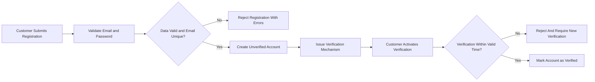
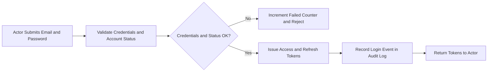
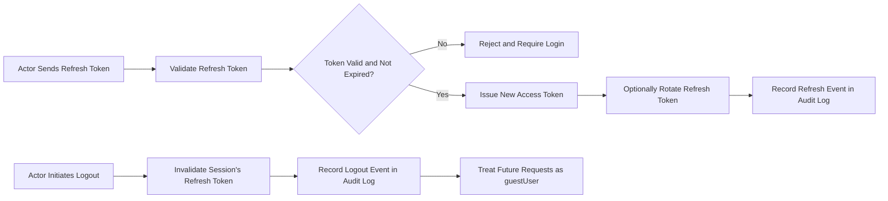

# Authentication and Session Requirements for shoppingMall

## 1. Introduction and Scope

This specification defines the complete set of business requirements for authentication, authorization context, and session management for the **shoppingMall** e-commerce platform. It guides backend developers in implementing secure and predictable behavior for:

- guestUser (unauthenticated visitor)
- customer (authenticated buyer)
- seller (authenticated merchant)
- platformAdmin (authenticated operator)

The focus is on **WHAT** the system must do, not **HOW** it is implemented. All functional behaviors are expressed in natural language using **EARS (Easy Approach to Requirements Syntax)** wherever applicable.

Out-of-scope items include:
- API endpoint definitions or URL structures
- Request/response payload schemas
- Database schemas or table designs
- Concrete libraries, frameworks, or infrastructure choices

Authentication is **conceptually JWT-based** using access tokens and refresh tokens, but this document does not prescribe specific JWT libraries or wire formats.

## 2. Actors and Authentication Context

### 2.1 Actor Overview

- **guestUser**: Unauthenticated visitor using public features (catalog browsing, viewing products and reviews) and temporary cart.
- **customer**: Authenticated user able to manage addresses, carts, wishlists, orders, payments, and reviews.
- **seller**: Authenticated merchant with privileges to manage products, SKUs, inventory, and fulfillment for their store.
- **platformAdmin**: Authenticated operator with elevated privileges for user, seller, catalog, order, and moderation management.

EARS requirements:
- THE shoppingMall authentication subsystem SHALL treat any request **without** a valid access token as originating from a guestUser.
- THE shoppingMall authentication subsystem SHALL treat any request **with** a valid access token as originating from an authenticated actor (customer, seller, or platformAdmin) as indicated by the token content.
- WHEN an access token is successfully validated, THE shoppingMall authorization subsystem SHALL derive actor identity and role (customer, seller, platformAdmin) from the token and SHALL apply role-based permissions defined in the user actors and permissions requirements.

## 3. Authentication Methods

### 3.1 Supported Authentication Method (Initial Scope)

The initial release uses email-and-password based authentication for all authenticated actors.

EARS requirements:
- THE shoppingMall authentication subsystem SHALL use email as the unique login identifier for customer, seller, and platformAdmin accounts.
- THE shoppingMall authentication subsystem SHALL authenticate users by verifying the supplied password against securely stored credentials for the given email.
- WHERE regional or policy requirements mandate additional authentication for platformAdmin, THE shoppingMall authentication subsystem SHALL support a configurable second authentication step for platformAdmin accounts without prescribing a specific technology.

### 3.2 Non-Supported Methods (Initial Scope)

The following are not supported in the initial scope but may be introduced later:

- Social login via third-party identity providers
- Passwordless or one-time-code login

EARS requirements:
- WHERE social login or passwordless features are not explicitly enabled by business configuration, THE shoppingMall authentication subsystem SHALL reject attempts to authenticate using external identity providers or passwordless flows.

## 4. Registration and Login Requirements

### 4.1 Customer Registration

Customer registration creates a standard customer account.

EARS requirements:
- WHEN a new customer submits registration data, THE shoppingMall authentication subsystem SHALL require at minimum a unique email, a password that meets complexity rules, and a name or equivalent identifier.
- WHEN a new customer submits registration data, THE shoppingMall authentication subsystem SHALL validate that the email is syntactically valid and not already associated with an active customer, seller, or platformAdmin account.
- WHEN customer registration is successfully created, THE shoppingMall authentication subsystem SHALL mark the account as unverified until email verification is completed.
- WHEN customer registration is successfully created, THE shoppingMall authentication subsystem SHALL issue a time-limited email verification mechanism linked to that account.
- WHEN a customer activates email verification within the validity period, THE shoppingMall authentication subsystem SHALL mark the customer account as verified and SHALL allow normal login subject to any additional business checks.
- IF a customer attempts email verification with an expired or invalid verification mechanism, THEN THE shoppingMall authentication subsystem SHALL reject the verification and SHALL require the customer to request a new verification mechanism.
- IF a registration attempt uses an email already belonging to an active account, THEN THE shoppingMall authentication subsystem SHALL reject the registration and SHALL indicate that the email is already in use.

### 4.2 Seller Registration and Onboarding

Seller onboarding may follow a multi-step business process.

EARS requirements:
- WHEN a user applies to become a seller, THE shoppingMall authentication subsystem SHALL collect mandatory seller profile information defined by business policy (for example, store name, legal contact details).
- WHEN a seller application is submitted, THE shoppingMall authentication subsystem SHALL validate that the email is syntactically valid and not already used by another seller account.
- WHERE manual approval is required for seller onboarding, THE shoppingMall authentication subsystem SHALL mark the seller account as pending until platformAdmin approves or rejects the application.
- WHILE a seller account is in pending state, THE shoppingMall authentication subsystem SHALL allow login only to limited onboarding views and SHALL prevent access to product, SKU, or order management features.
- WHEN a seller account is approved by platformAdmin, THE shoppingMall authentication subsystem SHALL mark the account as active seller and SHALL allow access to seller capabilities in line with role-based permissions.
- IF a seller application is rejected, THEN THE shoppingMall authentication subsystem SHALL prevent login as seller using that email and SHALL retain an auditable record of the rejection state.

### 4.3 platformAdmin Account Management

PlatformAdmin accounts are sensitive and controlled.

EARS requirements:
- WHERE a platformAdmin account must be created, THE shoppingMall authentication subsystem SHALL allow such creation only via controlled mechanisms defined by business policy (for example, by an existing platformAdmin or a secure bootstrap process).
- THE shoppingMall authentication subsystem SHALL require platformAdmin accounts to use unique emails not shared with active customer or seller accounts.
- WHEN a platformAdmin account is deactivated, THE shoppingMall authentication subsystem SHALL immediately prevent further login attempts for that account.

### 4.4 Login Behavior (All Authenticated Actors)

EARS requirements:
- WHEN an actor submits email and password for login, THE shoppingMall authentication subsystem SHALL validate that the account exists, is in an allowed status (for example, verified and not suspended), and that the password matches stored credentials.
- WHEN login succeeds, THE shoppingMall authentication subsystem SHALL issue a short-lived access token and a longer-lived refresh token that encode the actor’s identity and role.
- WHEN login succeeds, THE shoppingMall authentication subsystem SHALL record a login event with timestamp, account identifier, and high-level context (such as device descriptor or approximate location, if available).
- IF login fails due to invalid credentials, THEN THE shoppingMall authentication subsystem SHALL reject the attempt without revealing whether the email exists.
- IF the number of consecutive failed login attempts for an account exceeds a configurable threshold within a defined time window, THEN THE shoppingMall authentication subsystem SHALL temporarily lock the account or require additional verification per business policy.
- WHEN an account is locked due to repeated failed logins, THE shoppingMall authentication subsystem SHALL provide a recovery mechanism such as password reset or waiting for a lockout period to expire.

## 5. JWT-Based Session and Token Management

### 5.1 Token Types and Required Content

The platform uses two conceptual token types:

- Access token: short-lived, presented with most authenticated requests
- Refresh token: longer-lived, used to obtain new access tokens without re-entering credentials

EARS requirements:
- THE shoppingMall authentication subsystem SHALL issue access tokens that contain at minimum the actor’s unique identifier, role (customer, seller, platformAdmin), and token expiration time.
- THE shoppingMall authentication subsystem SHALL issue refresh tokens that contain at minimum the actor’s unique identifier and token expiration time and SHALL treat refresh tokens as highly sensitive credentials.
- WHERE additional claim information is required for authorization decisions (for example, seller store identifier or admin privilege level), THE shoppingMall authentication subsystem SHALL include such information in token payloads or SHALL ensure it is resolvable from token identity.

### 5.2 Token Lifetimes

Business expectations are expressed as configurable ranges.

EARS requirements:
- THE shoppingMall authentication subsystem SHALL support configuration of access token lifetime in a short range (for example, 15–60 minutes) and SHALL treat any access token as invalid after its expiration time.
- THE shoppingMall authentication subsystem SHALL support configuration of refresh token lifetime in a longer range (for example, 7–30 days) and SHALL treat any refresh token as invalid after its expiration time.
- WHEN an access token is expired, THE shoppingMall authentication subsystem SHALL reject requests using that token and SHALL allow the actor to obtain a new access token via a valid refresh token or re-authentication.

### 5.3 Token Issuance and Renewal

EARS requirements:
- WHEN login succeeds, THE shoppingMall authentication subsystem SHALL issue a new access token and refresh token pair for the authenticated actor.
- WHEN an actor presents a valid refresh token that has not expired or been revoked, THE shoppingMall authentication subsystem SHALL issue a new access token and MAY issue a new refresh token in line with business policy.
- WHERE refresh token rotation is enabled, THE shoppingMall authentication subsystem SHALL invalidate or mark as used the prior refresh token when a new refresh token is issued from it.
- IF an actor presents an invalid, expired, or revoked refresh token, THEN THE shoppingMall authentication subsystem SHALL deny token renewal and SHALL require the actor to log in again with credentials.

### 5.4 Logout and Session Revocation

Logout behaviors must cover single-device and multi-device scenarios.

EARS requirements:
- WHEN an actor performs a normal logout action, THE shoppingMall authentication subsystem SHALL invalidate the refresh token associated with the current session and SHALL consider its access token unusable for future requests.
- WHEN an actor requests logout from all devices, THE shoppingMall authentication subsystem SHALL invalidate all active refresh tokens for that account and SHALL treat all related access tokens as unusable.
- WHEN an actor successfully changes their password, THE shoppingMall authentication subsystem SHALL invalidate all existing refresh tokens for that actor as a security precaution and SHALL require re-authentication for new sessions.
- IF a platformAdmin marks an account as compromised, THEN THE shoppingMall authentication subsystem SHALL immediately invalidate all access and refresh tokens associated with that account and SHALL prevent new logins until compromise resolution steps are completed.

### 5.5 Guest Sessions and Association with Accounts

EARS requirements:
- WHEN a request is received without a valid access token, THE shoppingMall authentication subsystem SHALL classify the actor as guestUser for authorization purposes.
- WHEN a guestUser successfully authenticates as a customer or seller, THE shoppingMall authentication subsystem SHALL provide a way for business logic to associate any guest-owned temporary data (such as carts) with the authenticated account according to rules defined in cart requirements.

## 6. Password and Credential Management

### 6.1 Password Complexity and Validation

EARS requirements:
- THE shoppingMall authentication subsystem SHALL enforce a minimum password length of at least 8 characters for all accounts.
- THE shoppingMall authentication subsystem SHALL support configurable password complexity rules, including requirements for combinations of uppercase letters, lowercase letters, digits, and special characters.
- WHEN a supplied password fails configured complexity rules during registration or password change, THE shoppingMall authentication subsystem SHALL reject the operation and SHALL provide a business-level explanation of complexity requirements.

### 6.2 Password Storage (Business-Level Constraints)

EARS requirements:
- THE shoppingMall authentication subsystem SHALL never store passwords in human-readable form and SHALL store only secure non-reversible representations suitable for safe comparison.
- THE shoppingMall authentication subsystem SHALL ensure that password comparisons occur only against these secure stored representations.

### 6.3 Password Reset

EARS requirements:
- WHEN a user initiates a password reset using an email or identifier, THE shoppingMall authentication subsystem SHALL generate a time-limited reset mechanism bound to that account and SHALL send it to the registered contact channel.
- THE shoppingMall authentication subsystem SHALL support configuration of password reset mechanism validity in a short time range (for example, 10–60 minutes).
- WHEN a user submits a new password with a valid reset mechanism within its validity period, THE shoppingMall authentication subsystem SHALL update the password and SHALL invalidate the reset mechanism so it cannot be reused.
- IF a password reset mechanism is submitted after its validity period or after prior use, THEN THE shoppingMall authentication subsystem SHALL reject the reset attempt and SHALL require a new reset request.

### 6.4 Password Change While Logged In

EARS requirements:
- WHEN an authenticated actor requests a password change, THE shoppingMall authentication subsystem SHALL require the current password and the new password that meets complexity rules.
- WHEN the password change completes successfully, THE shoppingMall authentication subsystem SHALL invalidate all existing refresh tokens for that actor and SHALL require future requests to use tokens issued after the change.

### 6.5 Compromised Accounts

EARS requirements:
- WHEN a user reports that their account may be compromised, THE shoppingMall authentication subsystem SHALL flag the account as compromised and SHALL require additional verification during subsequent logins.
- WHEN an account is flagged as compromised, THE shoppingMall authentication subsystem SHALL limit login and token issuance until additional verification steps are completed according to business policy.
- IF platformAdmin confirms that an account is compromised, THEN THE shoppingMall authentication subsystem SHALL disable normal login for that account until the account is either remediated or closed.

## 7. Security and Access Control Rules

### 7.1 Role-Based Access Enforcement

EARS requirements:
- THE shoppingMall authorization subsystem SHALL base authorization decisions on actor role and identity as derived from validated access tokens.
- WHEN an access token identifies the actor as customer, THE shoppingMall authorization subsystem SHALL allow only business actions assigned to customers in the permissions specification.
- WHEN an access token identifies the actor as seller, THE shoppingMall authorization subsystem SHALL allow only business actions assigned to sellers.
- WHEN an access token identifies the actor as platformAdmin, THE shoppingMall authorization subsystem SHALL allow actions assigned to platformAdmin, subject to additional business and audit constraints.
- WHEN no valid access token is present, THE shoppingMall authorization subsystem SHALL restrict capabilities to those available to guestUser.

### 7.2 Handling Unauthorized and Forbidden Access

EARS requirements:
- IF a request without a valid access token targets a feature that requires authentication, THEN THE shoppingMall authorization subsystem SHALL deny the request and SHALL indicate that authentication is required in business terms.
- IF a request with a valid access token targets a feature that the actor’s role is not permitted to perform, THEN THE shoppingMall authorization subsystem SHALL deny the request and SHALL indicate that the requested operation is not permitted.
- WHEN an access token is expired, invalid, or malformed, THE shoppingMall authentication subsystem SHALL treat it as unauthenticated and SHALL not use it for authorization decisions.

### 7.3 Session Security and Anomaly Detection

EARS requirements:
- WHERE device or context recognition is enabled, THE shoppingMall authentication subsystem SHALL associate each session or refresh token with high-level context information such as device fingerprint or approximate location.
- IF a login is detected from a significantly different context than recent activity for a high-risk actor such as platformAdmin, THEN THE shoppingMall authentication subsystem SHALL require additional verification steps such as confirming via secondary channel according to business policy.

### 7.4 Rate Limiting for Auth-Related Operations

EARS requirements:
- THE shoppingMall authentication subsystem SHALL enforce configurable rate limits on login attempts per account and per source context within a defined time window.
- THE shoppingMall authentication subsystem SHALL enforce configurable rate limits on password reset requests per account and per source context within a defined time window.
- IF rate limits are exceeded, THEN THE shoppingMall authentication subsystem SHALL temporarily block further requests for the affected operation and SHALL indicate in business terms that too many attempts have been made.

## 8. Auditability and Logging (Auth and Sessions)

### 8.1 Logged Events

EARS requirements:
- THE shoppingMall auditing subsystem SHALL record successful logins with timestamp, actor identity, and high-level context data.
- THE shoppingMall auditing subsystem SHALL record failed login attempts with timestamp and account identifier where known, without storing plaintext passwords.
- THE shoppingMall auditing subsystem SHALL record password reset requests and completions with timestamps and actor identity.
- THE shoppingMall auditing subsystem SHALL record password changes with timestamps and actor identity.
- THE shoppingMall auditing subsystem SHALL record account status changes such as activation, suspension, compromise flagging, and deactivation, including the actor (user or admin) who triggered the change.
- THE shoppingMall auditing subsystem SHALL record token revocation events triggered by logout, logout-all, password changes, or admin compromise actions.

### 8.2 Access to Audit Data

EARS requirements:
- THE shoppingMall auditing subsystem SHALL restrict access to auth-related audit logs to authorized internal roles such as platformAdmin or security staff, as defined in admin operations requirements.
- WHEN an authorized actor views audit records, THE shoppingMall auditing subsystem SHALL allow search and filtering by actor identity, event type, and time range while protecting sensitive details in accordance with privacy rules.

## 9. Performance and Reliability Requirements for Auth

EARS requirements:
- WHEN a user submits login credentials under normal load, THE shoppingMall authentication subsystem SHALL return either a success response with tokens or a failure response within 2 seconds in at least 95 percent of cases.
- WHEN a user submits a token refresh request under normal load, THE shoppingMall authentication subsystem SHALL respond within 1 second in at least 95 percent of cases.
- WHEN a user initiates a password reset request under normal load, THE shoppingMall authentication subsystem SHALL initiate the reset mechanism within 2 seconds in at least 95 percent of cases.
- WHILE the platform is operating under normal load, THE shoppingMall authentication subsystem SHALL maintain availability in line with the overall availability targets defined in the nonfunctional requirements.
- IF the authentication subsystem experiences partial outages or degraded performance, THEN THE shoppingMall platform SHALL prioritize correctness and security over speed and SHALL fail auth operations safely.

## 10. Key Authentication and Session Flows (Mermaid Diagrams)

### 10.1 Customer Registration and Email Verification Flow

### 10.2 Login and Token Issuance Flow

### 10.3 Token Refresh and Logout Flow

## 11. Assumptions and Constraints

EARS requirements:
- THE shoppingMall authentication and session behaviors SHALL be interpreted as business requirements only; detailed technical designs remain the responsibility of the development team.
- WHERE regional regulations require stronger authentication measures (such as stricter lockout policies or mandatory multi-factor for admins), THE shoppingMall authentication subsystem SHALL support configuration of these policies without changing the fundamental flows defined here.
- WHERE future features introduce additional authentication methods (such as social login or passwordless), THE shoppingMall authentication subsystem SHALL extend these flows in a backward-compatible manner that preserves core behaviors specified in this document.

This authentication and session requirements specification is intended to be sufficiently detailed and unambiguous for backend developers to implement secure, robust authentication and session management for the shoppingMall platform without additional business clarification.