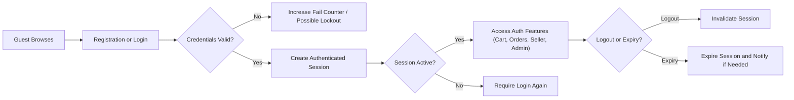

# Authentication and Session Requirements for shoppingMall Platform

## 1. Purpose and Scope

THE shoppingMall authentication and session specification SHALL define business-level rules for how users register, log in, log out, and maintain authenticated sessions on the platform.

THE specification SHALL describe **what** the platform must do from a business perspective to identify and protect users, without prescribing **how** it is implemented technically.

THE scope of authentication and session requirements SHALL include:
- Registration flows and lifecycle for customer, seller, and admin accounts.
- Login, logout, and re-authentication behavior for all actors.
- Session creation, lifetime, expiry, and revocation rules.
- Password and credential policies expressed in business terms.
- Account recovery flows such as password reset and account unlock.
- Security events, suspicious behavior detection, and abuse handling related to accounts.

THE scope SHALL exclude:
- Choice of authentication technology (for example OAuth, SSO, or proprietary solutions).
- Token formats, cookie structures, encryption algorithms, and infrastructure components.
- Database schemas, API route structures, or frontend UI design.

## 2. Actors and Terminology

### 2.1 Actors

THE shoppingMall platform SHALL support the following actors for authentication and authorization:

- **guestUser**: Unauthenticated visitor who can browse public catalog and reviews but cannot perform authenticated actions.
- **customer**: Authenticated end-user who can manage addresses, carts, wishlists, orders, and reviews.
- **seller**: Authenticated merchant who can manage their own products, SKUs, inventory, and seller-side order operations.
- **admin**: Authenticated platform administrator responsible for governance, moderation, and operations.

### 2.2 Key Terms

- **Account**: A persistent identity in shoppingMall associated with login credentials and actor role(s).
- **Session**: A period during which an authenticated user remains recognized by the system without needing to re-enter credentials for every request.
- **Login identifier**: Business-level identifier used for login (such as email), unique per account.
- **Credential**: Secret information known only to the account owner and the system (for example password) used to prove identity.
- **High-risk action**: Business-critical operation that may require re-authentication, such as changing passwords, payout details, or approving high-value refunds.

## 3. High-Level Authentication Principles

### 3.1 Business Objectives

- THE shoppingMall identity model SHALL uniquely associate every authenticated action with exactly one account.
- THE shoppingMall authentication process SHALL balance ease of use for legitimate users with protection against unauthorized or fraudulent access.
- THE shoppingMall session management SHALL ensure that users remain logged in long enough for typical shopping and operations, while limiting exposure when devices are lost or accounts are compromised.

### 3.2 Core EARS Requirements

- THE shoppingMall authentication system SHALL ensure that each account has a unique primary login identifier that is not shared with any other account.
- WHEN a user attempts to access any feature that modifies personal, order, inventory, or governance data, THE shoppingMall platform SHALL require the user to be authenticated as customer, seller, or admin.
- WHEN a request is received with an invalid or expired session, THE shoppingMall platform SHALL treat the requester as guestUser and SHALL deny access to authenticated-only features.
- IF suspicious authentication behavior is detected, THEN THE shoppingMall platform SHALL trigger additional safeguards such as temporary lockout, additional verification, or admin alerting according to risk policies.

## 4. Registration Flows by Actor

### 4.1 Common Registration Principles

- THE shoppingMall registration process SHALL collect only information that is necessary for business operations, communication, and compliance.
- WHEN a registration attempt is processed, THE shoppingMall registration process SHALL return either a clear success result or structured validation errors that identify missing or invalid information.
- IF a registration attempt uses a login identifier that already exists for another account, THEN THE shoppingMall registration process SHALL reject the attempt and SHALL not reveal whether the existing account is customer, seller, or admin.

### 4.2 Customer Registration

#### 4.2.1 Required Data and Uniqueness

- WHEN a user registers as a customer, THE shoppingMall customer registration process SHALL require at minimum a unique email address and a password that meets password policy rules.
- WHEN a user attempts to register with an email already associated with an existing account, THE customer registration process SHALL reject the registration and SHALL instruct the user to log in or use account recovery.

#### 4.2.2 Policy Consent and Communication

- WHEN a customer attempts to complete registration, THE shoppingMall customer registration process SHALL require explicit consent to terms of service and privacy policy.
- THE customer registration process SHALL store the timestamp of policy consent in business terms to support compliance.

#### 4.2.3 Email Verification

- WHERE email verification is enabled, THE shoppingMall customer registration process SHALL create new customer accounts initially in an "email unverified" state.
- WHEN a customer successfully clicks a valid verification link or completes the verification step, THE shoppingMall customer registration process SHALL mark the email as verified and SHALL allow full customer functionality.
- IF a verification attempt uses an expired or invalid verification reference, THEN THE shoppingMall customer registration process SHALL reject the attempt and SHALL offer the customer the option to request a new verification.

### 4.3 Seller Registration and Onboarding

#### 4.3.1 Initial Seller Account Creation

- WHEN a user applies to become a seller, THE shoppingMall seller registration process SHALL collect at minimum a business name, a unique business contact email, a password, and required legal identifiers according to region.
- WHEN a seller registration is submitted, THE seller registration process SHALL create a seller account in a "pending review" or equivalent state until business verification rules are satisfied.

#### 4.3.2 Verification and Approval

- WHERE manual review is required, THE shoppingMall seller onboarding process SHALL require admin approval before the seller can list products or access seller operations.
- WHEN a seller is approved, THE seller onboarding process SHALL mark the seller status as "active" and SHALL grant access to seller features such as product and inventory management.
- IF a seller application is rejected, THEN THE seller onboarding process SHALL mark the seller as "rejected" and SHALL prevent access to seller operational features while retaining data for audit and potential appeal.

#### 4.3.3 Email Verification for Sellers

- WHERE email verification is required for sellers, THE shoppingMall seller registration process SHALL require successful email verification before granting access to seller features, even if the seller is approved.

### 4.4 Admin Account Provisioning

- THE shoppingMall admin account process SHALL restrict creation of admin accounts to internal or controlled flows and SHALL not allow public self-registration as admin.
- WHEN a new admin account is provisioned, THE admin account process SHALL require a strong password according to the highest security level defined in password policy.
- WHERE additional verification methods such as multi-step verification are required for admins, THE admin account process SHALL require successful completion of these steps before the admin account is considered active.

### 4.5 GuestUser Capabilities and Conversion

- THE shoppingMall guest access policy SHALL allow guestUser to browse public catalogs, categories, and product reviews without registration.
- WHEN a guestUser chooses to register or log in, THE shoppingMall registration and login flows SHALL offer the option to convert active guest state, such as temporary cart contents, into an authenticated customer account state.
- IF a guestUser attempts to perform actions that require authentication, such as placing orders or managing addresses, THEN THE shoppingMall platform SHALL require the guestUser to register or log in as customer before proceeding.

## 5. Login and Logout Behavior

### 5.1 Login Inputs and Actor Separation

- THE shoppingMall login system SHALL accept login attempts for customers, sellers, and admins via dedicated or clearly differentiated entry points so that role-specific policies can be applied.
- WHEN a login attempt is processed, THE login system SHALL verify the provided login identifier and password against stored account data.
- IF the login identifier and password do not correspond to any active account, THEN THE login system SHALL return a generic error that does not confirm whether the login identifier is registered.

### 5.2 Account Status at Login

- WHEN an account is in active state, THE login system SHALL allow login attempts that meet credential and security requirements.
- IF an account is in suspended or blocked state, THEN THE login system SHALL deny login and SHALL show a message that the account cannot be used, without exposing sensitive internal details about the reason.
- WHEN a seller or admin account is suspended, THE login system SHALL deny access to seller or admin features respectively and SHALL log the attempted access for audit.

### 5.3 Failed Login Attempts and Lockout

- WHEN consecutive failed login attempts for the same account exceed a configured threshold within a defined time window, THE account protection policy SHALL temporarily lock the account or introduce delays to protect against guessing attacks.
- WHEN an account is temporary-locked due to failed attempts, THE account protection policy SHALL clearly define the lock duration and SHALL provide guidance for recovery, such as waiting period or password reset.
- IF failed login attempts come from multiple unrelated accounts but from the same device or network source above a configured threshold, THEN the account protection policy SHALL flag that source as suspicious and SHALL apply rate-limiting or temporary blocking behavior.

### 5.4 Successful Login and Session Creation

- WHEN a login attempt is successful, THE session management system SHALL create a new authenticated session associated with the account and actor role(s).
- WHEN a successful login occurs, THE session management system SHALL record the login time and basic origin information (such as approximate region or device label in business terms) for later security review.
- WHERE the user has multiple roles (for example both customer and seller), THE session management system SHALL establish clear role context for subsequent actions so that permissions are applied correctly.

### 5.5 Logout Behavior

- WHEN a user triggers logout from a device or browser, THE session management system SHALL invalidate the corresponding active session and SHALL treat subsequent requests from that context as guestUser.
- WHERE a "log out from all devices" feature is offered, THE session management system SHALL invalidate all active sessions for that account on all devices.
- IF logout fails due to backend error, THEN the session management system SHALL attempt to mark the session as invalid at the earliest opportunity and SHALL not keep the session active longer than the configured maximum lifetime.

## 6. Session Lifetime and Expiry

### 6.1 Session Types and Duration

- THE shoppingMall session policy SHALL support standard interactive sessions that remain active while users browse and interact, with an inactivity timeout suitable for typical shopping behavior.
- WHERE a "remember me" or long-lived login option is offered, THE session policy SHALL allow extended session duration with additional safeguards, such as revocation upon password change or suspicious activity.

### 6.2 Inactivity Timeout

- WHEN a session remains idle for longer than the configured inactivity period, THE session policy SHALL expire that session and SHALL require re-authentication for protected actions.
- WHEN a session expires due to inactivity while a customer is mid-way through checkout, THE session policy SHALL preserve non-sensitive state such as cart contents where permitted and SHALL require the customer to log in again before confirming the order.

### 6.3 Maximum Session Lifetime

- THE session policy SHALL define a maximum absolute lifetime for sessions, after which users must log in again even if they remain active.
- WHEN the maximum lifetime is reached, THE session policy SHALL terminate the session and SHALL prompt the user to re-authenticate before continuing with protected actions.

### 6.4 Session Revocation

- WHEN a password is changed or reset, THE session policy SHALL invalidate existing interactive and long-lived sessions associated with that account and SHALL require re-login.
- WHEN admins revoke access for a user by changing account status to suspended or blocked, THE session policy SHALL invalidate all active sessions for that account as soon as practical.
- IF a user reports account compromise, THEN the support and security process SHALL trigger immediate revocation of all sessions and SHALL require password reset or equivalent recovery before restoring access.

## 7. Password and Credential Rules

### 7.1 Password Strength and Complexity

- THE shoppingMall password policy SHALL define a minimum character length for passwords for all actors, with higher or equal requirements for sellers and admins compared to customers.
- THE password policy SHALL require passwords to be difficult to guess by including a mix of character types or equivalent strength measures.
- IF a password fails to meet length or complexity requirements at registration or change, THEN the password policy SHALL reject the password with descriptive feedback.

### 7.2 Password Change and Renewal

- WHEN a user initiates a password change while authenticated, THE password policy SHALL require confirmation of the current password before accepting a new password.
- WHEN a password change is successfully completed, THE password policy SHALL invalidate old sessions and SHALL notify the user via at least one registered contact channel that the password was changed.
- WHERE business policy requires periodic password renewal for admins or sensitive sellers, THE password policy SHALL enforce renewal deadlines and SHALL restrict access if passwords are not updated in time.

### 7.3 Credential Confidentiality

- THE shoppingMall platform SHALL never display stored passwords back to users in plain text under any circumstances.
- WHEN users enter or update passwords, THE platform SHALL treat the input as sensitive and SHALL avoid exposing it in logs, error messages, or communications.

## 8. Account Recovery and Security Events

### 8.1 Password Reset Requests

- WHEN a user indicates that they forgot their password, THE account recovery process SHALL allow initiation of a password reset using the registered login identifier or a recognized recovery channel.
- THE account recovery process SHALL send recovery instructions only to contact channels already associated with the account and SHALL not reveal whether a specific login identifier exists in the system.
- WHEN a user completes password reset successfully, THE account recovery process SHALL treat the new password as if it were set via change password and SHALL invalidate prior sessions.

### 8.2 Account Unlock

- WHEN an account is temporarily locked due to excessive failed login attempts, THE account recovery process SHALL offer a way for the legitimate owner to unlock the account, such as by passing a verification step or waiting for the lock period.
- IF an admin sets an account to blocked or suspended status for policy reasons, THEN the account recovery process SHALL not automatically unlock the account and SHALL instead require admin action.

### 8.3 Contact Change Verification

- WHEN a user requests a change to their primary login identifier or main contact email, THE contact management process SHALL require verification of the new contact method before treating it as active.
- IF verification for the new contact is not completed within a configured time window, THEN the contact management process SHALL cancel the change and SHALL retain the existing contact as active.

### 8.4 Security Event Notifications

- WHEN a login occurs from a new device or region that differs significantly from typical patterns, THE security event process SHALL optionally notify the account owner so they can recognize unauthorized activity.
- WHEN a password change, password reset, or account recovery occurs, THE security event process SHALL send a notification to the account owner using an existing verified contact channel.
- WHEN an account is locked or suspended due to security or policy reasons, THE security event process SHALL inform the account owner of the lock or suspension and SHALL describe available next steps without exposing internal investigation details.

## 9. Abuse and Fraud Prevention (Auth-Related)

### 9.1 Suspicious Behavior Detection

- THE shoppingMall abuse detection policy SHALL monitor authentication and session activity for patterns such as repeated failed logins, unusual geographic access, or rapid creation of multiple accounts from the same source.
- WHEN suspicious patterns exceed defined thresholds, THE abuse detection policy SHALL mark the related accounts or sources as high-risk and SHALL apply additional protections such as stricter rate limits, additional verification, or temporary blocking.

### 9.2 Handling Compromised Accounts

- WHEN there is strong indication that an account has been compromised, THE abuse detection policy SHALL immediately trigger actions such as session revocation, forced password reset, and temporary suspension until ownership is verified.
- WHEN a compromised account is confirmed and recovered, THE abuse detection policy SHALL keep a record of the incident for future risk assessment and SHALL consider applying stricter controls to that account.

### 9.3 Internal Misuse by Elevated Roles

- WHEN an admin account performs unusual patterns of high-impact actions (such as many account status changes or refunds in a short time), THE abuse detection policy SHALL flag this behavior for review by a higher authority where such a role exists.
- IF there is credible suspicion that an admin account is misused or compromised, THEN the platform governance process SHALL allow rapid suspension of that admin account and rerouting of responsibilities to alternative admins while investigation occurs.

## 10. Non-Functional Expectations Related to Authentication

### 10.1 Performance

- WHEN users attempt to log in under normal operating conditions, THE authentication system SHALL respond with success or failure within a few seconds so that login experiences feel responsive.
- WHEN users attempt to log out, THE authentication system SHALL invalidate sessions quickly enough that subsequent attempts to access protected resources reflect the logged-out state without confusion.

### 10.2 Availability and Degradation

- WHILE core authentication services operate normally, THE platform SHALL allow login, logout, registration, and account recovery operations according to other requirements in this document.
- IF authentication services are partially unavailable, THEN the platform SHALL still allow guestUser-level browsing for public resources, while clearly preventing new logins and state-changing operations that require authentication.

### 10.3 Privacy and Data Protection

- THE shoppingMall platform SHALL treat authentication-related data, including login identifiers, security events, and recovery information, as sensitive and SHALL restrict access to such data to authorized roles only.
- WHERE privacy regulations grant users rights to access or delete account data, THE platform SHALL support locating authentication-related records and applying access or deletion in a manner consistent with legal obligations and business continuity needs.

## 11. Consolidated EARS Requirements Summary

This section lists key EARS-style requirements for traceability and testing. The detailed context is provided in earlier sections.

- THE shoppingMall authentication system SHALL uniquely associate each authenticated action with exactly one account.
- WHEN a user registers as customer, THE registration process SHALL require a unique email and a password that meets password policy rules.
- WHEN a user registers as seller, THE registration process SHALL create a seller account in a pending state until approval according to onboarding policy.
- THE admin account provisioning process SHALL restrict admin account creation to controlled, internal flows only.
- WHEN a user attempts to access a protected feature without a valid session, THE platform SHALL treat the user as guestUser and SHALL require login.
- WHEN consecutive login failures exceed configured thresholds, THE account protection policy SHALL temporarily lock the account or slow down further attempts.
- WHEN a login attempt is successful, THE session management system SHALL create an authenticated session and SHALL record basic login event information.
- WHEN a user logs out, THE session management system SHALL invalidate the session and SHALL require re-authentication for further protected actions.
- WHEN a session exceeds its inactivity timeout or maximum lifetime, THE session policy SHALL expire it and SHALL treat subsequent requests as unauthenticated.
- WHEN a password is changed or reset, THE security policy SHALL invalidate existing sessions and SHALL notify the account owner through a registered contact method.
- WHEN suspicious authentication behavior is detected, THE abuse detection policy SHALL apply additional protections and MAY flag the account for admin review.
- WHEN an account is suspended or blocked by admin, THE session policy SHALL revoke its active sessions and SHALL prevent new logins until status changes.

## 12. Mermaid Overview Diagram

The authentication and session requirements in this document are expressed purely at the business level. Developers and security specialists SHALL select and implement technical mechanisms that satisfy these requirements while adhering to organizational standards and regulatory obligations.