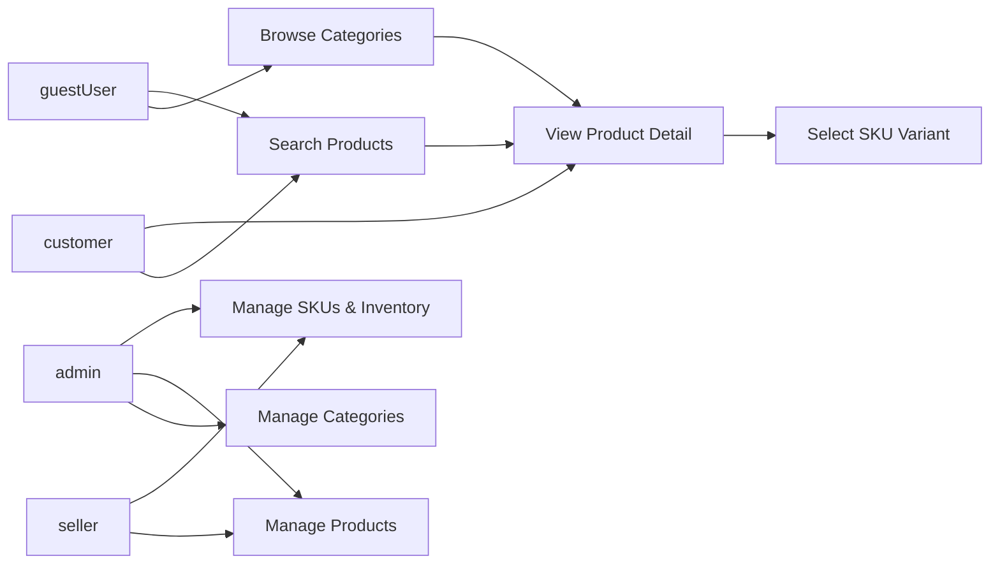

# Product and Catalog Business Requirements

## 1. Introduction

### 1.1 Purpose of This Document
THE purpose of this document SHALL be to define all business requirements and rules related to products, categories, SKUs (variants), search, and catalog browsing for the shoppingMall platform. THE document SHALL focus on **what** the system must do from a business perspective, not **how** it is technically implemented.

### 1.2 Scope
THE scope of this document SHALL cover:
- Definition of products and their attributes.
- Definition of categories and their hierarchy for navigation.
- Business modeling of SKUs and product variants (color, size, options).
- Search, sorting, and filtering behavior for catalog browsing.
- Visibility and availability rules for products and SKUs across actors.
- Catalog-related error handling and performance expectations from a business perspective.

THE scope SHALL exclude technical details such as database schema design, API contract definitions, infrastructure choices, or user interface layout.

### 1.3 Relationship to Other Documents
- THE "Service Overview" document SHALL describe the overall vision and high-level features that this catalog supports.
- THE "Seller Portal and Inventory Requirements" document SHALL define detailed seller-facing processes for managing products, SKUs, and inventory, which SHALL remain consistent with the concepts defined here.
- THE "User Actors and Permissions" document SHALL provide the definitive actor permission model that influences which operations are permitted for guestUser, customer, seller, and admin.

### 1.4 Definitions and Terminology
- **Product**: A sellable item concept that customers can browse and purchase. A product can have one or more SKUs.
- **SKU (Stock Keeping Unit)**: The most granular sellable unit representing a specific combination of variant attributes (for example, color and size). Inventory and price are managed per SKU.
- **Variant Attribute**: An attribute used to differentiate SKUs under the same product (for example, color, size, capacity).
- **Base Attribute**: An attribute of the product concept that is common across all SKUs (for example, product name, brand, description).
- **Category**: A logical grouping of products used for browsing and discovery (for example, "Electronics", "Men's Shoes").
- **guestUser**: An unauthenticated visitor who can browse the catalog but cannot place orders.
- **customer**: An authenticated end-user who can place orders.
- **seller**: A merchant entity that lists and manages products and SKUs.
- **admin**: A platform administrator with broad management capabilities.

## 2. Product Structure and Attributes

### 2.1 Conceptual Product Model

- THE shoppingMall product model SHALL represent a product as a business concept that can contain one or more SKUs.
- THE shoppingMall product model SHALL allow products without variants to be represented as a single-SKU product.
- THE shoppingMall catalog SHALL separate product-level information from SKU-level information in business terms so that common attributes and variant-specific attributes are clearly distinguished.

### 2.2 Core Product Attributes

Ubiquitous requirements about product attributes:
- THE shoppingMall system SHALL store for each product a title that clearly identifies the product in the catalog in English.
- THE shoppingMall system SHALL store for each product a short summary description suitable for listing views.
- THE shoppingMall system SHALL store for each product a detailed description suitable for product detail views, including key features and usage information.
- THE shoppingMall system SHALL store for each product at least one primary image reference to visually represent the item.
- THE shoppingMall system SHALL support multiple additional image references per product for gallery-style display.
- THE shoppingMall system SHALL store for each product the seller entity that owns and manages the product.
- THE shoppingMall system SHALL store for each product a primary category association used for primary classification.
- THE shoppingMall system SHALL allow zero or more secondary category associations for cross-listing products in multiple categories.
- THE shoppingMall system SHALL store for each product a status indicating its lifecycle state at product level (such as "draft", "active", "inactive", "archived") in business terms.
- THE shoppingMall system SHALL store for each product audit information in business terms, including creation time, last update time, and creating actor (seller or admin).

Validation-related business rules:
- THE shoppingMall system SHALL require the product title to be non-empty and at most a business-defined maximum length.
- THE shoppingMall system SHALL require the short summary description to be non-empty for any product in active state.
- THE shoppingMall system SHALL allow the detailed description to be empty only for products in draft state and SHALL require it before a product becomes active.
- THE shoppingMall system SHALL require at least one image reference to be present before a product becomes active.

### 2.3 Optional and Extended Attributes

- THE shoppingMall system SHALL support optional brand information per product.
- THE shoppingMall system SHALL support optional manufacturer information per product.
- THE shoppingMall system SHALL support optional model name or model number fields where relevant.
- THE shoppingMall system SHALL support optional tags or keywords at product level for improved search and discovery.
- THE shoppingMall system SHALL support optional product specifications stored as structured key-value pairs (for example, "material", "dimensions", "weight").

IF a product belongs to a regulated category that requires additional attributes (for example, safety warnings or age restrictions), THEN THE shoppingMall system SHALL require the presence of those additional attributes before allowing the product to become active.

### 2.4 Product Lifecycle (Draft, Active, Inactive, Archived)

State-driven requirements:
- WHILE a product is in draft state, THE shoppingMall system SHALL restrict visibility of the product to its owning seller and admins only.
- WHILE a product is in active state, THE shoppingMall system SHALL make the product discoverable in search, category listings, and product detail views subject to visibility rules defined later in this document.
- WHILE a product is in inactive state, THE shoppingMall system SHALL hide the product from guestUser and customer navigation but SHALL allow admins and the owning seller to view and edit it.
- WHILE a product is in archived state, THE shoppingMall system SHALL prevent further edits by sellers and SHALL restrict updates to admins for compliance or record-keeping purposes.

Event-driven requirements:
- WHEN a seller creates a new product, THE shoppingMall system SHALL initialize the product in draft state.
- WHEN a seller requests activation of a product, THE shoppingMall system SHALL validate all mandatory attributes and SHALL reject activation if mandatory data is missing or invalid.
- WHEN an admin or seller deactivates an active product for business reasons, THE shoppingMall system SHALL move the product to inactive state and SHALL immediately stop listing it for guestUser and customer.
- WHEN an admin archives a product, THE shoppingMall system SHALL mark the product as archived and SHALL ensure it no longer appears in any customer-facing listing or search.

Unwanted behavior requirements:
- IF a product has no associated SKUs, THEN THE shoppingMall system SHALL deny activation and SHALL provide a clear business error indicating that at least one SKU is required.
- IF a product in active state loses all purchasable SKUs due to inventory or other conditions, THEN THE shoppingMall system SHALL treat the product as not purchasable while still allowing it to be browsed, as defined in visibility and availability rules.

## 3. Categories and Navigation

### 3.1 Category Hierarchy Model

- THE shoppingMall system SHALL support a hierarchical category structure where each category can have zero or more child categories and at most one parent category, except for root categories.
- THE shoppingMall system SHALL support multiple root categories to represent top-level sections of the mall (for example, "Fashion", "Electronics", "Home").
- THE shoppingMall system SHALL maintain a stable unique identifier for each category for referencing from products and navigation logic.

State-driven requirements:
- WHILE a category is marked as active, THE shoppingMall system SHALL allow it to appear in navigation menus and category listings for guestUser and customer.
- WHILE a category is marked as inactive, THE shoppingMall system SHALL exclude it from guestUser and customer navigation but SHALL allow admins to manage it and sellers to see it in a read-only context where needed for migration.

### 3.2 Category Attributes

- THE shoppingMall system SHALL store for each category a name that is unique among siblings in the same parent category.
- THE shoppingMall system SHALL store for each category an optional description for explanatory text.
- THE shoppingMall system SHALL store for each category an optional image or icon reference used to visually represent the category.
- THE shoppingMall system SHALL store for each category an ordering index used to determine display order among siblings.

Validation rules:
- THE shoppingMall system SHALL require a non-empty name for every category.
- THE shoppingMall system SHALL prevent cycles in the category hierarchy at the business level so that a category cannot become its own ancestor.

### 3.3 Category Assignment Rules

Event-driven and ubiquitous requirements:
- WHEN a seller or admin assigns a product to a category, THE shoppingMall system SHALL ensure that the referenced category exists and is active or explicitly allowed for transitional use.
- THE shoppingMall system SHALL allow a product to be assigned to one mandatory primary category and zero or more secondary categories.
- THE shoppingMall system SHALL allow admins to reassign products from one category to another while preserving historical audit information.
- THE shoppingMall system SHALL ensure that removal of a category from the hierarchy triggers a business decision for reassigning or archiving products currently mapped to that category.

Unwanted behavior requirements:
- IF a category is deactivated, THEN THE shoppingMall system SHALL prevent new products from being assigned to it and SHALL consider existing products mapped to it as having an invalid primary category until reassigned.
- IF a category is deleted as a business operation, THEN THE shoppingMall system SHALL require that no products remain assigned to it as primary category and SHALL either reassign or archive such products according to admin decisions.

### 3.4 Browsing and Navigation Behavior

Event-driven browsing requirements:
- WHEN a guestUser selects a top-level category, THE shoppingMall system SHALL display products from that category and its active subcategories, filtered by visibility rules.
- WHEN a customer selects a subcategory, THE shoppingMall system SHALL display products mapped to that subcategory and optionally to its descendants, according to business configuration.
- WHEN a user navigates to a category that has no visible products, THE shoppingMall system SHALL show an empty result state and MAY recommend related categories based on business rules.

State-driven navigation:
- WHILE a category has active child categories, THE shoppingMall system SHALL allow navigation through the hierarchy down to leaf categories.

### 3.5 Category Management Rules by Actor

Role-based business rules:
- WHERE the actor is an admin, THE shoppingMall system SHALL allow creating, editing, activating, deactivating, and deleting categories, subject to constraints about assigned products.
- WHERE the actor is a seller, THE shoppingMall system SHALL restrict access to read-only viewing of category structure for the purpose of assigning products and SHALL prevent the seller from creating or deleting categories.
- WHERE the actor is a guestUser or customer, THE shoppingMall system SHALL allow only reading the active category structure for browsing.

## 4. SKU and Variant Modeling

### 4.1 Concept of SKU versus Product

- THE shoppingMall system SHALL treat SKUs as the atomic sellable units to which inventory levels, prices, and specific variant attributes are attached.
- THE shoppingMall system SHALL ensure that every SKU belongs to exactly one product.
- THE shoppingMall system SHALL allow a product to have one or more SKUs, enabling both single-variant and multi-variant products.

### 4.2 Variant Dimensions (Color, Size, Options)

- THE shoppingMall system SHALL support defining a set of variant attribute types per product, such as color, size, capacity, or custom options appropriate to the product category.
- THE shoppingMall system SHALL allow each SKU to be associated with values for each variant attribute type defined for its product.
- THE shoppingMall system SHALL ensure that within a single product, the combination of variant attribute values that identifies a SKU is unique.

Event-driven requirements:
- WHEN a seller defines variant attribute types for a product, THE shoppingMall system SHALL ensure that these definitions are applied consistently to all SKUs under that product.
- WHEN a seller attempts to create a SKU whose variant combination already exists within the same product, THE shoppingMall system SHALL reject the creation and SHALL inform the seller that the combination must be unique.

### 4.3 SKU Attributes (Price, Stock, Identifiers)

Ubiquitous requirements:
- THE shoppingMall system SHALL store for each SKU a unique SKU identifier that is distinct within the seller or platform, as defined by business policy.
- THE shoppingMall system SHALL store for each SKU a selling price.
- THE shoppingMall system SHALL support optional reference prices such as original price or list price for discount display.
- THE shoppingMall system SHALL store for each SKU an inventory quantity that represents the available stock for sale.
- THE shoppingMall system SHALL support an optional SKU-level status (such as "active", "inactive", "discontinued") independent of the product status.
- THE shoppingMall system SHALL support optional external identifiers per SKU, such as barcodes or manufacturer codes, for integration with physical inventory systems.

Validation and constraints:
- THE shoppingMall system SHALL require the selling price to be greater than zero for any SKU that is active and purchasable, except for explicitly configured promotional cases such as samples.
- THE shoppingMall system SHALL allow a selling price of zero only for specific business cases such as samples or promotional giveaways and SHALL require admin-level configuration to enable such cases.
- THE shoppingMall system SHALL require inventory quantity to be non-negative.

### 4.4 SKU Lifecycle and State

State-driven requirements:
- WHILE a SKU is in active state, THE shoppingMall system SHALL allow it to be considered for purchase if inventory and other availability conditions are met.
- WHILE a SKU is in inactive state, THE shoppingMall system SHALL prevent it from being added to cart and SHALL not display it as selectable in product variant selectors for guestUser or customer.
- WHILE a SKU is in discontinued state, THE shoppingMall system SHALL prevent any further selling and SHALL allow it only to appear in historical order records.

Event-driven requirements:
- WHEN a seller creates a new SKU, THE shoppingMall system SHALL allow its state to be draft or active depending on business policy and SHALL enforce data validation before activation.
- WHEN inventory for a SKU reaches zero, THE shoppingMall system SHALL treat the SKU as out-of-stock and SHALL prevent new orders that would exceed available stock.
- WHEN an admin or seller marks a SKU as discontinued, THE shoppingMall system SHALL ensure that the SKU is no longer selectable for new orders while remaining available in historical order data.

Unwanted behavior requirements:
- IF an attempt is made to sell more units of a SKU than available inventory, THEN THE shoppingMall system SHALL block the operation and SHALL return a business error indicating insufficient stock.

### 4.5 Inventory-related Visibility Rules

- THE shoppingMall system SHALL distinguish between visibility of a product in the catalog and availability of individual SKUs for purchase.
- THE shoppingMall system SHALL allow a product to remain visible in the catalog even when all SKUs are out-of-stock, provided business configuration allows such behavior.
- THE shoppingMall system SHALL allow configuration where products with all SKUs out-of-stock are hidden from catalog listings for guestUser and customer but remain visible to admins and sellers for management purposes.

Event-driven requirements:
- WHEN at least one SKU of a product is active and in-stock, THE shoppingMall system SHALL consider the product purchasable.
- WHEN no SKUs of a product are active and in-stock, THE shoppingMall system SHALL consider the product not purchasable and SHALL disable add-to-cart actions for that product for guestUser and customer.

## 5. Search and Filtering Behavior

### 5.1 Searchable Entities and Fields

- THE shoppingMall system SHALL provide a search feature over the product catalog for guestUser, customer, seller, and admin.
- THE shoppingMall system SHALL use product-level fields such as title, short summary, detailed description, brand, model, and tags as search inputs.
- THE shoppingMall system SHALL also use SKU-level attributes such as variant names or codes as additional signals when determining search matches.

Event-driven requirements:
- WHEN a user submits a search query, THE shoppingMall system SHALL return a list of matching products ordered according to the selected sorting rule and relevance.
- WHEN a search query matches no products, THE shoppingMall system SHALL respond with an empty result set and MAY provide alternative suggestions based on business rules.

### 5.2 Search from Different Actors

Role-based behavior:
- WHERE the actor is a guestUser, THE shoppingMall system SHALL restrict search results to products and SKUs that are publicly visible and not limited to specific customer segments.
- WHERE the actor is a customer, THE shoppingMall system SHALL return all products and SKUs visible to that customer, including those targeted to specific customer groups if such business rules exist.
- WHERE the actor is a seller, THE shoppingMall system SHALL allow searching their own products regardless of public visibility, for management purposes, and MAY allow searching public catalog for reference.
- WHERE the actor is an admin, THE shoppingMall system SHALL allow searching across all products and SKUs including draft, inactive, and archived ones.

### 5.3 Sorting Options

- THE shoppingMall system SHALL support sorting search and category results at least by relevance, price ascending, price descending, newest products, and best-selling or popular products as business-defined options.

Event-driven requirement:
- WHEN a user selects a sorting option, THE shoppingMall system SHALL apply that option to the visible result set and SHALL present results consistent with the selected criterion.

### 5.4 Filtering and Faceted Navigation

- THE shoppingMall system SHALL support filtering search and category results by category, price range, and other relevant product or SKU attributes.
- THE shoppingMall system SHALL support facet-based filtering so that users can narrow down results by multiple attributes simultaneously (for example, color, size, brand).

Event-driven requirements:
- WHEN a user applies a category filter, THE shoppingMall system SHALL restrict results to products belonging to the selected categories.
- WHEN a user applies a price range filter, THE shoppingMall system SHALL restrict results to products having at least one SKU whose price falls within the specified range.
- WHEN a user applies one or more attribute filters, THE shoppingMall system SHALL restrict results to products whose SKUs or product attributes satisfy all selected filters.

Unwanted behavior:
- IF a user chooses filter combinations that lead to zero matching products, THEN THE shoppingMall system SHALL display an empty result state and SHALL allow users to clear or adjust filters.

### 5.5 Search Result Pagination and Limits

- THE shoppingMall system SHALL paginate search and category results to present a manageable number of items per page.
- THE shoppingMall system SHALL support a business-configurable default page size and a maximum allowable page size to avoid excessively large result sets.
- THE shoppingMall system SHALL provide a way to request subsequent pages of results in a defined order (for example, by page number or cursor).

Event-driven requirement:
- WHEN a user requests a specific page or slice of results, THE shoppingMall system SHALL return that portion of products if it exists and SHALL return an empty list if the requested position exceeds the available range.

### 5.6 Error and Edge Case Handling in Search

Unwanted behavior requirements:
- IF a search query contains unsupported characters or exceeds the maximum allowed length, THEN THE shoppingMall system SHALL reject the query and SHALL return a validation error with guidance to adjust the query.
- IF internal catalog data is temporarily unavailable, THEN THE shoppingMall system SHALL return an appropriate error message indicating that search is temporarily unavailable and SHALL encourage the user to retry later.

## 6. Visibility and Availability Rules

### 6.1 Visibility of Products and SKUs by Actor Type

Role-based visibility requirements:
- WHERE the actor is a guestUser, THE shoppingMall system SHALL show only products and SKUs that are in active state at both product and SKU level and not restricted to authenticated users.
- WHERE the actor is a customer, THE shoppingMall system SHALL show all products and SKUs that are active and available to the customer segment, including those restricted to registered members.
- WHERE the actor is a seller, THE shoppingMall system SHALL allow viewing of all products and SKUs owned by that seller in any lifecycle state plus any public catalog as needed for comparison, while preventing access to other sellers’ management views.
- WHERE the actor is an admin, THE shoppingMall system SHALL allow viewing of all products and SKUs in any state for operational oversight.

### 6.2 Conditions for Being Purchasable

Ubiquitous requirements:
- THE shoppingMall system SHALL define a SKU as purchasable only when all of the following conditions are true:
  - The associated product is in active state.
  - The SKU is in active state and not discontinued.
  - The SKU has sufficient inventory or is explicitly allowed for overselling under configured rules.
  - Any additional business constraints (such as restricted customer segments) are satisfied.

Event-driven requirements:
- WHEN a customer attempts to add a SKU to the cart, THE shoppingMall system SHALL verify that the SKU is purchasable according to the conditions above.
- WHEN a customer views a product detail page, THE shoppingMall system SHALL indicate which variant combinations are available for purchase and which are out-of-stock or otherwise unavailable.

Unwanted behavior requirements:
- IF a SKU becomes non-purchasable between browsing and checkout, THEN THE shoppingMall system SHALL prevent order creation for that SKU and SHALL present a clear message indicating that the SKU is no longer available or has changed.

### 6.3 Handling Out-of-Stock and Discontinued Items

State-driven and unwanted behavior requirements:
- WHILE a SKU is out-of-stock but not discontinued, THE shoppingMall system SHALL mark the SKU as temporarily unavailable for purchase but SHALL allow it to be shown in product variant selectors with an out-of-stock indication.
- WHILE a SKU is discontinued, THE shoppingMall system SHALL not show it in variant selectors for new orders but SHALL retain it for historical data in order records.
- IF all SKUs of a product are discontinued, THEN THE shoppingMall system SHALL prevent the product from being active for sale and SHALL allow admins to archive or deactivate the product.

### 6.4 Pre-order or Coming Soon Concepts (Optional)

Optional feature requirements:
- WHERE the platform business model supports pre-orders, THE shoppingMall system SHALL allow a SKU state representing pre-order availability, including an expected shipping start date in business terms.
- WHERE a SKU is in pre-order state, THE shoppingMall system SHALL allow customers to add it to cart and place orders subject to additional pre-order terms defined in order and payment documents.
- WHERE a product or SKU is marked as "coming soon" without accepting orders, THE shoppingMall system SHALL allow it to appear in catalog browsing with a clear indication that purchase is not yet available.

## 7. Performance and Non-functional Expectations (Catalog-specific)

Ubiquitous performance requirements from a business perspective:
- THE shoppingMall system SHALL return search and category result responses fast enough that typical users perceive them as completing within a few seconds under normal load.
- THE shoppingMall system SHALL be able to handle high-volume browsing scenarios where many users are searching or filtering simultaneously, without significant degradation of response times from a business expectation standpoint.
- THE shoppingMall system SHALL ensure that frequently accessed catalog information such as popular categories and best-selling products is delivered efficiently.

Consistency requirements:
- WHILE catalog data changes are being processed (for example, inventory updates or product status changes), THE shoppingMall system SHALL maintain a consistent user experience where a product is not shown as both purchasable and not purchasable within the same interaction for a given user.

## 8. Error Handling and User-facing Messages (Business View)

### 8.1 Typical Error Scenarios

Unwanted behavior requirements:
- IF a user attempts to view a product that no longer exists or has been fully archived, THEN THE shoppingMall system SHALL return a not-found business response and SHALL not expose internal catalog identifiers.
- IF a user attempts to access a product or category that is inactive or restricted for their actor type, THEN THE shoppingMall system SHALL deny access and SHALL present a generic unavailability message instead of internal implementation details.

### 8.2 Validation Failures for Catalog Management

- IF a seller submits product data that fails business validation (such as missing mandatory fields or exceeding allowed lengths), THEN THE shoppingMall system SHALL reject the submission and SHALL provide a list of failed validation rules in business terms.
- IF a seller attempts to create or update a SKU with invalid data (such as negative inventory or non-positive price for a normal sale), THEN THE shoppingMall system SHALL reject the change and SHALL describe each violated rule.

### 8.3 Catalog Data Inconsistency Handling

- IF catalog data becomes inconsistent from a business perspective (for example, a SKU references a deleted product or category), THEN THE shoppingMall system SHALL prevent that inconsistent SKU from appearing in guestUser or customer listings until the inconsistency is resolved by an admin.
- IF multiple conflicting rules affect product visibility (for example, product is active but all SKUs are discontinued), THEN THE shoppingMall system SHALL favor safety and compliance by preventing purchase and by optionally hiding the product based on configuration.

## 9. Visual Overview of Catalog Relationships

This diagram is conceptual and SHALL not be interpreted as a technical architecture. It only illustrates business relationships between actors and catalog entities.

## 10. Summary of Key Requirements (Consolidated EARS Examples)

This section summarizes representative key requirements across the catalog domain in EARS format. It does not replace the detailed sections above but reinforces the most critical rules.

- THE shoppingMall system SHALL maintain products as business concepts that group one or more SKUs with shared attributes.
- THE shoppingMall system SHALL maintain SKUs as atomic sellable units with their own price, inventory, and variant attributes.
- WHEN a seller activates a product, THE shoppingMall system SHALL validate that all required product and SKU fields are complete and SHALL reject activation if validation fails.
- WHEN a customer performs a search query, THE shoppingMall system SHALL return products that match the query and are visible and purchasable for that customer according to actor-specific rules.
- WHEN inventory for a SKU reaches zero, THE shoppingMall system SHALL prevent further purchases of that SKU and SHALL mark it as out-of-stock in product views.
- WHILE a product is in draft state, THE shoppingMall system SHALL restrict its visibility to the owning seller and admins.
- WHERE the actor is a guestUser, THE shoppingMall system SHALL display only products and SKUs that are publicly visible and active.
- IF a user attempts to access a product or category that is inactive or restricted, THEN THE shoppingMall system SHALL deny access and SHALL show an appropriate unavailability message.
- IF inconsistent catalog data is detected for a product or SKU, THEN THE shoppingMall system SHALL exclude that item from guestUser and customer search and listings until corrected by an admin.

THE requirements in this document describe business behavior only. All technical implementation decisions, including architecture, database design, and API structures, SHALL be made by the development team based on these business rules.