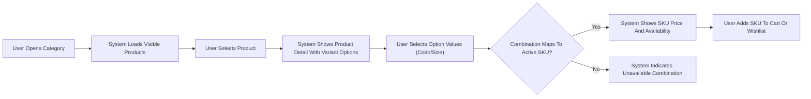
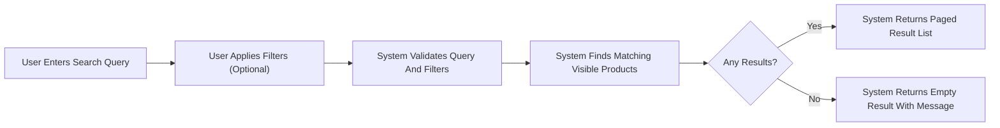

# Product and Catalog Requirements for shoppingMall Backend

## 1. Introduction

This document defines the business requirements for the product and catalog domain of the **shoppingMall** e-commerce platform. It specifies how products, categories, variants (SKUs), and catalog browsing and search must behave from a business perspective so that backend developers can implement the required logic.

The focus is on **WHAT** the system must do, not **HOW** to implement it. All requirements are written in natural language using EARS (Easy Approach to Requirements Syntax) where applicable. No database schemas, API specifications, or infrastructure details are included.

## 2. Business Context and Scope

The shoppingMall platform connects **customers**, **sellers**, and **platform admins** in an online marketplace. Sellers list products with variants such as size, color, and other options. Customers browse the catalog, search and filter products, view product details (including reviews and ratings), and add specific SKUs to their cart or wishlist before placing orders.

This document covers the following scope:
- Product definition and core attributes.
- Category hierarchy, navigation, and product-category relationships.
- Product variants and SKU-level modeling from a business standpoint.
- Catalog browsing, sorting, filtering, and search behavior.
- Catalog visibility, including active/inactive products and out-of-stock behavior.
- Catalog-related business rules, validation, and error handling at the business level.

Out of scope (defined in other documents):
- Cart, wishlist, and order creation behavior (see **Cart, Wishlist, and Order Flow Requirements**).
- Inventory decrement/increment and fulfillment timelines (see **Inventory and Fulfillment Requirements**).
- Detailed review and rating business rules (see **Review and Rating Requirements**).
- Authentication, payments, and non-functional requirements.

## 3. User Actors in the Catalog Domain

The following actors interact with the catalog domain:

- **guestUser**: Unauthenticated visitors who can browse the catalog, search products, view categories, product details, and reviews, and build a temporary cart or wishlist.
- **customer**: Authenticated end users who can do everything guests can do plus manage wishlists persistently, view personalized recommendations (if configured), and see order-related visibility (e.g., review eligibility indication).
- **seller**: Merchants who create and manage their own products, variants, SKUs, and catalog visibility for their listings, subject to platform rules and admin moderation.
- **platformAdmin**: Platform operators who can manage all products and categories, override visibility, and moderate catalog content.

### 3.1 Actor Capabilities in Catalog Domain (Business Summary)

- guestUser: Browse categories, search products, view active and allowed products, view stock availability at a high level (e.g., in stock / out of stock), see reviews and ratings.
- customer: All guest capabilities plus see personalized elements such as recently viewed products and items saved in wishlist.
- seller: Create/edit products, manage categories associations for their products (within allowed category tree), manage SKUs and inventory values conceptually, set product visibility (e.g., draft vs published) within platform rules.
- platformAdmin: Manage global category tree, moderate product content, force-hide or feature products, and adjust visibility for compliance or business reasons.

## 4. Product Structure and Attributes

This section defines what constitutes a **product** on shoppingMall and which attributes are required or optional from a business perspective.

### 4.1 Product Identity and Ownership

- THE "product" SHALL represent a **sellable catalog item definition** that groups one or more SKUs under a common name, description, and media.
- THE "product" SHALL belong to exactly one **seller** as its owner.
- THE "product" SHALL have a business-meaningful **product identifier** that is unique within the platform.

### 4.2 Core Product Attributes

The following requirements define the core fields for a product as seen from the business side.

- THE "product entity" SHALL have a **name** that is non-empty and up to a reasonable maximum length (for example, 200 characters) in the configured catalog language.
- THE "product entity" SHALL have a **short description** suitable for listing views.
- THE "product entity" SHALL have a **detailed description** suitable for product detail views, which may include structured text such as bullet points.
- THE "product entity" SHALL have at least one **primary product image** used in listing views.
- THE "product entity" SHALL support multiple **additional images** for detail views.
- THE "product entity" SHALL have a **brand label** where applicable; where the seller does not specify a brand, THE "system" SHALL treat the product as seller-branded or unbranded according to platform rules.
- THE "product entity" SHALL have a **default category association** representing its primary category within the catalog.
- WHERE "product type" supports **variants**, THE "product entity" SHALL indicate that it is a **multi-SKU product**; otherwise, it shall behave as a single-SKU product.

### 4.3 Product Pricing and Tax-Related Attributes

Note: concrete tax calculation rules may be handled elsewhere; here we define business fields.

- THE "product entity" SHALL support a **base price** that represents the default price before applying discounts and promotions, on a per-SKU basis rather than per product when variants differ.
- WHERE all SKUs share the same price, THE "system" SHALL allow a **shared price configuration** for easier management.
- WHERE SKUs have different prices, THE "system" SHALL allow **per-SKU price overrides**.
- THE "product entity" SHALL support a **compare-at price** or "original price" field for displaying discounts, subject to applicable regulations and platform policies.

### 4.4 Product Status and Lifecycle

- THE "product entity" SHALL have a **lifecycle status** with at least the following business states: draft, pending review (optional per platform policy), active, inactive, and discontinued.
- WHEN a seller creates a new product, THE "system" SHALL initially set the product status to **draft**.
- WHERE the platform requires moderation, THE "system" SHALL allow a **pending review** state where platformAdmin needs to approve the product before it becomes active.
- WHEN the product status is **active**, THE "system" SHALL make the product visible in search and category listings for allowed audiences, subject to stock and visibility rules.
- WHEN the product status is **inactive**, THE "system" SHALL prevent new orders or cart additions while allowing existing orders to reference the product.
- WHEN the product status is **discontinued**, THE "system" SHALL prevent additions to cart or wishlist and may hide the product from general browsing while still allowing access from order history.

### 4.5 Product Compliance and Content Controls

- THE "product entity" SHALL support **compliance-related flags** such as age restriction categories (e.g., adult-only), hazardous materials indicators, or region-specific sale restrictions.
- WHERE a product is flagged as **region-restricted**, THE "system" SHALL ensure that only customers in allowed regions can see or buy the product.
- THE "product entity" SHALL support **content moderation flags** (e.g., hidden by admin, under investigation) which affect visibility rules described later.

## 5. Categories and Navigation

This section defines how products are organized via categories and how navigation through the catalog works.

### 5.1 Category Hierarchy

- THE "category" SHALL represent a navigational grouping of products.
- THE "category tree" SHALL support multiple levels of nesting (e.g., main category → subcategory → sub-subcategory).
- THE "category entity" SHALL have a **name**, optional **description**, and optional **image/icon** for navigation contexts.
- THE "category tree" SHALL have exactly one **root level** comprised of top-level categories.
- THE "category entity" SHALL support a **display order index** that determines the ordering among siblings.

### 5.2 Product-Category Relationships

- THE "product-category relationship" SHALL allow each product to belong to **one primary category** and zero or more **secondary categories**.
- WHEN a product has a primary category, THE "system" SHALL use that category for breadcrumbs and default listing placement.
- WHEN a product belongs to multiple categories, THE "system" SHALL show the product in all relevant category listings where it is visible.

### 5.3 Category Visibility and Status

- THE "category" SHALL have a **visibility status** (active/inactive).
- WHEN a category is **inactive**, THE "system" SHALL hide the category from navigation and category listing pages.
- IF a category becomes inactive, THEN THE "system" SHALL still allow products in that category to be found via search where business rules allow this, except when products themselves are inactive.
- WHERE a category is **marked as deleted** or deprecated, THE "system" SHALL prevent new products from being assigned to it and SHALL require reassignment or archival rules defined by platform policy.

### 5.4 Category Navigation Behavior

- WHEN a user (guestUser or customer) selects a category, THE "system" SHALL display a list of **visible products** that belong to that category, respecting product and SKU visibility rules.
- THE "system" SHALL support navigating from top-level categories to subcategories, showing appropriate category lists and product listings at each level.
- WHERE a category has no visible products and no visible subcategories, THE "system" SHALL indicate that there are no available products rather than failing.

## 6. Product Variants and SKUs

This section defines how variants and SKUs are modeled from a business perspective.

### 6.1 Definition of SKU and Variant

- THE "SKU" (stock keeping unit) SHALL represent a **concrete sellable variant** of a product with a specific combination of options such as size, color, and other attributes.
- THE "SKU" SHALL be the **unit of inventory tracking** as described in the inventory requirements.
- THE "SKU" SHALL have a **seller-facing SKU code** that may align with the seller’s internal systems.
- THE "SKU" SHALL be uniquely associated with exactly one product.

### 6.2 Variant Dimensions (Options)

- THE "product entity" SHALL support multiple **variant option types**, such as color, size, material, style, or other seller-defined attributes.
- WHERE a product is configured as multi-variant, THE "system" SHALL treat each unique combination of option values as a distinct SKU.
- THE "product entity" SHALL support **option type ordering** (e.g., color first, size second) to ensure consistent display and interpretation.

### 6.3 SKU Attributes

- THE "SKU" SHALL have its own **price** where it differs from the product-level base price.
- THE "SKU" SHALL have its own **inventory quantity** tracked in the inventory domain.
- THE "SKU" SHALL have its own **status** (active/inactive/discontinued) separate from the product status.
- THE "SKU" SHALL support its own **barcode or external identifier** (e.g., EAN, UPC) where applicable.
- THE "SKU" SHALL inherit the product’s **name, description, brand, and category** but MAY have additional identifying labels such as color and size appended for customer display.

### 6.4 SKU and Product Status Interaction

- WHEN a product is **inactive or discontinued**, THE "system" SHALL treat all SKUs under that product as unavailable for new cart additions and new orders, regardless of SKU-level status.
- WHEN a product is **active** but a specific SKU is **inactive or out of stock**, THE "system" SHALL show the product but SHALL prevent selection or purchase of that specific SKU.
- WHEN all SKUs of an active product are **inactive or out of stock**, THE "system" SHALL display the product as **unavailable** or hide it from listings according to configuration.

### 6.5 Variant Selection Behavior

- WHEN a user views a product detail page, THE "system" SHALL allow the user to select among available **variant options** (e.g., select color then size) to choose a specific SKU.
- IF a user selects a combination of variant options that does not correspond to any active SKU, THEN THE "system" SHALL indicate that the selected combination is unavailable and SHALL not allow adding it to cart or wishlist.
- WHILE a valid SKU is selected, THE "system" SHALL display the correct SKU-level price, availability, and any SKU-specific information.

## 7. Search and Filtering Behavior

This section defines how catalog search and filtering must behave from a business standpoint.

### 7.1 Search Entry Points

- THE "system" SHALL allow guestUser and customer to search products using a **free-text query**.
- WHERE configured, THE "system" SHALL allow **category-scoped search** where the query is limited to products within a selected category.

### 7.2 Search Result Set and Ordering

- WHEN a user executes a search query, THE "system" SHALL return a list of **products** that match the query and are visible to that user.
- THE "system" SHALL only include products in search results where:
  - The product status is **active**.
  - At least one SKU is **available for sale** (subject to out-of-stock rules below).
  - The product is not hidden by compliance or admin moderation rules.
- WHERE no products match the query, THE "system" SHALL return an empty result set with a message stating that no products were found.
- THE "system" SHALL support **sorting** of search results by at least the following criteria: relevance (default), price ascending, price descending, newest products first, and top-rated products.

### 7.3 Filtering Behavior

- THE "system" SHALL support filtering search and category listings by **price range** using minimum and maximum values.
- THE "system" SHALL support filtering by **brand** where brands are configured.
- THE "system" SHALL support filtering by **category** (over and above the current category scope where applicable).
- THE "system" SHALL support filtering by **product attributes such as color and size** where variant option types exist.
- WHERE a filter is applied that yields no results, THE "system" SHALL return an empty result set with an indication that no products match the chosen filters.

### 7.4 Search and Filter Performance Expectations

- WHEN a user submits a search query under normal load, THE "system" SHALL return results within **2 seconds** for typical query patterns.
- WHEN a user applies or changes filters on an existing result set, THE "system" SHALL respond within **2 seconds** under normal load.

## 8. Catalog Visibility Rules

This section describes rules determining whether a product or SKU appears in listings or can be purchased.

### 8.1 Basic Product Visibility

- THE "system" SHALL display products in category listings and search results **only when** the product is active and not hidden by admin or compliance flags.
- WHERE a product is marked as **hidden by admin**, THE "system" SHALL prevent it from appearing in catalog listings for guestUser and customer, but SHALL allow platformAdmin to view and manage it.
- WHERE a product is marked as **age-restricted**, THE "system" SHALL restrict visibility and purchase to users who meet age and region criteria according to business policy.

### 8.2 Handling Inactive Products

- WHEN a product is set to **inactive** by a seller, THEN THE "system" SHALL remove it from search results and category listings for guestUser and customer.
- WHEN a product is **inactive**, THE "system" SHALL still allow the product to be referenced in **order history** and related views.
- IF a customer has an inactive product in a cart or wishlist from before deactivation, THEN THE "system" SHALL prevent checkout of that product and SHALL clearly indicate its unavailability, as detailed in the cart and order flow document.

### 8.3 Handling Out-of-Stock Products and SKUs

- THE "system" SHALL treat **out-of-stock** status at the SKU level according to the inventory requirements.
- WHEN a SKU is **out of stock**, THE "system" SHALL not allow that SKU to be added to cart or wishlist.
- WHEN a product remains active but all SKUs are **out of stock**, THE "system" SHALL either:
  - Display the product as **temporarily unavailable** while keeping it discoverable, or
  - Hide it from catalog listings,
  according to a configurable business rule.
- WHERE the platform supports **backorders or pre-orders**, THE "system" SHALL override out-of-stock behavior as specified in the inventory and order flow documents.

### 8.4 Seller-Based Visibility

- WHERE a seller account is **suspended or deactivated**, THE "system" SHALL hide all products owned by that seller from catalog listings for guestUser and customer.
- WHERE a seller account is restored, THE "system" SHALL restore visibility of active products owned by that seller, subject to product-level and admin-level visibility flags.

### 8.5 Region and Channel-Based Visibility

- WHERE products have **region restrictions**, THE "system" SHALL only show those products to users whose region is allowed based on their address or locale configuration.
- WHERE products are available only in specific **sales channels** (e.g., web only vs marketplace integrations), THE "system" SHALL respect channel constraints when building catalog views for that channel.

## 9. Business Rules and Validation

This section lists additional rules and validation logic relevant to the product and catalog domain.

### 9.1 Product Creation and Editing by Sellers

- WHEN a seller creates or edits a product, THE "system" SHALL validate that required fields such as name, primary image, and primary category are provided.
- IF a seller attempts to set a product to **active** without providing at least one **active SKU** with non-zero inventory (unless backorder rules apply), THEN THE "system" SHALL reject the activation and indicate the missing requirements.
- WHEN a seller attempts to assign a product to a category that is **inactive or deprecated**, THE "system" SHALL prevent the assignment and require a valid category.

### 9.2 SKU Creation and Editing

- WHEN a seller creates a new SKU for a product, THE "system" SHALL require a unique combination of option values for that SKU within the product.
- IF a seller attempts to create a SKU whose option combination already exists and is active, THEN THE "system" SHALL reject the creation due to duplication.
- WHEN a seller modifies SKU-level price or status, THE "system" SHALL update catalog visibility and price displays based on the updated SKU configuration.

### 9.3 Data Validation and Constraints

- THE "system" SHALL enforce reasonable maximum lengths for text fields such as product name, descriptions, and brand to ensure performance and consistency.
- THE "system" SHALL enforce that prices are non-negative and within a configurable maximum.
- THE "system" SHALL enforce that option names and values used for variants are non-empty and distinct per product.

### 9.4 Integration with Reviews and Ratings

- WHEN a product has reviews, THE "system" SHALL show a summary metric (e.g., average rating and review count) in listings and search results, as defined in the reviews document.
- WHERE a product has no reviews, THE "system" SHALL display a neutral representation (e.g., no rating yet) rather than misleading information.

## 10. Error Handling and Edge Cases (Catalog Domain)

This section describes key unwanted behaviors and the required system responses at a business level.

### 10.1 Invalid Product or SKU Access

- IF a user requests a product identifier that does not exist, THEN THE "system" SHALL indicate that the product is not available and SHALL not expose any internal error details.
- IF a user attempts to access a SKU that does not belong to the requested product, THEN THE "system" SHALL treat this as an invalid request and SHALL not expose inconsistent product information.

### 10.2 Restricted or Hidden Products

- IF a user attempts to access a product that is **hidden by admin** or **compliance-restricted** for that user, THEN THE "system" SHALL deny access and SHALL display a generic message that the product is not available.
- IF a seller attempts to view or edit a product that they do not own, THEN THE "system" SHALL deny access according to authorization rules.

### 10.3 Category Navigation Errors

- IF a user attempts to access a category that does not exist or is inactive, THEN THE "system" SHALL return a response indicating that the category is unavailable and SHALL not show inconsistent or partial data.

### 10.4 Search and Filter Errors

- IF a user provides a search query or filter parameters in unsupported formats (for example, non-numeric price filters), THEN THE "system" SHALL treat these parameters as invalid and SHALL either ignore them or prompt for correction according to business decisions, but SHALL not fail unexpectedly.

## 11. Performance and Non-functional Expectations (Catalog Domain)

Catalog-specific performance expectations complement global non-functional requirements.

- THE "catalog subsystem" SHALL support listing pages (category or search results) that return within **2 seconds** under normal load for result sets up to a reasonable page size (for example, 50 items).
- THE "catalog subsystem" SHALL support pagination for large result sets to avoid performance degradation.
- WHILE the system is under heavy but acceptable load, THE "catalog subsystem" SHALL degrade gracefully by limiting page sizes or deferring low-priority computations such as advanced recommendations.

## 12. Mermaid Diagrams of Key Flows

### 12.1 Product Browsing and Variant Selection Flow

### 12.2 Search and Filter Flow

## 13. Assumptions and Out-of-Scope Items

- THE "requirements in this document" SHALL be interpreted as **business-level behavior** only.
- WHERE technical implementation decisions are required (such as search engine technology, indexing strategies, or database schema), THE "development team" SHALL make those decisions independently while ensuring compliance with these business rules.
- Detailed pricing promotions, coupons, and recommendation algorithms are considered out of scope for this document and may be defined separately.

This document provides business requirements only for the product and catalog domain of the shoppingMall backend. All technical implementation decisions, including architecture, data modeling, APIs, and infrastructure, belong to the development team. The document describes **what** the system must do so that developers can choose **how** to implement it in a way that satisfies these requirements.