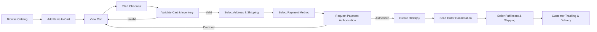
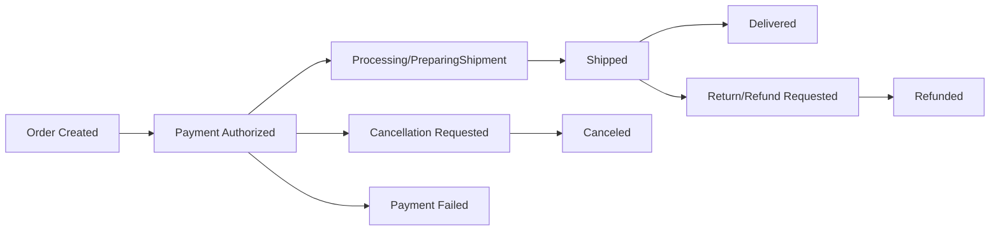

# Cart, Wishlist, and Order Flow Requirements for shoppingMall Backend

## 1. Introduction

### 1.1 Scope of This Document
THE "cart, wishlist, and order flow document" SHALL describe business requirements for shopping carts, wishlists, checkout, order creation, and order tracking for the shoppingMall platform.

THE "cart, wishlist, and order flow document" SHALL cover behaviors for guestUser, customer, seller, and platformAdmin actors in relation to carts, wishlists, and orders.

THE "cart, wishlist, and order flow document" SHALL provide implementation-ready business rules in natural language, using EARS syntax for all functional requirements.

### 1.2 Out of Scope
THE "cart, wishlist, and order flow document" SHALL NOT define API endpoint structures, request/response payloads, or transport protocols.

THE "cart, wishlist, and order flow document" SHALL NOT define database schemas, table designs, or indexing strategies.

THE "cart, wishlist, and order flow document" SHALL NOT define frontend UI layouts, button placements, or visual design requirements.

### 1.3 Assumptions and Dependencies
THE "cart, wishlist, and order flow document" SHALL assume that product, category, and SKU concepts are defined in the "Product and Catalog Requirements" document.

THE "cart, wishlist, and order flow document" SHALL assume that payment states, cancellation, and refund policies are defined in the "Payment and Refund Requirements" document.

THE "cart, wishlist, and order flow document" SHALL assume that inventory reservation and stock deduction rules are defined in the "Inventory and Fulfillment Requirements" document.

THE "cart, wishlist, and order flow document" SHALL assume that authentication and session handling for guestUser and customer are defined in the authentication-focused documents.

## 2. Domain Overview and Actors

### 2.1 shoppingMall Context in the Overall Platform
THE "shoppingMall platform" SHALL support a multi-seller marketplace where customers can purchase products from multiple sellers in a single high-level order.

THE "shoppingMall platform" SHALL allow guestUser actors to start carts and later associate them with a customer account at registration or login.

### 2.2 Relevant User Actors for Cart and Order Flow
THE "guestUser actor" SHALL represent an unauthenticated visitor who can browse products, manage a temporary cart, and create a wishlist only after becoming a customer.

THE "customer actor" SHALL represent a registered user who can maintain persistent carts and wishlists, place orders, track orders, and request cancellations or refunds according to business rules.

THE "seller actor" SHALL represent a merchant that can view and manage orders containing its own SKUs and update fulfillment-related information.

THE "platformAdmin actor" SHALL represent the platform operator that can view and manage all orders, including exceptional cases such as disputes and manual adjustments.

### 2.3 Key Business Concepts and Definitions
THE "cart" SHALL mean a collection of line items representing intended purchases that have not yet been converted into an order.

THE "cart item" SHALL mean a single product variant (SKU) in the cart, with quantity and selected options, associated with a specific seller.

THE "wishlist" SHALL mean a list of products or SKUs that a customer wishes to remember for potential future purchase.

THE "checkout" SHALL mean the process through which a cart is transformed into one or more orders, including address selection, shipping options, payment authorization, and final order confirmation.

THE "order" SHALL mean a confirmed purchase record that references SKUs, sellers, customer information, payment status, and fulfillment status.

THE "order line" SHALL mean a line item within an order, typically corresponding to a specific SKU and quantity from a specific seller.

THE "shipment" SHALL mean a grouping of one or more order lines that share a shipping carrier, tracking identifier, and shipping status.

## 3. Shopping Cart Requirements

### 3.1 Cart Ownership and Persistence
WHEN a guestUser adds the first item to a cart, THE "cart subsystem" SHALL create a temporary cart associated with that guestUser session.

WHEN a customer adds the first item to a cart, THE "cart subsystem" SHALL create or reuse a persistent cart associated with that customer account.

WHEN a guestUser later registers or logs in as a customer during the same device/session, THE "cart subsystem" SHALL offer to merge the temporary cart with any existing persistent cart for that customer using business merge rules.

WHEN carts are merged, THE "cart subsystem" SHALL sum quantities of identical SKUs with the same selected options and apply quantity limits and inventory constraints.

WHILE a customer remains registered in the platform, THE "cart subsystem" SHALL persist that customer’s cart until it is either converted into orders or explicitly cleared.

WHERE the system supports multiple devices per customer, THE "cart subsystem" SHALL synchronize the persistent cart across devices within a short delay (for example, within 60 seconds) after updates.

### 3.2 Cart Item Structure and Constraints
THE "cart item" SHALL include at minimum a reference to the product, the specific SKU (variant), the seller, the quantity, and selected options required for that SKU (such as color, size, or configuration options).

THE "cart subsystem" SHALL treat SKUs with different options as distinct cart items even if they belong to the same base product.

THE "cart subsystem" SHALL enforce a minimum quantity of 1 per cart item.

WHERE a seller defines a maximum quantity per SKU per order for policy reasons, THE "cart subsystem" SHALL cap the cart item quantity at that maximum per customer.

WHERE the platform defines a global maximum quantity per SKU per customer (for anti-fraud or stock protection), THE "cart subsystem" SHALL enforce this maximum across the entire cart.

### 3.3 Adding Items to Cart
WHEN a guestUser or customer requests to add a SKU to the cart, THE "cart subsystem" SHALL validate that the SKU is active, visible for sale, and not discontinued.

WHEN a SKU is not available for sale (for example, deactivated or region-restricted), THE "cart subsystem" SHALL reject the add-to-cart operation with a business-level error message.

WHEN a SKU is out of stock according to the inventory rules, THE "cart subsystem" SHALL reject the add-to-cart operation unless backorders are allowed by the inventory policies.

WHERE backorders are allowed for a SKU, THE "cart subsystem" SHALL allow adding the SKU to the cart while marking the line as backordered for later fulfillment.

WHEN a SKU already exists in the cart for the same selected options, THE "cart subsystem" SHALL attempt to increment the quantity rather than creating a duplicate line item.

IF the requested increment would cause the quantity to exceed allowed limits or available inventory, THEN THE "cart subsystem" SHALL cap the quantity to the maximum allowed and inform the user that the limit has been reached.

WHEN a SKU belongs to a seller that is temporarily suspended from selling, THE "cart subsystem" SHALL reject adding that SKU to the cart with a specific message indicating unavailability.

### 3.4 Updating Cart Items (Quantity and Options)
WHEN a customer updates the quantity of a cart item, THE "cart subsystem" SHALL revalidate quantity limits and inventory availability for that SKU and seller.

IF the updated quantity exceeds available inventory or policy limits, THEN THE "cart subsystem" SHALL adjust the quantity down to the maximum allowed and notify the user that only that quantity is available.

WHEN a customer attempts to set quantity to zero, THE "cart subsystem" SHALL treat this as a request to remove the cart item entirely.

WHERE a SKU supports changeable options (for example, selecting a different size or color), THE "cart subsystem" SHALL treat option changes as equivalent to removing the old item and adding a new item with the new option combination.

WHEN option changes cause conflicts with availability (for example, requested size-color combination is unavailable), THE "cart subsystem" SHALL reject the option change and keep the original cart item unchanged.

### 3.5 Removing Items and Clearing Cart
WHEN a guestUser or customer requests to remove a specific cart item, THE "cart subsystem" SHALL remove only that item while preserving other items in the cart.

WHEN a guestUser or customer requests to clear the entire cart, THE "cart subsystem" SHALL remove all cart items associated with that cart.

WHEN a cart becomes empty, THE "cart subsystem" SHALL maintain the empty cart object for the current session or customer to allow future additions.

### 3.6 Cart Price Calculation and Promotions (Business-Level)
THE "cart subsystem" SHALL calculate each cart item’s line total from the unit price of the SKU, multiplied by the quantity, adjusted for any SKU-level discounts defined by sellers or the platform.

WHERE platform-wide or seller-specific promotions apply based on cart conditions (such as minimum spend or number of items), THE "cart subsystem" SHALL apply these promotions to eligible cart items or cart-level totals according to business rules defined outside this document.

THE "cart subsystem" SHALL distinguish between pre-discount subtotal, total discount amount, shipping estimates, taxes, and final estimated total in its internal representation.

WHEN a seller or platform updates pricing or promotions, THE "cart subsystem" SHALL refresh cart pricing on the next cart retrieval or during checkout, ensuring that the most recent prices and promotions are used before order creation.

IF pricing changes result in an increased total amount compared to what was previously displayed, THEN THE "cart subsystem" SHALL require explicit confirmation from the customer during checkout before finalizing the order at the higher price.

### 3.7 Cart Validations and Error Handling
WHEN the cart is retrieved for display or for checkout, THE "cart subsystem" SHALL validate that all contained SKUs still exist, are active, and can be sold in the customer’s region.

IF a SKU in the cart has been removed from the catalog or is no longer sellable, THEN THE "cart subsystem" SHALL mark that cart item as invalid and prevent checkout until the item is removed or replaced.

IF inventory has decreased so that a previously valid quantity is no longer available, THEN THE "cart subsystem" SHALL adjust the quantity to the available level (or zero) and notify the customer that stock is limited.

WHEN validation results in one or more invalid items, THE "cart subsystem" SHALL keep valid items in the cart and allow checkout only for valid items, provided the business policy allows partial checkout.

WHERE the business policy requires all items to be valid to proceed, THE "cart subsystem" SHALL block checkout until the customer resolves all invalid items.

### 3.8 Cart Behavior for Inventory and Availability
WHEN a customer initiates checkout from the cart, THE "cart subsystem" SHALL request temporary inventory reservation from the inventory subsystem for each SKU and quantity.

IF inventory reservation fails for any SKU due to lack of stock, THEN THE "cart subsystem" SHALL inform the customer which items are unavailable and update the cart accordingly.

WHILE checkout is in progress, THE "cart subsystem" SHALL maintain inventory reservations for a limited time window defined by business rules (for example, 10–20 minutes) to allow the customer to complete payment.

IF the reservation time window elapses before order placement, THEN THE "cart subsystem" SHALL release inventory reservations and require revalidation of availability before creating an order.

## 4. Wishlist Requirements

### 4.1 Wishlist Ownership and Persistence
THE "wishlist subsystem" SHALL only allow creation of wishlists for authenticated customer actors.

WHEN a customer signs up, THE "wishlist subsystem" SHALL create an empty default wishlist for that customer.

WHERE the business policy allows multiple wishlists per customer, THE "wishlist subsystem" SHALL allow customers to create, rename, and delete multiple named wishlists.

WHILE a customer account remains active, THE "wishlist subsystem" SHALL persist wishlist contents unless explicitly removed by the customer or invalidated by catalog changes.

### 4.2 Wishlist Item Behavior
THE "wishlist subsystem" SHALL allow adding either products or specific SKUs to a wishlist, depending on business preference, as long as the referenced item is active in the catalog.

WHEN a product or SKU is added to a wishlist, THE "wishlist subsystem" SHALL prevent duplicate entries of the same item within the same wishlist.

WHEN a product or SKU becomes inactive or removed from the catalog, THE "wishlist subsystem" SHALL mark the corresponding wishlist entry as unavailable and optionally remove it, according to business rules.

### 4.3 Adding and Removing Wishlist Items
WHEN a customer requests to add a product or SKU to a wishlist, THE "wishlist subsystem" SHALL validate that the customer has permission to modify that wishlist and that the item is eligible for wishing.

WHEN a customer requests to remove an item from a wishlist, THE "wishlist subsystem" SHALL remove only that entry from the selected wishlist.

WHEN a customer deletes an entire wishlist, THE "wishlist subsystem" SHALL remove all wishlist items associated with that wishlist while leaving other wishlists unaffected.

### 4.4 Wishlist and Cart Interaction
WHEN a customer chooses to move an item from a wishlist to the cart, THE "wishlist subsystem" SHALL request the "cart subsystem" to add the corresponding SKU or product variant to the cart using the same add-to-cart validation rules.

WHEN an item is successfully added to the cart from a wishlist, THE "wishlist subsystem" SHALL either keep or remove the wishlist entry based on a configurable business rule (for example, keep by default).

IF the add-to-cart operation from wishlist fails due to availability or policy constraints, THEN THE "wishlist subsystem" SHALL keep the wishlist entry and present the reason for failure without altering the wishlist.

### 4.5 Wishlist Visibility and Limits
THE "wishlist subsystem" SHALL treat wishlists as private to the owning customer by default.

WHERE the business chooses to support sharing wishlists via public links, THE "wishlist subsystem" SHALL expose only non-sensitive product information and SHALL NOT expose customer personal data through the shared view.

WHERE the platform defines a maximum number of wishlist entries per customer or per wishlist, THE "wishlist subsystem" SHALL enforce this limit and reject additions beyond the limit with a clear error.

## 5. Checkout and Order Placement Requirements

### 5.1 Checkout Entry Conditions
WHEN a customer initiates checkout, THE "checkout subsystem" SHALL require that the customer is authenticated as a customer actor.

WHEN a guestUser attempts to initiate checkout, THE "checkout subsystem" SHALL require the guestUser to either log in or register before proceeding beyond the initial step of showing the cart summary.

WHEN checkout starts, THE "checkout subsystem" SHALL perform a comprehensive validation of the cart including product availability, inventory, pricing, and policy constraints.

IF validation reveals invalid items, THEN THE "checkout subsystem" SHALL prevent progression to payment until the customer resolves or removes invalid cart items.

### 5.2 Checkout Steps in Business Terms
THE "checkout subsystem" SHALL structure the checkout process into the following logical stages: cart validation, address selection, shipping option selection, payment option selection, final review, and order confirmation.

WHEN progressing from one stage to the next, THE "checkout subsystem" SHALL ensure that all mandatory information for the current stage is provided and valid.

IF mandatory information is missing or invalid at any stage, THEN THE "checkout subsystem" SHALL prevent progression and present precise reasons in business terms.

### 5.3 Address and Shipping Option Selection
WHEN a customer reaches the address selection stage, THE "checkout subsystem" SHALL allow selection of one of the customer’s saved addresses or entry of a new address that meets validation rules defined in the authentication and profile requirements.

WHEN a shipping address is selected, THE "checkout subsystem" SHALL determine which SKUs in the cart can be shipped to that address based on seller shipping rules and geographic restrictions.

IF certain SKUs cannot be shipped to the selected address, THEN THE "checkout subsystem" SHALL inform the customer which items are ineligible and prevent continuing until those items are removed or the address is changed.

WHEN a valid address is provided, THE "checkout subsystem" SHALL request available shipping options and estimated delivery windows for each seller or shipment group based on fulfillment rules.

WHERE multiple shipping options exist (for example, standard vs express), THE "checkout subsystem" SHALL allow the customer to choose per-seller or per-shipment options according to business rules.

### 5.4 Payment Option Selection (Business-Level)
WHEN the customer reaches the payment option stage, THE "checkout subsystem" SHALL present payment methods allowed for the customer’s region and for the total order amount according to the payment requirements document.

WHEN the customer selects a payment method, THE "checkout subsystem" SHALL capture the minimum necessary payment authorization data as required by the payment provider, without storing sensitive details in violation of compliance rules.

IF the chosen payment method requires additional authentication (for example, 3D Secure or similar flows), THEN THE "checkout subsystem" SHALL support the necessary intermediate states until the payment provider indicates success or failure in business terms.

### 5.5 Order Creation Rules
WHEN the customer confirms the final review step and payment authorization is successful, THE "checkout subsystem" SHALL create one high-level customer order that groups all items included in the checkout operation.

WHERE items belong to multiple sellers, THE "checkout subsystem" SHALL create separate seller-level suborders or order segments for each seller while preserving the linkage to the customer-facing master order.

THE "checkout subsystem" SHALL store pricing details at the time of order creation, including item prices, discounts, taxes, shipping fees, and total amount, so that future price changes do not retroactively alter historical orders.

WHEN the order is created, THE "checkout subsystem" SHALL set the initial order status to a configured starting state (for example, "PendingPayment" or "PaymentAuthorized" depending on integration) consistent with the payment requirements document.

WHEN any part of the order fails to be created due to internal issues after payment has been authorized, THE "checkout subsystem" SHALL ensure that either the order is consistently created or payment authorization is canceled or refunded according to payment rules, avoiding orphaned payments.

### 5.6 Multi-Seller Orders and Splitting
WHERE a cart contains items from more than one seller, THE "checkout subsystem" SHALL ensure that the order structure supports per-seller fulfillment, status tracking, and settlement.

THE "checkout subsystem" SHALL allow differing shipping options per seller where business rules permit.

WHEN one seller’s items fail validation at checkout (for example, stock shortage), THE "checkout subsystem" SHALL allow the business to choose between blocking the entire checkout or allowing partial checkout with only valid sellers; the selected policy SHALL be consistently enforced.

WHEN partial checkout is allowed, THE "checkout subsystem" SHALL create orders only for subsets of items that are valid and SHALL update the cart to remove those items, leaving invalid items in the cart.

### 5.7 Handling Failures During Checkout
IF payment authorization fails, THEN THE "checkout subsystem" SHALL keep the cart intact, mark the checkout attempt as failed, and allow the customer to retry payment or choose a different payment method.

IF a technical issue prevents order creation after payment authorization, THEN THE "checkout subsystem" SHALL follow business rules to either roll back or refund the payment and notify the customer of the failure without creating a partial or ambiguous order.

IF the checkout process is abandoned by the customer before payment (for example, session timeout or manual exit), THEN THE "checkout subsystem" SHALL preserve the cart for the customer and SHALL NOT create any order.

WHILE a checkout session is active, THE "checkout subsystem" SHALL periodically verify that cart contents and prices remain consistent with catalog and inventory rules, especially for long-running sessions.

## 6. Order Status Lifecycle

### 6.1 Order and Order Line States
THE "order subsystem" SHALL distinguish between high-level order statuses (for the customer) and more detailed per-seller or per-shipment statuses.

THE "order subsystem" SHALL at least support conceptual statuses representing payment pending, payment authorized, payment failed, preparing for shipment, shipped, delivered, canceled, and refunded, with exact naming defined in the payment and fulfillment documents.

THE "order subsystem" SHALL support per-order-line statuses to capture partial shipment, partial cancellation, or partial refund scenarios.

### 6.2 Standard Order Status Flow (Customer Perspective)
WHEN an order is first created with successful payment authorization, THE "order subsystem" SHALL present the order to the customer in an initial active status such as "Processing".

WHEN sellers confirm that items are ready for shipment, THE "order subsystem" SHALL transition corresponding order lines or seller segments into a status equivalent to "PreparingShipment".

WHEN a shipment is handed over to a carrier and tracking information is available, THE "order subsystem" SHALL transition the related order lines to a "Shipped" status and associate tracking data.

WHEN delivery is confirmed by the carrier or by explicit confirmation input, THE "order subsystem" SHALL transition the corresponding order lines to a "Delivered" status.

WHERE orders involve multiple shipments, THE "order subsystem" SHALL allow mixed statuses and provide a summarized overall status for the customer (for example, "PartiallyShipped").

### 6.3 Seller Fulfillment and Status Updates
WHEN a new order containing a seller’s items is created, THE "order subsystem" SHALL make the order lines visible to that seller with an initial fulfillment status such as "New".

WHEN a seller updates the fulfillment status (for example, marks as packed or shipped), THE "order subsystem" SHALL validate that the transition is allowed from the current status according to defined business rules.

IF a seller attempts an invalid status transition (for example, marking a canceled line as shipped), THEN THE "order subsystem" SHALL reject the operation and present an appropriate error.

WHEN a seller provides shipping carrier and tracking identifiers, THE "order subsystem" SHALL store those details and update customer-facing tracking information.

### 6.4 Cancellation Rules (Pre- and Post-Shipping)
WHEN an order or order line is still in a pre-shipping status (for example, "Processing" or "PreparingShipment"), THE "order subsystem" SHALL allow the customer to request cancellation within time limits defined in the payment and refund requirements.

WHEN a customer requests cancellation, THE "order subsystem" SHALL distinguish between immediate auto-approvable cancellations and cancellations that require seller or admin approval.

IF auto-approval conditions are met (for example, very early stage and not yet packaged), THEN THE "order subsystem" SHALL automatically mark affected order lines as canceled and trigger payment reversal or refund according to payment rules.

IF seller or admin approval is required, THEN THE "order subsystem" SHALL record the cancellation request and expose it to sellers and admins for decision, updating statuses accordingly.

WHEN an order line has already been shipped, THE "order subsystem" SHALL prevent further cancellation via the standard flow and SHALL instead direct the process toward returns or refunds according to the refund requirements document.

### 6.5 Refund and Return Triggers (Business Link Only)
WHEN an order line is canceled after payment, THE "order subsystem" SHALL signal the payment subsystem to initiate a full or partial refund based on the canceled items’ amounts, shipping, and taxes.

WHEN a return is approved according to separate returns policy, THE "order subsystem" SHALL update the order line status to reflect the return and SHALL request the appropriate refund from the payment subsystem.

WHEN refunds are completed by the payment provider, THE "order subsystem" SHALL update the order’s refund-related fields so that customers and admins can view accurate financial outcomes.

## 7. Order Tracking and Notifications

### 7.1 Order Tracking Information for Customers
WHEN a customer views order history, THE "order subsystem" SHALL present orders in reverse chronological order with key information including order identifier, creation date, total amount, and summarized status.

WHEN a customer opens order details, THE "order subsystem" SHALL present per-line information including product name, SKU, quantity, price, seller, and fulfillment status.

WHILE an order is active, THE "order subsystem" SHALL keep customer-facing order information updated with the latest statuses from sellers and carriers.

### 7.2 Shipping Tracking Information
WHEN tracking information is available for a shipment, THE "order subsystem" SHALL present the carrier name, tracking identifier, and any additional non-sensitive information provided by the carrier.

WHERE carrier status updates are integrated, THE "order subsystem" SHALL update shipment statuses based on carrier events so that customers see near-real-time tracking information.

IF carrier tracking information is temporarily unavailable, THEN THE "order subsystem" SHALL present the last known status and indicate that tracking is currently not up to date, without blocking access to the order details.

### 7.3 Notifications for Key Events
WHEN an order is successfully created, THE "order subsystem" SHALL trigger a business-level notification to the customer confirming the order details.

WHEN significant status changes occur (for example, payment confirmed, order shipped, order delivered, cancellation accepted, refund processed), THE "order subsystem" SHALL trigger corresponding business-level notifications.

WHERE notification channels include email, push, or in-platform messages, THE "order subsystem" SHALL provide the structured information necessary for those channels without dictating their formatting.

### 7.4 SLA and Performance Expectations
WHEN a customer submits actions related to carts, checkout, or orders under normal load, THE "cart, checkout, and order subsystems" SHALL respond with a confirmation or error in no more than a few seconds (for example, within 3 seconds for most operations) from the user’s perspective.

WHILE the platform operates under peak load conditions as defined in nonfunctional requirements, THE "cart, checkout, and order subsystems" SHALL continue to process actions without data loss, even if response times temporarily increase.

WHERE long-running operations are required (for example, complex payment authorizations or external carrier lookups), THE "cart, checkout, and order subsystems" SHALL provide intermediate states so that users are not left in uncertain situations regarding order status.

## 8. Permissions and Actor-Specific Rules

### 8.1 Guest vs Customer Capabilities
THE "cart subsystem" SHALL allow guestUser actors to create and modify temporary carts but SHALL NOT allow them to place orders until they become customers.

THE "wishlist subsystem" SHALL prevent guestUser actors from creating or modifying wishlists.

THE "order subsystem" SHALL allow only customer actors to view their own orders and SHALL prevent guestUser actors from accessing order history.

WHEN a guestUser becomes a customer via registration or login, THE "cart subsystem" SHALL associate the temporary cart with the new or existing customer account according to merge rules.

### 8.2 Seller Visibility on Carts and Orders
THE "cart subsystem" SHALL NOT expose individual customers’ carts to seller actors.

THE "order subsystem" SHALL expose only those order lines that belong to a seller’s own SKUs to that seller actor.

THE "order subsystem" SHALL prevent sellers from viewing or modifying customer personal data beyond what is required to fulfill orders, in line with privacy requirements.

### 8.3 Admin Oversight on Orders
THE "order subsystem" SHALL allow platformAdmin actors to view and manage all orders, including all sellers’ segments.

WHERE disputes, chargebacks, or manual interventions are required, THE "order subsystem" SHALL allow platformAdmin actors to adjust order statuses and annotate orders with internal notes, as long as such actions are logged for audit purposes.

## 9. Error Handling and Edge Cases (Business View)

### 9.1 Common Cart Errors
IF a customer attempts to add a SKU that is out of stock and backorders are not allowed, THEN THE "cart subsystem" SHALL reject the request and explain that the item is out of stock.

IF a customer attempts to add or update a cart item to a quantity exceeding the allowed limit, THEN THE "cart subsystem" SHALL cap the quantity and inform the customer of the maximum allowed.

IF a cart contains items that become invalid due to catalog or policy changes, THEN THE "cart subsystem" SHALL flag those items on the next retrieval and prevent them from being included in checkout until resolved.

### 9.2 Checkout and Payment-Related Errors (Business-Level)
IF payment authorization is declined by the payment provider, THEN THE "checkout subsystem" SHALL keep the cart unchanged and inform the customer that payment failed without revealing sensitive technical details.

IF the payment provider reports a temporary error (for example, timeouts), THEN THE "checkout subsystem" SHALL mark the attempt as inconclusive and allow the customer to retry or select another payment method.

IF duplicate payment notifications are received for the same checkout, THEN THE "checkout subsystem" SHALL prevent double order creation and SHALL ensure that only one order is active for the transaction, aligning with the payment requirements document.

### 9.3 Order State Conflicts and Recovery
IF conflicting updates occur on the same order or order line (for example, simultaneous seller status updates and customer cancellation), THEN THE "order subsystem" SHALL apply a deterministic conflict resolution strategy defined in the business rules and SHALL record the final state.

IF the order status becomes inconsistent due to partial system failures, THEN THE "order subsystem" SHALL detect the inconsistency during subsequent operations and SHALL trigger reconciliation procedures to restore a valid state.

IF inventory or payment subsystems report corrections affecting existing orders (for example, retroactive refund or stock adjustment), THEN THE "order subsystem" SHALL update affected orders and expose corrected information to customers and admins.

## 10. Mermaid Diagrams

### 10.1 Cart to Checkout to Order Flow Diagram

### 10.2 Order Status Lifecycle Diagram

## 11. Success Criteria and Measurable Requirements

THE "cart subsystem" SHALL handle add, update, and remove operations for typical carts (for example, up to 50 items) within a few seconds from the user’s perspective.

THE "checkout subsystem" SHALL complete validation and order creation for standard orders under normal load within a few seconds from the time the customer confirms payment, excluding delays imposed by external payment providers.

THE "order subsystem" SHALL reflect seller-initiated fulfillment status changes in customer-facing views within a short delay (for example, within 60 seconds) under normal operating conditions.

THE "cart, checkout, and order subsystems" SHALL ensure that no successful payment results in a lost or untracked order, and that any payment without a corresponding order is either refunded or brought into a consistent state according to business rules.

THE "cart, checkout, and order subsystems" SHALL implement all behaviors described in this document using secure, reliable mechanisms selected by the development team, without constraining the technical implementation details.
