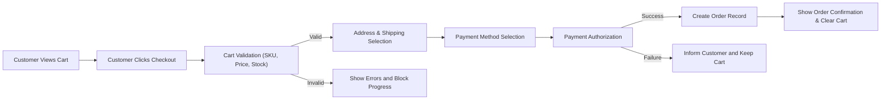
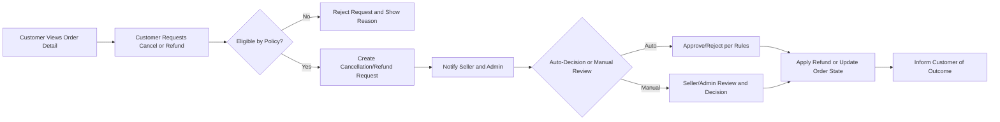

# Cart, Wishlist, and Order Flow Business Requirements

## 1. Introduction

This document defines the business-level requirements for shopping cart, wishlist, order creation, order history, and cancellation/refund request flows for the **shoppingMall** e-commerce platform. It is written for backend developers and QA engineers and describes **what** the system must do, not **how** to implement it.

All requirements that can be expressed in EARS (Easy Approach to Requirements Syntax) are written using the EARS templates, with the keywords WHEN, WHILE, IF, THEN, WHERE, THE, and SHALL in English and all other text in en-US.

The primary actors for the features in this document are:
- **guestUser**: unauthenticated visitor.
- **customer**: authenticated end-user.
- **seller**: merchant responsible for supplying and shipping products.
- **admin**: platform administrator.

## 2. Scope and Assumptions

### 2.1 In-Scope
- Shopping cart lifecycle, including adding, updating, removing, clearing items, and synchronizing carts when a guest logs in as a customer.
- Wishlist lifecycle for customers and basic behavior for guest users (if any) from a business perspective.
- End-to-end order creation from a validated cart through order confirmation.
- Order history and detail viewing for customers.
- Cancellation and refund request flows initiated by customers, and business interactions with sellers and admins.
- Error and edge case behavior as perceived by customers and other actors.

### 2.2 Out-of-Scope
- Technical API specifications, endpoint URLs, payload schemas, or field-level data structures.
- Database schema definitions, indexes, or storage considerations.
- Frontend UI design, layout, or interaction patterns beyond business-level flow descriptions.
- Concrete payment provider integrations, token flows, or payment gateway protocols.

### 2.3 General Assumptions
- Products, SKUs, and pricing rules are defined consistently with the "Product and Catalog Requirements" document.
- Payment states and shipping status lifecycles are defined in detail in the "Payment, Shipping, and Tracking Requirements" document; this document only references them in business terms.
- Customers must be authenticated to actually place orders and to access full order history, cancellations, and refunds.

## 3. Actors and Access Context

### 3.1 Actor Capabilities (Cart, Wishlist, Orders)

- **guestUser**
  - Can browse catalog and view product details.
  - Can create and manipulate a temporary cart.
  - May have a temporary wishlist concept (optional), but cannot view order history.
- **customer**
  - Can maintain a persistent cart and wishlist tied to their account.
  - Can place orders using cart contents.
  - Can view order history and details.
  - Can initiate cancellation and refund requests according to business rules.
- **seller**
  - Can view orders that include their products (covered in seller-focused documents).
  - Interacts with cancellations and refunds for their own orders (acknowledgement, evidence, etc.).
- **admin**
  - Can view and manage all orders.
  - Can override or decide on cancellations and refunds within policy rules.

### 3.2 EARS Requirements for Access Control

- THE shoppingMall platform SHALL allow guestUser to create and modify a temporary cart without registration.
- THE shoppingMall platform SHALL require customer authentication before confirming any order.
- THE shoppingMall platform SHALL allow only the customer who owns an order to view its full details and initiate cancellation or refund requests.
- THE shoppingMall platform SHALL allow admin to view and manage all orders regardless of customer.
- THE shoppingMall platform SHALL allow seller to view only orders containing products that belong to that seller.

## 4. Shopping Cart Behavior

### 4.1 Cart Lifecycle and Ownership

#### 4.1.1 Cart Creation and Identity

- WHEN a guestUser adds the first product to cart, THE shoppingMall platform SHALL create a new temporary cart associated with that browsing session.
- WHEN a customer adds the first product to cart while authenticated, THE shoppingMall platform SHALL create a new persistent cart associated with that customer account if none exists.
- WHEN a customer with an existing cart logs in from another device, THE shoppingMall platform SHALL provide access to the latest persistent cart contents associated with that customer account.

#### 4.1.2 Guest to Customer Cart Merge

- WHEN a guestUser with a temporary cart logs in or completes registration to become a customer, THE shoppingMall platform SHALL merge the temporary cart into the customer's existing persistent cart according to defined merge rules.
- IF the temporary cart and the persistent cart both contain the same SKU, THEN THE shoppingMall platform SHALL apply deterministic merge logic (e.g., choose higher quantity, sum quantities, or use temporary cart as priority) as specified by business policy.
- IF the merge process detects SKUs that are no longer valid or available, THEN THE shoppingMall platform SHALL exclude those SKUs from the merged cart and inform the customer of the exclusions.

#### 4.1.3 Cart Persistence and Expiration

- WHILE a customer account remains active, THE shoppingMall platform SHALL persist that customer's cart across sessions until it is emptied or converted into an order.
- WHERE a cart belongs to a guestUser, THE shoppingMall platform SHALL retain that cart for at least a configurable minimum period (for example, several days) of inactivity, subject to legal and policy constraints.
- IF a cart is deleted due to inactivity or policy, THEN THE shoppingMall platform SHALL remove all its items and treat subsequent add-to-cart actions as a new cart.

### 4.2 Cart Item Structure and Constraints

From a business perspective, each cart item conceptually includes: product reference, SKU/variant, quantity, unit price reference at time of cart update, and seller association.

- THE shoppingMall platform SHALL enforce that each cart item refers to exactly one SKU, not just to a generic product.
- THE shoppingMall platform SHALL enforce that quantity for each cart item is a positive integer and is greater than or equal to 1.
- WHERE a SKU has a maximum allowed quantity per order, THE shoppingMall platform SHALL prevent the cart item quantity from exceeding that maximum.
- WHERE a SKU has purchase restrictions (such as "customer must be logged in", "limited to one per customer"), THE shoppingMall platform SHALL apply these rules during cart operations and checkout validation.

### 4.3 Cart Operations (Add, Update, Remove, Clear)

#### 4.3.1 Add to Cart

- WHEN a guestUser or customer initiates an add-to-cart action for a SKU, THE shoppingMall platform SHALL validate that the SKU is active, visible, and purchasable according to catalog rules.
- IF a SKU fails validation due to being inactive, hidden, or not purchasable, THEN THE shoppingMall platform SHALL reject the add-to-cart action and provide a business-level reason (for example, "SKU not available").
- IF the SKU already exists in the cart for that actor, THEN THE shoppingMall platform SHALL either increment the quantity or set it to the requested quantity according to the business policy defined for quantity handling.
- WHERE a SKU has limited stock, THE shoppingMall platform SHALL cap the cart item quantity to the maximum quantity that can be reserved or purchased according to inventory rules.

#### 4.3.2 Update Cart Item Quantity

- WHEN a customer or guestUser updates the quantity of a cart item, THE shoppingMall platform SHALL re-validate the SKU availability, inventory, and purchase rules for the new requested quantity.
- IF the new quantity is zero, THEN THE shoppingMall platform SHALL treat the operation as a removal of the item from the cart.
- IF the new quantity exceeds allowed per-SKU limits or available inventory, THEN THE shoppingMall platform SHALL set the quantity to the highest permitted value and inform the user of the adjustment.

#### 4.3.3 Remove and Clear

- WHEN a customer or guestUser requests removal of a specific cart item, THE shoppingMall platform SHALL remove only that item from the cart.
- WHEN a customer or guestUser requests to clear the entire cart, THE shoppingMall platform SHALL remove all items from the cart and mark the cart as empty.

### 4.4 Cart Validation and Synchronization Rules

Cart validation occurs at multiple points: during cart viewing and during checkout.

- WHEN a cart is retrieved for display, THE shoppingMall platform SHALL check each cart item for continued validity of the product and SKU (for example, not deleted, not hidden, not discontinued).
- IF an item is no longer valid for purchase, THEN THE shoppingMall platform SHALL mark that item as invalid in the cart view and prevent it from being ordered.
- WHEN checkout is initiated, THE shoppingMall platform SHALL perform a full validation of inventory, pricing, discounts, and purchase eligibility for every item in the cart.
- IF the validation detects conflicts (such as price changes, out-of-stock items, or removed SKUs), THEN THE shoppingMall platform SHALL prevent order creation until the customer acknowledges or resolves the conflicts.

### 4.5 Cart Pricing and Stock Checks

- WHEN displaying a cart summary, THE shoppingMall platform SHALL calculate and show subtotal amounts based on the current effective prices of SKUs and quantities.
- WHERE discount or promotion rules apply to cart contents, THE shoppingMall platform SHALL calculate and apply these discounts consistently with the business promotion rules.
- WHEN a customer proceeds to checkout, THE shoppingMall platform SHALL re-check that stock is sufficient for all items in the cart.
- IF stock is insufficient for any cart item, THEN THE shoppingMall platform SHALL adjust the quantity to the maximum purchasable amount or mark the item as unavailable, and inform the customer.

## 5. Wishlist Behavior

### 5.1 Wishlist Lifecycle and Ownership

- THE shoppingMall platform SHALL provide each customer with at least one wishlist that persists across sessions.
- WHERE business strategy allows guest wishlists, THE shoppingMall platform SHALL treat them as temporary lists similar to guest carts and tie them to session or device.
- WHEN a guestUser with a temporary wishlist becomes a customer through registration or login, THE shoppingMall platform SHALL merge the temporary wishlist items into the customer's persistent wishlist using deterministic rules for duplicates.

### 5.2 Wishlist Operations (Add, Remove, Move to Cart)

- WHEN a customer triggers an add-to-wishlist action for a product or SKU, THE shoppingMall platform SHALL store a wishlist entry that references at least the product and optionally a specific SKU.
- IF the item to be added already exists in the wishlist, THEN THE shoppingMall platform SHALL avoid creating a duplicate entry and may optionally update metadata such as timestamp.
- WHEN a wishlist item is removed by the customer, THE shoppingMall platform SHALL delete only that wishlist entry and keep other entries unchanged.
- WHEN a customer chooses to add a wishlist item to the cart, THE shoppingMall platform SHALL perform the same SKU availability and purchase validations used for direct add-to-cart actions.

### 5.3 Visibility and Limitations

- THE shoppingMall platform SHALL restrict each wishlist to be visible only to its owning customer from a business perspective.
- WHERE business policy defines a maximum number of items per wishlist, THE shoppingMall platform SHALL prevent adding more items once the limit is reached and inform the customer.

## 6. Order Creation Process

### 6.1 Pre-conditions and Validations

- WHEN a customer initiates checkout, THE shoppingMall platform SHALL require that the customer is authenticated.
- WHEN checkout starts, THE shoppingMall platform SHALL validate the cart contents as described in the cart validation section, including SKU validity, stock availability, price confirmation, and purchase restrictions.
- IF any cart item fails validation, THEN THE shoppingMall platform SHALL prevent progression to payment selection until the issues are resolved.

### 6.2 Checkout Flow Overview

Conceptually, checkout consists of: cart validation, shipping address selection, shipping option selection, payment method selection, and final order confirmation.

- THE shoppingMall platform SHALL structure the order creation process so that customer-provided inputs (address, shipping, payment choice) are gathered and validated before an order record is finalized.
- WHEN the customer confirms the final step of checkout, THE shoppingMall platform SHALL create an order record that captures the cart snapshot, prices, quantities, discounts, shipping details, and payment intent reference.

### 6.3 Address and Contact Information

- WHEN a customer moves from cart to checkout, THE shoppingMall platform SHALL require a shipping address for shippable items.
- THE shoppingMall platform SHALL allow customer to select from existing saved addresses or provide a new address at checkout.
- IF the shipping address does not satisfy delivery constraints (for example, unsupported region or invalid postal information), THEN THE shoppingMall platform SHALL prevent order confirmation and require the customer to correct the address.
- THE shoppingMall platform SHALL require at least one reliable contact communication method (such as phone number or email) associated with the order for delivery and support communication.

### 6.4 Shipping Options Selection

- WHEN shipping options are available for the supplied address and items, THE shoppingMall platform SHALL present at least one valid shipping method per shipment group based on business rules.
- WHERE multiple shipping methods (such as standard and express) are available, THE shoppingMall platform SHALL allow the customer to choose among them.
- IF no shipping method is available for one or more items, THEN THE shoppingMall platform SHALL block order confirmation and identify which items cannot be shipped.

### 6.5 Payment Selection Hand-off (Business View)

- WHEN all pre-payment validations succeed, THE shoppingMall platform SHALL allow the customer to select a payment method supported by the platform.
- THE shoppingMall platform SHALL record the chosen payment method in the order context.
- WHEN the customer confirms payment, THE shoppingMall platform SHALL either:
  - initiate communication with the payment provider (as defined in payment requirements), or
  - accept a pre-authorized or previously stored payment method.
- IF payment authorization fails according to payment rules, THEN THE shoppingMall platform SHALL not finalize the order and SHALL inform the customer of failure causes in business terms.

### 6.6 Order Confirmation and Post-Creation Behavior

- WHEN payment authorization succeeds and all validations pass, THE shoppingMall platform SHALL create an order in an initial business-defined state (such as "Order Placed" or "Payment Confirmed").
- WHEN an order is successfully created, THE shoppingMall platform SHALL provide the customer with an order identifier and summary of the order.
- THE shoppingMall platform SHALL capture a snapshot of product names, SKUs, unit prices, discounts, shipping charges, taxes (if applicable), and totals at the time of order creation so that future catalog changes do not alter past order records.
- WHEN an order is created from a cart, THE shoppingMall platform SHALL clear the corresponding cart or mark it as converted, so that the same items are not re-ordered unintentionally.

### 6.7 Handling Partial Failures at Order Creation

- IF payment succeeds but order record creation fails due to internal errors, THEN THE shoppingMall platform SHALL treat this as a critical inconsistency and SHALL attempt recovery procedures defined in operations policy (for example, compensating refunds or delayed order creation).
- IF order record creation succeeds but communication back to the customer fails (for example, network error after order creation), THEN THE shoppingMall platform SHALL ensure that the order remains accessible in the customer's order history and can be retrieved later.

## 7. Order History and Detail Views

### 7.1 Order Listing Behavior

- THE shoppingMall platform SHALL maintain a history of orders for each customer.
- WHEN a customer requests the list of their past orders, THE shoppingMall platform SHALL return orders in reverse chronological order by creation date.
- WHERE the number of orders is large, THE shoppingMall platform SHALL provide pagination or equivalent mechanisms so that the list remains manageable for the customer.

### 7.2 Order Detail Content

- WHEN a customer views an order detail, THE shoppingMall platform SHALL display at least: order identifier, creation date and time, current order status, list of items with names and SKUs, per-item quantities and prices, discounts applied, shipping fee, taxes (if applicable), total amount, shipping address, shipping method, and payment summary.
- THE shoppingMall platform SHALL show the history of key status changes for the order (for example, order placed, payment confirmed, shipped, delivered, cancelled, refunded) together with timestamps.
- WHERE tracking information exists for shipments, THE shoppingMall platform SHALL display the available tracking identifiers and carrier information as defined in shipping requirements.

### 7.3 Downloadable Documents and Records (Business View)

- WHERE business or regulatory policy requires it, THE shoppingMall platform SHALL allow customer to retrieve records such as invoices or receipts for each completed order.
- THE shoppingMall platform SHALL ensure that these records reflect the snapshot of the order at the time of completion and are not altered by later price changes.

## 8. Cancellation and Refund Request Flows

### 8.1 Cancellation Eligibility Rules

Cancellation typically occurs when the order has been placed but not yet fully processed or shipped.

- THE shoppingMall platform SHALL define configurable business rules for which states an order is eligible for customer-initiated cancellation.
- WHEN a customer views an order that is in a cancellable state, THE shoppingMall platform SHALL provide an option for the customer to request cancellation of the full order or, where policy allows, specific items.
- IF an order includes items from multiple seller entities, THEN THE shoppingMall platform SHALL apply cancellation rules per item or per seller group according to platform policy.
- IF a cancellation request is submitted for an order in a state that is no longer cancellable (for example, already shipped), THEN THE shoppingMall platform SHALL reject the request and indicate that cancellation is not possible and that a return or refund process may be used instead.

### 8.2 Refund Request Eligibility and Reasons

Refunds may be requested for various reasons, including order cancellation, non-delivery, damaged goods, or dissatisfaction.

- THE shoppingMall platform SHALL define allowable refund reasons (such as "changed mind", "damaged item", "wrong item delivered", "not delivered", "other").
- WHEN a customer requests a refund for an order or item, THE shoppingMall platform SHALL require selection of at least one allowed reason.
- WHERE the refund is associated with a return of goods, THE shoppingMall platform SHALL record that the physical return is required and tie it to the refund process.
- IF a refund is requested outside of the allowed time window defined by business policy (for example, more than N days after delivery), THEN THE shoppingMall platform SHALL reject the request and communicate that the refund period has expired.

### 8.3 Seller and Admin Involvement (Business Interactions)

- WHEN a customer submits a refund request, THE shoppingMall platform SHALL notify the relevant seller and admin according to platform policy.
- THE shoppingMall platform SHALL allow seller to provide responses or evidence for refund-related disputes (for example, shipping proof, photographs) within defined time windows.
- THE shoppingMall platform SHALL allow admin to review the refund request, seller response, and other data and to decide the outcome (approved, partially approved, rejected) according to policies.
- WHERE platform rules allow automatic refunds for low-value or clearly defined reasons, THE shoppingMall platform SHALL process such refunds automatically without manual seller or admin intervention.

### 8.4 Refund Outcomes and Communication to Customers

- WHEN a refund request is approved, THE shoppingMall platform SHALL record the approved refund amount and link it to the original order and payment.
- THE shoppingMall platform SHALL inform the customer of the refund decision and expected timeline for funds to be returned, consistent with payment provider rules.
- WHEN a refund request is rejected, THE shoppingMall platform SHALL store the reason for rejection in business terms and display it to the customer.
- WHERE a refund requires return of goods, THE shoppingMall platform SHALL provide the customer with clear instructions (for example, return address, deadlines) and record whether the goods have been received back.

## 9. Error and Edge Case Handling

### 9.1 Inventory and Price Changes During Checkout

- IF inventory for a SKU decreases below the quantity in the cart between initial cart display and order confirmation, THEN THE shoppingMall platform SHALL adjust or remove the item and inform the customer before payment is finalized.
- IF the price of a SKU changes between cart creation and checkout, THEN THE shoppingMall platform SHALL apply a clear business rule (for example, use the latest price, honor the price at time of add-to-cart, or apply promotions) and inform the customer of any price differences before order confirmation.

### 9.2 Payment Failures at Checkout

- IF payment authorization fails for any reason (for example, insufficient funds, declined card, provider error), THEN THE shoppingMall platform SHALL keep the cart intact so that the customer can retry with a different payment method or at a later time.
- IF repeated payment failures occur beyond a configurable threshold, THEN THE shoppingMall platform SHALL provide guidance to the customer to contact support or use an alternative payment method.

### 9.3 Invalid Addresses and Shipping Constraints

- IF a shipping address provided at checkout fails validation (for example, missing mandatory fields or invalid postal code), THEN THE shoppingMall platform SHALL not allow the customer to proceed to payment until the address is corrected.
- IF no shipping method is available for the selected address and items, THEN THE shoppingMall platform SHALL prevent order confirmation and inform the customer which items or locations cause the restriction.

### 9.4 Concurrency and Duplicate Actions

- IF a customer submits multiple rapid checkout confirmations for the same cart, THEN THE shoppingMall platform SHALL prevent creation of duplicate orders from the same cart by enforcing idempotent behavior for a defined period.
- IF a customer or guestUser performs simultaneous cart modifications from multiple devices, THEN THE shoppingMall platform SHALL define a conflict resolution policy (for example, last write wins) and ensure that cart operations remain consistent from the business perspective.

## 10. Performance and Non-functional Expectations (Business View)

- WHEN a customer adds an item to cart or wishlist, THE shoppingMall platform SHALL respond with updated cart or wishlist information within a few seconds so that the interaction feels immediate.
- WHEN a customer views their cart, wishlist, or order history, THE shoppingMall platform SHALL retrieve and present the data within a few seconds under normal load conditions.
- WHILE the platform is operating under typical traffic, THE shoppingMall platform SHALL maintain reliable access to cart and order functionality so that customers can complete purchases without unexpected interruptions.

## 11. Mermaid Diagrams for Key Flows

### 11.1 Cart to Order Flow

### 11.2 Cancellation and Refund Flow

## 12. Summary of EARS-Formatted Requirements

This section summarizes key EARS-style requirements for quick reference. All are already described in context above.

- WHEN a customer adds an item to cart, THE shoppingMall platform SHALL validate SKU availability, purchase eligibility, and quantity limits.
- WHEN a customer initiates checkout, THE shoppingMall platform SHALL verify that the customer is authenticated and that all cart items are valid and purchasable.
- WHEN order creation succeeds after payment authorization, THE shoppingMall platform SHALL create a persistent order record and clear the corresponding cart.
- WHEN a customer views their order history, THE shoppingMall platform SHALL list orders in reverse chronological order with their current statuses.
- WHEN a customer views an order detail, THE shoppingMall platform SHALL show full item, pricing, shipping, and payment summary, and the timeline of status changes.
- WHEN an order is in a cancellable state, THE shoppingMall platform SHALL allow the owning customer to submit a cancellation request according to policy.
- IF an order is no longer in a cancellable state, THEN THE shoppingMall platform SHALL reject new cancellation requests and guide the customer to refund or return options if applicable.
- WHEN a customer submits a refund request, THE shoppingMall platform SHALL require a valid reason, create a refund case, and route it through automatic or manual decision flows.
- WHEN a refund request is approved, THE shoppingMall platform SHALL record the refund amount, link it to the original order, and inform the customer of expected timelines.
- IF payment fails during checkout, THEN THE shoppingMall platform SHALL keep the cart intact and present clear error information so the customer can retry.
- IF inventory or pricing changes make items in the cart unavailable or inconsistent, THEN THE shoppingMall platform SHALL prevent order creation until the customer acknowledges and resolves the differences.

This document provides business requirements only. All technical implementation decisions, including architecture, APIs, and database design, are the responsibility of the development team.