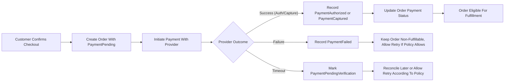
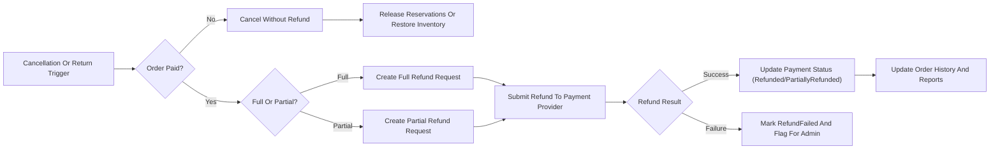

# Payment and Refund Requirements for shoppingMall Backend

## 1. Purpose and Scope

The payment and refund domain in shoppingMall defines how customer payments are processed, how payment states are managed over the lifecycle of an order, and how cancellations, refunds, and disputes are handled.

The scope of these requirements includes:
- Customer payment flows during checkout.
- Interactions with external payment providers at a conceptual level.
- Payment-related states and transitions for orders.
- Order history visibility of payments and refunds.
- Cancellation rules for customers, sellers, and platformAdmin.
- Refund handling (full, partial, and multi-line) and disputes, including chargebacks.
- Business-level performance, audit, and security expectations related to payments.

The scope explicitly excludes:
- Technical payment APIs, payload schemas, or HTTP status codes.
- Database schemas or storage strategies.
- Specific payment provider brands or contractual details.

All functional requirements use EARS (Easy Approach to Requirements Syntax) where applicable. EARS keywords (WHEN, WHILE, IF, THEN, WHERE, THE, SHALL) remain in English; other wording follows en-US business language.

## 2. Key Concepts and Actors

### 2.1 Core Business Terms

- **Order**: A confirmed purchase created from a customer’s cart, potentially containing items from multiple sellers.
- **Order item (order line)**: A single line within an order that references a specific SKU, quantity, and pricing details.
- **Payment transaction**: A conceptual unit of interaction with an external payment provider to authorize, capture, void, or refund funds for an order.
- **Payment provider**: An external service that processes financial transactions for shoppingMall (cards, bank transfers, digital wallets, etc.).
- **Authorization**: A temporary hold on customer funds that reserves an amount without final settlement.
- **Capture**: The action that transfers authorized funds from the customer to the platform’s acquiring account.
- **Settlement**: The completion of money transfer from payment provider to platform or sellers, which may be asynchronous and is not directly visible to customers.
- **Refund**: A payment transaction that returns funds for part or all of a captured amount.
- **Chargeback**: A dispute initiated through the customer’s bank or card issuer, forcing a reversal of funds.
- **Cancellation**: The act of invalidating an order or order items so that they will not be fulfilled; this may or may not involve a refund depending on payment state.
- **Dispute**: A complaint raised by a customer about an order, payment, or refund that may trigger manual review and adjustments.

### 2.2 Actors

- **guestUser**: Unauthenticated visitor who can browse and build a temporary cart but cannot place orders or see order history.
- **customer**: Authenticated user who can place orders, pay, view order and payment history, and request cancellations or refunds.
- **seller**: Merchant who lists products, fulfills order items, and participates in refund/dispute decisions for their products.
- **platformAdmin**: Platform operator with global visibility and authority over orders, payments, refunds, and disputes within defined business rules.

EARS:
- THE shoppingMall payment domain SHALL treat guestUser as ineligible to initiate payments or refunds.
- THE shoppingMall payment domain SHALL treat customer, seller, and platformAdmin as authenticated actors with different payment-related responsibilities and visibility.

## 3. Payment Processing Requirements

### 3.1 Conceptual Payment Model

Payments are handled via one or more external payment providers. shoppingMall does not store raw payment instrument details; instead, it works with provider-issued tokens and reference identifiers.

EARS:
- THE shoppingMall payment subsystem SHALL treat each payment provider as an abstract service that accepts a payment request and returns a business-level outcome (success, failure, pending, or timeout) with a provider reference identifier.
- THE shoppingMall payment subsystem SHALL support at least one immediate online payment method where payment authorization occurs at checkout time.
- WHERE a payment provider supports a distinct authorization step followed by capture, THE shoppingMall payment subsystem SHALL track authorization and capture as separate conceptual events.
- WHERE a payment provider performs immediate capture without separate authorization, THE shoppingMall payment subsystem SHALL treat the provider success as both authorization and capture for business records.

### 3.2 Payment Initiation from Checkout

Checkout is defined in the cart and order flow requirements. Payment initiation begins after the order context is validated.

EARS:
- WHEN a customer confirms checkout of a validated cart, THE shoppingMall payment subsystem SHALL create an order in a "payment pending" state before initiating an external payment request.
- WHEN a customer confirms checkout, THE shoppingMall payment subsystem SHALL calculate the payable amount based on item prices, discounts, taxes, and shipping fees and SHALL use that calculated amount as the basis for the payment request.
- WHEN a payment request is sent to a provider, THE shoppingMall payment subsystem SHALL associate the provider reference identifier with the order for subsequent reconciliation.
- IF a payment request fails before any provider-level confirmation (for example, local validation failure), THEN THE shoppingMall payment subsystem SHALL keep the order in a non-payable state equivalent to "payment failed" and SHALL not allow fulfillment steps to start.
- IF a customer abandons payment (for example, closes the payment interface) and no provider confirmation is received within a configured timeout, THEN THE shoppingMall payment subsystem SHALL move the order to a state equivalent to "payment expired" or SHALL keep it in "payment pending" with a business flag indicating expiration and SHALL not allow fulfillment until a new payment attempt succeeds.

### 3.3 Authorization, Capture, and Settlement

EARS:
- WHEN a payment provider returns a successful authorization result, THE shoppingMall payment subsystem SHALL record a payment transaction with status "authorized" and SHALL associate it with the related order.
- WHEN the platform business policy requires additional checks (such as fraud checks or manual review) after authorization, THE shoppingMall payment subsystem SHALL allow the order to remain in an authorized-but-not-captured state and SHALL prevent shipment status transitions that assume funds are final.
- WHEN a capture request is initiated for an authorized payment, THE shoppingMall payment subsystem SHALL record the capture attempt and SHALL update the associated transaction to "captured" when provider confirmation is received.
- WHILE an order is in "authorized but not captured" payment state, THE shoppingMall payment subsystem SHALL prevent fulfillment states that imply full payment, such as "shipped" or "completed".
- IF a capture attempt fails after successful authorization, THEN THE shoppingMall payment subsystem SHALL mark the capture attempt as "capture failed" and SHALL prevent fulfillment until a successful capture or an alternative resolution (such as cancellation) is applied.

### 3.4 Handling Immediate Capture Methods

EARS:
- WHERE a payment method performs immediate capture, THE shoppingMall payment subsystem SHALL record a single transaction with status "captured" and SHALL set the order payment status to fully paid when provider success is received.
- IF immediate capture fails, THEN THE shoppingMall payment subsystem SHALL record a transaction with status "failed" and SHALL keep the order in a non-fulfillable state.

### 3.5 Handling Payment Failures, Timeouts, and Retries

EARS:
- IF a payment provider explicitly returns a failure (for example, insufficient funds or card declined), THEN THE shoppingMall payment subsystem SHALL mark the payment transaction as "failed" and SHALL mark the order as "payment failed" while keeping the cart or order eligible for another payment attempt if allowed.
- WHEN a payment attempt fails, THE shoppingMall payment subsystem SHALL allow the customer to reattempt payment for the same order within a configurable time window, provided that the order has not been cancelled, fully refunded, or expired by business policy.
- WHEN a payment attempt experiences a timeout without a clear success or failure from the provider, THE shoppingMall payment subsystem SHALL mark the payment attempt as "timeout" and SHALL put the order into a "payment pending verification" state or similar until reconciliation occurs.
- IF a provider sends a delayed success notification after a timeout, THEN THE shoppingMall payment subsystem SHALL reconcile the order payment status to "payment captured" if the order remains open, and SHALL log the discrepancy for admin review.
- IF a provider sends a delayed failure after a timeout, THEN THE shoppingMall payment subsystem SHALL confirm that the order is not fulfilled and SHALL keep or move the order to a "payment failed" state.

### 3.6 Partial Payments and Multi-seller Context

shoppingMall treats customer-facing payment as a single order-level amount even when items come from multiple sellers.

EARS:
- THE shoppingMall payment subsystem SHALL treat the total payable amount for an order as a single payment obligation from the customer, regardless of the number of sellers involved.
- WHERE the business model introduces partial payments (for example, deposits or installment plans), THE shoppingMall payment subsystem SHALL represent each partial payment as a separate payment transaction linked to the same order and SHALL track the sum of captured amounts against the order’s total.
- WHERE internal settlement between platform and sellers requires splitting captured amounts per order item, THE shoppingMall payment subsystem SHALL maintain internal allocation records that are not exposed as separate customer payments.

## 4. Payment-Related Order Statuses

### 4.1 Order Payment Status Model

Payment status is maintained separately from fulfillment or shipment status.

Representative business-level payment statuses include:
- PaymentPending
- PaymentInProgress
- PaymentAuthorized
- PaymentCaptured (FullyPaid)
- PaymentFailed
- PaymentExpired
- PartiallyRefunded
- Refunded (FullyRefunded)

EARS:
- THE shoppingMall payment subsystem SHALL maintain a single primary payment status for each order that reflects its current payment state.
- WHEN an order is first created at checkout, THE shoppingMall payment subsystem SHALL assign the payment status "PaymentPending".
- WHEN a payment attempt is actively being processed with the provider, THE shoppingMall payment subsystem SHALL set payment status to "PaymentInProgress" or a business-equivalent state.
- WHEN a payment is successfully authorized but not captured, THE shoppingMall payment subsystem SHALL set payment status to "PaymentAuthorized".
- WHEN the full order amount is successfully captured, THE shoppingMall payment subsystem SHALL set payment status to "PaymentCaptured" or equivalent.
- WHEN a payment attempt fails definitively, THE shoppingMall payment subsystem SHALL set payment status to "PaymentFailed".
- WHEN a payment attempt or authorization expires without completion, THE shoppingMall payment subsystem SHALL set payment status to "PaymentExpired".
- WHEN a portion of captured funds is refunded, THE shoppingMall payment subsystem SHALL set or maintain payment status as "PartiallyRefunded" and SHALL track the cumulative refunded amount.
- WHEN all captured funds are refunded, THE shoppingMall payment subsystem SHALL set payment status to "Refunded".

### 4.2 Status Transitions and Constraints

EARS:
- WHEN an order is in "PaymentPending", THE shoppingMall payment subsystem SHALL allow transitions to "PaymentInProgress", "PaymentFailed", "PaymentExpired", or "PaymentCaptured" according to provider outcomes.
- WHEN an order is in "PaymentCaptured", THE shoppingMall payment subsystem SHALL allow transitions only to "PartiallyRefunded" or "Refunded" as refunds are processed.
- WHEN an order is in "PaymentFailed" or "PaymentExpired" and business rules allow another attempt, THE shoppingMall payment subsystem SHALL allow return to "PaymentInProgress" after a new payment attempt.
- IF an order reaches "Refunded", THEN THE shoppingMall payment subsystem SHALL prevent any further shipment or fulfillment actions for that order.
- WHEN asynchronous provider events arrive (for example, delays, chargebacks, or late capture confirmations), THE shoppingMall payment subsystem SHALL adjust payment status consistently and SHALL append the event to a payment audit trail.

### 4.3 Relationship Between Payment Status and Fulfillment Status

EARS:
- IF an order payment status is not in a state equivalent to "PaymentAuthorized" or "PaymentCaptured", THEN THE shoppingMall fulfillment subsystem SHALL prevent transitions to fulfillment statuses that imply shipment or completed delivery.
- WHILE an order is in "PaymentInProgress", THE shoppingMall fulfillment subsystem SHALL not permit irreversible fulfillment actions such as marking items as shipped.
- WHEN an order is cancelled before capture, THE shoppingMall payment subsystem SHALL attempt to void any existing authorization where supported and SHALL record the outcome.
- WHEN an order is cancelled after capture, THE shoppingMall payment subsystem SHALL initiate a refund process rather than a void and SHALL ensure that payment and fulfillment statuses remain consistent.

## 5. Order History and Visibility of Payments

### 5.1 Customer Order History

EARS:
- THE shoppingMall order history subsystem SHALL provide each customer with access to a list of their orders including creation date, total amount, payment status, and high-level fulfillment status.
- WHEN a customer views an order detail, THE shoppingMall order history subsystem SHALL display the payment status, total amount charged, and any refunded amounts as of the current time.
- WHEN a refund is processed for an order, THE shoppingMall order history subsystem SHALL reflect the refund amount, date, and high-level reason category in the order details.
- IF a customer has no orders, THEN THE shoppingMall order history subsystem SHALL return an empty list without error.

### 5.2 Seller View of Payment-Related Information

EARS:
- THE shoppingMall seller dashboard subsystem SHALL provide sellers with order lists that include only orders containing their products.
- WHEN a seller views an order in the seller dashboard, THE shoppingMall seller dashboard subsystem SHALL display the portion of the order value attributable to that seller’s items and the payment state that is relevant for fulfillment decisions, without exposing sensitive customer payment details.
- WHERE seller payouts are calculated on a periodic basis, THE shoppingMall payment subsystem SHALL maintain mapping between order payments, refunds, and seller payout records so that sellers can reconcile their income.

### 5.3 Admin View of Payments and Refunds

EARS:
- THE shoppingMall admin subsystem SHALL allow platformAdmin to search, filter, and view orders by payment status, refund status, date range, customer, and seller.
- WHEN platformAdmin views an order, THE shoppingMall admin subsystem SHALL present full payment and refund history, including each payment transaction attempt, captured amount, refunded amount, and provider reference identifiers where available.
- THE shoppingMall admin subsystem SHALL support exporting payment and refund history in business-friendly formats for reconciliation and reporting, subject to privacy and security constraints.

## 6. Cancellation Rules

### 6.1 Customer-Initiated Cancellations

EARS:
- WHEN a customer requests cancellation for an order with payment status "PaymentPending" and fulfillment status indicating no shipment, THE shoppingMall order subsystem SHALL cancel the order without initiating a refund and SHALL release any reserved inventory.
- WHEN a customer requests cancellation for an order with payment status "PaymentCaptured" and fulfillment status indicating that shipment has not started or is within the cancellation window, THE shoppingMall order subsystem SHALL treat the request as refund-eligible and SHALL trigger a full or partial refund according to the items cancelled.
- IF an order is already in a fulfillment status equivalent to "Shipped" or "Delivered" and outside any allowed cancellation window, THEN THE shoppingMall order subsystem SHALL reject direct cancellation requests and SHALL direct the customer to return or refund flows if applicable.
- WHEN a customer submits a cancellation request, THE shoppingMall order subsystem SHALL require selection of a reason category (such as "Changed mind", "Ordered by mistake", or "Other") and SHALL record the reason for analysis.

### 6.2 Seller-Initiated Cancellations

EARS:
- WHEN a seller determines that they cannot fulfill one or more order items due to stock or operational issues prior to shipment, THE shoppingMall seller subsystem SHALL allow the seller to request cancellation of those items with a specified reason category (such as "Out of stock", "Incorrect price", or "Shipping not possible").
- WHERE an order includes items from multiple sellers, THE shoppingMall order subsystem SHALL support partial cancellation so that a seller can cancel only the items that belong to that seller.
- WHEN seller-initiated cancellation affects items for which payment has been captured, THE shoppingMall payment subsystem SHALL treat those items as refund-eligible and SHALL initiate a partial refund covering item price, associated taxes, and any applicable shipping allocation according to policy.
- WHERE repeated seller-initiated cancellations exceed a business-defined threshold, THE shoppingMall admin subsystem SHALL provide platformAdmin with reports and filters to identify such sellers for further actions.

### 6.3 Admin-Initiated Cancellations

EARS:
- WHEN platformAdmin identifies fraud, policy violations, or system errors affecting an order, THE shoppingMall admin subsystem SHALL allow platformAdmin to cancel the order in whole or in part regardless of seller or customer preferences, subject to internal governance rules.
- WHEN platformAdmin cancels an order or order items that have already been paid, THE shoppingMall payment subsystem SHALL initiate appropriate refunds and SHALL label the refunds as admin-initiated.
- THE shoppingMall admin subsystem SHALL require platformAdmin to record a justification when cancelling orders so that future audits can interpret the decision.

### 6.4 Time Windows and Eligibility Constraints

EARS:
- THE shoppingMall order subsystem SHALL support business-configurable time windows that define how long after payment or before shipment a customer can request cancellation.
- WHERE local regulations or policies require longer or shorter cancellation windows, THE shoppingMall order subsystem SHALL support configuration per market or product category.
- IF a cancellation request is submitted outside the configured window and no override is applied by seller or platformAdmin, THEN THE shoppingMall order subsystem SHALL decline the request and SHALL state that the order is no longer cancellable under current policy.

### 6.5 Effects of Cancellations on Payments and Inventory

EARS:
- WHEN an order is cancelled before payment capture, THE shoppingMall payment subsystem SHALL attempt to void any existing authorization and SHALL record the outcome while the inventory subsystem releases reserved stock.
- WHEN an order is cancelled after payment capture, THE shoppingMall payment subsystem SHALL initiate refunds for cancelled items and the inventory subsystem SHALL adjust stock according to whether items have been shipped or returned.
- IF a refund related to a cancellation fails to be processed by the payment provider, THEN THE shoppingMall payment subsystem SHALL flag the refund as "failed" and SHALL present this case in admin tools for manual resolution.

## 7. Refund and Dispute Handling

### 7.1 Full and Partial Refunds

EARS:
- THE shoppingMall payment subsystem SHALL support full refunds that return the entire captured amount for an order.
- THE shoppingMall payment subsystem SHALL support partial refunds that return only a portion of the captured amount, such as the price of specific items, shipping components, or agreed compensation.
- WHEN a refund is created, THE shoppingMall payment subsystem SHALL record the refunded amount, currency, related order, initiating actor (customer request via seller, seller, or platformAdmin), and a reason category.
- WHEN multiple refunds are processed for the same order, THE shoppingMall payment subsystem SHALL track the cumulative refunded amount and SHALL prevent the sum of refunds from exceeding the total captured amount for that order.

### 7.2 Refund Triggers and Eligibility

EARS:
- WHEN a customer cancellation for a paid but unshipped order is accepted, THE shoppingMall payment subsystem SHALL treat the cancelled items as fully refundable.
- WHEN a customer returns items after shipment and the return is approved according to return policy, THE shoppingMall payment subsystem SHALL treat the returned items as partially refundable and SHALL compute the refundable amount based on item price, tax, and shipping allocation rules.
- WHEN seller cancels items due to seller-side issues (such as stock-out), THE shoppingMall payment subsystem SHALL treat the affected amounts as refundable without penalizing the customer.
- WHERE products are classified as non-refundable by policy (for example, certain digital goods or personalized items), THE shoppingMall payment subsystem SHALL prevent automatic refund eligibility while still allowing platformAdmin to override in exceptional cases.

### 7.3 Refund Approval Flows

EARS:
- WHERE policy allows sellers to approve refunds for their orders, THE shoppingMall seller subsystem SHALL enable seller to initiate or approve refunds for items they own within limits that prevent over-refunding.
- WHERE high-value or complex refunds require admin approval, THE shoppingMall payment subsystem SHALL support a two-step workflow in which seller or automated rules propose a refund and platformAdmin reviews and approves or rejects it.
- WHEN a refund is approved, THE shoppingMall payment subsystem SHALL initiate the refund request with the payment provider and SHALL track its status until success or failure.
- IF a refund attempt fails, THEN THE shoppingMall payment subsystem SHALL mark the refund record as "refund failed" and SHALL notify platformAdmin through admin tools for follow-up.

### 7.4 Disputes and Chargebacks

EARS:
- WHEN a customer reports a problem with an order that they believe warrants a refund or other compensation, THE shoppingMall dispute subsystem SHALL allow creation of a dispute record linked to the order, customer, and seller.
- THE shoppingMall dispute subsystem SHALL allow sellers to respond to disputes related to their orders and SHALL allow platformAdmin to review the full history before deciding an outcome.
- WHEN platformAdmin resolves a dispute in favor of the customer, THE shoppingMall payment subsystem SHALL create appropriate refunds and SHALL label them as dispute-related.
- WHEN a chargeback notification is received from a payment provider, THE shoppingMall payment subsystem SHALL create or update a dispute record, SHALL mark the related payment transaction as chargeback-impacted, and SHALL adjust financial and reporting data accordingly.

### 7.5 Refund Timelines and Communication

EARS:
- THE shoppingMall payment subsystem SHALL maintain configurable expectations for how long refunds typically take to be reflected in customer payment instruments (for example, a number of business days per method).
- WHEN a refund is initiated and the provider confirms acceptance, THE shoppingMall order history subsystem SHALL immediately show the refund as "RefundPending" or equivalent until final confirmation.
- WHEN the payment provider confirms that a refund is completed, THE shoppingMall payment subsystem SHALL update the refund’s status to "RefundCompleted" and SHALL ensure that this status is visible in customer and admin views.

### 7.6 Representation of Refunds in Order History

EARS:
- THE shoppingMall order history subsystem SHALL display refund events in the order timeline, including amount, date, and high-level reason category.
- WHEN an order is fully refunded, THE shoppingMall order history subsystem SHALL clearly indicate that the net charged amount is zero and that no further charges are expected.
- WHEN partial refunds have been applied, THE shoppingMall order history subsystem SHALL show the original amount, total refunded amount, and remaining net charged amount.

## 8. Non-Functional Requirements Specific to Payments

### 8.1 Performance and Responsiveness

EARS:
- WHEN a customer submits payment details at checkout, THE shoppingMall payment subsystem SHALL provide a clear success or failure outcome within a business-defined target time that aligns with nonfunctional performance requirements.
- WHEN a customer accesses order history that includes payment and refund details, THE shoppingMall order history subsystem SHALL respond within the general order-history performance targets defined elsewhere.
- WHILE asynchronous payment or refund confirmations are pending, THE shoppingMall payment subsystem SHALL maintain intermediate payment statuses that clearly indicate that final confirmation is in progress.

### 8.2 Security and Data Protection (Business View)

EARS:
- THE shoppingMall payment subsystem SHALL avoid storing raw payment instrument details such as full card numbers and sensitive authentication data and SHALL rely on provider-issued tokens or references where needed for refunds and reconciliation.
- THE shoppingMall payment subsystem SHALL treat all payment and refund records as sensitive and SHALL restrict access to these records according to actor roles and least-privilege principles.
- WHERE data protection laws impose special handling on financial data, THE shoppingMall payment subsystem SHALL support configuration of retention and access policies that satisfy those obligations.

### 8.3 Auditability and Traceability

EARS:
- THE shoppingMall payment subsystem SHALL maintain an audit trail of key payment events, including authorizations, captures, voids, refunds, cancellations that impact payment, and chargebacks.
- WHEN any actor (seller or platformAdmin) manually initiates or adjusts a payment or refund, THE shoppingMall payment subsystem SHALL record the acting identity, timestamp, affected order, and justification.
- THE shoppingMall admin subsystem SHALL provide reporting views that highlight payment volumes, refund rates, chargeback volumes, and dispute outcomes over time to support financial and risk management.

## 9. Payment and Refund Flow Diagrams

### 9.1 Payment Flow from Checkout to Fulfillment Eligibility

### 9.2 Cancellation and Refund Flow

## 10. Success Criteria for the Payment and Refund Domain

EARS:
- THE shoppingMall payment and refund domain SHALL ensure that no successful customer payment results in an untracked or irreconcilable order state.
- THE shoppingMall payment and refund domain SHALL ensure that customers can always see an accurate, up-to-date view of their payment and refund history for each order.
- THE shoppingMall payment and refund domain SHALL provide sellers with sufficient payment visibility to make correct fulfillment and after-sales decisions without exposing sensitive customer payment data.
- THE shoppingMall payment and refund domain SHALL provide platformAdmin with complete tools to audit and manage payments, refunds, cancellations, and disputes in alignment with business policy.
- THE shoppingMall payment and refund domain SHALL support future extensions such as additional payment methods, installment plans, or risk-based capture timing without requiring changes to the fundamental business behaviors described here.
