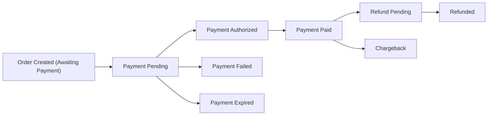
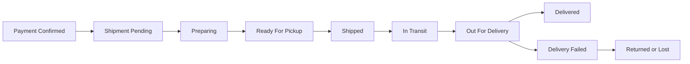
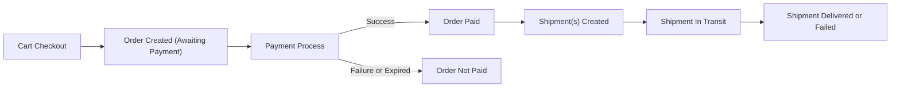

# Payment, Shipping, and Order Tracking Requirements for shoppingMall

## 1. Introduction

### 1.1 Purpose and Scope

THE shoppingMall payment, shipping, and tracking specification SHALL define all business-level rules for handling payments, shipping information, and order and shipment tracking across the platform.

THE specification SHALL focus on what behavior the platform must exhibit from a business perspective, not on how it is technically implemented.

THE scope of these requirements SHALL include:
- Supported payment methods and business constraints.
- Order payment status lifecycle, including refunds and chargebacks.
- Shipping address handling during checkout and post-order changes.
- Shipping option selection and shipping cost behavior.
- Shipping and delivery status lifecycle from seller preparation through delivery or return.
- Tracking information storage and exposure to customers, sellers, and admins.
- Failure, retry, and reconciliation scenarios related to payments and shipments.
- Audit, monitoring, and compliance expectations tied to payment and shipping events.

THE scope of these requirements SHALL explicitly exclude:
- Specific payment provider integrations or protocols.
- Technical message formats to payment gateways or shipping carriers.
- Database schemas, tables, or API route definitions.
- Frontend UI design details.

### 1.2 Relationship to Other Documents

THE payment, shipping, and tracking requirements SHALL be consistent with the following documents:
- "Cart, Wishlist, and Order Flow Requirements": order creation, cancellation, and refund initiation flows.
- "Product and Catalog Requirements": product, SKU, and availability rules used when validating purchase and shipping options.
- "User Actors and Permissions" and "Authentication and Session Requirements": actor roles (guestUser, customer, seller, admin) and access control.
- "Business Model and Goals": revenue, commission, and fee concepts that depend on payment states.
- "Non-functional and Compliance Requirements": performance, availability, security, privacy, and auditability constraints.

### 1.3 Actors and Responsibilities in this Domain

The following actors participate in payment, shipping, and tracking flows:

- **guestUser**: May reach checkout but cannot complete payment or create orders without authentication.
- **customer**: Places orders, pays, selects shipping options, tracks shipments, and requests cancellations or refunds.
- **seller**: Fulfills orders, prepares and ships items, updates shipment and tracking information within allowed rules.
- **admin**: Oversees payments, shipments, refunds, and disputes; performs corrections and exceptions for governance.

## 2. Payment Options and Constraints

### 2.1 Supported Payment Methods (Business View)

THE shoppingMall platform SHALL support a configurable set of conceptual payment methods, such as:
- Card payments (for example, credit or debit cards).
- Bank transfer or account-based payments where locally relevant.
- Third-party wallet or local online payment methods.
- Optional cash-on-delivery (COD) or pay-on-delivery where business policy allows.

WHEN a payment method is disabled by platform configuration, THE platform SHALL hide that method from customers in checkout and SHALL reject any attempt to select that method.

WHEN a customer reaches the payment selection step in checkout, THE platform SHALL offer only payment methods that are:
- Enabled in business configuration.
- Allowed for the customer region and shipping destination region.
- Allowed for the order currency.
- Allowed for the order total amount within method-specific minimum and maximum limits.

IF a customer attempts to submit an order using a payment method that is not allowed for their context, THEN THE platform SHALL block order creation and SHALL show a clear, non-technical error message indicating that the payment method is not available.

### 2.2 Payment Initiation Rules

WHEN a customer confirms the final step of checkout, THE platform SHALL create a pending order record in a state equivalent to "Awaiting Payment" before initiating any external payment interaction.

WHEN payment initiation starts, THE platform SHALL lock the following order-level business values:
- Item-level unit prices and quantities.
- Applied discounts or coupons.
- Shipping costs, surcharges, and tax amounts where applicable.

WHILE an order is in "Awaiting Payment" state, THE platform SHALL prevent further modifications to order line items, discounts, or shipping options by the customer.

IF validation fails before contacting the payment provider (for example missing address, mismatched totals, or invalid order amount), THEN THE platform SHALL:
- Deny payment initiation.
- Keep the order in a non-payable state.
- Communicate the validation errors to the customer.

### 2.3 Payment Amount Validation

THE payable amount for an order SHALL equal the sum of:
- Item-level totals (unit price × quantity per SKU).
- Order-level or item-level discounts (negative components).
- Shipping and handling fees.
- Customer-facing surcharges (for example payment method surcharge) where configured.
- Taxes or other mandatory charges where applicable.

WHEN a payment provider notifies the platform of a successful authorization or capture, THE platform SHALL verify that the authorized or captured amount matches the payable amount within a configured tolerance (default tolerance 0 for same-currency payments).

IF the authorized or captured amount is outside the acceptable tolerance compared to the payable amount, THEN THE platform SHALL treat the payment as inconsistent and SHALL:
- Mark the payment attempt as failed or error.
- Not mark the order as paid.
- Record the mismatch details for admin review.

WHERE the payment provider processes in a different currency than the order currency, THE platform SHALL:
- Store the provider amount and currency.
- Define business rules for allowable rounding and conversion differences.
- Base customer-facing amounts and refund calculations on the order currency.

### 2.4 Partial Payments and Split Payments

WHERE partial payment (for example, deposit plus remaining balance) is enabled, THE platform SHALL:
- Represent each partial payment as a separate payment record associated with the same order.
- Consider an order fully paid only when the sum of successful payments equals the total payable amount.

WHEN partial payment is enabled for a given order type, THE platform SHALL:
- Define which statuses are allowed after only a deposit is paid (for example "Partially Paid")
- Restrict shipment of items where full payment is mandatory prior to shipment.

WHERE split payments across multiple instruments are enabled, THE platform SHALL:
- Record each payment method and amount as separate payment records.
- Verify that the sum of successful payments equals the payable amount before transitioning the order to a paid state.

IF partial or split payments are not enabled for a given order, THEN THE platform SHALL require a single successful payment covering the entire payable amount.

### 2.5 Payment Timeouts and Expiration

WHERE the payment method allows delayed confirmation, THE platform SHALL define a configurable payment timeout per method (for example 15 minutes for card payments, several hours for bank transfers).

WHILE a payment attempt remains within the timeout window and no final decision has been received, THE platform SHALL keep the payment in a "Pending" status and SHALL keep the order in a payable state.

WHEN the timeout window elapses without a clear success or failure result, THE platform SHALL:
- Mark the payment attempt as "Expired".
- Either keep the order in "Awaiting Payment" or transition it to a "Payment Expired" / "Cancelled by System" state according to business rules.

IF an expired payment later receives a delayed success notification from a provider, THEN THE platform SHALL treat this as a reconciliation case and SHALL:
- Not automatically mark the order as paid without additional checks.
- Surface the inconsistency to admins for decision.

### 2.6 Customer-Facing Payment Error Handling

WHEN a payment attempt is explicitly declined by the payment provider, THE platform SHALL:
- Mark the payment attempt as "Failed" with a provider reason code and human-readable explanation for admins.
- Keep the order in a state that allows retry (for example "Awaiting Payment"), unless business rules call for auto-cancellation after a number of failed attempts.
- Inform the customer that payment was declined and suggest alternative methods.

WHEN a payment attempt fails due to technical reasons such as network errors or timeouts, THE platform SHALL:
- Mark the payment attempt as "Error".
- Keep the order in a state where retry is allowed.
- Inform the customer that the payment outcome is unclear but that the order has not been confirmed as paid.

WHEN a customer has exceeded a configurable threshold of failed payment attempts for the same order, THE platform SHALL:
- Prevent additional immediate payment attempts for that order.
- Inform the customer that further attempts are temporarily blocked.
- Flag the situation for security or fraud review if warranted.

## 3. Order Payment Status Lifecycle

### 3.1 Business-Level Payment Statuses

THE platform SHALL support, at minimum, the following business-level payment statuses for each payment record:
- **Pending**: Payment has been initiated but no final decision is known.
- **Authorized**: Amount has been authorized but not yet captured (where supported).
- **Paid**: Amount has been captured or otherwise completed.
- **Failed**: Payment attempt has been declined or definitively failed.
- **Expired**: Payment window elapsed without completion.
- **RefundPending**: Refund initiated but not yet completed.
- **Refunded**: Amount has been refunded successfully.
- **Chargeback**: Chargeback has been initiated by the payer’s financial institution.

### 3.2 Payment State Transitions

WHEN a payment record is created upon payment initiation, THE platform SHALL set its status to "Pending".

WHEN a payment provider confirms authorization, THE platform SHALL transition the payment status from "Pending" to "Authorized".

WHEN funds are captured successfully (either immediately or after a separate capture step), THE platform SHALL transition the payment status from "Pending" or "Authorized" to "Paid".

IF a provider returns a definitive failure code (declined, insufficient funds, invalid card), THEN THE platform SHALL transition the payment status to "Failed".

WHEN the configured timeout elapses without confirmation from the provider, THE platform SHALL transition the payment status from "Pending" to "Expired".

WHEN a refund operation is initiated for part or all of a previously paid amount, THE platform SHALL create or update a refund record and SHALL set its status to "RefundPending".

WHEN the provider confirms that the refund is completed, THE platform SHALL transition the refund status to "Refunded" and SHALL update the remaining payable or refundable amount accordingly.

WHEN a chargeback notification is received from a financial institution, THE platform SHALL set the relevant payment’s business status to "Chargeback" regardless of internal refund status and SHALL flag the payment and associated order for manual review.

### 3.3 Relationship Between Payment Status and Order Status

WHEN an order is first created at checkout confirmation, THE platform SHALL set its order status to a state equivalent to "Awaiting Payment".

WHEN one or more payments for the order reach "Paid" for the full payable amount, THE platform SHALL:
- Update the order status to a state equivalent to "Payment Confirmed" or "Paid".
- Make the order eligible for fulfillment and shipment.

IF all payment attempts for an order end in "Failed" or "Expired" and the customer does not retry within a configured window, THEN THE platform SHALL transition the order to a state such as "Payment Expired" or "Cancelled by System" and SHALL release any reserved inventory.

WHEN an order has associated payment records with "Refunded" status that cover the full paid amount, THE platform SHALL transition the order to a business state equivalent to "Refunded".

WHEN a chargeback is recorded, THE platform SHALL:
- Flag the related order as involving a "Chargeback".
- Prevent further shipment actions.
- Make the case visible in admin risk and dispute interfaces.

### 3.4 Partial Refunds and Adjustments

WHERE partial refunds are allowed, THE platform SHALL:
- Track refunded amounts at item and order level.
- Ensure that the total refunded amount never exceeds the total paid amount for the order.

WHEN a partial refund is approved, THE platform SHALL:
- Record the refunded portion and remaining paid amount.
- Reflect the updated financial state in customer and seller views.

IF additional partial refunds are requested, THEN THE platform SHALL validate that:
- The new refund request plus prior refunds do not exceed the original paid amount.
- Product-specific or policy-specific refund limits are not exceeded.

## 4. Shipping Address and Options

### 4.1 Shipping Address Capture and Validation

WHEN a customer moves from cart to checkout, THE platform SHALL:
- Require at least one shipping address for each shipment group.
- Allow selection from saved addresses or entry of a new address.

THE platform SHALL treat the following components as mandatory for a usable shipping address, subject to regional variations:
- Recipient name.
- Street address or detailed address line.
- City or locality.
- Postal code where applicable.
- Country.
- Region or state where required by local rules.

WHEN a customer saves or uses a shipping address, THE platform SHALL validate that:
- Mandatory fields are present and non-empty.
- Field lengths do not exceed configured limits.
- Country and region codes are recognized in configuration.

IF address validation fails, THEN THE platform SHALL:
- Reject the address for use in checkout.
- Show field-level errors indicating which values must be corrected.

### 4.2 Address Eligibility and Region Restrictions

WHERE the platform restricts shipping to specific countries or regions, THE platform SHALL:
- Check each shipping address against the allowed region list.
- Prevent use of addresses outside the supported regions.

IF a customer attempts to use a shipping address that is outside supported regions, THEN THE platform SHALL:
- Block order progression to payment.
- Explain that the destination is not supported.

### 4.3 Shipping Options Determination

WHEN the customer provides shipping addresses and order contents, THE platform SHALL compute available shipping options per shipment group based on:
- Destination region.
- Origin location (seller warehouse or platform warehouse).
- Package attributes where relevant (for example weight or size if captured).
- Enabled carriers and service levels.
- Seller-specific or platform-specific shipping configurations.

WHEN multiple shipping methods are available, THE platform SHALL:
- Present each valid method with its estimated delivery time window and cost.
- Allow the customer to choose one method per shipment group.

IF no shipping method is available for a given combination of address and items, THEN THE platform SHALL:
- Prevent order confirmation.
- Identify the affected items or destination and clearly state that shipping is unavailable.

### 4.4 Shipping Cost Calculation

THE platform SHALL calculate shipping cost for each shipment group using business rules that consider:
- Base fee per method.
- Distance or region surcharges.
- Vendor-specific surcharges where allowed.
- Promotions such as free shipping thresholds or discounted shipping.

WHEN calculating the total order amount, THE platform SHALL:
- Add shipping costs to item and fee totals.
- Record shipping costs as separate components for later reporting and possible refunds.

WHERE free shipping promotion criteria are met (for example order total above a threshold), THE platform SHALL:
- Set shipping cost to zero or a reduced amount as configured.
- Record the promotion context for auditing.

IF a shipping promotion expires or becomes invalid between cart and checkout, THEN THE platform SHALL:
- Apply correct non-discounted shipping cost at checkout.
- Inform the customer of any changes before payment.

### 4.5 Address Changes After Order Placement

WHERE business rules allow address changes after order placement and before shipment, THE platform SHALL:
- Allow the customer to submit a change request for shipping address.
- Recalculate shipping availability and cost for the new address.

WHEN an address change affects available shipping methods or cost, THE platform SHALL:
- Present updated shipping options and costs.
- Require customer confirmation before applying the new configuration.

IF the order is already in a shipping state that prohibits address changes (for example "OutForDelivery"), THEN THE platform SHALL:
- Reject the address change request.
- Advise the customer to contact the carrier directly if appropriate.

## 5. Shipping and Delivery Status Lifecycle

### 5.1 Shipment Units and Multi-Seller Orders

THE platform SHALL treat shipments as units of fulfillment, each associated with:
- A subset of order items.
- A specific seller or fulfillment center.
- A destination shipping address.

WHEN an order contains items from multiple sellers or warehouses, THE platform SHALL:
- Create separate shipment records per seller or per warehouse according to fulfilment rules.
- Allow each shipment to have its own shipping method, tracking information, and status.

THE platform SHALL ensure that:
- Customers can view shipment-specific statuses as well as an overview per order.
- Sellers see only shipments that contain their items.

### 5.2 Shipping Status States

THE platform SHALL support at least the following shipping status states for each shipment:
- **Pending**: Order is paid and shipment record exists, but preparation has not started.
- **Preparing**: Seller or fulfillment center is preparing items for shipment.
- **ReadyForPickup**: Shipment is packed and ready for carrier pickup.
- **Shipped**: Carrier has picked up the package or it has entered the carrier network.
- **InTransit**: Package is moving through the carrier network.
- **OutForDelivery**: Carrier is attempting final delivery.
- **Delivered**: Package has been delivered successfully to the customer.
- **DeliveryFailed**: Delivery attempt failed.
- **Returned**: Package has been returned to sender.
- **Cancelled**: Shipment was cancelled before pickup or preparation.

### 5.3 Shipment State Transitions

WHEN an order is marked as payment confirmed, THE platform SHALL:
- Create shipment records in "Pending" status per fulfilment rules.

WHEN a seller begins preparing items, THE platform SHALL allow transition from "Pending" to "Preparing".

WHEN items are fully packed and ready for pickup, THE platform SHALL allow transition from "Preparing" to "ReadyForPickup".

WHEN a carrier pickup or handover is confirmed, THE platform SHALL:
- Transition the shipment from "ReadyForPickup" to "Shipped".
- Record pickup date and time.

WHEN the carrier reports that the package has entered transit, THE platform SHALL allow transition from "Shipped" to "InTransit".

WHEN the carrier reports that the package is scheduled or out for delivery, THE platform SHALL allow transition from "InTransit" to "OutForDelivery".

WHEN the carrier confirms that delivery has occurred, THE platform SHALL:
- Transition the shipment from "OutForDelivery" or "InTransit" to "Delivered".
- Record delivery timestamp.

IF the carrier reports a failed delivery attempt, THEN THE platform SHALL:
- Transition the shipment to "DeliveryFailed".
- Record the failure reason if available.

WHEN the carrier returns the package to sender or marks it as returned, THE platform SHALL transition shipment status to "Returned".

WHEN a shipment is cancelled before pickup due to customer cancellation or seller inability to fulfill, THE platform SHALL transition its status to "Cancelled" and SHALL coordinate with refund logic where applicable.

### 5.4 Re-Delivery, Re-Shipment, and Lost Shipments

WHERE carriers attempt re-delivery after a failed attempt, THE platform SHALL:
- Update tracking events accordingly.
- Allow shipment status to transition back from "DeliveryFailed" to "OutForDelivery" where business rules support this.

IF a shipment is determined to be lost or irrecoverable by carrier or admin decision, THEN THE platform SHALL:
- Mark the shipment as lost using a business-recognized final state (for example by using "Returned" with reason "Lost" or an additional terminal status if configured).
- Make the case available for admin and seller to decide on compensation actions such as re-shipment or refund.

WHEN a replacement shipment is created for lost items, THE platform SHALL:
- Link the replacement shipment to the original order and shipment for audit.
- Treat the replacement as a distinct shipment with its own statuses and tracking.

## 6. Tracking Information Exposure

### 6.1 Tracking Information Storage

THE platform SHALL store tracking information per shipment including at least:
- Carrier name or identifier.
- Tracking number or identifier.
- Timestamps for key events (for example shipped, out for delivery, delivered, delivery failed, returned).
- Last known status and timestamp.

WHERE carriers provide more granular events (for example sorting center scans), THE platform SHALL allow storage of these as additional tracking events without requiring each granular event to map to a distinct business shipment status.

### 6.2 Tracking Visibility to Customers

WHEN a customer views order details, THE platform SHALL display for each shipment:
- The shipping status.
- Carrier name where available.
- Tracking number or suitably masked tracking identifier consistent with privacy policies.
- Key tracking events in customer-friendly language.
- Estimated delivery date or window where available.

IF tracking information is not yet available (for example items still in "Preparing" state), THEN THE platform SHALL:
- Indicate that the shipment is being prepared.
- Indicate that tracking information will appear when carrier pickup occurs.

### 6.3 Tracking Visibility to Sellers

WHEN a seller views shipments related to their items, THE platform SHALL display:
- The shipping status for each shipment relevant to the seller.
- Full tracking number and carrier information where allowed.
- Relevant tracking events received from carriers or manually registered by the seller.

WHERE business policy permits, THE platform SHALL:
- Display additional internal logistics details to sellers, such as warehouse processing events.

### 6.4 Tracking Visibility to Admins

WHEN an admin views an order or shipment, THE platform SHALL:
- Display full tracking history including all carrier events and internal status changes.
- Display any manual corrections or overrides along with responsible admin identity and timestamp.

WHEN an admin manually adjusts shipment status due to reconciliation needs, THE platform SHALL:
- Require a reason for the change.
- Log the change in audit records.

### 6.5 Privacy and Masking Rules

THE platform SHALL treat tracking numbers and shipping addresses as sensitive data.

WHERE privacy or policy requires masking, THE platform SHALL:
- Mask parts of tracking numbers or recipient details when shown outside authorized contexts.
- Prevent exposure of full shipment addresses to actors that do not need them (for example other customers or unrelated sellers).

## 7. Failure, Retry, and Reconciliation Scenarios

### 7.1 Payment Failure and Retry

WHEN a payment attempt fails as "Failed" or "Error", THE platform SHALL:
- Allow the customer to retry payment on the same order while the order remains in a payable state and within configured time limits.

IF an order reaches a configurable limit of failed payment attempts, THEN THE platform SHALL:
- Place the order in a state such as "PaymentBlocked" or equivalent.
- Prevent further automatic attempts.
- Require admin or support intervention to unblock or cancel the order.

WHEN a retry payment attempt succeeds, THE platform SHALL:
- Associate the successful payment record with the existing order.
- Transition the order status to a paid state.

### 7.2 Shipping Failure and Exception Handling

WHEN shipment status becomes "DeliveryFailed", THE platform SHALL:
- Notify the customer through configured communication channels.
- Provide the failure reason where available.
- Indicate possible next steps such as waiting for re-delivery, providing additional address information, or contacting carrier or support.

IF carrier or seller confirms that a shipment is irrecoverably lost or destroyed, THEN THE platform SHALL:
- Mark the shipment as ended in a failure-equivalent status.
- Flag the order and shipment for admin or seller decision on compensation.

WHERE compensation takes the form of a refund, THE platform SHALL initiate or support the refund process according to refund policies.

### 7.3 Desynchronization Between Payment and Shipping

IF the platform detects that an order has payment status "Paid" but no shipment records exist after a configurable grace period, THEN THE platform SHALL:
- Flag the order as a fulfillment anomaly.
- Surface the case on admin and seller dashboards for operational follow-up.

IF the platform detects that a shipment has status "Delivered" while the associated payment status is not "Paid" or "Refunded", THEN THE platform SHALL:
- Flag the order as a critical inconsistency.
- Require admin attention for reconciliation.

WHEN admin or automated reconciliation corrects such inconsistencies, THE platform SHALL:
- Record the original and corrected statuses.
- Preserve a traceable audit trail of all adjustments.

### 7.4 Technical Failures and System Degradation

IF a critical dependency such as payment gateway or carrier tracking API becomes temporarily unavailable, THEN THE platform SHALL:
- Continue to allow browsing and cart operations.
- Restrict or queue operations that depend on the unavailable service (for example deferring tracking updates or temporarily blocking specific payment methods) according to business decisions.

WHEN deferred operations become possible again, THE platform SHALL:
- Resume processing any queued payment confirmation or tracking synchronization tasks.
- Bring order and shipment statuses up-to-date as far as possible.

## 8. Mermaid Diagrams for Key Flows

### 8.1 Payment Status Lifecycle Diagram

### 8.2 Shipping and Delivery Lifecycle Diagram

### 8.3 High-Level Order, Payment, and Shipping Interaction Diagram

## 9. Compliance, Audit, and Monitoring Expectations

### 9.1 Auditability of Payment and Shipping Events

THE platform SHALL maintain an audit trail for:
- Payment creation, state transitions, and refund operations.
- Shipment creation, state transitions, and tracking updates.
- Manual interventions by sellers or admins affecting payment or shipping states.

WHEN a dispute or investigation occurs, THE platform SHALL provide authorized admins with:
- A chronological sequence of relevant payment and shipping events.
- Actor identities for manual changes.
- References to external provider transaction IDs and carrier tracking IDs.

### 9.2 Data Retention Expectations

THE platform SHALL retain payment and shipping records for at least the minimum duration specified by legal, tax, and business policy, including:
- Order payment history and refunds.
- Shipment statuses and tracking events.
- Audit logs associated with these events.

WHEN data retention deadlines are reached and data is eligible for deletion or anonymization, THE platform SHALL:
- Remove or anonymize personal data such as recipient names and contact details.
- Preserve aggregate and non-identifying transactional data where allowed and necessary for reporting.

### 9.3 Operational Monitoring

THE platform operations team SHALL be able to monitor business-level indicators including, but not limited to:
- Payment success and failure rates by method.
- Pending and delayed payments across providers.
- Distribution of order shipping statuses (for example proportion of shipments stuck in "InTransit" beyond expected timeframe).
- Frequency of shipping failures, returns, and lost shipments.

WHEN predefined thresholds for anomalies are exceeded (for example unusual spike in payment failures or delivery failures), THE platform SHALL:
- Raise alerts in operational monitoring tools.
- Make affected orders and shipments easily discoverable by admins.

## 10. Consolidated EARS-Style Requirements (Reference)

- THE shoppingMall platform SHALL offer only payment methods that are enabled and applicable to the customer’s region, currency, and order amount.
- WHEN a customer confirms checkout, THE shoppingMall platform SHALL create an order in "Awaiting Payment" state and lock commercial terms before initiating payment.
- WHEN a payment provider confirms capture of the full payable amount, THE shoppingMall platform SHALL mark the associated order as paid and eligible for fulfillment.
- IF a payment attempt fails or is declined, THEN THE shoppingMall platform SHALL keep the order in a payable state and allow retry within business-defined limits.
- WHEN total successful payments for an order equal the payable amount, THE shoppingMall platform SHALL not allow additional payments that would exceed the payable amount.
- WHEN an order is paid and requires shipping, THE shoppingMall platform SHALL create shipment records per seller or fulfillment center in "Pending" status.
- WHEN a shipment is handed over to a carrier, THE shoppingMall platform SHALL transition its status to "Shipped" and record carrier and tracking details.
- WHEN carrier events indicate that a shipment has been delivered, THE shoppingMall platform SHALL mark the shipment as "Delivered" and record the delivery time.
- IF a shipment cannot be delivered and carrier reports failure, THEN THE shoppingMall platform SHALL mark the shipment as "DeliveryFailed" and inform the customer.
- WHEN a customer views their order, THE shoppingMall platform SHALL display current payment status, shipment statuses, and tracking information per shipment.
- IF payment and shipping statuses are inconsistent in ways that violate business rules, THEN THE shoppingMall platform SHALL flag the affected orders and shipments for admin review.
- WHEN admins or sellers adjust payment or shipping states manually, THE shoppingMall platform SHALL record the actor, time, and reason in an audit log.

These requirements describe business behavior only. All technical implementation details, including architecture, API design, data storage, and specific integration mechanisms with payment providers and carriers, SHALL be determined by the development team while ensuring that observed behavior matches these business rules.