# Inventory and Fulfillment Requirements for shoppingMall

## 1. Purpose and Scope

Inventory and fulfillment behavior ensures that every order placed on shoppingMall reflects real, seller-provided stock and that each ordered item moves through a clear, auditable fulfillment lifecycle until delivery, return, or loss.

The scope of these requirements includes:
- Per-SKU inventory tracking for each seller.
- Reservation of stock during checkout and payment.
- Backorder, pre-order, and out-of-stock behavior.
- Fulfillment states from order confirmation to delivery and returns.
- Customer- and seller-visible shipping and tracking information.
- Seller and platformAdmin responsibilities and guardrails.
- Business-level error handling and reconciliation rules.

## 2. Actors and Responsibilities

### 2.1 Actors

- **guestUser**: Browses catalog, sees high-level availability signals only (for example, in stock, out of stock), has no direct influence on inventory.
- **customer**: Places orders, sees whether items are in stock, backordered, or pre-ordered, and tracks fulfillment progress for their orders.
- **seller**: Owns SKUs, manages per-SKU inventory, packs and ships items, and updates fulfillment and shipping statuses.
- **platformAdmin**: Oversees all inventory and fulfillment data across sellers, corrects anomalies under policy, and monitors system health and abuse.

### 2.2 Separation of Responsibilities

- THE platform SHALL treat seller as the primary source of truth for on-hand stock and shipping events for seller-owned SKUs.
- THE platform SHALL coordinate reservations, reductions, and restorations of stock in response to cart, checkout, payment, cancellation, and refund events.
- WHERE conflicts arise between seller claims and system records, THE platform SHALL provide platformAdmin with tools to correct inventory and fulfillment data while preserving audit trails.

## 3. Core Concepts and Definitions

- **SKU**: A specific sellable variant of a product (for example, color-size combination). Inventory is tracked per SKU per seller.
- **On-hand quantity**: Units of a SKU that the seller declares as physically available in storage and usable for orders.
- **Reserved quantity**: Units of a SKU that are temporarily held for pending orders (for example, during payment processing) and not available for new orders.
- **Available-to-sell quantity**: On-hand quantity minus reserved quantity, representing units that can be allocated to new orders when backorders are disabled.
- **Backorder**: Business permission to accept orders for a SKU even if available-to-sell quantity is zero or negative, relying on future stock replenishment.
- **Pre-order**: Business permission to accept orders for a SKU before on-hand stock exists, typically for future launches.
- **Order line**: A single line in an order that references one SKU and quantity from one seller.
- **Shipment**: A group of one or more order lines that share a carrier, tracking identifier, and shipping progression.
- **Fulfillment state**: The current status of an order line or shipment within the physical handling process, such as pending, packed, shipped, delivered, returned.

## 4. Inventory Tracking per SKU

### 4.1 Inventory Attributes

- THE inventory subsystem SHALL maintain, for each seller-owned SKU, at least these attributes:
  - On-hand quantity (non-negative integer).
  - Reserved quantity (non-negative integer).
  - Derived available-to-sell quantity (on-hand minus reserved), which MUST NOT be negative when backorders are disabled.
  - Stock status flag (for example, "in stock", "low stock", "out of stock", "backorder allowed", "pre-order only").
  - Optional low-stock threshold value.

- WHEN on-hand or reserved quantity changes, THE inventory subsystem SHALL recompute available-to-sell quantity immediately for that SKU.

### 4.2 Seller Inventory Updates (Non-Order)

- WHEN seller records new stock arrival for a SKU, THE inventory subsystem SHALL increase on-hand quantity by the declared amount, provided the resulting on-hand quantity remains within business-defined maximum limits.
- WHEN seller records stock deduction for reasons such as damage, loss, or internal use, THE inventory subsystem SHALL reduce on-hand quantity by the declared amount and SHALL prevent on-hand quantity from becoming negative.
- IF a requested deduction would cause on-hand quantity to become negative, THEN THE inventory subsystem SHALL reject the update and SHALL indicate that the change exceeds available stock.

### 4.3 PlatformAdmin Adjustments

- WHEN platformAdmin performs a corrective adjustment to on-hand quantity for a SKU, THE inventory subsystem SHALL record the previous quantity, the new quantity, the acting admin, and the stated reason.
- WHERE platformAdmin detects clearly incorrect reserved quantities (for example, due to previously failed processes), THE inventory subsystem SHALL allow adjustments under policy, with full audit logging.

### 4.4 Visibility by Actor

- WHEN guestUser or customer views a SKU, THE inventory subsystem SHALL expose only high-level status (for example, in stock, only few left, out of stock, backorder available, pre-order) and SHALL NOT expose exact on-hand or reserved quantities.
- WHEN seller views their own SKUs, THE inventory subsystem SHALL expose exact on-hand, reserved, available-to-sell quantities, and low-stock thresholds.
- WHEN platformAdmin views any SKU, THE inventory subsystem SHALL expose all inventory attributes plus adjustments history and related events.

## 5. Stock Reservation During Checkout

### 5.1 Reservation Triggers

- WHEN a customer confirms the final step of checkout and an order record is created in a pending-payment state, THE inventory subsystem SHALL increase reserved quantity for each involved SKU by the ordered quantity.
- THE inventory subsystem SHALL NOT increase reserved quantity for guestUser carts that have not yet produced an order record.

### 5.2 Reservation Constraints

- WHEN an order is created, THE inventory subsystem SHALL validate that requested quantity per SKU does not exceed available-to-sell quantity when backorders are disabled.
- IF a requested quantity exceeds available-to-sell quantity and backorders are disabled, THEN THE inventory subsystem SHALL refuse to reserve the excess and SHALL signal checkout to reduce the quantity or block the order for that SKU.

### 5.3 Reservation Duration

- WHILE an order remains in a pending-payment or payment-in-progress state, THE inventory subsystem SHALL keep associated quantities in reserved quantity and SHALL exclude them from available-to-sell.
- WHEN payment confirmation is not received within a business-defined reservation window (for example, 10–20 minutes), THE inventory subsystem SHALL release the corresponding reserved quantities and SHALL restore available-to-sell values.
- IF payment confirmation arrives after the reservation window but before the order is expired or cancelled, THEN THE platform SHALL either reinstate reservations and complete the order or mark the payment as requiring manual review, according to payment rules.

### 5.4 Interaction with Payment Outcomes

- WHEN payment for an order is confirmed as successful, THE inventory subsystem SHALL decrease on-hand quantity for each SKU by the reserved quantity and SHALL reduce reserved quantity accordingly, so that units become sold and no longer reserved.
- IF payment for an order is definitively failed or cancelled, THEN THE inventory subsystem SHALL decrease reserved quantity for each SKU by the reserved amount and SHALL leave on-hand quantity unchanged.
- WHERE partial payment scenarios exist, THE inventory subsystem SHALL apply reductions in on-hand quantity only to SKUs connected to successfully paid order lines and SHALL release reservations for unpaid lines.

## 6. Backorder, Pre-order, and Out-of-Stock Behavior

### 6.1 Out-of-Stock

- WHEN available-to-sell quantity for a SKU becomes zero and backorder is disabled, THE inventory subsystem SHALL mark the SKU as out of stock for ordering.
- IF a customer attempts to add an out-of-stock SKU to cart where backorders are disabled, THEN THE platform SHALL reject the attempt and SHALL indicate that the SKU is currently unavailable.

### 6.2 Backorders

- WHERE a SKU is configured to allow backorders, THE inventory subsystem SHALL allow reservations and orders beyond available-to-sell quantity, up to a business-configured backorder limit per SKU.
- WHEN backorder is allowed, THE inventory subsystem SHALL track the portion of ordered quantity that exceeds on-hand quantity as backordered demand for reporting.
- WHEN seller later increases on-hand quantity for a backordered SKU, THE inventory subsystem SHALL ensure new on-hand stock and existing backordered demand are both visible in seller reporting.

### 6.3 Pre-orders

- WHERE a SKU is configured for pre-order only, THE inventory subsystem SHALL allow orders even when on-hand quantity is zero and SHALL restrict maximum pre-order quantity according to business rules.
- WHEN a SKU is in pre-order, THE catalog subsystem SHALL present the SKU as pre-order and SHALL show appropriate estimated shipping windows.

### 6.4 Catalog Visibility Integration

- WHEN a SKU is out of stock and backorders are disabled, THE catalog subsystem SHALL treat the SKU as not purchasable but MAY continue to show the associated product according to catalog configuration.
- WHERE business rules require hiding non-purchasable SKUs, THE catalog subsystem SHALL hide SKU-level options that are out of stock from variant selection interfaces, while preserving the overall product visibility.

## 7. Fulfillment and Shipping Status Lifecycle

### 7.1 Fulfillment States per Order Line

Each order line shall progress through a conceptual sequence of fulfillment states, such as:
- Pending fulfillment
- Packed
- Ready for shipment
- Shipped
- In transit
- Out for delivery
- Delivered
- Delivery failed
- Returned
- Lost or untraceable

- WHEN an order transitions to paid, THE fulfillment subsystem SHALL set each order line to a starting fulfillment state equivalent to pending fulfillment.
- WHEN seller marks items as packed, THE fulfillment subsystem SHALL move the relevant order lines to a state equivalent to packed or ready for shipment.
- WHEN seller registers shipment details (carrier, tracking identifier, shipped date), THE fulfillment subsystem SHALL transition related order lines or shipments to shipped.
- WHILE a carrier’s status indicates progress after shipment, THE fulfillment subsystem SHALL update internal states (for example, in transit, out for delivery) according to available carrier events.
- WHEN proof of delivery is received from carrier or seller confirms delivery, THE fulfillment subsystem SHALL mark relevant order lines as delivered.

### 7.2 Multi-Seller and Multi-Shipment Behavior

- WHERE an order includes items from multiple sellers, THE fulfillment subsystem SHALL track fulfillment states per seller and per order line, allowing different shipping dates.
- WHEN only some order lines reach shipped or delivered, THE fulfillment subsystem SHALL present a combined order-level status to customers that reflects partial shipment or partial delivery.

### 7.3 Seller Responsibilities

- WHEN a seller receives a new paid order, THE fulfillment subsystem SHALL make corresponding order lines visible in a seller-facing queue marked as pending fulfillment.
- WHEN a seller updates fulfillment information, THE fulfillment subsystem SHALL verify seller ownership of the relevant order lines before applying state changes.
- IF a seller attempts to change fulfillment state to a value that violates allowed transitions (for example, moving from cancelled back to shipped), THEN THE fulfillment subsystem SHALL reject the update and SHALL indicate that the transition is not allowed.

### 7.4 Delivery Exceptions

- IF a carrier or seller marks a shipment as delivery failed, THEN THE fulfillment subsystem SHALL mark affected order lines as delivery failed and SHALL surface this status to customer and platformAdmin.
- IF a shipment is declared lost or untraceable, THEN THE fulfillment subsystem SHALL transition affected lines to a lost state and SHALL prompt platformAdmin workflows to consider refund or replacement.
- WHEN customer reports that delivered items arrived damaged or incorrect, THE fulfillment subsystem SHALL allow opening of a return or replacement case linked to the original order lines, as defined in refund rules.

### 7.5 Customer-Facing Tracking

- WHEN customer views an order, THE fulfillment subsystem SHALL provide, for each shipment, carrier name (where available), tracking identifier, and current shipping status.
- WHILE shipping is in progress, THE fulfillment subsystem SHALL update customer-visible tracking information within a business-acceptable delay after receiving updates from sellers or carriers.

## 8. Inventory Impact of Order Changes

### 8.1 Order Creation and Payment Success

- WHEN an order moves from pending-payment to paid, THE inventory subsystem SHALL convert reserved quantities for each SKU into sold units by decreasing on-hand quantity and resetting the corresponding reserved quantity.
- WHEN an order is created but payment is not yet successful, THE inventory subsystem SHALL adjust only reserved quantity and SHALL not reduce on-hand quantity.

### 8.2 Cancellation Before Shipment

- WHEN customer or seller cancels an order or an order line before shipment has started and while the order line is still in a pre-shipping fulfillment state, THE inventory subsystem SHALL restore inventory as follows:
  - IF on-hand quantity has not yet been reduced (still in reserved state), THEN THE inventory subsystem SHALL decrease reserved quantity by the cancelled amount and SHALL leave on-hand unchanged.
  - IF on-hand quantity has already been reduced due to business decisions (for example, early stock deduction), THEN THE inventory subsystem SHALL increase on-hand quantity by the cancelled amount and SHALL ensure reserved quantity does not include the cancelled units.

### 8.3 Cancellations After Shipment

- WHEN cancellation is requested after a shipment has moved to shipped or in-transit states, THE fulfillment and payment subsystems SHALL treat the request according to refund and return rules; THE inventory subsystem SHALL NOT automatically increase on-hand quantity until items are confirmed returned in sellable condition.

### 8.4 Returns and Restocking

- WHEN a return is approved and items are physically received by seller, THE inventory subsystem SHALL allow seller to mark returned units as either restockable or non-restockable.
- WHEN returned units are marked restockable, THE inventory subsystem SHALL increase on-hand quantity for the related SKU by the returned quantity.
- WHEN returned units are marked non-restockable due to damage or other reasons, THE inventory subsystem SHALL NOT increase on-hand quantity and SHALL allow seller to record a reason category for reporting.

### 8.5 Partial Cancellations and Partial Shipments

- WHEN only some order lines or some quantities within an order line are cancelled, THE inventory subsystem SHALL apply restoration rules proportionally to the affected SKUs and SHALL not affect other lines.
- WHERE orders are partially shipped and partially cancelled, THE fulfillment subsystem SHALL maintain distinct states per line, and THE inventory subsystem SHALL adjust quantities only for non-shipped or returned portions.

### 8.6 Inconsistent States and Reconciliation

- IF the platform detects that on-hand quantity plus reserved quantity does not match historically expected values based on orders, cancellations, and returns, THEN the inventory subsystem SHALL flag the SKU as inconsistent and SHALL notify platformAdmin for investigation.
- WHILE a SKU is flagged as severely inconsistent, THE inventory subsystem MAY restrict new orders for that SKU according to business policy until corrections are made.

## 9. Seller-Facing Inventory Reporting and Alerts

### 9.1 Inventory Overview

- WHEN seller opens their inventory dashboard, THE platform SHALL present a list of SKUs with on-hand, reserved, available-to-sell quantities, and stock status flags.
- THE platform SHALL allow seller to sort and filter SKUs by stock status (for example, low stock, out of stock), product, or recent movement.

### 9.2 Low-Stock Alerts

- WHERE a low-stock threshold is set for a SKU or at seller level, THE inventory subsystem SHALL mark a SKU as low stock when available-to-sell quantity is less than or equal to the threshold.
- WHEN a SKU first enters low-stock status, THE platform SHALL surface this to the seller in an alert list or equivalent mechanism.

### 9.3 Historical Movements

- WHEN seller views a SKU’s history, THE platform SHALL show a chronological list of inventory-affecting events, such as restocks, order deductions, cancellations, returns restocked, returns not restocked, and manual adjustments.
- EACH inventory event SHALL record event type, quantity change, resulting on-hand quantity, actor (seller, platformAdmin, system), and a reference to a related order where applicable.

## 10. PlatformAdmin Oversight and Corrections

### 10.1 Monitoring Inventories

- THE platform SHALL provide platformAdmin with views and filters to identify SKUs with repeated overselling incidents, frequent low-stock alerts, or repeated manual corrections.

### 10.2 Corrective Actions

- WHEN platformAdmin determines that a SKU’s on-hand quantity is incorrect, THE inventory subsystem SHALL allow an admin to input a corrected value and SHALL log the change with before and after quantities and justification.
- WHEN platformAdmin adjusts fulfillment states (for example, marking lost shipments after investigation), THE fulfillment subsystem SHALL apply these changes and SHALL ensure inventory and payment subsystems respond according to refund and replacement rules.

### 10.3 Abuse and Risk Controls

- WHERE repeated mismatches between promised and actual shipped quantities are detected for a seller, THE platform SHALL allow platformAdmin to flag the seller for review and, where necessary, restrict that seller’s ability to list SKUs or accept new orders.

## 11. Error Handling and Edge Cases

### 11.1 Preventing Overselling

- IF an attempt is made to reserve or sell quantities that would cause available-to-sell quantity to drop below zero in a non-backorder SKU, THEN THE inventory subsystem SHALL reject the operation and SHALL indicate that stock is insufficient.

### 11.2 Negative Inventory and Data Errors

- IF any process would result in on-hand or reserved quantity becoming negative, THEN THE inventory subsystem SHALL block the change and SHALL log an error event for platformAdmin review.

### 11.3 Carrier and Fulfillment Data Issues

- IF carrier tracking data is temporarily unavailable or delayed, THEN the fulfillment subsystem SHALL continue to display the last known status and SHALL avoid reverting states to earlier values.
- IF seller submits conflicting shipping updates (for example, delivered followed by shipped), THEN the fulfillment subsystem SHALL either reject the conflicting update or require platformAdmin correction according to policy.

### 11.4 Recovery from Internal Failures

- IF an internal failure occurs between updating reserved quantity and changing on-hand quantity during payment success handling, THEN the inventory subsystem SHALL detect the partial update on next reconciliation and SHALL move the SKU into an error state flagged for admin review.
- WHILE a SKU is in error state due to partial updates, THE inventory subsystem MAY restrict new orders for that SKU until corrections are applied.

## 12. Performance and Consistency Expectations

- WHEN customers place orders under normal load, THE inventory subsystem SHALL complete reservation checks and updates within the time constraints defined for checkout operations in nonfunctional requirements.
- WHEN sellers update inventory or fulfillment statuses, THE platform SHALL reflect these updates in customer-visible views within a short delay (for example, within 60 seconds) under normal conditions.
- WHILE concurrent operations occur on the same SKU, THE inventory subsystem SHALL ensure that business outcomes do not exceed allowed stock or backorder limits according to configured rules.

## 13. End-to-End Inventory and Fulfillment Flow Diagram

```mermaid
graph LR
  A["Seller Sets On-hand Stock For SKU"] --> B["Customer Adds SKU To Cart"]
  B --> C["Customer Proceeds To Checkout"]
  C --> D["System Validates Stock And Creates Order (Pending Payment)"]
  D --> E["Inventory Reserves Ordered Quantities"]
  E --> F["Payment Processing"]
  F --> G{"Payment Successful?"}
  G -->|"Yes"| H["Order Marked Paid And On-hand Reduced"]
  G -->|"No"| I["Reserved Quantities Released And Order Not Fulfillable"]
  H --> J["Seller Views Pending Fulfillment Lines"]
  J --> K["Seller Packs Items"]
  K --> L["Seller Ships With Carrier And Adds Tracking"]
  L --> M["Fulfillment Status Updated To Shipped / In Transit"]
  M --> N["Carrier Confirms Delivery"]
  N --> O["Fulfillment Status Updated To Delivered"]
  O --> P{"Customer Requests Return?"}
  P -->|"No"| Q["Order Completed"]
  P -->|"Yes"| R["Return Received And Evaluated"]
  R --> S{"Restockable?"}
  S -->|"Yes"| T["On-hand Increased By Returned Quantity"]
  S -->|"No"| U["On-hand Not Increased (Recorded As Non-restockable)"]
  T --> V["Refund Processed According To Policy"]
  U --> V
```

## 14. Summary of Key EARS Requirements

- THE inventory subsystem SHALL maintain per-SKU, per-seller on-hand, reserved, and derived available-to-sell quantities.
- WHEN an order is created in pending-payment state, THE inventory subsystem SHALL reserve quantities for each SKU according to backorder and stock rules.
- WHEN payment succeeds, THE inventory subsystem SHALL reduce on-hand quantities and clear corresponding reserved quantities for each SKU.
- IF payment fails or expires, THEN THE inventory subsystem SHALL release reserved quantities and SHALL avoid changing on-hand quantities.
- WHEN a SKU is out of stock and backorder is disabled, THE platform SHALL prevent new orders for that SKU and SHALL inform customers that it is unavailable.
- WHERE backorders or pre-orders are enabled, THE platform SHALL allow orders beyond available-to-sell within configured limits and SHALL expose backorder or pre-order status in customer-facing views.
- WHEN orders are cancelled or returned, THE inventory subsystem SHALL adjust on-hand and reserved quantities according to whether items have shipped and whether returned items are restockable.
- WHEN sellers update fulfillment and shipping statuses, THE fulfillment subsystem SHALL enforce valid state transitions and SHALL update customer-visible status and tracking information within an acceptable delay.
- IF inventory or fulfillment inconsistencies are detected, THEN THE platform SHALL flag affected SKUs or orders, restrict risky operations where necessary, and SHALL provide platformAdmin with tools and audit data to correct the issues.
- THE platform SHALL treat all inventory and fulfillment events as auditable business events and SHALL keep history sufficient to reconstruct stock and shipment statuses for any order within the configured retention period.