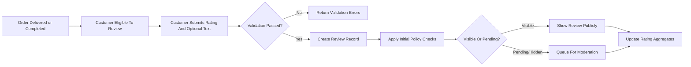
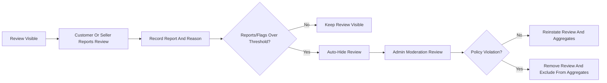
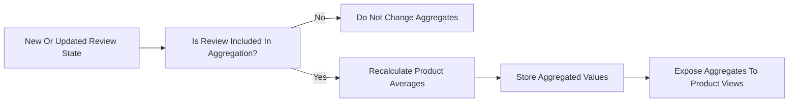

# Reviews and Ratings Requirements for shoppingMall Platform

## 1. Introduction

### 1.1 Document Purpose

THE shoppingMall reviews and ratings specification SHALL describe, in business terms, how product reviews and ratings must behave so that backend developers can implement them without ambiguity.

THE specification SHALL focus on **what** the system must do from a business perspective and SHALL not prescribe **how** it is technically implemented.

### 1.2 Scope

THE shoppingMall platform SHALL support customer-written product reviews and star ratings that are linked to purchases made through the platform.

THE scope of reviews and ratings SHALL include:
- Eligibility rules for writing, editing, and deleting reviews and ratings.
- Timing rules for when reviews can be created or modified.
- Rating scales, constraints, and validation rules.
- Review content requirements and prohibited content categories.
- Moderation and reporting workflows for reviews.
- Visibility rules and rating aggregation for products (and optionally SKUs).
- Interactions between reviews, orders, products, sellers, and admins.
- Error handling and unwanted behavior scenarios specific to reviews.

THE scope SHALL exclude:
- Front-end UI layout, visual design, or styling details.
- Technical implementation details such as database schemas, storage formats, or API contracts.
- Integration specifics with external systems.

### 1.3 Relationship to Other Documents

THE reviews and ratings behavior SHALL remain consistent with:
- Product and catalog business rules defined in the product and catalog requirements document.
- Governance, moderation, and admin responsibilities defined in the admin operations and governance document.
- User actors, permissions, and authentication rules defined in the user actors and authentication documents.

## 2. Domain Overview of Reviews and Ratings

### 2.1 Role of Reviews in the Business Model

THE shoppingMall platform SHALL treat reviews and ratings as a core mechanism to build trust between customers and sellers and to support product discovery.

WHEN customers leave honest feedback about purchased products, THE platform SHALL use this content to help other customers make purchasing decisions and to help sellers improve their offerings.

WHERE rating aggregates (average ratings, rating distributions, review counts) are computed, THE platform SHALL allow these aggregates to influence product discovery features such as sorting or filtering by rating, without prescribing any particular UI.

### 2.2 High-Level Review Lifecycle

THE review lifecycle on shoppingMall SHALL consist of the following conceptual stages:

1. Eligibility: A customer becomes eligible to review a purchased product or SKU.
2. Creation: The customer submits a rating (mandatory) and optional review content.
3. Initial Visibility: The review becomes visible or pending according to policy checks.
4. Moderation: Reviews may be reported, auto-flagged, approved, hidden, or removed.
5. Update: The author may edit or delete their review within business rules.
6. Aggregation: Ratings are aggregated per product and optionally per SKU for display.

### 2.3 Actors Involved in Reviews and Ratings

THE following actors participate in reviews and ratings:

- **guestUser**: Unauthenticated visitor who can read visible reviews and see aggregated ratings but cannot create, edit, or delete reviews.
- **customer**: Authenticated buyer who can create, edit, delete, and report their own reviews, subject to eligibility and timing rules.
- **seller**: Authenticated merchant who can view reviews on their own products, reply to reviews if enabled by policy, and report reviews for moderation, but cannot directly alter customer rating values or review text.
- **admin**: Platform administrator who can moderate, hide, restore, or remove reviews, view reports and flags, and enforce policy on reviews and reviewers.

## 3. Review Eligibility and Timing

### 3.1 Eligibility Rules by Actor

Ubiquitous eligibility requirements:

- THE system SHALL allow only **customer** actors associated with at least one completed order line item for a product or SKU to create a public review for that product or SKU.
- WHEN a **guestUser** attempts to submit a review, THE system SHALL reject the action and SHALL indicate that sign-in as a customer is required to write reviews.
- WHEN a **seller** acting in seller role attempts to create a review for any product, THE system SHALL reject the action and SHALL record an abuse-related audit event if the product belongs to that seller.
- WHERE an **admin** needs to record internal notes about a product or review, THE system SHALL store such notes in a separate internal channel and SHALL never expose them as public customer reviews.

### 3.2 Purchase and Delivery Preconditions

Event-driven requirements:

- WHEN a **customer** places an order that includes one or more SKUs, THE system SHALL track potential review eligibility per order line item.
- WHEN an order line item reaches a business-defined completion state equivalent to "Delivered" or "Completed", THE system SHALL mark the associated customer as review-eligible for that SKU and for the containing product.
- WHERE the same **customer** purchases the same SKU multiple times, THE system SHALL treat each delivered line item as separate eligibility, but THE system SHALL limit the **customer** to at most one active public review per SKU at a time.

Unwanted behavior handling:

- IF an order line item is cancelled before shipment or before the business-defined completion state, THEN THE system SHALL not grant review eligibility based on that line item.

### 3.3 Timing Windows (Earliest and Latest Review Time)

Timing expectations:

- WHEN an order line item transitions to the eligible completion state, THE system SHALL allow the **customer** to create a review for that SKU starting from the recorded completion time, subject to any configured cooling-off period.
- WHERE a cooling-off period (for example, 24 hours after delivery) is configured, THE system SHALL prevent review creation until the cooling-off period elapses.
- IF a **customer** attempts to create a review before the eligibility start time, THEN THE system SHALL reject the action and SHALL indicate that reviewing is not yet available for that purchase.

Expiration requirements:

- THE system SHALL allow a **customer** to create or update a review for a SKU for at least a configurable period (for example, 90 days) after the eligibility start time.
- IF the review window for a SKU expires for a given **customer**, THEN THE system SHALL prevent new review creation for that SKU by that **customer** and SHALL prevent edits to existing reviews, but MAY still allow deletion according to configured policy.

### 3.4 Multiple Reviews, Updates, and Deletions by Customers

Uniqueness rules:

- THE system SHALL enforce that each **customer** has at most one active public review per SKU at any time.
- WHEN a **customer** who already has a review for a SKU initiates another review creation action for the same SKU, THE system SHALL either treat the action as an edit of the existing review or SHALL reject the action and SHALL instruct the **customer** to edit the existing review instead, according to platform configuration.

Update and deletion rules:

- WHEN a **customer** edits their review, THE system SHALL update the rating and/or text while preserving an internal audit history of the review’s prior versions and modification timestamps.
- WHEN a **customer** deletes their review, THE system SHALL mark the review as deleted by author, SHALL remove it from public visibility, and SHALL exclude it from rating and count aggregation, while retaining a minimal internal record for audit and fraud detection.

### 3.5 Reviews for Cancelled or Refunded Orders

- IF an order line item is cancelled before it becomes eligible for review, THEN THE system SHALL not grant review eligibility for that line item.
- WHEN an order line item is refunded after delivery, THE system SHALL continue to treat the purchase as a legitimate basis for a review, unless business policy explicitly disallows reviews for refunded items.
- WHERE business policy disallows reviews for refunded items, THE system SHALL prevent new review creation for such line items after refund completion but SHALL not automatically remove previously created reviews unless they violate other policies.

### 3.6 Edge Cases (Guest Users, Banned Users, Deleted Products)

- WHEN a **guestUser** tries to write, edit, or delete a review, THE system SHALL deny the action and SHALL not create any draft or pending review for that actor.
- IF a **customer** account is suspended or banned, THEN THE system SHALL prevent that account from creating new reviews or editing existing reviews, while MAY leaving previously published reviews visible if they do not violate any content policy.
- WHEN a product or SKU is permanently removed from public catalog browsing, THE system SHALL preserve associated reviews for use in order history views, but THE system MAY hide or remove those reviews from public product pages according to business policy.

## 4. Rating Scale and Constraints

### 4.1 Rating Scale Definition

- THE system SHALL use a numeric star rating scale in which larger numbers indicate greater satisfaction.
- THE system SHALL support a default rating scale from **1** to **5** inclusive for all products.
- WHERE business policy requires a different numeric range, THE system SHALL allow configuration of minimum and maximum rating values while preserving the principle that higher values represent better ratings.

### 4.2 Allowed Rating Values and Granularity

- THE system SHALL restrict ratings to whole number increments within the configured range (for example, 1, 2, 3, 4, 5) unless fractional ratings are explicitly enabled.
- WHERE fractional ratings are enabled, THE system SHALL support fractional increments no smaller than 0.5.
- IF a submitted rating value is outside the configured range or does not conform to allowed increments, THEN THE system SHALL reject the submission with a validation error.

### 4.3 Relationship Between Rating and Review Text

- THE system SHALL always require a valid rating value when creating or updating a review record.
- WHERE business policy requires additional explanation for low ratings (for example, ratings below a configured threshold), THE system SHALL require at least a minimal review body length for such reviews.
- IF a **customer** submits review text without a rating, THEN THE system SHALL reject the submission and SHALL require a rating.
- WHERE rating-only feedback is allowed, THE system SHALL permit reviews that contain a rating with an empty or omitted text body and SHALL include these rating-only reviews in rating aggregates.

### 4.4 Constraints on Review Title, Body, and Media Attachments

- THE system SHALL define maximum character length limits for review titles and review bodies and SHALL enforce these limits on creation and update.
- IF a review title or body exceeds its maximum length, THEN THE system SHALL reject the submission and SHALL indicate the applicable maximum length.
- WHERE media attachments (such as images or videos) are supported for reviews, THE system SHALL limit:
  - The maximum number of attachments per review.
  - The maximum allowed size per attachment.
  - The maximum total attachment size per review.
- IF a review submission exceeds media limits, THEN THE system SHALL either reject the entire submission or accept the text and rating while rejecting excess attachments, according to platform configuration.

### 4.5 Performance Expectations for Rating Operations

- WHEN a **customer** submits, edits, or deletes a review, THE system SHALL respond with a clear success or error result within an acceptable business timeframe (for example within 3 seconds for 95% of requests under normal load).
- WHEN a product detail or listing view requires aggregated rating information, THE system SHALL provide the necessary aggregate values and counts within a business-acceptable timeframe (for example within 1 second for 95% of requests under normal load), so that rating information appears responsive.

## 5. Review Content Rules

### 5.1 Required and Optional Fields

- THE system SHALL treat the following review attributes as mandatory at creation time:
  - Rating score.
  - Target product or SKU identifier.
  - Author customer identity.
- THE system SHALL treat the following attributes as optional at creation time (subject to policy):
  - Review title.
  - Review body text.
  - Media attachments (images, videos) where supported.
  - Private feedback fields visible only to seller or admin where such concepts exist.

### 5.2 Language, Length, and Formatting Rules

- THE system SHALL allow reviews to be written in any natural language supported by the platform without enforcing a specific language per review.
- WHERE a minimum body length is configured, THE system SHALL reject reviews whose body text does not meet the minimum length when a body is required.
- THE system SHALL preserve basic formatting such as line breaks but SHALL strip or neutralize unsupported markup or executable content (for example HTML tags, scripts, or style directives) so review content remains safe and text-oriented.

### 5.3 Prohibited Content Categories

THE system SHALL consider the following content categories prohibited within public review text, titles, and attachments:

- Hate speech, discrimination, or harassment toward individuals or groups.
- Explicit sexual content or adult material that is not directly related to product evaluation.
- Personal attacks, threats, or doxxing, including exposure of personal contact details of other users or third parties.
- Content promoting illegal activities or containing illegal material.
- Advertising or promotion for unrelated products, services, or competing platforms.
- Threats of violence or encouragement of self-harm.

Unwanted behavior requirements:

- IF a review contains content that clearly matches any prohibited category according to moderation rules, THEN THE system SHALL mark the review as violating policy and SHALL hide or remove the review from public view according to moderation decisions.

### 5.4 Handling of External Links and Contact Information

- THE system SHALL either disallow external hyperlinks entirely in reviews or SHALL restrict them according to platform policy.
- WHERE external links are allowed, THE system SHALL clearly treat them as user-generated and SHALL not represent them as endorsed or verified by the platform.
- THE system SHALL prohibit explicit inclusion of personal contact information (for example phone numbers, email addresses, and social media handles) within review content, except where legally mandatory.
- IF a review is detected to contain personal contact information, THEN THE system SHALL either auto-redact that content or flag the review for moderation, depending on configured policy.

### 5.5 Editing and Deleting Content by Author

- WHEN a **customer** edits their review within an allowed edit window, THE system SHALL allow updates to rating, title, body, and media attachments subject to validation rules.
- WHERE a maximum edit window is configured (for example 30 days from creation), THE system SHALL prevent further edits once the window has passed while still allowing deletion if policy permits.
- WHEN a **customer** deletes their own review, THE system SHALL remove the review from public display, SHALL exclude it from rating and count aggregates, and SHALL retain a minimal internal audit record that the review existed.

## 6. Moderation and Reporting

### 6.1 Moderation Actors and Responsibilities

- THE system SHALL allow **customers** and **sellers** to report reviews they consider inappropriate, fraudulent, or misleading.
- THE system SHALL assign exclusive authority for final moderation outcomes (for example hide, permanently remove, or reinstate) to **admin** actors; sellers SHALL not be able to directly change customer review content or rating.
- WHERE business policy enables seller replies to reviews, THE system SHALL store seller replies separately from the original review text and SHALL ensure that seller replies cannot alter the original rating or text.

### 6.2 Reporting Flow by Customers and Sellers

Event-driven requirements:

- WHEN a **customer** or **seller** reports a review, THE system SHALL record at least:
  - The identity of the reporting actor.
  - A reason category from a predefined list (for example offensive content, spam, misleading, conflict of interest).
  - Optional explanatory text.
  - Timestamp of report.
- WHEN a review has at least one report, THE system SHALL mark that review as "reported" and SHALL list it in an admin moderation queue.
- WHERE a review reaches a configurable threshold of reports within a defined time period, THE system MAY automatically hide the review from public view pending admin review, according to platform policy.

### 6.3 Auto-Detection of Unwanted Behavior

- THE system SHALL support automatic flagging of reviews based on behavioral patterns, such as:
  - Abnormally high number of reviews created by the same account in a short period.
  - Many reviews from different accounts originating from the same technical fingerprint (for example IP or device) in a short period.
  - Reviews that are not linked to verified purchases where the platform requires purchase verification.
- IF a review is auto-flagged, THEN THE system SHALL mark it with the reason for auto-flagging and SHALL include it in the admin moderation queue.

### 6.4 Temporary Hiding vs. Permanent Removal

- THE system SHALL distinguish between **temporarily hidden** reviews and **permanently removed** reviews.
- WHEN a review is under investigation or auto-hidden due to many reports, THE system SHALL prevent it from appearing in public product pages and from contributing to rating aggregates while in hidden state.
- WHEN an **admin** determines that a review violates policy, THE system SHALL allow the admin to mark the review as permanently removed. In that case, THE system SHALL:
  - Exclude the review from all customer-facing views.
  - Exclude the review from rating and review count aggregates.
  - Retain internal records for audit and compliance.
- WHEN an **admin** determines that a hidden review does not violate policy, THE system SHALL allow reinstatement; in that case, THE system SHALL restore the review to public visibility and SHALL include it again in aggregates.

### 6.5 Appeals and Reinstatement Rules

- WHERE business policy supports review author appeals, THE system SHALL allow review authors to submit an appeal after their review is hidden or removed.
- WHEN an appeal is submitted, THE system SHALL record the appeal details and SHALL notify admins responsible for moderation.
- WHEN an **admin** decides to reinstate a review after appeal, THE system SHALL restore the review’s public visibility and SHALL re-include it in rating and review count aggregation.

### 6.6 Abuse, Spam, and Fraud Scenarios

Representative unwanted behaviors:

- Posting reviews from a seller account for that seller’s own products.
- Creating multiple customer accounts to post many reviews for the same product (positive or negative) in a short period.
- Coordinated review bombing where multiple accounts post similar low ratings for competitive reasons.
- Automated scripts or bots generating multiple reviews in a pattern inconsistent with normal purchasing behavior.

Requirements:

- IF the system detects patterns consistent with abuse or fraud, THEN THE system SHALL:
  - Flag involved reviews and accounts for admin review.
  - Allow admins to hide or remove affected reviews in bulk.
  - Allow admins to apply account-level actions such as suspension according to governance policies.

## 7. Visibility and Aggregation Rules

### 7.1 Visibility by Actor Type

Role-based visibility requirements:

- WHERE the actor is **guestUser**, THE system SHALL allow viewing of public reviews and aggregated ratings for products but SHALL not expose internal moderation data or reporter identities.
- WHERE the actor is **customer**, THE system SHALL allow viewing of all public reviews and SHALL additionally allow each **customer** to see their own reviews, including any that are pending moderation or hidden, clearly labeled as such.
- WHERE the actor is **seller**, THE system SHALL allow viewing of all public reviews for products owned by that seller and, where policy allows, visibility of which reviews about those products are currently hidden or under moderation, without exposing reporter identities where that would conflict with privacy policies.
- WHERE the actor is **admin**, THE system SHALL allow viewing of all reviews, including hidden or removed reviews, together with full moderation history and reporter details.

### 7.2 Public vs. Private Review Concepts

- THE system SHALL treat customer product reviews as public content once approved or not hidden by policy.
- WHERE private feedback channels exist (for example private messages from customer to seller), THE system SHALL store such feedback separately from public reviews and SHALL restrict visibility to relevant sellers and admins only.

### 7.3 Product Detail Page Aggregation Rules

Aggregation requirements:

- THE system SHALL calculate, for each product, at least the following aggregate metrics over included reviews:
  - Average rating value.
  - Total number of included ratings.
  - Distribution of counts per rating value (for example counts for 1-star through 5-star).
- WHERE SKU-specific rating aggregates are required, THE system SHALL additionally calculate aggregates per SKU using the same rules.
- WHEN a product has no included ratings, THE system SHALL represent that state explicitly (for example as "no rating yet") and SHALL not display a default numeric rating.

### 7.4 Average Rating Calculation and Rounding Rules

- THE system SHALL compute the average rating for a product as the arithmetic mean of rating values from all reviews that are included in aggregation at that time.
- WHERE fractional averages occur, THE system SHALL store the precise computed value and SHALL apply configurable rounding rules for display (for example round to one decimal place).
- IF display rounding is applied, THEN THE system SHALL ensure that internal computations continue to use the precise stored average rather than the rounded display value.

### 7.5 Handling of Deleted or Hidden Reviews in Aggregations

- WHEN a review is deleted by its author or permanently removed by an admin, THE system SHALL exclude that review from all rating and review count aggregates from that point onward.
- WHILE a review is temporarily hidden or pending moderation, THE system SHALL exclude it from rating and count aggregates, unless policy explicitly states otherwise for certain moderation states.
- WHEN a previously hidden review is reinstated, THE system SHALL include it again in subsequent rating and count aggregates.

### 7.6 Sorting, Filtering, and Highlighting Reviews

- THE system SHALL support sorting of reviews at least by:
  - Most recent.
  - Highest rating.
  - Lowest rating.
  - Most helpful, where helpfulness voting is implemented.
- WHERE filtering is supported, THE system SHALL allow filtering by rating value (for example 4 stars and above) and by presence of attachments (for example only reviews with photos), according to business needs.
- WHERE highlighting concepts such as "top review" or "verified purchase" are used, THE system SHALL compute them based on defined business rules, for example:
  - "Verified purchase" reviews are reviews linked to eligible completed orders for the reviewed product or SKU.
  - "Top review" is selected based on helpfulness votes, recency, rating level, or admin editorial selection according to policy.

## 8. Interaction with Orders, Products, and Users

### 8.1 Linking Reviews to Orders and SKUs

- THE system SHALL associate each review with:
  - A specific product and optionally a specific SKU.
  - The **customer** who authored the review.
  - At least one originating order line item when the review is based on a purchase.
- IF a review cannot be associated with a valid order or SKU that matches the product and customer and the platform requires verified purchase, THEN THE system SHALL either disallow creation of such a review or SHALL mark it as "not verified purchase" according to policy.

### 8.2 Behavior When Orders Change State

- WHEN an order line item is cancelled before delivery, THE system SHALL revoke or withhold review eligibility for that line item.
- WHEN an order line item is refunded or returned after delivery, THE system SHALL not automatically remove previously written reviews but SHALL keep order-refund associations available for admin and analytics use.

### 8.3 Behavior When Products or SKUs Become Unavailable

- WHILE a product or SKU is temporarily out of stock, THE system SHALL continue to display existing reviews on public product pages.
- WHEN a product or SKU is permanently removed from public catalog, THE system SHALL:
  - Keep associated reviews accessible in the **customer**’s order history.
  - Optionally hide or remove these reviews from general browsing and search results, based on platform policy.

### 8.4 Impact of User Account Deletion or Suspension on Reviews

- WHEN a **customer** account is suspended, THE system SHALL prevent new reviews or edits from that account but SHALL leave existing reviews visible unless they violate policy.
- WHEN a **customer** account is permanently deleted subject to privacy rules, THE system SHALL either:
  - Anonymize references to that customer in their reviews (for example replace display name), or
  - Remove their reviews altogether, according to platform policy and legal requirements.
- WHEN a **seller** account is suspended or terminated, THE system SHALL keep existing reviews for that seller’s products visible unless policy dictates otherwise, while ensuring that seller replies and moderation responsibilities are handled appropriately by admins.

## 9. Error Handling and Unwanted Behavior Scenarios

### 9.1 Common User Errors (Validation, Permissions, Timing)

- IF a **customer** tries to review a product or SKU for which they have no eligible completed purchase, THEN THE system SHALL reject the action and SHALL indicate that reviews are limited to purchased items.
- IF a **customer** tries to review the same SKU more than once when only one active review is allowed, THEN THE system SHALL either redirect the **customer** to edit their existing review or SHALL return an error explaining that only one review per SKU is allowed.
- IF required fields (rating or mandatory review body for certain rating ranges) are missing, THEN THE system SHALL reject the submission and SHALL return field-specific validation errors.
- IF a review action is submitted with an invalid or expired session, THEN THE system SHALL reject the action and SHALL require the actor to authenticate again.

### 9.2 System Errors (Inconsistencies, Missing References)

- IF the system detects that a review refers to a product or SKU that does not exist or has been removed inconsistently, THEN THE system SHALL prevent such a review from being created and SHALL log the inconsistency for admin attention.
- IF an existing review becomes orphaned due to exceptional data correction (for example an order is removed or re-assigned), THEN THE system SHALL mark that review as orphaned, SHALL exclude it from public display and aggregates, and SHALL expose it to admins for resolution.

### 9.3 Fraud Prevention (Review Bombing, Self-Reviews, Incentivized Reviews)

- IF the system detects that a **seller** role is attempting to post reviews for its own products, THEN THE system SHALL block such reviews, SHALL log the event, and MAY flag the seller account for admin review.
- IF a rapid increase in low ratings for a specific product is detected from accounts without verified purchases or from correlated devices, THEN THE system SHALL flag this situation as potential review bombing for admin investigation.
- WHERE reviews are incentivized (for example discounts or coupons in exchange for reviews), THE system SHALL support marking such reviews with an indicator (for example "incentivized review") so that other customers understand the context, in line with regulatory guidelines.

## 10. Performance, Security, and Compliance Expectations (Reviews Context)

### 10.1 Performance Expectations

- THE system SHALL process and store reviews and rating changes without significantly impacting the responsiveness of core shopping flows.
- WHILE the platform is under normal load, THE system SHALL keep review-related response times within the general performance targets defined in the non-functional requirements document.

### 10.2 Security and Privacy Considerations

- THE system SHALL enforce that only authorized roles can create, edit, delete, report, or moderate reviews according to actor-based permissions.
- THE system SHALL protect reporter identities and internal moderation notes from exposure to unauthorized actors.
- THE system SHALL minimize exposure of personal data in review content by applying the content rules and redaction mechanisms described above.

### 10.3 Data Retention and Audit Requirements

- THE system SHALL retain sufficient audit data for each review, including creation time, modification history, moderation actions, and actors involved, for at least the period required by platform policy and regulations.
- WHERE data minimization or privacy rules require removal or anonymization of review data, THE system SHALL apply those rules while preserving the minimum necessary information for fraud detection and aggregated statistics, where permitted.

## 11. Mermaid Diagrams

### 11.1 Review Creation Flow

### 11.2 Moderation and Reporting Flow

### 11.3 Aggregation and Visibility Flow

THE requirements in this document describe business behavior only. All technical implementation decisions, including architecture, APIs, database design, and specific algorithms, SHALL be determined by the development team provided that the resulting behavior satisfies these requirements.