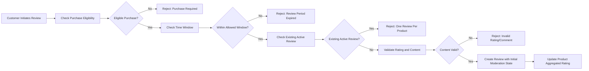
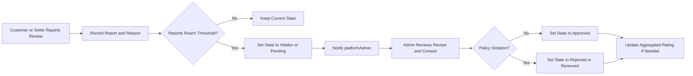

# Review and Rating Requirements for shoppingMall Backend

## 1. Overview and Scope

Product reviews and ratings in shoppingMall provide social proof, influence purchase decisions, and surface product quality issues to sellers and platform operators. The review-and-rating subsystem governs who may leave feedback, under which conditions, how ratings are aggregated, and how abusive or fraudulent reviews are detected and moderated.

Scope:
- Text-based product reviews and numeric star ratings by customers.
- Read access to reviews and aggregated ratings for all relevant actors.
- Business rules for eligibility, creation, editing, deletion, reporting, moderation, and aggregation.
- Fraud, abuse, and conflict-of-interest prevention.
- Error handling and non-functional expectations from a business viewpoint.

Out of scope:
- Technical API shapes, database schema, storage formats, and UI layout.
- Seller reputation scores or separate seller-rating systems.

## 2. Domain Actors and High-Level Responsibilities

### 2.1 Actors

- **guestUser**: Unauthenticated visitor.
- **customer**: Authenticated buyer account.
- **seller**: Authenticated merchant that owns products.
- **platformAdmin**: Administrative staff operating the marketplace.

### 2.2 High-Level Capabilities by Actor

- guestUser:
  - Read public reviews and product rating summaries.
  - Cannot write, edit, delete, or report reviews.

- customer:
  - Write reviews and star ratings for eligible products they purchased.
  - Edit or delete their own reviews within business constraints.
  - Report reviews they consider abusive, fraudulent, or irrelevant.
  - View their own review history.

- seller:
  - Read reviews associated with products they own, including some non-public moderation metadata where policy allows.
  - Optionally post seller responses to reviews if the feature is enabled by policy.
  - Report reviews on their products for suspected abuse or fraud.
  - Cannot directly change customer-authored rating values or review texts.

- platformAdmin:
  - Read and search all reviews across the platform.
  - See reports, moderation status, and internal notes.
  - Change moderation state (approve, hide, reject, remove) of reviews.
  - Restrict or block customers from creating new reviews.
  - Configure policy parameters (time windows, thresholds) where such configuration is exposed as business settings.

EARS requirements:
- THE review-and-rating subsystem SHALL treat guestUser as read-only for reviews and ratings.
- THE review-and-rating subsystem SHALL allow customer, seller, and platformAdmin to perform only those actions that their role is permitted to perform in the review domain.

## 3. Review Entities and Life Cycle

### 3.1 Review Structure (Business View)

Each review consists of:
- A reference to a product and optionally a specific SKU.
- The authoring customer.
- A numeric rating within the configured scale.
- Optional textual comment.
- Timestamps for creation and last modification.
- Moderation state and visibility flags.
- Optional seller response (if feature enabled).

EARS requirements:
- THE review-and-rating subsystem SHALL associate each review with exactly one product and exactly one authoring customer.
- WHERE reviews are configured to be SKU-specific, THE review-and-rating subsystem SHALL additionally associate each review with exactly one SKU that belongs to the referenced product.

### 3.2 Moderation States

To support policy enforcement, each review has a moderation state such as:
- `pending` – awaiting moderation decision.
- `approved` – acceptable and visible in public views.
- `hidden` – temporarily hidden from public views pending review.
- `rejected` – deemed policy-violating and not visible publicly, retained for audit.
- `removed` – excluded from all public views and rating aggregations; may be retained for audit.

EARS requirements:
- THE review-and-rating subsystem SHALL maintain a moderation state for each review that determines its visibility and participation in rating aggregations.
- WHEN a review’s moderation state changes, THE review-and-rating subsystem SHALL update its public visibility and its contribution to product rating aggregation accordingly.

## 4. Eligibility to Create Reviews

### 4.1 Purchase-Based Eligibility

EARS requirements:
- WHEN a customer attempts to create a review for a product, THE review-and-rating subsystem SHALL verify that the customer has at least one completed order that contains that product or a SKU of that product.
- IF a customer has no completed order containing the product or its SKUs, THEN THE review-and-rating subsystem SHALL deny review creation for that product and SHALL indicate that only purchasers may review.
- WHERE orders have multiple items, THE review-and-rating subsystem SHALL treat purchase of any SKU belonging to the product as sufficient to establish eligibility for a product-level review.

### 4.2 Order Status Conditions

EARS requirements:
- WHEN a customer attempts to review an item from an order that is not yet in a completed delivery state, THE review-and-rating subsystem SHALL deny review creation and SHALL indicate that the order is not yet eligible for review.
- WHEN an order line is in a delivered or equivalent completed fulfillment state, THE review-and-rating subsystem SHALL treat that line as eligible for review, subject to time-window and per-product limits.

### 4.3 Time Window for Review Creation

EARS requirements:
- THE review-and-rating subsystem SHALL allow review creation only within a configurable time window that starts when the associated product is first marked as delivered in at least one eligible order for that customer and ends after a configurable number of days.
- IF the current time is later than the review window end for the customer-product pair, THEN THE review-and-rating subsystem SHALL deny new review creation for that customer-product pair and SHALL indicate that the review period has expired.

### 4.4 One Active Review per Customer per Product

EARS requirements:
- THE review-and-rating subsystem SHALL limit each customer to at most one active review per product in states that contribute to ratings (for example, `approved` or `pending`).
- WHEN a customer with an existing active review attempts to create a second review for the same product, THE review-and-rating subsystem SHALL deny the new review and SHALL indicate that the customer must edit the existing review instead.
- WHERE a customer has multiple eligible orders for the same product, THE review-and-rating subsystem SHALL continue to treat the customer as eligible to update the existing review rather than creating separate reviews.

### 4.5 SKU-Level vs Product-Level Reviews

EARS requirements:
- WHERE the platform is configured for SKU-level reviews, THE review-and-rating subsystem SHALL require that the customer’s eligible completed order contains the specific SKU being reviewed.
- WHERE the platform is configured for product-level reviews, THE review-and-rating subsystem SHALL treat purchase of any SKU within the product as sufficient eligibility for a single product-level review.

### 4.6 Blocked and Suspended Customers

EARS requirements:
- IF a customer account is flagged as blocked from reviewing, THEN THE review-and-rating subsystem SHALL deny any attempt by that customer to create or edit reviews and SHALL preserve existing reviews only for moderation or audit.
- IF a customer account is suspended or deactivated at platform level, THEN THE review-and-rating subsystem SHALL deny new review creation and editing by that account while retaining existing reviews subject to moderation rules and retention policies.

## 5. Review Content and Rating Scale

### 5.1 Rating Scale

EARS requirements:
- THE review-and-rating subsystem SHALL represent the rating component of each review using a fixed integer scale configured at platform level, such as 1 to 5 inclusive, where the lowest value indicates worst experience and the highest value indicates best experience.
- IF a submitted rating value falls outside the configured inclusive range, THEN THE review-and-rating subsystem SHALL reject the review creation or update and SHALL indicate that the rating is invalid.

### 5.2 Required Fields

EARS requirements:
- THE review-and-rating subsystem SHALL require a rating value for every review.
- WHERE business policy requires a non-empty textual comment together with certain rating ranges (for example, 1–2 stars), THE review-and-rating subsystem SHALL enforce that policy by rejecting reviews in those rating ranges that lack a non-empty comment.

### 5.3 Text Comment Length and Format

EARS requirements:
- THE review-and-rating subsystem SHALL enforce configurable minimum and maximum lengths on review text comments, measured in characters.
- IF a review comment is shorter than the configured minimum length when a comment is provided, THEN THE review-and-rating subsystem SHALL reject the review creation or update and SHALL indicate that the comment is too short.
- IF a review comment exceeds the configured maximum length, THEN THE review-and-rating subsystem SHALL reject the review creation or update and SHALL indicate that the comment is too long.

### 5.4 Language and Prohibited Content

EARS requirements:
- THE review-and-rating subsystem SHALL support detection or flagging of comments that contain prohibited content categories defined by policy, such as hate speech, explicit profanity, illegal content, or direct disclosure of sensitive personal data.
- IF a review is identified or reported as containing prohibited content, THEN THE review-and-rating subsystem SHALL move the review into a non-public moderation state such as `hidden` or `pending` until a moderation decision is made.

### 5.5 Personal and Sensitive Data in Reviews

EARS requirements:
- THE review-and-rating subsystem SHALL discourage inclusion of direct contact information (such as phone numbers, email addresses, or full home addresses) and sensitive personal data in review text, by enabling validation or moderation rules defined by business policy.
- IF a review contains sensitive personal data that must not be public, THEN THE review-and-rating subsystem SHALL ensure that the review is not displayed publicly until it is sanitized, removed, or otherwise resolved by moderation.

### 5.6 Attachments (Optional Feature)

EARS requirements:
- WHERE the platform supports attachments with reviews, THE review-and-rating subsystem SHALL enforce a configurable maximum number of attachments per review and a maximum size per attachment.
- IF an attachment type or size violates the configured limits or permitted types, THEN THE review-and-rating subsystem SHALL reject the review creation or update that includes such attachment and SHALL indicate the violation.

## 6. Aggregated Ratings and Product Impact

### 6.1 Product-Level Aggregated Rating

EARS requirements:
- THE review-and-rating subsystem SHALL compute and maintain an aggregated rating value for each product based only on reviews in public, rating-contributing states such as `approved`.
- THE review-and-rating subsystem SHALL exclude reviews in states such as `pending`, `hidden`, `rejected`, or `removed` from aggregated rating calculations.
- THE review-and-rating subsystem SHALL recompute a product’s aggregated rating whenever a review enters or leaves a contributing state, or when a contributing review’s rating value changes.
- THE review-and-rating subsystem SHALL support rounding of aggregated ratings according to configurable rules (for example, one decimal place).

### 6.2 Review Counts and Distribution

EARS requirements:
- THE review-and-rating subsystem SHALL maintain, for each product, the count of reviews that contribute to the aggregated rating.
- WHERE business analytics require rating distribution, THE review-and-rating subsystem SHALL maintain per-rating-value counts (for example, counts of 1-star, 2-star, 3-star, 4-star, and 5-star reviews) for contributing reviews.

### 6.3 Visibility in Catalog and Product Detail

EARS requirements:
- THE review-and-rating subsystem SHALL provide sufficient data for catalog and product-detail views to display aggregated rating value and review count for each product.
- WHEN a product has no contributing reviews, THE review-and-rating subsystem SHALL treat its aggregated rating as undefined and SHALL indicate this state so that presentation layers can display a neutral message such as "No reviews yet".

### 6.4 Handling Edited and Deleted Reviews in Aggregation

EARS requirements:
- WHEN a customer edits the rating value of an approved review, THE review-and-rating subsystem SHALL update the aggregated rating and rating distribution to reflect the new value.
- WHEN a review is moved from a contributing state to a non-contributing state (for example, from `approved` to `removed`), THE review-and-rating subsystem SHALL update aggregated rating and counts to exclude that review.
- WHEN a review is re-approved after being hidden or pending, THE review-and-rating subsystem SHALL update aggregated rating and counts to include that review again.

## 7. Moderation, Reporting, and Abuse Handling

### 7.1 Reporting Reviews

EARS requirements:
- THE review-and-rating subsystem SHALL allow customers and sellers to report reviews they consider abusive, fraudulent, off-topic, or otherwise policy-violating.
- THE review-and-rating subsystem SHALL record each report with the reporting actor, timestamp, and reason category chosen from a configurable list (for example, spam, inappropriate language, privacy violation, off-topic, conflict of interest).

### 7.2 Automatic Threshold Handling

EARS requirements:
- WHERE a report threshold is configured, THE review-and-rating subsystem SHALL automatically change a review’s moderation state to a configured state such as `hidden` or `pending` once the number of distinct reports reaches or exceeds that threshold.
- IF a review’s moderation state changes automatically due to report thresholds, THEN THE review-and-rating subsystem SHALL keep the review accessible to platformAdmin for manual moderation.

### 7.3 Moderation Actions by platformAdmin

EARS requirements:
- THE review-and-rating subsystem SHALL allow platformAdmin to change a review’s moderation state to `approved`, `hidden`, `rejected`, or `removed` based on policy evaluation.
- THE review-and-rating subsystem SHALL allow platformAdmin to attach an internal moderation note to a review that explains the decision in business terms.
- WHEN platformAdmin marks a review as `approved`, THE review-and-rating subsystem SHALL make the review visible in public-facing review lists and SHALL include it in aggregated rating calculations.
- WHEN platformAdmin marks a review as `rejected` or `removed`, THE review-and-rating subsystem SHALL exclude the review from public-facing views and from aggregated rating calculations while retaining it for audit according to retention policies.

### 7.4 Seller Participation in Moderation

EARS requirements:
- THE review-and-rating subsystem SHALL allow sellers to report reviews for their own products but SHALL not allow them to change moderation state directly.
- WHERE seller responses to reviews are enabled, THE review-and-rating subsystem SHALL allow sellers to post one response per review and to edit or delete that response within business-defined constraints, without affecting the customer’s rating value.

### 7.5 Fraud and Manipulation Prevention

EARS requirements:
- IF a seller account attempts to submit a review for any product that seller owns, THEN THE review-and-rating subsystem SHALL deny review creation and SHALL indicate that sellers cannot review their own products.
- WHERE customer accounts are detected or flagged as likely duplicates or controlled by the same entity for manipulation purposes according to business policy, THE review-and-rating subsystem SHALL support configuration to restrict those accounts from submitting reviews or to mark their reviews for additional moderation.
- WHERE incentivized review campaigns are allowed by policy, THE review-and-rating subsystem SHALL support a flag that marks such reviews as incentivized so that they can be handled differently in analytics or presentation where required.

## 8. Visibility, Editing, and Deletion Rules

### 8.1 Public Visibility

EARS requirements:
- THE review-and-rating subsystem SHALL display only reviews in states designated as public (such as `approved`) to guestUser and customer in standard product review views.
- THE review-and-rating subsystem SHALL ensure that reviews in non-public states (such as `pending`, `hidden`, `rejected`, `removed`) are not shown in standard product views to guestUser or customers.

### 8.2 Sorting and Paging of Reviews

EARS requirements:
- THE review-and-rating subsystem SHALL support, at minimum, sorting reviews by newest-first and by rating value (for example, highest rating first or lowest rating first).
- THE review-and-rating subsystem SHALL support pagination or incremental retrieval for products with many reviews to avoid exposing excessively large result sets in a single request.

### 8.3 Editing Own Reviews

EARS requirements:
- THE review-and-rating subsystem SHALL allow a customer to edit only reviews authored by that customer.
- WHERE an editing time window is configured, THE review-and-rating subsystem SHALL prevent edits to customer reviews that were created earlier than the configured editing window allows.
- WHEN a review is edited, THE review-and-rating subsystem SHALL update its last-modified timestamp and SHALL re-validate rating and content rules; IF validation fails, THEN THE review-and-rating subsystem SHALL reject the edit and SHALL preserve the previous version.
- WHERE moderation policy requires re-approval after edits, THE review-and-rating subsystem SHALL change the review’s moderation state accordingly and SHALL update public visibility and aggregated rating only after the new moderation state permits it.

### 8.4 Deleting Own Reviews

EARS requirements:
- THE review-and-rating subsystem SHALL allow a customer to request deletion of their own review at any time, subject to legal or audit constraints.
- WHEN a customer deletes a review, THE review-and-rating subsystem SHALL ensure that the review no longer appears in public review lists and no longer contributes to aggregated ratings.
- WHERE the platform uses soft deletion for reviews, THE review-and-rating subsystem SHALL retain the deleted review in a non-public state for audit, with clear indication that it is soft-deleted, while excluding it from all user-facing statistics and lists.

### 8.5 Reviews on Inactive or Removed Products

EARS requirements:
- IF a product is deactivated or removed from the catalog for new purchases, THEN THE review-and-rating subsystem SHALL stop showing its reviews in normal browsing and search flows, except where product detail is accessed from historical orders.
- WHERE a customer views a historical order that references an inactive product, THE review-and-rating subsystem SHALL allow access to existing reviews for that product where policy permits.
- THE review-and-rating subsystem SHALL allow platformAdmin to view and search reviews for inactive or removed products for audit and analysis.

## 9. Error Scenarios and Recovery (Business View)

### 9.1 Ineligible Review Attempts

EARS requirements:
- IF a customer attempts to create a review without a qualifying completed order, THEN THE review-and-rating subsystem SHALL deny the attempt and SHALL indicate that only customers who purchased the product may review it.
- IF a customer attempts to create a review outside the configured review time window, THEN THE review-and-rating subsystem SHALL deny the attempt and SHALL indicate that the review period has expired.

### 9.2 Duplicate Reviews

EARS requirements:
- IF a customer attempts to create a second active review for the same product while an existing active review is present, THEN THE review-and-rating subsystem SHALL reject the new review and SHALL indicate that only one review per product is allowed.

### 9.3 Editing and Deleting Errors

EARS requirements:
- IF a customer attempts to edit or delete a review that does not exist, THEN THE review-and-rating subsystem SHALL deny the request and SHALL indicate that the review could not be found.
- IF a customer attempts to edit or delete a review that was not authored by that customer, THEN THE review-and-rating subsystem SHALL deny the request and SHALL indicate that the customer is not authorized to modify that review.
- IF a customer attempts to edit a review that is in a locked moderation state (for example, `rejected` or `removed`), THEN THE review-and-rating subsystem SHALL deny the edit and SHALL indicate that the review can no longer be edited.

### 9.4 Reporting and Moderation Edge Cases

EARS requirements:
- IF a customer or seller reports a review that has already been removed or is no longer accessible, THEN THE review-and-rating subsystem SHALL deny the report and SHALL indicate that the review is no longer available for reporting.
- IF multiple admins attempt to change the moderation state of the same review concurrently, THEN THE review-and-rating subsystem SHALL apply a deterministic rule (for example, last valid action wins) and SHALL record all attempted moderation actions in audit logs.

## 10. Non-Functional Expectations for Reviews

### 10.1 Performance

EARS requirements:
- WHEN customers or guestUser actors request reviews for a product, THE review-and-rating subsystem SHALL return the first page of visible reviews and the product’s aggregated rating within the response time targets defined for personalized or catalog reads in the nonfunctional requirements.
- WHEN a customer submits or edits a review under normal load, THE review-and-rating subsystem SHALL validate and persist the review and update aggregated ratings quickly enough that subsequent reads reflect the change within a short business-acceptable delay.

### 10.2 Availability and Resilience

EARS requirements:
- WHILE the platform is operating within normal availability targets, THE review-and-rating subsystem SHALL allow reading of public reviews and aggregated ratings even if moderation or analytics subsystems are temporarily degraded.
- IF the review persistence subsystem experiences a transient failure during review submission, THEN THE review-and-rating subsystem SHALL return a clear error indicating that the review could not be saved and SHALL not partially persist an invalid review.

### 10.3 Auditability

EARS requirements:
- THE review-and-rating subsystem SHALL log creation, editing, deletion, reporting, and moderation actions for each review with actor identifier, timestamp, and action type.
- WHERE reviews are removed from public view for policy reasons, THE review-and-rating subsystem SHALL preserve a record of the removal decision, including the acting admin and the stated reason, for the duration specified in audit retention policies.

## 11. Key Flows (Mermaid Diagrams)

### 11.1 Review Creation Flow

### 11.2 Review Reporting and Moderation Flow

## 12. Summary of Critical Business Requirements (EARS)

- THE review-and-rating subsystem SHALL allow only customers with completed purchases and within a defined time window to create at most one active review per product.
- THE review-and-rating subsystem SHALL maintain an aggregated rating and review counts per product that include only reviews in contributing states.
- THE review-and-rating subsystem SHALL enforce role-based capabilities: guestUser read-only, customer author-and-edit own, seller read-and-report for owned products, platformAdmin full moderation powers with audit.
- THE review-and-rating subsystem SHALL support reporting and moderation workflows to identify and remove abusive, fraudulent, or policy-violating reviews.
- THE review-and-rating subsystem SHALL prevent sellers from reviewing their own products and SHALL support additional rules to limit rating manipulation by coordinated or duplicate accounts.
- THE review-and-rating subsystem SHALL ensure that public visibility of reviews and their influence on aggregated ratings are controlled solely by moderation state and product visibility, and SHALL update these consistently when states change.
