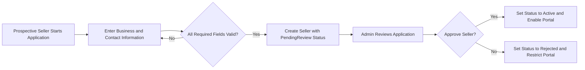
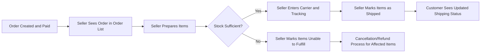

# Seller Portal and Inventory Business Requirements

## 1. Introduction and Scope

THE shoppingMall seller portal SHALL define how the seller actor operates on the platform from a business perspective. The seller portal SHALL cover onboarding, profile management, product and SKU management, inventory operations, order handling from the seller side, and performance insights available to sellers.

THE requirements in the seller portal specification SHALL describe what the system must do for sellers in business terms and SHALL not prescribe how developers implement it technically.

THE scope of the seller portal and inventory requirements SHALL include:
- Actions performed by the seller actor.
- Interactions between sellers and other actors (customers and admins) where they affect seller-visible behavior.
- Seller-related data that must be stored, validated, and exposed in business terms.

THE scope of the seller portal and inventory requirements SHALL exclude:
- Admin-only governance and moderation details beyond stating where admins override sellers.
- Frontend UI layout, design, or specific screen-level interactions.
- Low-level technical implementation details such as APIs, schemas, or infrastructure.

## 2. Seller Actor Overview and Role Boundary

### 2.1 Seller Role Definition

THE seller actor in shoppingMall SHALL represent a merchant or business entity that offers products for sale on the platform.

THE seller role SHALL be distinct from the admin role and the customer role in terms of allowed actions and data visibility.

WHERE the actor is seller, THE platform SHALL restrict seller operations to:
- Products owned by that seller.
- SKUs and inventory associated with that seller’s products.
- Orders that contain at least one SKU owned by that seller.
- Analytics derived only from that seller’s catalog and orders.

IF a seller attempts to access or modify entities that do not belong to that seller (for example another seller’s product, SKU, inventory, or order), THEN THE platform SHALL deny the action and SHALL not disclose any details of the other seller’s data.

### 2.2 Separation from Admin Capabilities

THE admin actor SHALL have global, platform-wide capabilities, while the seller actor SHALL have only seller-local capabilities.

THE platform SHALL prevent sellers from:
- Managing customer accounts.
- Managing other sellers’ accounts.
- Changing platform-wide configuration, categories reserved for admin, commission percentages, or system policies.
- Overriding admin decisions on products, orders, refunds, or disputes.

IF a seller attempts any admin-only operation, THEN THE platform SHALL deny the operation and SHALL record an audit event that identifies the seller and the attempted action.

### 2.3 Separation from Customer Capabilities

THE platform SHALL treat purchasing activity as a customer capability and SHALL not allow sellers to place customer orders from within the seller portal.

WHERE a person has both customer and seller roles, THE platform SHALL require the person to operate in a single active role context per authenticated session, so that seller portal features are not accessible when acting as customer and vice versa.

IF a seller session attempts to perform customer-only actions (such as writing product reviews, managing personal customer addresses, or viewing other customers’ order history), THEN THE platform SHALL deny the action and SHALL prompt the actor to switch to a customer context where appropriate.

## 3. Seller Onboarding and Profile Management

### 3.1 Seller Registration and Application

WHEN a prospective seller initiates registration as a seller, THE seller onboarding process SHALL collect at minimum:
- Legal or business name.
- Contact person name.
- Contact email and phone number.
- Primary business address.
- Default store display name.
- Any jurisdiction-required business registration or tax identification number.

WHEN a prospective seller submits a seller registration form, THE seller onboarding process SHALL validate that all mandatory fields are present and conform to basic format rules (for example email pattern, phone number pattern, reasonable length limits).

IF any mandatory seller registration field is missing or invalid, THEN THE seller onboarding process SHALL reject the submission and SHALL return field-level validation messages that can be presented to the prospective seller.

WHEN a seller registration is successfully submitted, THE seller onboarding process SHALL create a seller entity in pending review state and SHALL prevent seller access to product management or order handling until the seller status becomes approved.

### 3.2 Seller Approval and Status Lifecycle

THE seller entity status SHALL include at least the following business states:
- PendingReview.
- Active.
- Rejected.
- Suspended.
- Closed.

WHEN a seller is first created by registration, THE seller entity status SHALL be PendingReview.

WHEN admins approve a seller application according to governance rules, THE seller entity status SHALL change from PendingReview to Active.

WHEN admins reject a seller application, THE seller entity status SHALL change from PendingReview to Rejected and SHALL store a business-level rejection reason.

WHEN a seller entity status is Active, THE seller portal SHALL allow the seller to access product management, inventory management, and seller order views.

WHILE a seller entity status is PendingReview or Rejected, THE seller portal SHALL prevent access to product, inventory, and order management features and SHALL only allow access to limited application status information.

WHEN admins suspend a seller due to policy or risk reasons, THE seller entity status SHALL change to Suspended and SHALL trigger restrictions defined for suspended sellers.

WHEN a seller is voluntarily or forcibly closed, THE seller entity status SHALL change to Closed and SHALL permanently disable seller portal operations for that seller.

### 3.3 Effects of Seller Status on Operations

WHILE a seller status is Active, THE platform SHALL allow the seller to:
- Create and manage products and SKUs.
- Update inventory quantities.
- View and act on orders containing their SKUs.
- Access seller analytics.

WHILE a seller status is Suspended, THE platform SHALL:
- Prevent creation of new products by that seller.
- Prevent activation of currently draft or inactive products.
- Prevent updates that increase stock or open new sales for existing SKUs.
- Allow read-only access to existing products, SKUs, orders, and analytics as defined by governance policy.

WHILE a seller status is Closed, THE platform SHALL:
- Deny all seller portal operations for that seller account.
- Maintain historical data (products, SKUs, orders, payouts) for audit, legal, and reporting purposes.

IF a seller in Suspended status attempts to perform a restricted action such as updating product prices, changing inventory, or confirming shipments, THEN THE platform SHALL deny the action and SHALL inform the seller that the account is suspended.

IF a seller in Closed or Rejected status attempts to log into the seller portal, THEN THE platform SHALL deny access and SHALL display the account status in a non-sensitive way, without exposing internal admin notes.

### 3.4 Seller Profile Management

WHEN a seller status is Active, THE seller portal SHALL allow the seller to view and update seller profile fields including:
- Store display name.
- Store description text.
- Customer support email and phone.
- Default shipping origin address.
- Default return address.

WHEN a seller submits changes to profile fields, THE seller portal SHALL validate that required fields are non-empty, contact fields follow configured formats, and address fields meet the address rules used for shipping.

IF profile validation fails, THEN THE seller portal SHALL reject the profile update and SHALL return field-level validation messages.

WHEN a seller successfully updates profile data, THE platform SHALL use the new values for future customer-facing displays and order fulfillment while preserving historical values in existing orders where business or legal rules require immutability.

## 4. Product Management by Seller

### 4.1 Product Ownership and Visibility to Seller

THE seller product management module SHALL associate each product with exactly one owning seller.

WHEN a seller opens the product management area, THE module SHALL list only products whose owning seller is that seller.

IF a seller attempts to view or edit a product owned by a different seller, THEN THE product management module SHALL deny access and SHALL not expose whether the product exists.

### 4.2 Product Creation Requirements

WHEN an Active seller creates a new product, THE product management module SHALL require at minimum:
- Product title.
- Primary category selection from the active category tree.
- Base description or summary text.
- At least one SKU definition for that product.

WHEN the seller submits new product data, THE product management module SHALL validate that:
- Product title is non-empty and within business-defined maximum length.
- Selected category is active and not deprecated.
- Description text length does not exceed configured limits.

IF any mandatory product field is missing or invalid, THEN THE product management module SHALL reject product creation and SHALL return field-level errors.

WHEN product creation passes validation, THE product management module SHALL create the product in draft state and SHALL initially restrict visibility to the owning seller and admins.

### 4.3 Product Editing and Constraints

WHEN a seller edits an existing product that they own, THE product management module SHALL allow updates to:
- Product title.
- Product descriptions and marketing text.
- Optional attributes such as brand, model, or tags.
- Category assignments within allowed categories.

WHILE a product has associated SKUs included in open or in-progress orders, THE product management module SHALL prevent destructive edits that would invalidate existing orders, such as:
- Deleting SKUs referenced by open orders.
- Changing variant attributes in a way that breaks the mapping to existing order items.

IF a seller attempts a product edit that conflicts with open orders, THEN THE product management module SHALL deny the edit and SHALL explain that the product has active orders referencing the affected SKUs.

### 4.4 Product Lifecycle and Visibility to Customers

THE product lifecycle for seller-owned products SHALL include at least:
- Draft.
- Active.
- Inactive.
- Discontinued.
- AdminUnpublished.

WHILE a product status is Draft, THE catalog SHALL hide the product from customers and guest users and SHALL only show it to the owning seller and admins.

WHEN a seller requests to change a product status from Draft to Active, THE product management module SHALL verify that the product has at least one active, purchasable SKU and SHALL verify that mandatory product fields are complete.

IF a product does not meet activation prerequisites (for example missing SKU, missing required attributes, no images), THEN THE product management module SHALL deny activation and SHALL list the missing prerequisites.

WHILE a product status is Active, THE catalog SHALL include the product in customer-facing search and category listings, subject to SKU availability and admin governance rules.

WHEN a seller sets a product status to Inactive, THE catalog SHALL remove the product from customer and guest search and listings and SHALL prevent new carts from adding SKUs belonging to that product, while preserving the product in existing order histories.

WHEN a seller sets a product status to Discontinued, THE catalog SHALL treat the product as permanently unavailable for new purchases and SHALL allow only admin or compliance operations on that product.

WHILE a product status is AdminUnpublished, THE catalog SHALL treat admin visibility rules as overriding seller intent and SHALL prevent the seller from setting the product back to Active unless admin removes the AdminUnpublished state.

### 4.5 Product Deletion Rules

WHEN a seller attempts to delete a product, THE product management module SHALL check whether the product has ever been referenced by a customer order.

IF a product has never been referenced by any order, THEN THE product management module SHALL allow deletion and SHALL remove the product and its SKUs from seller views and catalog indices.

IF a product has at least one historical order, THEN THE product management module SHALL prevent full deletion and SHALL require the seller to use Inactive or Discontinued status instead.

WHEN a product is prevented from deletion due to order history, THE product management module SHALL clearly state that business and legal requirements require preserving the product for historical reference.

## 5. SKU and Inventory Management

### 5.1 SKU Structure and Ownership

THE SKU management module SHALL treat each SKU as a specific variant of a product composed of one or more variant attributes such as color, size, or option.

WHEN a seller manages SKUs for a product, THE SKU management module SHALL list only SKUs that belong to that product and that product’s owning seller.

IF a seller attempts to access or modify a SKU that belongs to a product owned by another seller, THEN THE SKU management module SHALL deny access.

### 5.2 SKU Creation and Uniqueness

WHEN a seller creates a new SKU for a product, THE SKU management module SHALL require at minimum:
- A unique SKU identifier within the scope of the owning seller.
- A complete set of variant attributes according to the product’s variant definition.
- An initial inventory quantity, which MAY be zero.
- A selling price that meets platform pricing rules.

WHEN the seller submits a new SKU definition, THE SKU management module SHALL validate that:
- The combination of variant attribute values does not duplicate an existing SKU within the same product.
- Price is non-negative and greater than zero for standard sale SKUs unless explicit policy allows zero-priced SKUs.
- Initial inventory quantity is not negative.

IF SKU validation fails, THEN THE SKU management module SHALL reject SKU creation and SHALL return field-level errors that identify each violated rule.

### 5.3 SKU State Management

THE SKU state SHALL include at least:
- Active.
- Inactive.
- OutOfStock.
- Discontinued.
- BlockedByAdmin.

WHILE a SKU state is Active and its product is Active, THE ordering process SHALL treat that SKU as eligible for customer purchase subject to stock and policy checks.

WHILE a SKU state is Inactive, THE catalog and order flows SHALL prevent new cart additions and new orders for that SKU but SHALL allow existing orders that already include the SKU to complete their lifecycle.

WHILE a SKU state is OutOfStock, THE ordering process SHALL prevent new orders for that SKU unless an overselling policy explicitly allows it.

WHILE a SKU state is Discontinued, THE platform SHALL treat the SKU as permanently unavailable for new purchases, even if inventory remains, and SHALL preserve the SKU for historical order reference only.

WHILE a SKU state is BlockedByAdmin, THE platform SHALL enforce admin governance decisions and SHALL prevent the seller from reactivating the SKU until admin removes the block.

### 5.4 Inventory Adjustments by Seller

WHEN a seller increases inventory for a SKU (for example after restocking), THE inventory management module SHALL allow the seller to submit an increase and SHALL add the specified quantity to the current on-hand inventory.

WHEN a seller decreases inventory for a SKU (for example due to damage or loss), THE inventory management module SHALL allow the seller to submit a decrease and SHALL subtract the specified quantity from the current on-hand inventory.

IF a requested inventory decrease would result in negative on-hand quantity, THEN THE inventory management module SHALL reject the adjustment and SHALL state that on-hand inventory cannot be negative.

WHEN a seller sets inventory to an absolute value, THE inventory management module SHALL adjust the on-hand quantity directly to the specified value and SHALL not allow negative values.

### 5.5 Stock Reservation and Order Impact

WHEN a customer places an order that includes a SKU, THE inventory management behavior SHALL comply with global order rules and SHALL either reserve or deduct stock from that SKU for the selling seller.

WHILE an order containing a SKU is in a pending or awaiting payment state, THE inventory management module SHALL maintain a consistent view of reserved or available-to-sell quantities according to configured reservation rules.

WHEN an order that reserved stock is cancelled or fails payment, THE inventory management module SHALL release the reserved stock back to available inventory according to business rules.

IF multiple customers place orders concurrently for the last available units of a SKU, THEN THE inventory management module SHALL ensure that the sum of confirmed order quantities for that SKU does not exceed available inventory and SHALL reject or adjust later orders in a consistent manner.

### 5.6 Low-Stock Thresholds and Alerts

WHERE a seller sets a low-stock threshold for a SKU, THE inventory management module SHALL compare the current on-hand inventory to that threshold.

WHEN on-hand inventory for a SKU becomes less than or equal to the configured threshold, THE inventory management module SHALL mark the SKU as low stock and SHALL present a visible indicator in seller inventory views.

WHERE notification mechanisms are available, THE inventory management module SHALL treat low-stock events as eligible triggers for notifications to the seller according to platform policy.

### 5.7 Overselling Policies

WHERE overselling is allowed for certain SKUs or sellers, THE inventory management module SHALL track an oversell allowance, which defines a maximum negative available-to-sell quantity.

WHEN overselling is disabled for a SKU, THE order creation process SHALL block any order that would reduce available inventory below zero for that SKU.

IF a SKU is configured to allow overselling and incoming orders cause the oversell threshold to be reached, THEN THE order creation process SHALL reject further orders that would exceed the oversell allowance and SHALL present an out-of-stock message to customers.

## 6. Seller Order Views and Fulfillment Actions

### 6.1 Order Visibility Rules for Sellers

WHEN a customer order contains items from multiple sellers, THE seller order module SHALL derive a seller-specific view for each involved seller that contains only that seller’s items and relevant order information.

WHEN a seller accesses the order list in the seller portal, THE seller order module SHALL list only orders that contain at least one SKU belonging to that seller.

IF a seller attempts to view an order that does not include any of their SKUs, THEN THE seller order module SHALL deny access and SHALL not reveal whether the order exists.

### 6.2 Seller Order List and Filtering

WHEN a seller views the order list, THE seller order module SHALL provide, for each listed order, at least:
- Order identifier.
- Order creation timestamp.
- High-level order status from the seller’s perspective (for example AwaitingShipment, Shipped, Completed, Cancelled, Refunded for that seller’s items).
- Total quantity and subtotal amount for items in that order belonging to the seller.

WHEN a seller applies filters such as date range, order status, or product, THE seller order module SHALL restrict the displayed orders to those that match the filter and still contain SKUs belonging to that seller.

### 6.3 Order Detail View for Seller

WHEN a seller opens a specific order detail, THE seller order module SHALL show only data necessary for the seller to fulfill their portion of the order, including:
- Items that belong to the seller with product names, SKU identifiers, variant attributes, quantities, and item-level prices.
- Shipping address needed for delivery (for example recipient name, address lines, postal code, region, and phone if required for delivery).
- Selected shipping method for that seller’s shipment.
- Current payment and order status as they affect the seller’s ability to ship.

WHERE privacy rules require minimization, THE seller order module SHALL avoid exposing unnecessary customer personal data beyond what is required for delivery and customer service for that order.

### 6.4 Seller Fulfillment Actions

WHEN an order or portion of an order containing seller SKUs reaches a business-defined state equivalent to PaymentConfirmed, THE seller order module SHALL allow the seller to begin fulfillment actions.

WHEN a seller confirms that items are prepared for shipment, THE seller order module SHALL allow the seller to mark those items or the associated shipment as ready for pickup or shipped and SHALL require input of at least carrier name and tracking number where available.

WHEN a seller submits shipment details, THE seller order module SHALL validate required fields and SHALL update shipment status for that seller’s items to Shipped or equivalent.

IF a seller attempts to mark items as shipped while the associated payment status is not in a state that permits shipping (for example PaymentFailed or PaymentPending), THEN THE seller order module SHALL deny the action and SHALL indicate that payment is not yet confirmed.

### 6.5 Seller Handling of Stock Issues at Fulfillment Time

IF a seller discovers at fulfillment time that inventory is insufficient to ship committed items, THEN THE seller order module SHALL allow the seller to mark the affected items as unable to fulfill and SHALL require a reason.

WHEN a seller marks items as unable to fulfill, THE order handling logic SHALL notify customers and SHALL create or escalate cancellation or refund requests according to platform policy.

WHERE partial cancellation for one seller is allowed, THE order handling logic SHALL allow other sellers on the same order to continue fulfilling their items while processing cancellations and refunds for the affected items.

### 6.6 Seller Participation in Cancellations and Refunds

WHEN a customer requests cancellation or refund for items belonging to a seller, THE seller order module SHALL show the request to that seller along with reason, item list, and any customer comments.

WHERE platform policy grants sellers the ability to approve or reject such requests, THE seller order module SHALL allow the seller to respond within a configured response window.

WHEN a seller approves a cancellation or refund request, THE seller order module SHALL record the approval and SHALL trigger the appropriate downstream processes such as inventory restoration for returned items and payment refund workflows.

WHEN a seller rejects a cancellation or refund request, THE seller order module SHALL require the seller to provide a reason and SHALL flag the case for potential customer escalation or admin review.

IF a seller fails to respond to a cancellation or refund request within the configured response window, THEN THE platform SHALL automatically escalate the case according to policy (for example auto-approve the request or route to admin) and SHALL record the missed response.

## 7. Error, Abuse, and Fraud Handling from Seller Perspective

### 7.1 Validation and Permission Errors

IF a seller submits incomplete or invalid data in any seller portal operation (for example missing required fields, invalid formats, negative inventory adjustments), THEN the corresponding module SHALL reject the operation and SHALL return clear, field-level validation errors.

IF a seller attempts an operation that exceeds their permission scope (for example editing an admin-only field, modifying another seller’s product, or accessing an order unrelated to their products), THEN THE platform SHALL deny the operation and SHALL record an authorization failure event.

### 7.2 Inventory and Order Conflicts

IF a seller attempts to change inventory for a SKU that is in the middle of an inventory-sensitive operation (for example being reserved by a high volume of concurrent orders), THEN THE inventory management module SHALL apply deterministic conflict resolution rules and SHALL ensure that confirmed orders remain consistent.

IF a seller attempts to delete or disable a SKU that is part of an open order, THEN THE SKU management module SHALL prevent deletion or disabling until outstanding orders are resolved, and SHALL instruct the seller to use discontinuation paths that preserve historical consistency.

### 7.3 Suspicious Seller Behavior and Fraud Indicators

THE platform SHALL consider the following patterns as potential seller risk signals:
- Unusually high proportion of orders marked as unable to fulfill after payment.
- Abnormally high refund or dispute rates relative to peers.
- Repeated attempts to circumvent product or SKU blocking by admins.

WHEN such patterns are detected according to risk rules, THE platform SHALL flag the seller for admin review and MAY automatically set seller status to Suspended or impose additional restrictions according to governance policy.

### 7.4 Admin Overrides of Seller Actions

WHEN admins override seller-configured product, SKU, or inventory states (for example setting a product to AdminUnpublished, blocking a SKU, or adjusting inventory due to investigations), THE platform SHALL enforce admin decisions even if they conflict with seller changes.

IF a seller attempts to revert an admin override without appropriate permissions, THEN THE platform SHALL deny the attempt and SHALL highlight that an admin-imposed restriction exists.

## 8. Performance and Analytics Expectations for Sellers

### 8.1 Seller Dashboard Performance

WHEN a seller accesses summary dashboards (for example showing recent orders, top-selling products, and key metrics), THE seller analytics module SHALL return the requested data within a few seconds under normal operating conditions.

WHEN a seller requests more detailed analytics for longer time ranges or large catalogs, THE seller analytics module SHALL respond within a business-acceptable time or SHALL clearly indicate that data is being prepared asynchronously.

### 8.2 Sales and Performance Metrics

THE seller analytics module SHALL provide sellers with key performance indicators at product and store level, including at minimum:
- Total sales amount over selectable time windows.
- Number of orders and items sold over selectable time windows.
- Basic conversion indicators where data is available (for example views to purchases).

WHEN a seller selects a time range and optionally filters by product or category, THE seller analytics module SHALL compute and present metrics constrained to that selection.

### 8.3 Refund and Cancellation Metrics for Sellers

THE seller analytics module SHALL compute and expose metrics related to refunds and cancellations, including:
- Count and percentage of orders or items refunded for that seller.
- Count and percentage of orders or items cancelled before shipment for that seller.
- Breakdown of common refund and cancellation reasons for that seller.

WHEN a seller views refund and cancellation metrics, THE seller analytics module SHALL present aggregated data that does not expose individual customer identities beyond what is allowed for that seller.

### 8.4 Earnings and Payout Visibility

WHERE the business model includes commissions and payouts, THE seller analytics module SHALL provide a business-level view for each seller that includes:
- Gross merchandise value of shipped and completed orders for that seller.
- Total commissions and fees charged to that seller according to configured rules.
- Net earnings eligible for payout over defined settlement periods.

WHEN a seller views payout-related analytics, THE module SHALL clearly distinguish between provisional earnings (for example within refund windows) and finalized earnings eligible for payout.

## 9. Mermaid Diagrams for Seller Flows

### 9.1 Seller Onboarding Flow

### 9.2 Seller Order Fulfillment Flow

## 10. Summary of Key EARS Requirements

THE following representative EARS-style requirements capture critical seller portal and inventory behaviors:

- THE platform SHALL restrict seller operations to products, SKUs, inventory, and orders owned or associated with that seller.
- WHEN a prospective seller submits registration data, THE seller onboarding process SHALL validate mandatory fields and SHALL create a seller in PendingReview status if validation succeeds.
- WHEN admins approve a seller, THE seller status SHALL become Active and seller portal capabilities SHALL be enabled.
- WHILE a seller is Suspended, THE platform SHALL prevent new sales-enabling actions such as activating products or increasing available inventory.
- WHEN an Active seller creates a product, THE product SHALL be created in Draft status and SHALL remain invisible to customers until activated.
- WHEN a seller activates a product, THE platform SHALL verify that at least one SKU is valid and purchasable and SHALL reject activation if prerequisites are not met.
- WHEN a seller creates or edits a SKU, THE SKU management module SHALL ensure that variant attribute combinations remain unique within the product and that inventory quantities are not negative.
- WHEN customers place orders for a SKU, THE inventory management module SHALL ensure that confirmed quantities do not exceed available inventory beyond permitted oversell allowances.
- WHEN a seller views orders, THE seller order module SHALL show only orders that include that seller’s SKUs and only data needed for fulfillment.
- WHEN a seller marks items as shipped with valid payment status, THE seller order module SHALL update shipping status and expose tracking information to customers.
- WHEN a customer requests a cancellation or refund that involves a seller’s items, THE seller order module SHALL present the request to the seller and SHALL record seller approval or rejection where policy allows.
- IF a seller repeatedly demonstrates risky behavior such as high refund rates or inability to fulfill orders, THEN the risk governance process SHALL be able to move the seller to Suspended or Closed status, and seller portal capabilities SHALL be restricted accordingly.
- WHEN a seller accesses analytics, THE seller analytics module SHALL present sales, refund, and earnings metrics computed only from that seller’s catalog and orders, with customer data minimized according to privacy requirements.