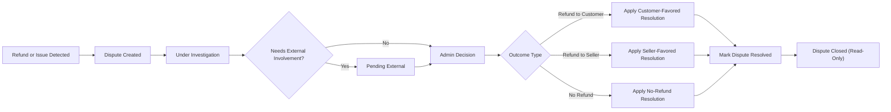

# Admin Operations and Governance Requirements (shoppingMall)

## 1. Introduction and Scope

This document defines the business-level requirements for administrative operations and governance in the **shoppingMall** e-commerce platform. It specifies **what** the system must support for platform administrators (**admin** actors) to manage users, sellers, catalog, orders, refunds, disputes, and platform-level governance. It deliberately does **not** specify technical implementation details such as APIs, database design, or infrastructure.

THE shoppingMall platform SHALL treat this document as the authoritative source of business rules for admin operations and governance.

Scope of this document:
- Administrative capabilities and constraints for the **admin** actor.
- Oversight of **customer**, **seller**, and **guestUser** behaviors from a governance perspective.
- Business rules for catalog moderation, order and refund intervention, dispute handling, monitoring, auditing, and policy enforcement.
- Governance, compliance, and risk-management expectations relevant to admin operations.

Out of scope:
- Low-level technical architecture, data models, or API contracts.
- Frontend UI layout, design, or interaction details.

This document is written for backend developers and related technical stakeholders who must implement server-side behavior consistent with the platform’s business governance needs.

## 2. Admin Actor and Responsibilities Overview

### 2.1 Admin Actor Definition

THE **admin** actor represents trusted staff operating the shoppingMall platform on behalf of the platform owner. Admins are responsible for:
- Supervising users (customers and sellers) and enforcing platform policies.
- Overseeing all products, categories, and SKUs published on the platform.
- Monitoring orders, cancellations, refunds, and disputes.
- Ensuring compliance with legal, regulatory, and internal policy requirements.
- Performing configuration and governance tasks that influence system-wide behavior.

Ubiquitous requirements:
- THE platform admin module SHALL allow authorized admins to perform only actions that align with their assigned responsibilities and permissions.
- THE platform SHALL record audit information for all impactful admin actions that change business-relevant data or user-facing outcomes.

### 2.2 Responsibility Areas

Admin responsibilities are grouped into the following areas:
- **User and seller management**: Account lifecycle, verification, blocking, and risk mitigation.
- **Catalog governance**: Category structure, product and SKU visibility, and compliance with content/product policies.
- **Order, refund, and dispute management**: Oversight of financially relevant flows and resolution of conflicts.
- **Monitoring and reporting**: Operational metrics, audit trails, and compliance reporting.
- **Governance, policy, and compliance controls**: Managing policies, roles, legal requests, and risk/fraud signals.

Each area is defined below in actionable EARS-style requirements.

## 3. Admin Management of Users and Sellers

### 3.1 Customer and User Lifecycle Management

#### 3.1.1 User search and inspection

- WHEN an admin needs to review a specific **customer** or **guestUser** account, THE admin module SHALL allow searching users by identifiers such as name, email, phone, and unique user ID in business terms.
- WHEN an admin views a user profile, THE system SHALL display core user information required for governance, including account status, registration date, seller linkage (if any), and summary of recent activity (for example number of orders, refund requests, disputes) without exposing unnecessary sensitive data beyond business needs.
- IF a user record is not found for the given search criteria, THEN THE system SHALL clearly indicate that no matching user exists and SHALL NOT reveal whether any similar identifiers exist to avoid information leakage.

#### 3.1.2 Account status management

Business states for user accounts include, at minimum: **active**, **suspended**, and **blocked**.

- THE system SHALL treat an **active** account as eligible to authenticate and perform actions allowed for its actor type.
- THE system SHALL treat a **suspended** account as temporarily limited according to suspension rules, typically unable to initiate new orders or reviews while keeping historical data accessible.
- THE system SHALL treat a **blocked** account as fully restricted from logging in and performing any new actions, while preserving previous records for audit.

Requirements:
- WHEN an admin changes a user’s account state, THE system SHALL require a structured reason category and an optional free-text note for audit and compliance.
- IF an admin attempts to set a user status to a state that is identical to the current state, THEN THE system SHALL either prevent the change or record no-op with a clear indication, to avoid misleading audit records.
- IF a user is in **blocked** state, THEN THE system SHALL prevent any new orders, wishlist changes, reviews, or messages initiated by that user.
- WHERE a user is in **suspended** state due to risk review, THE system SHALL allow admins to lift the suspension and revert the account to **active** with audit logging of the decision.

#### 3.1.3 Risk indicators and flags

- THE system SHALL support business-level risk indicators on user accounts, such as “high refund rate”, “chargeback history”, or “policy violation history”.
- WHEN an admin marks a user with a risk flag, THE system SHALL record the flag type, the admin identity, timestamp, and optional justification.
- WHERE a user has active risk flags, THE system SHALL surface these flags whenever admins view the user, related orders, or refund/dispute cases.
- IF a risk flag is removed, THEN THE system SHALL retain an audit trail of the previous presence of that flag and the removal event for compliance purposes.

### 3.2 Seller Lifecycle Management

#### 3.2.1 Seller onboarding and approval

- WHEN a **seller** registration is submitted, THE system SHALL mark the seller as **pending approval** until an admin completes required verification checks.
- WHERE seller verification requires documentation (for example business licenses or identity proofs), THE system SHALL allow admins to review the submitted information and record pass/fail decisions and comments.
- WHEN an admin approves a pending seller, THE system SHALL transition the seller status to **active** and allow the seller to publish and manage products.
- IF an admin rejects a seller, THEN THE system SHALL set the seller status to **rejected** and SHALL prevent seller access to seller-only features while retaining data for audit.

#### 3.2.2 Suspension and termination of sellers

- WHEN an admin identifies policy violations (for example selling prohibited goods or repeated order abuse), THE system SHALL allow the admin to set seller status to **suspended** or **terminated**, depending on policy severity.
- WHILE a seller is in **suspended** status, THE system SHALL prevent new product publications and new order acceptances for that seller but SHALL preserve existing orders through their defined lifecycle unless overridden by admin decisions.
- WHILE a seller is in **terminated** status, THE system SHALL prevent any seller login or seller-side operations and SHALL ensure that all associated products and SKUs are marked as unavailable for purchase.
- IF a suspended seller is reinstated to **active**, THEN THE system SHALL ensure that previously unpublished products remain unpublished unless explicitly re-enabled according to catalog rules.

#### 3.2.3 Seller performance and risk

- THE system SHALL maintain high-level performance indicators per seller (for example order defect rate, late shipment rate, refund ratio, dispute ratio) for use in governance decisions.
- WHEN an admin views a seller profile, THE system SHALL surface summary performance indicators with time windows relevant to policy (for example last 30 days and last 12 months).
- WHERE performance indicators exceed policy thresholds, THE system SHALL highlight this state visually in admin context and SHALL allow admins to apply sanctions (such as temporary suspension) according to business rules.

## 4. Admin Management of Products and Categories

### 4.1 Category Taxonomy Governance

#### 4.1.1 Category lifecycle

- THE system SHALL support a platform-wide category tree defining how products are organized for customers.
- WHEN an admin creates a new category, THE system SHALL require at minimum a category name, parent category (if any), and visibility status.
- WHEN an admin updates a category, THE system SHALL enforce rules that prevent circular category relationships and SHALL maintain the integrity of the category tree.
- WHEN an admin marks a category as **hidden** or **deprecated**, THE system SHALL prevent new products from being freshly assigned exclusively to this category while maintaining existing assignments for historical orders and until products are migrated.

#### 4.1.2 Category visibility and migration

- WHERE a category is marked as **hidden**, THE system SHALL ensure products in that category are not discoverable via category navigation for customers, unless they are accessible through other visible categories.
- WHEN an admin deprecates a category, THE system SHALL require specifying a replacement category or an explicit decision to leave affected products without category until sellers or admins reassign them.
- IF a category is deleted in a way that would orphan products, THEN THE system SHALL either prevent deletion or require explicit reassignment rules to ensure no product loses required classification according to policy.

### 4.2 Product and SKU Oversight

#### 4.2.1 Product moderation capabilities

- WHEN an admin reviews a product, THE system SHALL display seller identity, product information, SKUs, sales history summary, and relevant policy indicators (for example reports, complaints).
- THE system SHALL allow admins to search and filter products by seller, category, name, identifiers, and policy risk indicators.
- WHEN an admin identifies a product that violates content or product policies, THE system SHALL allow the admin to change product visibility status (for example set to **admin-unpublished** or **recalled**).
- WHILE a product is in **admin-unpublished** status, THE system SHALL prevent customers from adding it to cart or placing new orders for it, while preserving its presence in past orders.

#### 4.2.2 SKU-level controls

- THE system SHALL support SKU-level states (for example **active**, **out-of-stock**, **blocked-by-admin**).
- WHEN an admin marks a SKU as **blocked-by-admin**, THE system SHALL prevent that SKU from being purchased regardless of seller-configured inventory, and SHALL show a clear reason in admin views.
- WHERE only certain SKUs within a product violate policy (for example specific variant), THE system SHALL allow admins to act at SKU level without affecting other compliant SKUs, unless business rules require full product suspension.

#### 4.2.3 Prohibited items and restricted categories

- THE system SHALL support configuration of prohibited product types and restricted categories in business terms (for example drugs, weapons, counterfeit goods).
- WHEN a product is reported or detected as belonging to a prohibited type, THE system SHALL require prompt admin review and SHALL allow admins to immediately remove or hide the product and relevant SKUs from sale.
- IF an admin removes a product due to a serious policy violation, THEN THE system SHALL preserve all relevant data (product details, images, related orders, seller information) for audit and potential legal use, even if the product is no longer visible to customers.

## 5. Admin Management of Orders, Refunds, and Disputes

### 5.1 Order Oversight

#### 5.1.1 Order search and inspection

- THE system SHALL allow admins to search orders by order ID, customer identifier, seller identifier, date ranges, status, and other business filters such as high value or high risk.
- WHEN an admin opens an order detail, THE system SHALL present a consolidated view including customer, seller, products and SKUs, prices, discounts, taxes (if applicable), shipping data, payment status, shipment status, and any associated cancellation, refund, or dispute records.
- IF an order referenced by an admin search no longer exists (for example deleted due to legal retention limits), THEN THE system SHALL clearly indicate its absence and SHALL ensure that audit records of its prior existence remain traceable according to retention rules.

#### 5.1.2 Manual order status adjustments

- WHERE automated order flows fail or require manual correction (for example carrier data inconsistency), THE system SHALL allow admins to adjust order statuses within allowed transitions defined by business rules.
- WHEN an admin changes an order status manually, THE system SHALL require specifying the reason category and optional note, and SHALL record the previous and new status in the audit log.
- IF an admin attempts an order status change that violates defined business constraints (for example moving from **refunded** back to **paid**), THEN THE system SHALL prevent the change and SHALL explain that the transition is not permitted under governance rules.

### 5.2 Cancellation and Refund Governance

#### 5.2.1 Refund and cancellation hierarchy

- THE system SHALL recognize at least these actor roles in refund and cancellation flows: **customer**, **seller**, and **admin**.
- THE system SHALL allow customers and sellers to initiate and respond to cancellation and refund requests according to rules defined in separate requirements documents, and SHALL allow admins to intervene when necessary.

#### 5.2.2 Admin intervention in refunds

- WHEN a refund request escalates due to disagreement between customer and seller or breach of response timeframe, THE system SHALL allow admins to access the full case history including messages, evidence, and related order events.
- WHEN an admin decides the outcome of a refund case, THE system SHALL support decisions such as **approve refund**, **approve partial refund**, or **reject refund**, and SHALL record rationale and related evidence references.
- WHERE a refund is approved by admin, THE system SHALL enforce that order and payment statuses adopt the appropriate final states consistent with business rules (for example marking items as refunded and preventing duplicate refunds for the same item).
- IF an admin attempts to approve a refund that would exceed the total amount originally charged (taking into account prior refunds), THEN THE system SHALL prevent the action and SHALL provide a clear explanation.

#### 5.2.3 Time windows and SLAs

- THE system SHALL support configuration of business time windows (Service Level Agreements) for seller and admin responses to refund and cancellation requests.
- WHERE a seller fails to respond within the configured timeframe, THE system SHALL automatically escalate the case to admin review and SHALL flag the delay in both seller and admin views.
- WHEN admins handle escalated cases, THE system SHALL highlight whether SLAs were met or breached by each party, to support governance decisions.

### 5.3 Dispute Handling

#### 5.3.1 Dispute definition and states

For the purpose of admin governance, disputes are high-severity conflicts typically involving disagreement over refund decisions, alleged fraud, or policy violations.

- THE system SHALL treat a **dispute** as distinct from a standard refund request by including extra state and tracking information.
- THE system SHALL support dispute states such as **open**, **under-investigation**, **pending-external**, **resolved**, and **closed**.

#### 5.3.2 Admin dispute workflow

- WHEN a dispute is created (either directly by admin or automatically from a problematic refund case), THE system SHALL assign the dispute to appropriate admin queues or owners based on business rules.
- WHILE a dispute is in **under-investigation** state, THE system SHALL allow admins to collect and attach evidence notes, user communications, and external references.
- WHERE a dispute requires external authority or payment provider involvement, THE system SHALL support marking the dispute as **pending-external** and recording external reference identifiers.
- WHEN an admin resolves a dispute, THE system SHALL record the resolution type (for example refund in favor of customer, refund in favor of seller, no refund, account action), financial impact, and final reasoning.
- WHEN a dispute is marked **closed**, THE system SHALL prevent further modifications to core dispute fields while still allowing admins to add non-modifying comments for audit purposes.

#### 5.3.3 Notification and audit

- WHEN a dispute is created, updated in state, or resolved, THE system SHALL ensure that relevant parties (customer, seller, and internal stakeholders as configured) can be notified according to communication policies.
- THE system SHALL log every significant dispute action (creation, state changes, resolution decisions, related financial actions) in an audit trail accessible to authorized admins.

### 5.4 Dispute Lifecycle Diagram

## 6. Monitoring, Auditing, and Reporting

### 6.1 Operational Dashboards

#### 6.1.1 Key metrics

- THE system SHALL provide admins with high-level metrics such as total orders, gross merchandise volume, successful payment rate, refund rate, dispute count, and active sellers over configurable time periods.
- WHERE dashboards show aggregated metrics, THE system SHALL indicate the time window and last update time clearly so admins can interpret data freshness.
- WHEN admins filter dashboard views by seller, category, or time period, THE system SHALL update metric aggregations accordingly and SHALL respond within a business-acceptable timeframe (for example typically within a few seconds for common ranges).

### 6.2 Audit Logs and Traceability

#### 6.2.1 Actions to be logged

- THE system SHALL log admin actions that change important business data, including but not limited to:
  - User account status changes.
  - Seller status changes and verification decisions.
  - Product visibility and SKU blocking changes.
  - Order status overrides.
  - Refund and dispute decisions.
  - Policy configuration changes.
- THE system SHALL associate each audit log entry with the acting admin identity, timestamp, affected entity type and identifier, and summary of the change.

#### 6.2.2 Audit log access and retention

- WHERE audit logs contain sensitive information, THE system SHALL restrict access to authorized admins only and SHALL support business-level filters (by entity, by admin, by date range).
- THE system SHALL retain audit logs for at least the legally or contractually required period, as defined in nonfunctional and compliance requirements.
- IF an admin attempts to delete or alter audit log entries through normal admin features, THEN THE system SHALL prevent such actions to preserve integrity.

### 6.3 Reporting and Exports

#### 6.3.1 Business reporting

- THE system SHALL support generating business reports for finance (for example settlement amounts per seller and timeframe), operations (for example order volumes, fulfillment performance), and compliance (for example dispute and chargeback statistics).
- WHEN an admin requests a report for a specified time range and granularity, THE system SHALL generate the report and make it available for viewing or export.
- WHERE reports require processing of large data volumes, THE system SHALL allow asynchronous generation and SHALL notify admins when reports are ready according to platform communication policies.

#### 6.3.2 Sensitive data controls in exports

- THE system SHALL enforce business rules on which fields can be exported, especially for personally identifiable information and payment-related data, in line with privacy and compliance requirements.
- IF an admin without appropriate permissions attempts to generate a report that includes restricted data fields, THEN THE system SHALL deny the request and SHALL indicate that the requested data is restricted.

## 7. Governance, Policy, and Compliance Controls

### 7.1 Policy Management

#### 7.1.1 Policy catalog

- THE system SHALL support storage and reference of platform policies in business terms, including but not limited to product content policies, review guidelines, refund policies, and seller performance policies.
- WHEN a policy is updated, THE system SHALL record a new version with effective date and version identifier while preserving previous versions for reference and audit.

#### 7.1.2 Policy-driven behavior

- WHERE a policy defines specific thresholds or rules (for example the timeframe in which a customer can request refunds, or the acceptable seller defect rate), THE system SHALL allow configuration of these parameters so that admin decisions and automated checks can align with the current policy.
- WHEN a policy change affects ongoing orders or disputes, THE system SHALL clearly distinguish between actions governed by the old policy and actions governed by the new policy, by referencing effective dates in admin views.

### 7.2 Role Segregation and Admin Levels

Although technical role implementation is out of scope, from a business perspective there are distinct admin levels with different capabilities.

- THE system SHALL support at least logical differentiation between **super admin** (full platform governance), **operations admin** (day-to-day order, refund, and seller management), and **support admin** (customer support with limited power).
- WHERE a business action has high impact (for example permanent seller termination, irreversible data anonymization), THE system SHALL restrict such actions to **super admin** level according to business configuration.
- WHEN an operations or support admin attempts a restricted high-impact action, THE system SHALL deny the action and SHALL indicate that higher-level approval is required.

Example permission matrix (business-level, not technical):

| Action Category                            | Support Admin | Operations Admin | Super Admin |
|-------------------------------------------|---------------|------------------|------------|
| View customer profiles                     | ✅            | ✅               | ✅         |
| Change customer account status             | ❌            | ✅               | ✅         |
| Approve or reject sellers                  | ❌            | ✅               | ✅         |
| Terminate seller permanently               | ❌            | ❌               | ✅         |
| Change platform-wide policy thresholds     | ❌            | ❌               | ✅         |
| Adjust order status manually               | ❌            | ✅               | ✅         |
| Decide on escalated disputes               | ❌            | ✅               | ✅         |
| Access full audit log                      | ❌            | ✅               | ✅         |

### 7.3 Compliance and Legal Requests

#### 7.3.1 Data subject requests

- WHEN a customer or seller submits a data access or deletion request through supported channels, THE system SHALL allow admins to identify the account and see the status of such requests.
- WHERE law or policy requires providing a copy of personal data to the requester, THE system SHALL support generating a data package for the specific user, respecting redaction rules for internal-only information.
- IF a deletion request conflicts with retention requirements (for example due to open disputes or legal holds), THEN THE system SHALL indicate that full deletion is not currently possible and SHALL support marking the request as partially fulfilled with justification.

#### 7.3.2 Legal hold and investigations

- WHEN a legal hold is placed on a user, seller, product, or order, THE system SHALL ensure that related records are not deleted or anonymized until the hold is removed.
- THE system SHALL surface legal hold flags in relevant admin views so that admins understand why certain data cannot be modified or deleted.

### 7.4 Risk and Fraud Management Interactions

- THE system SHALL allow risk or fraud detection components (whether manual or automated) to create risk flags and cases visible to admins.
- WHEN an admin reviews a risk case, THE system SHALL display related users, sellers, orders, payments, and any pattern indicators (for example multiple accounts using same payment instrument).
- WHERE risk cases are escalated to a formal dispute or require account action, THE system SHALL allow admins to perform status changes, apply sanctions, or open disputes in line with configured policies.

## 8. Performance and Reliability Expectations for Admin Functions

- THE system SHALL provide typical admin page responses, including common searches and detail views, within a few seconds under normal loads, such that admin operations remain practical during business hours.
- WHERE operations involve heavy processing (for example large report generation), THE system SHALL allow asynchronous handling and background completion with clear status feedback to admins.
- THE system SHALL design business processes so that critical admin functions (such as viewing live orders and handling disputes) remain available during most of the platform’s operating hours, according to availability expectations defined in nonfunctional requirements.

## 9. Summary of Key Business Governance Rules

- THE system SHALL ensure that only authorized admins can perform governance actions and that all such actions are auditable.
- THE system SHALL enforce clear account states for users and sellers, with predictable effects on their capabilities.
- THE system SHALL provide admins with comprehensive but controlled views of orders, refunds, and disputes to make informed decisions.
- THE system SHALL support policy-driven thresholds and rules that can be updated over time without changing business records retroactively.
- THE system SHALL treat disputes and high-risk cases as first-class entities with dedicated tracking, evidence, and resolution workflows.
- THE system SHALL provide sufficient monitoring, audit, and reporting capabilities to support operational excellence, fraud management, and legal or regulatory compliance.

This document specifies business requirements only. All technical implementation details, including specific architectures, APIs, data storage strategies, and frontend behavior, are at the discretion of the development team, provided that the resulting system behavior satisfies the requirements described above.