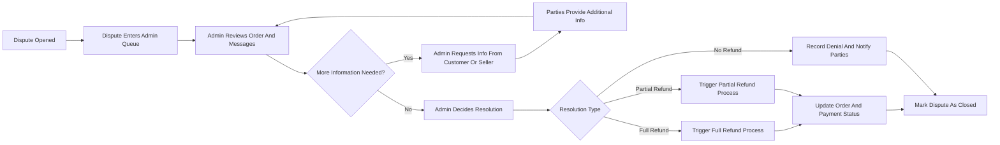
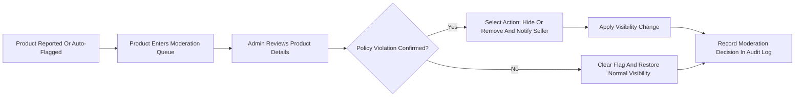

# Admin Operations and Moderation Requirements for shoppingMall Platform

## 1. Introduction

### 1.1 Purpose
The admin operations and moderation specification defines what the **platformAdmin** actor must be able to do in the **shoppingMall** multi-seller e-commerce platform. The focus is on business behavior only: which administrative controls exist, how they are constrained, and what auditability is required. No technical implementation details, APIs, schemas, or UI layouts are specified.

### 1.2 Scope
The scope covers administrative responsibilities across these domains:
- Customer and seller account lifecycle and status management.
- Catalog and content moderation (products, categories, reviews, and ratings).
- Oversight and intervention in orders, payments, cancellations, refunds, and disputes.
- Access to operational dashboards, reporting, and audit logs.
- Guardrails that limit admin powers and ensure traceability of all impactful actions.

Out of scope:
- Low-level technical design (endpoints, protocols, database schema).
- Non-admin user journeys (covered in other documents).
- Frontend layout and interaction design for the admin dashboard.

### 1.3 Relationship to Other Documents
- User roles and permissions are defined in **User Actors and Permissions Requirements**.
- Authentication behavior and security expectations are defined in **Authentication and Session Requirements**.
- Order, payment, inventory, and review flows are defined in their respective domain requirement documents.
- Non-functional expectations and compliance constraints are defined in **Nonfunctional and Compliance Requirements**.

## 2. Admin Role and Governance Principles

### 2.1 Admin Role Definition

- THE shoppingMall platform SHALL define **platformAdmin** as the actor responsible for operating the marketplace, enforcing policies, and resolving cross-party issues.
- THE shoppingMall platform SHALL treat platformAdmin as an authenticated role with elevated privileges compared to customer and seller, but constrained by business rules and audit requirements.

### 2.2 Governance Principles

- THE admin dashboard SHALL implement the **least privilege principle**, so that each platformAdmin receives only the administrative capabilities required for their responsibilities.
- THE admin dashboard SHALL separate **read-only monitoring views** from **state-changing admin actions** to reduce accidental changes.
- WHEN a platformAdmin performs a state-changing action that affects users, sellers, products, orders, payments, refunds, inventory, or reviews, THE admin dashboard SHALL require explicit confirmation for high-impact changes, as defined in guardrail sections.
- THE admin dashboard SHALL record all state-changing admin actions in an immutable audit trail that identifies the acting admin and the affected entities.

## 3. Admin Dashboard Overview

### 3.1 Core Functional Areas

- THE admin dashboard SHALL provide access-controlled navigation to at least the following functional areas:
  - Customer management.
  - Seller management and onboarding.
  - Catalog and category management.
  - Review and rating moderation.
  - Orders, cancellations, refunds, and disputes oversight.
  - Inventory and fulfillment monitoring (read-focused, with limited override actions).
  - Audit log and security event inspection.
  - Operational dashboards and business reporting.

- WHEN a platformAdmin logs into the admin dashboard, THE admin dashboard SHALL present an overview of key indicators such as counts of active customers, active sellers, active products, orders by status, open disputes, pending refund requests, and flagged content.

### 3.2 Access Control for Admin Features

- WHEN a platformAdmin attempts to access an admin dashboard feature, THE shoppingMall authorization subsystem SHALL validate that the admin has the specific permission set required for that feature.
- IF a platformAdmin lacks permission for a requested admin feature, THEN THE admin dashboard SHALL deny access and SHALL indicate that the action is not permitted for that admin role.

## 4. Customer Account Management

### 4.1 Customer Search and Inspection

- WHEN a platformAdmin searches customer accounts by criteria such as email, name, user identifier, registration date range, or status, THE admin dashboard SHALL return a list of matching customers including key non-sensitive attributes: user identifier, registration date, account status, and summary order statistics.
- WHEN a platformAdmin opens a customer detail view, THE admin dashboard SHALL display customer profile information (such as name, masked contact details), account status, address list, order count, recent orders, review count, and any fraud or abuse flags.

### 4.2 Customer Status Changes

- THE shoppingMall platform SHALL support at least these customer statuses from the admin perspective: **active**, **suspended**, and **closed**.
- WHEN a platformAdmin changes a customer status from active to suspended, THE shoppingMall platform SHALL require the admin to provide a reason category (for example, suspected fraud, abuse, policy violation, repeated chargebacks) and an optional free-text note.
- WHEN a customer is in suspended status, THE shoppingMall platform SHALL prevent that customer from placing new orders, submitting new reviews, or creating new seller applications, while allowing access to existing order history and legal documents where required by policy.
- WHEN a platformAdmin changes a customer status from suspended to active, THE shoppingMall platform SHALL restore all customer capabilities permitted by customer role.
- WHEN a platformAdmin changes a customer status to closed, THE shoppingMall platform SHALL prevent future logins for that account and SHALL trigger the data retention and anonymization behavior defined in privacy requirements.

### 4.3 Customer Fraud and Risk Flags

- WHEN a platformAdmin or automated risk system flags a customer account as **high risk** or **fraud-suspected**, THE admin dashboard SHALL display the flag, associated evidence, and related events (such as excessive chargebacks or abuse reports) in the customer detail view.
- WHEN a customer is marked as high risk, THE shoppingMall platform SHALL allow platformAdmin to apply additional restrictions such as limiting order value, requiring manual review of refunds, or blocking review creation, according to configured risk policies.

## 5. Seller Account and Store Management

### 5.1 Seller Onboarding Review

- WHEN a seller application is submitted, THE admin dashboard SHALL present the application to platformAdmin with the seller’s declared business identity, contact data, category preferences, and any uploaded documents.
- WHEN a platformAdmin approves a seller application, THE shoppingMall platform SHALL convert the applicant to an active seller actor linked to a seller entity and SHALL grant seller-level product and order capabilities.
- WHEN a platformAdmin rejects a seller application, THE shoppingMall platform SHALL record the rejection with a reason and SHALL ensure that the applicant cannot perform seller actions with that application.

### 5.2 Seller Status Management

- THE shoppingMall platform SHALL support at least these seller statuses: **pending**, **active**, **suspended**, and **terminated**.
- WHEN a seller status is set to suspended by platformAdmin, THE shoppingMall platform SHALL:
  - Prevent the seller from creating new products or SKUs.
  - Prevent the seller from updating existing products except where required to fulfill existing orders (for example, adding tracking numbers where allowed by policy).
  - Hide the seller’s products from new purchases while preserving access for existing orders and admin views.
- WHEN a seller status is set to terminated, THE shoppingMall platform SHALL prevent any new logins for that seller account and SHALL treat all seller products as non-purchasable, while retaining historical order data for compliance.
- WHEN a seller status changes, THE admin dashboard SHALL record the acting admin, the previous status, the new status, and a reason category in the audit log.

### 5.3 Seller Performance and Compliance Monitoring

- WHEN a platformAdmin inspects a seller, THE admin dashboard SHALL display performance indicators such as order volume, cancellation rates, refund rates, average delivery times, review ratings, and counts of policy violations.
- IF seller performance metrics exceed configurable thresholds (for example, high cancellation rate, high share of low-rated reviews), THEN THE admin dashboard SHALL highlight this seller as needing attention and SHALL allow platformAdmin to take policy actions such as issuing warnings or suspending the seller.

### 5.4 Restrictions on Admin Impersonation

- WHERE the platform supports admin impersonation of sellers or customers, THE shoppingMall platform SHALL restrict impersonation to read-only support scenarios unless strong business justification is configured.
- WHEN a platformAdmin impersonates a customer or seller to troubleshoot an issue, THE shoppingMall platform SHALL record the impersonation event in the audit log including the acting admin, impersonated account, time period, and high-level purpose.

## 6. Catalog and Category Management

### 6.1 Product Visibility and Policy Enforcement

- WHEN a platformAdmin views a product, THE admin dashboard SHALL show seller identity, categories, product status (draft, active, inactive, discontinued), policy flags (for example, age restriction, compliance issues), and SKU summary.
- WHEN a platformAdmin sets a product visibility status to hidden, THE shoppingMall platform SHALL remove the product from customer-facing search and listings and SHALL prevent new orders for any SKUs under that product, while preserving product data for existing orders and admin review.
- WHEN a platformAdmin permanently removes a product from sale due to severe policy violations, THE shoppingMall platform SHALL set the product to discontinued and hidden states and SHALL record that the removal was due to policy enforcement, while keeping product data for audit.
- WHEN a platformAdmin restores a previously hidden or policy-blocked product to active visibility, THE shoppingMall platform SHALL make the product purchasable again subject to stock and seller status, and SHALL log the restoration action.

### 6.2 Category Tree Administration

- THE admin dashboard SHALL allow platformAdmin to create, update, reorder, and deactivate categories and subcategories.
- WHEN a category is deactivated by platformAdmin, THE shoppingMall platform SHALL hide that category from customer-facing navigation and SHALL prevent new product assignments to that category, while keeping existing assignments visible in admin tools.
- WHEN a category is renamed or repositioned in the hierarchy, THE shoppingMall platform SHALL update navigation structures and SHALL preserve links between products and categories.

### 6.3 Admin Oversight of SKU-Level Issues

- WHEN a platformAdmin views a product’s SKUs, THE admin dashboard SHALL present SKU-level attributes such as code, variant options, price, status, and stock indicators.
- WHERE inventory anomalies are detected (for example, negative stock, frequent overselling), THE admin dashboard SHALL highlight affected SKUs and SHALL allow platformAdmin to flag them for seller correction or to temporarily prevent new sales.
- WHEN a platformAdmin temporarily blocks a SKU from being sold (for example, due to suspected mislabeling or safety concerns), THE shoppingMall platform SHALL mark the SKU as admin-blocked and SHALL prevent it from being added to carts or orders until unblocked.

## 7. Review and Rating Moderation

### 7.1 Moderation Queue and Filtering

- WHEN reviews are reported by customers or sellers or automatically flagged by rules, THE admin dashboard SHALL display them in a moderation queue showing product, seller, author, rating, content snippet, and report reason(s).
- THE admin dashboard SHALL allow platformAdmin to filter the moderation queue by product, seller, rating, number of reports, moderation state, and time period.

### 7.2 Moderation Actions

- WHEN a platformAdmin inspects a review, THE admin dashboard SHALL show full review content, rating, author, purchase evidence, report history, and current moderation state.
- WHEN a platformAdmin approves a pending or reported review, THE shoppingMall platform SHALL mark the review as approved, ensure it is visible according to product visibility rules, and include it in rating aggregation.
- WHEN a platformAdmin hides or removes a review, THE shoppingMall platform SHALL mark the review as non-public, exclude it from rating aggregation, and record the moderation decision and reason.
- WHEN a platformAdmin redacts sensitive data (for example, personal contact information) from a review, THE shoppingMall platform SHALL store a non-public original copy for audit and SHALL expose a sanitized version for public display.

### 7.3 Blocking Abusive Review Authors

- WHEN a customer repeatedly posts reviews that violate content policies, THE admin dashboard SHALL allow platformAdmin to block that customer from creating new reviews while leaving other purchasing capabilities intact unless broader account sanctions are applied.
- WHEN a customer is blocked from reviewing, THE shoppingMall platform SHALL enforce the block across all review creation flows and SHALL log any further attempts by that customer to create reviews.

## 8. Orders, Cancellations, Refunds, and Disputes Oversight

### 8.1 Order Search and Inspection

- THE admin dashboard SHALL allow platformAdmin to search orders by order identifier, customer, seller, payment status, order status, date range, and dispute status.
- WHEN a platformAdmin views an order, THE admin dashboard SHALL display line items with SKUs, sellers, quantities, prices, shipping details, payment status, refund history, and any associated cancellation or dispute records.

### 8.2 Admin Intervention in Orders

- WHEN a customer or seller submits a cancellation request that requires admin decision according to business rules, THE admin dashboard SHALL show the request in a dedicated queue with context: order status, payment status, fulfillment progress, and reason.
- WHEN a platformAdmin approves a cancellation request, THE shoppingMall platform SHALL:
  - Update the order and line-item statuses to canceled for the approved scope.
  - Trigger inventory adjustments according to inventory rules.
  - Trigger payment void or refund initiation for affected amounts according to payment and refund requirements.
- WHEN a platformAdmin rejects a cancellation request, THE shoppingMall platform SHALL record the decision and reason and SHALL notify involved parties through appropriate channels.

### 8.3 Admin-Controlled Refunds

- WHEN a platformAdmin decides to initiate a manual refund (full or partial) for an order, THE shoppingMall platform SHALL require the admin to specify the refund amount, scope (items and fees), and reason category.
- WHEN a manual refund is initiated, THE shoppingMall platform SHALL:
  - Request a refund transaction from the payment provider.
  - Update the order’s payment status to partially refunded or refunded when confirmations arrive.
  - Record the refund event and the acting admin in the audit log.
- IF a refund attempt fails at the payment provider, THEN THE shoppingMall platform SHALL mark the refund as failed, SHALL keep the order’s payment status unchanged, and SHALL present the failure in the admin view for follow-up.

### 8.4 Dispute Resolution Between Customers and Sellers

- WHEN a customer opens a dispute about an order (for example, non-delivery, damaged goods, incorrect items), THE shoppingMall platform SHALL create a dispute record linked to the order, customer, and relevant seller(s).
- WHEN a platformAdmin reviews a dispute, THE admin dashboard SHALL present all relevant information: order details, shipment events, messages between parties (if supported), previous refunds or cancellations, and supporting evidence.
- WHEN a platformAdmin decides a dispute in favor of the customer, THE shoppingMall platform SHALL apply the chosen resolution: refund, partial refund, replacement order creation, or other compensation as defined by business policy, and SHALL notify customer and seller.
- WHEN a platformAdmin decides a dispute in favor of the seller, THE shoppingMall platform SHALL record the decision, SHALL notify the customer of the outcome, and SHALL keep the order state unchanged unless another resolution action is applied.
- WHEN a dispute is closed, THE shoppingMall platform SHALL set the dispute status to a terminal state (for example, resolved-customer, resolved-seller, or resolved-compromise) and SHALL prevent further changes without creating a new dispute or appeal.

### 8.5 Chargebacks and External Disputes

- WHEN the payment provider notifies the platform of a chargeback, THE shoppingMall platform SHALL create or update a dispute record and SHALL mark the related order and payment as involved in a chargeback.
- WHEN a platformAdmin reviews a chargeback, THE admin dashboard SHALL show provider-provided details and internal context, and SHALL allow the admin to record the platform’s response (for example, contest or accept).

## 9. Inventory and Fulfillment Monitoring (Admin Perspective)

### 9.1 Monitoring Stock Health

- THE admin dashboard SHALL present high-level inventory health indicators such as counts of SKUs with low stock, frequent stockouts, and backorder backlogs per seller.
- WHEN a platformAdmin selects a seller or product for inventory analysis, THE admin dashboard SHALL show recent inventory changes, order-related deductions, cancellations, and returns for that seller or product.

### 9.2 Limited Admin Adjustments

- WHERE business policy allows inventory corrections by platformAdmin, THE shoppingMall platform SHALL allow admin-initiated on-hand quantity adjustments while requiring a reason and storing previous and new values in audit logs.
- WHEN a platformAdmin overrides fulfillment status for an order line (for example, marking it as delivered after carrier confirmation), THE shoppingMall platform SHALL record the override with acting admin and justification and SHALL keep the original event history available for audit.

## 10. Audit and Reporting

### 10.1 Audit Log Requirements

- THE shoppingMall platform SHALL create an audit record for every state-changing admin operation, including user and seller status changes, product visibility changes, order and refund decisions, inventory adjustments, and review moderation actions.
- EACH audit record SHALL include at minimum: timestamp, acting admin identity, action type, target entity type, target entity identifier, previous state snapshot (where applicable), new state snapshot (where applicable), and a reason or note.
- THE admin dashboard SHALL provide read-only access to audit logs for authorized admin roles and SHALL not allow editing or deletion of existing audit records through the admin UI.

### 10.2 Operational Dashboards and KPIs

- THE admin dashboard SHALL display key operational metrics such as:
  - Active customers and sellers.
  - New registrations (customers and sellers) over recent periods.
  - Order volumes by status.
  - Cancellation and refund rates by reason category.
  - Dispute counts, average resolution times, and outcomes.
  - Review volume and proportions of moderated or removed reviews.
- WHEN a platformAdmin drills down into a metric, THE admin dashboard SHALL present underlying lists of entities (for example, orders or sellers) that contribute to that metric, subject to role-based access constraints.

### 10.3 Reporting and Export

- WHERE business requires data export for compliance, accounting, or BI, THE shoppingMall platform SHALL allow platformAdmin to export aggregated or detailed data about orders, refunds, payouts, and disputes in a non-proprietary file format.
- WHEN a report is generated or exported, THE shoppingMall platform SHALL log the report generation event with the acting admin, report type, time, and parameters used.

## 11. Guardrails and Safety Constraints for Admin Actions

### 11.1 High-Risk Operations

- WHEN a platformAdmin initiates a high-risk operation such as permanent account termination, irreversible product removal, bulk seller suspension, or irreversible data anonymization, THE admin dashboard SHALL show a clear warning summarizing the consequences and SHALL require explicit confirmation.
- WHERE a safer reversible alternative exists (such as suspension instead of permanent deletion), THE shoppingMall platform SHALL encourage or default to the reversible action in business flows.

### 11.2 Bulk Actions

- WHEN a platformAdmin performs bulk operations (for example, suspending multiple sellers, hiding multiple products, or approving many reviews at once), THE shoppingMall platform SHALL present a summary of the targets and SHALL require confirmation before applying the bulk change.
- WHEN a bulk operation completes, THE shoppingMall platform SHALL create either a single aggregated audit entry referencing all affected entities or separate entries per entity, as long as each affected entity can be traced.

### 11.3 Conflict Resolution

- IF two platformAdmin actors attempt conflicting actions on the same entity in overlapping time windows (for example, one approving a refund while another rejects it), THEN THE shoppingMall platform SHALL apply a deterministic conflict resolution strategy defined in business rules, SHALL record which decision prevailed, and SHALL log both attempts in the audit trail.
- WHEN a platformAdmin overrides a seller or automated decision (for example, granting a refund that a seller denied), THE shoppingMall platform SHALL record the override as a distinct action linked to the original decision.

## 12. Performance Expectations for Admin Features

- WHILE the platform operates under normal load, THE admin dashboard SHALL respond to typical search, filter, and detail view operations within the response time targets defined in nonfunctional requirements (for example, within 1.5 seconds for 95% of admin read operations).
- WHEN platformAdmin performs state-changing actions, THE shoppingMall platform SHALL enforce those changes in underlying business behavior (for example, visibility, permissions, or order states) within a short delay that is acceptable for near-real-time operations (for example, within 5 seconds).

## 13. Mermaid Diagrams

### 13.1 Admin Dispute Resolution Flow

### 13.2 Admin Product Moderation Flow

## 14. Success Criteria

- THE admin dashboard SHALL enable platformAdmin to detect and mitigate fraud, abuse, and policy violations while preserving fair treatment of customers and sellers.
- THE shoppingMall platform SHALL ensure that every impactful admin action is auditable and reversible where business policy allows.
- THE shoppingMall platform SHALL provide sufficient admin capabilities to keep the marketplace safe, compliant, and operationally efficient without exposing sensitive internal details or violating privacy requirements.