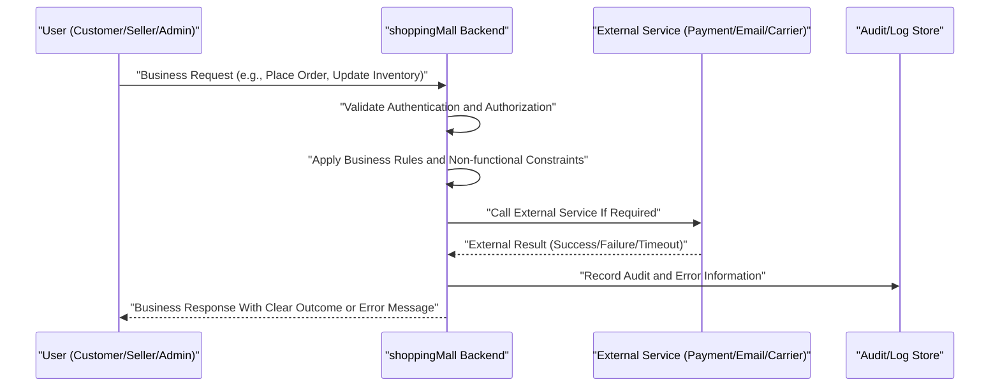

# Non-functional and Compliance Requirements – shoppingMall

## 1. Introduction and Scope

This specification defines the cross-cutting non-functional and compliance requirements for the **shoppingMall** e-commerce backend platform. It expresses business expectations for performance, scalability, security, privacy, auditability, and regulatory behavior that apply consistently across all functional domains, including:

- User authentication and sessions.
- Product catalog and search.
- Cart, checkout, orders, and payments.
- Inventory and fulfillment.
- Reviews and ratings.
- Admin operations and moderation.

THE shoppingMall backend SHALL satisfy these requirements while leaving all technical implementation decisions (frameworks, infrastructure, storage mechanisms, and API styles) to the development team.

## 2. Performance and Scalability Expectations

### 2.1 General Performance Principles

- THE shoppingMall backend SHALL aim to provide response times that feel immediate to users for routine operations under normal load.
- THE shoppingMall backend SHALL prioritize the responsiveness of customer-facing flows (catalog browsing, cart, checkout, and order tracking) over non-critical background or reporting tasks during peak load.

### 2.2 Response Time Targets

Response times are defined as server-side processing time from when a valid request reaches the backend until the backend sends a response, excluding end-user network conditions and frontend rendering.

#### 2.2.1 Read Operations

- WHEN a guestUser or customer requests a **product list** (category listing or search results), THE shoppingMall backend SHALL return the first page of results within **500 ms** for at least **95%** of such requests under normal load.
- WHEN a guestUser or customer requests **product details**, THE shoppingMall backend SHALL provide product information, variant options, stock status, and summary rating within **600 ms** for at least **95%** of such requests under normal load.
- WHEN a customer requests their **cart** or **wishlist** contents, THE shoppingMall backend SHALL respond within **800 ms** for at least **95%** of such requests under normal load.
- WHEN a customer requests their **order history** or a specific order’s details, THE shoppingMall backend SHALL respond within **800 ms** for at least **95%** of such requests under normal load.
- WHEN a seller requests a **product or inventory list** for their store, THE shoppingMall backend SHALL respond within **1000 ms** for at least **95%** of such requests under normal load.
- WHEN a platformAdmin performs a **search** over users, sellers, products, or orders in the admin dashboard, THE shoppingMall backend SHALL respond within **1500 ms** for at least **95%** of such requests under normal load.

#### 2.2.2 Write Operations (Non-payment)

- WHEN a customer updates **profile or address data**, THE shoppingMall backend SHALL complete the update and respond within **1000 ms** for at least **95%** of such requests under normal load.
- WHEN a customer adds, updates, or removes **cart items**, THE shoppingMall backend SHALL update the cart and totals within **800 ms** for at least **95%** of such requests under normal load.
- WHEN a customer adds or removes **wishlist items**, THE shoppingMall backend SHALL process the change within **800 ms** for at least **95%** of such requests under normal load.
- WHEN a seller creates or updates **products** or **SKUs**, THE shoppingMall backend SHALL confirm the change within **1500 ms** for at least **95%** of such requests under normal load.
- WHEN a seller updates **inventory quantities** for a SKU, THE shoppingMall backend SHALL record the change and make it visible to subsequent availability checks within **5 seconds**.
- WHEN a seller updates **fulfillment or shipping status** for order lines, THE shoppingMall backend SHALL persist the update and expose it to customers within **1000 ms** for at least **95%** of such requests under normal load.

#### 2.2.3 Checkout, Payment, and Order Creation

- WHEN a customer initiates **checkout**, THE shoppingMall backend SHALL validate the cart and prepare an order summary (items, prices, discounts, shipping fees, taxes) within **1000 ms** for at least **95%** of such attempts under normal load.
- WHEN a customer confirms **order placement** (excluding external payment), THE shoppingMall backend SHALL create the order, apply stock reservations, and respond with order confirmation details within **1500 ms** for at least **95%** of such requests under normal load.
- WHEN a customer submits a **payment request** through an external provider, THE shoppingMall backend SHALL either:
  - Receive a success or failure response and reply to the customer within **10 seconds**, or
  - Indicate that payment status is pending and that the system will update the order once the provider response is received.

### 2.3 Throughput and Concurrency

- THE shoppingMall backend SHALL support at least **100 concurrent active customer sessions** performing typical browsing and cart operations without breaching the defined response time thresholds under normal load.
- THE shoppingMall backend SHALL support at least **20 concurrent checkout or payment flows** without breaching the defined response time thresholds for order and payment operations under normal load.
- THE shoppingMall backend SHALL support at least **50 concurrent seller sessions** performing catalog and inventory operations without breaching the defined response time thresholds under normal load.
- THE shoppingMall backend SHALL be designed such that these baseline concurrency levels can be increased by at least a factor of **5** through capacity changes or scaling decisions without requiring redesign of documented business processes.

### 2.4 Availability and Reliability

- THE shoppingMall backend SHALL target an average monthly availability of at least **99.5%** for core customer-facing operations (authentication, catalog browsing, cart, checkout, payments, and order tracking), excluding pre-announced maintenance windows.
- WHILE the backend is in a planned maintenance window, THE shoppingMall backend SHALL, where feasible, keep read-only access to order history and catalog views available, even if write operations are temporarily disabled.
- IF a non-critical subsystem (for example, analytics or reporting) fails, THEN THE shoppingMall backend SHALL continue to process core customer and seller flows (authentication, orders, payments, inventory updates) and SHALL fail only the affected non-critical operations.

### 2.5 Degradation Behavior Under Peak Load

- WHILE the platform experiences load above planned peak thresholds, THE shoppingMall backend SHALL prioritize:
  1. Checkout and payment processing.
  2. Cart operations.
  3. Authentication and session validation.
  4. Catalog browsing and order tracking.
  ahead of low-priority tasks such as heavy reports or background exports.
- IF resource constraints require temporary limits, THEN THE shoppingMall backend SHALL defer or reject non-critical operations (such as large ad-hoc admin reports) with clear messages rather than slowing down core customer flows.

## 3. Security and Data Protection Requirements

### 3.1 Security Principles

- THE shoppingMall backend SHALL enforce **least privilege** for all actors and internal components: each actor SHALL have access only to the minimal data and actions required for their role.
- THE shoppingMall backend SHALL use **defense in depth**, meaning critical operations (such as payments, refunds, role changes, or product visibility changes) SHALL be protected by multiple checks (authentication, authorization, and business validation).
- THE shoppingMall backend SHALL treat all data received from external actors as untrusted until validated against business rules.

### 3.2 Authentication and Authorization

- WHEN any actor (customer, seller, platformAdmin) attempts a sensitive action (such as placing an order, changing password, updating inventory, issuing refunds, or changing product visibility), THE shoppingMall backend SHALL require a valid authenticated session consistent with the authentication requirements.
- WHEN any actor attempts to access resources owned by another actor (for example, a customer requesting another customer’s order, a seller requesting another seller’s SKU, or a non-admin requesting admin reports), THE shoppingMall backend SHALL deny access and SHALL avoid confirming whether such resources exist.
- WHEN a session or token is marked as revoked, expired, or compromised, THE shoppingMall backend SHALL refuse to accept it for any action that requires authentication.

### 3.3 Protection of Data in Transit and at Rest (Business View)

- THE shoppingMall backend SHALL ensure that all communications carrying personal data, authentication tokens, or payment-related identifiers use secure, encrypted channels in transit.
- THE shoppingMall backend SHALL ensure that stored secrets such as passwords, long-lived tokens, and third-party integration keys are protected using secure storage mechanisms that prevent direct reading by unauthorized actors.
- THE shoppingMall backend SHALL avoid storing raw payment card data or similar highly sensitive financial data and instead SHALL rely on tokens or references from payment providers.

### 3.4 Sensitive Data Handling Rules

- THE shoppingMall backend SHALL treat the following as sensitive data: passwords, authentication tokens, email addresses, phone numbers, physical addresses, order histories, payment provider identifiers, and government-issued identifiers where collected.
- IF logs, analytics events, or error traces are generated, THEN THE shoppingMall backend SHALL prevent sensitive data from being included as plain text in those artifacts.
- WHEN exports or reports are prepared for internal staff, THE shoppingMall backend SHALL minimize the inclusion of sensitive data and SHALL mask or pseudonymize it where full values are not strictly required.

### 3.5 Security Event Detection

- WHEN multiple failed login attempts are detected for the same account within a short configurable interval, THE shoppingMall backend SHALL apply protective measures such as temporary lockout, step-up verification, or throttling, according to business policy.
- WHEN abnormal patterns are detected, such as many failed payments from the same account or repeated password reset attempts, THE shoppingMall backend SHALL flag the activity for review by platformAdmin and SHALL be able to apply additional restrictions to affected accounts.
- WHEN critical account details such as password, primary email, or seller payout details are changed, THE shoppingMall backend SHALL record the event as security-sensitive in audit logs and SHALL support optional alerts to the affected user.

## 4. Privacy and Data Retention

### 4.1 Privacy Principles

- THE shoppingMall backend SHALL practice **data minimization** by collecting only data necessary for account management, order fulfillment, legal compliance, fraud prevention, and customer support.
- THE shoppingMall backend SHALL practice **purpose limitation**, meaning personal data SHALL be used only for clearly defined purposes, such as fulfilling orders, processing payments, handling disputes, and sending communications authorized by the user.
- THE shoppingMall backend SHALL support **user control** over specific personal data elements, including address entries and marketing consent preferences.

### 4.2 Data Categories and Retention Periods

- THE shoppingMall backend SHALL classify stored information into at least these categories: identity and profile data, addresses, order and payment records, inventory and catalog data, review content, support or dispute records, and system or security logs.
- THE shoppingMall backend SHALL retain **order and payment records** for at least **5 years** or a configurable minimum period aligned with accounting and legal requirements.
- THE shoppingMall backend SHALL retain **security and audit logs** for at least **1 year** by default, with the ability to extend retention based on regulatory needs.
- THE shoppingMall backend SHALL allow shorter retention periods (for example **30 days to 2 years**) for transient data such as guest carts, non-critical logs, and ephemeral analytics, where not constrained by law or business policy.
- WHEN a user deletes an address from their address book, THE shoppingMall backend SHALL remove it from active profile use while preserving any snapshots required for existing order records that used that address.

### 4.3 User Rights

- WHEN a customer or seller requests **account closure**, THE shoppingMall backend SHALL:
  - Prevent further logins for that account.
  - Retain order, payment, and refund history as required by law and accounting rules.
  - Remove or anonymize other personal identifiers that are no longer needed for legitimate purposes.
- WHEN a user requests **access to their personal data**, THE shoppingMall backend SHALL provide a comprehensive export of core account data in human-readable form, including profile information, addresses, and order summaries, excluding internal security logs and confidential risk-scoring data.
- WHEN a user updates **marketing communication preferences**, THE shoppingMall backend SHALL store the new preference and SHALL ensure that any process responsible for sending marketing communications consults this stored preference.

### 4.4 Anonymization and Pseudonymization

- WHEN an account is closed or deleted, THE shoppingMall backend SHALL pseudonymize or anonymize personal data in historical records wherever possible, while preserving data necessary for financial reporting, dispute resolution, or fraud investigation.
- WHERE analytics or business intelligence require long-term behavioral data, THE shoppingMall backend SHALL support analysis based on anonymized or pseudonymized identifiers, avoiding the use of direct personal identifiers when not required.

## 5. Auditability and Logging

### 5.1 Audit Objectives

- THE shoppingMall backend SHALL maintain an audit trail sufficient to reconstruct key business events and user actions relevant to orders, payments, refunds, inventory changes, reviews, account status changes, and admin interventions.
- THE shoppingMall backend SHALL ensure that audit data can be used by authorized personnel to investigate fraud, disputes, security incidents, and operational problems.

### 5.2 Events to be Logged (Business View)

- Authentication and sessions:
  - WHEN a login attempt occurs (successful or failed), THE shoppingMall backend SHALL log the event with timestamp, actor type, and high-level outcome.
  - WHEN a token refresh, logout, or bulk session revocation occurs, THE shoppingMall backend SHALL log the event with timestamp and actor identity.
- Account changes:
  - WHEN a customer, seller, or platformAdmin updates core profile attributes (such as name, primary contact details), THE shoppingMall backend SHALL log the change with old and new values represented at an appropriate level for later review.
  - WHEN roles or permissions for seller or platformAdmin accounts are changed, THE shoppingMall backend SHALL log who made the change, what changed, and when.
- Orders and payments:
  - WHEN an order is created, updated, cancelled, or delivered, THE shoppingMall backend SHALL log the key state transitions with timestamps and responsible actors.
  - WHEN a payment attempt succeeds or fails, THE shoppingMall backend SHALL log the attempt, including a non-sensitive reference to the payment provider transaction and high-level result.
  - WHEN a refund or chargeback is initiated, updated, or completed, THE shoppingMall backend SHALL log the event with amounts, timestamps, and responsible actors.
- Inventory and catalog:
  - WHEN products or SKUs are created, modified, or deactivated, THE shoppingMall backend SHALL log the actor and key changes.
  - WHEN inventory quantities change due to manual corrections, restocking, or cancellations, THE shoppingMall backend SHALL log the event with the reason category.
- Moderation and admin actions:
  - WHEN platformAdmin hides or removes a product or review, suspends a seller or user, or overrides an order, THE shoppingMall backend SHALL log the action, reason, and timestamp.

### 5.3 Log Content and Access

- THE shoppingMall backend SHALL ensure that each audit entry includes, at minimum, a timestamp, a business-level event type, the affected entity reference (such as order ID or user ID), and an actor reference (user, seller, admin, or system process).
- THE shoppingMall backend SHALL ensure that audit logs and security logs are accessible only to authorized internal roles (for example, security, compliance, and designated platformAdmin) and not to general users or sellers.
- THE shoppingMall backend SHALL provide read-only access to audit records via internal tools so that existing entries cannot be altered or deleted through normal application operations.

### 5.4 Log Retention and Integrity

- THE shoppingMall backend SHALL retain audit logs for at least **1 year** by default, with the ability to configure longer retention for regulatory or business reasons.
- IF log rotation or archival is used, THEN THE shoppingMall backend SHALL preserve the chronological order and integrity of records so that event sequences remain reconstructable.
- THE shoppingMall backend SHALL prevent regular users, sellers, and non-authorized admins from modifying or deleting existing audit records.

## 6. Regulatory and Legal Considerations

### 6.1 General Compliance Principles

- THE shoppingMall backend SHALL support compliance with applicable data protection, payment security, and consumer protection regulations in the jurisdictions where it operates, without embedding jurisdiction-specific technologies in this document.
- THE shoppingMall backend SHALL be flexible enough to adjust retention periods, consent records, and access controls if regulations change, without requiring changes to core business flows.

### 6.2 Consent and Terms Management

- WHEN a user completes registration, THE shoppingMall backend SHALL record acceptance of the applicable terms of service and privacy policy with a timestamp and a version identifier.
- WHEN terms of service or privacy policies are updated in a way that requires renewed consent, THE shoppingMall backend SHALL support recording acceptance of the new version separately from previous versions.
- WHEN users change marketing consent settings, THE shoppingMall backend SHALL record the new consent state and the timestamp of the change.

### 6.3 Record-Keeping for Transactions

- THE shoppingMall backend SHALL retain complete records of orders, payments, refunds, and chargebacks for at least the legally required minimum duration, with a default target of **5 years** from the date of the transaction.
- THE shoppingMall backend SHALL retain dispute and complaint records, including resolution notes, for at least the same period as the related orders and payments.

### 6.4 Restricted Products and Age-Limited Access

- WHERE products are designated as age-restricted, THE shoppingMall backend SHALL support storing a business-level indicator of age or eligibility verification status for customers, as determined by separate policies.
- IF age or eligibility rules prevent a customer from purchasing certain products, THEN THE shoppingMall backend SHALL enforce these restrictions at the time of cart addition and checkout, and SHALL explain that the product is not available for that customer.

## 7. Cross-Cutting Non-Functional Requirements

### 7.1 Localization and Time Handling

- THE shoppingMall backend SHALL store timestamps in a canonical format and SHALL provide enough context for client applications to present them in local timezones appropriate to customers and sellers.
- WHEN calculating deadlines such as cancellation windows, review windows, or refund eligibility periods, THE shoppingMall backend SHALL use a consistent reference timezone defined by business policy and SHALL apply the same rules across all related flows.

### 7.2 Extensibility and Backward Compatibility

- THE shoppingMall backend SHALL allow new product attributes, order flags, or review metadata to be introduced without invalidating existing stored data.
- WHERE integration with new payment providers, shipping carriers, or external moderation services is later required, THE shoppingMall backend SHALL keep internal representations generic enough that new providers can be added without altering the business meaning of existing transactions.

### 7.3 Business Continuity and Disaster Recovery

- THE shoppingMall backend SHALL ensure that business-critical data (user accounts, orders, payments, refunds, inventory changes, and audit logs) is backed up at least once per day, targeting a recovery point objective (RPO) of **24 hours** or better.
- THE shoppingMall backend SHALL aim for a recovery time objective (RTO) of **4 hours** or better to resume critical services after a major failure affecting the primary data store, from a business perspective.
- IF a severe incident results in partial data loss within the defined RPO window, THEN THE shoppingMall backend SHALL provide mechanisms for identifying inconsistencies (such as orders without payments or mismatched inventory) and SHALL allow admin-driven reconciliation according to business rules.

## 8. Non-Functional Behavior Diagram

This diagram shows that for any significant business request, the backend validates identity and permissions, applies business and non-functional rules, interacts with external services as needed, records audit data, and returns a clear outcome.

## 9. Consolidated Testable Non-Functional Requirements (EARS Summary)

- WHEN customers or guestUser actors browse catalog pages, THE shoppingMall backend SHALL return the first page of results within **500 ms** for at least **95%** of requests under normal load.
- WHEN customers view product details, THE shoppingMall backend SHALL return product information within **600 ms** for at least **95%** of requests under normal load.
- WHEN customers perform cart add, update, or remove operations, THE shoppingMall backend SHALL complete these operations within **800 ms** for at least **95%** of requests under normal load.
- WHEN customers initiate checkout and request order summaries, THE shoppingMall backend SHALL respond within **1000 ms** for at least **95%** of requests under normal load.
- WHEN customers confirm orders that do not require external payment processing, THE shoppingMall backend SHALL create orders and respond within **1500 ms** for at least **95%** of requests under normal load.
- WHEN operations depend on external payment providers, THE shoppingMall backend SHALL return a success or clear failure/timeout indication within **10 seconds**.
- THE shoppingMall backend SHALL maintain at least **99.5%** availability per calendar month for core customer-facing operations, excluding planned maintenance windows.
- WHEN any actor performs an action on protected resources, THE shoppingMall backend SHALL validate authentication and authorization before executing the action, and IF validation fails, THEN THE shoppingMall backend SHALL deny the action without leaking sensitive details.
- WHEN users request account deletion, THE shoppingMall backend SHALL prevent future logins, retain only records required for legal or accounting obligations, and anonymize or pseudonymize other personal data.
- WHEN users request export of their personal data, THE shoppingMall backend SHALL provide a comprehensive export of core personal data in human-readable form, excluding internal security logs and proprietary risk scores.
- WHEN key business actions occur (logins, order creation, payments, refunds, product changes, admin moderation), THE shoppingMall backend SHALL create audit entries containing timestamps, actor references, event types, and affected entities.
- THE shoppingMall backend SHALL ensure that audit logs cannot be altered or deleted by regular users, sellers, or unauthorized admins.
- WHEN users accept terms of service and privacy policies, THE shoppingMall backend SHALL record acceptance with a timestamp and policy version.
- WHEN users update marketing communication preferences, THE shoppingMall backend SHALL persist the new preference and SHALL ensure that communication processes use the stored preference.

These consolidated requirements define measurable non-functional and compliance expectations that guide implementation and testing of the shoppingMall backend while keeping all technology choices open to the development team.